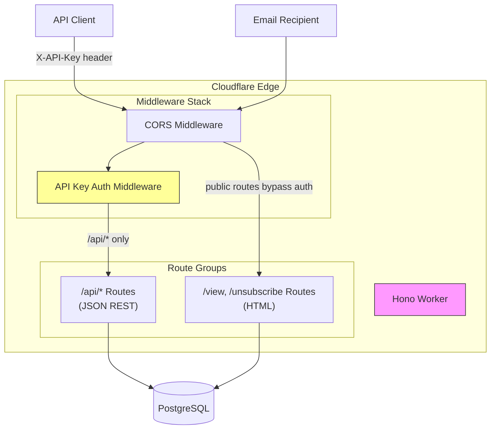

# Design Document: Email Workers

## Overview

This design describes a single Cloudflare Worker application that serves as the API and public-facing layer for the email campaign management system. The Worker connects to the existing PostgreSQL database using the `pg` driver and exposes two groups of routes:

1. **API routes** (`/api/*`) — JSON REST endpoints for managing email lists, subscribers, campaigns, and campaign sends. Protected by API key authentication.
2. **Public routes** (`/view/:campaignId`, `/unsubscribe`) — HTML pages for campaign browser view and unsubscribe flow. No authentication required.

The application uses [Hono](https://hono.dev/) as the HTTP framework for routing and middleware, and the `pg` library for PostgreSQL connectivity. Hono is the recommended lightweight framework for Cloudflare Workers, providing Express-like routing with native Workers support.

### Key Design Decisions

- **Single Worker**: All routes (API + public) are served by one Worker to simplify deployment and share the database connection logic. Route prefixes distinguish protected vs. public endpoints.
- **Hono framework**: Chosen over raw `fetch` handler for clean route definitions, middleware support (CORS, auth), and HTML response helpers.
- **`pg` (node-postgres)**: The recommended PostgreSQL driver for Cloudflare Workers with `nodejs_compat`. Supports parameterized queries out of the box.
- **No ORM**: Direct SQL with parameterized queries keeps the Worker lightweight and avoids unnecessary abstraction over 5 well-defined tables.
- **Hyperdrive-ready**: The design supports Cloudflare Hyperdrive for connection pooling and query acceleration, configured via `wrangler.toml` binding.

## Architecture



### Request Flow

1. All requests hit the Hono router.
2. CORS middleware runs on every request, setting `Access-Control-Allow-Origin: *` and related headers.
3. For `/api/*` routes, the auth middleware checks the `X-API-Key` header against the stored `API_KEY` secret using constant-time comparison. Requests without a valid key are rejected with 401/403.
4. Public routes (`/view/:campaignId`, `/unsubscribe`) bypass auth middleware entirely.
5. Route handlers create a `pg.Client` connection using the `DATABASE_URL` secret (or Hyperdrive binding), execute parameterized queries, and return responses.

## Components and Interfaces

### 1. Worker Entry Point (`src/index.ts`)

The main Hono application that registers middleware and mounts route groups.

```typescript
// Env type for Cloudflare Worker bindings
interface Env {
  DATABASE_URL: string;
  API_KEY: string;
  HYPERDRIVE?: Hyperdrive; // Optional Hyperdrive binding
}
```

### 2. Middleware

#### CORS Middleware
Applies to all routes. Sets headers:
- `Access-Control-Allow-Origin: *`
- `Access-Control-Allow-Methods: GET, POST, PUT, DELETE, OPTIONS`
- `Access-Control-Allow-Headers: Content-Type, X-API-Key`

Handles `OPTIONS` preflight requests with 204 response.

#### API Key Auth Middleware
Applies only to `/api/*` routes. Checks:
- Presence of `X-API-Key` header → 401 `{"error": "Missing API key"}` if absent
- Value matches `API_KEY` secret using constant-time comparison → 403 `{"error": "Invalid API key"}` if mismatch

Constant-time comparison uses `crypto.subtle.timingSafeEqual` (available in Workers runtime with `nodejs_compat`) by encoding both strings to `Uint8Array` and comparing the HMAC digests to prevent timing attacks.

### 3. Database Module (`src/db.ts`)

Provides a helper to create a connected `pg.Client` instance from the environment bindings.

```typescript
import { Client } from "pg";

export async function getClient(env: Env): Promise<Client> {
  const connectionString = env.HYPERDRIVE?.connectionString ?? env.DATABASE_URL;
  const client = new Client({ connectionString });
  await client.connect();
  return client;
}
```

All queries use parameterized syntax (`$1`, `$2`, etc.) to prevent SQL injection.

### 4. API Route Handlers

Each resource group is a separate Hono router mounted under `/api`.

#### Lists Router (`src/routes/lists.ts`)
| Method | Path | Handler | Status |
|--------|------|---------|--------|
| POST | `/api/lists` | Create list | 201 |
| GET | `/api/lists` | List all | 200 |
| GET | `/api/lists/:id` | Get by ID | 200 |
| PUT | `/api/lists/:id` | Update | 200 |
| DELETE | `/api/lists/:id` | Delete | 204 |

#### Subscribers Router (`src/routes/subscribers.ts`)
| Method | Path | Handler | Status |
|--------|------|---------|--------|
| POST | `/api/lists/:id/subscribers` | Add subscriber | 201 |
| GET | `/api/lists/:id/subscribers` | List subscribers | 200 |
| DELETE | `/api/lists/:id/subscribers/:subscriberId` | Remove subscriber | 204 |

Before inserting a subscriber, the handler checks:
1. The referenced `email_list` exists (404 if not)
2. The email is not already subscribed to this list (409 if duplicate)
3. The email is not in the `email_opt_out` table (422 if opted out)

#### Campaigns Router (`src/routes/campaigns.ts`)
| Method | Path | Handler | Status |
|--------|------|---------|--------|
| POST | `/api/campaigns` | Create campaign | 201 |
| GET | `/api/campaigns` | List all | 200 |
| GET | `/api/campaigns/:id` | Get by ID | 200 |
| PUT | `/api/campaigns/:id` | Update | 200 |
| DELETE | `/api/campaigns/:id` | Delete | 204 |

On create, `status` defaults to `'draft'`. On update, `updated_at` is set to `NOW()`. If `email_list_id` is provided, the handler validates it exists (422 if not).

#### Sends Router (`src/routes/sends.ts`)
| Method | Path | Handler | Status |
|--------|------|---------|--------|
| GET | `/api/campaigns/:id/sends` | List sends for campaign | 200 |
| GET | `/api/campaigns/:id/sends/:sendId` | Get send by ID | 200 |

### 5. Public Route Handlers

#### Campaign Browser View (`src/routes/view.ts`)
- **GET `/view/:campaignId`** — Queries the campaign record. Returns `body_html` as `text/html`. Falls back to `body_text` wrapped in a basic HTML template if `body_html` is empty/null. Injects an unsubscribe link at the bottom of the page. Returns a 404 HTML error page if the campaign doesn't exist.

#### Unsubscribe Flow (`src/routes/unsubscribe.ts`)
- **GET `/unsubscribe?email=...&list_id=...`** — Renders an HTML form with the subscriber's email and options to unsubscribe from the specific list or opt out globally. If the subscriber doesn't exist for the given list, only the global opt-out option is shown. Returns 400 HTML error if `email` or `list_id` is missing.
- **POST `/unsubscribe`** — Processes the form submission:
  - "Unsubscribe from list": Updates subscriber `status` to `'unsubscribed'`, sets `unsubscribed_at`.
  - "Opt out globally": Inserts into `email_opt_out` (skips if already exists), updates all subscriber records for that email to `'unsubscribed'`.
  - Renders a confirmation HTML page.

### 6. Error Handling

A global error handler catches unhandled exceptions and returns:
- For `/api/*` routes: JSON `{"error": "Internal server error"}` with status 500
- For public routes: HTML error page with status 500
- Database connection failures: status 503 with `{"error": "Service unavailable"}`

A "not found" handler returns 404 for unmatched routes. A method-not-allowed check returns 405 for unsupported HTTP methods on known routes.


## Data Models

The Worker operates on the existing PostgreSQL schema. No schema changes are required. Below are the TypeScript interfaces representing each table's row shape as used in the Worker code.

```typescript
interface EmailList {
  id: number;
  name: string;
  description: string | null;
  created_at: Date;
  updated_at: Date;
}

interface EmailListSubscriber {
  id: number;
  email: string;
  email_list_id: number;
  status: string; // 'subscribed' | 'unsubscribed'
  subscribed_at: Date;
  unsubscribed_at: Date | null;
  unsubscribe_reason: string | null;
}

interface EmailCampaign {
  id: number;
  name: string;
  subject: string;
  body_html: string | null;
  body_text: string | null;
  email_list_id: number | null;
  status: string; // 'draft' | 'sending' | 'sent'
  scheduled_at: Date | null;
  sent_at: Date | null;
  created_at: Date;
  updated_at: Date;
}

interface EmailCampaignSend {
  id: number; // bigint in DB, number in JS for typical ranges
  email_campaign_id: number;
  email: string;
  status: string; // 'queued' | 'sent' | 'delivered' | 'opened' | 'clicked' | 'bounced'
  sent_at: Date | null;
  delivered_at: Date | null;
  opened_at: Date | null;
  clicked_at: Date | null;
  bounced_at: Date | null;
  created_at: Date;
}

interface EmailOptOut {
  id: number;
  email: string;
  reason: string | null;
  opted_out_at: Date;
}
```

### Request/Response Shapes

**Create List** (POST `/api/lists`):
```json
// Request
{ "name": "Newsletter", "description": "Weekly updates" }
// Response (201)
{ "id": 1, "name": "Newsletter", "description": "Weekly updates", "created_at": "...", "updated_at": "..." }
```

**Create Subscriber** (POST `/api/lists/:id/subscribers`):
```json
// Request
{ "email": "user@example.com" }
// Response (201)
{ "id": 1, "email": "user@example.com", "email_list_id": 1, "status": "subscribed", "subscribed_at": "..." }
```

**Create Campaign** (POST `/api/campaigns`):
```json
// Request
{ "name": "Launch", "subject": "We're live!", "body_html": "<h1>Hello</h1>", "body_text": "Hello", "email_list_id": 1, "scheduled_at": "2025-01-15T10:00:00Z" }
// Response (201)
{ "id": 1, "name": "Launch", "subject": "We're live!", "status": "draft", ... }
```

**Error Response** (all API errors):
```json
{ "error": "Human-readable error message" }
```

### SQL Query Patterns

All queries use parameterized syntax. Examples:

```sql
-- Create list
INSERT INTO email_list (name, description) VALUES ($1, $2) RETURNING *;

-- Get list by ID
SELECT * FROM email_list WHERE id = $1;

-- Update list
UPDATE email_list SET name = $1, description = $2, updated_at = NOW() WHERE id = $3 RETURNING *;

-- Delete list
DELETE FROM email_list WHERE id = $1;

-- Check subscriber duplicate
SELECT id FROM email_list_subscriber WHERE email = $1 AND email_list_id = $2;

-- Check opt-out
SELECT id FROM email_opt_out WHERE email = $1;

-- Add subscriber
INSERT INTO email_list_subscriber (email, email_list_id, status, subscribed_at)
VALUES ($1, $2, 'subscribed', NOW()) RETURNING *;

-- Unsubscribe from list
UPDATE email_list_subscriber SET status = 'unsubscribed', unsubscribed_at = NOW()
WHERE email = $1 AND email_list_id = $2;

-- Global opt-out
INSERT INTO email_opt_out (email, opted_out_at) VALUES ($1, NOW()) ON CONFLICT DO NOTHING;
UPDATE email_list_subscriber SET status = 'unsubscribed', unsubscribed_at = NOW() WHERE email = $1;
```


## Correctness Properties

*A property is a characteristic or behavior that should hold true across all valid executions of a system — essentially, a formal statement about what the system should do. Properties serve as the bridge between human-readable specifications and machine-verifiable correctness guarantees.*

### Property 1: List creation preserves input data

*For any* valid name and optional description, creating an email list via POST `/api/lists` should return status 201 with a response containing the provided name and description, plus a generated `id` and timestamps.

**Validates: Requirements 1.1**

### Property 2: List update preserves input and refreshes timestamp

*For any* existing email list and any valid update payload containing a name and/or description, updating via PUT `/api/lists/:id` should return status 200 with the updated fields reflected and `updated_at` set to a value no earlier than the request time.

**Validates: Requirements 1.4**

### Property 3: List creation rejects payloads missing required name

*For any* JSON payload that does not contain a non-empty `name` field, POST `/api/lists` should return status 400 with a JSON body containing an `error` field.

**Validates: Requirements 1.7**

### Property 4: Subscriber creation preserves email and links to list

*For any* valid email address and existing email list, creating a subscriber via POST `/api/lists/:id/subscribers` should return status 201 with the provided email, the correct `email_list_id`, and status `'subscribed'`.

**Validates: Requirements 2.1**

### Property 5: Duplicate subscriber email is rejected

*For any* email address already subscribed to a given email list, attempting to subscribe the same email to the same list again should return status 409.

**Validates: Requirements 2.4**

### Property 6: Opted-out email cannot be subscribed

*For any* email address present in the `email_opt_out` table, attempting to subscribe that email to any list should return status 422.

**Validates: Requirements 2.5**

### Property 7: Campaign creation defaults to draft status

*For any* valid campaign payload with name and subject, creating a campaign via POST `/api/campaigns` should return status 201 with `status` equal to `'draft'` and all provided fields preserved.

**Validates: Requirements 3.1**

### Property 8: Campaign update preserves input and refreshes timestamp

*For any* existing campaign and any valid update payload, updating via PUT `/api/campaigns/:id` should return status 200 with the updated fields reflected and `updated_at` set to a value no earlier than the request time.

**Validates: Requirements 3.4**

### Property 9: Campaign creation rejects payloads missing required fields

*For any* JSON payload that is missing a non-empty `name` or `subject` field, POST `/api/campaigns` should return status 400 with a JSON body containing an `error` field.

**Validates: Requirements 3.7**

### Property 10: Browser view renders campaign HTML with unsubscribe link

*For any* campaign with non-empty `body_html`, GET `/view/:campaignId` should return status 200 with Content-Type `text/html`, a body containing the campaign's HTML content, and an unsubscribe link.

**Validates: Requirements 5.1, 5.4**

### Property 11: Unsubscribe from list updates subscriber status

*For any* subscriber with status `'subscribed'`, submitting an unsubscribe-from-list action should set the subscriber's status to `'unsubscribed'` and set `unsubscribed_at` to a non-null timestamp.

**Validates: Requirements 6.2**

### Property 12: Global opt-out unsubscribes all lists

*For any* email address subscribed to one or more lists, submitting a global opt-out should insert a record in `email_opt_out` and set all subscriber records for that email to status `'unsubscribed'`.

**Validates: Requirements 6.3**

### Property 13: Global opt-out is idempotent

*For any* email address, submitting a global opt-out multiple times should result in exactly one record in the `email_opt_out` table and a confirmation page on each submission.

**Validates: Requirements 6.6**

### Property 14: Missing API key returns 401

*For any* request to any `/api/*` route that does not include the `X-API-Key` header, the response should be status 401 with body `{"error": "Missing API key"}`.

**Validates: Requirements 8.1, 8.3**

### Property 15: Invalid API key returns 403

*For any* request to any `/api/*` route with an `X-API-Key` header value that does not match the stored secret, the response should be status 403 with body `{"error": "Invalid API key"}`.

**Validates: Requirements 8.4**

### Property 16: Public routes are accessible without authentication

*For any* request to `/view/:campaignId` or `/unsubscribe`, the response should not be 401 or 403 regardless of whether an `X-API-Key` header is present.

**Validates: Requirements 8.6**

### Property 17: API error responses are well-formed JSON

*For any* error response from an `/api/*` route, the Content-Type header should be `application/json` and the body should be a JSON object containing an `error` string field.

**Validates: Requirements 9.1, 9.4**

### Property 18: Malformed JSON request body returns 400

*For any* non-parseable string sent as the request body to a POST or PUT `/api/*` endpoint, the response should be status 400 with a JSON error message.

**Validates: Requirements 9.3**

### Property 19: CORS headers present on all responses

*For any* request to any route, the response should include `Access-Control-Allow-Origin` header.

**Validates: Requirements 9.5**

## Error Handling

### API Routes (`/api/*`)

All errors return JSON with the shape `{"error": "<message>"}` and appropriate HTTP status codes:

| Status | Condition | Example |
|--------|-----------|---------|
| 400 | Missing required fields, malformed JSON | `{"error": "Name is required"}` |
| 401 | Missing `X-API-Key` header | `{"error": "Missing API key"}` |
| 403 | Invalid API key | `{"error": "Invalid API key"}` |
| 404 | Resource not found | `{"error": "List not found"}` |
| 405 | Unsupported HTTP method | `{"error": "Method not allowed"}` |
| 409 | Duplicate subscriber | `{"error": "Email already subscribed to this list"}` |
| 422 | Referential integrity violation or opt-out | `{"error": "Email has globally opted out"}` |
| 500 | Unhandled exception | `{"error": "Internal server error"}` |
| 503 | Database connection failure | `{"error": "Service unavailable"}` |

### Public Routes

Errors return HTML pages with user-friendly messages:
- **400**: "Bad Request" page for missing query parameters
- **404**: "Not Found" page for missing campaigns
- **500**: "Something went wrong" page for unhandled errors

### Database Error Handling

The database module wraps connection attempts in try/catch. If `client.connect()` throws, the error handler returns 503. Query errors within route handlers are caught and returned as 500 (API) or 500 HTML (public).

### JSON Parsing

POST and PUT handlers wrap `request.json()` in try/catch. Parse failures return 400 with `{"error": "Invalid JSON"}`.

## Testing Strategy

### Dual Testing Approach

The testing strategy combines unit tests and property-based tests for comprehensive coverage.

### Property-Based Tests

**Library**: [fast-check](https://github.com/dubzzz/fast-check) — the standard PBT library for TypeScript/JavaScript.

**Configuration**: Minimum 100 iterations per property test.

**Tag format**: Each test is tagged with a comment referencing the design property:
```typescript
// Feature: email-workers, Property 1: List creation preserves input data
```

Property-based tests cover the 19 correctness properties defined above. They focus on:
- Input validation across many payload shapes (Properties 3, 9, 18)
- CRUD round-trip correctness (Properties 1, 2, 4, 7, 8)
- Business rule enforcement across all inputs (Properties 5, 6, 11, 12, 13)
- Auth middleware behavior across all routes (Properties 14, 15, 16)
- Response format consistency (Properties 17, 19)
- Browser view rendering (Property 10)

### Unit Tests

Unit tests complement property tests by covering:
- **Specific examples**: GET all lists returns correct array, GET by ID returns correct record
- **Edge cases**: Non-existent IDs return 404, empty body_html falls back to body_text, missing query params return 400
- **Integration points**: Database connection setup, Hyperdrive binding fallback
- **Smoke tests**: wrangler.toml has required fields, package.json has required dependencies

### Test Infrastructure

- **Framework**: Vitest (standard for Cloudflare Workers projects)
- **Mocking**: Database interactions are mocked using a fake `pg.Client` that records queries and returns canned results. This keeps tests fast and avoids requiring a real database.
- **Hono test client**: Hono provides `app.request()` for testing route handlers without HTTP overhead.

### Test Organization

```
src/
  __tests__/
    properties/
      lists.property.test.ts
      subscribers.property.test.ts
      campaigns.property.test.ts
      auth.property.test.ts
      errors.property.test.ts
      public.property.test.ts
    unit/
      lists.test.ts
      subscribers.test.ts
      campaigns.test.ts
      sends.test.ts
      view.test.ts
      unsubscribe.test.ts
      auth.test.ts
      cors.test.ts
```
