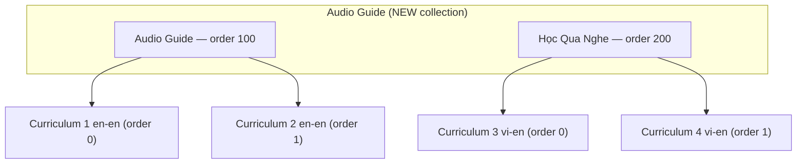
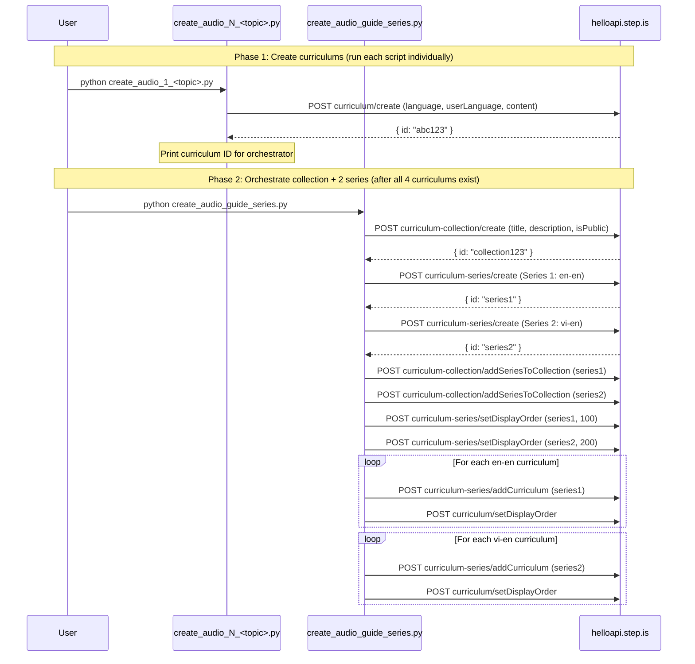

# Design Document: Audio-Guide Curriculum

## Overview

This feature introduces a new curriculum type `audio_guide` and creates 4 initial curriculums demonstrating it. Unlike the existing `balanced_skills` type (18 words, 5 sessions, balanced reading + writing + speaking), `audio_guide` makes `introAudio` the centerpiece — delivering content like a podcast or audiobook. Learners absorb language primarily through extended audio lessons (800-1000 words each, 2× the normal length). Multiple `introAudio` activities per session. No speaking, no writing — pure receptive learning. Vocabulary is reduced to 10 words (2 groups of 5) as scaffolding for listening comprehension, not as the primary learning goal.

The type has two variants:

1. **Single-language (en-en, advanced)** — 4 sessions. 2 `introAudio` per learning session (S1-S2): one extended (800-1000 words, deep dive + vocab teaching) and one supplementary (anecdotes, usage patterns). No `speakFlashcards`, `speakReading`, `speak`, `writingSentence`, `writingParagraph`. No `vocabLevel2` except S3. No `vocabLevel3`. `readAlong` replaces `reading` in S1-S2. S4 is the only session with a `reading` activity.
2. **Bilingual (vi-en, intermediate)** — 4 sessions. 3 `introAudio` per learning session (S1-S2): one bilingual vocab teaching, one supplementary, one mini-story in target_language. Even more audio-heavy because beginners benefit from repeated listening. `vocabLevel2` only in S3. No `vocabLevel3`.

The implementation consists of standalone Python scripts calling the helloapi REST API. A new collection is created with two series (one per variant, since bilingual and single-language cannot be mixed in the same series). One orchestrator script handles collection creation, both series, and all wiring.

### Key Design Decisions

1. **New collection via API** — The orchestrator creates one collection, then two series within it. Same API pattern as writing-focus, speaking-focus, song-based, movie-based, and podcast-based series.
2. **Two series, one collection** — Single-language (en-en) and bilingual (vi-en) curriculums cannot share a series (language homogeneity rule). Series 1: 2 single-language audio_guide curriculums. Series 2: 2 bilingual audio_guide curriculums.
3. **One script per curriculum** — Same pattern as all other series. Each script is ~500-800 lines with all hand-written content.
4. **One orchestrator for collection + both series** — A single `create_audio_guide_series.py` handles collection creation, both series creation, adding curriculums, setting display orders, and wiring both series into the collection.
5. **10 vocab words (2 groups of 5)** — Unlike balanced_skills (18 words, 3 groups of 6). Vocabulary serves listening comprehension, not the other way around.
6. **4 sessions** — S1-S2 are audio learning sessions (extended introAudio + light vocab + readAlong). S3 is audio review (all 10 words + vocabLevel2). S4 is full audio + reading + farewell.
7. **`introAudio` is the signature activity** — Multiple per session. 800-1000 words each in S1-S2 (2× normal). This is what distinguishes audio_guide from all other types.
8. **No speaking activities** — `speakFlashcards`, `speakReading`, and `speak` are dropped entirely. Pure receptive learning.
9. **No writing activities** — `writingSentence` and `writingParagraph` are dropped entirely. This is designed for commuters, passive learners, people who want to absorb.
10. **`vocabLevel2` only in S3** — Light-touch vocab reinforcement. S1-S2 use only `vocabLevel1`. No `vocabLevel3` anywhere.
11. **`readAlong` replaces `reading` in S1-S2** — Learners listen to passages, not read them. S4 is the only session with a `reading` activity.
12. **No youtubeUrl** — audio_guide curriculums use authored content, not media excerpts.
13. **Bilingual S1-S2 have 3 introAudio** — The third is a mini-story in target_language using the session's vocabulary at slow pace — comprehensible input for beginners.
14. **S3 bilingual has quiz-style introAudio** — "What word means...?" format with pauses for thinking — interactive audio review.

### Initial 4 Curriculums

| # | Variant | Language Pair | Level | Series |
|---|---|---|---|---|
| 1 | Single-language | en-en | Advanced | Series 1: Audio Guide (English) |
| 2 | Single-language | en-en | Advanced | Series 1: Audio Guide (English) |
| 3 | Bilingual | vi-en | Intermediate | Series 2: Học Qua Nghe |
| 4 | Bilingual | vi-en | Intermediate | Series 2: Học Qua Nghe |

## Architecture



### Execution Flow



## Components and Interfaces

### Folder Structure

```
audio-guide-curriculum/
├── create_audio_1_<topic>.py             # Single-language curriculum 1
├── create_audio_2_<topic>.py             # Single-language curriculum 2
├── create_audio_3_<topic>.py             # Bilingual curriculum 1
├── create_audio_4_<topic>.py             # Bilingual curriculum 2
└── create_audio_guide_series.py          # Orchestrator (collection + 2 series + wiring)
```

After successful creation and verification, all `.py` scripts are deleted, leaving only `README.md`.

### Curriculum Script Interface

Each `create_audio_N_<topic>.py` script:

1. Imports `firebase_token.get_firebase_id_token`
2. Defines `STRIP_KEYS` set and `strip()` function inline
3. Defines vocabulary lists: `W1` (5 words), `W2` (5 words), `ALL` (10 words)
4. Defines readAlong passages: `PASSAGE_1` (S1 passage), `PASSAGE_2` (S2 passage), `FULL_ARTICLE` (S4 combined/extended passage)
5. Builds `content` dict with all hand-written text
6. Runs `validate(content)` to check structural properties before upload
7. Calls `POST curriculum/create` with appropriate `language`/`userLanguage` at top level
8. Prints the created curriculum ID

### Orchestrator Script Interface

`create_audio_guide_series.py`:

1. Takes 4 curriculum IDs as constants (2 en-en, 2 vi-en)
2. Creates collection with descriptive title and persuasive description, `isPublic: true`
3. Creates Series 1 (en-en) with English title/description, `isPublic: true`
4. Creates Series 2 (vi-en) with Vietnamese title/description, `isPublic: true`
5. Wires both series into the collection
6. Sets display orders: Series 1 = 100, Series 2 = 200
7. Adds curriculums to their respective series with display orders 0, 1

### API Calls Used

| Endpoint | Purpose | Auth |
|---|---|---|
| `curriculum/create` | Create each curriculum | AuthGuard |
| `curriculum-collection/create` | Create the audio-guide collection | SuperAuthGuard |
| `curriculum-series/create` | Create each series (×2) | SuperAuthGuard |
| `curriculum-collection/addSeriesToCollection` | Add each series to collection (×2) | SuperAuthGuard |
| `curriculum-series/setDisplayOrder` | Set series order within collection (×2) | SuperAuthGuard |
| `curriculum-series/addCurriculum` | Add curriculum to series (×4) | SuperAuthGuard |
| `curriculum/setDisplayOrder` | Set curriculum order within series (×4) | SuperAuthGuard |

### Authentication

All scripts use the shared `firebase_token.py` helper:
```python
sys.path.insert(0, "/home/ubuntu/nspaceresearch/design-curriculums")
from firebase_token import get_firebase_id_token
UID = "zs5AMpVfqkcfDf8CJ9qrXdH58d73"
token = get_firebase_id_token(UID)
```

Token is refreshed before each API call that requires SuperAuthGuard.

## Data Models

### Curriculum Content Structure — Single-Language Variant (en-en)

```python
content = {
    "title": "Audio Guide: <Topic Title>",
    "description": "Multi-paragraph persuasive copy in English (5-beat structure, audio-learning-focused)",
    "preview": {
        "text": "~150 word vivid marketing copy about the audio learning journey and topic"
    },
    "learningSessions": [
        # Session 1: Audio Lesson + Light Vocab (5 activities)
        {
            "title": "Session 1: Audio Lesson + Light Vocab",
            "activities": [
                # introAudio (extended: 800-1000 words — deep dive into topic + teach 5 words)
                # introAudio (supplementary: real-world anecdotes and usage patterns for the 5 words)
                # viewFlashcards (W1)
                # vocabLevel1 (W1)
                # readAlong (listen to a short passage that uses the words)
            ]
        },
        # Session 2: Audio Lesson + Light Vocab (5 activities)
        {
            "title": "Session 2: Audio Lesson + New Vocabulary",
            "activities": [
                # introAudio (extended: 800-1000 words — second angle on topic + teach 5 more words, recap S1)
                # introAudio (supplementary: compare/contrast S1 and S2 words, usage nuances)
                # viewFlashcards (W2)
                # vocabLevel1 (W2)
                # readAlong (listen to a short passage)
            ]
        },
        # Session 3: Audio Review (4 activities)
        {
            "title": "Session 3: Audio Review",
            "activities": [
                # introAudio (extended review: walk through all 10 words with fresh examples)
                # viewFlashcards (all 10)
                # vocabLevel1 (all 10)
                # vocabLevel2 (all 10)
            ]
        },
        # Session 4: Full Audio + Reading (4 activities)
        {
            "title": "Session 4: Full Audio + Reading",
            "activities": [
                # introAudio (recap the full learning journey)
                # reading (full article)
                # readAlong (listen to full article)
                # introAudio (farewell — review each word one final time)
            ]
        }
    ]
}
```

### Session Activity Sequences — Single-Language Variant (Exact)

| Session | Activity Order | Count |
|---|---|---|
| S1 (audio lesson + light vocab) | introAudio, introAudio, viewFlashcards, vocabLevel1, readAlong | 5 |
| S2 (audio lesson + new vocab) | introAudio, introAudio, viewFlashcards, vocabLevel1, readAlong | 5 |
| S3 (audio review) | introAudio, viewFlashcards, vocabLevel1, vocabLevel2 | 4 |
| S4 (full audio + reading) | introAudio, reading, readAlong, introAudio | 4 |

### Curriculum Content Structure — Bilingual Variant (vi-en)

```python
content = {
    "title": "Học Qua Nghe: <Tên Chủ Đề>",
    "description": "Multi-paragraph persuasive copy in Vietnamese (5-beat structure, audio-learning-focused)",
    "preview": {
        "text": "~150 word vivid marketing copy in Vietnamese about the audio learning journey"
    },
    "learningSessions": [
        # Session 1: Bilingual Audio Lesson (6 activities)
        {
            "title": "Buổi 1: Bài nghe + Từ vựng",
            "activities": [
                # introAudio (bilingual: explain topic in user_language, teach 5 words with pronunciation, definitions in both languages, 3 example sentences each)
                # introAudio (supplementary: usage tips, common mistakes, cultural context — in user_language)
                # introAudio (mini-story using all 5 words — in target_language, slow pace)
                # viewFlashcards (W1)
                # vocabLevel1 (W1)
                # readAlong (listen to the mini-story again)
            ]
        },
        # Session 2: Bilingual Audio Lesson (6 activities)
        {
            "title": "Buổi 2: Bài nghe + Từ vựng mới",
            "activities": [
                # introAudio (teach 5 more words, brief recap of S1)
                # introAudio (supplementary)
                # introAudio (mini-story with S2 words)
                # viewFlashcards (W2)
                # vocabLevel1 (W2)
                # readAlong (listen to mini-story again)
            ]
        },
        # Session 3: Audio Review (5 activities)
        {
            "title": "Buổi 3: Ôn tập qua nghe",
            "activities": [
                # introAudio (review all 10 words in user_language with fresh examples)
                # introAudio (quiz-style: "What word means...?" with pauses for thinking)
                # viewFlashcards (all 10)
                # vocabLevel1 (all 10)
                # vocabLevel2 (all 10)
            ]
        },
        # Session 4: Full Audio + Listening (4 activities)
        {
            "title": "Buổi 4: Nghe toàn bộ + Đọc",
            "activities": [
                # introAudio (recap journey)
                # reading (full text — bilingual)
                # readAlong (listen to full text)
                # introAudio (farewell — each word reviewed with a fresh sentence)
            ]
        }
    ]
}
```

### Session Activity Sequences — Bilingual Variant (Exact)

| Session | Activity Order | Count |
|---|---|---|
| S1 (bilingual audio lesson) | introAudio, introAudio, introAudio, viewFlashcards, vocabLevel1, readAlong | 6 |
| S2 (bilingual audio lesson) | introAudio, introAudio, introAudio, viewFlashcards, vocabLevel1, readAlong | 6 |
| S3 (audio review) | introAudio, introAudio, viewFlashcards, vocabLevel1, vocabLevel2 | 5 |
| S4 (full audio + reading) | introAudio, reading, readAlong, introAudio | 4 |

### Activity Data Shapes

| Activity Type | Data Fields |
|---|---|
| `introAudio` | `{ text: string, audioSpeed: 0.01 }` |
| `viewFlashcards` | `{ vocabList: string[], audioSpeed: -0.1 }` |
| `vocabLevel1` | `{ vocabList: string[], audioSpeed: -0.1 }` |
| `vocabLevel2` | `{ vocabList: string[], audioSpeed: -0.1 }` (S3 only) |
| `reading` | `{ text: string, audioSpeed: -0.1 }` (S4 only) |
| `readAlong` | `{ text: string, audioSpeed: -0.1 }` |

### Strip Keys Set

```python
STRIP_KEYS = {
    "mp3Url", "illustrationSet", "chapterBookmarks", "segments",
    "whiteboardItems", "userReadingId", "lessonUniqueId",
    "curriculumTags", "taskId", "imageId"
}
```

### Key Differences from Balanced_Skills, Writing_Focus, and Speaking_Focus

| Aspect | Balanced_Skills | Writing_Focus (SL) | Speaking_Focus (SL) | Audio_Guide (SL) | Audio_Guide (BL) |
|---|---|---|---|---|---|
| Sessions | 5 | 4 | 4 | 4 | 4 |
| Vocab words | 18 (3×6) | 10 (2×5) | 10 (2×5) | 10 (2×5) | 10 (2×5) |
| introAudio per learning session | 1 | 1 | 1 | 2 | 3 |
| introAudio word count | 400-600 | 400-600 | 400-600 | 800-1000 | 800-1000 |
| speakFlashcards | Yes | No | Yes | No | No |
| speakReading | Yes | No | Yes | No | No |
| speak | No | No | 2/session | No | No |
| writingSentence | Yes | Yes | No | No | No |
| writingParagraph | No | Yes | No | No | No |
| vocabLevel2 | Yes | Yes | SL: No, BL: Yes | S3 only | S3 only |
| vocabLevel3 | Yes | No | No | No | No |
| reading in S1-S2 | Yes | Yes | Yes | No | No |
| readAlong in S1-S2 | Yes | Yes | SL: No, BL: Yes | Yes | Yes |
| Signature activity | N/A | writingParagraph | speak | introAudio (extended) | introAudio (extended) |
| S3 purpose | Learning session 3 | Review + analytical essay | Review + extended speaking | Audio review (all 10 words) | Audio review + quiz |
| S4 purpose | Review | Capstone writing | Capstone speaking | Full audio + reading | Full audio + reading |
| Target audience | General | Writers | Speakers | Commuters, passive learners | Commuters, passive learners |
| Content model | Balanced | Writing-centric | Speaking-centric | Podcast with flashcard reinforcement | Podcast with flashcard reinforcement |

## Correctness Properties

*A property is a characteristic or behavior that should hold true across all valid executions of a system — essentially, a formal statement about what the system should do. Properties serve as the bridge between human-readable specifications and machine-verifiable correctness guarantees.*

### Property 1: Structural completeness — single-language variant

*For any* single-language audio_guide curriculum content dict, it SHALL contain exactly 10 unique vocabulary words divided into 2 groups of 5 (W1, W2), exactly 4 learning sessions, and the activity type sequences SHALL match: S1 = [introAudio, introAudio, viewFlashcards, vocabLevel1, readAlong] (5 activities), S2 = [introAudio, introAudio, viewFlashcards, vocabLevel1, readAlong] (5 activities), S3 = [introAudio, viewFlashcards, vocabLevel1, vocabLevel2] (4 activities), S4 = [introAudio, reading, readAlong, introAudio] (4 activities).

**Validates: Requirements 1.1, 1.2, 1.3, 1.4, 1.5, 1.6, 3.7, 3.8, 3.9, 3.10, 5.1, 5.3, 5.4, 6.1, 6.2, 6.5**

### Property 2: Structural completeness — bilingual variant

*For any* bilingual audio_guide curriculum content dict, it SHALL contain exactly 10 unique vocabulary words divided into 2 groups of 5 (W1, W2), exactly 4 learning sessions, and the activity type sequences SHALL match: S1 = [introAudio, introAudio, introAudio, viewFlashcards, vocabLevel1, readAlong] (6 activities), S2 = [introAudio, introAudio, introAudio, viewFlashcards, vocabLevel1, readAlong] (6 activities), S3 = [introAudio, introAudio, viewFlashcards, vocabLevel1, vocabLevel2] (5 activities), S4 = [introAudio, reading, readAlong, introAudio] (4 activities).

**Validates: Requirements 2.1, 2.2, 2.3, 2.4, 2.5, 2.6, 3.7, 3.8, 3.9, 3.10, 5.2, 5.3, 5.4, 6.1, 6.2, 6.5**

### Property 3: No speaking activities in any session

*For any* audio_guide curriculum content dict, no session SHALL contain an activity with `activityType` equal to `speakFlashcards`, `speakReading`, or `speak`.

**Validates: Requirements 3.1, 3.2, 3.3**

### Property 4: No writing activities in any session

*For any* audio_guide curriculum content dict, no session SHALL contain an activity with `activityType` equal to `writingSentence` or `writingParagraph`.

**Validates: Requirements 3.4, 3.5**

### Property 5: No vocabLevel3 in any session

*For any* audio_guide curriculum content dict, no session SHALL contain an activity with `activityType` equal to `vocabLevel3`.

**Validates: Requirements 3.6**

### Property 6: vocabLevel2 only in S3

*For any* audio_guide curriculum content dict, `vocabLevel2` SHALL appear only in Session 3 and SHALL NOT appear in S1, S2, or S4.

**Validates: Requirements 3.7, 6.5**

### Property 7: No reading activity in S1, S2, or S3

*For any* audio_guide curriculum content dict, no session other than S4 SHALL contain an activity with `activityType` equal to `reading`. S4 SHALL contain exactly one `reading` activity.

**Validates: Requirements 3.10, 5.4**

### Property 8: No auto-generated keys in content

*For any* curriculum content dict (recursively traversing all nested dicts and lists), none of the strip keys (`mp3Url`, `illustrationSet`, `chapterBookmarks`, `segments`, `whiteboardItems`, `userReadingId`, `lessonUniqueId`, `curriculumTags`, `taskId`, `imageId`) SHALL appear as keys.

**Validates: Requirements 9.1**

### Property 9: All activities and sessions have title and description

*For any* activity in any session of any curriculum, both `title` and `description` fields SHALL exist and be non-empty strings. *For any* session object, the `title` field SHALL exist and be a non-empty string.

**Validates: Requirements 8.1, 8.7**

### Property 10: Activity title format matches activity type and variant

*For any* activity in a single-language curriculum: if `activityType` is `viewFlashcards` or `vocabLevel1`, the title SHALL start with `"Flashcards:"`; if `activityType` is `vocabLevel2` (S3 only), the title SHALL start with `"Flashcards:"`; if `activityType` is `reading`, the title SHALL contain `"Read:"`; if `activityType` is `readAlong`, the title SHALL contain `"Listen:"`. *For any* activity in a bilingual curriculum: the same activity types SHALL use `"Flashcards:"`, `"Đọc:"`, and `"Nghe:"` respectively.

**Validates: Requirements 8.2, 8.3, 8.4, 8.5**

### Property 11: Language parameters at top level

*For any* single-language curriculum creation API call body, the fields `language` (value `"en"`) and `userLanguage` (value `"en"`) SHALL be present as top-level body parameters alongside `content`. *For any* bilingual curriculum creation API call body, the fields `language` (value `"en"`) and `userLanguage` (value `"vi"`) SHALL be present as top-level body parameters alongside `content`.

**Validates: Requirements 14.1, 14.2, 14.3**

### Property 12: Vocabulary words appear in readAlong passages and S4 reading

*For any* curriculum, every one of the 10 vocabulary words SHALL appear (case-insensitive) in at least one of the readAlong passage texts (PASSAGE_1, PASSAGE_2) or the S4 reading passage (FULL_ARTICLE).

**Validates: Requirements 6.6**

### Property 13: Farewell introAudio contains all vocabulary words

*For any* curriculum, the farewell introAudio script (the last introAudio activity in S4) SHALL contain all 10 vocabulary words as substrings.

**Validates: Requirements 16.7**

### Property 14: Vocabulary flashcard lists match session word groups

*For any* curriculum, the `vocabList` in viewFlashcards/vocabLevel activities in S1 SHALL equal exactly W1 (5 words), in S2 SHALL equal exactly W2 (5 words), and in S3 SHALL equal ALL (10 words).

**Validates: Requirements 6.2, 6.3**

### Property 15: Curriculum title has no difficulty level descriptors

*For any* curriculum, the `title` field in the content dict SHALL NOT contain difficulty level descriptors (e.g., "Upper-Intermediate", "Advanced", "Beginner", "Intermediate").

**Validates: Requirements 14.5**

### Property 16: Series descriptions under 255 characters

*For any* series creation call, the `description` field SHALL be a non-empty string with length ≤ 255 characters.

**Validates: Requirements 10.2, 10.3**

### Property 17: Curriculum display orders within series are sequential

*For any* series containing 2 curriculums, the display orders assigned to those curriculums SHALL be the sequential integers 0, 1.

**Validates: Requirements 11.1**

### Property 18: S1-S2 first introAudio contains session vocabulary words

*For any* curriculum, the first introAudio in S1 SHALL contain all 5 W1 vocabulary words as substrings, and the first introAudio in S2 SHALL contain all 5 W2 vocabulary words as substrings.

**Validates: Requirements 4.1, 4.2, 16.1, 16.2**

### Property 19: introAudio count per session matches variant

*For any* single-language curriculum, S1 and S2 SHALL each contain exactly 2 `introAudio` activities, S3 SHALL contain exactly 1 `introAudio` activity, and S4 SHALL contain exactly 2 `introAudio` activities. *For any* bilingual curriculum, S1 and S2 SHALL each contain exactly 3 `introAudio` activities, S3 SHALL contain exactly 2 `introAudio` activities, and S4 SHALL contain exactly 2 `introAudio` activities.

**Validates: Requirements 3.8, 4.1, 4.2, 4.3, 4.4, 4.5**

### Property 20: readAlong present in S1, S2, and S4

*For any* audio_guide curriculum, S1, S2, and S4 SHALL each contain exactly 1 `readAlong` activity. S3 SHALL NOT contain a `readAlong` activity.

**Validates: Requirements 5.1, 5.2, 5.3**

## Error Handling

### API Call Failures

Each script calls `r.raise_for_status()` after every API call. If any call fails:
- The script prints the HTTP status code and response body
- Execution stops immediately (no partial state cleanup)
- The user must manually check what was created and retry or clean up

### Common Failure Modes

| Failure | Cause | Resolution |
|---|---|---|
| 500 on `curriculum/create` | `language`/`userLanguage` missing from top-level body | Ensure both are top-level params, not just inside content |
| 500 on `curriculum-series/create` | Description exceeds 255 chars | Shorten description |
| 500 on `curriculum-collection/create` | Title exceeds 255 chars | Shorten title |
| 401 Unauthorized | Firebase token expired | Script refreshes token before each call |
| 409 or duplicate | Collection/series/curriculum already exists | Check DB, delete duplicate, retry |
| Network timeout | API unreachable | Retry the script |
| Language homogeneity violation | Mixing en-en and vi-en in same series | Use separate series (enforced by design) |

### Token Refresh Strategy

Firebase ID tokens expire after ~1 hour. For scripts making multiple sequential API calls, the token is refreshed by calling `get_firebase_id_token(UID)` before each API call rather than reusing a single token.

### Idempotency Considerations

- `curriculum/create` is NOT idempotent — running the same script twice creates duplicate curriculums
- `curriculum-collection/create` is NOT idempotent — running twice creates duplicate collections
- `curriculum-series/create` is NOT idempotent — running twice creates duplicate series
- `curriculum-series/addCurriculum` IS idempotent — adding the same curriculum twice has no effect
- `curriculum/setDisplayOrder` IS idempotent — setting the same order twice is safe
- `curriculum-collection/addSeriesToCollection` IS idempotent — adding the same series twice is safe
- If the orchestrator fails partway through, the user should check the DB state before re-running

### Orchestrator Failure Recovery

Since the orchestrator creates one collection and two series, a failure mid-way requires careful recovery:
1. If collection creation succeeds but series creation fails → note the collection ID, fix the issue, re-run with collection creation skipped (or delete the collection and re-run)
2. If Series 1 creation succeeds but Series 2 fails → note Series 1 ID, fix the issue, create Series 2 manually
3. If series creation succeeds but addSeriesToCollection fails → note both IDs, fix the issue, manually wire them
4. If curriculum addition fails → note which curriculums were added, add the remaining ones manually

## Testing Strategy

Since this project has no test framework or CI pipeline, validation is done through structural verification of the content dicts before they are sent to the API, and post-creation verification via DB queries.

### Pre-Upload Validation (Unit-Test Equivalent)

Each curriculum script includes a `validate(content, variant)` function that checks structural properties before making the API call. The `variant` parameter is either `"single-language"` or `"bilingual"` and determines which activity sequences and title formats to check.

**Single-language variant checks:**
1. Verify 10 unique vocab words across W1 (5) + W2 (5)
2. Verify 4 sessions with correct activity type sequences (5, 5, 4, 4)
3. Verify no `speakFlashcards`, `speakReading`, `speak`, `writingSentence`, `writingParagraph`, or `vocabLevel3` in any session
4. Verify `vocabLevel2` appears only in S3
5. Verify `reading` appears only in S4
6. Verify `readAlong` appears in S1, S2, and S4 (not S3)
7. Verify introAudio count: S1=2, S2=2, S3=1, S4=2
8. Verify all activities have `title` and `description`
9. Verify activity title format: `Flashcards:`, `Read:`, `Listen:`
10. Verify no strip keys present in content (recursive check)
11. Verify all 10 vocab words appear in readAlong passages or FULL_ARTICLE (case-insensitive)
12. Verify farewell introAudio (S4 last activity) contains all 10 vocab words
13. Verify vocabList in flashcard activities matches the correct word group
14. Verify curriculum title has no difficulty level descriptors
15. Verify first introAudio in S1 contains all 5 W1 words, first introAudio in S2 contains all 5 W2 words

**Bilingual variant checks:**
Same as single-language, except:
- Activity sequences: (6, 6, 5, 4)
- introAudio count: S1=3, S2=3, S3=2, S4=2
- Activity title format: `Flashcards:`, `Đọc:`, `Nghe:`

This function runs locally before any API call is made. If validation fails, the script exits with a clear error message.

### Post-Creation Verification

After all scripts have run, verify via SQL:

```sql
-- Find the new audio guide collection
SELECT id, title, description, is_public
FROM curriculum_collections
WHERE title LIKE '%Audio Guide%';

-- Verify collection has 2 series
SELECT cs.id, cs.title, cs.display_order
FROM curriculum_series cs
JOIN curriculum_collection_series ccs ON ccs.curriculum_series_id = cs.id
WHERE ccs.curriculum_collection_id = '<NEW_COLLECTION_ID>'
ORDER BY cs.display_order;

-- Verify Series 1 (en-en) has 2 curriculums
SELECT c.id, c.content->>'title' as title, c.display_order
FROM curriculum c
JOIN curriculum_series_items csi ON csi.curriculum_id = c.id
WHERE csi.curriculum_series_id = '<SERIES_1_ID>'
ORDER BY c.display_order;

-- Verify Series 2 (vi-en) has 2 curriculums
SELECT c.id, c.content->>'title' as title, c.display_order
FROM curriculum c
JOIN curriculum_series_items csi ON csi.curriculum_id = c.id
WHERE csi.curriculum_series_id = '<SERIES_2_ID>'
ORDER BY c.display_order;

-- Verify language homogeneity
SELECT * FROM curriculum_series_language_list
WHERE id IN ('<SERIES_1_ID>', '<SERIES_2_ID>');

-- Verify all curriculums are private
SELECT c.id, c.content->>'title' as title, c.is_public
FROM curriculum c
JOIN curriculum_series_items csi ON csi.curriculum_id = c.id
WHERE csi.curriculum_series_id IN ('<SERIES_1_ID>', '<SERIES_2_ID>');
```

### Validation Checklist Per Curriculum

- [ ] 10 unique vocabulary words (5 + 5)
- [ ] 4 sessions with correct activity sequences
- [ ] No speaking activities (speakFlashcards, speakReading, speak)
- [ ] No writing activities (writingSentence, writingParagraph)
- [ ] No vocabLevel3
- [ ] vocabLevel2 only in S3
- [ ] reading only in S4
- [ ] readAlong in S1, S2, S4 (not S3)
- [ ] Correct introAudio count per session per variant
- [ ] All activities have title and description
- [ ] Activity title format matches type
- [ ] No strip keys in content
- [ ] All 10 vocab words appear in passages
- [ ] Farewell introAudio contains all 10 vocab words
- [ ] First introAudio in S1 contains all W1 words, S2 contains all W2 words
- [ ] `language` and `userLanguage` at top level of API call body
- [ ] Curriculum title has no difficulty level descriptors
- [ ] Display orders set correctly (curriculum: 0-1, series: 100/200)
- [ ] Series descriptions ≤ 255 characters
