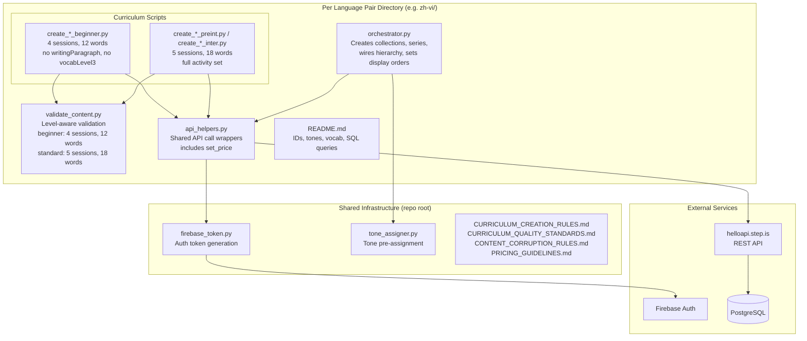
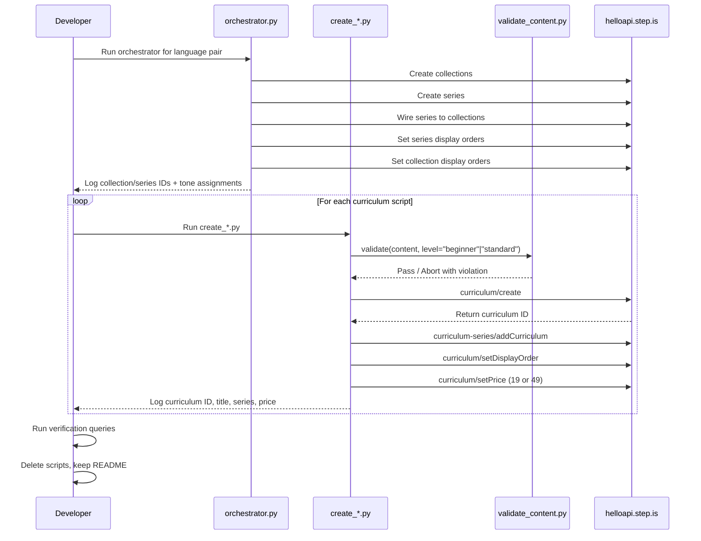

# Design Document: Bilingual Parity Expansion

## Overview

This design covers the creation of ~773 new curriculums across 6 bilingual language pairs (zh-vi, zh-en, de-en, de-vi, fr-en, fr-vi) at beginner, preintermediate, and intermediate difficulty levels to reach parity with the en-vi reference pair. The reference pair has 60 beginner, 59 preintermediate, and 63 intermediate public curriculums.

The system follows the same architecture established by the multilingual-curriculum-expansion spec: standalone Python scripts that generate curriculum JSON content and upload it via the REST API at `https://helloapi.step.is`. The key difference is the addition of **beginner-level curriculums**, which have a distinct structure (4 sessions, 12 words, no writingParagraph, no vocabLevel3) compared to the standard preintermediate/intermediate structure (5 sessions, 18 words, full activity set).

### Key Design Decisions

1. **One script per curriculum** (not batch generators): Each curriculum's learner-facing text must be individually crafted per the No Templated Content Generation rule. Template-based generation is explicitly prohibited.
2. **Unified validator with level-aware mode**: Rather than maintaining separate validators for beginner and standard curriculums, the existing `validate_content.py` is extended with a `level` parameter that switches between beginner (4 sessions, 12 words) and standard (5 sessions, 18 words) validation rules. This replaces the need for a separate `validate_short_content.py`-style module.
3. **Reuse existing shared modules**: The root-level `api_helpers.py` and `tone_assigner.py` are reused directly. Each language pair directory imports from the root or gets a local copy. The `api_helpers.py` already has `set_price()` which the old spec didn't use but this spec requires.
4. **New directories for all 6 pairs**: All 6 target pairs (zh-vi, zh-en, de-en, de-vi, fr-en, fr-vi) need new directories since none have existing bilingual curriculums. Even though the old spec created en-de, en-fr, vi-de, vi-fr (reverse direction), the new pairs have different user/target language assignments and need their own infrastructure.
5. **Phased execution by language pair**: zh-vi → zh-en → de-en → de-vi → fr-en → fr-vi, with verification gates between phases. Chinese pairs first (smallest gaps, newest pair), then German, then French.
6. **Tone pre-assignment**: All tone assignments (description + farewell) are determined before script creation and documented in the orchestrator, ensuring variety constraints are met upfront.
7. **Pricing by level**: Beginner curriculums (4 sessions) are priced at 19 credits; standard curriculums (5 sessions, preintermediate/intermediate) are priced at 49 credits.

## Architecture



### Execution Flow



## Components and Interfaces

### 1. Orchestrator Script (`orchestrator.py`)

One per language pair. Responsibilities:
- Create all collections for the language pair via `curriculum-collection/create`
- Create all series via `curriculum-series/create` with descriptions ≤255 chars
- Wire series to collections via `curriculum-collection/addSeriesToCollection`
- Set series display orders via `curriculum-series/setDisplayOrder`
- Set collection display orders via `curriculum-collection/setDisplayOrder`
- Document all tone assignments in comments (description tones + farewell tones per curriculum)
- Output all IDs to stdout for tracking

The number of collections and series per pair varies based on the gap size:

| Pair | Total Gap | Estimated Collections | Estimated Series |
|------|-----------|----------------------|-----------------|
| zh-vi | 79 | 3-4 | 12-16 |
| zh-en | 111 | 4 | 18-22 |
| de-en | 149 | 4-5 | 25-30 |
| de-vi | 155 | 4-5 | 25-31 |
| fr-en | 138 | 4-5 | 22-28 |
| fr-vi | 141 | 4-5 | 23-28 |

Interface:
```python
# No arguments — all configuration is inline
# Outputs: collection IDs, series IDs, display orders, tone assignments to stdout
# Uses: api_helpers.py, tone_assigner.py, firebase_token.py
```

### 2. Curriculum Creation Script (`create_*.py`)

One per curriculum (~773 total). Responsibilities:
- Define hand-crafted curriculum content JSON
- For beginner: 4 sessions, 12 words, no writingParagraph, no vocabLevel3
- For standard: 5 sessions, 18 words, full activity set including writingParagraph and vocabLevel3
- Validate content via `validate_content.py` with appropriate level parameter
- Upload via `curriculum/create` with `language` and `userLanguage` as top-level body params
- Add to series via `curriculum-series/addCurriculum`
- Set display order via `curriculum/setDisplayOrder`
- Set price via `curriculum/setPrice` (19 for beginner, 49 for standard)
- Log curriculum ID, title, series, price to stdout

Interface:
```python
# No arguments — content, series ID, and price are inline
# Outputs: curriculum ID, title, series context, price to stdout
# Uses: validate_content.py, api_helpers.py, firebase_token.py
```

### 3. Content Validator (`validate_content.py`)

Extended from the existing validator to support both beginner and standard structures. The key change is a `level` parameter that controls session count and vocabulary count validation.

Interface:
```python
def validate(content: dict, level: str = "standard") -> None:
    """
    Validates curriculum content JSON against all corruption detection rules.
    Raises ValueError with specific violation message if any check fails.
    
    Parameters:
        content: The curriculum content JSON dict
        level: "beginner" for 4-session/12-word structure,
               "standard" for 5-session/18-word structure (default)
    
    Checks (all levels):
    - Top-level structure (title, description, preview.text, contentTypeTags, learningSessions)
    - Session structure (correct count per level, each with title and activities)
    - Activity structure (activityType, title, description, data)
    - Activity-type-specific data rules
    - Cross-field consistency (viewFlashcards/speakFlashcards vocabList match)
    - No strip-keys present
    - vocabList contains lowercase strings only
    - Valid activityType values
    
    Beginner-specific checks:
    - Exactly 4 sessions (2 learning + 1 review + 1 final)
    - Exactly 12 unique vocabulary words (6 per learning session)
    - No writingParagraph activities
    - No vocabLevel3 activities
    
    Standard-specific checks:
    - Exactly 5 sessions (3 learning + 1 review + 1 final)
    - Exactly 18 unique vocabulary words (6 per learning session)
    """
    pass
```

### 4. API Helpers (`api_helpers.py`)

Reused from the existing root-level module. Already includes all needed functions:

```python
def get_token() -> str
def create_curriculum(content: dict, language: str, user_language: str) -> str
def add_to_series(series_id: str, curriculum_id: str) -> None
def set_display_order(curriculum_id: str, order: int) -> None
def create_collection(title: str, description: str) -> str
def create_series(title: str, description: str) -> str
def add_series_to_collection(collection_id: str, series_id: str) -> None
def set_series_display_order(series_id: str, order: int) -> None
def set_collection_display_order(collection_id: str, order: int) -> None
def set_price(curriculum_id: str, price: int) -> None
```

### 5. Tone Assignment

Uses the existing `tone_assigner.py` module. The `assign_tones_for_language_pair(num_collections, series_per_collection, curriculums_per_series)` function generates tone assignments enforcing:
- No two adjacent curriculums in a series share the same description tone or farewell tone
- No two adjacent series in a collection share the same description tone
- No single tone exceeds 30% of descriptions per language pair

For pairs with variable series sizes (some series may have more curriculums than others due to uneven gap distribution), the orchestrator may need to call the assigner with the maximum series size and trim, or assign tones manually for irregular layouts.

## Data Models

### Beginner Curriculum Content JSON Structure

```json
{
  "title": "string (User_Language, minimal)",
  "contentTypeTags": [],
  "difficultyTags": ["beginner"],
  "description": "string (User_Language, multi-paragraph persuasive copy with tone-assigned ALL-CAPS headline)",
  "preview": {
    "text": "string (User_Language, ~150 words expanded persuasive copy)"
  },
  "learningSessions": [
    {
      "title": "Session 1 title (User_Language)",
      "activities": [
        "introAudio → viewFlashcards → speakFlashcards → vocabLevel1 → vocabLevel2 → reading → speakReading → readAlong → writingSentence"
      ]
    },
    {
      "title": "Session 2 title (User_Language)",
      "activities": ["Same activity order as Session 1, different 6 words"]
    },
    {
      "title": "Review session title (User_Language)",
      "activities": ["Activities covering all 12 words + comprehensive reading"]
    },
    {
      "title": "Final reading session title (User_Language)",
      "activities": ["Full reading, readAlong, farewell introAudio — NO writingParagraph"]
    }
  ]
}
```

### Standard Curriculum Content JSON Structure (Preintermediate/Intermediate)

```json
{
  "title": "string (User_Language, minimal)",
  "contentTypeTags": [],
  "difficultyTags": ["preintermediate"] or ["intermediate"],
  "description": "string (User_Language, multi-paragraph persuasive copy)",
  "preview": {
    "text": "string (User_Language, ~150 words)"
  },
  "learningSessions": [
    {
      "title": "Session 1 title",
      "activities": [
        "introAudio → viewFlashcards → speakFlashcards → vocabLevel1 → vocabLevel2 → vocabLevel3 → reading → speakReading → readAlong → writingSentence"
      ]
    },
    {
      "title": "Session 2 title",
      "activities": ["Same as Session 1, different 6 words"]
    },
    {
      "title": "Session 3 title",
      "activities": ["Same as Session 1, different 6 words"]
    },
    {
      "title": "Review session title",
      "activities": ["Activities covering all 18 words + comprehensive reading"]
    },
    {
      "title": "Final reading session title",
      "activities": ["Full reading, readAlong, writingParagraph, farewell introAudio"]
    }
  ]
}
```

### Beginner vs Standard Session Structure Comparison

| Aspect | Beginner | Standard (Preint/Inter) |
|--------|----------|------------------------|
| Sessions | 4 (2 learning + 1 review + 1 final) | 5 (3 learning + 1 review + 1 final) |
| Total vocab words | 12 (2 groups of 6) | 18 (3 groups of 6) |
| Words per learning session | 6 | 6 |
| vocabLevel3 | ❌ Excluded | ✅ Included |
| writingParagraph | ❌ Excluded | ✅ In final session |
| Reading complexity | Simple, avg sentence <15 words | Standard for level |
| Price | 19 credits | 49 credits |
| difficultyTags | `["beginner"]` | `["preintermediate"]` or `["intermediate"]` |

### Beginner Learning Session Activity Order

| # | Activity | Data |
|---|----------|------|
| 1 | introAudio | Welcome + teach 6 words with definitions, examples |
| 2 | viewFlashcards | vocabList: 6 words |
| 3 | speakFlashcards | vocabList: 6 words (identical to viewFlashcards) |
| 4 | vocabLevel1 | vocabList: 6 words |
| 5 | vocabLevel2 | vocabList: 6 words |
| 6 | reading | Target_Language passage using session words |
| 7 | speakReading | Same passage |
| 8 | readAlong | Same passage |
| 9 | writingSentence | Prompts in User_Language, targetVocab from session |

### Standard Learning Session Activity Order

| # | Activity | Data |
|---|----------|------|
| 1 | introAudio | Welcome + teach 6 words |
| 2 | viewFlashcards | vocabList: 6 words |
| 3 | speakFlashcards | vocabList: 6 words (identical) |
| 4 | vocabLevel1 | vocabList: 6 words |
| 5 | vocabLevel2 | vocabList: 6 words |
| 6 | vocabLevel3 | vocabList: 6 words |
| 7 | reading | Target_Language passage |
| 8 | speakReading | Same passage |
| 9 | readAlong | Same passage |
| 10 | writingSentence | Prompts + targetVocab |

### Language Pair Configuration

| Pair | userLanguage | language | Beginner Gap | Preint Gap | Inter Gap | Total |
|------|-------------|----------|-------------|-----------|----------|-------|
| zh-vi | zh | vi | 31 | 22 | 26 | 79 |
| zh-en | zh | en | 60 | 23 | 28 | 111 |
| de-en | de | en | 59 | 52 | 38 | 149 |
| de-vi | de | vi | 60 | 56 | 39 | 155 |
| fr-en | fr | en | 58 | 51 | 29 | 138 |
| fr-vi | fr | vi | 60 | 55 | 26 | 141 |
| **Total** | | | **328** | **259** | **186** | **~773** |

### Bilingual Content Language Rules

| Field | Language |
|-------|----------|
| title | User_Language (zh, de, or fr) |
| description | User_Language |
| preview.text | User_Language |
| introAudio text | User_Language |
| reading passages | Target_Language (vi or en) |
| writingSentence prompts | User_Language (targetVocab in Target_Language) |
| writingParagraph prompts | User_Language (referencing Target_Language vocab) |
| Session titles | User_Language |
| Activity titles/descriptions | User_Language |

### Session Title Patterns by User Language

| User Language | Learning Session | Review Session | Final Session |
|--------------|-----------------|----------------|---------------|
| zh (Chinese) | 第1部分, 第2部分, 第3部分 | 复习 | 综合阅读 |
| de (German) | Teil 1, Teil 2, Teil 3 | Wiederholung | Abschlusslektüre |
| fr (French) | Partie 1, Partie 2, Partie 3 | Révision | Lecture finale |

### Directory Structure

```
zh-vi/
├── orchestrator.py
├── validate_content.py
├── api_helpers.py
├── create_*.py (one per curriculum, ~79 scripts)
└── README.md

zh-en/
├── orchestrator.py
├── validate_content.py
├── api_helpers.py
├── create_*.py (~111 scripts)
└── README.md

de-en/
├── orchestrator.py
├── validate_content.py
├── api_helpers.py
├── create_*.py (~149 scripts)
└── README.md

de-vi/
├── orchestrator.py
├── validate_content.py
├── api_helpers.py
├── create_*.py (~155 scripts)
└── README.md

fr-en/
├── orchestrator.py
├── validate_content.py
├── api_helpers.py
├── create_*.py (~138 scripts)
└── README.md

fr-vi/
├── orchestrator.py
├── validate_content.py
├── api_helpers.py
├── create_*.py (~141 scripts)
└── README.md
```

### API Call Sequence per Curriculum

```python
# 1. Validate content (level-aware)
validate(content, level="beginner")  # or level="standard"

# 2. Create curriculum
curriculum_id = create_curriculum(content, language="vi", user_language="zh")

# 3. Add to series
add_to_series(series_id, curriculum_id)

# 4. Set display order
set_display_order(curriculum_id, order)

# 5. Set price
set_price(curriculum_id, 19)  # beginner: 19, standard: 49
```


## Correctness Properties

*A property is a characteristic or behavior that should hold true across all valid executions of a system — essentially, a formal statement about what the system should do. Properties serve as the bridge between human-readable specifications and machine-verifiable correctness guarantees.*

The testable logic in this project falls into two domains: (1) the **Content Validator** that checks curriculum JSON structure before upload (now level-aware for beginner vs standard), and (2) the **Tone Assigner** that ensures variety constraints on description and farewell tones. Both are pure functions with clear input/output behavior suitable for property-based testing.

Many requirements (language quality, persuasive copy style, cultural adaptation, topic coverage, documentation, parity counts) describe hand-written content quality, process workflows, or post-execution verification — these are not amenable to automated property testing and are covered by manual review and integration queries.

### Property 1: Top-level structure validation

*For any* curriculum content JSON (beginner or standard), the validator SHALL accept it only if it has non-null, non-empty `title`, `description`, `preview.text` fields and a `contentTypeTags` field at the top level. Content missing any of these fields SHALL be rejected with a specific violation message.

**Validates: Requirements 5.1, 5.2, 11.4**

### Property 2: Level-aware session structure

*For any* curriculum content JSON validated at the "beginner" level, the validator SHALL accept it only if `learningSessions` is an array of exactly 4 elements. *For any* curriculum content JSON validated at the "standard" level, the validator SHALL accept it only if `learningSessions` is an array of exactly 5 elements. In both cases, each session must have a non-empty `title` string and a non-empty `activities` array.

**Validates: Requirements 2.2, 3.2, 11.5**

### Property 3: Level-aware vocabulary distribution

*For any* curriculum content JSON validated at the "beginner" level, the validator SHALL accept it only if the total unique vocabulary words across all sessions equals exactly 12, with exactly 6 unique words in each of the 2 learning sessions. *For any* curriculum content JSON validated at the "standard" level, the validator SHALL accept it only if the total unique vocabulary words equals exactly 18, with exactly 6 unique words in each of the 3 learning sessions.

**Validates: Requirements 2.1, 3.1, 11.9**

### Property 4: Beginner activity exclusions

*For any* curriculum content JSON validated at the "beginner" level, the validator SHALL reject it if any session contains a `writingParagraph` activity or a `vocabLevel3` activity. The error message SHALL identify which forbidden activity type was found and in which session.

**Validates: Requirements 2.4, 2.5**

### Property 5: Activity structure completeness

*For any* activity in any session of any curriculum content JSON, the validator SHALL accept it only if the activity has `activityType` (not `type`), `title`, `description`, and `data` fields, with `activityType` being one of the valid values (11 for standard, 9 for beginner excluding writingParagraph and vocabLevel3), and all content fields inside `data` (not inline on the activity object).

**Validates: Requirements 5.3, 5.4, 5.5, 5.6, 11.6**

### Property 6: VocabList format enforcement

*For any* viewFlashcards, speakFlashcards, vocabLevel1, vocabLevel2, or vocabLevel3 activity, the validator SHALL accept it only if `data.vocabList` is a non-empty array of lowercase strings. The field name must be `vocabList` (never `words`). Any uppercase characters, non-string elements, or use of `words` as the field name SHALL be rejected.

**Validates: Requirements 5.7, 5.8, 11.7**

### Property 7: Flashcard vocabList consistency

*For any* session containing both a viewFlashcards and a speakFlashcards activity, the validator SHALL accept it only if both activities have identical `vocabList` arrays (same elements in the same order).

**Validates: Requirements 5.9, 11.8**

### Property 8: Writing activity structure

*For any* writingSentence activity, the validator SHALL accept it only if `data.vocabList` is present, `data.items` is a non-empty array, and each item has non-empty `prompt` and `targetVocab` strings. *For any* writingParagraph activity, the validator SHALL accept it only if `data.vocabList` is present, `data.instructions` is a non-empty string, and `data.prompts` is an array of strings with length ≥ 2.

**Validates: Requirements 11.11**

### Property 9: Strip keys exclusion

*For any* curriculum content JSON, the validator SHALL reject it if any of the auto-generated strip keys (`mp3Url`, `illustrationSet`, `chapterBookmarks`, `segments`, `whiteboardItems`, `userReadingId`, `lessonUniqueId`, `curriculumTags`, `taskId`, `imageId`) appear anywhere in the JSON tree at any depth.

**Validates: Requirements 5.10, 11.10**

### Property 10: Validator rejects invalid content with specific message

*For any* curriculum content JSON that violates any structural rule, the validator SHALL raise a ValueError (not silently pass) and the error message SHALL identify the specific violation.

**Validates: Requirements 11.2**

### Property 11: Tone palette validity

*For any* tone assignment in the system, every description tone SHALL be one of the 6 valid Tone_Palette types (`provocative_question`, `bold_declaration`, `vivid_scenario`, `empathetic_observation`, `surprising_fact`, `metaphor_led`), and every farewell tone SHALL be one of the 5 valid Farewell_Palette registers (`introspective_guide`, `warm_accountability`, `team_building_energy`, `quiet_awe`, `practical_momentum`).

**Validates: Requirements 8.1, 8.5**

### Property 12: Tone adjacency constraint

*For any* sequence of tone assignments within a series (both description tones and farewell tones), and *for any* sequence of series description tones within a collection, no two adjacent entries SHALL have the same tone value.

**Validates: Requirements 8.2, 8.3, 8.6**

### Property 13: Tone distribution cap

*For any* batch of description tone assignments within a language pair, no single Tone_Palette type SHALL account for more than 30% of the total assignments.

**Validates: Requirements 8.4**

## Error Handling

### API Call Failures

- If `curriculum/create` fails, the script logs the error with curriculum title and series context, then continues (per Requirement 10.4)
- If `curriculum-series/addCurriculum`, `curriculum/setDisplayOrder`, or `curriculum/setPrice` fails after successful creation, the script logs the curriculum ID and the failed operation for manual recovery
- Network timeouts: scripts use `requests` with a 30-second timeout; failures are logged and retried once before moving on
- The `api_helpers.py` module already handles logging and re-raising exceptions

### Validation Failures

- The `validate_content.py` module raises `ValueError` with a specific violation message
- Each curriculum script wraps the validate + upload sequence in a try/except that catches `ValueError` and prints the violation without uploading
- Validation runs before any API call — no partial uploads from invalid content
- The `level` parameter must be passed correctly: "beginner" for beginner curriculums, "standard" for preintermediate/intermediate

### Duplicate Handling

- After completing each language pair, a duplicate check query runs for each curriculum title
- If duplicates are found: keep the earliest (by `created_at`), remove extras from series first, then delete the curriculum
- Duplicate check SQL is documented in each README for manual re-runs

### Recovery Strategy

- Each curriculum script is idempotent in intent — running it again creates a new curriculum (which becomes a duplicate to resolve)
- The orchestrator is NOT idempotent — collections and series should only be created once. If re-run is needed, delete existing infrastructure first
- All IDs are logged to stdout and documented in README for manual recovery

### Pricing Errors

- If `curriculum/setPrice` fails, the curriculum still exists but is unpriced. The README documents the expected price for each curriculum so it can be set manually
- Beginner curriculums: 19 credits; Standard curriculums: 49 credits

## Testing Strategy

### Property-Based Tests (Content Validator)

The `validate_content.py` module is a pure function with clear input/output behavior — ideal for property-based testing. The validator is now level-aware, so tests must cover both beginner and standard modes.

- **Library**: `hypothesis` for Python
- **Minimum iterations**: 100 per property
- **Tag format**: `# Feature: bilingual-parity-expansion, Property N: <property_text>`

Properties 1-10 test the validator against generated curriculum JSON with various structural mutations:
- Properties 1, 5-9 are shared across both levels (same structural rules apply)
- Properties 2-3 test level-specific session count and vocabulary distribution
- Property 4 tests beginner-specific activity exclusions (no writingParagraph, no vocabLevel3)
- Property 10 tests that all violations produce specific error messages

Each property test generates valid base content for the target level, then introduces specific mutations to verify the validator catches them.

### Property-Based Tests (Tone Assigner)

Properties 11-13 test the existing `tone_assigner.py` module. These tests are inherited from the old spec and should still pass since the module is reused.

- Generate random tone assignment configurations (varying collection/series/curriculum counts)
- Verify palette validity, adjacency constraints, and distribution caps
- Test both description tones and farewell tones

### Unit Tests (Example-Based)

- Verify beginner session structure: 2 learning + 1 review + 1 final, no vocabLevel3, no writingParagraph
- Verify standard session structure: 3 learning + 1 review + 1 final, includes vocabLevel3 and writingParagraph
- Verify `api_helpers.py` passes `language` and `userLanguage` as top-level body params
- Verify `set_price` is called with 19 for beginner, 49 for standard
- Verify no `setPublic` calls are made in curriculum creation scripts
- Verify learning session activity order matches the required sequence for each level
- Verify beginner reading passages have average sentence length under 15 words (spot check)

### Integration Tests (Post-Execution Verification)

Run after each language pair phase completes:

- **Parity count**: verify curriculum count per difficulty level meets or exceeds en-vi reference counts
- **Language homogeneity**: query `curriculum_series_language_list` view for each series
- **Level gap**: query `curriculum_series_level_gap` view for each series
- **Display order**: verify all curriculums have explicit display orders set
- **Pricing**: verify all beginner curriculums are priced at 19, all standard at 49
- **Vocabulary uniqueness**: verify no vocab repeats within a series
- **Duplicate check**: query for duplicate titles per UID
- **Series membership**: verify each series has the expected number of curriculums

### Manual Review

Requirements not amenable to automated testing (content quality, persuasive copy, cultural adaptation, language register, tone execution, bilingual correctness) require manual review of a sample of curriculums per language pair before proceeding to the next phase.
