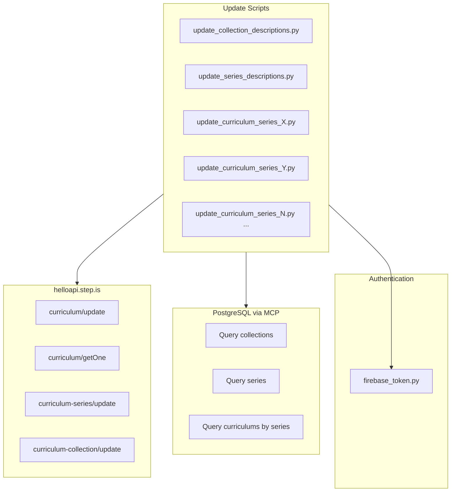
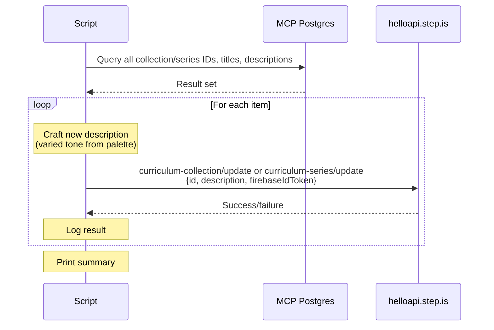
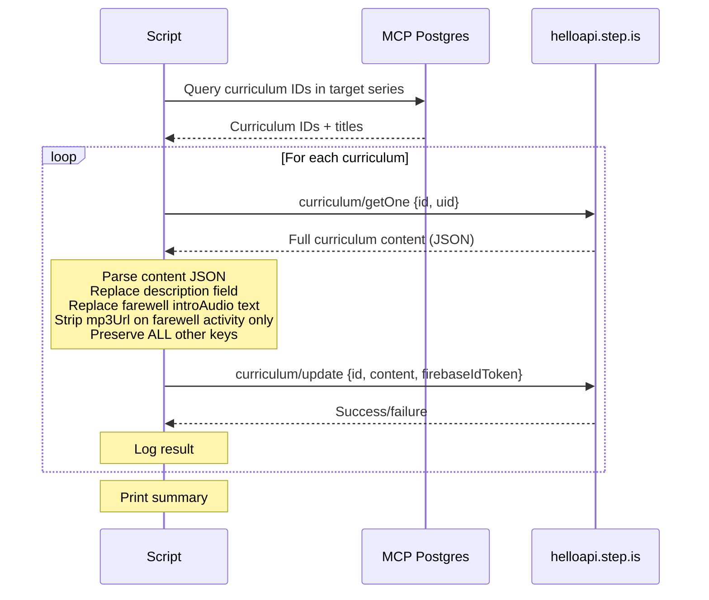

# Design Document: Description Tone Variety

## Overview

This design covers rewriting all descriptions across three content levels — curriculums, series, and collections — plus the farewell introAudio scripts in each curriculum — to replace the current monotonous "Did you know..." and formulaic sign-off patterns with varied, individually crafted persuasive copy. Each description and farewell uses a different rhetorical opener from a defined tone palette, ensuring no two adjacent items in the same grouping share the same approach.

The work is organized as three independent script sets:
1. **Collection descriptions** — One script queries all collections and updates each description via `curriculum-collection/update`
2. **Series descriptions** — One script queries all series and updates each description via `curriculum-series/update` (≤255 chars)
3. **Curriculum descriptions + farewell introAudio** — One script per series, querying all curriculums in that series and updating each via `curriculum/update` (fetch full content → replace description AND farewell introAudio text → strip mp3Url on farewell activity only → push back)

All scripts query the database in real-time for IDs — no hardcoded IDs. After verification, scripts are deleted, leaving only a README with SQL queries and recreation context.

## Architecture



### Update Flow — Collections & Series



### Update Flow — Curriculums



## Components and Interfaces

### Component 1: Collection Description Update Script

Single script that updates all collection descriptions.

```python
import sys, json, requests
sys.path.insert(0, "/home/ubuntu/nspaceresearch/design-curriculums")
from firebase_token import get_firebase_id_token

UID = "zs5AMpVfqkcfDf8CJ9qrXdH58d73"
API_BASE = "https://helloapi.step.is"

# Descriptions are hand-written per collection — stored as a dict keyed by title
# Each description uses a different tone from the palette
COLLECTION_DESCRIPTIONS = {
    "Collection Title A": "New description using provocative question...",
    "Collection Title B": "New description using bold declaration...",
    # ... one entry per collection, each individually crafted
}

def update_collections():
    token = get_firebase_id_token(UID)
    # Query DB for all collections (IDs + titles)
    # For each collection, look up its new description by title
    # POST curriculum-collection/update with {id, description, firebaseIdToken}
    # Log success/failure per item
    # Print summary
```

### Component 2: Series Description Update Script

Single script that updates all series descriptions. Must enforce ≤255 char limit.

```python
SERIES_DESCRIPTIONS = {
    "Series Title A": "Concise new description ≤255 chars...",
    "Series Title B": "Another concise description...",
    # ... one entry per series
}

def update_series():
    token = get_firebase_id_token(UID)
    # Query DB for all series (IDs + titles + parent collection)
    # For each series, look up new description by title
    # Validate len(description) <= 255
    # POST curriculum-series/update with {id, description, firebaseIdToken}
    # Do NOT send title or thumbnail
    # Log success/failure per item
    # Print summary
```

### Component 3: Curriculum Description + Farewell Update Script (one per series)

One script per series. Fetches each curriculum's full content, replaces the description AND the farewell introAudio text, strips `mp3Url` on the farewell activity only, pushes back the entire content JSON.

```python
CURRICULUM_DESCRIPTIONS = {
    "Curriculum Title A": "Full persuasive copy description...",
    "Curriculum Title B": "Different tone, different description...",
    # ... one entry per curriculum in this series
}

CURRICULUM_FAREWELLS = {
    "Curriculum Title A": "Individually crafted farewell script (~400-600 words)...",
    "Curriculum Title B": "Different tone farewell script...",
    # ... one entry per curriculum in this series
}

def update_curriculums_in_series(series_id):
    token = get_firebase_id_token(UID)
    # Query DB for curriculum IDs in this series
    # For each curriculum:
    #   1. GET full content via curriculum/getOne
    #   2. Parse content JSON
    #   3. Replace content["description"] with new text
    #   4. Find last introAudio activity in last session
    #   5. Replace its "text" field with new farewell script
    #   6. Strip "mp3Url" from that farewell activity ONLY
    #   7. POST curriculum/update with {id, content: json.dumps(full_content), firebaseIdToken}
    #   8. CRITICAL: Preserve all other generated keys on all other activities
    # Log success/failure per item
    # Print summary
```

### Component 4: Tone Palette

The 6 opener types used across all descriptions:

| Opener Type | Description | Example Pattern |
|---|---|---|
| Provocative question | Opens with a challenging "why" or "what if" question | "TẠI SAO BẠN NỖ LỰC NHƯNG VẪN THẤY MÔNG LUNG?" |
| Bold declaration | Opens with a strong, surprising statement | "NGÔN NGỮ KHÔNG CHỈ LÀ TỪ VỰNG — NÓ LÀ CHÌA KHÓA MỞ CỬA THẾ GIỚI." |
| Vivid scenario | Opens by painting a specific scene the learner recognizes | "Hãy tưởng tượng bạn đang ngồi trong quán cà phê ở Đài Bắc..." |
| Empathetic observation | Opens by naming a pain point the learner feels | "Bạn đã học tiếng Anh bao lâu rồi mà vẫn ngại mở miệng?" |
| Surprising fact | Opens with a counterintuitive statistic or insight | "95% người học ngôn ngữ bỏ cuộc trước khi đạt đến điểm bùng phát." |
| Metaphor-led hook | Opens with a vivid metaphor that frames the entire description | "Học ngôn ngữ giống như tập gym cho não — không đau thì không lớn." |

### Distribution Rules

1. No two adjacent items in the same series/collection share the same opener type
2. No single opener type accounts for more than 30% of descriptions at any content level
3. Language matches the item's context — Vietnamese for vi-* beginner/intermediate, English for en-* and advanced

## Data Models

### Update Payloads

**Collection update:**
```json
{
    "firebaseIdToken": "...",
    "id": "collection-uuid",
    "description": "New multi-paragraph persuasive copy..."
}
```

**Series update:**
```json
{
    "firebaseIdToken": "...",
    "id": "series-uuid",
    "description": "Concise ≤255 char description..."
}
```

**Curriculum update:**
```json
{
    "firebaseIdToken": "...",
    "id": "curriculum-id",
    "content": "{...full JSON with only description changed...}"
}
```

### Curriculum Content Modification

When updating a curriculum, the script:
1. Fetches full content via `curriculum/getOne`
2. Parses the content JSON (handles both string and object forms)
3. Replaces `content["description"]` with the new text
4. Finds the last `introAudio` activity in the last session (the farewell)
5. Replaces the farewell activity's `text` field with the new farewell script
6. Strips `mp3Url` from the farewell activity only (so audio is regenerated)
7. Serializes back to JSON string
8. Sends via `curriculum/update` with `{id, content, firebaseIdToken}`

All other keys — including `mp3Url` on non-farewell activities, `illustrationSet`, `segments`, `lessonUniqueId`, `taskId`, `imageId`, vocabulary lists, reading passages, activity structures — remain untouched.

### Script Organization

```
description-tone-variety/
├── update_collection_descriptions.py    # One script for all collections
├── update_series_descriptions.py        # One script for all series
├── update_curriculum_series_<slug>.py   # One script per series (curriculums)
├── ...                                  # More per-series scripts
└── README.md                            # Left after cleanup
```

### DB Queries Used

**Get all collections:**
```sql
SELECT id, title, description FROM curriculum_collections ORDER BY display_order;
```

**Get all series:**
```sql
SELECT cs.id, cs.title, cs.description, csc.curriculum_collection_id
FROM curriculum_series cs
LEFT JOIN curriculum_series_collections csc ON cs.id = csc.curriculum_series_id
ORDER BY cs.display_order;
```

**Get curriculums in a series:**
```sql
SELECT c.id, c.title, c.content->>'description' as description
FROM curriculum c
JOIN curriculum_series_curriculums csc ON c.id = csc.curriculum_id
WHERE csc.curriculum_series_id = '<series-id>'
ORDER BY c.display_order;
```


## Correctness Properties

*A property is a characteristic or behavior that should hold true across all valid executions of a system — essentially, a formal statement about what the system should do. Properties serve as the bridge between human-readable specifications and machine-verifiable correctness guarantees.*

### Property 1: Adjacency Tone Variety

*For any* series containing multiple curriculums, the sequence of opener types assigned to those curriculums (ordered by display_order) SHALL have no two adjacent items with the same opener type. Likewise, *for any* collection containing multiple series, the sequence of series opener types SHALL have no adjacent duplicates. Across all collections, no two collections SHALL share the same opener type.

**Validates: Requirements 2.2, 3.2, 4.2, 5.2**

### Property 2: Curriculum Content Preservation

*For any* curriculum, after the description and farewell update, the full content JSON minus the `description` field and minus the farewell activity's `text` and `mp3Url` fields SHALL be identical to the content JSON before the update — all Generated_Keys on non-farewell activities, vocabulary lists, reading passages, activity structures, and every other field SHALL be preserved.

**Validates: Requirements 2.3, 2.4, 6.1, 8.5**

### Property 6: Farewell IntroAudio mp3Url Stripped

*For any* curriculum after the farewell update, the last `introAudio` activity in the last session SHALL NOT have an `mp3Url` field (it must be stripped so audio is regenerated from the new text).

**Validates: Requirements 8.4**

### Property 3: Series Description Length Limit

*For any* series description string produced by the update script, its character length SHALL be ≤ 255.

**Validates: Requirements 3.4**

### Property 4: Minimum Opener Type Diversity

*For any* complete run of the description rewrite across all content levels, the set of distinct opener types used SHALL contain at least 6 types (provocative question, bold declaration, vivid scenario, empathetic observation, surprising fact, metaphor-led hook).

**Validates: Requirements 5.1**

### Property 5: Opener Type Distribution Cap

*For any* content level (curriculum, series, or collection), no single opener type SHALL account for more than 30% of all descriptions at that level.

**Validates: Requirements 5.3**

## Error Handling

| Error Scenario | Handling Strategy |
|---|---|
| Firebase token expired | Regenerate token via `get_firebase_id_token()` before each batch |
| `curriculum/getOne` returns error | Log error with curriculum ID and title, skip item, continue |
| `curriculum/update` returns 500 | Log error, skip item, continue processing remaining items |
| `curriculum-series/update` fails | Log error with series ID and title, skip, continue |
| `curriculum-collection/update` fails | Log error with collection ID and title, skip, continue |
| Series description exceeds 255 chars | Script validates length before API call; if over limit, log error and skip |
| Content JSON parse failure | Log error with curriculum ID, skip item, continue |
| Network timeout | Log error, skip item, continue (no retry — manual re-run is simpler) |

### Error Handling Pattern

```python
def update_item(item_id, item_title, new_description, update_fn):
    try:
        update_fn(item_id, new_description)
        print(f"  ✓ Updated {item_id} — {item_title}: {new_description[:60]}...")
        return True
    except Exception as e:
        print(f"  ✗ FAILED {item_id} — {item_title}: {e}")
        return False

# After loop:
print(f"\nSummary: {success_count}/{total_count} updated, {fail_count} failed")
```

## Testing Strategy

### Dual Testing Approach

- **Unit tests**: Verify specific examples — e.g., a known series description is ≤255 chars, a known curriculum's content is preserved after update
- **Property tests**: Verify universal properties across all descriptions — adjacency variety, distribution caps, length limits

### Property-Based Testing Configuration

- **Library**: `hypothesis` (Python)
- **Minimum iterations**: 100 per property test
- **Tag format**: `# Feature: description-tone-variety, Property {number}: {property_text}`
- **Each correctness property is implemented by a single property-based test**

### Inline Validation (Primary Testing Mechanism)

Since this project has no test suite or CI pipeline, the primary testing mechanism is inline validation in each script:

1. **Series description length check** — Before each `curriculum-series/update` call, assert `len(description) <= 255`
2. **Curriculum content preservation check** — After fetching content and replacing description, compare all non-description keys to verify nothing changed
3. **Tone distribution check** — After all descriptions are assigned, verify adjacency and distribution constraints

### Post-Update Verification Queries

After all scripts run, verify via MCP postgres:

```sql
-- Verify no series description exceeds 255 chars
SELECT id, title, length(description) as len
FROM curriculum_series
WHERE length(description) > 255;

-- Verify all descriptions were updated (no "Did you know" remnants)
SELECT id, title, description
FROM curriculum_collections
WHERE description LIKE '%Did you know%';

SELECT id, title, description
FROM curriculum_series
WHERE description LIKE '%Did you know%';

SELECT id, title, content->>'description' as description
FROM curriculum
WHERE uid = 'zs5AMpVfqkcfDf8CJ9qrXdH58d73'
AND content->>'description' LIKE '%Did you know%';
```

### Property Test Sketch

```python
from hypothesis import given, strategies as st, settings

# Feature: description-tone-variety, Property 1: Adjacency tone variety
@given(opener_sequence=st.lists(
    st.sampled_from(["provocative_question", "bold_declaration", "vivid_scenario",
                     "empathetic_observation", "surprising_fact", "metaphor_led"]),
    min_size=2, max_size=20
))
@settings(max_examples=100)
def test_no_adjacent_same_opener(opener_sequence):
    # Filter to only valid sequences (no adjacent duplicates)
    valid = all(opener_sequence[i] != opener_sequence[i+1]
                for i in range(len(opener_sequence) - 1))
    # This tests the constraint checker, not the generator
    if valid:
        assert check_adjacency_variety(opener_sequence)

# Feature: description-tone-variety, Property 3: Series description length limit
@given(description=st.text(min_size=1, max_size=300))
@settings(max_examples=100)
def test_series_description_length(description):
    if len(description) <= 255:
        assert validate_series_description_length(description)
    else:
        assert not validate_series_description_length(description)

# Feature: description-tone-variety, Property 5: Opener type distribution cap
@given(openers=st.lists(
    st.sampled_from(["provocative_question", "bold_declaration", "vivid_scenario",
                     "empathetic_observation", "surprising_fact", "metaphor_led"]),
    min_size=4, max_size=50
))
@settings(max_examples=100)
def test_distribution_cap(openers):
    from collections import Counter
    counts = Counter(openers)
    total = len(openers)
    over_30 = any(c / total > 0.30 for c in counts.values())
    assert check_distribution_cap(openers) == (not over_30)
```
