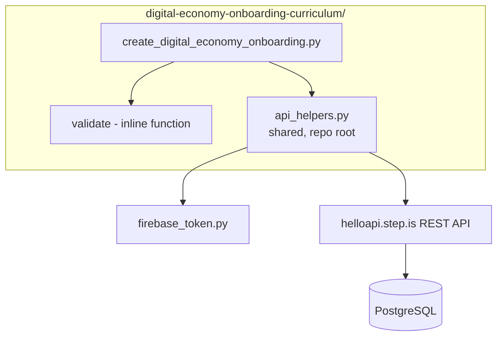
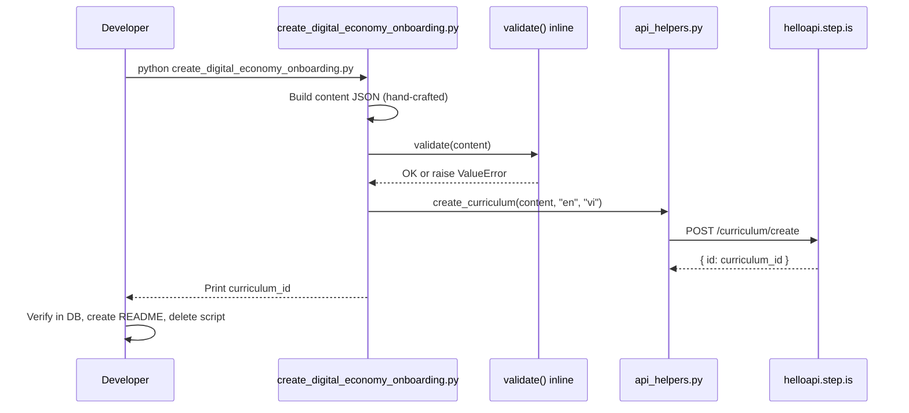

# Design Document: Digital Economy Onboarding Curriculum

## Overview

This design covers the creation of a single onboarding/demo English-learning curriculum for Vietnamese speakers on the topic of "Digital Economy" (Kinh Tế Số). The system consists of:

- **1 standalone Python script** — contains all hand-crafted content for the onboarding curriculum
- **1 inline content validator** — validates curriculum JSON against corruption rules before upload
- **Shared API helpers** — reuses the existing root-level `api_helpers.py` module for the REST API call

The language pair is `userLanguage="vi"` (Vietnamese speakers), `language="en"` (learning English). All marketing text (title, description, preview) is in Vietnamese. The reading passage is in English. introAudio scripts are bilingual (Vietnamese explanations for English vocabulary). Difficulty level is preintermediate with 1 session, balanced_skills type, free pricing (0 credits), stays private.

### Key Design Decisions

1. **Reuse existing `api_helpers.py`** — the root-level module already wraps `create_curriculum` with Firebase auth, error handling, and logging. No series/collection/price calls needed for this standalone onboarding curriculum.

2. **Inline validator** — since this is a single curriculum with a specific fixed structure (1 session, specific activity sequence), the validator is defined inline in the script rather than as a separate module. It checks all Content Corruption Detection Rules plus the onboarding-specific constraints (exactly 1 session, correct activity sequence, 5 vocab words).

3. **No series/collection** — this is a standalone onboarding curriculum, not part of any series or collection. No orchestrator needed.

4. **No setPrice/setPublic calls** — free by default (0 credits), stays private until content generation is complete.

5. **No template content** — every piece of learner-facing text (introAudio scripts, reading passage, description, preview, writing prompts) is individually crafted for the digital economy topic. The script contains all text as literal strings.

6. **Single tone assignment** — description uses `surprising_fact` or `provocative_question` tone (per Requirement 6.4). Farewell uses `practical_momentum` register (per Requirement 7.5).

## Architecture



### Execution Flow



## Components and Interfaces

### 1. create_digital_economy_onboarding.py

Single standalone script that builds the curriculum content, validates it, and uploads it.

**Structure:**
```python
import sys
import json
import logging

sys.path.insert(0, "/home/ubuntu/nspaceresearch/design-curriculums")
from api_helpers import create_curriculum

STRIP_KEYS = {"mp3Url", "illustrationSet", "chapterBookmarks", "segments",
              "whiteboardItems", "userReadingId", "lessonUniqueId",
              "curriculumTags", "taskId", "imageId"}

VALID_ACTIVITY_TYPES = {"introAudio", "viewFlashcards", "speakFlashcards",
                        "vocabLevel1", "reading", "speakReading", "readAlong",
                        "writingSentence"}

EXPECTED_SEQUENCE = [
    "introAudio", "viewFlashcards", "speakFlashcards", "vocabLevel1",
    "reading", "speakReading", "readAlong", "writingSentence", "introAudio"
]

def validate(content: dict) -> None:
    """Validate curriculum content for the onboarding curriculum."""
    ...

def build_content() -> dict:
    """Build the complete curriculum content dict with all hand-crafted text."""
    ...

def main():
    content = build_content()
    validate(content)
    curriculum_id = create_curriculum(content, "en", "vi")
    print(f"Created digital economy onboarding curriculum: {curriculum_id}")

if __name__ == "__main__":
    main()
```

**Inputs:** None (all content hard-coded as hand-crafted text)

**Outputs:** Prints curriculum ID on success, raises on validation failure or API error

**API calls:**
- `curriculum/create` — 1 call (language="en", userLanguage="vi", content=JSON string)

**No calls to:**
- `curriculum/setPrice` (free by default)
- `curriculum/setPublic` (stays private)
- Any series/collection endpoints

### 2. validate() — Inline Validator

Validates the content dict against all applicable rules before upload.

**Interface:**
```python
def validate(content: dict) -> None:
    """
    Validates curriculum content JSON for the digital economy onboarding curriculum.
    
    Checks:
    1. Top-level structure (title, description, preview.text non-empty)
    2. learningSessions is array with exactly 1 session
    3. Session has title and non-empty activities array
    4. Activity sequence matches EXPECTED_SEQUENCE (9 activities)
    5. Each activity has activityType (not type), title, description, data object
    6. activityType values are valid
    7. vocabList fields are arrays of lowercase strings, field name is vocabList (not words)
    8. viewFlashcards and speakFlashcards have identical vocabList
    9. writingSentence has data.vocabList, data.items with prompt and targetVocab
    10. No strip keys anywhere in JSON tree
    11. contentTypeTags is []
    12. vocabList arrays contain exactly 5 words (for this curriculum)
    
    Raises:
        ValueError with specific violation message on any failure.
    """
```

**Validation checks (ordered):**

| # | Check | Error Message Pattern |
|---|---|---|
| 1 | `content` is a dict | "Content must be a dict" |
| 2 | `title` is non-empty string | "Missing or empty title" |
| 3 | `description` is non-empty string | "Missing or empty description" |
| 4 | `preview` is dict with non-empty `text` | "Missing or empty preview.text" |
| 5 | `contentTypeTags` equals `[]` | "contentTypeTags must be []" |
| 6 | `learningSessions` is list with exactly 1 element | "Must have exactly 1 learning session" |
| 7 | Session has non-empty `title` | "Session missing title" |
| 8 | Session has non-empty `activities` list | "Session has no activities" |
| 9 | Activity sequence matches EXPECTED_SEQUENCE | "Activity sequence mismatch" |
| 10 | Each activity has `activityType`, `title`, `description`, `data` | "Activity missing required field: X" |
| 11 | No activity has `type` field (old schema) | "Activity uses 'type' instead of 'activityType'" |
| 12 | `activityType` is in VALID_ACTIVITY_TYPES | "Invalid activityType: X" |
| 13 | Content fields are inside `data`, not inline | "Content field 'X' found inline on activity" |
| 14 | vocabList fields are arrays of lowercase strings | "vocabList must be array of lowercase strings" |
| 15 | No field named `words` (must be `vocabList`) | "Field 'words' found — use 'vocabList'" |
| 16 | viewFlashcards.vocabList == speakFlashcards.vocabList | "viewFlashcards/speakFlashcards vocabList mismatch" |
| 17 | vocabList arrays have exactly 5 items | "vocabList must have exactly 5 words" |
| 18 | writingSentence has data.vocabList, data.items | "writingSentence missing data.vocabList or data.items" |
| 19 | Each writingSentence item has prompt and targetVocab | "writingSentence item missing prompt or targetVocab" |
| 20 | No strip keys anywhere in tree (recursive check) | "Strip key 'X' found in content" |

### 3. Vocabulary Selection

5 words covering core digital economy concepts relevant to Vietnamese learners:

| Word | Relevance to Vietnamese Digital Economy |
|------|----------------------------------------|
| platform | Grab, Shopee, Tiki — platforms Vietnamese use daily |
| transaction | MoMo, VNPay — digital transactions replacing cash |
| startup | Vietnam's booming startup ecosystem (VNLife, Tiki, etc.) |
| innovation | Tech innovation driving Vietnam's economic growth |
| digital | The overarching concept — "digital economy" itself |

All words are lowercase, appropriate for preintermediate level (common enough to be useful, specific enough to be educational).

### 4. Activity Sequence (Single Session)

```
Session: "Khám phá Kinh Tế Số"
  1. introAudio — welcome + teach all 5 vocabulary words (500-800 words, bilingual)
  2. viewFlashcards — all 5 words
  3. speakFlashcards — all 5 words (identical vocabList to viewFlashcards)
  4. vocabLevel1 — all 5 words
  5. reading — expository passage 60-70 words about digital economy in Vietnam
  6. speakReading — same text as reading
  7. readAlong — same text as reading
  8. writingSentence — 2-3 items using vocabulary words
  9. introAudio — farewell with vocab review (400-600 words, practical_momentum register)
```

### 5. Content Specifications

**Title:** Minimal Vietnamese title (e.g., "Kinh Tế Số" or "Thời Đại Số")

**Description:** Persuasive copy using `surprising_fact` or `provocative_question` tone, multi-paragraph structure with bold headline, concrete examples, vivid metaphor, transformation promise, and personal growth tie-in. All in Vietnamese.

**Preview (~150 words):** Vietnamese text with vivid hooks about career in the digital age, vocabulary word listing, and what the learner will be able to discuss after completing the lesson.

**Welcome introAudio (500-800 words):**
- Greet learner warmly
- Hook connecting to daily life (Shopee, MoMo, Grab)
- List all 5 vocabulary words
- Teach each word: English word, Vietnamese meaning, contextual example sentence, connection to digital economy
- Bilingual throughout

**Reading passage (60-70 words):**
- Expository style about digital economy in Vietnam
- Incorporates all 5 vocabulary words naturally
- Preintermediate grammar (10-14 words per sentence average)
- Connects to Vietnamese daily life (Grab, Shopee, MoMo, VNPay)

**writingSentence (2-3 items):**
- Each item has detailed prompt with context and example sentence
- Each item targets one vocabulary word
- Format: Vietnamese instruction + English example sentence

**Farewell introAudio (400-600 words):**
- `practical_momentum` register — action-oriented
- Review all 5 vocabulary words with definitions and fresh example sentences
- Connect words back to digital economy theme
- Congratulate learner on completing first lesson
- Encourage exploration of more curriculums
- Give sense of what they can do next with new vocabulary

## Data Models

### Curriculum Content JSON Structure

```json
{
  "title": "Kinh Tế Số",
  "description": "BẠN CÓ BIẾT 70% NGƯỜI VIỆT DƯỚI 35 TUỔI KIẾM TIỀN TỪ NỀN KINH TẾ SỐ?\n\nMỗi lần bạn đặt Grab, mua hàng trên Shopee, hay chuyển tiền qua MoMo — bạn đang tham gia vào một cuộc cách mạng kinh tế...\n\n...",
  "preview": {
    "text": "Hãy tưởng tượng bạn đang ngồi trong một cuộc họp với đối tác nước ngoài..."
  },
  "contentTypeTags": [],
  "learningSessions": [
    {
      "title": "Khám phá Kinh Tế Số",
      "activities": [
        {
          "activityType": "introAudio",
          "title": "Giới thiệu bài học",
          "description": "Chào mừng và giới thiệu 5 từ vựng về kinh tế số",
          "data": {
            "text": "Xin chào bạn! Chào mừng bạn đến với bài học đầu tiên..."
          }
        },
        {
          "activityType": "viewFlashcards",
          "title": "Flashcards: Kinh tế số",
          "description": "Học 5 từ: platform, transaction, startup, innovation, digital",
          "data": {
            "vocabList": ["platform", "transaction", "startup", "innovation", "digital"]
          }
        },
        {
          "activityType": "speakFlashcards",
          "title": "Flashcards: Kinh tế số",
          "description": "Học 5 từ: platform, transaction, startup, innovation, digital",
          "data": {
            "vocabList": ["platform", "transaction", "startup", "innovation", "digital"]
          }
        },
        {
          "activityType": "vocabLevel1",
          "title": "Flashcards: Kinh tế số",
          "description": "Học 5 từ: platform, transaction, startup, innovation, digital",
          "data": {
            "vocabList": ["platform", "transaction", "startup", "innovation", "digital"]
          }
        },
        {
          "activityType": "reading",
          "title": "Đọc: Kinh tế số tại Việt Nam",
          "description": "Vietnam's digital economy is growing fast. Every day, millions of people...",
          "data": {
            "text": "Vietnam's digital economy is growing fast. Every day, millions of people use a platform like Grab or Shopee to make a transaction...",
            "vocabList": ["platform", "transaction", "startup", "innovation", "digital"]
          }
        },
        {
          "activityType": "speakReading",
          "title": "Đọc: Kinh tế số tại Việt Nam",
          "description": "Vietnam's digital economy is growing fast. Every day, millions of people...",
          "data": {
            "text": "Vietnam's digital economy is growing fast. Every day, millions of people use a platform like Grab or Shopee to make a transaction..."
          }
        },
        {
          "activityType": "readAlong",
          "title": "Nghe: Kinh tế số tại Việt Nam",
          "description": "Nghe đoạn văn vừa đọc và theo dõi.",
          "data": {
            "text": "Vietnam's digital economy is growing fast. Every day, millions of people use a platform like Grab or Shopee to make a transaction..."
          }
        },
        {
          "activityType": "writingSentence",
          "title": "Viết: Kinh tế số",
          "description": "Viết câu tiếng Anh sử dụng từ vựng về kinh tế số",
          "data": {
            "vocabList": ["platform", "transaction", "startup", "innovation", "digital"],
            "items": [
              {
                "prompt": "Dùng từ 'platform' để viết một câu về ứng dụng bạn dùng hàng ngày. Ví dụ: Shopee is a popular e-commerce platform where Vietnamese people buy everything from clothes to electronics.",
                "targetVocab": "platform"
              },
              {
                "prompt": "Dùng từ 'transaction' để viết một câu về thanh toán điện tử. Ví dụ: I completed a transaction on MoMo to pay for my morning coffee without using cash.",
                "targetVocab": "transaction"
              },
              {
                "prompt": "Dùng từ 'innovation' để viết một câu về công nghệ tại Việt Nam. Ví dụ: Innovation in fintech has made it easy for Vietnamese people to send money instantly.",
                "targetVocab": "innovation"
              }
            ]
          }
        },
        {
          "activityType": "introAudio",
          "title": "Tổng kết bài học",
          "description": "Ôn tập từ vựng và kết thúc bài học",
          "data": {
            "text": "Tuyệt vời! Bạn vừa hoàn thành bài học đầu tiên về Kinh Tế Số..."
          }
        }
      ]
    }
  ]
}
```

### writingSentence Item Structure

```json
{
  "prompt": "Dùng từ 'platform' để viết một câu về ứng dụng bạn dùng hàng ngày. Ví dụ: Shopee is a popular e-commerce platform where Vietnamese people buy everything from clothes to electronics.",
  "targetVocab": "platform"
}
```

### API Call Parameters

| API Endpoint | Key Parameters |
|---|---|
| `curriculum/create` | `firebaseIdToken`, `language: "en"`, `userLanguage: "vi"`, `content: json.dumps(content)` |

No other API calls are made (no setPrice, no setPublic, no series/collection).

## Correctness Properties

*A property is a characteristic or behavior that should hold true across all valid executions of a system — essentially, a formal statement about what the system should do. Properties serve as the bridge between human-readable specifications and machine-verifiable correctness guarantees.*

The inline `validate()` function is the primary component amenable to property-based testing. It is a pure function: takes a content dict, returns None or raises ValueError. The input space is large (arbitrary JSON structures), and universal properties hold across all valid/invalid inputs.

### Property 1: Structural validity — valid content passes validation

*For any* well-formed curriculum content dict that has: non-empty title/description/preview.text, exactly 1 session with a title and activities matching the expected sequence, all activities having activityType/title/description/data fields with valid activityType values and content inside data, correct vocabList format, matching viewFlashcards/speakFlashcards vocabLists, valid writingSentence structure, contentTypeTags = [], and no strip keys — calling `validate(content)` SHALL return without raising an exception.

**Validates: Requirements 1.4, 1.5, 3.1, 3.2, 4.1, 4.2, 4.3, 4.4, 4.6, 10.1-10.10**

### Property 2: Strip keys rejected anywhere in JSON tree

*For any* otherwise-valid curriculum content dict, if any strip key (mp3Url, illustrationSet, chapterBookmarks, segments, whiteboardItems, userReadingId, lessonUniqueId, curriculumTags, taskId, imageId) is injected at any depth in the JSON tree, `validate()` SHALL raise a ValueError mentioning the strip key.

**Validates: Requirements 1.5, 10.8**

### Property 3: vocabList format enforcement

*For any* curriculum content dict containing a vocabList field, if the field contains non-lowercase strings, non-string items, or is named `words` instead of `vocabList`, `validate()` SHALL raise a ValueError.

**Validates: Requirements 2.4, 10.5**

### Property 4: Activity sequence enforcement

*For any* curriculum content dict where the activity sequence (list of activityType values) does not match the expected sequence [introAudio, viewFlashcards, speakFlashcards, vocabLevel1, reading, speakReading, readAlong, writingSentence, introAudio], `validate()` SHALL raise a ValueError indicating the sequence mismatch.

**Validates: Requirements 3.1, 10.2**

### Property 5: viewFlashcards/speakFlashcards vocabList consistency

*For any* curriculum content dict where viewFlashcards and speakFlashcards activities exist in the same session, if their vocabList arrays differ in content or order, `validate()` SHALL raise a ValueError.

**Validates: Requirements 3.2, 10.6**

### Property 6: writingSentence structural completeness

*For any* curriculum content dict containing a writingSentence activity, if `data.vocabList` is missing/empty, `data.items` is missing/empty, or any item lacks `prompt` or `targetVocab`, `validate()` SHALL raise a ValueError.

**Validates: Requirements 4.4, 10.7**

### Property 7: contentTypeTags enforcement

*For any* curriculum content dict where `contentTypeTags` is not exactly `[]` (empty array), `validate()` SHALL raise a ValueError.

**Validates: Requirements 1.4, 10.9**

## Error Handling

### Validation Errors

The `validate()` function raises `ValueError` with a descriptive message on any rule violation. The script catches nothing — if validation fails, the script aborts with a traceback showing exactly which rule was violated.

**Error flow:**
1. `validate(content)` raises `ValueError("Strip key 'mp3Url' found in content")`
2. Script terminates with unhandled exception
3. Developer reads the error message, fixes the content, re-runs

### API Errors

The `api_helpers.create_curriculum()` function:
- Calls `res.raise_for_status()` on non-2xx responses
- Logs the error with `logger.error()`
- Re-raises the exception

**Error flow:**
1. API returns 500 → `requests.exceptions.HTTPError` raised
2. `api_helpers` logs: "Failed to create curriculum 'Kinh Tế Số': 500 Server Error"
3. Script terminates with unhandled exception
4. Developer checks API logs, fixes issue, re-runs

### No Retry Logic

This is a one-shot script. If it fails, the developer investigates and re-runs manually. No automatic retries, no partial state to clean up (curriculum either exists in DB or doesn't).

## Testing Strategy

### Property-Based Testing (Hypothesis)

The `validate()` function is tested with property-based tests using Python's `hypothesis` library. Each property from the Correctness Properties section maps to one test function.

**Library:** `hypothesis` (already used in this repo — `.hypothesis/` directory exists)

**Configuration:** Minimum 100 examples per property test (`@settings(max_examples=100)`)

**Test file:** `digital-economy-onboarding-curriculum/test_validate.py`

**Tag format:** Each test is annotated with a comment:
```python
# Feature: digital-economy-onboarding-curriculum, Property 2: Strip keys rejected anywhere in JSON tree
```

**Generator strategy:**
- Generate valid base content dicts using `@composite` strategies
- For rejection properties: mutate valid content by injecting violations (strip keys, wrong field names, shuffled sequences, etc.)
- For acceptance property: generate content matching all constraints

### Example-Based Tests

Specific checks that don't need property-based testing:
- Verify the actual `build_content()` output passes `validate()` (smoke test)
- Verify reading passage word count is 60-70 words
- Verify introAudio welcome script is 500-800 words
- Verify introAudio farewell script is 400-600 words
- Verify vocabList has exactly 5 words
- Verify title/description naming conventions

### Integration Verification (Post-Execution)

After running the script against the live API:
```sql
-- Verify curriculum exists
SELECT id, title, created_at FROM curriculum
WHERE title = '<title>' AND uid = 'zs5AMpVfqkcfDf8CJ9qrXdH58d73'
ORDER BY created_at;

-- Verify content structure
SELECT id, content::jsonb->'contentTypeTags' as tags,
       jsonb_array_length(content::jsonb->'learningSessions') as sessions
FROM curriculum WHERE id = '<id>';

-- Duplicate check
SELECT id, title, created_at FROM curriculum
WHERE title = '<title>' AND uid = 'zs5AMpVfqkcfDf8CJ9qrXdH58d73'
ORDER BY created_at;
```

### Manual Review Checklist

Items not amenable to automated testing:
- [ ] Reading passage is expository and connects to Vietnamese daily life
- [ ] Vocabulary words are appropriate for preintermediate level
- [ ] Description follows persuasive copy 5-beat structure
- [ ] Preview text is compelling and ~150 words
- [ ] introAudio scripts are bilingual and educational
- [ ] Farewell uses `practical_momentum` register
- [ ] All text is individually crafted (no templates)
