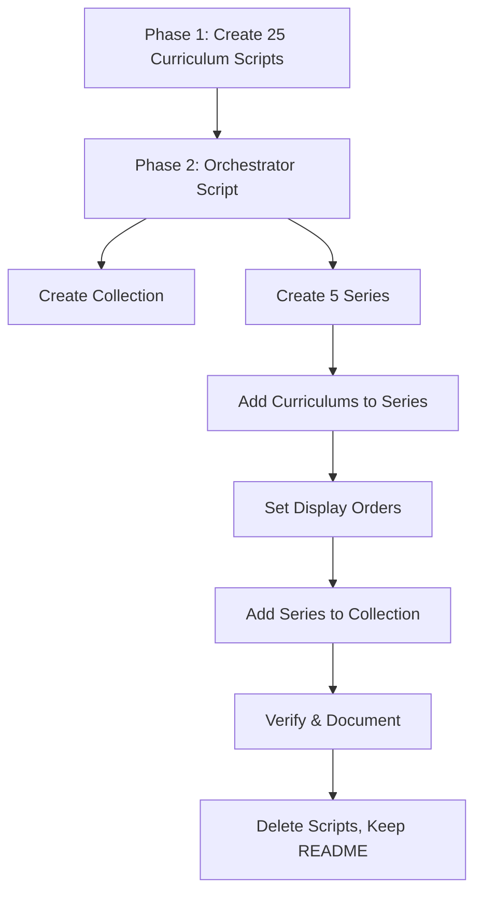

# Design Document: Economics University Curriculum

## Overview

This feature creates a new Economics English collection for Vietnamese-speaking university students at the University of Economics (Đại Học Kinh Tế), containing 5 series organized by economics subdiscipline with 5 curriculums each (25 total). Each curriculum teaches 18 vocabulary words through the platform's standard 5-session structure with bilingual content (Vietnamese UI, English reading passages) at preintermediate-to-intermediate level.

The collection covers academic economics — theoretical frameworks, analytical tools, and disciplinary vocabulary that economics majors encounter in university courses. This is distinct from the existing personal finance series ("Kinh Tế & Tài Chính Cá Nhân") and business owner series ("Chủ Doanh Nghiệp"), which cover applied/practical topics.

Implementation follows the established pattern: standalone Python scripts per curriculum, an orchestrator script for series/collection assembly, and a README documenting all IDs and SQL queries.

### Key Design Decisions

1. **Separate collection from existing economics content**: The existing "Học Từ Vựng Theo Chủ Đề" collection houses personal finance and business owner series. Academic economics targets a different audience (university students) with different vocabulary (textbook/lecture terminology vs. practical finance), warranting its own collection.
2. **5 series × 5 curriculums = 25 total**: Maps to the five core subdisciplines in a Vietnamese economics degree program. Five curriculums per series provides enough depth to cover foundational through specialized topics.
3. **Preintermediate-to-intermediate level only**: Matches the target audience — Vietnamese economics students who can read basic English but need structured vocabulary building for academic contexts. No beginner (too basic for university students) or advanced (would require specialist jargon beyond the scope).
4. **18 words per curriculum, standard 5-session structure**: Consistent with the medical English and other vi-en curriculum patterns. Proven structure for vocabulary acquisition at this level.
5. **contentTypeTags = []**: These are general academic topic curriculums, not movie/music/podcast/story-based.

## Architecture

The creation workflow follows the established two-phase pattern:



### File Organization

```
economics-university-curriculum/
├── create_micro_1_supply_demand.py
├── create_micro_2_market_structures.py
├── ... (25 curriculum scripts total)
├── create_economics_university_series.py   # orchestrator
└── README.md                                # final documentation (persists)
```

### Execution Order

1. Run each of the 25 `create_*.py` scripts to create individual curriculums via `curriculum/create`
2. Run `create_economics_university_series.py` orchestrator to:
   - Create the collection via `curriculum-collection/create`
   - Create 5 series via `curriculum-series/create`
   - Add curriculums to their respective series via `curriculum-series/addCurriculum`
   - Set display orders via `curriculum/setDisplayOrder` and `curriculum-series/setDisplayOrder`
   - Add series to collection via `curriculum-collection/addSeriesToCollection`
3. Verify no duplicates, check content corruption rules
4. Write README.md with all IDs and SQL queries
5. Delete all Python scripts

## Components and Interfaces

### 1. Curriculum Creation Scripts (25 scripts)

Each script is standalone and follows this pattern:

```python
import sys, json, requests
sys.path.insert(0, "/home/ubuntu/nspaceresearch/design-curriculums")
from firebase_token import get_firebase_id_token

UID = "zs5AMpVfqkcfDf8CJ9qrXdH58d73"
API_BASE = "https://helloapi.step.is"

content = {
    "title": "Supply & Demand – Cung và Cầu",
    "contentTypeTags": [],
    "description": "...",  # Multi-paragraph persuasive Vietnamese copy
    "preview": {"text": "..."},  # ~150 word Vietnamese preview
    "learningSessions": [...]  # 5 sessions with activities
}

token = get_firebase_id_token(UID)
res = requests.post(f"{API_BASE}/curriculum/create", json={
    "firebaseIdToken": token,
    "language": "en",
    "userLanguage": "vi",
    "content": json.dumps(content)
})
res.raise_for_status()
curriculum_id = res.json()["id"]
print(f"Created: {curriculum_id}")
```

### 2. Orchestrator Script

Creates the collection, 5 series, links all curriculums, sets display orders, and adds series to the collection. Uses the same auth pattern. Prints all IDs for README documentation.

### 3. Content Structure Per Curriculum

Each curriculum's `content` JSON contains:

- `title`: Bilingual (e.g., "Supply & Demand – Cung và Cầu")
- `contentTypeTags`: `[]`
- `description`: Multi-paragraph persuasive Vietnamese copy (5-beat structure)
- `preview`: `{ "text": "..." }` — ~150 word Vietnamese preview
- `learningSessions`: Array of 5 sessions

### 4. Session Structure

| Session | Title | Activities | Word Group |
|---------|-------|-----------|------------|
| 1 (Words 1-6) | Phần 1 | introAudio, viewFlashcards, speakFlashcards, vocabLevel1, vocabLevel2, vocabLevel3, reading, speakReading, readAlong, writingSentence | W1 (6 words) |
| 2 (Words 7-12) | Phần 2 | introAudio, viewFlashcards, speakFlashcards, vocabLevel1, vocabLevel2, vocabLevel3, reading, speakReading, readAlong, writingSentence | W2 (6 words) |
| 3 (Words 13-18) | Phần 3 | introAudio, viewFlashcards, speakFlashcards, vocabLevel1, vocabLevel2, vocabLevel3, reading, speakReading, readAlong, writingSentence | W3 (6 words) |
| 4 (Review, all 18) | Ôn tập | introAudio, viewFlashcards, speakFlashcards, vocabLevel1, vocabLevel2, vocabLevel3, writingSentence | ALL (18 words) |
| 5 (Full reading) | Đọc toàn bài | introAudio (intro), reading, speakReading, readAlong, writingParagraph, introAudio (farewell) | ALL |

### 5. Activity Data Schemas

```json
// introAudio
{ "activityType": "introAudio", "title": "...", "description": "...", "data": { "text": "..." } }

// viewFlashcards / speakFlashcards / vocabLevel1-3
{ "activityType": "viewFlashcards", "title": "...", "description": "...", "data": { "vocabList": ["word1", "word2"] } }

// reading / speakReading / readAlong
{ "activityType": "reading", "title": "...", "description": "...", "data": { "text": "..." } }

// writingSentence
{ "activityType": "writingSentence", "title": "...", "description": "...",
  "data": { "vocabList": [...], "items": [{ "prompt": "...", "targetVocab": "..." }] } }

// writingParagraph
{ "activityType": "writingParagraph", "title": "...", "description": "...",
  "data": { "vocabList": [...], "instructions": "...", "prompts": ["...", "..."] } }
```

## Data Models

### Collection

| Field | Value |
|-------|-------|
| title | Tiếng Anh Kinh Tế Đại Học (University Economics English) |
| description | Bộ từ vựng tiếng Anh chuyên ngành kinh tế dành cho sinh viên Đại Học Kinh Tế, bao gồm kinh tế vi mô, vĩ mô, thương mại quốc tế, kế toán tài chính doanh nghiệp, và marketing quản trị. |
| isPublic | false (initially) |

### Series (5 total)

| Order | Series | Tone | Description (≤255 chars) |
|-------|--------|------|--------------------------|
| 0 | Kinh Tế Vi Mô (Microeconomics) | provocative_question | Bạn có thật sự hiểu vì sao giá cà phê tăng mỗi sáng? Cung, cầu, và cân bằng thị trường — tất cả đều có câu trả lời bằng tiếng Anh. |
| 1 | Kinh Tế Vĩ Mô (Macroeconomics) | bold_declaration | GDP không chỉ là con số — nó là nhịp đập của cả nền kinh tế, và bạn sắp đọc được nó bằng tiếng Anh. |
| 2 | Thương Mại Quốc Tế & Toàn Cầu Hóa (International Trade) | surprising_fact | 80% hàng hóa bạn dùng mỗi ngày đi qua ít nhất 3 quốc gia trước khi đến tay bạn — và chuỗi cung ứng đó nói tiếng Anh. |
| 3 | Kế Toán & Tài Chính Doanh Nghiệp (Accounting & Corporate Finance) | empathetic_observation | Bạn đọc được bảng cân đối kế toán tiếng Việt — nhưng khi đối tác nước ngoài gửi financial statements thì sao? |
| 4 | Marketing & Quản Trị (Marketing & Management) | vivid_scenario | Hãy tưởng tượng bạn đang thuyết trình chiến lược marketing trước ban giám đốc đa quốc gia — hoàn toàn bằng tiếng Anh. |

Tone distribution: 5 series × 5 different tones = each tone used once (20%). No tone exceeds 30%. No adjacent series share a tone.

### Curriculum Topics (25 total)

**Series A — Kinh Tế Vi Mô (Microeconomics):**

| # | Order | Topic | Title |
|---|-------|-------|-------|
| 1 | 0 | Supply & Demand Fundamentals | Supply & Demand – Cung và Cầu |
| 2 | 1 | Market Structures & Competition | Market Structures – Cấu Trúc Thị Trường |
| 3 | 2 | Consumer Choice & Utility | Consumer Choice – Lựa Chọn Người Tiêu Dùng |
| 4 | 3 | Production Costs & Firm Decisions | Production Costs – Chi Phí Sản Xuất |
| 5 | 4 | Market Failure & Externalities | Market Failure – Thất Bại Thị Trường |

**Series B — Kinh Tế Vĩ Mô (Macroeconomics):**

| # | Order | Topic | Title |
|---|-------|-------|-------|
| 6 | 0 | GDP & Economic Indicators | GDP & Indicators – GDP và Chỉ Số Kinh Tế |
| 7 | 1 | Unemployment & Labor Markets | Labor Markets – Thị Trường Lao Động |
| 8 | 2 | Fiscal Policy & Government Spending | Fiscal Policy – Chính Sách Tài Khóa |
| 9 | 3 | Monetary Policy & Central Banking | Monetary Policy – Chính Sách Tiền Tệ |
| 10 | 4 | Economic Growth & Development | Economic Growth – Tăng Trưởng Kinh Tế |

**Series C — Thương Mại Quốc Tế (International Trade & Globalization):**

| # | Order | Topic | Title |
|---|-------|-------|-------|
| 11 | 0 | Comparative Advantage & Trade Theory | Trade Theory – Lý Thuyết Thương Mại |
| 12 | 1 | Tariffs, Quotas & Trade Barriers | Trade Barriers – Rào Cản Thương Mại |
| 13 | 2 | Foreign Exchange Markets | Exchange Markets – Thị Trường Ngoại Hối |
| 14 | 3 | International Trade Organizations | Trade Organizations – Tổ Chức Thương Mại |
| 15 | 4 | Global Supply Chains & Logistics | Supply Chains – Chuỗi Cung Ứng Toàn Cầu |

**Series D — Kế Toán & Tài Chính Doanh Nghiệp (Accounting & Corporate Finance):**

| # | Order | Topic | Title |
|---|-------|-------|-------|
| 16 | 0 | Financial Statements & Reporting | Financial Statements – Báo Cáo Tài Chính |
| 17 | 1 | Cost Accounting & Budgeting | Cost Accounting – Kế Toán Chi Phí |
| 18 | 2 | Auditing & Compliance | Auditing – Kiểm Toán |
| 19 | 3 | Capital Structure & Investment | Capital Structure – Cấu Trúc Vốn |
| 20 | 4 | Corporate Governance & Ethics | Corporate Governance – Quản Trị Doanh Nghiệp |

**Series E — Marketing & Quản Trị (Marketing & Management):**

| # | Order | Topic | Title |
|---|-------|-------|-------|
| 21 | 0 | Market Research & Consumer Behavior | Market Research – Nghiên Cứu Thị Trường |
| 22 | 1 | Branding & Product Strategy | Branding Strategy – Chiến Lược Thương Hiệu |
| 23 | 2 | Organizational Behavior & Leadership | Leadership – Lãnh Đạo & Hành Vi Tổ Chức |
| 24 | 3 | Human Resource Management | HR Management – Quản Trị Nhân Sự |
| 25 | 4 | Strategic Planning & Competitive Analysis | Strategic Planning – Hoạch Định Chiến Lược |

### Vocabulary Plan (18 words per curriculum, no overlap within series)

**Series A — Microeconomics (90 words total):**

| Curriculum | W1 (words 1-6) | W2 (words 7-12) | W3 (words 13-18) |
|-----------|-----------------|------------------|-------------------|
| A1: Supply & Demand | supply, demand, equilibrium, surplus, shortage, quantity | elasticity, substitute, complement, shift, curve, price | allocate, ration, ceiling, floor, incentive, scarcity |
| A2: Market Structures | monopoly, oligopoly, competition, barrier, market, industry | differentiation, homogeneous, concentration, merger, antitrust, regulation | cartel, collusion, duopoly, contestable, dominance, deregulation |
| A3: Consumer Choice | utility, preference, budget, constraint, marginal, rational | indifference, diminishing, maximize, consumption, satisfaction, income | opportunity, trade-off, optimal, welfare, expenditure, threshold |
| A4: Production Costs | variable, fixed, marginal, output, revenue, profit | economies, diseconomies, average, total, diminish, scale | productivity, efficiency, overhead, depreciation, capacity, breakeven |
| A5: Market Failure | externality, subsidy, public, free-rider, commons, pollution | intervention, tax, quota, welfare, deadweight, loss | asymmetry, moral, adverse, regulation, corrective, spillover |

**Series B — Macroeconomics (90 words total):**

| Curriculum | W1 (words 1-6) | W2 (words 7-12) | W3 (words 13-18) |
|-----------|-----------------|------------------|-------------------|
| B1: GDP & Indicators | gross, domestic, nominal, real, per capita, output | indicator, index, inflation, deflation, growth, contraction | aggregate, productivity, benchmark, quarterly, annual, forecast |
| B2: Labor Markets | unemployment, labor, workforce, participation, wage, hiring | structural, cyclical, frictional, seasonal, underemployment, layoff | vacancy, turnover, mobility, outsource, automation, retraining |
| B3: Fiscal Policy | fiscal, budget, deficit, surplus, expenditure, revenue | taxation, progressive, regressive, stimulus, austerity, debt | bond, treasury, allocation, discretionary, mandatory, appropriation |
| B4: Monetary Policy | monetary, interest, central, reserve, liquidity, credit | inflation, target, tighten, ease, transmission, benchmark | quantitative, yield, maturity, deposit, lending, overnight |
| B5: Economic Growth | growth, development, investment, capital, infrastructure, innovation | convergence, divergence, sustainable, emerging, industrialization, urbanization | productivity, human, institutional, reform, liberalization, stagnation |

**Series C — International Trade (90 words total):**

| Curriculum | W1 (words 1-6) | W2 (words 7-12) | W3 (words 13-18) |
|-----------|-----------------|------------------|-------------------|
| C1: Trade Theory | comparative, absolute, advantage, specialization, export, import | trade, surplus, deficit, balance, terms, gains | autarky, protectionism, liberalization, reciprocal, bilateral, multilateral |
| C2: Trade Barriers | tariff, quota, embargo, sanction, dumping, countervailing | barrier, non-tariff, standard, certification, licensing, restriction | retaliation, safeguard, anti-dumping, preferential, exemption, compliance |
| C3: Exchange Markets | exchange, currency, appreciation, depreciation, floating, pegged | forex, spot, forward, hedge, speculation, volatility | arbitrage, devaluation, revaluation, convertible, reserve, intervention |
| C4: Trade Organizations | organization, treaty, agreement, negotiation, ratification, membership | dispute, resolution, panel, appellate, ruling, enforcement | accession, protocol, framework, consensus, sovereignty, harmonization |
| C5: Supply Chains | logistics, supply, chain, procurement, inventory, warehouse | freight, customs, clearance, shipment, container, transit | disruption, resilience, diversification, nearshoring, traceability, optimization |

**Series D — Accounting & Corporate Finance (90 words total):**

| Curriculum | W1 (words 1-6) | W2 (words 7-12) | W3 (words 13-18) |
|-----------|-----------------|------------------|-------------------|
| D1: Financial Statements | asset, liability, equity, revenue, expense, balance | income, statement, cash, flow, receivable, payable | accrual, depreciation, amortization, retained, comprehensive, disclosure |
| D2: Cost Accounting | cost, budget, variance, overhead, allocation, direct | indirect, standard, actual, absorption, marginal, contribution | breakeven, forecast, performance, benchmark, controllable, uncontrollable |
| D3: Auditing | audit, compliance, assurance, material, misstatement, opinion | internal, external, sampling, evidence, procedure, engagement | fraud, detection, disclosure, independence, objectivity, skepticism |
| D4: Capital Structure | capital, debt, equity, leverage, ratio, valuation | dividend, shareholder, bond, yield, maturity, coupon | weighted, optimal, restructuring, refinancing, dilution, buyback |
| D5: Corporate Governance | governance, board, director, fiduciary, accountability, transparency | stakeholder, shareholder, proxy, charter, bylaw, oversight | whistleblower, ethics, conflict, disclosure, remuneration, succession |

**Series E — Marketing & Management (90 words total):**

| Curriculum | W1 (words 1-6) | W2 (words 7-12) | W3 (words 13-18) |
|-----------|-----------------|------------------|-------------------|
| E1: Market Research | research, survey, sample, demographic, segment, target | qualitative, quantitative, focus, panel, respondent, bias | insight, trend, forecast, correlation, hypothesis, methodology |
| E2: Branding Strategy | brand, positioning, differentiation, perception, loyalty, awareness | identity, equity, portfolio, extension, endorsement, licensing | rebranding, premium, niche, archetype, touchpoint, narrative |
| E3: Leadership | leadership, delegation, motivation, empowerment, accountability, vision | organizational, culture, hierarchy, collaboration, conflict, negotiation | transformational, situational, mentorship, succession, resilience, agility |
| E4: HR Management | recruitment, retention, compensation, benefit, appraisal, onboarding | training, development, turnover, engagement, diversity, inclusion | compliance, grievance, termination, workforce, talent, pipeline |
| E5: Strategic Planning | strategy, objective, mission, competitive, analysis, benchmark | swot, stakeholder, portfolio, diversification, acquisition, merger | disruption, innovation, scalability, sustainability, alignment, execution |

### Tone Assignments for Curriculum Descriptions

| Series | C1 | C2 | C3 | C4 | C5 |
|--------|----|----|----|----|-----|
| A (Micro) | provocative_question | vivid_scenario | bold_declaration | empathetic_observation | surprising_fact |
| B (Macro) | bold_declaration | empathetic_observation | surprising_fact | vivid_scenario | provocative_question |
| C (Trade) | empathetic_observation | provocative_question | vivid_scenario | surprising_fact | metaphor_led |
| D (Accounting) | surprising_fact | metaphor_led | provocative_question | bold_declaration | empathetic_observation |
| E (Marketing) | vivid_scenario | bold_declaration | metaphor_led | provocative_question | empathetic_observation |

Tone distribution across 25 curriculums: provocative_question ×5 (20%), bold_declaration ×4 (16%), vivid_scenario ×4 (16%), empathetic_observation ×5 (20%), surprising_fact ×4 (16%), metaphor_led ×3 (12%). No tone exceeds 30%.

### Farewell Tone Assignments

| Series | C1 | C2 | C3 | C4 | C5 |
|--------|----|----|----|----|-----|
| A (Micro) | introspective guide | warm accountability | team-building energy | quiet awe | practical momentum |
| B (Macro) | warm accountability | quiet awe | practical momentum | introspective guide | team-building energy |
| C (Trade) | team-building energy | introspective guide | quiet awe | practical momentum | warm accountability |
| D (Accounting) | quiet awe | practical momentum | warm accountability | team-building energy | introspective guide |
| E (Marketing) | practical momentum | team-building energy | introspective guide | warm accountability | quiet awe |

### Overlap Check with Existing Series

**"Kinh Tế & Tài Chính Cá Nhân" (series u6mywecv) topics:**
- Behavioral Economics (cognitive bias, heuristic, anchoring, framing, etc.)
- Investing Fundamentals (portfolio, dividend, compound, diversification, etc.)
- Inflation & Monetary Policy (inflation, deflation, purchasing power, etc.)
- Gig Economy (freelance, platform, flexibility, etc.)

**"Chủ Doanh Nghiệp" topics:**
- Opportunity cost, customer demand, profit/expense, branding/competition

**Overlap mitigation:**
- B4 (Monetary Policy) covers central banking mechanics and policy tools, not personal finance impact of inflation. Vocabulary focuses on institutional terms (quantitative, yield, transmission, overnight) vs. the existing series' consumer-facing terms (purchasing power, hyperinflation).
- E2 (Branding Strategy) covers academic marketing frameworks (positioning, archetype, touchpoint, narrative) vs. the existing series' small business branding (brand identity basics).
- Where individual words appear in both (e.g., "inflation", "dividend"), the academic context and surrounding vocabulary are distinct enough to avoid confusion.

## Correctness Properties

*A property is a characteristic or behavior that should hold true across all valid executions of a system — essentially, a formal statement about what the system should do. Properties serve as the bridge between human-readable specifications and machine-verifiable correctness guarantees.*

### Property 1: Curriculum structure validity

*For any* curriculum content JSON created by these scripts, the content SHALL have exactly 5 learning sessions where: sessions 1-3 each contain activities in the order [introAudio, viewFlashcards, speakFlashcards, vocabLevel1, vocabLevel2, vocabLevel3, reading, speakReading, readAlong, writingSentence] with a vocabList of exactly 6 words; session 4 contains [introAudio, viewFlashcards, speakFlashcards, vocabLevel1, vocabLevel2, vocabLevel3, writingSentence] with a vocabList of all 18 words; and session 5 contains [introAudio, reading, speakReading, readAlong, writingParagraph, introAudio] with references to all 18 words.

**Validates: Requirements 3.1, 3.2, 3.3, 3.4, 3.5**

### Property 2: Activity schema compliance

*For any* activity object in any curriculum created by these scripts, the activity SHALL have `activityType` (not `type`), `title`, `description`, and `data` fields; the `activityType` SHALL be one of the 11 valid values; all content data (text, vocabList, items, instructions, prompts) SHALL be inside the `data` object and not inline; the content SHALL not contain any strip keys (mp3Url, illustrationSet, chapterBookmarks, segments, whiteboardItems, userReadingId, lessonUniqueId, curriculumTags, taskId, imageId); and `contentTypeTags` SHALL be present at the top level and equal to `[]`.

**Validates: Requirements 12.1, 12.2, 12.5, 12.6, 12.7, 3.6**

### Property 3: VocabList integrity

*For any* session in any curriculum created by these scripts, if the session contains both a `viewFlashcards` and a `speakFlashcards` activity, their `vocabList` arrays SHALL be identical; and *for any* `vocabList` field in any activity, it SHALL be a non-empty array of lowercase strings (never objects, numbers, or the field name `words`).

**Validates: Requirements 12.3, 12.4**

### Property 4: No vocabulary duplication within a series

*For any* series in this collection, the union of all vocabulary words across all 5 curriculums in that series (90 words total) SHALL contain no duplicates — every word appears in exactly one curriculum within the series.

**Validates: Requirements 4.8**

## Error Handling

- **API failures**: Each script checks `res.raise_for_status()` and prints the curriculum ID on success. If a script fails, it can be re-run independently without affecting other curriculums.
- **Duplicate detection**: After creation, run duplicate-check SQL query per CURRICULUM_CREATION_RULES.md. Keep earliest, delete extras.
- **Content corruption**: Each script validates its content JSON against CONTENT_CORRUPTION_RULES.md before uploading — correct `activityType` field, `vocabList` not `words`, data inside `data` object, matching vocabLists for viewFlashcards/speakFlashcards in same session.
- **Display order conflicts**: Orchestrator queries existing items before setting orders to avoid conflicts.
- **Auth token expiry**: Firebase tokens are short-lived; each script generates a fresh token at runtime.
- **255-char limit on series descriptions**: All 5 series descriptions are pre-validated to be under 255 characters.

## Testing Strategy

Property-based testing is not applicable to this feature in the traditional sense. The work consists of hand-written content (Vietnamese marketing copy, English reading passages, vocabulary lists), API calls to create/organize resources, and one-time script execution. There are no pure functions, parsers, serializers, or algorithmic transformations that would benefit from PBT with randomized inputs.

However, the four correctness properties above are implemented as **structural validation functions** that run deterministically against each curriculum's content JSON before upload.

### Verification Approach

1. **Pre-upload validation** (in each creation script):
   - Validate session count = 5
   - Validate activity sequence per session type
   - Validate vocabList lengths (6 per learning session, 18 for review/full-reading)
   - Validate viewFlashcards/speakFlashcards vocabList match within each session
   - Validate all vocabList entries are lowercase strings
   - Validate no strip keys present
   - Validate contentTypeTags = []
   - Validate all activities have activityType, title, description, data

2. **Post-creation checks**:
   - Duplicate detection SQL query for each curriculum
   - Verify all 25 curriculums exist via `curriculum/getOne`
   - Verify series membership and display orders via SQL
   - Verify collection contains all 5 series
   - Cross-check vocabulary uniqueness within each series

3. **Content quality review** (manual):
   - Persuasive copy against CURRICULUM_QUALITY_STANDARDS.md
   - Tone variety across adjacent descriptions and farewell scripts
   - Vocabulary appropriateness for preintermediate-to-intermediate economics students
   - Reading passage difficulty (~95% comprehensible)
   - No overlap with existing "Kinh Tế & Tài Chính Cá Nhân" or "Chủ Doanh Nghiệp" vocabulary
