# Design Document: Effective Learning Curriculum

## Overview

This design covers the creation of 10 curriculums (5 learning science topics × 2 language pairs: en-en, vi-en), organized into 2 new collections alongside 2 existing "Get Comfortable Being Uncomfortable" curriculums. Each collection contains 6 curriculums forming a coherent learning science narrative.

The system is a set of standalone Python scripts that construct curriculum JSON payloads and POST them to the helloapi REST API. There is no application framework, build system, or test suite — each script is self-contained, run once, verified, then deleted.

### Key Design Decisions

1. **One script per curriculum** — Each of the 10 curriculums gets its own Python file with all text hand-written inline. No shared templates or text generation.
2. **No series intermediary** — Curriculums are added directly to collections (matching the en-en podcast pattern), not via series. The requirements specify collections, not series.
3. **Shared vocabulary across language pairs** — The en-en and vi-en versions of each topic use the same 18 English vocabulary words, but all user-facing text is written independently for each audience.
4. **Two orchestrator scripts** — One for en-en collection setup, one for vi-en collection setup. Each creates the collection, adds all 6 curriculums (5 new + 1 existing), sets display orders, and handles podcast cross-listing.

### Execution Order

```
1. Create 5 en-en curriculum scripts → run each → collect IDs
2. Create 5 vi-en curriculum scripts → run each → collect IDs
3. Run en-en orchestrator → creates collection, adds 6 curriculums, cross-lists Grit to podcast collection
4. Run vi-en orchestrator → creates collection, adds 6 curriculums, cross-lists Grit to podcast collection
5. Verify all 10 curriculums + 2 collections in DB
6. Delete all scripts, write README
```

## Architecture

```mermaid
graph TD
    subgraph "Creation Scripts (10)"
        A1[create_en_en_grit.py]
        A2[create_en_en_growth_mindset.py]
        A3[create_en_en_desirable_difficulties.py]
        A4[create_en_en_productive_struggle.py]
        A5[create_en_en_zpd.py]
        B1[create_vi_en_grit.py]
        B2[create_vi_en_growth_mindset.py]
        B3[create_vi_en_desirable_difficulties.py]
        B4[create_vi_en_productive_struggle.py]
        B5[create_vi_en_zpd.py]
    end

    subgraph "Orchestrator Scripts (2)"
        O1[create_en_en_collection.py]
        O2[create_vi_en_collection.py]
    end

    subgraph "Shared Utilities"
        F[firebase_token.py]
    end

    subgraph "helloapi REST API"
        API1[curriculum/create]
        API2[curriculum-collection/create]
        API3[curriculum-collection/addCurriculum]
        API4[curriculum-collection/setDisplayOrder]
        API5[curriculum/setDisplayOrder]
    end

    A1 & A2 & A3 & A4 & A5 & B1 & B2 & B3 & B4 & B5 --> F
    A1 & A2 & A3 & A4 & A5 & B1 & B2 & B3 & B4 & B5 --> API1
    O1 & O2 --> F
    O1 & O2 --> API2
    O1 & O2 --> API3
    O1 & O2 --> API4
    O1 & O2 --> API5
```



### Folder Structure

```
effective-learning-curriculum/
├── create_en_en_grit.py
├── create_en_en_growth_mindset.py
├── create_en_en_desirable_difficulties.py
├── create_en_en_productive_struggle.py
├── create_en_en_zpd.py
├── create_vi_en_grit.py
├── create_vi_en_growth_mindset.py
├── create_vi_en_desirable_difficulties.py
├── create_vi_en_productive_struggle.py
├── create_vi_en_zpd.py
├── create_en_en_collection.py
├── create_vi_en_collection.py
└── README.md              ← created after all scripts succeed; scripts deleted
```

## Components and Interfaces

### Component 1: Curriculum Creation Script

Each of the 10 creation scripts follows an identical structure with three functions:

```python
def build_content() -> dict:
    """Constructs the full curriculum JSON content.
    All text is hand-written inline — no templates, no f-strings for learner text.
    Returns a dict ready to be JSON-serialized."""

def validate(content: dict) -> None:
    """Validates structural invariants before upload:
    - Exactly 18 unique vocab words across 3 groups of 6
    - Exactly 5 sessions with activity counts [12, 12, 12, 4, 5]
    - Correct activity type sequence per session
    - vocabList on all vocab activities (lowercase strings, 6 per activity)
    - title and description on every activity and session
    - No strip keys present anywhere in content
    - youtubeUrl present (podcast) or absent (concept)
    - contentTypeTags correct (["podcast"] or [])
    - introAudio vocab teaching scripts within 500-800 word range
    Raises AssertionError with descriptive message on failure."""

def strip_keys(obj) -> dict:
    """Recursively removes auto-generated platform keys from a dict/list.
    Keys: mp3Url, illustrationSet, chapterBookmarks, segments,
    whiteboardItems, userReadingId, lessonUniqueId, curriculumTags,
    taskId, imageId, practiceMinutes, practiceTime, difficultyTags, skillFocusTags"""

def create() -> str:
    """Builds content, validates, calls curriculum/create API.
    Returns the created curriculum ID.
    Prints the ID for the orchestrator to use."""
```

### Component 2: Collection Orchestrator Script

Each orchestrator handles collection creation and curriculum organization:

```python
def create_collection(token: str) -> str:
    """POST curriculum-collection/create with title and description.
    Returns collection ID."""

def add_curriculum_to_collection(token: str, collection_id: str, curriculum_id: str, display_order: int):
    """POST curriculum-collection/addCurriculum then curriculum/setDisplayOrder."""

def cross_list_to_podcast_collection(token: str, curriculum_id: str, podcast_collection_id: str, display_order: int):
    """Adds the Grit curriculum to the existing podcast collection."""

def set_collection_display_order(token: str, collection_id: str, display_order: int):
    """POST curriculum-collection/setDisplayOrder with -999."""
```

### Component 3: Shared Auth (firebase_token.py)

Existing utility. Each script imports it via `sys.path` manipulation:

```python
import sys
sys.path.insert(0, "/home/ubuntu/nspaceresearch/design-curriculums")
from firebase_token import get_firebase_id_token

UID = "zs5AMpVfqkcfDf8CJ9qrXdH58d73"
BASE_URL = "https://helloapi.step.is"
```

### API Call Patterns

**Create curriculum:**
```python
response = requests.post(f"{BASE_URL}/curriculum/create", json={
    "firebaseIdToken": token,
    "language": "en",          # top-level, NOT inside content
    "userLanguage": "en",      # top-level, NOT inside content
    "content": json.dumps(content)
})
curriculum_id = response.json()["id"]
```

**Create collection:**
```python
response = requests.post(f"{BASE_URL}/curriculum-collection/create", json={
    "firebaseIdToken": token,
    "title": "How to Learn Effectively",
    "description": "Six curriculums exploring the science of effective learning..."
})
collection_id = response.json()["id"]
```

**Add curriculum to collection:**
```python
requests.post(f"{BASE_URL}/curriculum-collection/addCurriculum", json={
    "firebaseIdToken": token,
    "curriculumCollectionId": collection_id,
    "curriculumId": curriculum_id
})
```

**Set display order on curriculum within collection:**
```python
requests.post(f"{BASE_URL}/curriculum/setDisplayOrder", json={
    "firebaseIdToken": token,
    "id": curriculum_id,
    "displayOrder": 0
})
```

**Set display order on collection:**
```python
requests.post(f"{BASE_URL}/curriculum-collection/setDisplayOrder", json={
    "firebaseIdToken": token,
    "id": collection_id,
    "displayOrder": -999
})
```


## Data Models

### Curriculum Content JSON Structure

The top-level content object for each curriculum:

```json
{
  "title": "Grit: The Power of Passion and Perseverance",
  "description": "MULTI-PARAGRAPH PERSUASIVE COPY...",
  "preview": {
    "text": "~150 word compelling marketing copy..."
  },
  "contentTypeTags": ["podcast"],
  "youtubeUrl": "https://www.youtube.com/watch?v=H14bBuluwB8",
  "sessions": [
    {
      "title": "Session 1",
      "activities": [...]
    }
  ]
}
```

Notes:
- `youtubeUrl` only present on Grit (podcast) curriculums
- `contentTypeTags` is `["podcast"]` for Grit, `[]` for all concept curriculums
- `language` and `userLanguage` are NOT in the content — they are top-level API body params

### Activity Types and Their Fields

**introAudio:**
```json
{
  "type": "introAudio",
  "title": "Introduction to Grit",
  "description": "Brief summary of this intro",
  "data": {
    "text": "Full script text (500-800 words for vocab teaching)..."
  }
}
```

**viewFlashcards / speakFlashcards / vocabLevel1 / vocabLevel2:**
```json
{
  "type": "viewFlashcards",
  "title": "Flashcards: Grit Vocabulary",
  "description": "Learn 6 words: perseverance, tenacity, ...",
  "vocabList": ["perseverance", "tenacity", "stamina", "resilience", "diligence", "fortitude"]
}
```

**reading / speakReading:**
```json
{
  "type": "reading",
  "title": "Read: The Science of Grit",
  "description": "First ~80 chars of the reading passage...",
  "data": {
    "text": "Full reading passage text..."
  },
  "vocabList": ["perseverance", "tenacity", "stamina", "resilience", "diligence", "fortitude"]
}
```

**readAlong:**
```json
{
  "type": "readAlong",
  "title": "Listen: The Science of Grit",
  "description": "Listen to the passage and follow along.",
  "data": {
    "text": "Same text as the reading activity..."
  },
  "vocabList": ["perseverance", "tenacity", "stamina", "resilience", "diligence", "fortitude"]
}
```

**writingSentence:**
```json
{
  "type": "writingSentence",
  "title": "Write: Using 'perseverance'",
  "description": "Write a sentence using the word perseverance.",
  "data": {
    "prompt": "Use the word 'perseverance' in a sentence about overcoming a challenge. Example: Her perseverance through years of rejection finally paid off when her novel became a bestseller.",
    "vocabWord": "perseverance"
  }
}
```

**writingParagraph:**
```json
{
  "type": "writingParagraph",
  "title": "Write: Reflecting on Grit",
  "description": "Write a paragraph about grit using session vocabulary.",
  "data": {
    "prompt": "Detailed paragraph writing prompt referencing specific concepts...",
    "vocabList": ["perseverance", "tenacity", "stamina", "resilience", "diligence", "fortitude"]
  }
}
```

### Session Structure Template

**Sessions 1-3 (12 activities each):**
| Index | Type | Purpose |
|-------|------|---------|
| 0 | introAudio | Topic/talk introduction |
| 1 | introAudio | Vocabulary teaching (500-800 words) |
| 2 | viewFlashcards | Visual vocab review |
| 3 | speakFlashcards | Spoken vocab practice |
| 4 | vocabLevel1 | Vocab exercise level 1 |
| 5 | vocabLevel2 | Vocab exercise level 2 |
| 6 | reading | Reading passage |
| 7 | speakReading | Read aloud practice |
| 8 | readAlong | Listen and follow |
| 9 | writingSentence | Sentence writing #1 |
| 10 | writingSentence | Sentence writing #2 |
| 11 | writingParagraph | Paragraph writing |

**Session 4 (4 activities):**
| Index | Type | Purpose |
|-------|------|---------|
| 0 | introAudio | Review introduction |
| 1 | reading | Full article |
| 2 | speakReading | Read aloud |
| 3 | readAlong | Listen and follow |

**Session 5 (5 activities):**
| Index | Type | Purpose |
|-------|------|---------|
| 0 | introAudio | Final reading introduction |
| 1 | reading | Full article variant/continuation |
| 2 | speakReading | Read aloud |
| 3 | readAlong | Listen and follow |
| 4 | introAudio | Farewell (reviews all 18 words) |

### Vocabulary Distribution

Each curriculum has 18 words split into 3 groups:
- Group 1 (words 1-6): Taught in Session 1
- Group 2 (words 7-12): Taught in Session 2
- Group 3 (words 13-18): Taught in Session 3
- Sessions 4-5: All 18 words appear in reading passages; farewell reviews all 18

### Collection Display Order Layout

**en-en collection "How to Learn Effectively":**
| display_order | Curriculum | Type |
|---------------|-----------|------|
| 0 | Growth Mindset (en-en) | concept |
| 1 | Get Comfortable Being Uncomfortable (existing: VdgEbnzAassbpRPa) | mini |
| 2 | Desirable Difficulties (en-en) | concept |
| 3 | Productive Struggle (en-en) | concept |
| 4 | Zone of Proximal Development (en-en) | concept |
| 5 | Grit (en-en) | podcast |

**vi-en collection "Học Cách Học Hiệu Quả":**
| display_order | Curriculum | Type |
|---------------|-----------|------|
| 0 | Growth Mindset (vi-en) | concept |
| 1 | Bước Ra Khỏi Vùng An Toàn (existing: 2hcxuPuBD1g1F3Zk) | mini |
| 2 | Desirable Difficulties (vi-en) | concept |
| 3 | Productive Struggle (vi-en) | concept |
| 4 | Zone of Proximal Development (vi-en) | concept |
| 5 | Grit (vi-en) | podcast |

Rationale: Growth Mindset is the most foundational concept (start here), the existing "uncomfortable" curriculum reinforces the mindset theme early, then learning mechanics build in complexity, and Grit caps the collection as the culminating "sustained effort" message.

### Tone Assignments

**Description tones (10 curriculums):**
| # | Topic | en-en tone | vi-en tone |
|---|-------|-----------|-----------|
| 1 | Growth Mindset | provocative_question | empathetic_observation |
| 2 | Desirable Difficulties | surprising_fact | bold_declaration |
| 3 | Productive Struggle | vivid_scenario | metaphor_led |
| 4 | ZPD | metaphor_led | surprising_fact |
| 5 | Grit | bold_declaration | vivid_scenario |

Distribution: Each tone used 2× across 10 descriptions (20% each for 5 tones used, with provocative_question and empathetic_observation at 10% each). No adjacent curriculums in the same collection share a tone. All 6 tones represented.

**Farewell tones (10 curriculums):**
| # | Topic | en-en farewell | vi-en farewell |
|---|-------|---------------|---------------|
| 1 | Growth Mindset | introspective guide | warm accountability |
| 2 | Desirable Difficulties | practical momentum | quiet awe |
| 3 | Productive Struggle | team-building energy | introspective guide |
| 4 | ZPD | quiet awe | practical momentum |
| 5 | Grit | warm accountability | team-building energy |

### Strip Keys List

Keys that must never appear in new curriculum content:
```
mp3Url, illustrationSet, chapterBookmarks, segments, whiteboardItems,
userReadingId, lessonUniqueId, curriculumTags, taskId, imageId,
practiceMinutes, practiceTime, difficultyTags, skillFocusTags
```

### Validation Rules (implemented in each script's `validate()`)

1. `len(all_vocab_words) == 18` and all unique
2. `len(sessions) == 5`
3. Activity counts: `[12, 12, 12, 4, 5]`
4. Session 1-3 activity type sequence: `[introAudio, introAudio, viewFlashcards, speakFlashcards, vocabLevel1, vocabLevel2, reading, speakReading, readAlong, writingSentence, writingSentence, writingParagraph]`
5. Session 4 activity type sequence: `[introAudio, reading, speakReading, readAlong]`
6. Session 5 activity type sequence: `[introAudio, reading, speakReading, readAlong, introAudio]`
7. Every vocab activity has `vocabList` with exactly 6 lowercase strings
8. Every activity has `title` and `description`
9. Every session has `title`
10. No strip keys anywhere in the content tree
11. Podcast: `youtubeUrl` present and `contentTypeTags == ["podcast"]`
12. Concept: no `youtubeUrl` key and `contentTypeTags == []`
13. Vocab teaching introAudio (index 1 in sessions 1-3): word count between 500-800


## Correctness Properties

*A property is a characteristic or behavior that should hold true across all valid executions of a system — essentially, a formal statement about what the system should do. Properties serve as the bridge between human-readable specifications and machine-verifiable correctness guarantees.*

### Property 1: Vocabulary count and grouping

*For any* curriculum content produced by a creation script, the content shall contain exactly 18 unique vocabulary words distributed across exactly 3 groups of 6 words each, with no word appearing in more than one group.

**Validates: Requirements 1.1, 2.1, 3.1, 4.1, 5.1, 6.1, 7.1, 8.1, 9.1, 10.1**

### Property 2: Session and activity counts

*For any* curriculum content, there shall be exactly 5 sessions with activity counts [12, 12, 12, 4, 5] respectively.

**Validates: Requirements 1.2, 2.2, 3.2, 4.2, 5.2, 6.2, 7.2, 8.2, 9.2, 10.2**

### Property 3: Activity type sequences

*For any* curriculum content, sessions 1-3 shall have activity types in the exact order [introAudio, introAudio, viewFlashcards, speakFlashcards, vocabLevel1, vocabLevel2, reading, speakReading, readAlong, writingSentence, writingSentence, writingParagraph], session 4 shall have [introAudio, reading, speakReading, readAlong], and session 5 shall have [introAudio, reading, speakReading, readAlong, introAudio].

**Validates: Requirements 1.3, 1.4, 1.5, 2.3, 2.4, 2.5, 3.3, 4.3, 5.3, 6.3, 7.3, 8.3, 9.3, 10.3**

### Property 4: Podcast vs concept content type tags

*For any* podcast curriculum content, the content shall include `contentTypeTags: ["podcast"]` and a `youtubeUrl` field with a valid YouTube URL. *For any* concept curriculum content, the content shall include `contentTypeTags: []` and shall not contain a `youtubeUrl` key.

**Validates: Requirements 1.6, 1.7, 2.6, 2.7, 3.4, 3.5, 4.4, 4.5, 5.4, 5.5, 6.4, 6.5, 7.4, 7.5, 8.4, 8.5, 9.4, 9.5, 10.4, 10.5**

### Property 5: vocabList correctness on vocab activities

*For any* curriculum content and *for any* activity of type viewFlashcards, speakFlashcards, vocabLevel1, or vocabLevel2, the activity shall have a field named `vocabList` (not `words`) containing exactly 6 lowercase strings, and no activity shall contain a field named `words`.

**Validates: Requirements 14.1, 14.2, 14.3, 14.4**

### Property 6: Activity and session metadata completeness

*For any* curriculum content, every activity shall have non-empty `title` and `description` string fields, and every session shall have a non-empty `title` string field.

**Validates: Requirements 15.1, 15.2, 15.3, 15.4, 15.5, 15.6, 15.7**

### Property 7: Strip keys absence

*For any* curriculum content, recursively traversing all keys in the entire JSON tree shall find none of the auto-generated platform keys: mp3Url, illustrationSet, chapterBookmarks, segments, whiteboardItems, userReadingId, lessonUniqueId, curriculumTags, taskId, imageId, practiceMinutes, practiceTime, difficultyTags, skillFocusTags.

**Validates: Requirements 17.1**

### Property 8: Vocabulary teaching script word count

*For any* curriculum content, the introAudio activity at index 1 in each of sessions 1-3 (the vocabulary teaching script) shall have a `data.text` field with a word count between 500 and 800 inclusive.

**Validates: Requirements 16.3**

### Property 9: No vocabulary reuse within a collection

*For any* set of curriculums belonging to the same collection, the union of all vocabulary words across all curriculums shall contain no duplicates — every word appears in exactly one curriculum.

**Validates: Requirements 22.2**

### Property 10: Vocabulary parity across language pairs

*For any* topic that has both an en-en and vi-en curriculum, the set of 18 English vocabulary words shall be identical between the two versions.

**Validates: Requirements 22.4**

### Property 11: Collection membership count

*For any* collection created by this spec, the collection shall contain exactly 6 curriculums.

**Validates: Requirements 11.2, 12.2**

### Property 12: Tone variety distribution

*For any* batch of curriculum descriptions across the 10 curriculums, no single tone from the 6-tone palette shall account for more than 30% of descriptions, and no two adjacent curriculums within the same collection shall share the same description tone. The same adjacency rule applies to farewell introAudio emotional registers.

**Validates: Requirements 16.5, 16.6**


## Error Handling

### API Errors

Each creation script and orchestrator must handle API failures gracefully:

1. **Authentication failure** — If `get_firebase_id_token()` fails, print error and exit. Do not retry (likely a credentials issue).
2. **curriculum/create failure** — Print the full response body (contains error details). Exit with non-zero status. The script can be re-run safely since each run creates a new curriculum (duplicates handled by Requirement 21).
3. **curriculum-collection/create failure** — Print error and exit. Orchestrator must be re-run from scratch if this fails.
4. **curriculum-collection/addCurriculum failure** — Print which curriculum failed to add. Continue with remaining curriculums so partial progress is preserved.
5. **curriculum/setDisplayOrder failure** — Print warning but continue. Display order can be fixed manually.

### Validation Errors

The `validate()` function in each script runs before any API call. If validation fails:
- Print a descriptive assertion error identifying exactly what's wrong (e.g., "Session 2 has 11 activities, expected 12")
- Exit immediately — never upload invalid content
- The developer fixes the content in the script and re-runs

### Duplicate Detection

After successful creation, each script should print a SQL query to check for duplicates:
```sql
SELECT id, title, created_at FROM curriculum
WHERE title = '<title>' AND uid = 'zs5AMpVfqkcfDf8CJ9qrXdH58d73'
ORDER BY created_at;
```

If duplicates are found during verification, keep the earliest and delete extras.

### Network/Timeout Errors

Scripts use `requests.post()` with default timeout. If a network error occurs:
- The `requests` library raises `ConnectionError` or `Timeout`
- Script crashes with traceback — developer investigates and re-runs
- No automatic retry logic needed (these are one-time scripts)

## Testing Strategy

### No Automated Test Suite

This project has no build system, test framework, or CI pipeline. Scripts are standalone Python files run directly. "Testing" means:

1. **Pre-upload validation** — Each script's `validate()` function checks all structural invariants before calling the API. This is the primary correctness mechanism.
2. **Post-creation verification** — SQL queries against the database to confirm curriculums exist with correct structure.
3. **Manual review** — Content quality (persuasive copy, tone, reading passages) is reviewed by the content manager.

### Validation as Property Testing

The `validate()` function in each script implements the correctness properties from this design. Since there's no PBT library in use (standalone Python scripts with no dependencies beyond `requests` and `firebase-admin`), the properties are enforced as assertions:

```python
def validate(content):
    # Property 1: Vocabulary count and grouping
    all_words = []
    for i, session in enumerate(content["sessions"][:3]):
        vocab_activities = [a for a in session["activities"] if a["type"] in ("viewFlashcards", "speakFlashcards", "vocabLevel1", "vocabLevel2")]
        words = vocab_activities[0]["vocabList"]
        assert len(words) == 6, f"Session {i+1} vocabList has {len(words)} words, expected 6"
        all_words.extend(words)
    assert len(set(all_words)) == 18, f"Expected 18 unique words, got {len(set(all_words))}"

    # Property 2: Session and activity counts
    assert len(content["sessions"]) == 5
    expected_counts = [12, 12, 12, 4, 5]
    for i, session in enumerate(content["sessions"]):
        actual = len(session["activities"])
        assert actual == expected_counts[i], f"Session {i+1} has {actual} activities, expected {expected_counts[i]}"

    # Property 3: Activity type sequences
    s123_types = ["introAudio", "introAudio", "viewFlashcards", "speakFlashcards",
                  "vocabLevel1", "vocabLevel2", "reading", "speakReading",
                  "readAlong", "writingSentence", "writingSentence", "writingParagraph"]
    s4_types = ["introAudio", "reading", "speakReading", "readAlong"]
    s5_types = ["introAudio", "reading", "speakReading", "readAlong", "introAudio"]
    for i in range(3):
        actual = [a["type"] for a in content["sessions"][i]["activities"]]
        assert actual == s123_types, f"Session {i+1} activity types mismatch"
    assert [a["type"] for a in content["sessions"][3]["activities"]] == s4_types
    assert [a["type"] for a in content["sessions"][4]["activities"]] == s5_types

    # Property 4: Content type tags
    # (podcast vs concept check — varies per script)

    # Property 5: vocabList correctness
    for session in content["sessions"]:
        for a in session["activities"]:
            if a["type"] in ("viewFlashcards", "speakFlashcards", "vocabLevel1", "vocabLevel2"):
                assert "vocabList" in a, f"Missing vocabList on {a['type']}"
                assert "words" not in a, f"Found 'words' key on {a['type']} — should be 'vocabList'"
                assert len(a["vocabList"]) == 6
                assert all(isinstance(w, str) and w == w.lower() for w in a["vocabList"])

    # Property 6: Metadata completeness
    for si, session in enumerate(content["sessions"]):
        assert "title" in session and session["title"], f"Session {si+1} missing title"
        for ai, a in enumerate(session["activities"]):
            assert "title" in a and a["title"], f"Session {si+1} activity {ai} missing title"
            assert "description" in a and a["description"], f"Session {si+1} activity {ai} missing description"

    # Property 7: Strip keys absence
    STRIP_KEYS = {"mp3Url", "illustrationSet", "chapterBookmarks", "segments",
                  "whiteboardItems", "userReadingId", "lessonUniqueId", "curriculumTags",
                  "taskId", "imageId", "practiceMinutes", "practiceTime",
                  "difficultyTags", "skillFocusTags"}
    def check_no_strip_keys(obj, path=""):
        if isinstance(obj, dict):
            for k, v in obj.items():
                assert k not in STRIP_KEYS, f"Strip key '{k}' found at {path}.{k}"
                check_no_strip_keys(v, f"{path}.{k}")
        elif isinstance(obj, list):
            for i, item in enumerate(obj):
                check_no_strip_keys(item, f"{path}[{i}]")
    check_no_strip_keys(content)

    # Property 8: Vocab teaching word count
    for i in range(3):
        text = content["sessions"][i]["activities"][1]["data"]["text"]
        word_count = len(text.split())
        assert 500 <= word_count <= 800, f"Session {i+1} vocab teaching has {word_count} words, expected 500-800"
```

### Cross-Curriculum Verification (Post-Creation)

Properties 9, 10, 11, and 12 span multiple curriculums and are verified after all scripts have run:

- **Property 9 (no vocab reuse):** SQL query joining all curriculum vocab words within each collection, checking for duplicates.
- **Property 10 (vocab parity):** Compare vocab word sets between en-en and vi-en versions of each topic.
- **Property 11 (collection membership):** Query collection membership count.
- **Property 12 (tone variety):** Verified by checking tone assignment comments in scripts before deletion.

### Verification SQL Queries

```sql
-- Verify all 10 curriculums exist
SELECT id, content->>'title' as title, language, user_language, is_public, created_at
FROM curriculum
WHERE uid = 'zs5AMpVfqkcfDf8CJ9qrXdH58d73'
  AND id IN ('<id1>', '<id2>', ..., '<id10>')
ORDER BY created_at;

-- Verify collection membership (en-en)
SELECT c.id, c.content->>'title' as title, c.display_order
FROM curriculum c
JOIN curriculum_collection_items cci ON cci.curriculum_id = c.id
WHERE cci.curriculum_collection_id = '<en_en_collection_id>'
ORDER BY c.display_order;

-- Verify collection membership (vi-en)
SELECT c.id, c.content->>'title' as title, c.display_order
FROM curriculum c
JOIN curriculum_collection_items cci ON cci.curriculum_id = c.id
WHERE cci.curriculum_collection_id = '<vi_en_collection_id>'
ORDER BY c.display_order;

-- Verify Grit cross-listing to podcast collections
SELECT c.id, c.content->>'title' as title, c.display_order
FROM curriculum c
JOIN curriculum_collection_items cci ON cci.curriculum_id = c.id
WHERE cci.curriculum_collection_id = 'mqdqxuyp'
ORDER BY c.display_order;

SELECT c.id, c.content->>'title' as title, c.display_order
FROM curriculum c
JOIN curriculum_collection_items cci ON cci.curriculum_id = c.id
WHERE cci.curriculum_collection_id = '1pspi6gt'
ORDER BY c.display_order;

-- Verify no duplicates
SELECT content->>'title' as title, COUNT(*) as cnt
FROM curriculum
WHERE uid = 'zs5AMpVfqkcfDf8CJ9qrXdH58d73'
GROUP BY content->>'title'
HAVING COUNT(*) > 1;

-- Verify collection display orders
SELECT id, title, display_order
FROM curriculum_collections
WHERE id IN ('<en_en_collection_id>', '<vi_en_collection_id>');
```

### Property Test Reference Tags

Each validation check in the `validate()` function is tagged with a comment referencing the design property:

```python
# Feature: effective-learning-curriculum, Property 1: Vocabulary count and grouping
# Feature: effective-learning-curriculum, Property 2: Session and activity counts
# Feature: effective-learning-curriculum, Property 3: Activity type sequences
# ... etc.
```

Since there is no PBT library (no test framework at all), the properties are implemented as deterministic assertions in `validate()`. Each assertion runs exactly once per script execution against the hand-written content. The "for all" quantification is satisfied by running the same `validate()` across all 10 curriculum scripts — each script validates its own content against the universal structural rules.
