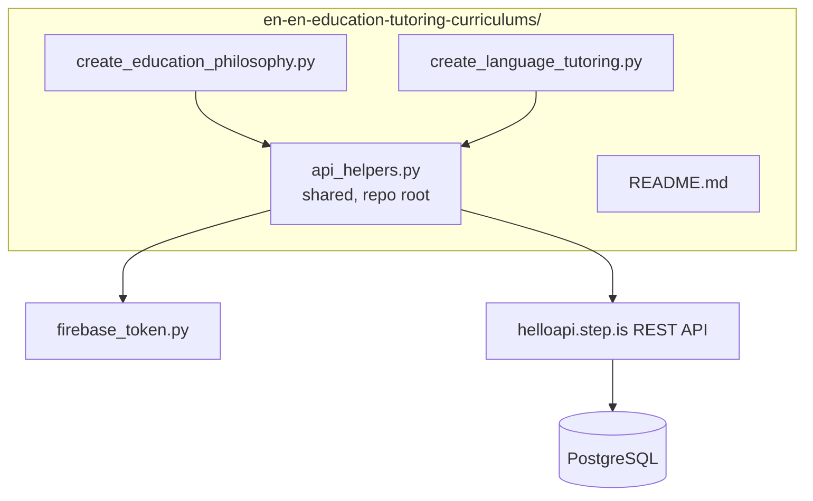
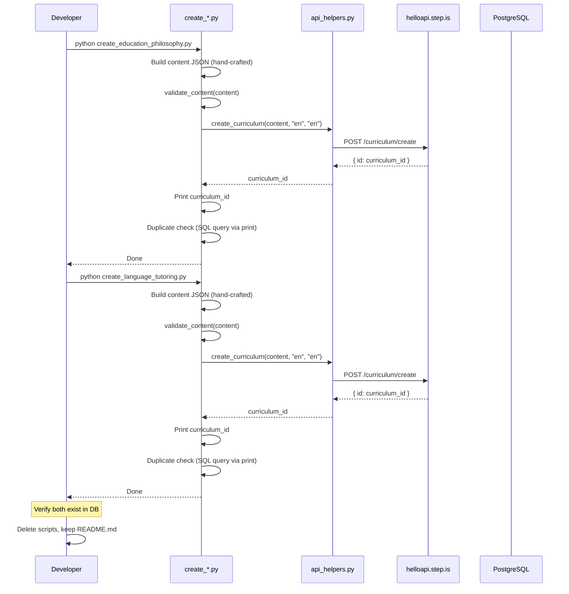

# Design Document: EN-EN Education & Tutoring Curriculums

## Overview

This design covers the creation of 2 standalone en-en advanced curriculums on education philosophy and language tutoring. The system consists of:

- **2 standalone Python scripts** — one per curriculum, each containing all hand-crafted English content inline
- **No orchestrator** — curriculums are created private and standalone (no collection/series)
- **No separate validator module** — validation logic is inline in each script (simple structural checks before upload)
- **Shared API helpers** — uses the existing root-level `api_helpers.py` for the `create_curriculum` call

The language pair is `language="en"`, `userLanguage="en"` (English speakers learning advanced English vocabulary). All text is in English. Each curriculum has 5 sessions with 6+ vocabulary words per session (30+ total), 800-1200+ word reading passages, and balanced skills coverage in every session.

### Key Design Decisions

1. **Standalone private curriculums** — no collection, no series, no display order, no price. Created private by default. This keeps the scripts simple: one API call to `curriculum/create` plus a duplicate check query.

2. **Inline validation** — since there are only 2 scripts and the structure is identical (5 sessions, same activity sequence), a simple `validate_content()` function defined inline in each script is sufficient. No need for a separate module.

3. **All English text** — unlike vi-en curriculums where titles/descriptions are Vietnamese and reading is English, en-en advanced curriculums use English everywhere: title, description, preview, introAudio scripts, reading passages, writing prompts.

4. **No template content** — every piece of text (introAudio scripts, reading passages, descriptions, writing prompts) is individually hand-written per curriculum. The `build_content()` function returns a dict with all text literals.

5. **Tone assignments** — with only 2 curriculums, we assign different description tones and different farewell tones to each:
   - Curriculum 1 ("Education as Inspiration"): `provocative_question` description tone, `introspective_guide` farewell tone
   - Curriculum 2 ("Good Language Tutor"): `empathetic_observation` description tone, `practical_momentum` farewell tone

6. **Activity sequence per session** — every session has the same balanced sequence of 11 activities (see Activity Sequence below). This ensures 5+ hours of content per curriculum.

## Architecture



### Execution Flow



## Components and Interfaces

### 1. create_education_philosophy.py

Creates the "Education Is Not About Filling a Pail but Lighting a Fire" curriculum.

**Structure:**
```python
import sys, json, requests
sys.path.insert(0, "/home/ubuntu/nspaceresearch/design-curriculums")
from api_helpers import create_curriculum

def validate_content(content: dict) -> None:
    """Inline structural validation. Raises ValueError on failure."""
    ...

def build_content() -> dict:
    """Returns the complete curriculum content dict with all hand-crafted text."""
    return { ... }

def main():
    content = build_content()
    validate_content(content)
    curriculum_id = create_curriculum(content, "en", "en")
    print(f"Created: {curriculum_id}")
    print(f"Duplicate check SQL:")
    print(f"SELECT id, title, created_at FROM curriculum WHERE title = '...' AND uid = 'zs5AMpVfqkcfDf8CJ9qrXdH58d73' ORDER BY created_at;")

if __name__ == "__main__":
    main()
```

**Content details:**
- Title: "Education Is Not About Filling a Pail but Lighting a Fire"
- Description tone: `provocative_question`
- Farewell tone: `introspective_guide`
- 5 sessions, 30+ vocabulary words total
- Topics: Socratic method, constructivism, intrinsic motivation, progressive education, student-centered learning

### 2. create_language_tutoring.py

Creates the "How to Be a Good Language Tutor" curriculum.

**Structure:** Same as above.

**Content details:**
- Title: "How to Be a Good Language Tutor"
- Description tone: `empathetic_observation`
- Farewell tone: `practical_momentum`
- 5 sessions, 30+ vocabulary words total
- Topics: scaffolding, comprehensible input, error correction, learner autonomy, rapport building, adaptive instruction

### 3. Inline validate_content() Function

Defined identically in both scripts. Checks structural integrity before upload.

**Validation checks:**
1. Top-level: `title`, `description`, `preview.text`, `contentTypeTags` (must be `[]`), `learningSessions` (length = 5)
2. No `youtubeUrl` field anywhere
3. Each session has `title` and `activities` (non-empty array)
4. Each activity has `activityType` (valid value), `title`, `description`, `data` (dict)
5. No `type` field on activities (must be `activityType`)
6. Vocab activities have `vocabList` (array of lowercase strings, length >= 6)
7. `viewFlashcards` and `speakFlashcards` in same session have identical `vocabList`
8. `reading`, `speakReading`, `readAlong` have `data.text` (non-empty)
9. `introAudio` has `data.text` (non-empty)
10. `writingSentence` has `data.vocabList`, `data.items` (each with `prompt`, `targetVocab`)
11. `writingParagraph` has `data.vocabList`, `data.instructions`, `data.prompts` (length >= 2)
12. No strip keys anywhere in JSON tree (mp3Url, illustrationSet, chapterBookmarks, segments, whiteboardItems, userReadingId, lessonUniqueId, curriculumTags, taskId, imageId)
13. Reading text word count >= 800
14. `reading`, `speakReading`, `readAlong` in same session have identical `data.text`

### 4. Activity Sequence Per Session

Every session in both curriculums follows this exact sequence of 11 activities:

```
1. introAudio        — Session introduction + vocabulary teaching (500-800 words)
2. viewFlashcards    — Visual vocab review (6+ words)
3. speakFlashcards   — Speaking vocab practice (same vocabList as viewFlashcards)
4. vocabLevel1       — Vocab exercise level 1 (same vocabList)
5. vocabLevel2       — Vocab exercise level 2 (same vocabList)
6. reading           — Long passage (800-1200+ words)
7. speakReading      — Speak the passage (same text as reading)
8. readAlong         — Listen to the passage (same text as reading)
9. writingSentence   — Sentence-level writing (4-6 items with prompts)
10. writingParagraph — Paragraph-level writing (instructions + 2-3 prompts)
11. introAudio       — Session wrap-up / farewell (final session: 400-600 word farewell with vocab review)
```

This ensures balanced skills in every session: listening (introAudio, readAlong), reading (reading), speaking (speakFlashcards, speakReading), writing (writingSentence, writingParagraph), and vocabulary (viewFlashcards, vocabLevel1, vocabLevel2).

### 5. Vocabulary Plan

#### Curriculum 1: "Education Is Not About Filling a Pail but Lighting a Fire"

| Session | Words (6-7 per session) |
|---------|------------------------|
| 1 | pedagogy, didactic, constructivism, scaffolding, metacognition, heuristic |
| 2 | intrinsic, extrinsic, autonomy, self-efficacy, mastery, engagement |
| 3 | socratic, dialectical, inquiry, facilitation, elicitation, synthesis |
| 4 | progressive, holistic, experiential, differentiation, inclusivity, empowerment |
| 5 | transformative, paradigm, praxis, emancipatory, conscientization, liberation |

**Total: 30 words**

#### Curriculum 2: "How to Be a Good Language Tutor"

| Session | Words (6-7 per session) |
|---------|------------------------|
| 1 | scaffolding, comprehensible, acquisition, proficiency, fluency, interlanguage |
| 2 | recast, elicitation, corrective, uptake, negotiation, reformulation |
| 3 | rapport, affective, motivation, inhibition, fossilization, plateau |
| 4 | formative, summative, rubric, diagnostic, backwash, alignment |
| 5 | autonomy, metacognitive, self-regulated, differentiated, adaptive, responsive |

**Total: 30 words**

**No overlap:** The two vocabulary sets are entirely distinct (no shared words).

### 6. Tone Assignments

| Curriculum | Description Tone | Farewell Tone |
|-----------|-----------------|---------------|
| Education Is Not About Filling a Pail | `provocative_question` | `introspective_guide` |
| How to Be a Good Language Tutor | `empathetic_observation` | `practical_momentum` |

Both tones are different between the two curriculums, satisfying the adjacency constraint.

## Data Models

### Curriculum Content JSON Structure (Top Level)

```json
{
  "title": "Education Is Not About Filling a Pail but Lighting a Fire",
  "contentTypeTags": [],
  "description": "WHY DO MOST STUDENTS FORGET 90% OF WHAT THEY LEARN WITHIN A WEEK?\n\nYou sat through years of lectures...",
  "preview": {
    "text": "What if everything you believed about teaching and learning was built on a flawed assumption?..."
  },
  "learningSessions": [
    { "title": "Session 1", "activities": [...] },
    { "title": "Session 2", "activities": [...] },
    { "title": "Session 3", "activities": [...] },
    { "title": "Session 4", "activities": [...] },
    { "title": "Session 5", "activities": [...] }
  ]
}
```

### Activity Data Schemas

#### introAudio

```json
{
  "activityType": "introAudio",
  "title": "Introduction to Education Philosophy",
  "description": "Welcome to Session 1 — exploring the foundations of transformative education.",
  "data": {
    "text": "Welcome to the first session of our exploration into the philosophy of education..."
  }
}
```

#### viewFlashcards / speakFlashcards / vocabLevel1 / vocabLevel2

```json
{
  "activityType": "viewFlashcards",
  "title": "Flashcards: Foundations of Pedagogy",
  "description": "Learn 6 words: pedagogy, didactic, constructivism, scaffolding, metacognition, heuristic",
  "data": {
    "vocabList": ["pedagogy", "didactic", "constructivism", "scaffolding", "metacognition", "heuristic"]
  }
}
```

All four vocab activities in the same session share the identical `vocabList` array.

#### reading

```json
{
  "activityType": "reading",
  "title": "Read: The Socratic Method and the Art of Questioning",
  "description": "In a small classroom in ancient Athens, a barefoot philosopher changed the world...",
  "data": {
    "text": "In a small classroom in ancient Athens, a barefoot philosopher changed the world not by providing answers, but by asking questions..."
  }
}
```

The `data.text` field contains 800-1200+ words of original educational content.

#### speakReading

```json
{
  "activityType": "speakReading",
  "title": "Read: The Socratic Method and the Art of Questioning",
  "description": "In a small classroom in ancient Athens, a barefoot philosopher changed the world...",
  "data": {
    "text": "[identical to reading data.text]"
  }
}
```

#### readAlong

```json
{
  "activityType": "readAlong",
  "title": "Listen: The Socratic Method and the Art of Questioning",
  "description": "Listen to the passage you just read and follow along.",
  "data": {
    "text": "[identical to reading data.text]"
  }
}
```

#### writingSentence

```json
{
  "activityType": "writingSentence",
  "title": "Write: Applying Education Philosophy Vocabulary",
  "description": "Write sentences using vocabulary from this session in educational contexts.",
  "data": {
    "vocabList": ["pedagogy", "didactic", "constructivism", "scaffolding", "metacognition", "heuristic"],
    "items": [
      {
        "prompt": "Use the word 'pedagogy' in a sentence about teaching approaches. Example: Modern pedagogy emphasizes active student participation rather than passive absorption of information from lectures.",
        "targetVocab": "pedagogy"
      },
      {
        "prompt": "Use the word 'constructivism' in a sentence about how students build knowledge. Example: Constructivism suggests that learners do not simply receive information but actively construct meaning through their experiences and prior knowledge.",
        "targetVocab": "constructivism"
      }
    ]
  }
}
```

Each `writingSentence` has 4-6 items, each with a detailed `prompt` (context + example sentence) and `targetVocab`.

#### writingParagraph

```json
{
  "activityType": "writingParagraph",
  "title": "Write: Reflecting on Transformative Education",
  "description": "Write a paragraph analyzing education philosophy concepts using session vocabulary.",
  "data": {
    "vocabList": ["pedagogy", "didactic", "constructivism", "scaffolding", "metacognition", "heuristic"],
    "instructions": "Write 4-6 sentences analyzing how constructivist pedagogy differs from traditional didactic instruction. Use at least 3-4 vocabulary words from this session to support your argument.",
    "prompts": [
      "Compare the role of the teacher in a constructivist classroom versus a traditional didactic classroom. How does scaffolding change the teacher's function from information-deliverer to learning-facilitator?",
      "Explain how metacognition and heuristic thinking develop differently when students are taught through inquiry-based methods versus direct instruction. What are the long-term implications for learner independence?"
    ]
  }
}
```

Each `writingParagraph` has `instructions` (overall task description), `vocabList`, and `prompts` (2-3 specific analytical prompts).

### API Call Parameters

| Parameter | Value |
|-----------|-------|
| `firebaseIdToken` | From `get_firebase_id_token("zs5AMpVfqkcfDf8CJ9qrXdH58d73")` |
| `language` | `"en"` |
| `userLanguage` | `"en"` |
| `content` | `json.dumps(content_dict)` |

Single API call per script: `POST https://helloapi.step.is/curriculum/create`

### Post-Creation Verification

After each script runs:
```sql
SELECT id, title, created_at FROM curriculum
WHERE title = '<curriculum_title>' AND uid = 'zs5AMpVfqkcfDf8CJ9qrXdH58d73'
ORDER BY created_at;
```

If duplicates found, keep earliest, delete extras.

## Correctness Properties

*A property is a characteristic or behavior that should hold true across all valid executions of a system — essentially, a formal statement about what the system should do. Properties serve as the bridge between human-readable specifications and machine-verifiable correctness guarantees.*

The `validate_content()` function is the primary component amenable to property-based testing. It is a pure function: takes a content dict, returns None or raises ValueError. The input space is large (arbitrary JSON structures), and universal properties hold across all valid/invalid inputs.

### Property 1: Session structure completeness

*For any* valid curriculum content dict, the `learningSessions` array SHALL have exactly 5 elements, and each session SHALL contain all 10 required activity types: introAudio, viewFlashcards, speakFlashcards, vocabLevel1, vocabLevel2, reading, speakReading, readAlong, writingSentence, writingParagraph.

**Validates: Requirements 1.2, 1.3, 2.2, 2.3**

### Property 2: VocabList structural validity

*For any* activity with activityType in {viewFlashcards, speakFlashcards, vocabLevel1, vocabLevel2}, the activity SHALL have a `data.vocabList` field that is an array of at least 6 lowercase strings, using the field name `vocabList` (never `words`).

**Validates: Requirements 3.1, 3.2, 3.3, 3.4**

### Property 3: ViewFlashcards/speakFlashcards vocabList consistency

*For any* session containing both a viewFlashcards and a speakFlashcards activity, their `data.vocabList` arrays SHALL be identical (same elements in same order).

**Validates: Requirements 1.10, 2.10**

### Property 4: Activity metadata completeness

*For any* activity in any session, the activity SHALL have `activityType` (string from valid set), `title` (non-empty string), `description` (non-empty string), and `data` (dict). Each session SHALL have a `title` field (non-empty string).

**Validates: Requirements 4.1, 4.7, 13.2, 13.3**

### Property 5: Title format conventions

*For any* viewFlashcards/speakFlashcards/vocabLevel1/vocabLevel2 activity, the title SHALL start with "Flashcards: ". *For any* reading/speakReading activity, the title SHALL start with "Read: ". *For any* readAlong activity, the title SHALL start with "Listen: ". *For any* writingSentence/writingParagraph activity, the title SHALL start with "Write: ".

**Validates: Requirements 4.2, 4.3, 4.4, 4.6**

### Property 6: Reading text presence and minimum length

*For any* reading activity, `data.text` SHALL be a non-empty string with word count >= 800. *For any* speakReading, readAlong, or introAudio activity, `data.text` SHALL be a non-empty string.

**Validates: Requirements 7.1, 7.2, 7.3**

### Property 7: Reading text consistency within session

*For any* session containing reading, speakReading, and readAlong activities, all three SHALL have identical `data.text` values.

**Validates: Requirements 7.4**

### Property 8: Forbidden keys rejection

*For any* curriculum content dict, if any strip key (mp3Url, illustrationSet, chapterBookmarks, segments, whiteboardItems, userReadingId, lessonUniqueId, curriculumTags, taskId, imageId) or `youtubeUrl` appears at any depth in the JSON tree, `validate_content()` SHALL raise a ValueError.

**Validates: Requirements 1.5, 8.1**

### Property 9: WritingSentence data structure validity

*For any* writingSentence activity, `data` SHALL contain `vocabList` (array of lowercase strings), and `items` (non-empty array where each element has `prompt` as non-empty string and `targetVocab` as non-empty string).

**Validates: Requirements 6.1**

### Property 10: WritingParagraph data structure validity

*For any* writingParagraph activity, `data` SHALL contain `vocabList` (array of lowercase strings), `instructions` (non-empty string), and `prompts` (array of strings with length >= 2).

**Validates: Requirements 6.2**

### Property 11: Content fields inside data only

*For any* activity, content-specific fields (text, vocabList, items, instructions, prompts) SHALL appear only inside the `data` object, never as inline fields on the activity object itself.

**Validates: Requirements 13.3**

## Error Handling

### Script-Level Errors

| Error | Handling |
|-------|----------|
| Validation failure | `validate_content()` raises `ValueError` with specific message. Script exits before API call. |
| Firebase token failure | `get_firebase_id_token()` raises exception. Script exits with error message. |
| API 500/network error | `requests` raises `HTTPError`. Script prints error and exits. |
| Duplicate curriculum | Script prints duplicate check SQL. Developer manually resolves. |

### Validation Error Messages

The `validate_content()` function provides specific error messages:
- `"learningSessions must have exactly 5 sessions, got {n}"`
- `"Session {i}: missing required activity type: {type}"`
- `"Session {i}, activity {j}: vocabList must be array of lowercase strings"`
- `"Session {i}: viewFlashcards and speakFlashcards have different vocabList"`
- `"Session {i}, activity {j}: reading text must be >= 800 words, got {n}"`
- `"Forbidden key '{key}' found at path: {path}"`
- `"contentTypeTags must be [] (empty array)"`

## Testing Strategy

### Validation Testing (Property-Based)

The `validate_content()` function is suitable for property-based testing using Python's `hypothesis` library (already present in the workspace via `.hypothesis/` directory).

**Configuration:**
- Minimum 100 iterations per property test
- Each test references its design document property number
- Tag format: `Feature: en-en-education-tutoring-curriculums, Property {N}: {title}`

**Approach:**
- Generate random curriculum content dicts using hypothesis strategies
- Test that valid content passes validation (Property 1-7, 9-11)
- Test that invalid content (with injected strip keys, wrong field names, missing fields) fails validation (Property 8)
- Use `@given` decorator with custom strategies for curriculum content generation

### Integration Testing (Post-Creation)

After running each script:
1. Query database for the created curriculum by title
2. Fetch content via `curriculum/getOne` and verify structure
3. Check `is_public = false`
4. Run duplicate check query

### Unit Testing (Example-Based)

- Verify `contentTypeTags` is `[]` in both curriculums
- Verify `language` and `userLanguage` are both `"en"` in API call
- Verify no `setPublic` call in either script
- Verify vocabulary sets have no overlap between the two curriculums
- Verify each curriculum has exactly 30 vocabulary words

### Content Quality (Manual Review)

- Reading passages are original and on-topic
- introAudio scripts teach each word with definition, example, and context
- Writing prompts are specific and include example sentences
- Description follows persuasive copy 5-beat structure
- Preview is ~150 words with vivid hook
- Farewell reviews 5-6 words with fresh examples
