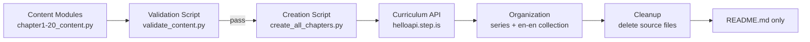

# Design Document: en-en Novel — Upper-Intermediate Science Fiction

## Overview

This design covers the creation of a 20-chapter science fiction novel curriculum series for English-only (en-en) upper-intermediate (B2) learners. The novel follows the exact structural template of "The Last Light of Alder House" (series ID: `70b5bb22`) — 20 chapters, 6 sessions per chapter, 4 vocab words per session 1–5, 20 vocab per chapter review, reading passages of ~150–290 words each.

The system produces:
1. **20 Python content modules** (`chapter1_content.py` – `chapter20_content.py`) — each exports a curriculum dict for one chapter
2. **A creation script** (`create_all_chapters.py`) — uploads all 20 chapters, creates the series, and attaches it to an en-en fiction collection
3. **A validation script** (`validate_content.py`) — checks all correctness properties before upload
4. **A README** (`README.md`) — retained after cleanup with recovery instructions

Key differences from the Silent Clocktower (vi-en, 10 chapters, preintermediate):
- **20 chapters** (not 10)
- **en-en**: All user-facing text is English only — no Vietnamese titles, descriptions, previews, or session names
- **Upper-intermediate (B2)**: More complex prose, richer vocabulary, longer passages
- **Plain vocabList**: `["word1", "word2", "word3", "word4"]` — no translation objects, no example sentences
- **4 words per session** (not 3), **20 per chapter** (not 15)
- **Collection**: Cannot use "Truyện (Fiction)" (97cee550, vi-en). Must find or create an en-en fiction collection at runtime.

## Architecture



### Pipeline Steps

1. **Content authoring**: Each `chapterN_content.py` defines a `get_curriculum()` function returning the full curriculum dict
2. **Validation**: `validate_content.py` imports all 20 modules, runs all correctness checks, reports violations
3. **Upload**: `create_all_chapters.py` imports each module, calls `curriculum/create` for each, then creates the series and attaches to an en-en fiction collection
4. **Cleanup**: Source `.py` files are deleted; `README.md` documents how to recover content from DB

### Key Design Decisions

- **Single creation script**: One `create_all_chapters.py` handles all 20 uploads and series organization. Same pattern as Silent Clocktower.
- **No hardcoded IDs**: Curriculum IDs come from API responses. Collection ID is looked up by title at runtime.
- **en-en collection handling**: The creation script searches for an existing en-en fiction collection by title (e.g., "Fiction"). If none exists, it creates one. It must NOT use the vi-en "Truyện (Fiction)" collection (97cee550).
- **Plain vocabList format**: Matches Alder House exactly — `data.vocabList` is a simple array of word strings, no translation or example sentence objects.
- **audioSpeed on all activities**: Set to -0.2 on viewFlashcards, reading, and readAlong activities (in the `data` object), matching Alder House.

## Components and Interfaces

### Component 1: Content Modules (`chapterN_content.py`, N=1..20)

Each module exports one function:

```python
def get_curriculum() -> dict:
    """Return the complete curriculum dict for chapter N."""
```

The returned dict contains:
- English-only title, preview (~150 words), and description
- 20 B2-level vocabulary words as plain strings
- 5 reading passages (~150–290 words each) in English
- 6 sessions with correctly ordered activities
- `language = "en"`, `userLanguage = "en"`

### Component 2: Validation Script (`validate_content.py`)

```python
def validate_all() -> list[str]:
    """Import all 20 content modules, run all checks, return list of violations."""
```

Checks performed (mapped to correctness properties):
- Session count = 6 per chapter
- Activity types and order per session
- Vocab word counts (4 per session 1–5, 20 for session 6)
- Session 6 readAlong = concatenation of all 5 passages
- Vocab words appear in their assigned passage text
- No strip-keys present
- Non-empty title/description on all activities
- English-only text (no Vietnamese/Chinese characters)
- audioSpeed = -0.2 on applicable activities
- No vocab word repeated across chapters
- language = "en", userLanguage = "en"
- Passage word count in range
- Title format follows English-only convention

### Component 3: Creation Script (`create_all_chapters.py`)

```python
def main():
    """Upload all 20 chapters, create series, attach to en-en fiction collection."""
```

Steps:
1. Authenticate via `firebase_token.get_firebase_id_token(UID)`
2. Import and upload each chapter via `curriculum/create`
3. Create series via `curriculum-series/create` with English title, `language="en"`, `userLanguage="en"`
4. Add each curriculum to series via `curriculum-series/addCurriculum` with display_order 1–20
5. Look up or create an en-en fiction collection:
   - Call `curriculum-collection/listAll` and search for a collection titled "Fiction" (or similar) that is en-en
   - If not found, create a new collection via `curriculum-collection/create` with title "Fiction", `language="en"`, `userLanguage="en"`
6. Attach series to collection via `curriculum-collection/addSeriesToCollection`
7. Set series to public via `curriculum-series/setIsPublic`

### Component 4: README (`README.md`)

Post-cleanup documentation containing:
- How content was created
- Series ID, collection ID
- SQL queries to find all 20 chapter curriculums
- Novel summary for recreation context

### Interface: Curriculum API

All calls go to `https://helloapi.step.is/` with `firebaseIdToken` in the request body.

| Endpoint | Purpose |
|---|---|
| `curriculum/create` | Upload a chapter curriculum |
| `curriculum-series/create` | Create the novel series |
| `curriculum-series/addCurriculum` | Add chapter to series with display_order |
| `curriculum-series/setIsPublic` | Make series visible |
| `curriculum-collection/listAll` | Look up en-en fiction collection by title |
| `curriculum-collection/create` | Create new en-en fiction collection if needed |
| `curriculum-collection/addSeriesToCollection` | Attach series to collection |

### Interface: Firebase Auth

```python
sys.path.insert(0, "/home/ubuntu/nspaceresearch/design-curriculums")
from firebase_token import get_firebase_id_token

UID = "zs5AMpVfqkcfDf8CJ9qrXdH58d73"
token = get_firebase_id_token(UID)
```

## Data Models

### Curriculum Dict Structure

```python
{
    "title": "[Novel Title] — Chapter 1: [Chapter Title]",
    "language": "en",
    "userLanguage": "en",
    "level": "upperintermediate",
    "audioSpeed": -0.2,
    "preview": {
        "text": "...(~150 words English preview)..."
    },
    "description": "...(short English summary)...",
    "learningSessions": [
        # Sessions 1–5: viewFlashcards, reading, readAlong
        # Session 6: viewFlashcards (all 20), readAlong (full chapter)
    ]
}
```

### Session Structure (Sessions 1–5)

```python
{
    "title": "Session 1",
    "activities": [
        {
            "activityType": "viewFlashcards",
            "title": "Flashcards: [topic]",
            "description": "Learn 4 words: word1, word2, word3, word4",
            "data": {
                "vocabList": ["word1", "word2", "word3", "word4"],
                "audioSpeed": -0.2
            }
        },
        {
            "activityType": "reading",
            "title": "Read: [topic]",
            "description": "First ~80 characters of the reading text...",
            "data": {
                "text": "...(150–290 words English passage)...",
                "audioSpeed": -0.2
            }
        },
        {
            "activityType": "readAlong",
            "title": "Listen: [topic]",
            "description": "Listen to the passage and follow along.",
            "data": {
                "text": "...(same passage text as reading)...",
                "audioSpeed": -0.2
            }
        }
    ]
}
```

### Session 6 Structure (Review)

```python
{
    "title": "Review",
    "activities": [
        {
            "activityType": "viewFlashcards",
            "title": "Flashcards: Review all vocabulary",
            "description": "Learn 20 words: word1, word2, ..., word20",
            "data": {
                "vocabList": [
                    # All 20 vocabulary words from the chapter
                ],
                "audioSpeed": -0.2
            }
        },
        {
            "activityType": "readAlong",
            "title": "Listen: Full Chapter",
            "description": "Listen to the full chapter and follow along.",
            "data": {
                "text": "...(all 5 passages concatenated with \\n\\n)...",
                "audioSpeed": -0.2
            }
        }
    ]
}
```

### Vocabulary Format (en-en plain strings)

Unlike the Silent Clocktower (vi-en) which uses word objects with `word`, `translation`, and `exampleSentence` fields, the en-en format uses a simple array of word strings:

```python
# en-en format (this novel, matching Alder House)
"vocabList": ["elaborate", "threshold", "compelling", "ambiguous"]

# vi-en format (Silent Clocktower — NOT used here)
"words": [{"word": "investigate", "translation": "điều tra", "exampleSentence": "..."}]
```

### Strip Keys (must NOT be present)

```python
STRIP_KEYS = {"mp3Url", "illustrationSet", "chapterBookmarks", "segments",
              "whiteboardItems", "userReadingId", "lessonUniqueId",
              "curriculumTags", "taskId", "imageId"}
```

### File Layout

```
original-novels/[novel-folder-name]/
├── chapter1_content.py     # Content module for chapter 1
├── chapter2_content.py     # ...
├── ...
├── chapter20_content.py    # Content module for chapter 20
├── validate_content.py     # Validation script
├── create_all_chapters.py  # Upload + series organization script
└── README.md               # Kept after cleanup
```


## Correctness Properties

*A property is a characteristic or behavior that should hold true across all valid executions of a system — essentially, a formal statement about what the system should do. Properties serve as the bridge between human-readable specifications and machine-verifiable correctness guarantees.*

### Property 1: Session structure is correct

*For any* chapter curriculum, it shall contain exactly 6 learning sessions, where sessions 1–5 each have exactly 3 activities in order (viewFlashcards, reading, readAlong) and session 6 has exactly 2 activities in order (viewFlashcards, readAlong).

**Validates: Requirements 4.1, 4.2, 4.3, 7.1, 7.2, 7.3**

### Property 2: Vocabulary word counts are correct

*For any* chapter curriculum, each viewFlashcards activity in sessions 1–5 shall contain a vocabList of exactly 4 word strings, the session 6 viewFlashcards shall contain a vocabList of exactly 20 word strings equal to the union of all words from sessions 1–5, and the total unique vocabulary words per chapter shall be exactly 20.

**Validates: Requirements 2.2, 3.1, 4.4, 4.5, 7.4, 7.5**

### Property 3: Vocabulary words appear in their assigned passage

*For any* chapter and *for any* session 1–5, each of the 4 vocabulary words assigned to that session shall appear (case-insensitive) in the corresponding reading passage text.

**Validates: Requirements 2.3, 7.7, 10.3**

### Property 4: No vocabulary word is repeated across chapters

*For any* pair of chapters, the intersection of their vocabulary word sets shall be empty. Across all 20 chapters, there shall be 400 unique vocabulary words total.

**Validates: Requirements 3.3, 7.12**

### Property 5: VocabList contains plain strings only

*For any* viewFlashcards activity across all chapters, every element in the vocabList array shall be a non-empty string (not an object, not null, not empty). No translation or exampleSentence fields shall be present.

**Validates: Requirements 3.5, 3.6, 11.5**

### Property 6: readAlong text matches reading text in sessions 1–5

*For any* chapter and *for any* session 1–5, the readAlong activity's `data.text` shall be identical to the reading activity's `data.text` in the same session.

**Validates: Requirements 4.7**

### Property 7: Session 6 readAlong contains the full chapter text

*For any* chapter, the session 6 readAlong `data.text` shall equal the concatenation of all 5 passage texts (from sessions 1–5 reading activities) joined with `\n\n`.

**Validates: Requirements 4.8, 7.6**

### Property 8: audioSpeed is set correctly on all activities

*For any* chapter and *for any* activity (viewFlashcards, reading, readAlong), the `data.audioSpeed` field shall be set to -0.2.

**Validates: Requirements 4.9, 7.11**

### Property 9: Passage word count is in range

*For any* reading passage across all chapters, the word count shall be between 135 and 320 words (±10% tolerance of the 150–290 target range).

**Validates: Requirements 2.4, 10.4**

### Property 10: Curriculum title follows English-only format

*For any* chapter N curriculum, the title shall match the pattern `[Novel Title] — Chapter N: [Chapter Title]`, shall contain "Chapter N" with the correct chapter number, shall be entirely in English (no Vietnamese/Chinese characters), and shall NOT contain any difficulty level descriptor (e.g., "upperintermediate", "advanced", "beginner").

**Validates: Requirements 2.5, 5.1, 8.8**

### Property 11: Session titles are correct

*For any* chapter, sessions 1–5 shall have titles "Session 1" through "Session 5" respectively, and session 6 shall have title "Review".

**Validates: Requirements 5.4, 5.5**

### Property 12: Activity titles, descriptions, and required fields

*For any* activity across all chapters: all activities shall have non-empty `activityType`, `title`, `description`, and `data` fields. viewFlashcards titles shall start with "Flashcards:", reading titles shall start with "Read:", readAlong titles in sessions 1–5 shall start with "Listen:", and session 6 readAlong title shall contain "Full Chapter".

**Validates: Requirements 5.6, 5.7, 5.8, 5.9, 7.9, 11.4**

### Property 13: English-only metadata and language fields

*For any* chapter curriculum: `language` shall be "en", `userLanguage` shall be "en", the preview text shall exist and contain between 100 and 200 words, the description shall be non-empty, and no field in the entire curriculum dict shall contain Vietnamese diacritics or Chinese characters.

**Validates: Requirements 5.2, 5.3, 5.10, 5.11, 7.10, 7.13, 8.6**

### Property 14: No auto-generated platform keys present

*For any* chapter curriculum dict (recursively), none of the strip-keys (mp3Url, illustrationSet, chapterBookmarks, segments, whiteboardItems, userReadingId, lessonUniqueId, curriculumTags, taskId, imageId) shall be present.

**Validates: Requirements 6.2, 7.8**

## Error Handling

### Validation Errors

The validation script (`validate_content.py`) is the primary error-handling mechanism. It runs before any upload and reports violations with specificity:

- **Format**: `FAIL [Chapter N, Session M, Activity type]: description of violation`
- **Behavior**: Collects all violations across all 20 chapters, prints a summary, and exits with non-zero status if any violations found
- **No partial uploads**: The creation script should only proceed if validation passes with zero violations

### API Errors

The creation script handles API failures:

- **Authentication failure**: If `get_firebase_id_token()` fails, abort with clear error message
- **Upload failure**: If `curriculum/create` returns non-200, print the response body and abort. Do not continue uploading remaining chapters.
- **Series creation failure**: If series creation or curriculum attachment fails, print the error and the IDs of already-uploaded curriculums so they can be cleaned up manually
- **Collection lookup/creation failure**: If no en-en fiction collection can be found or created, abort with a message listing available collections. Do not fall back to the vi-en "Truyện (Fiction)" collection.

### Content Module Errors

- **Import failure**: If a `chapterN_content.py` cannot be imported, the validation script reports which module failed and continues checking others
- **Missing function**: If `get_curriculum()` is not defined in a module, report the specific module

## Testing Strategy

### Validation Script as the Test Suite

Since there is no build system or test framework in this workspace, the validation script (`validate_content.py`) serves as the test suite. It implements all 14 correctness properties as programmatic checks.

### Property-Based Testing Approach

The content modules produce a fixed set of 20 curriculum dicts (not random inputs), so traditional property-based testing with random generation doesn't apply here. Instead, the validation script applies each property universally across all 20 chapters — effectively treating the 20 chapters as the input space and verifying that every property holds for all of them.

Each check in the validation script is tagged with a comment referencing the design property:

```python
# Feature: en-en-novel-upperintermediate, Property 1: Session structure is correct
def check_p1_session_structure(curriculum, chapter_num):
    ...
```

### Dual Testing Approach

- **Property checks** (Properties 1–14): Verified across all 20 chapters by `validate_content.py`
- **Example checks**: Specific spot checks (e.g., chapter 1 has exactly 6 sessions, session 6 title is "Review")
- **Edge cases**: Session 6 concatenation with varying passage lengths, vocab overlap boundary (zero shared words across all 190 chapter pairs)

### Validation Checks Mapped to Properties

| Property | Validation Check |
|---|---|
| P1: Session structure | Count sessions, verify activity types and order |
| P2: Vocab counts | Count vocabList length per session (4 or 20), verify session 6 = union of 1–5 |
| P3: Vocab in passage | Case-insensitive substring search in reading text |
| P4: No cross-chapter repeats | Set intersection across all chapter word lists |
| P5: VocabList format | Type check: each element is a non-empty string, not a dict |
| P6: readAlong = reading | String equality check per session 1–5 |
| P7: Session 6 full text | Concatenate passages with `\n\n`, compare to session 6 readAlong |
| P8: audioSpeed | Check `data.audioSpeed` == -0.2 on all activities |
| P9: Passage word count | `len(text.split())` in range [135, 320] |
| P10: Title format | Regex match for "Chapter N", no Vietnamese/Chinese chars, no level strings |
| P11: Session titles | Exact string match: "Session 1"–"Session 5", "Review" |
| P12: Activity formats | Prefix checks per activity type, field presence checks |
| P13: English-only metadata | Language field checks, Vietnamese/Chinese character absence, preview word count |
| P14: No strip-keys | Recursive key scan against strip-keys set |

### Key Differences from Silent Clocktower Validation

| Aspect | Silent Clocktower (vi-en) | This Novel (en-en) |
|---|---|---|
| Chapters | 10 | 20 |
| Vocab per session | 3 | 4 |
| Vocab per chapter | 15 | 20 |
| VocabList format | Word objects (word/translation/exampleSentence) | Plain strings |
| Session titles | "Phần N", "Ôn tập" | "Session N", "Review" |
| Activity title prefixes | "Đọc:", "Nghe:" | "Read:", "Listen:" |
| Metadata language | Vietnamese preview/description, userLanguage="vi" | English-only, userLanguage="en" |
| Title format | Bilingual (Vietnamese + English) | English only |
| P13 check | Vietnamese diacritics present | Vietnamese/Chinese diacritics absent |
| Cross-chapter vocab | 150 unique words | 400 unique words |
| Passage word range | 135–220 | 135–320 |

### Running Validation

```bash
cd original-novels/[novel-folder-name]
python validate_content.py
```

Expected output on success:
```
Validating chapter 1... OK
Validating chapter 2... OK
...
Validating chapter 20... OK
Cross-chapter vocab check... OK
All 14 properties verified across 20 chapters. 0 violations.
```

Expected output on failure:
```
Validating chapter 3...
  FAIL [Chapter 3, Session 2, viewFlashcards]: Expected 4 words, found 3
  FAIL [Chapter 3, Session 2, reading]: Vocab word 'elaborate' not found in passage text
...
2 violations found. Fix before uploading.
```
