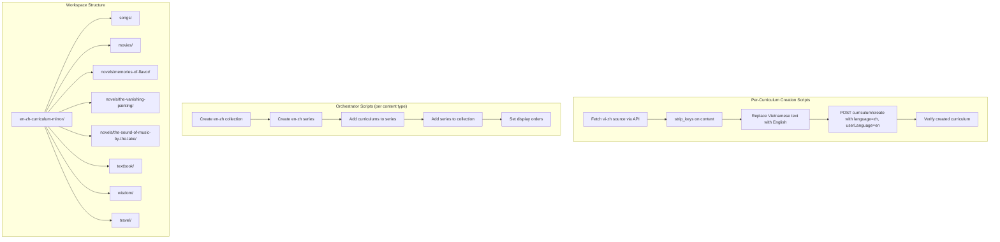

# Design Document: En-Zh Curriculum Mirror

## Overview

This feature creates 61 en-zh mirror curriculums from existing vi-zh curriculums, along with 5 new collections and 7 new series to house them. The transformation is mechanical at the structural level (fetch → strip keys → swap text → upload) but requires hand-crafted English text for every piece of user-facing content.

The system is a set of standalone Python scripts — one per curriculum for content creation, plus orchestrator scripts for collection/series wiring. There is no framework, no build system, no test suite. Scripts run once, create the curriculum in the database, then get deleted, leaving only a README.

### Key Design Decisions

1. **One script per curriculum** — Each curriculum gets its own Python file with hand-written English text. No templates, no shared text generation. This matches the existing vi-zh creation pattern and the workspace's "no templated content" rule.

2. **Orchestrator scripts per content type** — Each content type (songs, movies, novels, textbook, wisdom, travel) gets an orchestrator script that creates the en-zh collection and series, wires curriculums into series, and sets display orders.

3. **Reuse existing `strip_keys()` pattern** — Each creation script defines `strip_keys()` inline (or imports from a shared helper), matching the established workspace pattern.

4. **Post-creation verification built into each script** — Every creation script fetches the created curriculum back and verifies language params, session/activity counts, and absence of stripped keys.

## Architecture



### Execution Order

1. Run orchestrator scripts to create en-zh collections and series (can be done once upfront or per content type)
2. Run per-curriculum creation scripts (order within a content type doesn't matter)
3. Run orchestrator scripts to add curriculums to series, set display orders
4. Verify final state: 61 curriculums across 7 series and 5 collections

Steps 1 and 3 can be combined into a single orchestrator script per content type that creates the collection/series, then creates all curriculums, then wires everything together.

## Components and Interfaces

### Component 1: Creation Script (one per curriculum)

Each creation script is a standalone Python file that:

1. Imports `firebase_token` via `sys.path` manipulation
2. Fetches the source vi-zh curriculum via `curriculum/getOne`
3. Strips auto-generated keys via `strip_keys()`
4. Replaces all Vietnamese user-facing text with hand-written English text
5. Calls `curriculum/create` with `language="zh"`, `userLanguage="en"`, and the transformed content
6. Verifies the created curriculum

**Interface with API:**
- `GET curriculum/getOne` — fetch source curriculum (no auth required)
- `POST curriculum/create` — create mirror curriculum (requires `firebaseIdToken`)

**Interface with firebase_token:**
- `get_firebase_id_token(uid)` → returns ID token string

### Component 2: Orchestrator Script (one per content type)

Each orchestrator script handles the organizational wiring:

1. Creates an en-zh collection via `curriculum-collection/create`
2. Creates an en-zh series via `curriculum-series/create`
3. Adds series to collection via `curriculum-collection/addSeriesToCollection`
4. Adds curriculums to series via `curriculum-series/addCurriculum`
5. Sets display orders via `curriculum/setDisplayOrder` and `curriculum-series/setDisplayOrder`

**Interface with API:**
- `POST curriculum-collection/create` — create collection (SuperAuth)
- `POST curriculum-series/create` — create series (SuperAuth)
- `POST curriculum-collection/addSeriesToCollection` — wire series to collection (SuperAuth)
- `POST curriculum-series/addCurriculum` — wire curriculum to series (SuperAuth)
- `POST curriculum/setDisplayOrder` — set curriculum display order (SuperAuth)
- `POST curriculum-series/setDisplayOrder` — set series display order (SuperAuth)

### Component 3: strip_keys() Utility

Recursive function that removes auto-generated keys from a nested dict/list structure.

```python
STRIP_KEYS = {"mp3Url", "illustrationSet", "chapterBookmarks", "segments",
              "whiteboardItems", "userReadingId", "lessonUniqueId",
              "curriculumTags", "taskId", "imageId"}

def strip_keys(obj):
    if isinstance(obj, dict):
        return {k: strip_keys(v) for k, v in obj.items() if k not in STRIP_KEYS}
    if isinstance(obj, list):
        return [strip_keys(item) for item in obj]
    return obj
```

### Component 4: Verification Logic

Built into each creation script. After `curriculum/create` returns, fetches the curriculum back and checks:

1. `language == "zh"` and `userLanguage == "en"` (or `user_language == "en"`)
2. Number of sessions matches source
3. Number of activities per session matches source
4. No stripped keys present in content


## Data Models

### Source Curriculum Content Structure (fetched from DB)

The curriculum content is a JSON object with this shape (simplified):

```json
{
  "title": "Học Qua Bài Hát: '月亮代表我的心' – 邓丽君",
  "description": "TẠI SAO BẠN... (Vietnamese persuasive copy)",
  "preview": { "text": "Vietnamese preview text (~150 words)" },
  "youtubeUrl": "https://www.youtube.com/watch?v=...",
  "sessions": [
    {
      "title": "Buổi 1: Từ vựng mới",
      "activities": [
        {
          "type": "introAudio",
          "title": "Giới thiệu bài học",
          "description": "Vietnamese description",
          "practiceMinutes": 3,
          "script": "Vietnamese teaching script with pinyin..."
        },
        {
          "type": "viewFlashcards",
          "title": "Flashcards: Từ vựng buổi 1",
          "description": "Học 6 từ: 月亮, 代表, ...",
          "practiceMinutes": 6,
          "words": [
            { "word": "月亮", "pinyin": "yuèliang", "definition": "Vietnamese def" }
          ]
        },
        {
          "type": "reading",
          "title": "Đọc: Lời bài hát",
          "description": "月亮代表我的心...",
          "practiceMinutes": 5,
          "text": "Chinese reading passage text"
        },
        {
          "type": "readAlong",
          "title": "Nghe: Lời bài hát",
          "description": "Nghe đoạn văn vừa đọc và theo dõi.",
          "practiceMinutes": 3,
          "text": "Same Chinese text as reading"
        },
        {
          "type": "writingSentence",
          "title": "Viết: Dùng từ '月亮'",
          "description": "Viết câu...",
          "practiceMinutes": 10,
          "prompt": "Vietnamese prompt with Chinese example sentence"
        },
        {
          "type": "writingParagraph",
          "title": "Viết: Đoạn văn",
          "description": "Viết đoạn văn...",
          "practiceMinutes": 10,
          "prompt": "Vietnamese prompt"
        }
      ]
    }
  ]
}
```

### Mirror Curriculum Content Structure (after transformation)

Same JSON shape, but all Vietnamese text replaced with English:

```json
{
  "title": "Learn Through Song: '月亮代表我的心' – 邓丽君",
  "description": "English persuasive copy...",
  "preview": { "text": "English preview text (~150 words)" },
  "youtubeUrl": "https://www.youtube.com/watch?v=...",
  "sessions": [
    {
      "title": "Session 1: New Vocabulary",
      "activities": [
        {
          "type": "introAudio",
          "title": "Introduction to the Song",
          "description": "English description",
          "practiceMinutes": 3,
          "script": "English teaching script with pinyin..."
        },
        {
          "type": "viewFlashcards",
          "title": "Flashcards: Session 1 Vocabulary",
          "description": "Learn 6 words: 月亮, 代表, ...",
          "practiceMinutes": 6,
          "words": [
            { "word": "月亮", "pinyin": "yuèliang", "definition": "English def" }
          ]
        }
      ]
    }
  ]
}
```

### Fields That Change (Vietnamese → English)

| Field | Location | Transformation |
|---|---|---|
| `title` | Top-level | Rewrite per content-type title pattern |
| `description` | Top-level | Rewrite as English persuasive copy |
| `preview.text` | Top-level | Rewrite as English preview (~150 words) |
| `sessions[].title` | Each session | "Buổi N" → "Session N", "Ôn tập" → "Review", etc. |
| `activities[].title` | Each activity | "Đọc:" → "Read:", "Nghe:" → "Listen:", etc. |
| `activities[].description` | Each activity | Rewrite in English (preserve Chinese text within) |
| `introAudio.script` | introAudio activities | Full rewrite in English with pinyin |
| `writingSentence.prompt` | writingSentence activities | Rewrite in English, preserve Chinese examples |
| `writingParagraph.prompt` | writingParagraph activities | Rewrite in English |
| `words[].definition` | viewFlashcards/speakFlashcards | Vietnamese → English (if Vietnamese present) |

### Fields That Stay Identical

| Field | Reason |
|---|---|
| `reading.text` | Chinese content |
| `readAlong.text` | Chinese content |
| `words[].word` | Chinese characters |
| `words[].pinyin` | Romanization |
| `youtubeUrl` | External link |
| `audioSpeed` | Playback setting |
| `practiceMinutes` | Activity duration |
| Activity types and order | Structural preservation |
| Session count and order | Structural preservation |

### API Request Shape for curriculum/create

```json
{
  "firebaseIdToken": "<token>",
  "language": "zh",
  "userLanguage": "en",
  "content": "<JSON string of transformed content>"
}
```

### Collection/Series Mapping

| Vi-Zh Collection | En-Zh Collection Title | Series Count |
|---|---|---|
| Học Từ Vựng Tiếng Trung Qua Âm Nhạc (jqmkzvf5) | Learn Chinese Vocabulary Through Music (通过音乐学中文词汇) | 1 |
| Học Từ Vựng Tiếng Trung Qua Điện Ảnh (x8cakjtw) | Learn Chinese Vocabulary Through Cinema (通过电影学中文词汇) | 1 |
| Truyện (小说) (7nf5wi1d) | Fiction (小说) | 3 |
| Sơ Cấp 2 (初级二) (64fb68f8) | Elementary 2 (初级二) | 2 |
| Học Từ Vựng Theo Chủ Đề (q9j66zxj) | Thematic Vocabulary (主题词汇) | 1 |

| Vi-Zh Series | En-Zh Series Title | Curriculum Count |
|---|---|---|
| sjv8b9r7 | Learn Chinese Vocabulary Through Songs (通过歌曲学中文词汇) | 4 |
| v7a70y0u | Learn Chinese Vocabulary Through Film (通过电影学中文词汇) | 4 |
| uq7ezeuh | Memories of Flavor (味道的记忆) | 10 |
| wlzqfag8 | The Vanishing Painting (消失的画) | 10 |
| z6xddztr | The Sound of Music by the Lake (湖边的琴声) | 10 |
| dqce6wbh | Standard Chinese — Elementary 2 | 25 |
| vxvh04b5 | Wisdom in Chinese Characters (汉字中的智慧) | 4 |
| yjwuyhtk | Explore China (探索中国) | 4 |


## Correctness Properties

*A property is a characteristic or behavior that should hold true across all valid executions of a system — essentially, a formal statement about what the system should do. Properties serve as the bridge between human-readable specifications and machine-verifiable correctness guarantees.*

### Property 1: strip_keys removes all target keys at all nesting levels

*For any* nested dict/list structure containing any subset of the 10 auto-generated keys (mp3Url, illustrationSet, chapterBookmarks, segments, whiteboardItems, userReadingId, lessonUniqueId, curriculumTags, taskId, imageId) at any nesting depth, applying `strip_keys()` should produce a structure where none of those keys appear at any level, and all other keys and values are preserved.

**Validates: Requirements 4.2, 4.3, 11.1, 20.3**

### Property 2: Chinese content preservation

*For any* mirror curriculum and its corresponding source curriculum, all Chinese content fields must be identical: reading passage text, vocabulary word characters, vocabulary pinyin, song lyrics, movie dialogue, novel chapter text, readAlong text, youtubeUrl values, audioSpeed values, and practiceMinutes values. Formally: for each activity at position (session_index, activity_index), the Chinese content fields in the mirror must byte-equal the same fields in the source.

**Validates: Requirements 5.1, 5.2, 5.3, 5.4, 5.5, 5.6, 5.7, 5.10, 5.11**

### Property 3: Structural preservation

*For any* mirror curriculum and its corresponding source curriculum, the number of sessions must be equal, and for each session, the number of activities must be equal, and the sequence of activity types must be identical. Formally: `len(mirror.sessions) == len(source.sessions)` and for each session index `i`, `[a.type for a in mirror.sessions[i].activities] == [a.type for a in source.sessions[i].activities]`.

**Validates: Requirements 5.8, 5.9, 20.2**

### Property 4: Language parameters correct

*For any* created mirror curriculum, when fetched back from the database, `language` must be `"zh"` and `userLanguage` (or `user_language`) must be `"en"`.

**Validates: Requirements 9.1, 14.1, 14.2, 20.1**

### Property 5: Display order preservation

*For any* mirror curriculum and its corresponding source curriculum, the mirror's `display_order` within its en-zh series must equal the source's `display_order` within its vi-zh series. Similarly, for any en-zh series and its corresponding vi-zh series, the series `display_order` within its collection must equal the vi-zh series' `display_order` within its collection.

**Validates: Requirements 1.4, 10.1, 10.2**

### Property 6: No cross-contamination between language pairs

*For any* en-zh series, its parent collection must be an en-zh collection (not a vi-zh collection). *For any* en-zh curriculum, its parent series must be an en-zh series (not a vi-zh series). No en-zh content should appear in any vi-zh organizational container.

**Validates: Requirements 14.3, 14.4**

### Property 7: Series description length constraint

*For any* en-zh series description string, `len(description) < 255` must hold, satisfying the database varchar(255) column constraint.

**Validates: Requirements 1.2, 3.9**

### Property 8: Title pattern compliance per content type

*For any* mirror curriculum, its title must match the expected pattern for its content type: song-based titles match `"Learn Through Song: '[Chinese]' – [Artist]"`, movie-based titles match `"Learn Through Film: '[Chinese]' – [English scene]"`, novel titles match `"[English Title] ([Chinese Title]) — Chapter N: [English Chapter] ([Chinese Chapter])"`, wisdom titles match `"[Theme] — Characters of [Concept] ([Chinese]篇)"`, travel titles match `"[Chinese City] — [English tagline] ([Chinese tagline])"`. No title may contain difficulty level descriptors (HSK, Intermediate, Pre-intermediate, Beginner, Advanced).

**Validates: Requirements 7.1, 7.2, 7.3, 7.5, 7.6, 7.7**

### Property 9: Curriculum count parity per series

*For any* en-zh series and its corresponding vi-zh series, the number of curriculums in the en-zh series must equal the number of curriculums in the vi-zh series.

**Validates: Requirements 10.3, 1.5**

### Property 10: Private by default

*For any* created mirror curriculum, `is_public` must be `false`.

**Validates: Requirements 12.1, 12.2**

### Property 11: User-facing text transformed from source

*For any* mirror curriculum and its corresponding source curriculum, the following fields must differ between mirror and source: `title`, `description`, `preview.text`, all `session.title` values, all `introAudio.script` values, all `writingSentence.prompt` values, and all `writingParagraph.prompt` values. This ensures Vietnamese text was replaced, not copied verbatim.

**Validates: Requirements 6.1, 6.2, 6.3, 6.4, 6.5, 6.6, 6.7, 6.8, 6.9**

### Property 12: Vocabulary definition handling

*For any* vocabulary item in a mirror curriculum, if the corresponding source vocabulary item contains a Vietnamese definition (non-Chinese, non-pinyin text in the definition field), the mirror's definition must differ from the source's definition. If the source vocabulary item contains only Chinese and pinyin (no Vietnamese), the mirror's vocabulary item must be identical to the source's.

**Validates: Requirements 17.1, 17.2, 17.3**

### Property 13: Activity metadata follows English patterns

*For any* activity in a mirror curriculum: viewFlashcards/speakFlashcards/vocabLevel titles must start with "Flashcards:"; reading/speakReading titles must start with "Read:"; readAlong titles must start with "Listen:"; introAudio titles must be descriptive English labels; writingSentence/writingParagraph titles must start with "Write:". Session titles must use English labels ("Session N:", "Review", "Full Reading", "Full Lyrics", "Full Dialogue").

**Validates: Requirements 18.1, 18.2, 18.3, 18.4, 18.5, 18.6, 18.7**

## Error Handling

### API Errors

- **Authentication failure**: If `get_firebase_id_token()` fails (expired service account, network error), the script should print the error and exit. No retry logic needed — these are one-shot scripts.
- **curriculum/create failure**: If the API returns non-200, print the status code, response body, and the curriculum title being created. Exit with non-zero status.
- **curriculum/getOne failure**: If fetching the source curriculum fails, print the source curriculum ID and error. Exit.
- **Collection/series creation failure**: If the orchestrator fails to create a collection or series, print the error and exit. Do not proceed to add curriculums to a non-existent series.

### Data Validation Errors

- **Stripped keys still present**: If verification finds any stripped key in the created curriculum, print a warning with the key name and location. This indicates a bug in `strip_keys()`.
- **Session/activity count mismatch**: If the created curriculum has a different number of sessions or activities than the source, print both counts and the curriculum ID. This indicates a content transformation error.
- **Language parameter mismatch**: If the created curriculum doesn't have `language=zh` and `userLanguage=en`, print the actual values. This indicates an API call error.

### Recovery Strategy

Since these are one-shot scripts that create individual curriculums:
- If a script fails partway through, the curriculum may or may not have been created in the DB.
- Before re-running, check if the curriculum already exists (by title search or by checking the script's output for a curriculum ID).
- If a curriculum was created but verification failed, use `curriculum/delete` to remove it before re-running.
- Orchestrator scripts should be idempotent where possible — check if a collection/series already exists before creating.

## Testing Strategy

### No Automated Test Suite

This project has no build system, no test framework, and no CI pipeline. Scripts are standalone Python files run directly. The "testing" is:

1. **Built-in verification in each creation script** — Every script fetches the created curriculum back and checks Properties 2, 3, 4, and the strip-keys constraint (Property 1).

2. **Manual SQL verification** — After all 61 curriculums are created, run SQL queries to verify Properties 5, 6, 7, 9, 10 across the full dataset.

3. **Property-based testing for strip_keys()** — The `strip_keys()` function is the one pure function that can be tested with property-based testing using `hypothesis`.

### Property-Based Testing

**Library**: `hypothesis` (Python)

**Configuration**: Minimum 100 iterations per property test.

The only function amenable to standalone property-based testing is `strip_keys()`, since it's a pure function with well-defined input/output behavior. All other properties require live API calls and database state, making them integration tests rather than unit tests.

**Test file**: `en-zh-curriculum-mirror/test_strip_keys.py`

```python
# Feature: en-zh-curriculum-mirror, Property 1: strip_keys removes all target keys at all nesting levels
from hypothesis import given, settings
from hypothesis import strategies as st

# Strategy: generate nested dicts/lists with some keys from STRIP_KEYS injected
@settings(max_examples=100)
@given(...)
def test_strip_keys_removes_all_target_keys(content):
    """For any nested structure, strip_keys removes all target keys and preserves others."""
    ...
```

### Verification Script (Integration Testing)

A single verification script (`en-zh-curriculum-mirror/verify_all.py`) that runs after all 61 curriculums are created. It:

1. Fetches all en-zh curriculums from the database
2. Fetches all corresponding vi-zh source curriculums
3. For each pair, verifies:
   - Property 2: Chinese content identical
   - Property 3: Structure matches
   - Property 4: Language params correct
   - Property 10: is_public is false
   - Property 11: User-facing text differs
   - Property 12: Vocabulary definitions handled correctly
   - Property 13: Activity metadata follows English patterns
4. Queries series/collection metadata to verify:
   - Property 5: Display orders match
   - Property 6: No cross-contamination
   - Property 7: Series descriptions under 255 chars
   - Property 8: Title patterns correct
   - Property 9: Curriculum counts match

### Unit Tests (Examples and Edge Cases)

Specific example tests in the verification script:

- Collection title mappings (Req 2.1-2.5): Check each of the 5 en-zh collection titles
- Series title mappings (Req 3.1-3.8): Check each of the 7 en-zh series titles
- Total count: Exactly 61 en-zh curriculums across 7 series and 5 collections (Req 1.5)
- Edge case: Vocabulary items with no Vietnamese definition are preserved as-is (Req 17.2)
- Edge case: Activities with Chinese text in descriptions preserve that Chinese text (Req 6.8)

### Test Tagging

Each property test and verification check should be tagged with a comment referencing the design property:

```python
# Feature: en-zh-curriculum-mirror, Property 1: strip_keys removes all target keys at all nesting levels
# Feature: en-zh-curriculum-mirror, Property 2: Chinese content preservation
# Feature: en-zh-curriculum-mirror, Property 3: Structural preservation
# ...
```
