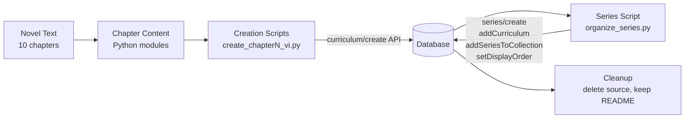

# Design Document: Fiction Novel Curriculum Series

## Overview

This feature creates a complete preintermediate-level fiction novel curriculum series for Vietnamese-English learners. The pipeline has three phases:

1. **Novel authoring** — Write an original 10-chapter English fiction novel targeting CEFR A2-B1 vocabulary and sentence complexity.
2. **Curriculum generation** — Convert each chapter into a structured curriculum with 6 learning sessions (viewFlashcards → reading → readAlong pattern), producing 10 Python creation scripts.
3. **Series organization** — Create the series, add all 10 curriculums, attach to the "Truyện (Fiction)" collection, and set display orders.

The reference series "The Last Light of Alder House" (ID: `70b5bb22`, intermediate level) provides the structural template. The new series differs in: lower vocabulary complexity (preintermediate vs intermediate), a new original story, fresh reading passages, and a reading-first philosophy where vocab flashcards serve as quick refreshers of mostly-known words rather than primary teaching tools.

After successful import, all source materials are deleted and a README is retained for recoverability.

## Novel Specification

### Title
- English: **The Little Bookshop by the Sea**
- Vietnamese: **Tiệm Sách Nhỏ Bên Biển**
- Series title: "Tiệm Sách Nhỏ Bên Biển (The Little Bookshop by the Sea)"

### Genre
Contemporary fiction / feel-good story set in a small English coastal town. Light mystery elements. Warm, optimistic tone.

### Premise
Emma, a 25-year-old woman from London, inherits a small bookshop in a quiet seaside town in Cornwall from her late grandmother. She plans to sell it quickly and return to her city life, but the town, its people, and a hidden collection of rare books change her mind. She must decide between her old life and a new one — while uncovering a secret her grandmother kept for decades.

### Vocabulary Philosophy
This is a **reading-focused** series. The vocabulary flashcards are quick refreshers of words the learner mostly already knows at preintermediate level. The goal is a smooth, immersive reading experience — not heavy vocab acquisition. Words are chosen because they appear naturally in the story and a preintermediate learner would benefit from a quick reminder before reading.

### Characters
- **Emma Clarke** — 25, from London, works in marketing. Practical, independent, a bit impatient. Hasn't visited the town since she was a child.
- **Gran (Margaret Clarke)** — Emma's late grandmother. Ran the bookshop for 40 years. Her presence is felt through letters, notes, and the memories of townspeople.
- **Tom** — 28, local carpenter who helps maintain the bookshop building. Quiet, kind, loves the sea. Becomes Emma's friend.
- **Mrs. Penny** — 65, runs the tea shop next door. Knows everyone in town. Warm and gossipy.
- **Jack** — 70s, retired fisherman and Gran's oldest friend. Holds the key to Gran's secret.

### Chapter Outline and Vocabulary Lists

Each chapter has 15 vocab words. Words are common A2-B1 English words the learner likely already knows — the flashcards serve as a quick review before reading.

---

**Chapter 1: Tin Buồn (The News)**
Emma receives a letter from a lawyer telling her that her grandmother has died and left her a bookshop in Cornwall. She hasn't been there since she was eight. She takes a train from London, watching the countryside change from grey to green.

Vocab: `lawyer`, `inherit`, `property`, `funeral`, `countryside`, `passenger`, `platform`, `luggage`, `journey`, `arrive`, `memory`, `stranger`, `nervous`, `envelope`, `signature`

---

**Chapter 2: Thị Trấn Ven Biển (The Seaside Town)**
Emma arrives in the small town of Saltwick. It's quiet, old-fashioned, and beautiful. She finds the bookshop on the main street — dusty, closed, but full of character. Mrs. Penny from the tea shop next door welcomes her and tells her everyone loved Gran.

Vocab: `harbour`, `cliff`, `seagull`, `cobblestone`, `narrow`, `dusty`, `shelf`, `counter`, `welcome`, `neighbour`, `cheerful`, `kettle`, `biscuit`, `sunset`, `peaceful`

---

**Chapter 3: Tiệm Sách (The Bookshop)**
Emma opens the bookshop for the first time. It's a mess — books everywhere, old receipts, dust. But she finds Gran's handwriting on notes tucked inside books: recommendations, thoughts, little messages to customers. She starts to feel something unexpected: connection.

Vocab: `receipt`, `organize`, `pile`, `discover`, `handwriting`, `message`, `customer`, `recommend`, `dust`, `wooden`, `ladder`, `ceiling`, `curious`, `collection`, `treasure`

---

**Chapter 4: Người Thợ Mộc (The Carpenter)**
Tom comes to fix a broken window. He and Emma talk. He tells her the bookshop is important to the town — it's where people come to talk, read, and feel at home. Emma starts to see the shop differently. She finds a locked room in the back she can't open.

Vocab: `carpenter`, `repair`, `window`, `tool`, `conversation`, `community`, `important`, `comfortable`, `regular`, `lock`, `key`, `basement`, `mystery`, `wonder`, `trust`

---

**Chapter 5: Bí Mật Của Bà (Gran's Secret)**
Emma asks Mrs. Penny and Jack about the locked room. Jack hesitates but finally tells her: Gran kept a collection of rare, valuable books hidden there. She never sold them — she was protecting them. Jack gives Emma an old key. Emma opens the room and finds shelves of beautiful, ancient books.

Vocab: `secret`, `valuable`, `rare`, `ancient`, `protect`, `hesitate`, `honest`, `reveal`, `shelf`, `leather`, `fragile`, `worth`, `fortune`, `promise`, `guard`

---

**Chapter 6: Quyết Định (The Decision)**
A property developer from London contacts Emma. He wants to buy the bookshop and turn it into a holiday rental. The offer is generous. Emma's boss in London is pressuring her to come back. She must choose: sell and return to her old life, or stay and run the bookshop.

Vocab: `developer`, `offer`, `generous`, `pressure`, `decision`, `hesitate`, `opportunity`, `salary`, `rent`, `profit`, `deadline`, `practical`, `doubt`, `risk`, `future`

---

**Chapter 7: Cơn Bão (The Storm)**
A big storm hits Saltwick. The bookshop roof leaks. Emma, Tom, and neighbours work together to save the books. In the chaos, Emma realizes how much she cares about the shop and the people. The storm passes and the town celebrates together at Mrs. Penny's tea shop.

Vocab: `storm`, `damage`, `leak`, `bucket`, `volunteer`, `teamwork`, `rescue`, `soaked`, `candle`, `shelter`, `relief`, `grateful`, `celebrate`, `repair`, `strength`

---

**Chapter 8: Những Lá Thư (The Letters)**
While cleaning up after the storm, Emma finds a box of letters Gran wrote but never sent — letters to Emma's mother, who left the town years ago after an argument. The letters are full of love, regret, and hope. Emma understands why Gran kept the bookshop: it was her way of staying connected.

Vocab: `letter`, `regret`, `argument`, `forgive`, `emotion`, `envelope`, `handwriting`, `apology`, `relationship`, `distance`, `understand`, `tears`, `comfort`, `heal`, `courage`

---

**Chapter 9: Khai Trương Lại (The Reopening)**
Emma decides to stay. She and Tom fix up the bookshop. Mrs. Penny helps organize a grand reopening event. The whole town comes. Emma gives a short speech about Gran and what the bookshop means. Jack brings flowers. The rare book room becomes a small reading library for the town.

Vocab: `reopen`, `decorate`, `invite`, `event`, `speech`, `audience`, `applause`, `proud`, `display`, `arrange`, `banner`, `crowd`, `atmosphere`, `success`, `belong`

---

**Chapter 10: Nhà (Home)**
Months later, Emma has settled into her new life. The bookshop is busy. She's made friends, learned to slow down, and found peace. She writes a letter to her mother, telling her about Gran's letters and inviting her to visit. She looks out at the sea and knows she's home.

Vocab: `settle`, `routine`, `peaceful`, `content`, `friendship`, `invite`, `harbour`, `reflect`, `grateful`, `chapter`, `beginning`, `promise`, `horizon`, `breathe`, `home`

### Complete Vocabulary Summary (150 words, allowing up to 2 overlaps between chapters)

| Ch | Words |
|---|---|
| 1 | lawyer, inherit, property, funeral, countryside, passenger, platform, luggage, journey, arrive, memory, stranger, nervous, envelope, signature |
| 2 | harbour, cliff, seagull, cobblestone, narrow, dusty, shelf, counter, welcome, neighbour, cheerful, kettle, biscuit, sunset, peaceful |
| 3 | receipt, organize, pile, discover, handwriting, message, customer, recommend, dust, wooden, ladder, ceiling, curious, collection, treasure |
| 4 | carpenter, repair, window, tool, conversation, community, important, comfortable, regular, lock, key, basement, mystery, wonder, trust |
| 5 | secret, valuable, rare, ancient, protect, hesitate, honest, reveal, shelf, leather, fragile, worth, fortune, promise, guard |
| 6 | developer, offer, generous, pressure, decision, hesitate, opportunity, salary, rent, profit, deadline, practical, doubt, risk, future |
| 7 | storm, damage, leak, bucket, volunteer, teamwork, rescue, soaked, candle, shelter, relief, grateful, celebrate, repair, strength |
| 8 | letter, regret, argument, forgive, emotion, envelope, handwriting, apology, relationship, distance, understand, tears, comfort, heal, courage |
| 9 | reopen, decorate, invite, event, speech, audience, applause, proud, display, arrange, banner, crowd, atmosphere, success, belong |
| 10 | settle, routine, peaceful, content, friendship, invite, harbour, reflect, grateful, chapter, beginning, promise, horizon, breathe, home |

**Overlaps (within the ≤2 per pair limit):**
- `hesitate`: Ch5, Ch6
- `repair`: Ch4, Ch7
- `shelf`: Ch2, Ch5
- `envelope`: Ch1, Ch8
- `handwriting`: Ch3, Ch8
- `grateful`: Ch7, Ch10
- `promise`: Ch5, Ch10
- `invite`: Ch9, Ch10
- `harbour`: Ch2, Ch10
- `peaceful`: Ch2, Ch10

### Series Metadata

```json
{
  "title": "Tiệm Sách Nhỏ Bên Biển (The Little Bookshop by the Sea)",
  "description": "Tiểu thuyết song ngữ 10 chương — Emma, cô gái 25 tuổi từ London, thừa kế một tiệm sách nhỏ ở thị trấn ven biển Cornwall. Qua 10 chương, bạn sẽ đọc một câu chuyện ấm áp về gia đình, tình bạn và những khởi đầu mới, đồng thời ôn lại từ vựng tiếng Anh quen thuộc trong ngữ cảnh tự nhiên.",
  "isPublic": true
}
```

## Architecture

The system is a linear content pipeline with no runtime components:



### Execution Order

1. Write novel chapters as text (or inline in Python content modules)
2. For each chapter 1–10: run `create_chapterN_vi.py` → captures returned curriculum ID
3. Run `organize_series.py` → creates series, adds curriculums, adds to collection, sets display orders
4. Verify via DB queries
5. Delete all source files, retain README

### Key Design Decisions

- **One script per chapter** (not a single bulk script): Matches the reference pattern, allows incremental creation and easier debugging if a single chapter fails.
- **Separate series organization script**: Decouples curriculum creation from series management. The series script looks up curriculum IDs by title at runtime (no hardcoded IDs).
- **Content inline in Python modules**: Each chapter's curriculum content (title, preview, description, learning sessions) is defined as a Python dict in a content module, imported by the creation script. This avoids separate JSON files and keeps content co-located with the creation logic.
- **Vietnamese user-facing text, English reading passages**: Follows the bilingual policy for preintermediate level.

## Components and Interfaces

### Component 1: Novel Content (10 chapter content modules)

Each chapter is a Python module exporting a `get_content()` function that returns the curriculum content dict.

```python
# chapter1_content.py
def get_content():
    return {
        "title": "[Novel Title] — Chương 1: [Vietnamese Title] ([English Title])",
        "preview": {"text": "Vietnamese preview text ~150 words..."},
        "description": "Vietnamese description...",
        "learningSessions": [
            # Sessions 1-5: [viewFlashcards, reading, readAlong]
            # Session 6: [viewFlashcards, readAlong] (review)
        ]
    }
```

### Component 2: Chapter Creation Script (create_chapterN_vi.py)

One per chapter. Imports content, authenticates, calls `curriculum/create`, prints result.

```python
# create_chapter1_vi.py
import sys, json, requests
sys.path.insert(0, "/home/ubuntu/nspaceresearch/design-curriculums")
from firebase_token import get_firebase_id_token

from chapter1_content import get_content

UID = "zs5AMpVfqkcfDf8CJ9qrXdH58d73"
API = "https://helloapi.step.is/curriculum/create"

token = get_firebase_id_token(UID)
content = get_content()
resp = requests.post(API, json={
    "firebaseIdToken": token,
    "uid": UID,
    "language": "en",
    "userLanguage": "vi",
    "content": json.dumps(content)
})
resp.raise_for_status()
result = resp.json()
print(f"Created: {result['id']} — {content['title']}")
```

### Component 3: Series Organization Script (organize_series.py)

Creates the series, looks up curriculum IDs by title pattern, adds them, attaches to collection, sets display orders.

```python
# organize_series.py — pseudocode
# 1. Authenticate
# 2. POST curriculum-series/create { title, description, isPublic: true }
# 3. POST curriculum-collection/listAll → find "Truyện (Fiction)" collection ID
# 4. POST curriculum/list → find all curriculums matching title pattern
# 5. For each curriculum (ordered by chapter number):
#    POST curriculum-series/addCurriculum { curriculumSeriesId, curriculumId }
#    POST curriculum/setDisplayOrder { id, displayOrder: chapterNumber }
# 6. POST curriculum-collection/addSeriesToCollection { curriculumCollectionId, curriculumSeriesId }
```

### API Interfaces

| Endpoint | Method | Body | Purpose |
|---|---|---|---|
| `curriculum/create` | POST | `{ firebaseIdToken, uid, language, userLanguage, content }` | Create a chapter curriculum |
| `curriculum/setDisplayOrder` | POST | `{ id, displayOrder }` | Set chapter order in series |
| `curriculum-series/create` | POST | `{ title, description?, isPublic? }` | Create the novel series |
| `curriculum-series/addCurriculum` | POST | `{ curriculumSeriesId, curriculumId }` | Add chapter to series |
| `curriculum-collection/addSeriesToCollection` | POST | `{ curriculumCollectionId, curriculumSeriesId }` | Add series to Fiction collection |
| `curriculum-collection/listAll` | POST | `{}` | Look up collection ID by title |
| `curriculum/list` | POST | `{ uid }` | Look up curriculum IDs by title |

### File System Layout (during creation, before cleanup)

```
original-novels/the-little-bookshop-by-the-sea/
├── chapter1_content.py
├── chapter2_content.py
├── ...
├── chapter10_content.py
├── create_chapter1_vi.py
├── create_chapter2_vi.py
├── ...
├── create_chapter10_vi.py
├── organize_series.py
└── README.md          ← retained after cleanup
```


## Correctness Properties

*A property is a characteristic or behavior that should hold true across all valid executions of a system — essentially, a formal statement about what the system should do. Properties serve as the bridge between human-readable specifications and machine-verifiable correctness guarantees.*

### Property 1: Vocab count per chapter

*For any* chapter curriculum, the total number of unique vocabulary words (union of all vocabList arrays from sessions 1–5) shall be exactly 15.

**Validates: Requirements 1.3, 4.1**

### Property 2: Limited vocab overlap between chapters

*For any* two distinct chapter curriculums in the series, the intersection of their vocabulary word sets (union of vocabList arrays from sessions 1–5) shall contain at most 2 words.

**Validates: Requirements 1.5, 4.5**

### Property 3: Curriculum session and activity structure

*For any* chapter curriculum content dict:
- `learningSessions` shall have exactly 6 elements
- Sessions at indices 0–4 shall each have exactly 3 activities with `activityType` values `["viewFlashcards", "reading", "readAlong"]` in that order
- Session at index 5 shall have exactly 2 activities with `activityType` values `["viewFlashcards", "readAlong"]` in that order

**Validates: Requirements 2.1, 2.2, 2.3**

### Property 4: Activity data shape

*For any* activity in any chapter curriculum:
- If `activityType` is `"viewFlashcards"`, then `data` shall contain a `vocabList` (non-empty list of strings) and `audioSpeed` (number)
- If `activityType` is `"reading"`, then `data` shall contain a `text` (non-empty string) and `audioSpeed` (number)
- If `activityType` is `"readAlong"`, then `data` shall contain a `text` (non-empty string)

**Validates: Requirements 2.4, 2.5**

### Property 5: Reading and readAlong text consistency

*For any* session at index 0–4 in any chapter curriculum, the `data.text` of the `readAlong` activity shall be identical to the `data.text` of the `reading` activity in the same session.

**Validates: Requirements 2.6**

### Property 6: Session 6 review aggregation

*For any* chapter curriculum:
- The `vocabList` in session 6's `viewFlashcards` activity shall equal the union of all `vocabList` arrays from sessions 1–5 (as a set)
- The `text` in session 6's `readAlong` activity shall equal the concatenation of `reading` activity texts from sessions 1–5

**Validates: Requirements 2.7, 2.8**

### Property 7: Title format compliance

*For any* chapter curriculum, the title shall match the pattern `".+ — Chương \d+: .+ \(.+\)"` and shall not contain any of the substrings `"preintermediate"`, `"sơ trung cấp"`, `"intermediate"`, `"trung cấp"`, `"beginner"`, `"advanced"` (case-insensitive).

**Validates: Requirements 3.1, 3.6**

### Property 8: Per-session vocab distribution

*For any* chapter curriculum, each session at index 0–4 shall have a `viewFlashcards` activity whose `vocabList` contains exactly 3 words.

**Validates: Requirements 4.3**

### Property 9: Vocab words appear in reading passages

*For any* session at index 0–4 in any chapter curriculum, every word in that session's `viewFlashcards.data.vocabList` shall appear (case-insensitive) in the corresponding `reading.data.text`.

**Validates: Requirements 5.3**

### Property 10: Approximately equal passage lengths

*For any* chapter curriculum, the reading passage lengths (word count of `reading.data.text`) across sessions 1–5 shall not vary by more than a factor of 2 (no passage is less than half or more than double the average word count).

**Validates: Requirements 5.4**

### Property 11: No strip keys in content

*For any* curriculum content dict (recursively traversing all nested dicts and lists), none of the following keys shall be present: `mp3Url`, `illustrationSet`, `chapterBookmarks`, `segments`, `whiteboardItems`, `userReadingId`, `lessonUniqueId`, `curriculumTags`, `taskId`, `imageId`.

**Validates: Requirements 6.1**

### Property 12: No hardcoded IDs in scripts

*For any* Python script file in the novel source folder, the file content shall not contain any UUID-format string (pattern `[0-9a-f]{8}(-[0-9a-f]{4}){3}-[0-9a-f]{12}`) except within comments.

**Validates: Requirements 7.3**

### Property 13: Display order matches chapter number

*For any* chapter curriculum in the series after organization is complete, its `display_order` value in the database shall equal its chapter number (extracted from the title pattern "Chương N").

**Validates: Requirements 8.5**

### Property 14: Language homogeneity

*For any* curriculum in the series, `language` shall be `"en"` and `userLanguage` shall be `"vi"`.

**Validates: Requirements 10.1, 10.4**

### Property 15: Difficulty level classification

*For any* chapter curriculum, when the vocabulary list and reading passages are submitted to the platform's difficulty classifier (using the same prompt as `server/src/utils/activity-summary.ts:buildDifficultyPrompt`), both `vocab_difficulty` and `reading_difficulty` shall return `preintermediate`.

The classifier prompt is:
```
You are a language learning difficulty classifier. Analyze the following {vocabulary|reading passages} from a language learning curriculum and classify the overall {vocabulary|reading passages} difficulty level.

The difficulty levels are:
- beginner: Basic greetings, numbers, simple everyday words
- preintermediate: Simple sentences, common phrases, basic grammar
- intermediate: Conversational topics, moderate grammar, varied vocabulary
- upperintermediate: Complex topics, nuanced grammar, idiomatic expressions
- advanced: Academic/professional language, sophisticated grammar, specialized vocabulary

{Vocabulary words|Reading passages}:
{content}

Return a JSON object with exactly one key "difficulty" whose value is one of: beginner, preintermediate, intermediate, upperintermediate, advanced.
```

**Validates: Requirements 1.2, 4.2, 5.2**

## Error Handling

Since this is a script-based content pipeline (not a runtime service), error handling focuses on fail-fast behavior and recoverability:

| Scenario | Handling |
|---|---|
| Firebase token generation fails | Script exits with error. Re-run after checking credentials. |
| `curriculum/create` returns non-200 | Script calls `resp.raise_for_status()`, prints error, exits. Content can be inspected and re-submitted. |
| `curriculum-series/create` fails | Series script exits. No curriculums are orphaned — they exist independently. |
| `addCurriculum` fails for one chapter | Script should continue with remaining chapters and report failures at the end. |
| Collection lookup by title finds no match | Script exits with descriptive error ("Collection 'Truyện (Fiction)' not found"). |
| Duplicate curriculum title on re-run | API allows duplicates. Operator should check DB before re-running to avoid duplicates. |
| Network timeout | `requests` raises exception. Re-run the failed script. |

### Idempotency Considerations

- Curriculum creation is NOT idempotent — re-running creates duplicates. Scripts should be run once and deleted.
- Series creation is NOT idempotent — check if series exists before creating.
- `addCurriculum` to series is idempotent — adding the same curriculum twice has no additional effect.
- `setDisplayOrder` is idempotent — safe to re-run.

## Testing Strategy

### No Automated Test Suite

This project has no build system, test runner, or CI pipeline. Scripts are standalone Python files run directly. The "testing" approach is:

1. **Content validation scripts** — Write a one-time `validate_content.py` that loads all 10 chapter content modules and checks the correctness properties (Properties 1–11) before uploading. This catches structural errors before they hit the API.
2. **Post-upload DB verification** — SQL queries to verify Properties 13–14 after the series is organized.
3. **Manual review** — Human review of Vietnamese text quality, narrative coherence, and vocabulary appropriateness (the non-testable requirements).

### Validation Script Approach

A `validate_content.py` script should:
- Import all 10 `chapterN_content.py` modules
- For each chapter, call `get_content()` and validate:
  - Property 3: Session/activity structure
  - Property 4: Activity data shapes
  - Property 5: Reading/readAlong text match
  - Property 6: Session 6 aggregation
  - Property 7: Title format
  - Property 8: Per-session vocab distribution (3–4 words)
  - Property 9: Vocab words in reading passages
  - Property 10: Passage length balance
  - Property 11: No strip keys
- Across all chapters, validate:
  - Property 1: Vocab count 15–18 per chapter
  - Property 2: No vocab overlap between chapters
- Print pass/fail for each property with details on failures

### Post-Upload Verification Queries

```sql
-- Property 13: Display order matches chapter number
SELECT c.id, c.content->>'title' as title, c.display_order
FROM curriculum c
JOIN curriculum_series_items csi ON c.id = csi.curriculum_id
WHERE csi.curriculum_series_id = '<series_id>'
ORDER BY c.display_order;

-- Property 14: Language homogeneity
SELECT c.id, c.language, c.user_language
FROM curriculum c
JOIN curriculum_series_items csi ON c.id = csi.curriculum_id
WHERE csi.curriculum_series_id = '<series_id>'
WHERE c.language != 'en' OR c.user_language != 'vi';
-- Should return 0 rows
```

### Property-Based Testing Note

Given the project has no test framework and scripts are run-once Python, formal property-based testing with a library like Hypothesis is not applicable. Instead, the `validate_content.py` script implements the properties as assertion checks across all 10 chapters — effectively a manual property sweep over the fixed dataset. Each check should be tagged with a comment referencing the design property:

```python
# Feature: fiction-novel-curriculum-series, Property 1: Vocab count per chapter
for i, content in enumerate(all_chapters):
    vocab = get_all_vocab(content)
    assert 15 <= len(vocab) <= 18, f"Chapter {i+1}: {len(vocab)} vocab words"
```
