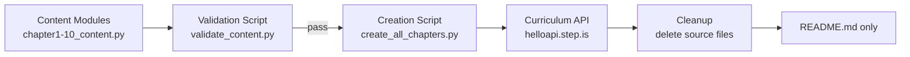

# Design Document: Fiction Novel — New Genre (Mystery/Detective)

## Overview

This design covers the creation of a 10-chapter mystery/detective novel curriculum series for the Vietnamese-English bilingual platform. The novel, tentatively titled "The Silent Clocktower" (Tháp Đồng Hồ Im Lặng), follows Mai Nguyen, a young Vietnamese-Australian journalist, as she investigates the disappearance of an elderly clockmaker in a small English mountain town.

The system produces:
1. **10 Python content modules** (`chapter1_content.py` – `chapter10_content.py`) — each exports a curriculum dict for one chapter
2. **A creation script** (`create_all_chapters.py`) — uploads all 10 chapters, creates the series, and attaches it to the Fiction collection
3. **A validation script** (`validate_content.py`) — checks all correctness properties before upload
4. **A cleanup step** — deletes source files after successful upload, leaving only `README.md`

The design follows the exact same structural template as "The Little Bookshop by the Sea" (series `n4y9zm3v`), which is the 10-chapter reference implementation.

## Architecture

The system is a set of standalone Python 3 scripts with no build system or package manager. The architecture is a simple pipeline:



### Pipeline Steps

1. **Content authoring**: Each `chapterN_content.py` defines a `get_curriculum()` function returning the full curriculum dict
2. **Validation**: `validate_content.py` imports all 10 modules, runs all correctness checks, reports violations
3. **Upload**: `create_all_chapters.py` imports each module, calls `curriculum/create` for each, then creates the series and attaches to the Fiction collection
4. **Cleanup**: Source `.py` files are deleted; `README.md` documents how to recover content from DB

### Key Design Decisions

- **Single creation script** (not per-chapter): The Little Bookshop used per-chapter scripts + a separate `organize_series.py`. The vi-zh novel used a single `create_all_chapters.py`. We follow the vi-zh pattern — one script handles all uploads and series organization. This is simpler and avoids 11+ script files.
- **No hardcoded IDs**: The creation script looks up the Fiction collection by title at runtime via `curriculum-collection/listAll`. Series ID and curriculum IDs come from API responses.
- **Inline `strip_keys()`**: Not needed for new content (we never include the forbidden keys), but the validation script checks for their absence.

## Components and Interfaces

### Component 1: Content Modules (`chapterN_content.py`)

Each module exports one function:

```python
def get_curriculum() -> dict:
    """Return the complete curriculum dict for chapter N."""
```

The returned dict follows the platform's curriculum JSON structure. The module contains:
- Chapter metadata (title, preview, description)
- 15 vocabulary words with Vietnamese translations and example sentences
- 5 reading passages (~150–200 words each)
- 6 sessions with correctly ordered activities

### Component 2: Validation Script (`validate_content.py`)

```python
def validate_all() -> list[str]:
    """Import all 10 content modules, run all checks, return list of violations."""
```

Checks performed (mapped to Requirement 7 acceptance criteria):
- Session count = 6 per chapter
- Activity types and order per session
- Vocab word counts (3 per session 1–5, 15 for session 6)
- Session 6 readAlong = concatenation of all 5 passages
- Vocab words appear in their assigned passage text
- No strip-keys present
- Non-empty title/description on all activities
- Vietnamese text in title/preview/description
- English text in reading passages
- audioSpeed = -0.2 on applicable activities
- No vocab word repeated across chapters

### Component 3: Creation Script (`create_all_chapters.py`)

```python
def main():
    """Upload all 10 chapters, create series, attach to Fiction collection."""
```

Steps:
1. Authenticate via `firebase_token.get_firebase_id_token(UID)`
2. Import and upload each chapter via `curriculum/create`
3. Create series via `curriculum-series/create`
4. Add each curriculum to series via `curriculum-series/addCurriculum` with display_order 1–10
5. Look up Fiction collection by title via `curriculum-collection/listAll`
6. Attach series to collection via `curriculum-collection/addSeriesToCollection`
7. Set series to public via `curriculum-series/setIsPublic`

### Interface: Curriculum API

All calls go to `https://helloapi.step.is/` with `firebaseIdToken` in the request body.

| Endpoint | Purpose |
|---|---|
| `curriculum/create` | Upload a chapter curriculum |
| `curriculum-series/create` | Create the novel series |
| `curriculum-series/addCurriculum` | Add chapter to series with display_order |
| `curriculum-series/setIsPublic` | Make series visible |
| `curriculum-collection/listAll` | Look up Fiction collection ID by title |
| `curriculum-collection/addSeriesToCollection` | Attach series to Fiction collection |

### Interface: Firebase Auth

```python
sys.path.insert(0, "/home/ubuntu/nspaceresearch/design-curriculums")
from firebase_token import get_firebase_id_token

UID = "zs5AMpVfqkcfDf8CJ9qrXdH58d73"
token = get_firebase_id_token(UID)
```

## Data Models

### Curriculum Dict Structure

```python
{
    "title": "Tháp Đồng Hồ Im Lặng (The Silent Clocktower) — Chương 1: Thị Trấn Trên Đồi (The Town on the Hill)",
    "language": "en",
    "userLanguage": "vi",
    "level": "preintermediate",
    "audioSpeed": -0.2,
    "preview": {
        "text": "...(~150 words Vietnamese preview)..."
    },
    "description": "...(short Vietnamese summary)...",
    "sessions": [
        # Sessions 1–5: viewFlashcards, reading, readAlong
        # Session 6: viewFlashcards (all 15), readAlong (full chapter)
    ]
}
```

### Session Structure (Sessions 1–5)

```python
{
    "title": "Phần 1",
    "activities": [
        {
            "type": "viewFlashcards",
            "title": "Flashcards: [topic]",
            "description": "Học 3 từ: word1, word2, word3",
            "audioSpeed": -0.2,
            "words": [
                {
                    "word": "investigate",
                    "translation": "điều tra",
                    "exampleSentence": "Mai decided to investigate the clockmaker's workshop."
                },
                # ... 2 more words
            ]
        },
        {
            "type": "reading",
            "title": "Đọc: [topic]",
            "description": "Mai arrived at the small mountain town...",  # first ~80 chars
            "text": "...(150–200 words English passage)..."
        },
        {
            "type": "readAlong",
            "title": "Nghe: [topic]",
            "description": "Nghe đoạn văn vừa đọc và theo dõi.",
            "audioSpeed": -0.2,
            "text": "...(same passage text as reading)..."
        }
    ]
}
```

### Session 6 Structure (Review)

```python
{
    "title": "Ôn tập",
    "activities": [
        {
            "type": "viewFlashcards",
            "title": "Flashcards: Ôn tập tất cả từ vựng",
            "description": "Học 15 từ: word1, word2, ..., word15",
            "audioSpeed": -0.2,
            "words": [
                # All 15 vocabulary words from the chapter
            ]
        },
        {
            "type": "readAlong",
            "title": "Nghe: Toàn bộ câu chuyện",
            "description": "Nghe toàn bộ chương và theo dõi.",
            "audioSpeed": -0.2,
            "text": "...(all 5 passages concatenated)..."
        }
    ]
}
```

### Vocabulary Word Structure

```python
{
    "word": "investigate",
    "translation": "điều tra",
    "exampleSentence": "Mai decided to investigate the old workshop behind the clocktower."
}
```

### Strip Keys (must NOT be present)

```python
STRIP_KEYS = {"mp3Url", "illustrationSet", "chapterBookmarks", "segments",
              "whiteboardItems", "userReadingId", "lessonUniqueId",
              "curriculumTags", "taskId", "imageId"}
```

### File Layout

```
original-novels/the-silent-clocktower/
├── chapter1_content.py    # Content module for chapter 1
├── chapter2_content.py    # ...
├── ...
├── chapter10_content.py   # Content module for chapter 10
├── validate_content.py    # Validation script
├── create_all_chapters.py # Upload + series organization script
└── README.md              # Kept after cleanup
```


## Correctness Properties

*A property is a characteristic or behavior that should hold true across all valid executions of a system — essentially, a formal statement about what the system should do. Properties serve as the bridge between human-readable specifications and machine-verifiable correctness guarantees.*

### Property 1: Session structure is correct

*For any* chapter curriculum, it shall contain exactly 6 sessions, where sessions 1–5 each have exactly 3 activities in order (viewFlashcards, reading, readAlong) and session 6 has exactly 2 activities in order (viewFlashcards, readAlong).

**Validates: Requirements 4.1, 4.2, 4.3**

### Property 2: Vocabulary word counts are correct

*For any* chapter curriculum, each viewFlashcards activity in sessions 1–5 shall contain exactly 3 vocabulary words, the session 6 viewFlashcards shall contain exactly 15 vocabulary words, and the total unique vocabulary words per chapter shall be exactly 15.

**Validates: Requirements 2.2, 3.1, 4.4, 4.5**

### Property 3: Vocabulary words appear in their assigned passage

*For any* chapter and *for any* session 1–5, each of the 3 vocabulary words assigned to that session shall appear (case-insensitive) in the corresponding reading passage text.

**Validates: Requirements 2.3, 10.3**

### Property 4: No vocabulary word is repeated across chapters

*For any* pair of chapters, the intersection of their vocabulary word sets shall be empty.

**Validates: Requirements 3.3**

### Property 5: Vocabulary words have complete data

*For any* vocabulary word across all chapters, the word shall have a non-empty `translation` field and a non-empty `exampleSentence` field.

**Validates: Requirements 3.5, 3.6**

### Property 6: readAlong text matches reading text in sessions 1–5

*For any* chapter and *for any* session 1–5, the readAlong activity text shall be identical to the reading activity text in the same session.

**Validates: Requirements 4.7**

### Property 7: Session 6 readAlong contains the full chapter text

*For any* chapter, the session 6 readAlong text shall equal the concatenation of all 5 passage texts (from sessions 1–5 reading activities) joined with appropriate separators.

**Validates: Requirements 4.8**

### Property 8: audioSpeed is set correctly

*For any* chapter and *for any* activity that supports audio playback (viewFlashcards, readAlong), the `audioSpeed` field shall be set to -0.2.

**Validates: Requirements 4.9**

### Property 9: Passage word count is in range

*For any* reading passage across all chapters, the word count shall be between 150 and 200 words (inclusive, with ±10% tolerance).

**Validates: Requirements 2.4, 10.4**

### Property 10: Curriculum title follows the bilingual format

*For any* chapter curriculum, the title shall match the pattern: `[Series Vietnamese Title] ([Series English Title]) — Chương N: [Chapter Vietnamese Title] ([Chapter English Title])` where N is the chapter number, and the title contains Vietnamese characters.

**Validates: Requirements 2.5, 5.1**

### Property 11: Session titles are correct

*For any* chapter, sessions 1–5 shall have titles "Phần 1" through "Phần 5" respectively, and session 6 shall have title "Ôn tập".

**Validates: Requirements 5.4, 5.5**

### Property 12: Activity titles and descriptions follow format conventions

*For any* activity across all chapters: viewFlashcards titles start with "Flashcards:", reading titles start with "Đọc:", readAlong titles in sessions 1–5 start with "Nghe:", session 6 readAlong title contains "Toàn bộ câu chuyện", and all activities have non-empty title and description fields.

**Validates: Requirements 5.6, 5.7, 5.8, 5.9, 7.9**

### Property 13: Vietnamese metadata and language fields

*For any* chapter curriculum: the preview text and description shall contain Vietnamese characters (Unicode range for Vietnamese diacritics), `language` shall be "en", and `userLanguage` shall be "vi".

**Validates: Requirements 5.2, 5.3, 5.10, 8.4**

### Property 14: No auto-generated platform keys present

*For any* chapter curriculum dict (recursively), none of the strip-keys (mp3Url, illustrationSet, chapterBookmarks, segments, whiteboardItems, userReadingId, lessonUniqueId, curriculumTags, taskId, imageId) shall be present.

**Validates: Requirements 6.2, 7.8**

## Error Handling

### Validation Errors

The validation script (`validate_content.py`) is the primary error-handling mechanism. It runs before any upload and reports violations with specificity:

- **Format**: `FAIL [Chapter N, Session M, Activity type]: description of violation`
- **Behavior**: Collects all violations across all chapters, prints a summary, and exits with non-zero status if any violations found
- **No partial uploads**: The creation script should only proceed if validation passes with zero violations

### API Errors

The creation script handles API failures:

- **Authentication failure**: If `get_firebase_id_token()` fails, abort with clear error message
- **Upload failure**: If `curriculum/create` returns non-200, print the response body and abort. Do not continue uploading remaining chapters.
- **Series creation failure**: If series creation or curriculum attachment fails, print the error and the IDs of already-uploaded curriculums so they can be cleaned up manually
- **Collection lookup failure**: If the Fiction collection cannot be found by title via `listAll`, abort with a message suggesting the collection may have been renamed

### Content Module Errors

- **Import failure**: If a `chapterN_content.py` cannot be imported, the validation script reports which module failed and continues checking others
- **Missing function**: If `get_curriculum()` is not defined in a module, report the specific module

## Testing Strategy

### Validation Script as the Test Suite

Since there is no build system or test framework in this workspace, the validation script (`validate_content.py`) serves as the test suite. It implements all 14 correctness properties as programmatic checks.

### Property-Based Testing Approach

The content modules produce a fixed set of 10 curriculum dicts (not random inputs), so traditional property-based testing with random generation doesn't apply here. Instead, the validation script applies each property universally across all 10 chapters — effectively treating the 10 chapters as the input space and verifying that every property holds for all of them.

Each check in the validation script is tagged with a comment referencing the design property:

```python
# Feature: fiction-novel-new-genre, Property 1: Session structure is correct
def check_session_structure(curriculum, chapter_num):
    ...
```

### Unit Test Examples

The validation script also includes specific example checks:

- Chapter 1 has exactly 6 sessions (sanity check)
- Session 6 of any chapter has "Ôn tập" as title
- The word count of a known passage is within range

### Validation Checks Mapped to Properties

| Property | Validation Check |
|---|---|
| P1: Session structure | Count sessions, verify activity types and order |
| P2: Vocab counts | Count words in each viewFlashcards activity |
| P3: Vocab in passage | Case-insensitive substring search in reading text |
| P4: No cross-chapter repeats | Set intersection across all chapter word lists |
| P5: Vocab completeness | Check translation and exampleSentence non-empty |
| P6: readAlong = reading | String equality check per session |
| P7: Session 6 full text | Concatenate passages, compare to session 6 readAlong |
| P8: audioSpeed | Check field value on viewFlashcards and readAlong activities |
| P9: Passage word count | `len(text.split())` in range [135, 220] (±10% of 150-200) |
| P10: Title format | Regex match for Vietnamese + English pattern with "Chương N" |
| P11: Session titles | Exact string match per session index |
| P12: Activity title formats | Prefix checks per activity type |
| P13: Vietnamese metadata | Vietnamese character detection in preview/description, language field checks |
| P14: No strip-keys | Recursive key scan against strip-keys set |

### Running Validation

```bash
cd original-novels/the-silent-clocktower
python validate_content.py
```

Expected output on success:
```
Validating chapter 1... OK
Validating chapter 2... OK
...
Validating chapter 10... OK
Cross-chapter vocab check... OK
All 14 properties verified across 10 chapters. 0 violations.
```

Expected output on failure:
```
Validating chapter 3... 
  FAIL [Chapter 3, Session 2, viewFlashcards]: Expected 3 words, found 2
  FAIL [Chapter 3, Session 2, reading]: Vocab word 'investigate' not found in passage text
...
2 violations found. Fix before uploading.
```
