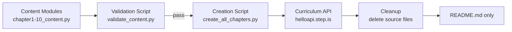

# Design Document: Fiction Novel — New Genre (Mystery/Detective)

## Overview

This design covers the creation of a 10-chapter mystery/detective novel curriculum series for the Vietnamese-English bilingual platform. The novel, tentatively titled "The Silent Clocktower" (Tháp Đồng Hồ Im Lặng), follows Mai Nguyen, a young Vietnamese-Australian journalist, as she investigates the disappearance of an elderly clockmaker in a small English mountain town.

The system produces:
1. **10 Python content modules** (`chapter1_content.py` – `chapter10_content.py`) — each exports a curriculum dict for one chapter
2. **A creation script** (`create_all_chapters.py`) — uploads all 10 chapters, creates the series, and attaches it to the Fiction collection
3. **A validation script** (`validate_content.py`) — checks all correctness properties before upload
4. **A cleanup step** — deletes source files after successful upload, leaving only `README.md`

The design follows the exact same structural template as "The Little Bookshop by the Sea" (series `n4y9zm3v`), which is the 10-chapter reference implementation.

## Architecture

The system is a set of standalone Python 3 scripts with no build system or package manager. The architecture is a simple pipeline:



### Pipeline Steps

1. **Content authoring**: Each `chapterN_content.py` defines a `get_curriculum()` function returning the full curriculum dict
2. **Validation**: `validate_content.py` imports all 10 modules, runs all correctness checks, reports violations
3. **Upload**: `create_all_chapters.py` imports each module, calls `curriculum/create` for each, then creates the series and attaches to the Fiction collection
4. **Cleanup**: Source `.py` files are deleted; `README.md` documents how to recover content from DB

### Key Design Decisions

- **Single creation script** (not per-chapter): The Little Bookshop used per-chapter scripts + a separate `organize_series.py`. The vi-zh novel used a single `create_all_chapters.py`. We follow the vi-zh pattern — one script handles all uploads and series organization. This is simpler and avoids 11+ script files.
- **No hardcoded IDs**: The creation script looks up the Fiction collection by title at runtime via `curriculum-collection/listAll`. Series ID and curriculum IDs come from API responses.
- **Inline `strip_keys()`**: Not needed for new content (we never include the forbidden keys), but the validation script checks for their absence.

## Components and Interfaces

### Component 1: Content Modules (`chapterN_content.py`)

Each module exports one function:

```python
def get_curriculum() -> dict:
    """Return the complete curriculum dict for chapter N."""
```

The returned dict follows the platform's curriculum JSON structure. The module contains:
- Chapter metadata (title, preview, description)
- 15 vocabulary words with Vietnamese translations and example sentences
- 5 reading passages (~150–200 words each)
- 6 sessions with correctly ordered activities

### Component 2: Validation Script (`validate_content.py`)

```python
def validate_all() -> list[str]:
    """Import all 10 content modules, run all checks, return list of violations."""
```

Checks performed (mapped to Requirement 7 acceptance criteria):
- Session count = 6 per chapter
- Activity types and order per session
- Vocab word counts (3 per session 1–5, 15 for session 6)
- Session 6 readAlong = concatenation of all 5 passages
- Vocab words appear in their assigned passage text
- No strip-keys present
- Non-empty title/description on all activities
- Vietnamese text in title/preview/description
- English text in reading passages
- audioSpeed = -0.2 on applicable activities
- No vocab word repeated across chapters

### Component 3: Creation Script (`create_all_chapters.py`)

```python
def main():
    """Upload all 10 chapters, create series, attach to Fiction collection."""
```

Steps:
1. Authenticate via `firebase_token.get_firebase_id_token(UID)`
2. Import and upload each chapter via `curriculum/create`
3. Create series via `curriculum-series/create`
4. Add each curriculum to series via `curriculum-series/addCurriculum` with display_order 1–10
5. Look up Fiction collection by title via `curriculum-collection/listAll`
6. Attach series to collection via `curriculum-collection/addSeriesToCollection`
7. Set series to public via `curriculum-series/setIsPublic`

### Interface: Curriculum API

All calls go to `https://helloapi.step.is/` with `firebaseIdToken` in the request body.

| Endpoint | Purpose |
|---|---|
| `curriculum/create` | Upload a chapter curriculum |
| `curriculum-series/create` | Create the novel series |
| `curriculum-series/addCurriculum` | Add chapter to series with display_order |
| `curriculum-series/setIsPublic` | Make series visible |
| `curriculum-collection/listAll` | Look up Fiction collection ID by title |
| `curriculum-collection/addSeriesToCollection` | Attach series to Fiction collection |

### Interface: Firebase Auth

```python
sys.path.insert(0, "/home/ubuntu/nspaceresearch/design-curriculums")
from firebase_token import get_firebase_id_token

UID = "zs5AMpVfqkcfDf8CJ9qrXdH58d73"
token = get_firebase_id_token(UID)
```

## Data Models

### Curriculum Dict Structure

```python
{
    "title": "Tháp Đồng Hồ Im Lặng (The Silent Clocktower) — Chương 1: Thị Trấn Trên Đồi (The Town on the Hill)",
    "language": "en",
    "userLanguage": "vi",
    "level": "preintermediate",
    "audioSpeed": -0.2,
    "preview": {
        "text": "...(~150 words Vietnamese preview)..."
    },
    "description": "...(short Vietnamese summary)...",
    "sessions": [
        # Sessions 1–5: viewFlashcards, reading, readAlong
        # Session 6: viewFlashcards (all 15), readAlong (full chapter)
    ]
}
```

### Session Structure (Sessions 1–5)

```python
{
    "title": "Phần 1",
    "activities": [
        {
            "type": "viewFlashcards",
            "title": "Flashcards: [topic]",
            "description": "Học 3 từ: word1, word2, word3",
            "audioSpeed": -0.2,
            "words": [
                {
                    "word": "investigate",
                    "translation": "điều tra",
                    "exampleSentence": "Mai decided to investigate the clockmaker's workshop."
                },
                # ... 2 more words
            ]
        },
        {
            "type": "reading",
            "title": "Đọc: [topic]",
            "description": "Mai arrived at the small mountain town...",  # first ~80 chars
            "text": "...(150–200 words English passage)..."
        },
        {
            "type": "readAlong",
            "title": "Nghe: [topic]",
            "description": "Nghe đoạn văn vừa đọc và theo dõi.",
            "audioSpeed": -0.2,
            "text": "...(same passage text as reading)..."
        }
    ]
}
```

### Session 6 Structure (Review)

```python
{
    "title": "Ôn tập",
    "activities": [
        {
            "type": "viewFlashcards",
            "title": "Flashcards: Ôn tập tất cả từ vựng",
            "description": "Học 15 từ: word1, word2, ..., word15",
            "audioSpeed": -0.2,
            "words": [
                # All 15 vocabulary words from the chapter
            ]
        },
        {
            "type": "readAlong",
            "title": "Nghe: Toàn bộ câu chuyện",
            "description": "Nghe toàn bộ chương và theo dõi.",
            "audioSpeed": -0.2,
            "text": "...(all 5 passages concatenated)..."
        }
    ]
}
```

### Vocabulary Word Structure

```python
{
    "word": "investigate",
    "translation": "điều tra",
    "exampleSentence": "Mai decided to investigate the old workshop behind the clocktower."
}
```

### Strip Keys (must NOT be present)

```python
STRIP_KEYS = {"mp3Url", "illustrationSet", "chapterBookmarks", "segments",
              "whiteboardItems", "userReadingId", "lessonUniqueId",
              "curriculumTags", "taskId", "imageId"}
```

### File Layout

```
original-novels/the-silent-clocktower/
├── chapter1_content.py    # Content module for chapter 1
├── chapter2_content.py    # ...
├── ...
├── chapter10_content.py   # Content module for chapter 10
├── validate_content.py    # Validation script
├── create_all_chapters.py # Upload + series organization script
└── README.md              # Kept after cleanup
```

