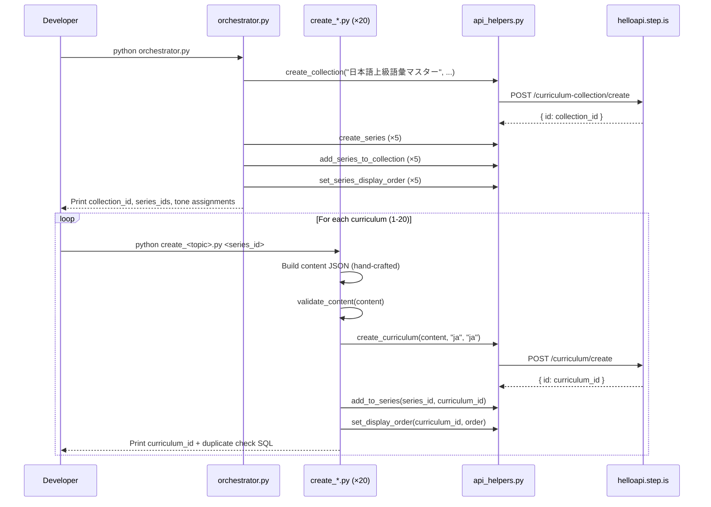

# Design Document: JA-JA Advanced Curriculums

## Overview

This design covers the creation of 20 advanced Japanese-language curriculums for native Japanese speakers expanding their formal, academic, and specialized vocabulary. The system consists of:

- **20 standalone Python scripts** — one per curriculum, each containing all hand-crafted Japanese content inline
- **1 orchestrator script** — creates the collection, 5 series, wires them together, sets display orders
- **Inline validation** — each script includes a `validate_content()` function that checks structural integrity before upload
- **Shared API helpers** — reuses the existing root-level `api_helpers.py` for all REST API calls

The language pair is `language="ja"`, `userLanguage="ja"` (single-language — all text in Japanese). Each curriculum has 5 sessions with 11 activities per session, 30+ vocabulary words total, 800-1200+ character reading passages, and balanced skills coverage (reading, listening, speaking, writing) in every session.

### Key Design Decisions

1. **Reuse existing `api_helpers.py`** — the module already wraps all needed API endpoints with Firebase auth, error handling, and logging. No modifications needed.

2. **Inline validation per script** — with 20 scripts sharing an identical structure (5 sessions, 11 activities in fixed order), a simple `validate_content()` function defined inline in each script is sufficient. No separate validator module needed (unlike the children's curriculum which had 3 different formats requiring a shared module).

3. **No pricing** — unlike other curriculum batches, no `set_price()` calls are made. Curriculums are created private without pricing.

4. **No `setPublic` calls** — all curriculums remain private after creation (platform default).

5. **Single-language Japanese** — unlike bilingual curriculums (vi-en, en-de), all text is in Japanese: titles, descriptions, previews, introAudio scripts, reading passages, writing prompts. This is appropriate for advanced-level content targeting native speakers.

6. **Japanese vocabList format** — vocabulary words in `vocabList` arrays use lowercase hiragana/katakana representation (e.g., `["こうしょう", "せんりゃく"]`), following the lowercase-strings requirement.

7. **Character-based length validation** — since Japanese doesn't use spaces between words, reading passage length is validated by character count (minimum 800 characters) rather than word count.

8. **5 series of 4 curriculums each** — provides clean organization with coherent thematic threads per series while covering 5 distinct intellectual domains.

## Architecture

```mermaid
graph TD
    subgraph "ja-ja-advanced-curriculums/"
        ORCH[orchestrator.py] --> API[api_helpers.py<br/>shared, repo root]
        
        C1[create_negotiation.py] --> API
        C2[create_organizational_theory.py] --> API
        C3[create_management_strategy.py] --> API
        C4[create_corporate_ethics.py] --> API
        C5[create_epistemology.py] --> API
        C6[create_economic_thought.py] --> API
        C7[create_philosophy_of_language.py] --> API
        C8[create_scientific_methodology.py] --> API
        C9[create_literary_criticism.py] --> API
        C10[create_aesthetics.py] --> API
        C11[create_media_theory.py] --> API
        C12[create_traditional_arts.py] --> API
        C13[create_social_psychology.py] --> API
        C14[create_self_development.py] --> API
        C15[create_urban_sociology.py] --> API
        C16[create_intercultural_communication.py] --> API
        C17[create_ai_ethics.py] --> API
        C18[create_environmental_science.py] --> API
        C19[create_neuroscience.py] --> API
        C20[create_preventive_medicine.py] --> API
    end

    API --> FB[firebase_token.py]
    API --> REST[helloapi.step.is REST API]
    REST --> DB[(PostgreSQL)]
```



### Execution Flow



## Components and Interfaces

### 1. orchestrator.py

Creates the collection and 5 series, wires them together, sets display orders.

**Inputs:** None (all data hard-coded — collection/series titles, descriptions, tone assignments)

**Outputs:** Prints collection ID, series IDs, tone assignment table for curriculum scripts

**API calls:**
- `curriculum-collection/create` — 1 call
- `curriculum-series/create` — 5 calls
- `curriculum-collection/addSeriesToCollection` — 5 calls
- `curriculum-series/setDisplayOrder` — 5 calls

**Collection:**
- Title: `日本語上級語彙マスター`
- Description: Neutral informative Japanese summary (not persuasive copy)

**Series:**

| # | Series Title | Description Tone |
|---|---|---|
| 1 | ビジネス・専門日本語 | `bold_declaration` |
| 2 | 学術・知的探究 | `provocative_question` |
| 3 | 文化・芸術 | `vivid_scenario` |
| 4 | 社会・心理 | `empathetic_observation` |
| 5 | 科学・技術・健康 | `surprising_fact` |

No adjacent series share the same tone ✓. All 5 of 6 tones used (with `metaphor_led` reserved for curriculum-level descriptions) ✓.

**Tone Assignments (20 curriculums):**

| # | Curriculum | Series | Desc Tone | Farewell Tone |
|---|---|---|---|---|
| 1 | 交渉術 | A: ビジネス | `provocative_question` | `warm_accountability` |
| 2 | 組織論 | A: ビジネス | `metaphor_led` | `quiet_awe` |
| 3 | 経営戦略 | A: ビジネス | `surprising_fact` | `practical_momentum` |
| 4 | 企業倫理 | A: ビジネス | `empathetic_observation` | `introspective_guide` |
| 5 | 認識論 | B: 学術 | `bold_declaration` | `team_building_energy` |
| 6 | 経済思想 | B: 学術 | `vivid_scenario` | `warm_accountability` |
| 7 | 言語哲学 | B: 学術 | `provocative_question` | `quiet_awe` |
| 8 | 科学方法論 | B: 学術 | `surprising_fact` | `practical_momentum` |
| 9 | 文学批評 | C: 文化 | `empathetic_observation` | `introspective_guide` |
| 10 | 美学と芸術論 | C: 文化 | `metaphor_led` | `team_building_energy` |
| 11 | 現代メディア論 | C: 文化 | `bold_declaration` | `warm_accountability` |
| 12 | 伝統芸能 | C: 文化 | `vivid_scenario` | `quiet_awe` |
| 13 | 社会心理学 | D: 社会 | `provocative_question` | `practical_momentum` |
| 14 | 自己啓発と内省 | D: 社会 | `empathetic_observation` | `introspective_guide` |
| 15 | 都市社会学 | D: 社会 | `surprising_fact` | `team_building_energy` |
| 16 | 異文化コミュニケーション | D: 社会 | `bold_declaration` | `warm_accountability` |
| 17 | 人工知能と倫理 | E: 科学 | `metaphor_led` | `quiet_awe` |
| 18 | 環境科学 | E: 科学 | `provocative_question` | `practical_momentum` |
| 19 | 脳科学と認知 | E: 科学 | `vivid_scenario` | `introspective_guide` |
| 20 | 予防医学 | E: 科学 | `bold_declaration` | `team_building_energy` |

**Tone distribution check:**
- Description tones across 20 curriculums: provocative_question ×4, bold_declaration ×4, vivid_scenario ×3, empathetic_observation ×3, surprising_fact ×3, metaphor_led ×3 — max 20%, all ≤30% ✓
- No adjacent duplicates within any series ✓
- Farewell tones: warm_accountability ×4, quiet_awe ×4, practical_momentum ×4, introspective_guide ×4, team_building_energy ×4 — evenly distributed ✓
- No adjacent farewell duplicates within any series ✓

### 2. Individual Curriculum Scripts (create_*.py × 20)

Each script is standalone and contains all hand-crafted content for one curriculum.

**Common interface pattern:**
```python
# create_<topic>.py
import sys
import json
import logging

sys.path.insert(0, "/home/ubuntu/nspaceresearch/design-curriculums")
from api_helpers import (
    create_curriculum, add_to_series, set_display_order
)

SERIES_ID = "<series_id>"  # Filled after orchestrator runs
DISPLAY_ORDER = <N>

def validate_content(content: dict) -> None:
    """Inline structural validation. Raises ValueError on failure."""
    # 1. Top-level structure
    # 2. 5 sessions, each with 11 activities in correct order
    # 3. Session titles match "セッションN" pattern
    # 4. All activities have activityType, title, description, data
    # 5. vocabList format (array of lowercase strings, 6+ items)
    # 6. viewFlashcards/speakFlashcards vocabList consistency
    # 7. reading/speakReading/readAlong text consistency
    # 8. Reading text minimum length (800+ characters)
    # 9. writingSentence structure (vocabList, items with prompt/targetVocab)
    # 10. writingParagraph structure (vocabList, instructions, prompts >= 2)
    # 11. No strip keys or youtubeUrl anywhere
    # 12. contentTypeTags == []
    # 13. Title format prefixes (フラッシュカード：, 読む：, 聴く：, 書く：)
    ...

def build_content() -> dict:
    """Build the curriculum content dict with all hand-crafted Japanese text."""
    return {
        "title": "...",
        "description": "...",
        "preview": {"text": "..."},
        "contentTypeTags": [],
        "learningSessions": [...]
    }

def main():
    content = build_content()
    validate_content(content)
    curriculum_id = create_curriculum(content, "ja", "ja")
    add_to_series(SERIES_ID, curriculum_id)
    set_display_order(curriculum_id, DISPLAY_ORDER)
    print(f"✅ Created: {curriculum_id}")
    print(f"Duplicate check:")
    print(f"SELECT id, content->>'title', created_at FROM curriculum "
          f"WHERE content->>'title' = '...' AND uid = 'zs5AMpVfqkcfDf8CJ9qrXdH58d73' ORDER BY created_at;")

if __name__ == "__main__":
    main()
```

**Key constraint:** All text content (introAudio scripts, reading passages, descriptions, previews, writing prompts) is hand-written per curriculum. No template functions or string interpolation for learner-facing text. The `build_content()` function returns a fully literal dict.

### 3. Inline validate_content() Function

Defined identically in all 20 scripts. Checks structural integrity before upload.

**Validation checks:**
1. Top-level: `title` (non-empty string), `description` (non-empty string), `preview.text` (non-empty string), `contentTypeTags` (must be `[]`), `learningSessions` (length = 5)
2. No `youtubeUrl` field anywhere in the JSON tree
3. Each session has `title` matching pattern `セッションN` and `activities` (array of length 11)
4. Activity sequence per session: introAudio, viewFlashcards, speakFlashcards, vocabLevel1, vocabLevel2, reading, speakReading, readAlong, writingSentence, writingParagraph, introAudio
5. Each activity has `activityType` (valid value from set), `title` (non-empty), `description` (non-empty), `data` (dict)
6. No `type` field on activities (must be `activityType`)
7. Vocab activities (viewFlashcards, speakFlashcards, vocabLevel1, vocabLevel2) have `data.vocabList` — array of 6+ lowercase strings, field name `vocabList` (not `words`)
8. `viewFlashcards` and `speakFlashcards` in same session have identical `data.vocabList`
9. `reading`, `speakReading`, `readAlong` have `data.text` (non-empty string)
10. `reading`, `speakReading`, `readAlong` in same session have identical `data.text`
11. Reading `data.text` has 800+ characters
12. `introAudio` has `data.text` (non-empty string)
13. `writingSentence` has `data.vocabList` (array of strings), `data.items` (non-empty array, each with `prompt` and `targetVocab` as non-empty strings)
14. `writingParagraph` has `data.vocabList` (array of strings), `data.instructions` (non-empty string), `data.prompts` (array of strings, length >= 2)
15. No strip keys anywhere in JSON tree (mp3Url, illustrationSet, chapterBookmarks, segments, whiteboardItems, userReadingId, lessonUniqueId, curriculumTags, taskId, imageId)
16. Title format prefixes: vocab activities start with "フラッシュカード：", reading/speakReading start with "読む：", readAlong starts with "聴く：", writingSentence/writingParagraph start with "書く："

### 4. Activity Sequence Per Session (All 20 Curriculums)

Every session follows this exact sequence of 11 activities:

```
1.  introAudio        — Session introduction + vocabulary teaching (500-800 words equivalent)
2.  viewFlashcards    — Visual vocab review (6+ words)
3.  speakFlashcards   — Speaking vocab practice (same vocabList as viewFlashcards)
4.  vocabLevel1       — Vocab exercise level 1 (same vocabList)
5.  vocabLevel2       — Vocab exercise level 2 (same vocabList)
6.  reading           — Long passage (800-1200+ characters of Japanese)
7.  speakReading      — Speak the passage (same text as reading)
8.  readAlong         — Listen to the passage (same text as reading)
9.  writingSentence   — Sentence-level writing (4-6 items with Japanese prompts)
10. writingParagraph  — Paragraph-level writing (instructions + 2-3 Japanese prompts)
11. introAudio        — Session wrap-up / farewell (final session: 400-600 word farewell with vocab review)
```

This ensures balanced skills in every session: listening (introAudio, readAlong), reading (reading), speaking (speakFlashcards, speakReading), writing (writingSentence, writingParagraph), and vocabulary (viewFlashcards, vocabLevel1, vocabLevel2).

### 5. Vocabulary Plan

Each curriculum has 30+ vocabulary words (6+ per session). Words are advanced-level Japanese appropriate for native speakers expanding formal, academic, or specialized vocabulary. All `vocabList` entries use lowercase hiragana/katakana.

**No vocabulary overlap within the same series.** Each curriculum in a series has a completely distinct vocabulary set.

#### Series A: ビジネス・専門日本語 (4 curriculums, 120+ words total)

| # | Curriculum | Session Topics |
|---|---|---|
| 1 | 交渉術 | 交渉の基本原則, 利害調整, 説得技法, 合意形成, 国際交渉 |
| 2 | 組織論 | 組織構造, リーダーシップ, 意思決定, 組織文化, 変革管理 |
| 3 | 経営戦略 | 競争優位, 市場分析, イノベーション, 事業計画, グローバル戦略 |
| 4 | 企業倫理 | 倫理的判断, コンプライアンス, CSR, ガバナンス, 持続可能性 |

#### Series B: 学術・知的探究 (4 curriculums, 120+ words total)

| # | Curriculum | Session Topics |
|---|---|---|
| 5 | 認識論 | 知識の本質, 真理と正当化, 懐疑主義, 経験と理性, 現代認識論 |
| 6 | 経済思想 | 古典派経済学, マルクス経済学, ケインズ理論, 新自由主義, 行動経済学 |
| 7 | 言語哲学 | 意味と指示, 言語行為論, 言語と思考, 記号論, 語用論 |
| 8 | 科学方法論 | 仮説演繹法, 実験計画, 統計的推論, パラダイム論, 科学と倫理 |

#### Series C: 文化・芸術 (4 curriculums, 120+ words total)

| # | Curriculum | Session Topics |
|---|---|---|
| 9 | 文学批評 | 構造主義批評, ポスト構造主義, フェミニズム批評, 読者反応理論, 比較文学 |
| 10 | 美学と芸術論 | 美の概念, 芸術と模倣, 崇高と美, 現代美学, 芸術と社会 |
| 11 | 現代メディア論 | メディアリテラシー, デジタル社会, 情報倫理, 公共圏, メディア批評 |
| 12 | 伝統芸能 | 能楽, 歌舞伎, 文楽, 茶道と華道, 伝統の継承 |

#### Series D: 社会・心理 (4 curriculums, 120+ words total)

| # | Curriculum | Session Topics |
|---|---|---|
| 13 | 社会心理学 | 集団心理, 同調と服従, 偏見と差別, 対人認知, 社会的影響 |
| 14 | 自己啓発と内省 | 自己認識, 動機づけ, レジリエンス, マインドフルネス, 自己実現 |
| 15 | 都市社会学 | 都市化, コミュニティ, 格差と分断, 公共空間, 都市再生 |
| 16 | 異文化コミュニケーション | 文化的価値観, 非言語コミュニケーション, 異文化適応, ステレオタイプ, 多文化共生 |

#### Series E: 科学・技術・健康 (4 curriculums, 120+ words total)

| # | Curriculum | Session Topics |
|---|---|---|
| 17 | 人工知能と倫理 | 機械学習の基礎, AIバイアス, 自律性と責任, プライバシー, AI共存社会 |
| 18 | 環境科学 | 気候変動, 生態系, 資源管理, 環境政策, 持続可能な開発 |
| 19 | 脳科学と認知 | 神経可塑性, 記憶と学習, 意識の科学, 感情と脳, 認知バイアス |
| 20 | 予防医学 | 疫学, 生活習慣病, 公衆衛生, 免疫と予防接種, 健康格差 |

## Data Models

### Curriculum Content JSON Structure (Top Level)

```json
{
  "title": "交渉術",
  "description": "あなたは本当に「交渉」ができていますか？\n\n会議室で...",
  "preview": {
    "text": "ビジネスの現場で「交渉」という言葉を聞くと..."
  },
  "contentTypeTags": [],
  "learningSessions": [
    { "title": "セッション1", "activities": [...] },
    { "title": "セッション2", "activities": [...] },
    { "title": "セッション3", "activities": [...] },
    { "title": "セッション4", "activities": [...] },
    { "title": "セッション5", "activities": [...] }
  ]
}
```

### Activity Data Schemas

#### introAudio

```json
{
  "activityType": "introAudio",
  "title": "セッション1へようこそ：交渉の基本原則",
  "description": "交渉術の基本概念と6つの重要語彙を学びます。",
  "data": {
    "text": "皆さん、こんにちは。今日から「交渉術」の学習を始めましょう..."
  }
}
```

#### viewFlashcards / speakFlashcards / vocabLevel1 / vocabLevel2

```json
{
  "activityType": "viewFlashcards",
  "title": "フラッシュカード：交渉の基本原則",
  "description": "6つの語彙を学びます：こうしょう、だきょう、ようきゅう、じょうほ、ていあん、ごうい",
  "data": {
    "vocabList": ["こうしょう", "だきょう", "ようきゅう", "じょうほ", "ていあん", "ごうい"]
  }
}
```

All four vocab activities in the same session share the identical `vocabList` array.

#### reading

```json
{
  "activityType": "reading",
  "title": "読む：交渉の基本原則と実践",
  "description": "交渉の本質とは何か。ビジネスの現場で求められる交渉力について...",
  "data": {
    "text": "交渉とは、異なる立場にある二者以上が、互いの利害を調整しながら..."
  }
}
```

The `data.text` field contains 800-1200+ characters of original Japanese content.

#### speakReading

```json
{
  "activityType": "speakReading",
  "title": "読む：交渉の基本原則と実践",
  "description": "交渉の本質とは何か。ビジネスの現場で求められる交渉力について...",
  "data": {
    "text": "[identical to reading data.text]"
  }
}
```

#### readAlong

```json
{
  "activityType": "readAlong",
  "title": "聴く：交渉の基本原則と実践",
  "description": "読んだ文章を聴いて、内容を確認しましょう。",
  "data": {
    "text": "[identical to reading data.text]"
  }
}
```

#### writingSentence

```json
{
  "activityType": "writingSentence",
  "title": "書く：交渉の語彙を使った文章作成",
  "description": "今回学んだ語彙を使って、文を作成しましょう。",
  "data": {
    "vocabList": ["こうしょう", "だきょう", "ようきゅう", "じょうほ", "ていあん", "ごうい"],
    "items": [
      {
        "prompt": "「交渉」という語を使って、ビジネスの場面を描写する文を書いてください。例文：両社の代表が交渉のテーブルにつき、互いの条件を慎重に検討した。",
        "targetVocab": "こうしょう"
      },
      {
        "prompt": "「妥協」という語を使って、意見の対立が解決される場面を描写してください。例文：長時間の議論の末、双方が妥協点を見出し、合意に至った。",
        "targetVocab": "だきょう"
      }
    ]
  }
}
```

Each `writingSentence` has 4-6 items, each with a detailed Japanese `prompt` (context + example sentence) and `targetVocab`.

#### writingParagraph

```json
{
  "activityType": "writingParagraph",
  "title": "書く：交渉の原則についての考察",
  "description": "交渉の基本原則について、段落を書いて分析しましょう。",
  "data": {
    "vocabList": ["こうしょう", "だきょう", "ようきゅう", "じょうほ", "ていあん", "ごうい"],
    "instructions": "今回学んだ語彙を3つ以上使い、効果的な交渉の原則について4〜6文で論じてください。具体的なビジネスシーンを想定し、各原則がどのように機能するかを説明してください。",
    "prompts": [
      "交渉において「要求」と「譲歩」のバランスをどのように取るべきか、具体例を挙げて論じてください。",
      "「提案」と「合意」のプロセスにおいて、信頼関係がどのような役割を果たすか分析してください。"
    ]
  }
}
```

Each `writingParagraph` has `instructions` (overall task description), `vocabList`, and `prompts` (2-3 specific analytical prompts).

### API Call Parameters

| Parameter | Value |
|-----------|-------|
| `firebaseIdToken` | From `get_firebase_id_token("zs5AMpVfqkcfDf8CJ9qrXdH58d73")` |
| `language` | `"ja"` |
| `userLanguage` | `"ja"` |
| `content` | `json.dumps(content_dict)` |

**Per curriculum script:** 3 API calls:
1. `POST /curriculum/create` — create the curriculum
2. `POST /curriculum-series/addCurriculum` — add to series
3. `POST /curriculum/setDisplayOrder` — set position within series

**No `set_price()` or `setPublic()` calls.**

## Correctness Properties

*A property is a characteristic or behavior that should hold true across all valid executions of a system — essentially, a formal statement about what the system should do. Properties serve as the bridge between human-readable specifications and machine-verifiable correctness guarantees.*

The `validate_content()` function is the primary component amenable to property-based testing. It is a pure function: takes a content dict, returns None or raises ValueError. The input space is large (arbitrary JSON structures), and universal properties hold across all valid/invalid inputs.

The curriculum creation scripts, orchestrator, and API interactions are integration-level concerns tested via database verification queries after execution.

### Property 1: Top-level structure validity

*For any* curriculum content dict, if `title` is missing/empty, `description` is missing/empty, `preview.text` is missing/empty, `contentTypeTags` is not `[]`, or `learningSessions` does not have exactly 5 elements, `validate_content()` SHALL raise a ValueError.

**Validates: Requirements 2.4, 13.1**

### Property 2: Session structure completeness

*For any* curriculum content dict, each of the 5 sessions SHALL have a `title` matching the pattern "セッションN" (where N is 1-5) and SHALL contain exactly 11 activities in this order: introAudio, viewFlashcards, speakFlashcards, vocabLevel1, vocabLevel2, reading, speakReading, readAlong, writingSentence, writingParagraph, introAudio. If any session violates this, `validate_content()` SHALL raise a ValueError.

**Validates: Requirements 2.1, 2.2, 2.8, 4.7**

### Property 3: VocabList structural validity

*For any* activity with activityType in {viewFlashcards, speakFlashcards, vocabLevel1, vocabLevel2}, the activity SHALL have a `data.vocabList` field that is an array of at least 6 lowercase strings, using the field name `vocabList` (never `words`). If any vocab activity violates this, `validate_content()` SHALL raise a ValueError.

**Validates: Requirements 3.1, 3.2, 3.3, 3.4**

### Property 4: Flashcard vocabList consistency

*For any* session containing both a viewFlashcards and a speakFlashcards activity, their `data.vocabList` arrays SHALL be identical. If they differ, `validate_content()` SHALL raise a ValueError.

**Validates: Requirements 3.5**

### Property 5: Activity metadata completeness

*For any* activity in any session, the activity SHALL have `activityType` (string from the valid set: introAudio, viewFlashcards, speakFlashcards, vocabLevel1, vocabLevel2, reading, speakReading, readAlong, writingSentence, writingParagraph), `title` (non-empty string), `description` (non-empty string), and `data` (dict). The field name SHALL be `activityType` (never `type`). If any activity violates this, `validate_content()` SHALL raise a ValueError.

**Validates: Requirements 4.1, 13.2, 13.3, 13.4**

### Property 6: Title format conventions

*For any* viewFlashcards/speakFlashcards/vocabLevel1/vocabLevel2 activity, the title SHALL start with "フラッシュカード：". *For any* reading/speakReading activity, the title SHALL start with "読む：". *For any* readAlong activity, the title SHALL start with "聴く：". *For any* writingSentence/writingParagraph activity, the title SHALL start with "書く：". If any activity violates its title prefix, `validate_content()` SHALL raise a ValueError.

**Validates: Requirements 4.2, 4.3, 4.4, 4.6**

### Property 7: Reading/audio text presence and minimum length

*For any* reading activity, `data.text` SHALL be a non-empty string with character count >= 800. *For any* speakReading, readAlong, or introAudio activity, `data.text` SHALL be a non-empty string. If any activity violates this, `validate_content()` SHALL raise a ValueError.

**Validates: Requirements 7.1, 7.2, 7.3**

### Property 8: Reading text consistency within session

*For any* session containing reading, speakReading, and readAlong activities, all three SHALL have identical `data.text` values. If they differ, `validate_content()` SHALL raise a ValueError.

**Validates: Requirements 7.4**

### Property 9: Forbidden keys rejection

*For any* curriculum content dict, if any strip key (mp3Url, illustrationSet, chapterBookmarks, segments, whiteboardItems, userReadingId, lessonUniqueId, curriculumTags, taskId, imageId) or `youtubeUrl` appears at any depth in the JSON tree, `validate_content()` SHALL raise a ValueError.

**Validates: Requirements 2.5, 8.1**

### Property 10: WritingSentence data structure validity

*For any* writingSentence activity, `data` SHALL contain `vocabList` (array of strings), and `items` (non-empty array where each element has `prompt` as non-empty string and `targetVocab` as non-empty string). If any writingSentence violates this, `validate_content()` SHALL raise a ValueError.

**Validates: Requirements 6.1**

### Property 11: WritingParagraph data structure validity

*For any* writingParagraph activity, `data` SHALL contain `vocabList` (array of strings), `instructions` (non-empty string), and `prompts` (array of strings with length >= 2). If any writingParagraph violates this, `validate_content()` SHALL raise a ValueError.

**Validates: Requirements 6.2**

## Error Handling

### Script-Level Errors

| Error | Handling |
|-------|----------|
| Validation failure | `validate_content()` raises `ValueError` with specific message. Script exits before API call. |
| Firebase token failure | `get_firebase_id_token()` raises exception. Script exits with error message. |
| API 500/network error | `requests` raises `HTTPError`. Script prints error and exits. |
| `add_to_series` failure | Curriculum exists but is orphaned. Script logs error. Developer must manually add to series. |
| `set_display_order` failure | Curriculum exists in series but without explicit order. Script logs error. Developer must manually set order. |

### Validation Error Messages

The `validate_content()` function provides specific error messages:
- `"learningSessions must have exactly 5 sessions, got {n}"`
- `"Session {i}: must have exactly 11 activities, got {n}"`
- `"Session {i}: activity {j} must be {expected_type}, got {actual_type}"`
- `"Session {i}: title must be 'セッション{i}', got '{actual}'"`
- `"Session {i}, activity {j}: vocabList must be array of 6+ lowercase strings"`
- `"Session {i}: viewFlashcards and speakFlashcards have different vocabList"`
- `"Session {i}: reading, speakReading, and readAlong must have identical text"`
- `"Session {i}, activity {j}: reading text must be >= 800 characters, got {n}"`
- `"Session {i}, activity {j}: writingParagraph.prompts must have length >= 2"`
- `"Forbidden key '{key}' found at path: {path}"`
- `"contentTypeTags must be [] (empty array)"`
- `"Activity title must start with '{prefix}', got '{actual}'"`

### Orchestrator Errors

1. **`create_collection` failure** → Abort. Nothing created.
2. **`create_series` failure** → Log error, continue with remaining series. Developer must manually create the failed series.
3. **`add_series_to_collection` failure** → Series exists but is orphaned. Log error, continue.
4. **`set_series_display_order` failure** → Log error, continue. Developer must manually set order.

### Duplicate Handling

After each curriculum creation, the script logs the curriculum ID and prints a duplicate check query:

```sql
SELECT id, content->>'title', created_at FROM curriculum
WHERE content->>'title' = '<title>' AND uid = 'zs5AMpVfqkcfDf8CJ9qrXdH58d73'
ORDER BY created_at;
```

Keep the earliest, delete extras (remove from series first, then delete curriculum).

## Testing Strategy

### Property-Based Tests (validate_content)

**Library:** [Hypothesis](https://hypothesis.readthedocs.io/) (Python PBT library)

**Configuration:** Minimum 100 iterations per property test.

**Tag format:** Each test is tagged with a comment: `# Feature: ja-ja-advanced-curriculums, Property N: <property_text>`

The 11 correctness properties above are implemented as Hypothesis property tests in a `test_validate.py` file within the `ja-ja-advanced-curriculums/` directory. Each property test generates random curriculum content structures using Hypothesis strategies and verifies the validator's behavior.

**Generator strategies needed:**
- `valid_curriculum()` — generates a structurally valid curriculum content dict (5 sessions, 11 activities each, correct order, valid vocabLists, 800+ char reading text, proper writingSentence/writingParagraph structure)
- `random_activity(activity_type)` — generates a valid activity of the given type
- `random_vocab_list(n)` — generates a list of n random lowercase hiragana strings
- `random_japanese_text(min_chars)` — generates random Japanese text of at least min_chars characters
- `random_strip_key()` — picks a random strip key from the forbidden set
- `random_json_path()` — picks a random location in a content dict to inject a key

**Property test implementation approach:**
- Properties 1-2: Generate valid content, then mutate one structural aspect (remove a session, change activity order, wrong session title) and verify rejection
- Property 3: Generate valid content, then mutate vocabList (make non-lowercase, use wrong field name, reduce to <6 items) and verify rejection
- Property 4: Generate valid content, then make viewFlashcards/speakFlashcards vocabLists differ and verify rejection
- Property 5: Generate valid content, then remove required fields or use invalid activityType and verify rejection
- Property 6: Generate valid content, then change title prefixes and verify rejection
- Property 7: Generate valid content, then shorten reading text below 800 chars or remove text field and verify rejection
- Property 8: Generate valid content, then make reading/speakReading/readAlong texts differ and verify rejection
- Property 9: Inject strip keys at random depths in valid content and verify rejection
- Properties 10-11: Generate valid content, then mutate writingSentence/writingParagraph structure and verify rejection

### Example-Based Tests

- Verify no vocabulary overlap across curriculums within the same series (Req 3.6, 11.4)
- Verify tone assignment table has no adjacent duplicates within each series (Req 5.7)
- Verify no description tone exceeds 30% of 20 descriptions (Req 5.5)
- Verify all 5 farewell tones are used (Req 5.6)
- Verify all 6 description tones are used (Req 5.5)
- Verify correct activity sequence for each session (Req 2.2)
- Verify no `setPublic` calls in any script (Req 9.2)
- Verify no `set_price` calls in any script

### Integration Verification (Post-Execution)

After all scripts run, verify via SQL queries:

```sql
-- Count all ja-ja advanced curriculums
SELECT COUNT(*) FROM curriculum
WHERE uid = 'zs5AMpVfqkcfDf8CJ9qrXdH58d73'
AND id IN (<list of 20 IDs>);

-- Verify language pair
SELECT id, content->>'title', language, user_language
FROM curriculum WHERE id IN (<list of 20 IDs>);

-- Verify series membership and display orders
SELECT cs.id as series_id, cs.title as series_title,
       c.id as curriculum_id, c.content->>'title' as curriculum_title,
       c.display_order
FROM curriculum_series cs
JOIN curriculum_series_curriculums csc ON cs.id = csc.curriculum_series_id
JOIN curriculum c ON csc.curriculum_id = c.id
WHERE cs.id IN (<series_1_id>, <series_2_id>, <series_3_id>, <series_4_id>, <series_5_id>)
ORDER BY cs.display_order, c.display_order;

-- Verify no duplicates
SELECT content->>'title', COUNT(*)
FROM curriculum
WHERE uid = 'zs5AMpVfqkcfDf8CJ9qrXdH58d73'
AND content->>'title' IN (<list of 20 titles>)
GROUP BY content->>'title'
HAVING COUNT(*) > 1;

-- Verify is_public = false
SELECT id, content->>'title', is_public
FROM curriculum WHERE id IN (<list of 20 IDs>);
```

### Smoke Tests

- Verify each script file exists in `ja-ja-advanced-curriculums/`
- Verify no script calls `setPublic` (Req 9.2)
- Verify no script calls `set_price`
- Verify orchestrator creates exactly 1 collection and 5 series
- Verify only README.md remains after cleanup
