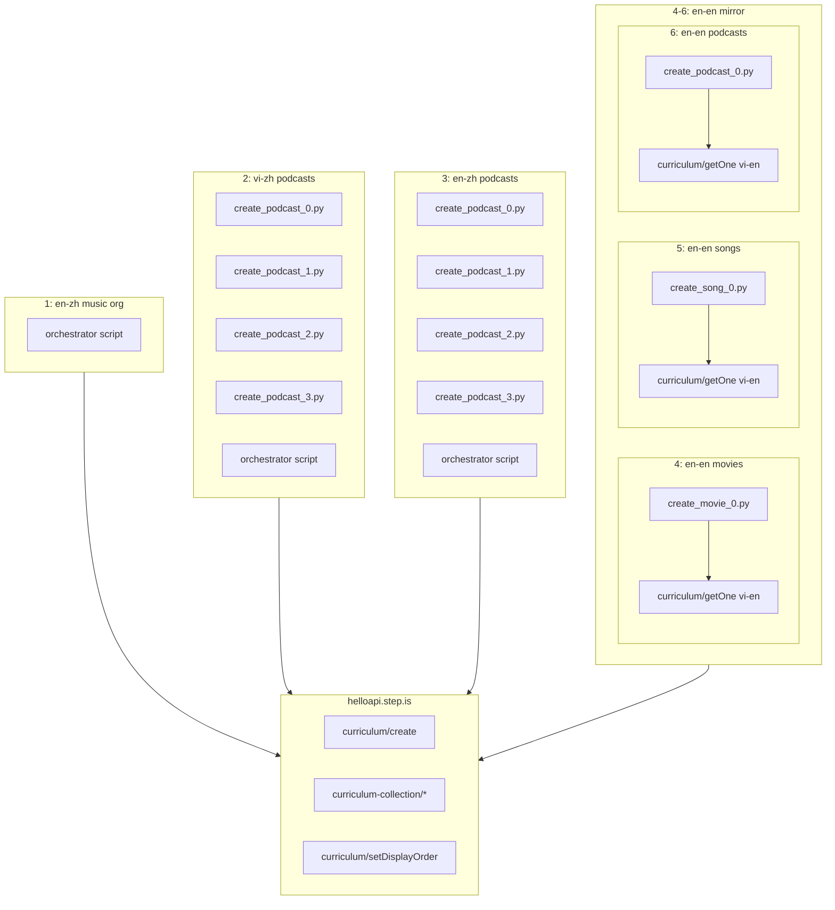

# Design Document: Media Content Parity

## Overview

This design covers filling 6 content gaps across the language pair × content type matrix so every combination of 4 language pairs (vi-en, vi-zh, en-zh, en-en) × 3 content types (movie, music, podcast) has exactly 4 curriculums organized directly under a collection (no series intermediary).

The 6 work items are:
1. **en-zh music organization** — Wire 4 existing curriculums into a new collection
2. **vi-zh podcasts** — Create 4 new Chinese-language podcast curriculums (Vietnamese UI)
3. **en-zh podcasts** — Create 4 new Chinese-language podcast curriculums (English UI)
4. **en-en movies** — Mirror 4 vi-en movie curriculums with English UI
5. **en-en songs** — Mirror 4 vi-en song curriculums with English UI
6. **en-en podcasts** — Mirror 4 vi-en podcast curriculums with English UI

Each work item produces either an orchestrator-only script (item 1) or creation scripts + orchestrator (items 2–6). All scripts are deleted after verification, leaving only a README per folder.

## Architecture



### Two Creation Patterns

**Pattern A — Mirror (en-en items 4, 5, 6):**
1. Fetch vi-en source via `curriculum/getOne`
2. `strip_keys()` to remove auto-generated keys
3. Transform all Vietnamese user-facing text → English
4. Upload with `language="en"`, `userLanguage="en"`

**Pattern B — New content (vi-zh/en-zh podcasts, items 2, 3):**
1. Select 4 Chinese-language talks (not English TED Talks)
2. Hand-write curriculum content with 18 HSK2-HSK3 words per talk
3. vi-zh: Vietnamese user-facing text; en-zh: English user-facing text + pinyin
4. Upload with `language="zh"`, `userLanguage="vi"` or `"en"`

**Pattern C — Organization only (en-zh music, item 1):**
1. Create collection
2. Add 4 existing curriculum IDs directly to collection via `curriculum-collection/addCurriculum`
3. Set display orders

## Components and Interfaces

### Component 1: Creation Script (one per curriculum)

```python
import sys, json, requests
sys.path.insert(0, "/home/ubuntu/nspaceresearch/design-curriculums")
from firebase_token import get_firebase_id_token

UID = "zs5AMpVfqkcfDf8CJ9qrXdH58d73"
API_BASE = "https://helloapi.step.is"

STRIP_KEYS = {"mp3Url", "illustrationSet", "chapterBookmarks", "segments",
              "whiteboardItems", "userReadingId", "lessonUniqueId",
              "curriculumTags", "taskId", "imageId"}

def strip_keys(obj):
    if isinstance(obj, dict):
        return {k: strip_keys(v) for k, v in obj.items() if k not in STRIP_KEYS}
    if isinstance(obj, list):
        return [strip_keys(item) for item in obj]
    return obj

def validate(content):
    """Validate structural properties before upload."""
    # 18 unique vocab words
    # 5 sessions with activity counts [12, 12, 12, 4, 5]
    # Every activity has title, description, practiceMinutes
    # youtubeUrl present at top level
    # contentTypeTags present
    # No strip keys in content
    ...

def create():
    token = get_firebase_id_token(UID)
    content = build_content()  # Hand-written per curriculum
    validate(content)
    resp = requests.post(f"{API_BASE}/curriculum/create", json={
        "firebaseIdToken": token,
        "language": "...",
        "userLanguage": "...",
        "content": json.dumps(content)
    })
    resp.raise_for_status()
    return resp.json()["id"]
```

### Component 2: Mirror Script (en-en items)

```python
def build_content():
    token = get_firebase_id_token(UID)
    # Fetch vi-en source
    resp = requests.post(f"{API_BASE}/curriculum/getOne", json={
        "id": SOURCE_ID, "uid": UID
    })
    source = json.loads(resp.json()["content"]) if isinstance(resp.json()["content"], str) else resp.json()["content"]
    content = strip_keys(source)
    
    # Transform Vietnamese text → English (hand-written per curriculum)
    content["title"] = "Learn Through Film: Forrest Gump — ..."
    content["description"] = "..."  # Persuasive copy in English
    # ... transform all user-facing text
    return content
```

### Component 3: Orchestrator Script (one per work item)

```python
def setup_collection(curriculum_ids, collection_title):
    token = get_firebase_id_token(UID)
    
    # Create collection
    resp = requests.post(f"{API_BASE}/curriculum-collection/create", json={
        "firebaseIdToken": token, "title": collection_title
    })
    collection_id = resp.json()["id"]
    
    # Add curriculums directly to collection + set display order
    for i, cid in enumerate(curriculum_ids):
        requests.post(f"{API_BASE}/curriculum-collection/addCurriculum", json={
            "firebaseIdToken": token,
            "curriculumCollectionId": collection_id,
            "curriculumId": cid
        })
        requests.post(f"{API_BASE}/curriculum/setDisplayOrder", json={
            "firebaseIdToken": token,
            "id": cid,
            "displayOrder": i
        })
```

### Component 4: Validation Function

```python
def validate(content, content_type):
    errors = []
    # 18 unique vocab words across 3 groups of 6
    words = []
    for session in content["sessions"][:3]:
        for act in session["activities"]:
            if act["type"] in ("viewFlashcards", "speakFlashcards"):
                words.extend([w["word"] for w in act.get("words", [])])
    unique_words = set(words)
    if len(unique_words) != 18:
        errors.append(f"Expected 18 unique words, got {len(unique_words)}")
    
    # 5 sessions
    if len(content["sessions"]) != 5:
        errors.append(f"Expected 5 sessions, got {len(content['sessions'])}")
    
    # Activity counts: 12, 12, 12, 4, 5
    expected = [12, 12, 12, 4, 5]
    for i, (session, exp) in enumerate(zip(content["sessions"], expected)):
        actual = len(session["activities"])
        if actual != exp:
            errors.append(f"Session {i}: expected {exp} activities, got {actual}")
    
    # youtubeUrl
    if not content.get("youtubeUrl"):
        errors.append("Missing youtubeUrl")
    
    # contentTypeTags
    if content_type not in content.get("contentTypeTags", []):
        errors.append(f"Missing contentTypeTags containing '{content_type}'")
    
    # Every activity has title, description, practiceMinutes
    for i, session in enumerate(content["sessions"]):
        if "title" not in session:
            errors.append(f"Session {i} missing title")
        for j, act in enumerate(session["activities"]):
            for field in ("title", "description", "practiceMinutes"):
                if field not in act:
                    errors.append(f"S{i}A{j} missing {field}")
    
    # No strip keys
    def check_no_strip(obj, path=""):
        if isinstance(obj, dict):
            for k, v in obj.items():
                if k in STRIP_KEYS:
                    errors.append(f"Strip key '{k}' found at {path}")
                check_no_strip(v, f"{path}.{k}")
        elif isinstance(obj, list):
            for idx, item in enumerate(obj):
                check_no_strip(item, f"{path}[{idx}]")
    check_no_strip(content)
    
    if errors:
        raise ValueError("\n".join(errors))
```

## Data Models

### Curriculum Content Structure (all 3 content types)

```python
{
    "title": str,                    # In userLanguage (+ target lang for bilingual)
    "description": str,              # Persuasive copy in userLanguage
    "preview": {"text": str},        # ~150 words marketing copy
    "youtubeUrl": str,               # YouTube link to source media
    "contentTypeTags": ["movie"],    # or ["music"] or ["podcast"]
    "sessions": [                    # 5 sessions
        # Sessions 1-3: Learning (12 activities each)
        # Session 4: Review (4 activities)
        # Session 5: Full reading + farewell (5 activities)
    ]
}
```

### Learning Session (Sessions 1–3, 12 activities each)

Activity sequence per learning session:
```
introAudio → viewFlashcards → speakFlashcards → vocabLevel1 → vocabLevel2 →
reading → speakReading → readAlong → writingSentence → writingSentence →
writingParagraph → vocabLevel3
```

Each session teaches 6 vocabulary words from the source media.

### Review Session (Session 4, 4 activities)

```
introAudio → viewFlashcards → speakFlashcards → vocabLevel1
```

Reviews all 18 words.

### Full Reading + Farewell Session (Session 5, 5 activities)

```
introAudio → reading → speakReading → readAlong → introAudio(farewell)
```

Full source text reading followed by farewell reviewing all 18 words.

### Collection Naming Convention

| Work Item | Collection Title |
|-----------|-----------------|
| 1. en-zh music | Learn Chinese Vocabulary Through Music (通过音乐学中文词汇) |
| 2. vi-zh podcasts | Học Từ Vựng Tiếng Trung Qua Podcast (通过播客学中文词汇) |
| 3. en-zh podcasts | Learn Chinese Vocabulary Through Podcasts (通过播客学中文词汇) |
| 4. en-en movies | Learn Vocabulary Through Cinema |
| 5. en-en songs | Learn Vocabulary Through Music |
| 6. en-en podcasts | Learn Vocabulary Through Podcasts |

### Source Material Mapping

**en-en mirrors (items 4, 5, 6) — same media as vi-en:**

| Content Type | Source vi-en IDs | Media |
|---|---|---|
| movie | 5MsWSZwcWGYpfnrO, yCj2EZKIPTkFNqtS, LLy5qjuLk0VZ7SIi, XjJRTMHxnBXFiA31 | Forrest Gump, Shawshank, Dead Poets Society, Pursuit of Happyness |
| music | qVv18hr5L4sTQs6i, jHM7Pekp6LtLjqok, 4Ho0bZURRPz2TiJA, 5WdGkIlyRDO4dzsL | Heal the World, Imagine, Lean on Me, What a Wonderful World |
| podcast | lPa8rC1ua4rJrOUl, 6r63yMCmoRH4AcWr, DUfee1HEWcBcNEXp, z0qB88II5SgkKYrp | Tim Urban, Amy Cuddy, Julian Treasure, Brené Brown |

**vi-zh/en-zh podcasts (items 2, 3) — new Chinese-language talks:**
4 Chinese-language talks to be selected. Must have clear Mandarin speech, YouTube availability, and HSK2-HSK3 vocabulary suitability. vi-zh and en-zh use the same 4 talks, differing only in user-facing language.

**en-zh music organization (item 1) — existing curriculums:**
IDs: HLLOA8bahIraa6rR, MX6Yw2Qrkiry1ylN, CbYWQ16GXWxNiol4, 9jRr2DrofNwyQZ1Z

### Folder Structure

```
en-zh-music-series/          # Item 1: orchestrator only
├── README.md

vi-zh-podcast-vocab-series/  # Item 2: 4 creation scripts + orchestrator
├── README.md

en-zh-podcast-vocab-series/  # Item 3: 4 creation scripts + orchestrator
├── README.md

en-en-movie-vocab-series/    # Item 4: 4 mirror scripts + orchestrator
├── README.md

en-en-song-vocab-series/     # Item 5: 4 mirror scripts + orchestrator
├── README.md

en-en-podcast-vocab-series/  # Item 6: 4 mirror scripts + orchestrator
├── README.md
```

All scripts deleted after verification; only READMEs remain.


## Correctness Properties

*A property is a characteristic or behavior that should hold true across all valid executions of a system—essentially, a formal statement about what the system should do. Properties serve as the bridge between human-readable specifications and machine-verifiable correctness guarantees.*

### Property 1: Language Configuration Correctness

*For any* media curriculum, the `language`, `userLanguage`, and `contentTypeTags` fields SHALL match the expected values for its language pair and content type (e.g., en-en movie → language="en", userLanguage="en", contentTypeTags=["movie"]).

**Validates: Requirements 2.1, 3.1, 4.1, 5.1, 6.1**

### Property 2: Curriculum Structural Integrity

*For any* media curriculum, the content SHALL contain exactly 18 unique vocabulary words organized in 3 groups of 6, exactly 5 sessions with activity counts [12, 12, 12, 4, 5], and a non-empty `youtubeUrl` at the top level.

**Validates: Requirements 2.2, 2.3, 2.4, 3.2, 3.3, 3.4, 4.4, 5.4, 6.4**

### Property 3: No Auto-Generated Keys in New Content

*For any* newly created curriculum, the content SHALL NOT contain any auto-generated platform keys (`mp3Url`, `illustrationSet`, `chapterBookmarks`, `segments`, `whiteboardItems`, `userReadingId`, `lessonUniqueId`, `curriculumTags`, `taskId`, `imageId`), and `is_public` SHALL be `false`.

**Validates: Requirements 2.6, 3.7, 4.3, 5.3, 6.3**

### Property 4: Activity Metadata Completeness

*For any* curriculum, every activity SHALL have `title`, `description`, and `practiceMinutes` fields, and every session SHALL have a `title` field.

**Validates: Requirements 2.7, 3.8, 4.6, 5.6, 6.6**

### Property 5: Collection Membership

*For any* curriculum with a media content type tag (movie, music, podcast), it SHALL belong to exactly one Collection (directly, not via series).

**Validates: Requirements 8.3**

### Property 6: No Duplicate Curriculums

*For any* combination of title, language, userLanguage, and uid, at most one curriculum SHALL exist in the database.

**Validates: Requirements 2.9, 3.10, 4.8, 5.8, 6.8, 8.5**

### Property 7: Parity Matrix Completeness

*For any* language pair in {vi-en, vi-zh, en-zh, en-en} and any content type in {movie, music, podcast}, the database SHALL contain exactly 4 curriculums with that language pair and content type tag.

**Validates: Requirements 8.2**

### Property 8: Collection Membership (same as Property 5)

*For any* curriculum with a media content type tag (movie, music, podcast), it SHALL belong to exactly one Collection directly.

**Validates: Requirements 8.3**

### Property 9: Chinese Podcast Source Differentiation

*For any* podcast curriculum where `language="zh"` (vi-zh or en-zh), the `youtubeUrl` SHALL differ from all vi-en and en-en podcast curriculum `youtubeUrl` values — confirming Chinese-language source material is used instead of English TED Talks.

**Validates: Requirements 7.1**

### Property 10: vi-zh and en-zh Podcast Source Parity

*For any* vi-zh podcast curriculum, there SHALL exist a corresponding en-zh podcast curriculum with the same `youtubeUrl`, and vice versa — confirming both language pairs use the same 4 Chinese-language talks.

**Validates: Requirements 3.2, 7.2**

### Property 11: Pinyin Presence in zh-Target English-UI Content

*For any* curriculum where `language="zh"` and `userLanguage="en"`, the introAudio text in learning sessions and writingSentence/writingParagraph prompts SHALL contain pinyin (romanized syllable patterns like "jiānchí", "nǔlì").

**Validates: Requirements 3.6, 9.6**

### Property 12: introAudio Word Count Range

*For any* learning session (sessions 1–3) introAudio activity, the `text` field word count SHALL be between 500 and 800 words.

**Validates: Requirements 9.2**

### Property 13: writingSentence Items Include Example Sentences

*For any* writingSentence activity, each item SHALL have a `word` field and a `prompt` field that contains an example sentence demonstrating correct usage.

**Validates: Requirements 9.3**

## Error Handling

| Error Scenario | Handling Strategy |
|---|---|
| Firebase token expired mid-batch | Regenerate token before each API call (tokens are short-lived) |
| `curriculum/create` returns 500 | Verify `language` and `userLanguage` are top-level body params, not just inside content |
| `curriculum/getOne` fails for vi-en source | Abort mirror script — source curriculum is required |
| Duplicate curriculum detected | Query by title+language+uid, delete extras keeping earliest, fix collection membership |
| Collection creation fails | Check title length < 255 chars (DB varchar limit) |
| `addCurriculum` to collection fails | Verify both collection and curriculum exist; verify curriculum isn't already in another collection |
| Network timeout | Retry up to 3 times with exponential backoff |
| Validation fails pre-upload | Script exits with clear error message listing all violations |

### Validation Error Pattern

Each creation script validates content before upload. If validation fails, the script prints all errors and exits without making any API calls. This prevents partial uploads that would need manual cleanup.

## Testing Strategy

### Dual Testing Approach

- **Unit tests**: Verify specific examples per work item (e.g., en-zh music series has exactly 4 members, en-en movie #0 has correct youtubeUrl)
- **Property tests**: Verify universal structural and organizational properties across all curriculums

### Property-Based Testing Configuration

- **Library**: `hypothesis` (Python)
- **Minimum iterations**: 100 per property test
- **Tag format**: `# Feature: media-content-parity, Property {number}: {property_text}`
- **Each correctness property is implemented by a single property-based test**

### Inline Validation (Primary Testing Mechanism)

Since this project has no test suite or CI pipeline, the primary testing mechanism is the inline `validate()` function in each creation script. This function checks Properties 1–4 and 11–13 before upload. The validate function runs synchronously before any API call — if it fails, nothing is uploaded.

### Post-Creation Verification (Properties 5–10)

Properties 5–10 are organizational/cross-curriculum properties verified after all curriculums are created:
- SQL queries against the database (via MCP postgres or direct query)
- Parity matrix query (Property 7)
- Collection membership check (Property 5)
- Duplicate check (Property 6)
- youtubeUrl cross-checks (Properties 9, 10)

### Property Test Sketch

```python
from hypothesis import given, strategies as st, settings

# Feature: media-content-parity, Property 2: Curriculum structural integrity
@given(curriculum=curriculum_content_strategy())
@settings(max_examples=100)
def test_structural_integrity(curriculum):
    words = extract_all_vocab_words(curriculum)
    assert len(set(words)) == 18
    assert len(curriculum["sessions"]) == 5
    expected_counts = [12, 12, 12, 4, 5]
    for session, expected in zip(curriculum["sessions"], expected_counts):
        assert len(session["activities"]) == expected
    assert curriculum.get("youtubeUrl")

# Feature: media-content-parity, Property 4: Activity metadata completeness
@given(curriculum=curriculum_content_strategy())
@settings(max_examples=100)
def test_activity_metadata(curriculum):
    for session in curriculum["sessions"]:
        assert "title" in session
        for activity in session["activities"]:
            assert "title" in activity
            assert "description" in activity
            assert "practiceMinutes" in activity
            assert isinstance(activity["practiceMinutes"], int)
```

### Unit Test Examples

```python
# Verify en-zh music collection has exactly 4 members
def test_en_zh_music_collection_membership():
    # Query collection members
    members = query_collection_members(EN_ZH_MUSIC_COLLECTION_ID)
    assert len(members) == 4
    assert set(m["id"] for m in members) == {
        "HLLOA8bahIraa6rR", "MX6Yw2Qrkiry1ylN",
        "CbYWQ16GXWxNiol4", "9jRr2DrofNwyQZ1Z"
    }

# Verify parity matrix completeness
def test_parity_matrix():
    for lang_pair in [("vi","en"), ("vi","zh"), ("en","zh"), ("en","en")]:
        for content_type in ["movie", "music", "podcast"]:
            count = count_curriculums(lang_pair, content_type)
            assert count == 4, f"{lang_pair} {content_type}: expected 4, got {count}"
```
