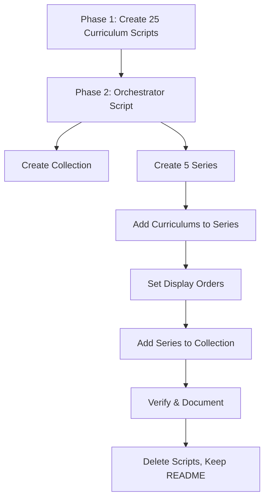

# Design Document: Medical English Curriculum

## Overview

This feature creates a new Medical English collection for Vietnamese-speaking medical students, containing 5 series organized by medical domain with 5 curriculums each (25 total). Each curriculum teaches 18 vocabulary words through the platform's standard 5-session structure with bilingual content (Vietnamese UI, English reading passages).

The implementation follows the established pattern used by existing series (Health & Wellness, Science & Technology, IELTS): standalone Python scripts per curriculum, an orchestrator script for series/collection assembly, and a README documenting all IDs and SQL queries.

### Key Design Decisions

1. **Separate collection, not a sub-series of Health & Wellness**: Medical English targets a distinct audience (medical students) with specialized terminology, warranting its own collection rather than expanding the general wellness series.
2. **5 series × 5 curriculums**: Covers the five core domains of medical education (anatomy, clinical skills, diseases, pharmacology, research) with enough depth per domain to be useful without overwhelming.
3. **Preintermediate-to-intermediate level**: Matches the target audience — Vietnamese medical students who can read basic English but need structured vocabulary building for clinical contexts.

## Architecture

The creation workflow follows the established two-phase pattern:



### File Organization

```
medical-english-curriculum/
├── create_anatomy_1_cardiovascular.py
├── create_anatomy_2_respiratory.py
├── ... (25 curriculum scripts total)
├── create_medical_english_series.py    # orchestrator
└── README.md                           # final documentation (persists)
```

### Execution Order

1. Run each of the 25 `create_*.py` scripts to create individual curriculums via `curriculum/create`
2. Run `create_medical_english_series.py` orchestrator to:
   - Create the collection via `curriculum-collection/create`
   - Create 5 series via `curriculum-series/create`
   - Add curriculums to their respective series via `curriculum-series/addCurriculum`
   - Set display orders via `curriculum/setDisplayOrder` and `curriculum-series/setDisplayOrder`
   - Add series to collection via `curriculum-collection/addSeriesToCollection`
3. Verify no duplicates, check content corruption rules
4. Write README.md with all IDs and SQL queries
5. Delete all scripts and JSON files

## Components and Interfaces

### 1. Curriculum Creation Scripts (25 scripts)

Each script is standalone and follows this pattern:

```python
import sys, json, requests
sys.path.insert(0, "/home/ubuntu/nspaceresearch/design-curriculums")
from firebase_token import get_firebase_id_token

UID = "zs5AMpVfqkcfDf8CJ9qrXdH58d73"
API_BASE = "https://helloapi.step.is"

content = {
    "title": "Cardiovascular System – Hệ Tim Mạch",
    "contentTypeTags": [],
    "description": "...",  # Multi-paragraph persuasive Vietnamese copy
    "preview": {"text": "..."},  # ~150 word Vietnamese preview
    "learningSessions": [...]  # 5 sessions with activities
}

token = get_firebase_id_token(UID)
res = requests.post(f"{API_BASE}/curriculum/create", json={
    "firebaseIdToken": token,
    "language": "en",
    "userLanguage": "vi",
    "content": json.dumps(content)
})
res.raise_for_status()
print(f"Created: {res.json()['id']}")
```

### 2. Orchestrator Script

Creates the collection, series, links everything, sets display orders. Uses the same auth pattern. Prints all IDs for README documentation.

### 3. Content Structure Per Curriculum

Each curriculum's `content` JSON contains:

- `title`: Bilingual (e.g., "Cardiovascular System – Hệ Tim Mạch")
- `contentTypeTags`: `[]`
- `description`: Multi-paragraph persuasive Vietnamese copy (5-beat structure)
- `preview`: `{ "text": "..." }` — ~150 word Vietnamese preview
- `learningSessions`: Array of 5 sessions

### 4. Session Structure

| Session | Title | Activities |
|---------|-------|-----------|
| 1 (Words 1-6) | Phần 1 | introAudio, viewFlashcards, speakFlashcards, vocabLevel1, vocabLevel2, vocabLevel3, reading, speakReading, readAlong, writingSentence |
| 2 (Words 7-12) | Phần 2 | introAudio, viewFlashcards, speakFlashcards, vocabLevel1, vocabLevel2, vocabLevel3, reading, speakReading, readAlong, writingSentence |
| 3 (Review, all 18) | Ôn tập | introAudio, viewFlashcards, speakFlashcards, vocabLevel1, vocabLevel2, vocabLevel3, writingSentence |
| 4 (Words 13-18) | Phần 3 | introAudio, viewFlashcards, speakFlashcards, vocabLevel1, vocabLevel2, vocabLevel3, reading, speakReading, readAlong, writingSentence |
| 5 (Full reading) | Đọc toàn bài | introAudio (intro), reading, speakReading, readAlong, writingParagraph, introAudio (farewell) |

### 5. Activity Data Schemas

```json
// introAudio
{ "activityType": "introAudio", "title": "...", "description": "...", "data": { "text": "..." } }

// viewFlashcards / speakFlashcards / vocabLevel1-3
{ "activityType": "viewFlashcards", "title": "...", "description": "...", "data": { "vocabList": ["word1", "word2", ...] } }

// reading / speakReading / readAlong
{ "activityType": "reading", "title": "...", "description": "...", "data": { "text": "..." } }

// writingSentence
{ "activityType": "writingSentence", "title": "...", "description": "...", "data": { "vocabList": [...], "items": [{ "prompt": "...", "targetVocab": "..." }, ...] } }

// writingParagraph
{ "activityType": "writingParagraph", "title": "...", "description": "...", "data": { "vocabList": [...], "instructions": "...", "prompts": ["...", "..."] } }
```

## Data Models

### Collection

| Field | Value |
|-------|-------|
| title | Tiếng Anh Y Khoa (Medical English) |
| description | Bộ sưu tập từ vựng tiếng Anh chuyên ngành y khoa dành cho sinh viên y, bao gồm giải phẫu, kỹ năng lâm sàng, bệnh lý, dược lý và nghiên cứu y học. |
| isPublic | false (initially) |

### Series (5 total)

| Order | Series | Tone | Description (≤255 chars) |
|-------|--------|------|--------------------------|
| 0 | Giải Phẫu & Hệ Cơ Quan (Anatomy & Body Systems) | vivid_scenario | Hãy tưởng tượng bạn đang đứng trước mô hình giải phẫu — mỗi cơ quan kể một câu chuyện bằng tiếng Anh mà bạn sắp hiểu được. |
| 1 | Kỹ Năng Lâm Sàng & Giao Tiếp Bệnh Nhân (Clinical Skills) | empathetic_observation | Bạn biết cách khám bệnh — nhưng giải thích chẩn đoán bằng tiếng Anh thì sao? Đây là lúc kỹ năng giao tiếp lâm sàng thay đổi tất cả. |
| 2 | Bệnh Lý & Cơ Chế Bệnh (Diseases & Pathology) | surprising_fact | 70% thuật ngữ trong hồ sơ bệnh án quốc tế đến từ gốc Latin và Hy Lạp — và bạn sắp làm chủ chúng. |
| 3 | Dược Lý & Điều Trị (Pharmacology & Treatment) | provocative_question | Bạn có tự tin giải thích tác dụng phụ của thuốc cho bệnh nhân nước ngoài không? |
| 4 | Nghiên Cứu Y Học & Y Học Chứng Cứ (Medical Research) | metaphor_led | Nghiên cứu y học là chiếc la bàn — từ vựng tiếng Anh là cách bạn đọc được nó. |

### Curriculum Topics (25 total)

**Series A — Anatomy & Body Systems:**
| # | Topic | Title |
|---|-------|-------|
| 1 | Cardiovascular System | Cardiovascular System – Hệ Tim Mạch |
| 2 | Respiratory System | Respiratory System – Hệ Hô Hấp |
| 3 | Digestive System | Digestive System – Hệ Tiêu Hóa |
| 4 | Nervous System | Nervous System – Hệ Thần Kinh |
| 5 | Musculoskeletal System | Musculoskeletal System – Hệ Cơ Xương |

**Series B — Clinical Skills & Patient Communication:**
| # | Topic | Title |
|---|-------|-------|
| 1 | Taking a Patient History | Taking a Patient History – Hỏi Bệnh Sử |
| 2 | Physical Examination | Physical Examination – Khám Lâm Sàng |
| 3 | Explaining a Diagnosis | Explaining a Diagnosis – Giải Thích Chẩn Đoán |
| 4 | Discussing Treatment Options | Discussing Treatment Options – Thảo Luận Phương Án Điều Trị |
| 5 | Obtaining Informed Consent | Obtaining Informed Consent – Lấy Đồng Ý Điều Trị |

**Series C — Diseases & Pathology:**
| # | Topic | Title |
|---|-------|-------|
| 1 | Infectious Diseases | Infectious Diseases – Bệnh Truyền Nhiễm |
| 2 | Cardiovascular Diseases | Cardiovascular Diseases – Bệnh Tim Mạch |
| 3 | Respiratory Diseases | Respiratory Diseases – Bệnh Hô Hấp |
| 4 | Cancer & Oncology | Cancer & Oncology – Ung Thư & Ung Bướu |
| 5 | Diabetes & Metabolic Disorders | Diabetes & Metabolic Disorders – Đái Tháo Đường & Rối Loạn Chuyển Hóa |

**Series D — Pharmacology & Treatment:**
| # | Topic | Title |
|---|-------|-------|
| 1 | Antibiotics & Anti-Infectives | Antibiotics & Anti-Infectives – Kháng Sinh & Thuốc Chống Nhiễm Trùng |
| 2 | Pain Management & Analgesics | Pain Management & Analgesics – Giảm Đau & Thuốc Giảm Đau |
| 3 | Cardiovascular Drugs | Cardiovascular Drugs – Thuốc Tim Mạch |
| 4 | Psychiatric Medications | Psychiatric Medications – Thuốc Tâm Thần |
| 5 | Surgical Procedures & Recovery | Surgical Procedures & Recovery – Phẫu Thuật & Hồi Phục |

**Series E — Medical Research & Evidence-Based Medicine:**
| # | Topic | Title |
|---|-------|-------|
| 1 | Study Design & Methodology | Study Design & Methodology – Thiết Kế Nghiên Cứu |
| 2 | Clinical Trials | Clinical Trials – Thử Nghiệm Lâm Sàng |
| 3 | Biostatistics Basics | Biostatistics Basics – Thống Kê Y Sinh Cơ Bản |
| 4 | Reading a Journal Article | Reading a Journal Article – Đọc Hiểu Bài Báo Khoa Học |
| 5 | Systematic Reviews & Meta-Analyses | Systematic Reviews & Meta-Analyses – Tổng Quan Hệ Thống |

### Tone Assignments for Curriculum Descriptions

| Series | C1 | C2 | C3 | C4 | C5 |
|--------|----|----|----|----|-----|
| A (Anatomy) | provocative_question | vivid_scenario | bold_declaration | empathetic_observation | surprising_fact |
| B (Clinical) | bold_declaration | empathetic_observation | surprising_fact | vivid_scenario | provocative_question |
| C (Diseases) | empathetic_observation | provocative_question | vivid_scenario | surprising_fact | metaphor_led |
| D (Pharmacology) | surprising_fact | metaphor_led | provocative_question | bold_declaration | empathetic_observation |
| E (Research) | vivid_scenario | bold_declaration | metaphor_led | provocative_question | empathetic_observation |

Tone distribution across 25 curriculums: provocative_question ×5 (20%), bold_declaration ×4 (16%), vivid_scenario ×4 (16%), empathetic_observation ×5 (20%), surprising_fact ×4 (16%), metaphor_led ×3 (12%). No tone exceeds 30%.

### Farewell Tone Assignments

| Series | C1 | C2 | C3 | C4 | C5 |
|--------|----|----|----|----|-----|
| A | introspective guide | warm accountability | team-building energy | quiet awe | practical momentum |
| B | warm accountability | quiet awe | practical momentum | introspective guide | team-building energy |
| C | team-building energy | introspective guide | quiet awe | practical momentum | warm accountability |
| D | quiet awe | practical momentum | warm accountability | team-building energy | introspective guide |
| E | practical momentum | team-building energy | introspective guide | warm accountability | quiet awe |

## Error Handling

- **API failures**: Each script checks `res.raise_for_status()` and prints the curriculum ID on success. If a script fails, it can be re-run independently.
- **Duplicate detection**: After creation, run duplicate-check SQL query per CURRICULUM_CREATION_RULES.md. Keep earliest, delete extras.
- **Content corruption**: Each script's content is validated against CONTENT_CORRUPTION_RULES.md before upload (correct `activityType` field, `vocabList` not `words`, data inside `data` object, matching vocabLists for viewFlashcards/speakFlashcards).
- **Display order conflicts**: Orchestrator queries existing items before setting orders to avoid conflicts.
- **Auth token expiry**: Firebase tokens are short-lived; each script generates a fresh token at runtime.

## Testing Strategy

Property-based testing is not applicable to this feature. The work consists of:
- Hand-written content (Vietnamese marketing copy, English reading passages, vocabulary lists)
- API calls to create/organize resources
- One-time script execution with post-creation verification

There are no pure functions, parsers, serializers, or algorithmic transformations that would benefit from PBT.

### Verification Approach

1. **Content schema validation**: Each script should validate its JSON structure against CONTENT_CORRUPTION_RULES.md before uploading:
   - All activities have `activityType` (not `type`)
   - Vocab activities use `vocabList` (not `words`)
   - All data fields are inside `data` object
   - `viewFlashcards` and `speakFlashcards` in same session have identical `vocabList`
   - All activities have `title` and `description`
   - Each curriculum has exactly 18 vocab words across 3 groups of 6

2. **Post-creation checks**:
   - Duplicate detection SQL query for each curriculum
   - Verify all 25 curriculums exist via `curriculum/getOne`
   - Verify series membership and display orders via SQL
   - Verify collection contains all 5 series

3. **Content quality review**:
   - Manual review of persuasive copy against CURRICULUM_QUALITY_STANDARDS.md
   - Verify tone variety across adjacent descriptions
   - Verify vocabulary words are appropriate for preintermediate-to-intermediate medical students
   - Verify no vocabulary duplication within a series
