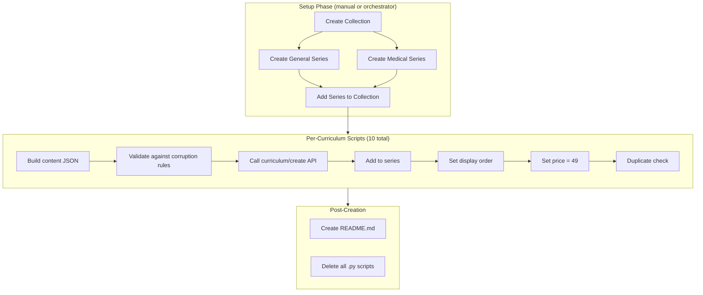

# Design Document: Mental Well-being Curriculum

## Overview

This feature creates 10 vi-en curriculums on mental well-being, organized into 1 collection with 2 series:

- **General Audience series** (5 curriculums): beginner → intermediate, everyday mental health topics
- **Medical Students series** (5 curriculums): beginner → intermediate, clinical/academic mental health topics

Each curriculum is created by a standalone Python script that builds hand-written JSON content and calls the REST API via `api_helpers.py`. After creation, scripts are deleted and a README.md documents the results.

### Key Design Decisions

1. **One script per curriculum** — Each of the 10 curriculums gets its own Python script with all text content written inline (no templating). This follows the established pattern from `effective-learning-curriculum/` and satisfies CURRICULUM_CREATION_RULES.md.

2. **Collection-first creation order** — Create the collection and both series first, then create curriculums and wire them in. This avoids needing to update series after the fact.

3. **Runtime ID resolution** — All IDs (collection, series) are queried from the database at runtime using MCP postgres. No hardcoded IDs in scripts.

4. **Validation before wiring** — Each script validates its content JSON against CONTENT_CORRUPTION_RULES before calling the create API, catching structural defects early.

## Architecture



### Execution Flow

1. **Setup**: Create collection + 2 series, wire series to collection, set series display orders
2. **General Audience**: Run 5 scripts (G1–G5) sequentially, each creating one curriculum
3. **Medical Students**: Run 5 scripts (M1–M5) sequentially, each creating one curriculum
4. **Cleanup**: Generate README.md with all IDs, delete scripts

Each script is self-contained and idempotent in the sense that running it again creates a new curriculum (which the duplicate check catches).

## Components and Interfaces

### Component 1: Setup Script (or manual setup)

Creates the organizational structure before any curriculum scripts run.

**Responsibilities:**
- Create collection "Sức Khỏe Tinh Thần (Mental Well-being)"
- Create general-audience series "Sức Khỏe Tinh Thần — Đời Sống (Everyday Mental Well-being)"
- Create medical-student series "Sức Khỏe Tinh Thần — Sinh Viên Y Khoa (Mental Well-being for Medical Students)"
- Wire both series to the collection
- Set series display orders (general = 0, medical = 1)

**Interface:**
```python
# Uses api_helpers.py functions:
create_collection(title, description) -> collection_id
create_series(title, description) -> series_id
add_series_to_collection(collection_id, series_id)
set_series_display_order(series_id, order)
```

### Component 2: Curriculum Creation Scripts (10 scripts)

Each script builds a complete curriculum content JSON and creates it via the API.

**Naming convention:**
- `create_g1_daily_emotions.py` through `create_g5_positive_thinking.py`
- `create_m1_med_student_intro.py` through `create_m5_patient_communication.py`

**Script structure (each script):**
```python
import sys, json, logging
sys.path.insert(0, "/home/ubuntu/nspaceresearch/design-curriculums")
from api_helpers import (
    create_curriculum, add_to_series, set_display_order, set_price
)

def build_content() -> dict:
    """Build the complete curriculum content JSON with all hand-written text."""
    return {
        "title": "...",
        "description": "...",
        "contentTypeTags": [],
        "skillFocusTags": ["balanced_skills"],
        "preview": {"text": "..."},
        "learningSessions": [...]
    }

def validate(content: dict) -> None:
    """Validate content against CONTENT_CORRUPTION_RULES."""
    # Top-level checks, session checks, activity checks, cross-field consistency
    ...

def create():
    """Create curriculum, add to series, set order and price."""
    content = build_content()
    validate(content)
    
    curriculum_id = create_curriculum(content, language="en", user_language="vi")
    
    # Query series ID from DB at runtime
    series_id = "..."  # Retrieved via MCP postgres before script execution
    add_to_series(series_id, curriculum_id)
    set_display_order(curriculum_id, ORDER)
    set_price(curriculum_id, 49)
    
    # Duplicate check
    print(f"Created: {curriculum_id}")
    print(f"Check duplicates: SELECT id, title, created_at FROM curriculum "
          f"WHERE title = '{content['title']}' AND uid = 'zs5AMpVfqkcfDf8CJ9qrXdH58d73' "
          f"ORDER BY created_at;")

if __name__ == "__main__":
    create()
```

### Component 3: Content Validation Module

Inline validation function in each script that checks content against CONTENT_CORRUPTION_RULES before API submission.

**Checks performed:**
1. Top-level: `title`, `description`, `preview.text`, `learningSessions` exist and are correct types
2. Session: each has `title` (string) and `activities` (non-empty array)
3. Activity: each has `activityType` (not `type`), valid activityType value, `title`, `description`, `data` object
4. Activity-specific: introAudio → `data.text`; reading/speakReading/readAlong → `data.text`; flashcard/vocab → `data.vocabList` (not `data.words`); writingSentence → `data.vocabList`, `data.items` with `prompt`/`targetVocab`; writingParagraph → `data.vocabList`, `data.instructions`, `data.prompts` (≥2)
5. Cross-field: viewFlashcards and speakFlashcards in same session have identical `vocabList`
6. No strip-keys anywhere in the JSON tree

### Component 4: README Generator

After all 10 curriculums are created and verified, generates a comprehensive README.md and deletes all scripts.

**README sections:**
- Collection ID, series IDs
- All 10 curriculum IDs with titles, levels, vocab lists
- Tone assignments (description + farewell)
- Display order mapping
- SQL verification queries
- Recreation instructions

## Data Models

### Curriculum Content JSON Structure

#### Beginner (4 sessions, 12 vocab)

```json
{
  "title": "Vietnamese title — optional English subtitle",
  "description": "Multi-paragraph Vietnamese persuasive copy...",
  "contentTypeTags": [],
  "skillFocusTags": ["balanced_skills"],
  "preview": {
    "text": "~150 words Vietnamese marketing copy..."
  },
  "learningSessions": [
    {
      "title": "Phần 1",
      "activities": [
        {"activityType": "introAudio", "title": "Giới thiệu từ vựng", "description": "...", "data": {"text": "500-800 word Vietnamese script..."}},
        {"activityType": "viewFlashcards", "title": "Flashcards: topic", "description": "Học 6 từ: w1, w2, ...", "data": {"vocabList": ["w1", "w2", "w3", "w4", "w5", "w6"]}},
        {"activityType": "speakFlashcards", "title": "Flashcards: topic", "description": "Học 6 từ: w1, w2, ...", "data": {"vocabList": ["w1", "w2", "w3", "w4", "w5", "w6"]}},
        {"activityType": "vocabLevel1", "title": "Flashcards: topic", "description": "Học 6 từ: w1, w2, ...", "data": {"vocabList": ["w1", "w2", "w3", "w4", "w5", "w6"]}},
        {"activityType": "vocabLevel2", "title": "Flashcards: topic", "description": "Học 6 từ: w1, w2, ...", "data": {"vocabList": ["w1", "w2", "w3", "w4", "w5", "w6"]}},
        {"activityType": "reading", "title": "Đọc: topic", "description": "First ~80 chars...", "data": {"text": "English reading passage...", "vocabList": ["w1", "w2", "w3", "w4", "w5", "w6"]}},
        {"activityType": "speakReading", "title": "Đọc: topic", "description": "First ~80 chars...", "data": {"text": "Same English reading passage...", "vocabList": ["w1", "w2", "w3", "w4", "w5", "w6"]}},
        {"activityType": "readAlong", "title": "Nghe: topic", "description": "Nghe đoạn văn vừa đọc và theo dõi.", "data": {"text": "Same English reading passage..."}},
        {"activityType": "writingSentence", "title": "Viết: topic", "description": "...", "data": {"vocabList": ["w1", "w2", "w3", "w4", "w5", "w6"], "items": [{"prompt": "...", "targetVocab": "w1"}, ...]}}
      ]
    },
    {
      "title": "Phần 2",
      "activities": ["... same pattern with words 7-12 ..."]
    },
    {
      "title": "Ôn tập",
      "activities": [
        {"activityType": "introAudio", "...": "..."},
        {"activityType": "viewFlashcards", "data": {"vocabList": ["all 12 words"]}},
        {"activityType": "speakFlashcards", "data": {"vocabList": ["all 12 words"]}},
        {"activityType": "vocabLevel1", "data": {"vocabList": ["all 12 words"]}},
        {"activityType": "vocabLevel2", "data": {"vocabList": ["all 12 words"]}},
        {"activityType": "writingSentence", "...": "..."}
      ]
    },
    {
      "title": "Đọc toàn bài",
      "activities": [
        {"activityType": "introAudio", "...": "intro..."},
        {"activityType": "reading", "...": "full article..."},
        {"activityType": "speakReading", "...": "full article..."},
        {"activityType": "readAlong", "...": "full article..."},
        {"activityType": "writingParagraph", "data": {"vocabList": ["all 12"], "instructions": "...", "prompts": ["prompt1", "prompt2"]}},
        {"activityType": "introAudio", "...": "farewell..."}
      ]
    }
  ]
}
```

#### Preintermediate/Intermediate (5 sessions, 18 vocab)

Same structure but:
- 3 learning sessions (Phần 1/2/3) with 6 words each, adding `vocabLevel3` after `vocabLevel2`
- Review session (Ôn tập) with all 18 words, including `vocabLevel3`
- Final session (Đọc toàn bài) same pattern

### Tone Assignment Plan

#### Description Tones (10 curriculums, max 3 per tone)

| Curriculum | Tone | Rationale |
|---|---|---|
| G1 (beginner) | empathetic_observation | Opens with recognizing daily emotional struggles |
| G2 (beginner) | surprising_fact | Opens with a sleep science fact |
| G3 (preintermediate) | provocative_question | Asks about stress management |
| G4 (intermediate) | vivid_scenario | Paints a relationship scenario |
| G5 (intermediate) | metaphor_led | Uses a thinking/mindset metaphor |
| M1 (beginner) | bold_declaration | Declares importance of med student mental health |
| M2 (preintermediate) | empathetic_observation | Recognizes burnout struggle |
| M3 (preintermediate) | provocative_question | Asks about compassion fatigue |
| M4 (intermediate) | surprising_fact | Clinical psychology fact |
| M5 (intermediate) | vivid_scenario | Patient communication scenario |

**Distribution check:** empathetic_observation ×2, surprising_fact ×2, provocative_question ×2, vivid_scenario ×2, metaphor_led ×1, bold_declaration ×1 — all ≤ 3 ✓
**Adjacency check (General):** empathetic → surprising → provocative → vivid → metaphor — all different ✓
**Adjacency check (Medical):** bold → empathetic → provocative → surprising → vivid — all different ✓

#### Series Description Tones

| Series | Tone |
|---|---|
| General Audience | vivid_scenario |
| Medical Students | bold_declaration |

Different tones ✓

#### Farewell introAudio Tones

| Curriculum | Farewell Tone |
|---|---|
| G1 | warm accountability |
| G2 | quiet awe |
| G3 | introspective guide |
| G4 | team-building energy |
| G5 | practical momentum |
| M1 | quiet awe |
| M2 | introspective guide |
| M3 | warm accountability |
| M4 | practical momentum |
| M5 | team-building energy |

**Adjacency check (General):** warm → quiet → introspective → team → practical — all different ✓
**Adjacency check (Medical):** quiet → introspective → warm → practical → team — all different ✓

### Display Order Plan

#### Within General Audience Series
| Order | Curriculum | Level |
|---|---|---|
| 0 | G1 — Cảm Xúc Hàng Ngày | beginner |
| 1 | G2 — Giấc Ngủ Ngon | beginner |
| 2 | G3 — Vượt Qua Căng Thẳng | preintermediate |
| 3 | G4 — Mối Quan Hệ Lành Mạnh | intermediate |
| 4 | G5 — Tư Duy Tích Cực | intermediate |

#### Within Medical Students Series
| Order | Curriculum | Level |
|---|---|---|
| 0 | M1 — Sức Khỏe Tinh Thần Sinh Viên Y | beginner |
| 1 | M2 — Kiệt Sức Học Đường | preintermediate |
| 2 | M3 — Đồng Cảm Không Kiệt Sức | preintermediate |
| 3 | M4 — Tâm Lý Lâm Sàng | intermediate |
| 4 | M5 — Giao Tiếp Với Bệnh Nhân | intermediate |

Level gaps: beginner→beginner (0), beginner→preintermediate (1), preintermediate→intermediate (1) — all ≤ 1 ✓

### Vocabulary Assignment (Final)

#### General Audience Series (no intra-series overlap)

| Curriculum | Level | Vocab (12 or 18 words) |
|---|---|---|
| G1 | beginner | anxious, calm, overwhelmed, grateful, frustrated, mood, emotion, stress, relax, breathe, balance, mindful |
| G2 | beginner | insomnia, fatigue, routine, nap, restful, drowsy, pillow, alarm, habit, refresh, recharge, snore |
| G3 | preintermediate | anxiety, tension, burnout, coping, resilience, therapy, meditation, journal, boundary, self-care, trigger, symptom, recovery, wellness, mindfulness, gratitude, perspective, overwhelm |
| G4 | intermediate | empathy, attachment, vulnerability, assertive, conflict, compromise, trust, intimacy, resentment, codependent, communicate, validate, supportive, toxic, reciprocal, forgive, nurture, compassion |
| G5 | intermediate | optimism, pessimism, reframe, cognitive, distortion, affirmation, self-talk, catastrophize, ruminate, growth, mindset, setback, persevere, resilient, flourish, thrive, perseverance, determination |

**Intra-series overlap check:** Zero overlap ✓

#### Medical Students Series (no intra-series overlap)

| Curriculum | Level | Vocab (12 or 18 words) |
|---|---|---|
| M1 | beginner | stress, pressure, exam, exhaustion, support, counselor, schedule, priority, overwhelm, cope, balance, wellbeing |
| M2 | preintermediate | burnout, fatigue, procrastination, perfectionism, deadline, motivation, discipline, self-compassion, isolation, peer, mentor, debrief, workload, symptom, chronic, recovery, boundary, recharge |
| M3 | preintermediate | compassion, empathy, detachment, clinical, patient, caregiver, emotional, drain, vicarious, trauma, supervision, self-care, threshold, absorb, professional, distress, regulate, resilience |
| M4 | intermediate | diagnosis, disorder, therapy, cognitive, behavioral, anxiety, depression, screening, intervention, prognosis, comorbidity, psychosomatic, referral, assessment, acute, remission, psychiatric, holistic |
| M5 | intermediate | disclosure, stigma, confidential, consent, rapport, reassure, empathize, prescribe, compliance, follow-up, counseling, advocate, diagnose, wellbeing, coping, nurture, validate, communicate |

**Intra-series overlap check:** Zero overlap ✓

**Cross-series overlap (acceptable for foundational terms):** stress (G1, M1), balance (G1, M1), overwhelm (G3, M1), burnout (G3, M2), resilience (G3, M3), boundary (G3, M2), self-care (G3, M3), recovery (G3, M2), symptom (G3, M2), compassion (G4, M3), empathy (G4, M3), cognitive (G5, M4), therapy (G3, M4), coping (G3, M5), validate (G4, M5), communicate (G4, M5), wellbeing (M1, M5), nurture (G4, M5) — these are foundational mental health terms that naturally appear at different levels in different contexts, which is acceptable per Requirement 12.6.

## Correctness Properties

*A property is a characteristic or behavior that should hold true across all valid executions of a system — essentially, a formal statement about what the system should do. Properties serve as the bridge between human-readable specifications and machine-verifiable correctness guarantees.*

### Property 1: Content structure passes all corruption rules

*For any* curriculum content JSON produced by any of the 10 creation scripts, the content SHALL pass all CONTENT_CORRUPTION_RULES: top-level structure has `title` (non-empty string), `description` (non-empty string), `preview` (object with non-empty `text`), and `learningSessions` (non-empty array); each session has `title` (non-empty string) and `activities` (non-empty array); each activity has `activityType` (valid value, not `type`), `title`, `description`, and `data` (object, not inline); activity-type-specific data rules are satisfied; and viewFlashcards/speakFlashcards in the same session have identical `vocabList`.

**Validates: Requirements 5.1, 5.2, 5.5, 10.1, 10.2, 10.3**

### Property 2: All vocabList entries are lowercase strings

*For any* activity containing a `vocabList` field in any curriculum content JSON, every entry in the `vocabList` array SHALL be a lowercase string (no uppercase characters, no non-string types).

**Validates: Requirements 5.6, 12.1, 12.2, 12.3**

### Property 3: No strip-keys in curriculum content

*For any* curriculum content JSON produced by any creation script, no key at any nesting depth SHALL be one of the strip-keys (`mp3Url`, `illustrationSet`, `segments`, `chapterBookmarks`, `whiteboardItems`, `userReadingId`, `lessonUniqueId`, `curriculumTags`, `taskId`, `imageId`).

**Validates: Requirements 9.4**

## Error Handling

### API Call Failures

Each script uses `api_helpers.py` which raises exceptions on HTTP errors. The script should:
1. Log the error with curriculum title and API endpoint
2. Exit with non-zero status code
3. NOT attempt to clean up partially created resources (manual cleanup via DB)

### Validation Failures

The `validate()` function runs before any API call. If validation fails:
1. Raise `ValueError` with a descriptive message identifying the specific rule violation
2. Exit before making any API calls
3. The developer fixes the content and re-runs

### Duplicate Detection

After creation, the script prints a SQL query for duplicate checking. If duplicates are found:
1. Keep the earliest record (lowest `created_at`)
2. Remove extras from the series first (`curriculum-series/removeCurriculum`)
3. Delete the duplicate curriculum (`curriculum/delete`)

### Series/Collection ID Resolution

Scripts query series IDs from the database. If the query returns no results:
1. Log an error indicating the series hasn't been created yet
2. Exit with instructions to run the setup step first

## Testing Strategy

### No Build/Test System

This project has no test framework, CI pipeline, or build step. Scripts are run directly with `python`. Testing is done through:

1. **Pre-creation validation**: Each script's `validate()` function checks content against CONTENT_CORRUPTION_RULES before API submission
2. **Post-creation SQL verification**: Queries to verify curriculums exist with correct metadata
3. **Manual content review**: Reading passages, descriptions, and vocabulary reviewed for quality

### Validation Approach

Since this is a content creation project (Python scripts calling a REST API with hand-written JSON), property-based testing with a PBT library is not practical — there's no test runner, no package manager, and the "code under test" is hand-written content, not a function with variable inputs.

Instead, correctness is enforced through:

1. **Inline validation functions** in each script that programmatically check the 3 correctness properties before API submission
2. **Post-creation SQL queries** to verify:
   - All 10 curriculums exist with correct titles, levels, and language settings
   - Display orders are set correctly within each series
   - Prices are 49 credits
   - No duplicates exist
   - Series and collection structure is correct
3. **Content corruption checks** matching all rules from CONTENT_CORRUPTION_RULES.md

### SQL Verification Queries

```sql
-- Verify all curriculums in general series
SELECT c.id, c.content->>'title' as title, c.display_order,
       c.content->'skillFocusTags' as skills, c.price
FROM curriculum c
JOIN curriculum_series_items csi ON csi.curriculum_id = c.id
WHERE csi.curriculum_series_id = '<general_series_id>'
ORDER BY c.display_order;

-- Verify all curriculums in medical series
SELECT c.id, c.content->>'title' as title, c.display_order,
       c.content->'skillFocusTags' as skills, c.price
FROM curriculum c
JOIN curriculum_series_items csi ON csi.curriculum_id = c.id
WHERE csi.curriculum_series_id = '<medical_series_id>'
ORDER BY c.display_order;

-- Verify no duplicates
SELECT content->>'title' as title, COUNT(*) as cnt
FROM curriculum
WHERE uid = 'zs5AMpVfqkcfDf8CJ9qrXdH58d73'
AND content->>'title' IN ('<all 10 titles>')
GROUP BY content->>'title'
HAVING COUNT(*) > 1;

-- Verify collection structure
SELECT cs.id as series_id, cs.title as series_title, cs.display_order
FROM curriculum_series cs
JOIN curriculum_collection_series ccs ON ccs.curriculum_series_id = cs.id
WHERE ccs.curriculum_collection_id = '<collection_id>'
ORDER BY cs.display_order;

-- Verify nothing is public
SELECT c.id, c.content->>'title', c.is_public
FROM curriculum c
WHERE c.id IN ('<all 10 ids>')
AND c.is_public = true;
```
