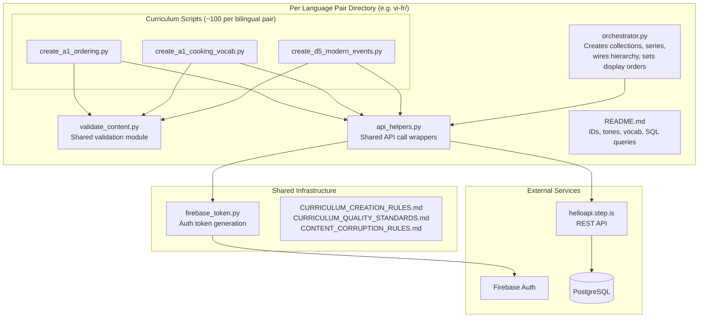
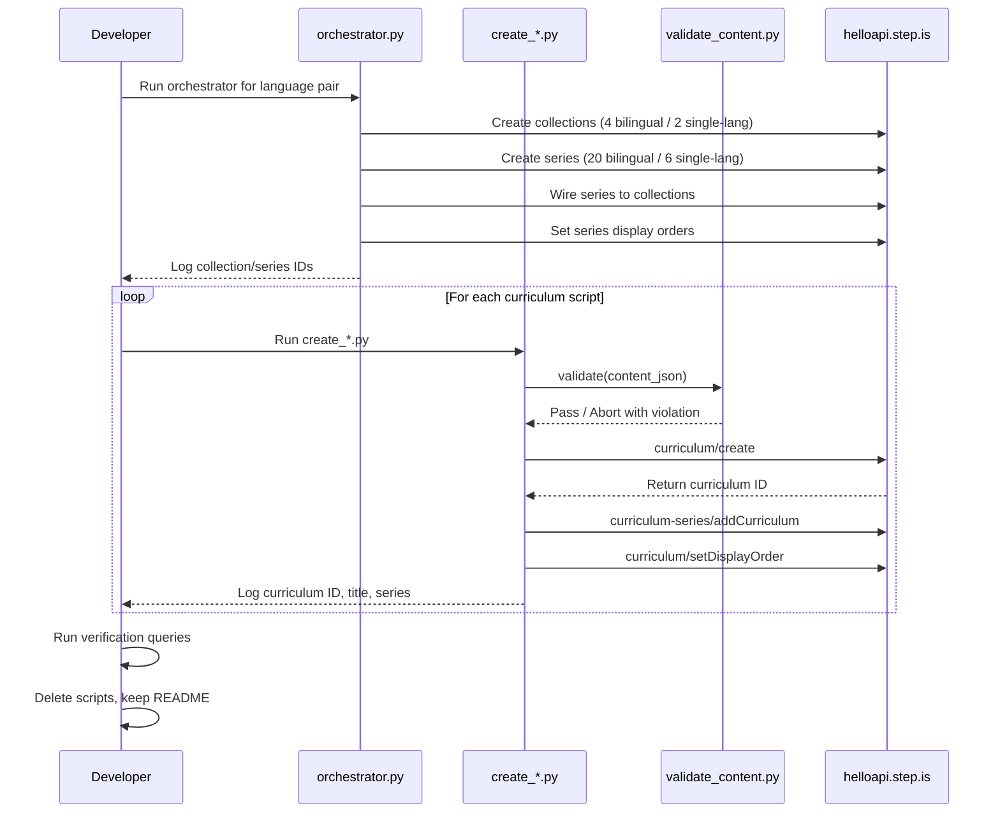

# Design Document: Multilingual Curriculum Expansion

## Overview

This design covers the creation of ~460 curriculums across 6 language pairs for the language-learning platform. The system consists of standalone Python scripts that generate curriculum JSON content and upload it via the REST API at `https://helloapi.step.is`. The expansion targets 4 bilingual pairs (vi-fr, vi-de, en-fr, en-de with ~100 each) and 2 single-language pairs (fr-fr, de-de with ~30 each).

The architecture follows the existing pattern established in the codebase: one Python script per curriculum containing hand-crafted content, one orchestrator per language pair for infrastructure setup (collections, series, wiring, display orders), and inline validation before upload. All scripts authenticate via `firebase_token.py` with UID `zs5AMpVfqkcfDf8CJ9qrXdH58d73`.

### Key Design Decisions

1. **One script per curriculum** (not batch generators): Each curriculum's learner-facing text must be individually crafted per the No Templated Content Generation rule. Template-based generation is explicitly prohibited.
2. **Shared validation module**: Rather than duplicating validation logic in ~460 scripts, a shared `validate_content.py` module per language pair directory implements the Content Corruption Detection Rules.
3. **Shared API helper module**: A `api_helpers.py` module per language pair directory wraps common API calls (create curriculum, add to series, set display order) to reduce boilerplate.
4. **Phased execution by language pair**: vi-fr → vi-de → en-fr → en-de → fr-fr → de-de, with verification gates between phases.
5. **Tone pre-assignment**: All tone assignments (description + farewell) are determined before script creation and documented in the orchestrator, ensuring variety constraints are met upfront rather than ad-hoc.

## Architecture



### Execution Flow



## Components and Interfaces

### 1. Orchestrator Script (`orchestrator.py`)

One per language pair. Responsibilities:
- Create all collections for the language pair via `curriculum-collection/create`
- Create all series via `curriculum-series/create` with descriptions ≤255 chars
- Wire series to collections via `curriculum-collection/addSeriesToCollection`
- Set series display orders via `curriculum-series/setDisplayOrder`
- Set collection display orders via `curriculum-collection/setDisplayOrder`
- Output all IDs to stdout for tracking

Interface:
```python
# No arguments — all configuration is inline
# Outputs: collection IDs, series IDs, display orders to stdout
# Uses: api_helpers.py, firebase_token.py
```

### 2. Curriculum Creation Script (`create_*.py`)

One per curriculum (~460 total). Responsibilities:
- Define hand-crafted curriculum content JSON (title, description, preview, 5 sessions with activities)
- Validate content via `validate_content.py`
- Upload via `curriculum/create` with `language` and `userLanguage` as top-level body params
- Add to series via `curriculum-series/addCurriculum`
- Set display order via `curriculum/setDisplayOrder`
- Log curriculum ID, title, series to stdout

Interface:
```python
# No arguments — content and series ID are inline
# Outputs: curriculum ID, title, series context to stdout
# Uses: validate_content.py, api_helpers.py, firebase_token.py
```

### 3. Content Validator (`validate_content.py`)

Shared module per language pair directory. Implements all checks from CONTENT_CORRUPTION_RULES.md.

Interface:
```python
def validate(content: dict) -> None:
    """
    Validates curriculum content JSON against all corruption detection rules.
    Raises ValueError with specific violation message if any check fails.
    Checks:
    - Top-level structure (title, description, preview.text, learningSessions)
    - Session structure (title, activities array)
    - Activity structure (activityType, title, description, data)
    - Activity-type-specific data rules
    - Cross-field consistency (viewFlashcards/speakFlashcards vocabList match)
    - No strip-keys present
    - Exactly 18 unique vocabulary words
    - vocabList contains lowercase strings only
    - Valid activityType values
    """
    pass
```

### 4. API Helpers (`api_helpers.py`)

Shared module per language pair directory. Wraps common API patterns.

Interface:
```python
def get_token() -> str:
    """Get Firebase ID token for the standard UID."""

def create_curriculum(content: dict, language: str, user_language: str) -> str:
    """Create curriculum via API. Returns curriculum ID."""

def add_to_series(series_id: str, curriculum_id: str) -> None:
    """Add curriculum to series."""

def set_display_order(curriculum_id: str, order: int) -> None:
    """Set curriculum display order."""

def create_collection(title: str, description: str) -> str:
    """Create collection. Returns collection ID."""

def create_series(title: str, description: str) -> str:
    """Create series. Returns series ID."""

def add_series_to_collection(collection_id: str, series_id: str) -> None:
    """Wire series to collection."""

def set_series_display_order(series_id: str, order: int) -> None:
    """Set series display order within collection."""

def set_collection_display_order(collection_id: str, order: int) -> None:
    """Set collection global display order."""
```

### 5. Tone Assignment

Tone assignments are pre-computed and documented in the orchestrator script as comments. The Tone_Assigner logic ensures:
- No two adjacent curriculums in a series share the same description tone
- No two adjacent series in a collection share the same description tone
- No single tone exceeds 30% of descriptions per language pair
- No two adjacent curriculums in a series share the same farewell tone

Tone rotation pattern per series of 5 curriculums (example):
```python
# Description tones: provocative_question, bold_declaration, vivid_scenario, empathetic_observation, surprising_fact
# Farewell tones: introspective_guide, warm_accountability, team_building_energy, quiet_awe, practical_momentum
```

## Data Models

### Curriculum Content JSON Structure

```json
{
  "title": "string (minimal, no series/collection name repetition)",
  "contentTypeTags": [],
  "description": "string (multi-paragraph persuasive copy with tone-assigned ALL-CAPS headline)",
  "preview": {
    "text": "string (~150 words, expanded persuasive copy)"
  },
  "learningSessions": [
    {
      "title": "string (e.g. 'Phần 1', 'Partie 1', 'Teil 1')",
      "activities": [
        {
          "activityType": "introAudio|viewFlashcards|speakFlashcards|vocabLevel1|vocabLevel2|vocabLevel3|reading|speakReading|readAlong|writingSentence|writingParagraph",
          "title": "string",
          "description": "string",
          "data": {
            "text": "string (for introAudio, reading, speakReading, readAlong)",
            "vocabList": ["string (lowercase)"],
            "items": [{"prompt": "string", "targetVocab": "string"}],
            "instructions": "string",
            "prompts": ["string", "string"]
          }
        }
      ]
    }
  ]
}
```

### Session Structure (5 sessions per curriculum)

| Session | Title Pattern | Activities | Vocab Words |
|---------|--------------|------------|-------------|
| 1 (Learning) | "Phần 1" / "Partie 1" / "Teil 1" / "Part 1" | introAudio, viewFlashcards, speakFlashcards, vocabLevel1, vocabLevel2, vocabLevel3, reading, speakReading, readAlong, writingSentence | 6 words |
| 2 (Learning) | "Phần 2" / "Partie 2" / "Teil 2" / "Part 2" | Same as session 1 | 6 words |
| 3 (Learning) | "Phần 3" / "Partie 3" / "Teil 3" / "Part 3" | Same as session 1 | 6 words |
| 4 (Review) | "Ôn tập" / "Révision" / "Wiederholung" / "Review" | Activities covering all 18 words + comprehensive reading | All 18 |
| 5 (Final) | "Bài đọc tổng hợp" / "Lecture finale" / "Abschlusslektüre" / "Final Reading" | Full reading, readAlong, writingParagraph, farewell introAudio | All 18 |

### Language Pair Configuration

| Pair | userLanguage | language | Type | Curriculums | Collections | Series |
|------|-------------|----------|------|-------------|-------------|--------|
| vi-fr | vi | fr | Bilingual | ~100 | 4 | 20 |
| vi-de | vi | de | Bilingual | ~100 | 4 | 20 |
| en-fr | en | fr | Bilingual | ~100 | 4 | 20 |
| en-de | en | de | Bilingual | ~100 | 4 | 20 |
| fr-fr | fr | fr | Single-lang | ~30 | 2 | 6 |
| de-de | de | de | Single-lang | ~30 | 2 | 6 |
| **Total** | | | | **~460** | **20** | **92** |

### Directory Structure

```
vi-fr/
├── orchestrator.py
├── validate_content.py
├── api_helpers.py
├── a1_food_dining/
│   ├── create_ordering.py
│   ├── create_cooking_vocab.py
│   ├── create_restaurant_culture.py
│   ├── create_dietary_preferences.py
│   └── create_street_food.py
├── a2_city_navigation/
│   └── ... (5 scripts)
├── ... (18 more series directories)
└── README.md

(Same pattern for vi-de/, en-fr/, en-de/, fr-fr/, de-de/)
```

### API Call Sequence per Curriculum

```python
# 1. Validate content
validate(content)

# 2. Create curriculum
response = requests.post(f"{API_BASE}/curriculum/create", json={
    "firebaseIdToken": token,
    "language": "fr",          # target language
    "userLanguage": "vi",      # learner's native language
    "content": json.dumps(content)
})
curriculum_id = response.json()["id"]

# 3. Add to series
requests.post(f"{API_BASE}/curriculum-series/addCurriculum", json={
    "firebaseIdToken": token,
    "curriculumSeriesId": series_id,
    "curriculumId": curriculum_id
})

# 4. Set display order
requests.post(f"{API_BASE}/curriculum/setDisplayOrder", json={
    "firebaseIdToken": token,
    "id": curriculum_id,
    "displayOrder": order
})
```


## Correctness Properties

*A property is a characteristic or behavior that should hold true across all valid executions of a system — essentially, a formal statement about what the system should do. Properties serve as the bridge between human-readable specifications and machine-verifiable correctness guarantees.*

The testable logic in this project falls into two domains: (1) the Content Validator that checks curriculum JSON structure before upload, and (2) the Tone Assigner that ensures variety constraints on description and farewell tones. Both are pure functions with clear input/output behavior suitable for property-based testing.

Many requirements (language quality, persuasive copy style, cultural adaptation, topic coverage, documentation) describe hand-written content quality and process workflows — these are not amenable to automated property testing and are covered by manual review.

### Property 1: Top-level structure validation

*For any* curriculum content JSON, the validator SHALL accept it only if it has non-null, non-empty `title`, `description`, `preview.text` fields and a `contentTypeTags` field at the top level. Content missing any of these fields SHALL be rejected with a specific violation message.

**Validates: Requirements 5.9, 11.1**

### Property 2: Session structure invariant

*For any* curriculum content JSON, the validator SHALL accept it only if `learningSessions` is an array of exactly 5 elements, where each session has a non-empty `title` string and a non-empty `activities` array.

**Validates: Requirements 5.1, 11.2**

### Property 3: Vocabulary distribution invariant

*For any* curriculum content JSON, the validator SHALL accept it only if the total unique vocabulary words across all sessions equals exactly 18, with exactly 6 unique words in each of the first 3 learning sessions.

**Validates: Requirements 3.4, 5.2, 11.10**

### Property 4: Activity structure completeness

*For any* activity in any session of any curriculum content JSON, the validator SHALL accept it only if the activity has `activityType` (not `type`), `title`, `description`, and `data` fields, with `activityType` being one of the 11 valid values, and all content fields inside `data` (not inline on the activity object).

**Validates: Requirements 5.6, 11.3, 11.4**

### Property 5: VocabList format enforcement

*For any* viewFlashcards, speakFlashcards, vocabLevel1, vocabLevel2, or vocabLevel3 activity, the validator SHALL accept it only if `data.vocabList` is a non-empty array of lowercase strings. The field name must be `vocabList` (never `words`). Any uppercase characters, non-string elements, or use of `words` as the field name SHALL be rejected.

**Validates: Requirements 5.7, 11.5**

### Property 6: Flashcard vocabList consistency

*For any* session containing both a viewFlashcards and a speakFlashcards activity, the validator SHALL accept it only if both activities have identical `vocabList` arrays (same elements in the same order).

**Validates: Requirements 5.8, 11.6**

### Property 7: Writing activity structure

*For any* writingSentence activity, the validator SHALL accept it only if `data.vocabList` is present, `data.items` is a non-empty array, and each item has non-empty `prompt` and `targetVocab` strings. *For any* writingParagraph activity, the validator SHALL accept it only if `data.vocabList` is present, `data.instructions` is a non-empty string, and `data.prompts` is an array of strings with length ≥ 2.

**Validates: Requirements 11.7, 11.8**

### Property 8: Strip keys exclusion

*For any* curriculum content JSON, the validator SHALL reject it if any of the auto-generated strip keys (`mp3Url`, `illustrationSet`, `chapterBookmarks`, `segments`, `whiteboardItems`, `userReadingId`, `lessonUniqueId`, `curriculumTags`, `taskId`, `imageId`) appear anywhere in the JSON tree at any depth.

**Validates: Requirements 5.10, 11.9**

### Property 9: Validator rejects invalid content with specific message

*For any* curriculum content JSON that violates any structural rule, the validator SHALL raise an error (not silently pass) and the error message SHALL identify the specific violation.

**Validates: Requirements 5.11, 11.11**

### Property 10: Tone palette validity

*For any* tone assignment in the system, every description tone SHALL be one of the 6 valid Tone_Palette types (`provocative_question`, `bold_declaration`, `vivid_scenario`, `empathetic_observation`, `surprising_fact`, `metaphor_led`), and every farewell tone SHALL be one of the 5 valid Farewell_Palette registers (`introspective_guide`, `warm_accountability`, `team_building_energy`, `quiet_awe`, `practical_momentum`).

**Validates: Requirements 8.1, 8.5**

### Property 11: Tone adjacency constraint

*For any* sequence of tone assignments within a series (both description tones and farewell tones), and *for any* sequence of series description tones within a collection, no two adjacent entries SHALL have the same tone value.

**Validates: Requirements 8.2, 8.3, 8.6**

### Property 12: Tone distribution cap

*For any* batch of description tone assignments within a language pair, no single Tone_Palette type SHALL account for more than 30% of the total assignments.

**Validates: Requirements 8.4**

## Error Handling

### API Call Failures

- If `curriculum/create` fails, the script logs the error with curriculum title and series context, then continues (per Requirement 9.8)
- If `curriculum-series/addCurriculum` or `curriculum/setDisplayOrder` fails after successful creation, the script logs the curriculum ID and the failed operation for manual recovery
- Network timeouts: scripts use `requests` with a 30-second timeout; failures are logged and retried once before moving on

### Validation Failures

- The `validate_content.py` module raises `ValueError` with a specific violation message
- Each curriculum script wraps the validate + upload sequence in a try/except that catches `ValueError` and prints the violation without uploading
- Validation runs before any API call — no partial uploads from invalid content

### Duplicate Handling

- After completing each language pair, a duplicate check query runs for each curriculum title
- If duplicates are found: keep the earliest (by `created_at`), remove extras from series first, then delete the curriculum
- Duplicate check SQL is documented in each README for manual re-runs

### Recovery Strategy

- Each curriculum script is idempotent in intent — running it again creates a new curriculum (which becomes a duplicate to resolve)
- The orchestrator is NOT idempotent — collections and series should only be created once. If re-run is needed, delete existing infrastructure first
- All IDs are logged to stdout and documented in README for manual recovery

## Testing Strategy

### Property-Based Tests (Content Validator)

The `validate_content.py` module is a pure function with clear input/output behavior — ideal for property-based testing. Use `hypothesis` (Python PBT library) to generate random curriculum content JSON and verify the validator's behavior.

- **Library**: `hypothesis` for Python
- **Minimum iterations**: 100 per property
- **Tag format**: `# Feature: multilingual-curriculum-expansion, Property N: <property_text>`
- Properties 1-9 test the validator against generated curriculum JSON with various structural mutations
- Each property test generates valid base content, then introduces specific mutations to verify the validator catches them

### Property-Based Tests (Tone Assigner)

Properties 10-12 test the tone assignment logic. Use `hypothesis` to generate random tone sequences and verify constraints.

- Generate random sequences of tones from the palette
- Verify adjacency constraints and distribution caps
- Test both description tones and farewell tones

### Unit Tests (Example-Based)

- Verify session 4 (review) covers all 18 words with comprehensive reading
- Verify session 5 (final) has full reading, readAlong, writingParagraph, farewell introAudio
- Verify `api_helpers.py` passes `language` and `userLanguage` as top-level body params
- Verify no `setPublic` calls are made in curriculum creation scripts
- Verify learning session activity order matches the required sequence

### Integration Tests (Post-Execution Verification)

Run after each language pair phase completes:

- Count query: verify ~100 curriculums per bilingual pair, ~30 per single-language pair
- Language homogeneity: query `curriculum_series_language_list` view for each series
- Level gap: query `curriculum_series_level_gap` view for each series
- Display order: verify all curriculums have explicit display orders set
- Vocabulary uniqueness: verify 90 unique words per series (no repeats across 5 curriculums)
- Duplicate check: query for duplicate titles per UID

### Manual Review

Requirements not amenable to automated testing (content quality, persuasive copy, cultural adaptation, language register, tone execution) require manual review of a sample of curriculums per language pair before proceeding to the next phase.
