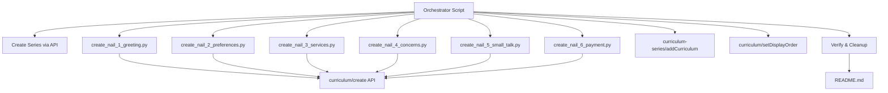

# Design Document: Nail Professional Speaking Curriculum

## Overview

This design covers the creation of a vi-en speaking-focus curriculum series for Vietnamese nail professionals learning to communicate with English-speaking customers. The series follows the established speaking-focus pattern (4 sessions, 15 vocab words, `introAudio → viewFlashcards → reading → readAlong → speakReading`) but is adapted for nail salon customer interactions.

Each curriculum focuses on a specific nail salon interaction scenario. Reading passages are first-person mini-speeches (2–4 sentences) that the nail technician would actually say to a customer. The learner speaks as "I" throughout — no dialogue, no third-person narration.

The series will be a new curriculum series (separate from the existing `ui33faux` speaking-focus series) since it targets a specific professional audience with domain-specific vocabulary.

### Design Decisions

1. **New series (not added to `ui33faux`)**: The existing series covers general topics (trail running, salmon cooking). Nail professional content is a distinct audience and domain, warranting its own series for discoverability and organization.

2. **6 curriculums covering the full salon interaction arc**: Greeting → Preferences → Services → Concerns → Small Talk → Payment. This progression mirrors a real appointment from start to finish, building fluency in the order a technician would actually need it.

3. **Speaking-focus activity pattern only**: No `speakFlashcards`, `vocabLevel*`, `writingSentence`, or `writingParagraph` activities. The speaking-focus pattern is intentionally minimal: `introAudio → viewFlashcards → reading → readAlong → speakReading`.

## Architecture



### Execution Flow

1. **Orchestrator** creates the series via `curriculum-series/create`
2. **Each curriculum script** is run individually — creates one curriculum via `curriculum/create` with `language: "en"`, `userLanguage: "vi"` as top-level body params
3. **Orchestrator** adds each curriculum to the series via `curriculum-series/addCurriculum` and sets display order via `curriculum/setDisplayOrder`
4. **Verification**: Query DB to confirm all curriculums exist, are in the series, have correct display orders
5. **Cleanup**: Delete all `.py` scripts, leave only `README.md`

## Components and Interfaces

### Component 1: Curriculum Creation Scripts (6 scripts)

Each script (`create_nail_1_greeting.py` through `create_nail_6_payment.py`) is a standalone Python file that:

- Imports `firebase_token.get_firebase_id_token` via `sys.path` manipulation
- Defines `W1`, `W2`, `W3` word groups (5 words each) and `ALL_WORDS`
- Builds the full `content` JSON dict with all hand-written text
- Calls `POST https://helloapi.step.is/curriculum/create` with:
  ```python
  {
      "firebaseIdToken": token,
      "language": "en",
      "userLanguage": "vi",
      "content": json.dumps(content)
  }
  ```
- Prints the created curriculum ID

### Component 2: Orchestrator Script (`orchestrate_nail_series.py`)

Handles series-level operations:

```python
# 1. Create series
POST /curriculum-series/create
body: { firebaseIdToken, title, description }

# 2. For each curriculum ID:
POST /curriculum-series/addCurriculum
body: { firebaseIdToken, curriculumSeriesId, curriculumId }

POST /curriculum/setDisplayOrder
body: { firebaseIdToken, id: curriculumId, displayOrder: N }
```

### Component 3: Validation Script (`validate_nail_curriculum.py`)

A reusable validation function that checks curriculum content JSON against all structural requirements:

```python
def validate_curriculum(content: dict) -> list[str]:
    """Returns list of validation errors. Empty list = valid."""
```

Checks: session count, activity order, vocab counts, reading sentence counts, first-person usage, vocab presence in readings, activity metadata format, strip-keys absence, contentTypeTags.

### Interface: helloapi REST API

All endpoints are POST to `https://helloapi.step.is`. Authentication via `firebaseIdToken` in JSON body.

| Endpoint | Purpose | Key Params |
|---|---|---|
| `curriculum/create` | Create curriculum | `language`, `userLanguage`, `content` (top-level) |
| `curriculum-series/create` | Create series | `title`, `description` |
| `curriculum-series/addCurriculum` | Add to series | `curriculumSeriesId`, `curriculumId` |
| `curriculum/setDisplayOrder` | Set position | `id`, `displayOrder` |

## Data Models

### Curriculum Content JSON Structure

```json
{
  "title": "Chào Khách và Hỏi Ý",
  "contentTypeTags": [],
  "description": "ALL-CAPS HEADLINE...\n\nParagraph 2...\n\n...",
  "preview": {
    "text": "~150 word preview with all 15 vocab words..."
  },
  "learningSessions": [
    {
      "title": "Phần 1",
      "activities": [
        {
          "activityType": "introAudio",
          "title": "Giới thiệu từ vựng phần 1",
          "description": "Brief summary",
          "data": { "text": "Vietnamese teaching script..." }
        },
        {
          "activityType": "viewFlashcards",
          "title": "Flashcards: Chào khách",
          "description": "Học 5 từ: welcome, appointment, prefer, seat, ready",
          "data": { "vocabList": ["welcome", "appointment", "prefer", "seat", "ready"] }
        },
        {
          "activityType": "reading",
          "title": "Đọc: Chào khách",
          "description": "First ~80 chars of reading text",
          "data": { "text": "I welcome you... (2-4 sentence mini-speech)" }
        },
        {
          "activityType": "readAlong",
          "title": "Nghe: Chào khách",
          "description": "Nghe đoạn văn vừa đọc và theo dõi.",
          "data": { "text": "Same text as reading" }
        },
        {
          "activityType": "speakReading",
          "title": "Đọc: Chào khách",
          "description": "First ~80 chars of reading text",
          "data": { "text": "Same text as reading" }
        }
      ]
    }
  ]
}
```

### Session Activity Pattern

| Session | Activities | Vocab Count |
|---|---|---|
| Phần 1 | introAudio → viewFlashcards(5) → reading → readAlong → speakReading | 5 (W1) |
| Phần 2 | introAudio → viewFlashcards(5) → reading → readAlong → speakReading | 5 (W2) |
| Phần 3 | introAudio → viewFlashcards(5) → reading → readAlong → speakReading | 5 (W3) |
| Ôn tập | introAudio → viewFlashcards(15) → reading → readAlong → speakReading | 15 (ALL) |

### Curriculum Topics and Vocab Plan

| # | Display Order | Title | Scenario | Tone | Farewell Tone |
|---|---|---|---|---|---|
| 1 | 1 | Chào Khách và Hỏi Ý | Greeting walk-ins, asking what they want | vivid_scenario | warm accountability |
| 2 | 2 | Tư Vấn Kiểu Móng | Asking about nail preferences and styles | empathetic_observation | introspective guide |
| 3 | 3 | Giới Thiệu Dịch Vụ | Describing services, explaining options | bold_declaration | team-building energy |
| 4 | 4 | Xử Lý Phàn Nàn | Handling customer concerns and complaints | provocative_question | quiet awe |
| 5 | 5 | Trò Chuyện Nhẹ | Making small talk during appointments | surprising_fact | practical momentum |
| 6 | 6 | Thanh Toán và Tiễn Khách | Processing payment and saying goodbye | metaphor_led | warm accountability |

### Vocabulary Allocation (90 unique words across 6 curriculums)

**Curriculum 1 — Chào Khách và Hỏi Ý:**
- W1: welcome, appointment, walk-in, prefer, seat
- W2: schedule, available, wait, ready, check
- W3: service, today, choose, help, enjoy

**Curriculum 2 — Tư Vấn Kiểu Móng:**
- W1: shape, oval, square, round, length
- W2: color, shade, match, natural, bold
- W3: design, simple, pattern, glitter, tip

**Curriculum 3 — Giới Thiệu Dịch Vụ:**
- W1: gel, polish, manicure, pedicure, acrylic
- W2: soak, trim, file, buff, cuticle
- W3: coat, dry, cure, last, protect

**Curriculum 4 — Xử Lý Phàn Nàn:**
- W1: sorry, fix, redo, adjust, concern
- W2: chip, crack, uneven, thick, thin
- W3: careful, gentle, comfortable, satisfy, promise

**Curriculum 5 — Trò Chuyện Nhẹ:**
- W1: weather, weekend, plan, family, vacation
- W2: busy, relax, favorite, movie, music
- W3: nice, beautiful, love, try, recommend

**Curriculum 6 — Thanh Toán và Tiễn Khách:**
- W1: total, cash, card, change, receipt
- W2: tip, discount, price, charge, pay
- W3: thank, visit, return, next, care


## Correctness Properties

*A property is a characteristic or behavior that should hold true across all valid executions of a system — essentially, a formal statement about what the system should do. Properties serve as the bridge between human-readable specifications and machine-verifiable correctness guarantees.*

The validation script (`validate_nail_curriculum.py`) implements these properties as deterministic checks against the curriculum content JSON. Since the content is hand-written JSON (not generated from random inputs), these properties are validated as structural assertions run once per curriculum after creation — not as randomized property-based tests. The input space is finite (6 curriculums), so exhaustive checking is more appropriate than PBT.

### Property 1: Session structure invariant

*For any* curriculum in the series, it SHALL have exactly 4 sessions. Sessions 1–3 SHALL each contain activities in the exact order: `introAudio`, `viewFlashcards`, `reading`, `readAlong`, `speakReading`. Session 4 SHALL follow the same activity order with `viewFlashcards` containing all 15 words.

**Validates: Requirements 1.1, 1.3, 1.4, 1.5, 1.6, 14.2**

### Property 2: Vocabulary distribution

*For any* curriculum, sessions 1–3 SHALL each have exactly 5 vocabulary words in their `viewFlashcards` activity, and session 4's `viewFlashcards` SHALL contain all 15 words (the union of sessions 1–3). All 15 words SHALL be unique within the curriculum.

**Validates: Requirements 1.2, 1.6**

### Property 3: Reading passage constraints

*For any* reading passage in sessions 1–3, it SHALL be 2–4 sentences, use first-person "I" as subject, and contain all 5 vocabulary words for that session. *For any* session 4 reading passage, it SHALL be 6–12 sentences and contain all 15 vocabulary words.

**Validates: Requirements 2.1, 2.2, 2.4, 2.5**

### Property 4: Vocabulary format

*For any* `vocabList` in any activity across all curriculums, every entry SHALL be a lowercase string.

**Validates: Requirements 3.4**

### Property 5: Cross-curriculum vocabulary uniqueness

*For any* pair of curriculums in the series, their vocabulary word sets SHALL be disjoint — no word appears in more than one curriculum.

**Validates: Requirements 3.5, 14.3**

### Property 6: Activity schema compliance

*For any* activity in any session, it SHALL have `activityType` (never `type`), `title` (non-empty string), `description` (non-empty string), and a `data` object. `viewFlashcards` SHALL use `vocabList` (never `words`). `reading`, `speakReading`, `readAlong`, and `introAudio` SHALL have `data.text` as a non-empty string.

**Validates: Requirements 7.1, 7.7, 7.8, 7.9, 7.10, 7.11**

### Property 7: Activity title format conventions

*For any* `viewFlashcards` activity, its title SHALL start with "Flashcards:". *For any* `reading` or `speakReading` activity, its title SHALL start with "Đọc:". *For any* `readAlong` activity, its title SHALL start with "Nghe:" and its description SHALL be exactly "Nghe đoạn văn vừa đọc và theo dõi." *For any* session, it SHALL have a non-empty `title`.

**Validates: Requirements 7.2, 7.3, 7.4, 7.6**

### Property 8: Top-level content structure

*For any* curriculum content JSON, it SHALL have a non-empty `title`, non-empty `description`, a `preview` object with non-empty `text`, `contentTypeTags` equal to `[]`, and `learningSessions` with exactly 4 elements.

**Validates: Requirements 8.1, 8.2, 8.3, 8.4, 8.5**

### Property 9: Strip-keys compliance

*For any* curriculum content JSON, none of the following keys SHALL appear anywhere in the structure: `mp3Url`, `illustrationSet`, `chapterBookmarks`, `segments`, `whiteboardItems`, `userReadingId`, `lessonUniqueId`, `curriculumTags`, `taskId`, `imageId`.

**Validates: Requirements 9.1**

### Property 10: Language pair consistency

*For any* curriculum in the series, the API call SHALL use `language: "en"` and `userLanguage: "vi"` as top-level body parameters.

**Validates: Requirements 10.3, 11.1, 14.4**

### Property 11: introAudio vocabulary coverage

*For any* introAudio in sessions 1–3, the script text SHALL contain all 5 vocabulary words for that session. *For any* session 4 introAudio (review), the script text SHALL contain all 15 vocabulary words.

**Validates: Requirements 6.1, 6.2**

## Error Handling

### API Call Failures

- Each creation script wraps the API call in try/except and prints the response status + body on failure
- The orchestrator script checks each step's response before proceeding to the next
- If `curriculum/create` fails, the script exits with the error — no partial state to clean up
- If `curriculum-series/addCurriculum` fails, the curriculum still exists but isn't in the series — the orchestrator logs this for manual resolution

### Duplicate Prevention

After creation, run duplicate check:
```sql
SELECT id, content->>'title' as title, created_at
FROM curriculum
WHERE content->>'title' = '<title>'
  AND uid = 'zs5AMpVfqkcfDf8CJ9qrXdH58d73'
ORDER BY created_at;
```
Keep earliest, delete extras. Remove duplicate series entries before deleting curriculum.

### Validation Failures

The validation script runs against each curriculum's content JSON before upload. If any property fails, the script prints the specific violation and exits — no upload occurs until all properties pass.

## Testing Strategy

### Validation Script (Primary)

Since this is hand-written content uploaded via API (not a software library with random inputs), property-based testing with randomized inputs is not applicable. Instead, a deterministic validation script checks all 11 correctness properties against each curriculum's content JSON.

The validation script (`validate_nail_curriculum.py`) is run:
1. **Pre-upload**: Against the content dict in each creation script before the API call
2. **Post-upload**: Against content retrieved via `curriculum/getOne` to confirm round-trip integrity

### Validation Checks Implemented

The script implements all properties as assertions:
- Session count and activity order (Property 1)
- Vocab distribution: 5/5/5/15 (Property 2)
- Reading passage sentence count and first-person check (Property 3)
- Vocab format: all lowercase strings (Property 4)
- Cross-curriculum vocab uniqueness (Property 5) — checked by orchestrator across all 6 curriculums
- Activity schema: activityType, title, description, data object (Property 6)
- Title format conventions (Property 7)
- Top-level structure: title, description, preview, contentTypeTags (Property 8)
- Strip-keys absence (Property 9)
- introAudio vocab coverage (Property 11)

### Manual Verification

After all curriculums are created and added to the series:
```sql
-- Verify all curriculums in the series
SELECT csi.curriculum_id, c.content->>'title' as title, c.display_order, c.is_public
FROM curriculum_series_items csi
JOIN curriculum c ON c.id = csi.curriculum_id
WHERE csi.curriculum_series_id = '<series_id>'
ORDER BY c.display_order;

-- Verify no duplicates
SELECT content->>'title' as title, count(*)
FROM curriculum
WHERE uid = 'zs5AMpVfqkcfDf8CJ9qrXdH58d73'
  AND content->>'title' IN ('Chào Khách và Hỏi Ý', 'Tư Vấn Kiểu Móng', 'Giới Thiệu Dịch Vụ', 'Xử Lý Phàn Nàn', 'Trò Chuyện Nhẹ', 'Thanh Toán và Tiễn Khách')
GROUP BY content->>'title'
HAVING count(*) > 1;
```

### Post-Creation Cleanup Checklist

1. ✅ All 6 curriculums exist in DB with correct content
2. ✅ All 6 are in the series with sequential display orders
3. ✅ No duplicate curriculums
4. ✅ All curriculums are `is_public: false`
5. ✅ Series description is under 255 characters
6. ✅ README.md created with full documentation
7. ✅ All `.py` scripts deleted from the folder
