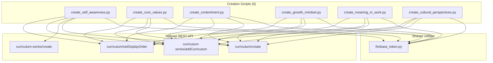

# Design Document: Ordinary Life Philosophy Curriculum

## Overview

This design covers the creation of 6 vi-en curriculums exploring the philosophy of ordinary life, inspired by the Vietnamese social media trend "Nếu cả cuộc đời này không rực rỡ thì sao?" The series targets Vietnamese office workers at intermediate English level. Core framing: accurate self-awareness → identify core values → grow from there. NOT about accepting mediocrity.

The system is a set of standalone Python scripts that construct curriculum JSON payloads and POST them to the helloapi REST API. There is no application framework, build system, or test suite — each script is self-contained, run once, verified, then deleted.

### Curriculum Topics

| # | Vietnamese Title | English Topic | Key Sources |
|---|---|---|---|
| 1 | Tự Nhận Thức | Self-Awareness vs. Self-Deception | Kahneman, Tasha Eurich, Johari Window |
| 2 | Giá Trị Cốt Lõi | Core Values vs. External Expectations | Brené Brown, ACT, Vietnamese filial piety |
| 3 | Hài Lòng vs. Tự Mãn | Contentment vs. Complacency | Stoicism, Buddhist santuṭṭhi, hedonic adaptation |
| 4 | Tư Duy Phát Triển Trung Thực | Growth Mindset + Honest Self-Assessment | Dweck (nuanced), Kristin Neff, hansei (反省) |
| 5 | Ý Nghĩa Trong Công Việc | Finding Meaning in Work | Frankl, Wrzesniewski job crafting, ikigai |
| 6 | Góc Nhìn Văn Hóa | Cultural Perspectives on Success | Hofstede, collectivism vs. individualism |

### Key Design Decisions

1. **One script per curriculum** — 6 Python files, each with all text hand-written inline. No shared templates or text generation functions.
2. **Series (not collection)** — All 6 curriculums grouped into a single series. No collection created — series is the organizing unit per requirements.
3. **Separate series creation** — The first script to run also creates the series. Subsequent scripts add their curriculum to the existing series.
4. **4 sessions per curriculum** — Sessions 1-3 teach 6 words each (12 activities). Session 4 reviews all 18 words (9 activities). Total: 45 activities per curriculum.
5. **contentTypeTags: []** — These are concept curriculums, not podcast/movie/music/story.
6. **Private by default** — No setPublic calls. Content generation (audio, illustrations) happens after creation.

### Execution Order

```
1. Create script for Curriculum 1 (Self-Awareness) → run → collect ID → create series → add to series
2. Create script for Curriculum 2 (Core Values) → run → collect ID → add to series
3. Create script for Curriculum 3 (Contentment) → run → collect ID → add to series
4. Create script for Curriculum 4 (Growth Mindset) → run → collect ID → add to series
5. Create script for Curriculum 5 (Meaning in Work) → run → collect ID → add to series
6. Create script for Curriculum 6 (Cultural Perspectives) → run → collect ID → add to series
7. Set display orders 0-5 on all 6 curriculums
8. Verify all 6 curriculums + series in DB
9. Duplicate check
10. Delete all scripts, write README
```

## Architecture



### Folder Structure

```
ordinary-life-philosophy-curriculum/
├── create_self_awareness.py
├── create_core_values.py
├── create_contentment.py
├── create_growth_mindset.py
├── create_meaning_in_work.py
├── create_cultural_perspectives.py
└── README.md              ← created after all scripts succeed; scripts deleted
```

## Components and Interfaces

### Component 1: Curriculum Creation Script

Each of the 6 creation scripts follows an identical structure:

```python
def build_content() -> dict:
    """Constructs the full curriculum JSON content.
    All text is hand-written inline — no templates, no f-strings for learner text.
    Returns a dict ready to be JSON-serialized."""

def validate(content: dict) -> None:
    """Validates structural invariants before upload:
    - Exactly 18 unique vocab words across 3 groups of 6
    - Exactly 4 sessions with activity counts [12, 12, 12, 9]
    - Correct activity type sequence per session
    - vocabList on all vocab activities (lowercase strings)
    - Session 1-3 vocabList: 6 words; Session 4 vocabList: 18 words
    - viewFlashcards/speakFlashcards vocabList match within each session
    - title and description on every activity and session
    - data field (object) on every activity
    - activityType field (never 'type')
    - No strip keys present anywhere in content
    - contentTypeTags == []
    - introAudio vocab teaching scripts within 500-800 word range
    Raises AssertionError with descriptive message on failure."""

def strip_keys(obj) -> dict:
    """Recursively removes auto-generated platform keys from a dict/list.
    Keys: mp3Url, illustrationSet, chapterBookmarks, segments,
    whiteboardItems, userReadingId, lessonUniqueId, curriculumTags,
    taskId, imageId, practiceMinutes, practiceTime, difficultyTags, skillFocusTags"""

def create() -> str:
    """Builds content, validates, calls curriculum/create API.
    Returns the created curriculum ID.
    Prints the ID and duplicate-check SQL query."""
```

The first script (create_self_awareness.py) additionally handles series creation:

```python
def create_series(token: str) -> str:
    """POST curriculum-series/create with Vietnamese title and description.
    Returns series ID."""

def add_to_series(token: str, series_id: str, curriculum_id: str, display_order: int):
    """POST curriculum-series/addCurriculum then curriculum/setDisplayOrder."""
```

Subsequent scripts receive the series ID as a command-line argument or hardcoded constant (set after first script runs).

### Component 2: Shared Auth (firebase_token.py)

Existing utility. Each script imports it via `sys.path` manipulation:

```python
import sys
sys.path.insert(0, "/home/ubuntu/nspaceresearch/design-curriculums")
from firebase_token import get_firebase_id_token

UID = "zs5AMpVfqkcfDf8CJ9qrXdH58d73"
BASE_URL = "https://helloapi.step.is"
```

### API Call Patterns

**Create curriculum:**
```python
response = requests.post(f"{BASE_URL}/curriculum/create", json={
    "firebaseIdToken": token,
    "language": "en",          # top-level, NOT inside content
    "userLanguage": "vi",      # top-level, NOT inside content
    "content": json.dumps(content)
})
curriculum_id = response.json()["id"]
```

**Create series:**
```python
response = requests.post(f"{BASE_URL}/curriculum-series/create", json={
    "firebaseIdToken": token,
    "title": "Nếu Đời Không Rực Rỡ Thì Sao?",
    "description": "Series description ≤ 255 chars..."
})
series_id = response.json()["id"]
```

**Add curriculum to series:**
```python
requests.post(f"{BASE_URL}/curriculum-series/addCurriculum", json={
    "firebaseIdToken": token,
    "curriculumSeriesId": series_id,
    "curriculumId": curriculum_id
})
```

**Set display order:**
```python
requests.post(f"{BASE_URL}/curriculum/setDisplayOrder", json={
    "firebaseIdToken": token,
    "id": curriculum_id,
    "displayOrder": 0  # 0-5 for the 6 curriculums
})
```

## Data Models

### Curriculum Content JSON Structure

```json
{
  "title": "Tự Nhận Thức: Nhìn Rõ Bản Thân",
  "description": "MULTI-PARAGRAPH PERSUASIVE COPY IN VIETNAMESE...",
  "preview": {
    "text": "~150 word compelling marketing copy in Vietnamese..."
  },
  "contentTypeTags": [],
  "learningSessions": [
    {
      "title": "Phần 1",
      "activities": [...]
    }
  ]
}
```

Notes:
- No `youtubeUrl` — these are concept curriculums
- `contentTypeTags` is always `[]`
- `language` and `userLanguage` are NOT in the content — they are top-level API body params
- User-facing text (title, description, preview, introAudio scripts, writing prompts, activity titles/descriptions) in Vietnamese
- Reading passages and vocabulary target words in English

### Activity Types and Their Data Fields

**introAudio:**
```json
{
  "activityType": "introAudio",
  "title": "Giới thiệu bài học",
  "description": "Giới thiệu chủ đề tự nhận thức và các từ vựng trong phần này.",
  "data": {
    "text": "Full Vietnamese script text (500-800 words for vocab teaching)..."
  }
}
```

**viewFlashcards / speakFlashcards / vocabLevel1 / vocabLevel2:**
```json
{
  "activityType": "viewFlashcards",
  "title": "Flashcards: Nhận thức bản thân",
  "description": "Học 6 từ: introspection, bias, denial, perception, rationalize, authentic",
  "data": {
    "vocabList": ["introspection", "bias", "denial", "perception", "rationalize", "authentic"]
  }
}
```

**reading / speakReading:**
```json
{
  "activityType": "reading",
  "title": "Đọc: Tấm gương méo của nhận thức",
  "description": "First ~80 chars of the reading passage...",
  "data": {
    "text": "Full English reading passage at intermediate level...",
    "vocabList": ["introspection", "bias", "denial", "perception", "rationalize", "authentic"]
  }
}
```

**readAlong:**
```json
{
  "activityType": "readAlong",
  "title": "Nghe: Tấm gương méo của nhận thức",
  "description": "Nghe đoạn văn vừa đọc và theo dõi.",
  "data": {
    "text": "Same text as the reading activity...",
    "vocabList": ["introspection", "bias", "denial", "perception", "rationalize", "authentic"]
  }
}
```

**writingSentence:**
```json
{
  "activityType": "writingSentence",
  "title": "Viết: Sử dụng từ 'introspection'",
  "description": "Viết câu sử dụng từ introspection trong ngữ cảnh công việc.",
  "data": {
    "vocabList": ["introspection"],
    "items": [
      {
        "prompt": "Hãy sử dụng từ 'introspection' trong một câu về việc tự đánh giá bản thân sau buổi họp. Ví dụ: After the meeting, she spent time in quiet introspection, wondering if her reaction had been fair to her colleague.",
        "targetVocab": "introspection"
      }
    ]
  }
}
```

**writingParagraph:**
```json
{
  "activityType": "writingParagraph",
  "title": "Viết: Phản ánh về nhận thức bản thân",
  "description": "Viết đoạn văn về tự nhận thức sử dụng từ vựng trong phần này.",
  "data": {
    "vocabList": ["introspection", "bias", "denial", "perception", "rationalize", "authentic"],
    "instructions": "Viết một đoạn văn (5-7 câu) bằng tiếng Anh...",
    "prompts": [
      "Describe a time when you realized your perception of a situation was influenced by bias.",
      "How can introspection help someone move from denial to authentic self-understanding?"
    ]
  }
}
```

### Session Structure

**Sessions 1-3 (12 activities each — teaches 1 group of 6 words):**

| Index | activityType | Purpose | vocabList |
|-------|-------------|---------|-----------|
| 0 | introAudio | Topic introduction | — |
| 1 | introAudio | Vocabulary teaching (500-800 words) | — |
| 2 | viewFlashcards | Visual vocab review | 6 words |
| 3 | speakFlashcards | Spoken vocab practice | 6 words (same as index 2) |
| 4 | vocabLevel1 | Vocab exercise level 1 | 6 words |
| 5 | vocabLevel2 | Vocab exercise level 2 | 6 words |
| 6 | reading | Reading passage | 6 words |
| 7 | speakReading | Read aloud practice | 6 words |
| 8 | readAlong | Listen and follow | 6 words |
| 9 | writingSentence | Sentence writing #1 | 1 word |
| 10 | writingSentence | Sentence writing #2 | 1 word |
| 11 | writingParagraph | Paragraph writing | 6 words |

**Session 4 (9 activities — review + farewell):**

| Index | activityType | Purpose | vocabList |
|-------|-------------|---------|-----------|
| 0 | introAudio | Review introduction | — |
| 1 | viewFlashcards | All 18 words review | 18 words |
| 2 | speakFlashcards | All 18 words spoken | 18 words |
| 3 | reading | Full article combining all themes | 18 words |
| 4 | speakReading | Read aloud | 18 words |
| 5 | readAlong | Listen and follow | 18 words |
| 6 | writingSentence | Sentence writing | 1 word |
| 7 | writingParagraph | Paragraph writing | 18 words |
| 8 | introAudio | Farewell (reviews 5-6 key words) | — |

### Vocabulary Distribution

Each curriculum has 18 words split into 3 groups:
- Group 1 (words 1-6): Taught in Session 1
- Group 2 (words 7-12): Taught in Session 2
- Group 3 (words 13-18): Taught in Session 3
- Session 4: All 18 words appear; farewell reviews 5-6 key words

### Tone Assignments

**Description tones (6 curriculums):**

| # | Topic | Description Tone |
|---|-------|-----------------|
| 1 | Self-Awareness | provocative_question |
| 2 | Core Values | empathetic_observation |
| 3 | Contentment vs. Complacency | bold_declaration |
| 4 | Growth Mindset | vivid_scenario |
| 5 | Meaning in Work | metaphor_led |
| 6 | Cultural Perspectives | surprising_fact |

Distribution: Each tone used exactly once across 6 descriptions (16.7% each). No adjacent curriculums share a tone. All 6 tones represented.

**Farewell tones (6 curriculums):**

| # | Topic | Farewell Tone |
|---|-------|--------------|
| 1 | Self-Awareness | introspective guide |
| 2 | Core Values | warm accountability |
| 3 | Contentment vs. Complacency | quiet awe |
| 4 | Growth Mindset | practical momentum |
| 5 | Meaning in Work | team-building energy |
| 6 | Cultural Perspectives | introspective guide |

Distribution: 5 tones used, "introspective guide" used twice (curriculums 1 and 6 — not adjacent). No adjacent curriculums share a farewell tone.

### Series Display Order

| displayOrder | Curriculum | Rationale |
|-------------|-----------|-----------|
| 0 | Self-Awareness vs. Self-Deception | Foundation — you can't grow from a place you can't see |
| 1 | Core Values vs. External Expectations | Once you see clearly, identify what matters to YOU |
| 2 | Contentment vs. Complacency | Distinguish healthy satisfaction from stagnation |
| 3 | Growth Mindset + Honest Self-Assessment | Grow from honesty, not toxic positivity |
| 4 | Finding Meaning in Work | Apply clarity to your daily work |
| 5 | Cultural Perspectives on Success | Zoom out — build your own definition |

### Strip Keys List

Keys that must never appear in new curriculum content:
```
mp3Url, illustrationSet, chapterBookmarks, segments, whiteboardItems,
userReadingId, lessonUniqueId, curriculumTags, taskId, imageId,
practiceMinutes, practiceTime, difficultyTags, skillFocusTags
```


## Correctness Properties

*A property is a characteristic or behavior that should hold true across all valid executions of a system — essentially, a formal statement about what the system should do. Properties serve as the bridge between human-readable specifications and machine-verifiable correctness guarantees.*

### Property 1: Vocabulary count and grouping

*For any* curriculum content produced by a creation script, the content shall contain exactly 18 unique vocabulary words distributed across exactly 3 groups of 6 words each (one group per session 1-3), with no word appearing in more than one group.

**Validates: Requirements 1.1, 2.1, 3.1, 4.1, 5.1, 6.1**

### Property 2: Session and activity counts

*For any* curriculum content, there shall be exactly 4 sessions with activity counts [12, 12, 12, 9] respectively.

**Validates: Requirements 1.2, 2.2, 3.2, 4.2, 5.2, 6.2**

### Property 3: Activity type sequences

*For any* curriculum content, sessions 1-3 shall have activityType values in the exact order [introAudio, introAudio, viewFlashcards, speakFlashcards, vocabLevel1, vocabLevel2, reading, speakReading, readAlong, writingSentence, writingSentence, writingParagraph], and session 4 shall have [introAudio, viewFlashcards, speakFlashcards, reading, speakReading, readAlong, writingSentence, writingParagraph, introAudio].

**Validates: Requirements 1.3, 1.4, 2.3, 2.4, 3.3, 3.4, 4.3, 4.4, 5.3, 5.4, 6.3, 6.4**

### Property 4: vocabList compliance

*For any* curriculum content and *for any* activity of type viewFlashcards, speakFlashcards, vocabLevel1, or vocabLevel2: (a) the activity's `data` shall contain a field named `vocabList` (never `words`) with an array of lowercase strings, (b) in sessions 1-3 the vocabList shall contain exactly 6 words matching that session's group, (c) in session 4 the vocabList shall contain all 18 curriculum words, (d) viewFlashcards and speakFlashcards within the same session shall have identical vocabList arrays.

**Validates: Requirements 8.1, 8.2, 8.3, 8.4, 8.5, 8.6**

### Property 5: Activity and session metadata completeness

*For any* curriculum content: (a) every activity shall have non-empty `title` and `description` string fields, (b) every activity shall have an `activityType` field (never `type`), (c) every activity shall have a `data` field that is an object, (d) every session shall have a non-empty `title` string field.

**Validates: Requirements 9.1, 9.7, 9.8, 9.9**

### Property 6: Strip keys absence

*For any* curriculum content, recursively traversing all keys in the entire JSON tree shall find none of the auto-generated platform keys: mp3Url, illustrationSet, chapterBookmarks, segments, whiteboardItems, userReadingId, lessonUniqueId, curriculumTags, taskId, imageId, practiceMinutes, practiceTime, difficultyTags, skillFocusTags.

**Validates: Requirements 11.1**

### Property 7: Vocabulary teaching script word count

*For any* curriculum content, the introAudio activity at index 1 in each of sessions 1-3 (the vocabulary teaching script) shall have a `data.text` field with a word count between 500 and 800 inclusive.

**Validates: Requirements 10.3**

### Property 8: Tone variety distribution

*For any* batch of 6 curriculum descriptions, no single tone from the 6-tone palette shall account for more than 2 descriptions (≤ 30%), and no two adjacent curriculums (by display order) shall share the same description tone. The same adjacency rule applies to farewell introAudio emotional registers.

**Validates: Requirements 10.5, 10.6**

### Property 9: contentTypeTags empty

*For any* curriculum content produced by this spec, the top-level `contentTypeTags` field shall be an empty array `[]`.

**Validates: Requirements 1.5, 2.5, 3.5, 4.5, 5.5, 6.5**

### Property 10: Series structure

*For any* series created by this spec: (a) the series shall contain exactly 6 curriculums, (b) all 6 curriculums shall have `language: "en"` and `user_language: "vi"`, (c) the series description shall be 255 characters or fewer.

**Validates: Requirements 7.2, 7.3, 7.5**

## Error Handling

### API Errors

Each creation script must handle API failures gracefully:

1. **Authentication failure** — If `get_firebase_id_token()` fails, print error and exit. Do not retry (likely a credentials issue).
2. **curriculum/create failure** — Print the full response body. Exit with non-zero status. The script can be re-run safely (duplicates handled by Requirement 14).
3. **curriculum-series/create failure** — Print error and exit. Only the first script creates the series.
4. **curriculum-series/addCurriculum failure** — Print which curriculum failed to add. The add can be retried manually.
5. **curriculum/setDisplayOrder failure** — Print warning but continue. Display order can be fixed manually.

### Validation Errors

The `validate()` function runs before any API call. If validation fails:
- Print a descriptive assertion error (e.g., "Session 2 has 11 activities, expected 12")
- Exit immediately — never upload invalid content
- Developer fixes the content in the script and re-runs

### Duplicate Detection

After successful creation, each script prints a SQL query:
```sql
SELECT id, title, created_at FROM curriculum
WHERE title = '<title>' AND uid = 'zs5AMpVfqkcfDf8CJ9qrXdH58d73'
ORDER BY created_at;
```

If duplicates found: keep earliest, remove from series first if needed, then delete extras.

### Network/Timeout Errors

Scripts use `requests.post()` with default timeout. Network errors cause a traceback — developer investigates and re-runs. No automatic retry logic needed for one-time scripts.

## Testing Strategy

### No Automated Test Suite

This project has no build system, test framework, or CI pipeline. Scripts are standalone Python files run directly. "Testing" means:

1. **Pre-upload validation** — Each script's `validate()` function checks all structural invariants (Properties 1-7, 9) before calling the API. This is the primary correctness mechanism.
2. **Post-creation verification** — SQL queries against the database to confirm curriculums exist with correct structure.
3. **Manual review** — Content quality (persuasive copy, tone, reading passages, Vietnamese text, philosophical framing) is reviewed by the content manager.

### Validation as Property Enforcement

The `validate()` function in each script implements the correctness properties as assertions. Since there's no PBT library (standalone Python scripts with no dependencies beyond `requests` and `firebase-admin`), the properties are enforced deterministically:

```python
def validate(content):
    # Feature: ordinary-life-philosophy-curriculum, Property 1: Vocabulary count and grouping
    all_words = []
    for i in range(3):
        session = content["learningSessions"][i]
        vf = [a for a in session["activities"] if a["activityType"] == "viewFlashcards"][0]
        words = vf["data"]["vocabList"]
        assert len(words) == 6, f"Session {i+1} vocabList has {len(words)} words, expected 6"
        all_words.extend(words)
    assert len(set(all_words)) == 18, f"Expected 18 unique words, got {len(set(all_words))}"

    # Feature: ordinary-life-philosophy-curriculum, Property 2: Session and activity counts
    assert len(content["learningSessions"]) == 4
    expected_counts = [12, 12, 12, 9]
    for i, session in enumerate(content["learningSessions"]):
        actual = len(session["activities"])
        assert actual == expected_counts[i], f"Session {i+1} has {actual} activities, expected {expected_counts[i]}"

    # Feature: ordinary-life-philosophy-curriculum, Property 3: Activity type sequences
    s123_types = ["introAudio", "introAudio", "viewFlashcards", "speakFlashcards",
                  "vocabLevel1", "vocabLevel2", "reading", "speakReading",
                  "readAlong", "writingSentence", "writingSentence", "writingParagraph"]
    s4_types = ["introAudio", "viewFlashcards", "speakFlashcards", "reading",
                "speakReading", "readAlong", "writingSentence", "writingParagraph", "introAudio"]
    for i in range(3):
        actual = [a["activityType"] for a in content["learningSessions"][i]["activities"]]
        assert actual == s123_types, f"Session {i+1} activity types mismatch"
    actual_s4 = [a["activityType"] for a in content["learningSessions"][3]["activities"]]
    assert actual_s4 == s4_types, f"Session 4 activity types mismatch"

    # Feature: ordinary-life-philosophy-curriculum, Property 4: vocabList compliance
    for si, session in enumerate(content["learningSessions"]):
        vf_list = sf_list = None
        for a in session["activities"]:
            if a["activityType"] in ("viewFlashcards", "speakFlashcards", "vocabLevel1", "vocabLevel2"):
                assert "vocabList" in a["data"], f"Missing vocabList on {a['activityType']} in session {si+1}"
                assert "words" not in a["data"], f"Found 'words' key — should be 'vocabList'"
                assert all(isinstance(w, str) and w == w.lower() for w in a["data"]["vocabList"])
                if si < 3:
                    assert len(a["data"]["vocabList"]) == 6
                else:
                    assert len(a["data"]["vocabList"]) == 18
            if a["activityType"] == "viewFlashcards":
                vf_list = a["data"]["vocabList"]
            if a["activityType"] == "speakFlashcards":
                sf_list = a["data"]["vocabList"]
        if vf_list and sf_list:
            assert vf_list == sf_list, f"Session {si+1} viewFlashcards/speakFlashcards vocabList mismatch"

    # Feature: ordinary-life-philosophy-curriculum, Property 5: Activity and session metadata
    for si, session in enumerate(content["learningSessions"]):
        assert "title" in session and session["title"], f"Session {si+1} missing title"
        for ai, a in enumerate(session["activities"]):
            assert "title" in a and a["title"], f"S{si+1} activity {ai} missing title"
            assert "description" in a and a["description"], f"S{si+1} activity {ai} missing description"
            assert "activityType" in a, f"S{si+1} activity {ai} missing activityType"
            assert "type" not in a, f"S{si+1} activity {ai} has 'type' — should be 'activityType'"
            assert "data" in a and isinstance(a["data"], dict), f"S{si+1} activity {ai} missing data object"

    # Feature: ordinary-life-philosophy-curriculum, Property 6: Strip keys absence
    STRIP_KEYS = {"mp3Url", "illustrationSet", "chapterBookmarks", "segments",
                  "whiteboardItems", "userReadingId", "lessonUniqueId", "curriculumTags",
                  "taskId", "imageId", "practiceMinutes", "practiceTime",
                  "difficultyTags", "skillFocusTags"}
    def check_no_strip_keys(obj, path=""):
        if isinstance(obj, dict):
            for k, v in obj.items():
                assert k not in STRIP_KEYS, f"Strip key '{k}' found at {path}.{k}"
                check_no_strip_keys(v, f"{path}.{k}")
        elif isinstance(obj, list):
            for i, item in enumerate(obj):
                check_no_strip_keys(item, f"{path}[{i}]")
    check_no_strip_keys(content)

    # Feature: ordinary-life-philosophy-curriculum, Property 7: Vocab teaching word count
    for i in range(3):
        text = content["learningSessions"][i]["activities"][1]["data"]["text"]
        word_count = len(text.split())
        assert 500 <= word_count <= 800, f"Session {i+1} vocab teaching has {word_count} words, expected 500-800"

    # Feature: ordinary-life-philosophy-curriculum, Property 9: contentTypeTags empty
    assert content.get("contentTypeTags") == [], f"contentTypeTags should be [], got {content.get('contentTypeTags')}"
```

### Cross-Curriculum Verification (Post-Creation)

Properties 8 and 10 span multiple curriculums and are verified after all scripts have run:

- **Property 8 (tone variety):** Verified by checking tone assignment comments in scripts before deletion. The tone table in this design document serves as the source of truth.
- **Property 10 (series structure):** SQL queries to verify series membership count, language homogeneity, and description length.

### Verification SQL Queries

```sql
-- Verify all 6 curriculums exist
SELECT id, content->>'title' as title, language, user_language, is_public, created_at
FROM curriculum
WHERE uid = 'zs5AMpVfqkcfDf8CJ9qrXdH58d73'
  AND content->>'title' IN (
    '<curriculum_1_title>',
    '<curriculum_2_title>',
    '<curriculum_3_title>',
    '<curriculum_4_title>',
    '<curriculum_5_title>',
    '<curriculum_6_title>'
  )
ORDER BY created_at;

-- Verify series membership
SELECT
    cs.id AS series_id,
    cs.title AS series_title,
    csc.curriculum_id,
    c.content->>'title' AS curriculum_title,
    c.language,
    c.user_language,
    c.display_order
FROM curriculum_series cs
JOIN curriculum_series_curriculums csc ON cs.id = csc.curriculum_series_id
JOIN curriculum c ON csc.curriculum_id = c.id
WHERE cs.id = '<series_id>'
ORDER BY c.display_order;

-- Verify language homogeneity
SELECT
    cs.id,
    cs.title,
    array_agg(DISTINCT c.language) AS languages,
    array_agg(DISTINCT c.user_language) AS user_languages
FROM curriculum_series cs
JOIN curriculum_series_curriculums csc ON cs.id = csc.curriculum_series_id
JOIN curriculum c ON csc.curriculum_id = c.id
WHERE cs.id = '<series_id>'
GROUP BY cs.id, cs.title;

-- Verify series description length
SELECT id, title, length(description) as desc_length, description
FROM curriculum_series
WHERE id = '<series_id>';

-- Verify no duplicates
SELECT content->>'title' as title, COUNT(*) as cnt
FROM curriculum
WHERE uid = 'zs5AMpVfqkcfDf8CJ9qrXdH58d73'
GROUP BY content->>'title'
HAVING COUNT(*) > 1;

-- Verify all curriculums are private
SELECT id, content->>'title' as title, is_public
FROM curriculum
WHERE id IN ('<id1>', '<id2>', '<id3>', '<id4>', '<id5>', '<id6>');
```
