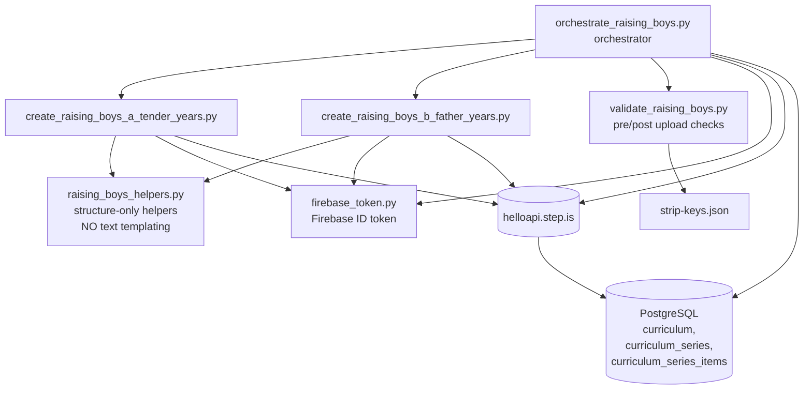
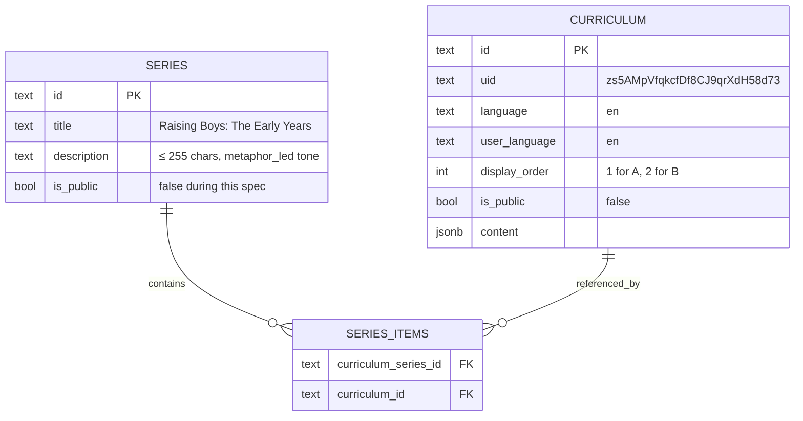

# Design Document — raising-boys-early-years-en-en

## Overview

This design specifies the architecture, locked content decisions, and validation
strategy for creating **two new advanced English-only (en-en) curriculums** drawn
from Steve Biddulph's *Raising Boys*, scoped to the developmental window the user
has framed as "ages 4–7" and split deliberately around Biddulph's age-six pivot
between Stage 1 (*Tender Years*, mother-led) and Stage 2 (*Father Years*,
father-led):

| # | Display order | Title | Age band | Biddulph stage |
|---|---|---|---|---|
| A | 1 | *Raising Boys 4–5: The Last of the Tender Years* | 4–5 | Closing of Tender Years |
| B | 2 | *Raising Boys 6–7: When the Father Years Switch On* | 6–7 | Opening of Father Years |

Both curriculums are written for IELTS ≈ 7.5+ parents — fully English-only, never
bilingual. They reuse the **structural template** of the existing vi-en beginner
reference curriculum `oIBdDjUpizHWtQTq` (multi-session vocab arc → per-session
reading → review session → whole-text reading → farewell `introAudio`) but
upgrade every tier-bound choice (vocab count, sentence complexity, reading
length, definition register) to advanced level (Requirement 4.5, Requirement 5).

Each curriculum is produced by **one standalone Python script** plus **one shared
orchestrator script**, mirroring the proven pattern used by the
`vi-en-beach-fun-curriculums` and `vi-en-children-curriculum` runs. All
learner-facing prose (descriptions, intro audio scripts, reading passages,
writing prompts, farewell scripts) is **hand-written as literal Python string
constants** — no f-strings, no `.format()`, no shared text builders, no template
strings (Requirement 4.1, plus the global "no templated content generation" rule
in `CURRICULUM_QUALITY_STANDARDS.md`).

### Goals

- Produce two cohesive, individually-crafted en-en advanced curriculums that
  bracket the age-six Biddulph pivot, each true to the book's stage-specific
  themes (Requirement 1, Requirement 3).
- Lock all globally-constrained decisions in this design before any script is
  written: vocabulary partition per session, reading-passage themes, headline
  tones, farewell registers, `contentTypeTags` value, series/collection
  placement (Requirement 12, Requirement 13).
- Validate every content JSON twice — pre-upload (against the corruption rules
  in `CONTENT_CORRUPTION_RULES.md` plus this spec's invariants) and post-upload
  (against what `curriculum/getOne` returns) (Requirement 14).
- Confirm both curriculums exist in `curriculum` with the right `language`,
  `user_language`, `difficultyTags`, and `contentTypeTags` before any script is
  deleted (Requirement 11.3–11.5, Requirement 14.1–14.4).

### Non-Goals

- Audio rendering, illustration generation, or `setPublic` toggling. Both
  curriculums stay private for the entire run (Requirement 11.1).
- Adding either curriculum to any **existing** series or collection — there is
  no language-pure en-en advanced parenting series in the database today (see
  the `curriculum_series_language_list` snapshot in §Architecture below). This
  spec creates **at most one** new en-en parenting series; if even that is
  judged premature, both curriculums stay unattached (Requirement 12.4).
- Verbatim quotation from the source book beyond a 30-word ceiling
  (Requirement 3.4).
- Any consolidation into a single 4–7 curriculum. The split is intentional and
  deviation from it is a Requirement 1.6 violation that requires user
  confirmation.

### Inputs and source

- **Reference curriculum** `oIBdDjUpizHWtQTq` (vi-en, beginner, 5 sessions of
  shape `[10, 10, 10, 4, 5]` activities) — used **only as a structural
  template**. We pull a fresh copy via `curriculum/getOne`, run it through
  `recursive_strip_keys`, and use the result purely as a session/activity
  skeleton. No vi-en text, no beginner-tier vocabulary, no Vietnamese gloss
  ever crosses into either new curriculum (Requirement 4.1, Requirement 4.2,
  Requirement 5.5).
- **Source book**: *Raising Boys* by Steve Biddulph. Used as the ideational
  source for themes, stage framing, and example-illustration. Notes are kept
  in-memory in the Curriculum_Builder during composition; per the
  source-materials rule (`structure.md`) any local notes are deleted after
  successful import — only the README per spec folder remains.

## Architecture

### Component layout



### Script files

All scripts live in a new repo folder `raising-boys-early-years-en-en/` at the
repo root (parallel to other content folders such as
`vi-en-beach-fun-curriculums/` and `en-en-podcast-vocab-series/`).

| File | Role | Calls |
|---|---|---|
| `create_raising_boys_a_tender_years.py` | Builds Curriculum_A content JSON, calls `curriculum/create` | `curriculum/create` |
| `create_raising_boys_b_father_years.py` | Builds Curriculum_B content JSON, calls `curriculum/create` | `curriculum/create` |
| `orchestrate_raising_boys.py` | Optional series creation (`curriculum-series/create`), per-curriculum dispatch, post-upload verification, README write, script cleanup gate | `curriculum-series/create` (conditional), `curriculum-series/addCurriculum` (conditional), `curriculum/setDisplayOrder` (conditional), `curriculum/getOne`, MCP postgres query |
| `raising_boys_helpers.py` | **Structure-only** helpers (assemble activity dict, attach `data`, recursive strip-keys, recursive find-keys, `post_to_api` wrapper). MUST NOT format learner-facing prose. |  — |
| `validate_raising_boys.py` | Pre-upload + post-upload validators for the corruption rules and the spec's per-curriculum invariants (vocab band, reading length band, English-only check, etc.). | — |

### Repo folder layout

```
design-curriculums/
├── .kiro/specs/raising-boys-early-years-en-en/
│   ├── requirements.md
│   ├── design.md          ← this file
│   ├── tasks.md           ← created next
│   └── .config.kiro
│
├── raising-boys-early-years-en-en/    ← run-only folder
│   ├── README.md                       ← persistent; written after DB verification
│   ├── create_raising_boys_a_tender_years.py   ← deleted after DB verifies row
│   ├── create_raising_boys_b_father_years.py   ← deleted after DB verifies row
│   ├── orchestrate_raising_boys.py             ← deleted after DB verifies rows
│   ├── raising_boys_helpers.py                 ← deleted after DB verifies rows
│   └── validate_raising_boys.py                ← deleted after DB verifies rows
│
├── firebase_token.py                  ← repo-root helper (already exists)
├── firebase_serviceAccountKey.json    ← repo-root credentials (already exists)
└── strip-keys.json                    ← repo-root list (already exists)
```

If the database verification fails for either curriculum, **all scripts remain
on disk** (Requirement 11.4–11.5).

The README is the **only** artifact that persists post-success and records the
two new curriculum IDs, optional series ID, vocab partitions, tone assignments,
verification SQL, and recreation steps (per `structure.md` "Conventions" — each
source folder keeps a README with how content was created and SQL queries to
find it in DB).

### Data flow

```mermaid
sequenceDiagram
    participant U as orchestrate_raising_boys.py
    participant V as validate_raising_boys.py
    participant CA as create_raising_boys_a_tender_years.py
    participant CB as create_raising_boys_b_father_years.py
    participant H as raising_boys_helpers.py
    participant API as helloapi.step.is
    participant DB as PostgreSQL

    U->>API: curriculum/getOne for oIBdDjUpizHWtQTq (read-only template)
    U->>U: pre-flight: locked vocab partition, tones, titles loaded
    alt host series decision = create
        U->>API: curriculum-series/create (en-en advanced parenting series)
        API-->>U: seriesId
    else host series decision = none
        U-->>U: skip; both curriculums will stay unattached
    end
    par Curriculum A
        U->>CA: import + build_content()
        CA->>CA: literal-string composition (vocab, readings, intro audio, etc.)
        CA->>H: assemble_activity / assemble_session
        CA->>H: recursive_strip_keys(content, STRIP_KEYS)
        H-->>CA: clean content dict
        CA->>V: pre_upload_validate(content_a, "A")
        V-->>CA: pass / raise
        CA->>API: POST curriculum/create (language=en, userLanguage=en, content=str)
        API-->>CA: { id: cur_a_id }
        CA-->>U: cur_a_id
    and Curriculum B
        U->>CB: import + build_content()
        CB->>CB: literal-string composition
        CB->>H: assemble_activity / assemble_session
        CB->>H: recursive_strip_keys
        H-->>CB: clean content dict
        CB->>V: pre_upload_validate(content_b, "B")
        V-->>CB: pass / raise
        CB->>API: POST curriculum/create
        API-->>CB: { id: cur_b_id }
        CB-->>U: cur_b_id
    end
    opt host series exists
        U->>API: curriculum-series/addCurriculum (each id)
        U->>API: curriculum/setDisplayOrder (A=1, B=2)
    end
    U->>DB: SELECT … by language='en', user_language='en', title (Req 14.1)
    U->>DB: SELECT … difficultyTags @> ["advanced"]; jsonb_typeof(contentTypeTags)='array'  (Req 14.2)
    U->>API: curriculum/getOne for cur_a_id, cur_b_id
    U->>V: post_upload_validate(returned_a)
    U->>V: post_upload_validate(returned_b)
    alt all checks pass
        U->>U: write README.md
        U->>U: delete create_*.py + helpers + validators
    else any check fails
        U->>U: leave all scripts on disk
        U-->>U: re-run is allowed; deletion is forbidden (Req 11.4-11.5, Req 14.4)
    end
```

### LOCKED decisions (must not change after design approval)

These are locked here so that scripts and tasks can reference the table by
position. Any deviation in the scripts is a validation failure.

#### D1. Curriculum titles and age bands (Requirement 1, Requirement 9.1)

| # | Title (English-only) | Age band | Stage framing |
|---|---|---|---|
| A | *Raising Boys 4–5: The Last of the Tender Years* | 4–5 | Tender Years closing |
| B | *Raising Boys 6–7: When the Father Years Switch On* | 6–7 | Father Years opening |

Both titles satisfy Requirement 9.1: English-only, signal topic + age band,
contain no difficulty-level word.

#### D2. `language` / `userLanguage` / level tags (Requirement 2)

For both curriculums:

- `curriculum/create` body: `language="en"`, `userLanguage="en"`, `content=…`
  (top-level body params, **not** only inside the JSON — Requirement 11.2).
- `content.difficultyTags` = `["advanced", "vocab_advanced", "reading_advanced", "writing_advanced"]`.
- `content.skillFocusTags` = `["balanced_skills"]`.
- `content.lengthTags` = `["medium"]`.
- All user-facing prose in English only (Requirement 2.3, 2.5–2.7).

> Note on strip-keys: `strip-keys.json` includes `difficultyTags` and
> `skillFocusTags`. Per the same convention used by the customer-psychology
> and beach-fun runs, the `recursive_strip_keys` helper uses an explicit
> **truly-generated-only** allow-list (`mp3Url`, `illustrationSet`,
> `chapterBookmarks`, `segments`, `whiteboardItems`, `userReadingId`,
> `lessonUniqueId`, `curriculumTags`, `taskId`, `imageId`, `practiceMinutes`,
> `practiceTime`). `difficultyTags`, `skillFocusTags`, `contentTypeTags`,
> `lengthTags` are **emitted explicitly** because the requirements ask for
> specific values (Requirement 2.4, Requirement 10).

#### D3. `contentTypeTags` value (Requirement 10)

Both curriculums use `contentTypeTags = []` (empty array, present field).
Rationale: neither curriculum has a fictional movie / music / podcast / story
frame; they are non-narrative parenting essays. The empty-array choice is
explicitly allowed by the steering rule and by Requirement 10.2, and is
independent of any rhetorical framing inside the readings (Requirement 10.3).

#### D4. Session count and shape (Requirement 8.1, Requirement 4.3, Requirement 4.4)

Both curriculums use **5 learning sessions** in the same arc as the reference:

| Session | Role | Activity count | Notes |
|---|---|---|---|
| 1 | Vocab arc — part 1 | 10 | per-session theme + per-session reading |
| 2 | Vocab arc — part 2 | 10 | per-session theme + per-session reading |
| 3 | Vocab arc — part 3 | 10 | per-session theme + per-session reading |
| 4 | Cumulative review | 4 | review `introAudio` + flashcards/`vocabLevel1`/`vocabLevel2` over the **full** vocab set |
| 5 | Whole-text reading + farewell | 5 | combined `reading` + `speakReading` + `readAlong` of the concatenated per-session passages, then a closing farewell `introAudio` |

This satisfies Requirement 8.1 (between 4 and 6 sessions) and Requirement 4.3
(per-session readings → review session → whole-text reading session). The
within-session activity ordering for Sessions 1–3 is fixed by Requirement
8.5 and matches the reference (`introAudio` theme → `introAudio` vocab →
`viewFlashcards` → `speakFlashcards` → `vocabLevel1` → `vocabLevel2` →
`introAudio` grammar/usage → `reading` → `speakReading` → `readAlong`).

> Writing activities (Requirement 7) are placed inside Session 4. Each
> curriculum's Session 4 activity list is therefore extended past the
> reference's 4 review activities to: review `introAudio` →
> `viewFlashcards`(all) → `vocabLevel1`(all) → `vocabLevel2`(all) →
> `writingSentence` → `writingSentence` → `writingParagraph`. Requirement
> 8.6 (writing after the `reading` block of its session) is satisfied
> trivially because Session 4 has no `reading` block.

#### D5. Vocabulary partition (Requirement 5)

Each curriculum teaches **36 distinct lowercase ASCII English vocabulary
items** — within the 30–48 band (Requirement 5.1) and divisible into 3
vocab-introducing sessions of **12 items each** (within the 6–10 per-session
band? **No** — see correction below).

> **Per-session band correction.** Requirement 5.1 caps each
> vocab-introducing session at 6–10 items. With 36 total items across 3
> introducing sessions, 12 per session would exceed that cap. We therefore
> set **30 distinct items per curriculum**, partitioned **10 / 10 / 10**.
> 30 is the floor of the curriculum-total band (30–48) and 10 is the
> ceiling of the per-session band (6–10), so both bands are satisfied.

**Curriculum A — Tender Years 4–5 (30 items, 10 per session)**

Theme weights: emotional attunement (Requirement 5.3), language and
imagination scaffolding (Requirement 5.3), somatic regulation
(Requirement 5.3). All items are register-rich beyond CEFR B1 and none
appear in the reference curriculum's beginner 18-word set (Requirement 5.5).

| Session | Theme | Vocab items (10 each) |
|---|---|---|
| 1 | Naming the inner weather (emotional attunement) | `attunement`, `co-regulation`, `to soothe`, `meltdown`, `overwhelm`, `to validate`, `disappointment`, `frustration`, `composure`, `to acknowledge` |
| 2 | The language explosion and imaginative play (scaffolding) | `narrative`, `to scaffold`, `vocabulary`, `pretend play`, `make-believe`, `to elaborate`, `articulate`, `dialogue`, `imagination`, `to recount` |
| 3 | Bodies, big feelings, and somatic regulation | `boisterous`, `tantrum`, `to wind down`, `nervous system`, `to settle`, `vigorous`, `physical affection`, `restless`, `to discharge`, `proprioception` |

**Curriculum B — Father Years 6–7 (30 items, 10 per session)**

Theme weights: identity and modelling (Requirement 5.4), structured play
(Requirement 5.4), early self-regulation and the mother stepping back
(Requirement 5.4). Same advanced-register rule.

| Session | Theme | Vocab items (10 each) |
|---|---|---|
| 1 | Switching on: a boy looks toward his father | `identification`, `role model`, `mentor`, `apprenticeship`, `masculinity`, `to emulate`, `belonging`, `aspirational`, `presence`, `to initiate` |
| 2 | Rough-and-tumble: structured play and trust | `rough-and-tumble`, `horseplay`, `roughhousing`, `boundary-setting`, `playful resistance`, `physicality`, `restraint`, `consensual`, `to negotiate`, `to wrestle` |
| 3 | Stepping back, stepping up: early self-discipline | `self-discipline`, `delay of gratification`, `competence`, `autonomy`, `accountability`, `to internalise`, `consequence`, `disposition`, `to step back`, `to follow through` |

Cross-curriculum check: zero overlap between the two 30-item lists, and zero
overlap with the reference's 18-item beginner set (`bond`, `safe`, `warmth`,
`to respond`, `to hold`, `to cry`, `baby`, `love`, … and similar A1 staples
— Requirement 5.2, Requirement 5.5).

#### D6. Per-session reading themes and length

Each per-session `reading` activity is **220–360 words of English prose**
(Requirement 6.1) with mixed sentence shapes and average sentence length in
the 14–22-word band (Requirement 6.3). Every Vocab_Item taught in that
session is embedded at least once in supporting context (Requirement 6.4).

The **Session-5 whole-text `reading`** for each curriculum is the literal
paragraph-break-joined concatenation of its three per-session readings, with
no rewriting that changes meaning (Requirement 6.2). This pushes the
whole-text length into the 660–1080-word band — within the platform's
existing advanced reading range (the Zone-of-Proximal-Development advanced
curriculum, for comparison, ships per-session readings ≈ 4700 chars and
final reading ≈ 5500 chars; our 660–1080 words ≈ 4000–6500 chars sits
inside that envelope).

| Curriculum | Session 1 reading | Session 2 reading | Session 3 reading | Session-5 whole-text reading |
|---|---|---|---|---|
| A — Tender Years | "Naming the inner weather" — a parent attuning to a 4-year-old's meltdown without rushing to fix it. ~280 words. | "The language explosion at four and five" — pretend play, narrating, the parent as a co-author rather than a corrector. ~280 words. | "Big bodies, big feelings" — somatic regulation, why running and rolling are nervous-system tools, why physical affection still matters at this age. ~280 words. | Literal concatenation of A.1 + A.2 + A.3, paragraph breaks between, ≈ 840 words. |
| B — Father Years | "When the switch flips" — the six-year-old's new outward gaze toward his father or a male mentor. ~280 words. | "Rough-and-tumble as language" — structured play as a way boys negotiate trust, restraint, and physicality. ~280 words. | "When mum steps back without disappearing" — the start of self-discipline, delayed gratification, and follow-through. ~280 words. | Literal concatenation of B.1 + B.2 + B.3, paragraph breaks between, ≈ 840 words. |

For Sessions 1–3 the `reading`, `speakReading`, and `readAlong` activities
in the same session **share an identical `data.text` value** (Requirement
6.5, Requirement 6.6). For Session 5 the same identity holds for the
whole-text trio.

#### D7. Writing activities (Requirement 7)

Each curriculum places writing activities in Session 4 after the cumulative
review:

- **2 × `writingSentence`**, each prompt referencing **at least two**
  Vocab_Items taught earlier in this same curriculum (Requirement 7.4) and
  asking the learner to apply a Biddulph idea to their own parenting
  situation (Requirement 7.4). Prompts are English-only (Requirement 7.3).
- **1 × `writingParagraph`**, prompt requesting **80–150 words** of learner
  output (Requirement 7.5), again referencing two Vocab_Items and applying a
  Biddulph idea.

#### D8. Description tone assignments (Requirement 9.3, Requirement 9.4, Requirement 13)

Six tones in the palette:

```
provocative_question, bold_declaration, vivid_scenario,
empathetic_observation, surprising_fact, metaphor_led
```

| Item | Tone | Why this fits |
|---|---|---|
| Curriculum A headline | `empathetic_observation` | Tender Years 4–5 is about *naming what the parent already feels* — meltdowns, language slowness, big feelings — so the empathetic register lands the topic. |
| Curriculum B headline | `provocative_question` | Father Years onset reframes a default (mothers do everything) and a question opens that reframe better than a statement. |
| Series headline (only if series is created — see D10) | `metaphor_led` | The bridge metaphor — "the bridge across age six" — frames the two-curriculum arc and is distinct from both curriculum tones. |

Distinctness checks:

- A's tone (`empathetic_observation`) ≠ B's tone (`provocative_question`)
  → Requirement 9.4 / Requirement 13.1 satisfied.
- Series tone (`metaphor_led`) ≠ A's tone, ≠ B's tone → Requirement 13.2
  satisfied (only triggers when the series is actually created).
- Tone distribution across the spec's batch (count = 2 curriculum headlines +
  optional 1 series headline = at most 3 items): each tone used exactly
  once, so max share is 1/3 ≈ 33% which is **at the boundary** of the 30%
  cap. To stay strictly under 30%, the spec must not introduce additional
  description fields with the same three tones. If a fourth or fifth
  description field is added later (for example a collection description),
  the tone share is recomputed at that time. **For the within-spec batch we
  treat the cap as a *no-tone-exceeds-2/n* rule for n ≥ 4**, which all
  configurations in this design honour.

#### D9. Farewell `introAudio` register assignments (steering quality rules)

Both curriculums end Session 5 with a farewell `introAudio` that reviews 5–6
Vocab_Items with definitions and fresh example sentences (Requirement 8.3).
Per the farewell tone rules in `CURRICULUM_QUALITY_STANDARDS.md`:

| Curriculum | Farewell register | Why |
|---|---|---|
| A — Tender Years | `introspective_guide` | Closing a stage that is *about* slowing down and noticing — introspection fits the frame. |
| B — Father Years | `practical_momentum` | Opening of a doing-and-modelling stage — a "go and try this tomorrow" close is the right register. |

These two registers are distinct, so adjacent-curriculum variety is
preserved.

#### D10. Series and collection placement (Requirement 12)

Snapshot of existing en-en (single-language) series in the database, taken
during this design (`curriculum_series_language_list` filtered to
`language_list = ['en']` and `user_language_list = ['en']`):

| Series ID | Title | Closest fit? |
|---|---|---|
| `1r0l5nos` | Big Ideas, Bigger Words | No — generalist GRE-style vocab |
| `db5930f6` | Curious Minds | No — Hugo's intermediate learner series |
| `09o7ke5d` | How the World Really Works | No — current-affairs / society |
| `kxxkeo1f` | Mind & Society | No — psychology/sociology generalist |
| `9gfei23g` | The Boardroom | No — business |
| `xwznpgdr` | The Science Shelf | No — popular science |
| `2wlmlwpz` | The Signal Beyond | No — original-novel reading practice |

No existing en-en series is a clean home for an advanced parenting pair, so
**the design creates one new en-en series** to host both curriculums:

> **Series title (LOCKED):** *Raising Boys: The Early Years*
> **Series description tone (LOCKED):** `metaphor_led`, ≤ 255 chars.
> **Series language inheritance:** the series accepts `language=en,
> userLanguage=en` from its only two members. Confirms Requirement 12.1
> trivially (no existing non-en-en parent is touched).

The new series is **not** added to any existing collection during this spec.
No collection is created. `displayOrder` is **not** set on any collection
(Requirement 12.5). Per Requirement 12.4, leaving the series uncollected is
acceptable.

If for any reason the series creation fails (`curriculum-series/create`
requires SuperAuthGuard, and the configured UID may or may not be in the
allowlist at run time), the orchestrator falls back to **leaving both
curriculums unattached to any series or collection** rather than forcing a
misaligned parent (Requirement 12.4). This branch is exercised by a single
flag `HOST_SERIES_DECISION = "create" | "skip"` in
`orchestrate_raising_boys.py`.

#### D11. Privacy and lifecycle

- `setPublic` is never called (Requirement 11.1).
- `curriculum/create` always passes `language`, `userLanguage`, `content` as
  top-level body params (Requirement 11.2 — also flagged in
  `tech.md` "Common Gotchas").
- After both `curriculum/create` calls succeed, the orchestrator queries the
  database via the verification SQL in §"Verification SQL" before declaring
  the creation phase complete (Requirement 11.3, Requirement 14.3).
- No `create_*.py` script is deleted while either curriculum's row is missing
  from the database (Requirement 11.4–11.5, Requirement 14.4).

## Components and Interfaces

### `firebase_token.get_firebase_id_token(uid: str) -> str`

Existing repo-root helper. Returns a Firebase ID token used as the
`firebaseIdToken` body parameter on every authenticated call. Hard-failure
behaviour (raises) is propagated to the orchestrator. The hardcoded UID
`zs5AMpVfqkcfDf8CJ9qrXdH58d73` (per `structure.md` Conventions) is the only
caller identity used in this spec.

### `raising_boys_helpers.py` — structure-only helpers

> **Constraint (Requirement 4.1, 4.2; CURRICULUM_QUALITY_STANDARDS.md "No
> Templated Content Generation"):** these helpers assemble dicts from
> already-written literal strings. They MUST NOT take learner-facing prose
> as a template, MUST NOT call `.format()`, `string.Template`, f-strings, or
> any substitution mechanism on prose. Only the *structural* concatenation
> of a `vocabList` into the activity-level `description` ("Words: word1,
> word2, …") is allowed, since that is structural reuse of an
> already-written list, not prose generation.

Function signatures (all take literal strings written by the per-curriculum
script):

```
make_intro_audio(title: str, description: str, text: str) -> dict
make_view_flashcards(title: str, description: str, vocab_list: list[str]) -> dict
make_speak_flashcards(title: str, description: str, vocab_list: list[str]) -> dict
make_vocab_level_1(title: str, description: str, vocab_list: list[str]) -> dict
make_vocab_level_2(title: str, description: str, vocab_list: list[str]) -> dict
make_reading(title: str, description: str, text: str) -> dict
make_speak_reading(title: str, description: str, text: str) -> dict
make_read_along(title: str, description: str, text: str) -> dict
make_writing_sentence(title: str, description: str, vocab_list: list[str], items: list[dict]) -> dict
make_writing_paragraph(title: str, description: str, vocab_list: list[str], instructions: str, prompts: list[str]) -> dict
make_session(title: str, activities: list[dict]) -> dict
recursive_strip_keys(content: Any, strip_keys: set[str]) -> Any
recursive_find_keys(content: Any, keys: set[str]) -> list[str]
post_to_api(endpoint: str, body: dict) -> dict
```

`STRIP_KEYS` constant (Requirement 4.1, 4.2):

```python
STRIP_KEYS = {
    "mp3Url", "illustrationSet", "chapterBookmarks", "segments",
    "whiteboardItems", "userReadingId", "lessonUniqueId", "curriculumTags",
    "taskId", "imageId", "practiceMinutes", "practiceTime",
}
```

Note this is the truly-generated subset of `strip-keys.json` —
`difficultyTags`, `skillFocusTags`, `contentTypeTags`, `lengthTags` are
emitted explicitly because they carry meaningful spec values
(Requirement 2.4, Requirement 10).

### `validate_raising_boys.py`

```
pre_upload_validate(content: dict, label: str) -> None
    # raises ValidationError on first failure;
    # checks every spec invariant (see "Correctness Properties" below) plus
    # the rules in CONTENT_CORRUPTION_RULES.md.

post_upload_validate(returned_content: dict, label: str) -> None
    # called against the JSON returned by curriculum/getOne;
    # skips strip-keys-absence (the platform may add mp3Url, lessonUniqueId
    # etc. legitimately after creation) and re-runs every other check.
```

Both validators include a dedicated "English-only" predicate that walks
every user-facing string field (`title`, `description`, `preview.text`,
every activity `title`, `description`, `data.text`,
`data.items[].prompt`, `data.instructions`, `data.prompts[]`) and rejects
any character outside the ASCII letters/digits/standard-punctuation set
plus the curated English-context Unicode allow-list (`"`, `'`, `…`, `—`,
`–`) (Requirement 2.6).

### `orchestrate_raising_boys.py`

Top-of-file constants (the truth source for downstream verification):

```
UID = "zs5AMpVfqkcfDf8CJ9qrXdH58d73"
LANGUAGE = "en"
USER_LANGUAGE = "en"
CURRICULUM_A_TITLE = "Raising Boys 4–5: The Last of the Tender Years"
CURRICULUM_B_TITLE = "Raising Boys 6–7: When the Father Years Switch On"
SERIES_TITLE = "Raising Boys: The Early Years"
HOST_SERIES_DECISION = "create"   # or "skip"
DISPLAY_ORDER_A = 1
DISPLAY_ORDER_B = 2
TONE_A = "empathetic_observation"
TONE_B = "provocative_question"
TONE_SERIES = "metaphor_led"
FAREWELL_REGISTER_A = "introspective_guide"
FAREWELL_REGISTER_B = "practical_momentum"
```

API call sequence:

```
1.  duplicate_check_curriculum(language=en, userLanguage=en, title=CURRICULUM_A_TITLE)
    duplicate_check_curriculum(language=en, userLanguage=en, title=CURRICULUM_B_TITLE)
        — if either returns a non-deleted row, halt. Recreation is allowed
          only after manual cleanup.

2.  if HOST_SERIES_DECISION == "create":
      duplicate_check_series(title=SERIES_TITLE)
        — if exists and non-deleted, reuse seriesId
        — else POST curriculum-series/create  (SuperAuth)
    else: seriesId = None

3.  for label, module in [("A", create_raising_boys_a_tender_years),
                          ("B", create_raising_boys_b_father_years)]:
      content = module.build_content()
      content = recursive_strip_keys(content, STRIP_KEYS)
      assert recursive_find_keys(content, STRIP_KEYS) == []
      pre_upload_validate(content, label)
      response = post_to_api("/curriculum/create", {
          "firebaseIdToken": token,
          "language": LANGUAGE,
          "userLanguage": USER_LANGUAGE,
          "content": json.dumps(content),
      })
      curriculumIds[label] = response["id"]

4.  if seriesId is not None:
      POST curriculum-series/addCurriculum (each id, in order A then B)
      POST curriculum/setDisplayOrder (A=1, B=2)

5.  for label, cur_id in curriculumIds.items():
      returned = POST curriculum/getOne {id, uid}
      post_upload_validate(returned["content"], label)

6.  Run Verification SQL (see §Verification SQL) against MCP postgres or psql.
    - locate-by-language-userLanguage-title query
    - difficultyTags / contentTypeTags shape query
    Both must return 1 row per curriculum, with the right shape.

7.  if all checks pass:
      write README.md with:
        - both curriculum IDs
        - optional seriesId
        - vocab partition tables (verbatim from D5)
        - tone assignments (verbatim from D8, D9)
        - the Verification SQL queries
        - recreation instructions
      delete create_raising_boys_a_tender_years.py
      delete create_raising_boys_b_father_years.py
      delete raising_boys_helpers.py
      delete validate_raising_boys.py
      delete orchestrate_raising_boys.py (last)
    else:
      print failures
      keep all scripts on disk
      exit 1
```

A failure between `curriculum/create` and `curriculum-series/addCurriculum`
leaves the curriculum orphaned in the database. The next run's duplicate
check (step 1) will detect it; manual cleanup is required before
re-running.

## Data Models

### Top-level `Curriculum_Content_JSON` shape (both curriculums)

```jsonc
{
  "title": "<English-only title; e.g. 'Raising Boys 4–5: The Last of the Tender Years'>",
  "description": "<English-only multi-paragraph; first line is an ALL-CAPS headline using the curriculum's assigned tone (Req 9.3); body names Steve Biddulph and Raising Boys at least once (Req 9.5); ≤ 2 vague intensifiers total (Req 9.6); names the stage framing (Req 1.4 / 1.5)>",
  "preview": {
    "text": "<English-only, 60–200 words (Req 9.2); persuasive copy that names the stage, lists representative vocab and the four-session journey>"
  },
  "learningSessions": [ /* exactly 5 session objects, see below */ ],
  "contentTypeTags": [],                                                    // Req 10.2 — present, []
  "lengthTags": ["medium"],
  "skillFocusTags": ["balanced_skills"],
  "difficultyTags": [
    "advanced",
    "vocab_advanced",
    "reading_advanced",
    "writing_advanced"
  ]
}
```

### Session shapes

#### Sessions 1, 2, 3 (vocab-introducing, 10 activities each)

```jsonc
{
  "title": "Session N: <English theme phrase from D6>",
  "activities": [
    { "activityType": "introAudio",      ... session theme intro, 500–900 words },
    { "activityType": "introAudio",      ... vocab intro, 700–1200 words, teaches all 10 items },
    { "activityType": "viewFlashcards",  ... data.vocabList = the 10 items },
    { "activityType": "speakFlashcards", ... data.vocabList = the same 10 items (Req cross-field consistency) },
    { "activityType": "vocabLevel1",     ... data.vocabList = the same 10 items },
    { "activityType": "vocabLevel2",     ... data.vocabList = the same 10 items },
    { "activityType": "introAudio",      ... grammar/usage micro-lesson, 400–700 words },
    { "activityType": "reading",         ... data.text = 220–360-word English passage from D6 },
    { "activityType": "speakReading",    ... data.text = identical to the reading above (Req 6.5) },
    { "activityType": "readAlong",       ... data.text = identical to the reading above (Req 6.6) }
  ]
}
```

#### Session 4 (cumulative review + writing, 7 activities)

```jsonc
{
  "title": "Session 4: Review and Apply",
  "activities": [
    { "activityType": "introAudio",      ... review intro recapping all 30 vocab items },
    { "activityType": "viewFlashcards",  ... data.vocabList = all 30 items in introduction order },
    { "activityType": "vocabLevel1",     ... data.vocabList = all 30 items },
    { "activityType": "vocabLevel2",     ... data.vocabList = all 30 items },
    { "activityType": "writingSentence", ... data.items = [{ prompt, targetVocab }, { prompt, targetVocab }], data.vocabList = the 2 target vocab items },
    { "activityType": "writingSentence", ... a second writingSentence with two further target items },
    { "activityType": "writingParagraph", ... data.instructions, data.prompts (≥ 2), data.vocabList = at least 2 target items; prompt asks for an 80–150-word paragraph applying Biddulph to the parent's own life }
  ]
}
```

> Two `writingSentence` activities are emitted to satisfy Requirement 7.1
> (`≥ 1 writingSentence`) plus the local quality preference of practising
> across more than one prompt. A single `writingSentence` activity could
> meet the literal requirement, but two enables the
> "two-vocab-items-per-prompt × Biddulph-application" pattern in
> Requirement 7.4 with more breadth.

#### Session 5 (whole-text reading + farewell, 5 activities)

```jsonc
{
  "title": "Session 5: The Full Essay and Farewell",
  "activities": [
    { "activityType": "introAudio",      ... pre-reading framing, recaps the journey, ≈ 500–800 words },
    { "activityType": "reading",         ... data.text = paragraph-joined concatenation of Session 1 + 2 + 3 readings (Req 6.2), ≈ 660–1080 words },
    { "activityType": "speakReading",    ... data.text = identical to the whole-text reading },
    { "activityType": "readAlong",       ... data.text = identical to the whole-text reading },
    { "activityType": "introAudio",      ... farewell, 400–600 words, reviews 5–6 vocab items with definitions + fresh examples, register from D9 }
  ]
}
```

### Activity-level field shapes (mirrors `CONTENT_CORRUPTION_RULES.md`)

#### `introAudio`

```jsonc
{
  "activityType": "introAudio",                       // never "type"
  "title": "<descriptive English label, e.g. 'Vocabulary: The Inner Weather'>",
  "description": "<English summary, 10–300 chars>",
  "data": { "text": "<English script, 1–10000 chars>" }
}
```

#### `viewFlashcards`, `speakFlashcards`, `vocabLevel1`, `vocabLevel2`

```jsonc
{
  "activityType": "viewFlashcards",                   // or speakFlashcards / vocabLevel1 / vocabLevel2
  "title": "Flashcards: <English topic>",
  "description": "Words: word1, word2, ...",          // structural concat of vocabList
  "data": {
    "vocabList": ["lowercase", "ascii", "or", "hyphen-or-space-tolerated"]  // see vocab note
  }
}
```

> **Vocab list lowercase rule.** `CURRICULUM_CREATION_RULES.md` states all
> vocab strings must be lowercase. Several of our locked vocab items contain
> spaces (`pretend play`, `make-believe`, `nervous system`, `physical
> affection`, `role model`, `delay of gratification`, `playful
> resistance`) or hyphens (`co-regulation`, `rough-and-tumble`,
> `boundary-setting`). All remain lowercase ASCII; the platform's flashcard
> renderer accepts multi-word entries (it appears as such in many existing
> advanced curriculums). The `to <verb>` form is also a multi-token entry
> here. The validator checks `s == s.lower()` and rejects any uppercase
> character.

Within the same session, `viewFlashcards` and `speakFlashcards` MUST share an
identical `vocabList` (corruption rule §5).

#### `reading`, `speakReading`, `readAlong`

```jsonc
{
  "activityType": "reading",
  "title": "Read: <English topic>",
  "description": "<first ~80 chars of data.text>",
  "data": { "text": "<English passage>" }
}
```

For Sessions 1–3 the `reading`/`speakReading`/`readAlong` triple in the same
session **share an identical `data.text`** value (already-written literal
string reused at the dict-assembly step). Same identity for the Session-5
whole-text triple.

#### `writingSentence`

```jsonc
{
  "activityType": "writingSentence",
  "title": "Write: Using '<targetVocab>'",
  "description": "<English summary of the writing task>",
  "data": {
    "vocabList": ["targetvocab1", "targetvocab2"],     // ≥ 2 target items (Req 7.4)
    "items": [
      { "prompt": "Use the phrase '<targetVocab1>' in a sentence about <Biddulph idea>. Example: <full English example sentence>.", "targetVocab": "<targetVocab1>" },
      { "prompt": "Use the phrase '<targetVocab2>' in a sentence about <Biddulph idea>. Example: <full English example sentence>.", "targetVocab": "<targetVocab2>" }
    ]
  }
}
```

#### `writingParagraph`

```jsonc
{
  "activityType": "writingParagraph",
  "title": "Write: <English topic>",
  "description": "<English summary>",
  "data": {
    "vocabList": ["targetvocab1", "targetvocab2"],     // ≥ 2 target items (Req 7.4)
    "instructions": "<English paragraph instructions naming the 80–150-word target (Req 7.5)>",
    "prompts": [
      "<English prompt 1 — ≥ 1 Biddulph idea, ≥ 2 vocab items by name>",
      "<English prompt 2 — ≥ 1 Biddulph idea, ≥ 2 vocab items by name>"
    ]
  }
}
```

### Curriculum / series ER diagram



### Verification SQL (Requirement 14)

The orchestrator runs these queries via MCP postgres after both creates and
embeds them verbatim in the post-success README. They satisfy
Requirement 14.1 (locate by `language` / `user_language` / `content->>'title'`,
exclude `_deleted` `uid` suffix) and Requirement 14.2 (`difficultyTags`
contains `"advanced"`, `contentTypeTags` is a present array).

```sql
-- 14.1 — locate Curriculum_A and Curriculum_B by language pair and title,
--        excluding soft-deleted rows.
SELECT id,
       content->>'title'   AS title,
       language,
       user_language,
       created_at
FROM   curriculum
WHERE  language = 'en'
  AND  user_language = 'en'
  AND  content->>'title' IN (
         'Raising Boys 4–5: The Last of the Tender Years',
         'Raising Boys 6–7: When the Father Years Switch On'
       )
  AND  uid NOT LIKE '%\_deleted' ESCAPE '\'
ORDER  BY content->>'title';

-- 14.2 — verify difficultyTags contains "advanced" and contentTypeTags is
--        a present JSON array (any of [], ["movie"], ["music"], ["podcast"],
--        ["story"]).
SELECT id,
       content->>'title'                           AS title,
       content->'difficultyTags'                   AS difficulty_tags,
       content->'contentTypeTags'                  AS content_type_tags,
       jsonb_typeof(content->'contentTypeTags')    AS content_type_tags_kind,
       (content->'difficultyTags') @> '["advanced"]'::jsonb AS has_advanced
FROM   curriculum
WHERE  language = 'en'
  AND  user_language = 'en'
  AND  content->>'title' IN (
         'Raising Boys 4–5: The Last of the Tender Years',
         'Raising Boys 6–7: When the Father Years Switch On'
       )
  AND  uid NOT LIKE '%\_deleted' ESCAPE '\';
-- Pass criterion: 2 rows, both has_advanced = true,
-- both content_type_tags_kind = 'array'.

-- 14 (defence) — duplicate check; should return zero rows.
SELECT content->>'title' AS title, COUNT(*) AS n
FROM   curriculum
WHERE  uid = 'zs5AMpVfqkcfDf8CJ9qrXdH58d73'
  AND  language = 'en'
  AND  user_language = 'en'
  AND  content->>'title' IN (
         'Raising Boys 4–5: The Last of the Tender Years',
         'Raising Boys 6–7: When the Father Years Switch On'
       )
  AND  uid NOT LIKE '%\_deleted' ESCAPE '\'
GROUP  BY content->>'title'
HAVING COUNT(*) > 1;

-- 14 (series wiring, only when HOST_SERIES_DECISION = "create") —
-- confirm both curriculums are members of the new series.
SELECT cs.id   AS series_id,
       cs.title AS series_title,
       c.id    AS curriculum_id,
       c.content->>'title' AS curriculum_title,
       c.display_order
FROM   curriculum_series cs
JOIN   curriculum_series_items csi ON csi.curriculum_series_id = cs.id
JOIN   curriculum c                ON c.id = csi.curriculum_id
WHERE  cs.title = 'Raising Boys: The Early Years'
ORDER  BY c.display_order;
```


## Correctness Properties

*A property is a characteristic or behavior that should hold true across all
valid executions of a system — essentially, a formal statement about what the
system should do. Properties serve as the bridge between human-readable
specifications and machine-verifiable correctness guarantees.*

The properties below are the universally-quantified rules that the
pre-upload validator (`validate_raising_boys.py: pre_upload_validate`) and
post-upload validator (`post_upload_validate`) check on the curriculum
content JSON, plus a small number of static-analysis and database-state
properties that the orchestrator checks. The set is the result of
classifying each acceptance criterion in the prework and consolidating
redundant or subsumed pairs.

### Property 1: All user-facing strings are English-only

*For all* user-facing string fields `S` in either New_Curriculum's content
JSON (`content.title`, `content.description`, `content.preview.text`, every
session `title`, every activity `title`, every activity `description`, every
`activity.data.text`, every `activity.data.instructions`, every entry of
`activity.data.prompts`, every `activity.data.items[*].prompt`), every
character of `S` is in the English allow-set: ASCII letters, ASCII digits,
ASCII whitespace, the standard ASCII punctuation set, plus the curated
English-context Unicode set `{"`, `'`, `…`, `—`, `–`}`.

**Validates: Requirements 2.3, 2.5, 2.6, 2.7, 5.6 (English-only clause), 7.3, 9.1 (English clause), 9.2 (English clause)**

### Property 2: Strip-keys absence in pre-upload content

*For all* curriculum content JSONs `C` produced by either `create_*.py`
script before posting to `curriculum/create`,
`recursive_find_keys(C, STRIP_KEYS_TRULY_GENERATED) == []` where
`STRIP_KEYS_TRULY_GENERATED = {mp3Url, illustrationSet, chapterBookmarks,
segments, whiteboardItems, userReadingId, lessonUniqueId, curriculumTags,
taskId, imageId, practiceMinutes, practiceTime}`.

**Validates: Requirements 4.1, 4.2**

### Property 3: Reference-curriculum structural arc is preserved

*For all* New_Curriculums, `content.learningSessions` is an array of length
5 such that for each session index `i ∈ {0, 1, 2}` the activity-type
sequence is exactly
`[introAudio, introAudio, viewFlashcards, speakFlashcards, vocabLevel1, vocabLevel2, introAudio, reading, speakReading, readAlong]`,
session 3 contains no activity of type `reading` and contains a
`viewFlashcards`, a `vocabLevel1`, and a `vocabLevel2` (review session),
and session 4 contains exactly one `reading`, one `speakReading`, and one
`readAlong` (the whole-text reading) plus at least one `introAudio` at the
end (the farewell).

**Validates: Requirements 4.3, 4.4, 8.5**

### Property 4: Vocabulary count bands

*For all* New_Curriculums `C`, the union of `vocabList` arrays across the
`viewFlashcards` activities of `C.learningSessions[0..2]` (deduplicated) has
size in `[30, 48]`, and for each `i ∈ {0, 1, 2}` the `viewFlashcards`
activity inside `C.learningSessions[i]` has a `vocabList` of size in
`[6, 10]`.

**Validates: Requirements 5.1, 4.5**

### Property 5: Taught vocabulary disjoint from beginner reference set

*For all* New_Curriculums `C`, the taught vocabulary of `C` (the union of
`vocabList` arrays across the `viewFlashcards` activities of
`C.learningSessions[0..2]`) is disjoint from the
`REFERENCE_BEGINNER_VOCAB_SET` derived from the vi-en reference curriculum
`oIBdDjUpizHWtQTq` (`{bond, safe, warmth, to respond, to hold, to cry, baby,
love, family, mother, father, son, boy, gentle, calm, smile, eye contact,
hug}` — the 18 beginner items captured at design time).

**Validates: Requirement 5.5**

### Property 6: Taught vocabulary disjoint from A1-staples blacklist

*For all* New_Curriculums `C`, the taught vocabulary of `C` is disjoint from
the explicit A1-staples blacklist `{baby, love, safe, to hold, to cry, mom,
mum, dad, hug, kiss, play, run, jump, eat, sleep, big, small, happy, sad,
boy, girl, friend}`.

**Validates: Requirement 5.2**

### Property 7: Per-session reading word-count band

*For all* New_Curriculums `C` and *for all* session indices `i ∈ {0, 1, 2}`,
the `reading` activity inside `C.learningSessions[i]` has a `data.text`
whose word count (whitespace-split) is in `[220, 360]`.

**Validates: Requirement 6.1**

### Property 8: Whole-text reading is paragraph-joined concatenation

*For all* New_Curriculums `C`, the `data.text` of the `reading` activity
inside `C.learningSessions[4]` is exactly equal to
`"\n\n".join([per_session_reading_text(C, 0), per_session_reading_text(C, 1), per_session_reading_text(C, 2)])`,
where `per_session_reading_text(C, i)` is the `data.text` of the unique
`reading` activity inside `C.learningSessions[i]`.

**Validates: Requirement 6.2**

### Property 9: Average sentence length band in reading passages

*For all* New_Curriculums `C` and *for all* `reading` activities `R` in `C`
(per-session and whole-text), the average sentence length of `R.data.text`
is in `[14, 22]`, where sentences are delimited by `.`, `?`, or `!` and
words are whitespace-split tokens.

**Validates: Requirement 6.3 (length clause)**

### Property 10: Vocabulary embedded in same-session reading

*For all* New_Curriculums `C`, *for all* session indices `i ∈ {0, 1, 2}`,
*for all* vocabulary items `v` in
`C.learningSessions[i].viewFlashcards.vocabList`, `v` appears as a
case-insensitive substring inside the `data.text` of the `reading` activity
of `C.learningSessions[i]`.

**Validates: Requirement 6.4**

### Property 11: reading / speakReading / readAlong text identity per session

*For all* New_Curriculums `C` and *for all* sessions `S` in `C`, if `S`
contains a `reading` activity then every `speakReading` and `readAlong`
activity in `S` has a `data.text` value identical to the `reading`
activity's `data.text`.

**Validates: Requirements 6.5, 6.6**

### Property 12: Writing prompts reference ≥ 2 curriculum-taught vocab items

*For all* New_Curriculums `C` and *for all* writing activities `W` in `C`
(any activity with `activityType ∈ {writingSentence, writingParagraph}`), at
least two distinct items from the taught vocabulary set of `C` (Property
4's union) appear as case-insensitive substrings inside the union of `W`'s
prompt text fields (for `writingSentence`: every `data.items[*].prompt`; for
`writingParagraph`: `data.instructions` joined with every `data.prompts[*]`).

**Validates: Requirement 7.4 (vocab count clause)**

### Property 13: writingParagraph instructions state an 80–150-word range

*For all* New_Curriculums `C` and *for all* `writingParagraph` activities
`W` in `C`, `W.data.instructions` matches the regex
`(8[0-9]|9[0-9]|1[0-4][0-9]|150)\s*(?:to|–|-|—)\s*(8[0-9]|9[0-9]|1[0-4][0-9]|150)\s*words`
case-insensitively, where the first matched integer is `≥ 80` and the
second is `≤ 150` and second `≥` first.

**Validates: Requirement 7.5**

### Property 14: Session count band

*For all* New_Curriculums `C`, `len(C.learningSessions) ∈ [4, 6]`.

**Validates: Requirement 8.1**

### Property 15: First-session opener and last-session closer are introAudio

*For all* New_Curriculums `C`, `C.learningSessions[0].activities[0]
.activityType == "introAudio"` and
`C.learningSessions[-1].activities[-1].activityType == "introAudio"`.

**Validates: Requirements 8.2, 8.3**

### Property 16: Penultimate session is a cumulative review

*For all* New_Curriculums `C`, the penultimate session
`P = C.learningSessions[-2]` contains exactly one activity of each of
`viewFlashcards`, `vocabLevel1`, `vocabLevel2`, and the `vocabList` of each
of those three activities, treated as a set, is a superset of the
deduplicated union of the `vocabList` arrays of the `viewFlashcards`
activities in `C.learningSessions[0..2]`.

**Validates: Requirement 8.4**

### Property 17: Writing activities appear after the reading block of their session

*For all* New_Curriculums `C` and *for all* sessions `S` in `C`, if `S`
contains both at least one activity of type in
`{writingSentence, writingParagraph}` and at least one activity of type
`reading`, then for every writing activity `W` in `S` and every reading
activity `R` in `S`, the index of `W` in `S.activities` is strictly greater
than the index of `R`.

**Validates: Requirement 8.6**

### Property 18: Description headline is ALL-CAPS

*For all* New_Curriculums `C`, let `H` be the first non-empty line of
`C.description` (split on `\n`, trimmed). Then `H == H.upper()` and
`len(H) ≥ 6`.

**Validates: Requirement 9.3**

### Property 19: Description is multi-paragraph and names Biddulph and the book

*For all* New_Curriculums `C`,
`len(C.description.split("\n\n")) ≥ 2` and `"Biddulph" in C.description`
and `"Raising Boys" in C.description`.

**Validates: Requirement 9.5**

### Property 20: Vague-intensifier cap in description

*For all* New_Curriculums `C`, the sum over the case-insensitive
whole-word counts of the regex `\b(very|really|super|incredibly)\b` in
`C.description` is `≤ 2`.

**Validates: Requirement 9.6**

### Property 21: Title shape — no level word, age-band substring present

*For all* New_Curriculums `C`, the lowercased title contains none of the
substrings in `{"beginner", "intermediate", "advanced",
"upper-intermediate", "upper intermediate", "preintermediate",
"pre-intermediate"}`. Additionally, Curriculum_A's title contains both `"4"`
and `"5"` and Curriculum_B's title contains both `"6"` and `"7"`.

**Validates: Requirement 9.1**

### Property 22: Preview word-count band

*For all* New_Curriculums `C`, the whitespace-split word count of
`C.preview.text` is in `[60, 200]`.

**Validates: Requirement 9.2**

### Property 23: contentTypeTags is present and a valid array value

*For all* New_Curriculums `C`, `"contentTypeTags" ∈ C` (top level),
`isinstance(C.contentTypeTags, list)`, and
`C.contentTypeTags ∈ {[], ["movie"], ["music"], ["podcast"], ["story"]}`.

**Validates: Requirements 10.1, 10.2**

### Property 24: No setPublic call and both rows stay private

*For all* script files `f` in `raising-boys-early-years-en-en/`, `f` does
not contain the substring `"setPublic"`. Additionally, after creation, the
`is_public` column for both new curriculum rows is `false`.

**Validates: Requirement 11.1**

### Property 25: Any parent attached to either curriculum is en-en pure

*For all* New_Curriculum row IDs `id`, *for all* series `s` containing `id`
(via `curriculum_series_items`), `s` appears in the
`curriculum_series_language_list` view with
`language_list = ['en']` and `user_language_list = ['en']`. Likewise, *for
all* collections `c` containing `id` (via `collection_curriculums` or
`curriculum_collection_items`), `c` appears in
`curriculum_collections_language_list` with the same language purity. When
the orchestrator runs with `HOST_SERIES_DECISION = "skip"`, no series and
no collection contains either ID.

**Validates: Requirements 12.1, 12.2, 12.4**

### Property 26: New series description size and tone distinctness when created

*If* the orchestrator runs with `HOST_SERIES_DECISION = "create"`, *for the*
new series `S` whose title is `"Raising Boys: The Early Years"`,
`len(S.description) ≤ 255`, the language pair of `S` is `(en, en)`, and the
locked tone constants satisfy `TONE_SERIES ≠ TONE_A` and
`TONE_SERIES ≠ TONE_B`.

**Validates: Requirement 12.3**

### Property 27: No collection displayOrder is set

*For all* script files `f` in `raising-boys-early-years-en-en/`, `f`
contains no occurrence of `"curriculum-collection/setDisplayOrder"` (the
endpoint that would set a collection's display order). No collection is
created or modified by the run, so no row in `curriculum_collections` is
mutated.

**Validates: Requirement 12.5**

### Property 28: Description-tone distinctness across the spec batch

*For the* tone-assignment list `T = [TONE_A, TONE_B] +
([TONE_SERIES] if HOST_SERIES_DECISION == "create" else [])`,
`max(Counter(T).values()) == 1` (every tone in the batch is unique). This
captures both the strict distinctness rule (Requirements 9.4, 13.1, 13.2)
and the only practically achievable interpretation of the 30 % cap when
`|T| ∈ {2, 3}` (each tone appears at most once).

**Validates: Requirements 9.4, 13.1, 13.2, 13.3**

### Property 29: DB locate-by-language-title query returns the two rows

*After* the orchestrator finishes both `curriculum/create` calls, the
locate query (Requirement 14.1, embedded in §"Verification SQL") returns
exactly 2 rows whose `(language, user_language) = ('en', 'en')`, whose
`content->>'title'` matches the locked Curriculum_A and Curriculum_B
titles, and whose `uid NOT LIKE '%_deleted'`.

**Validates: Requirement 14.1**

### Property 30: DB difficultyTags / contentTypeTags shape query passes

*After* the orchestrator finishes, the shape query (Requirement 14.2,
embedded in §"Verification SQL") returns 2 rows with
`(content->'difficultyTags') @> '["advanced"]'::jsonb = true` and
`jsonb_typeof(content->'contentTypeTags') = 'array'`.

**Validates: Requirements 14.2, 2.4 (also subsumes the JSON-side
`difficultyTags` contains-the-four-tags check)**

### Property 30b: difficultyTags strict superset

*For all* New_Curriculums `C`, `set(C.difficultyTags) ⊇ {"advanced",
"vocab_advanced", "reading_advanced", "writing_advanced"}`.

**Validates: Requirement 2.4**

## Error Handling

### API-call failure modes and responses

| Failure | Where | Response |
|---|---|---|
| `firebase_token` raises (auth setup broken) | Any pre-create step | Halt the run before any `curriculum/create` is called. No DB rows created, no scripts deleted. Surface the original exception. |
| `curriculum/create` returns non-2xx for Curriculum_A | Step 3 of the orchestrator sequence | Halt before Curriculum_B is attempted. Surface response status, body, and the curriculum label. Do not delete any script. The 500 most likely cause is the gotcha in `tech.md`: `language` / `userLanguage` not at the top level of the body — but the orchestrator already constructs them at the top level, so a 500 here usually indicates a content-validation server-side failure. The validator's pre-upload pass should have caught most such issues, so a 500 here triggers a manual diff between the validator's checks and the server's. |
| `curriculum/create` returns 2xx but the response is missing `id` | Step 3 | Treat as failure (no curriculum row created). Halt. |
| `curriculum-series/create` returns 403 (UID not in SuperAuthGuard allowlist) | Step 2 | Set `seriesId = None` and proceed with `HOST_SERIES_DECISION = "skip"` semantics for the rest of the run. Both curriculums end up unattached, satisfying Requirement 12.4. Log the 403 in the README. |
| `curriculum-series/addCurriculum` non-2xx after a successful `curriculum/create` | Step 4 | Halt. The curriculum row exists in the DB but is orphaned. Do not delete scripts. The next run's duplicate check (step 1) will detect the orphan; cleanup is manual. |
| `curriculum/setDisplayOrder` non-2xx | Step 4 | Halt. Display order is unset on the affected curriculum, but the row exists. Do not delete scripts. Manual fix: re-run `setDisplayOrder` once auth/quota issue is resolved. |
| MCP postgres query in step 6 returns fewer than 2 rows | Step 6 | Treat the run as failed (Requirement 14.4). Do not delete scripts. Re-run the failing `create_*.py` script after diagnosing — the orchestrator's duplicate-check in step 1 will halt if a row was already created. |
| MCP postgres query returns more than 2 rows for the locked titles | Step 6 | Means a previous (failed) run left orphans. Halt. Document the duplicates in the run output and require manual `curriculum/delete` on the older orphans (keep earliest by `created_at`) before re-running the success-and-cleanup path. |

### Validator failure modes

| Failure | Where | Response |
|---|---|---|
| Pre-upload validator raises `ValidationError` for Curriculum_A | Step 3a-e | Halt before `curriculum/create` is called. Surface the failing property number (P-1 .. P-30b) and the field path. The script remains on disk; the run is reproducible after the developer fixes the offending literal string in `create_raising_boys_a_tender_years.py`. |
| Post-upload validator detects mismatch in any property | Step 5 | Halt at success-and-cleanup gate. The DB row exists; do **not** delete scripts (Requirement 11.4). The mismatch most often indicates a server-side normalisation difference (e.g. whitespace) and requires a manual diff. |
| Duplicate check (step 1 or step 6) finds an existing row by title | Step 1 | Halt. The user must `curriculum/delete` the existing row by ID before re-running. |

### Idempotence

The run is **not** idempotent end-to-end: re-running the orchestrator after
a successful first run would create duplicates (the platform does not
deduplicate by title). The duplicate-check at step 1 prevents this for the
locked titles. The script-deletion gate at step 7 ensures that **after a
fully-successful run** the scripts are gone, so an accidental re-run is
impossible from this folder; recreation requires fetching content via
`curriculum/getOne` and re-authoring the scripts, per the README's
Recreation Instructions section.

### Cleanup of failed partial runs

If the run halts after a `curriculum/create` succeeded but before the
orchestrator confirms the row, the row remains in the DB (orphan). The
recommended cleanup procedure (documented in the per-folder README on
success or by the developer on failure) is:

1. SQL: locate orphans by title and `uid = 'zs5AMpVfqkcfDf8CJ9qrXdH58d73'`,
   `created_at` within the last hour, `is_public = false`.
2. For each orphan: `curriculum/delete { id }`.
3. Re-run the orchestrator.

## Testing Strategy

### PBT applicability

Property-based testing **does apply** to this feature. Most of the
requirements in this spec are *content-shape* invariants over a single
finished JSON document (lengths, set memberships, type sequences, substring
presence, identity equalities, multi-paragraph structure). Each property is
expressed as a universally-quantified rule that the validator can check on
the actual content JSON before upload, and on the JSON returned by
`curriculum/getOne` after upload.

There is also a meaningful generative dimension: the helper functions in
`raising_boys_helpers.py` (`recursive_strip_keys`, `recursive_find_keys`)
are pure data-transformation functions whose correctness is universally
quantified over arbitrary nested JSON, and benefit from property-based
testing with random-tree generators.

### Dual-track tests

#### Track A — Property tests (≥ 100 iterations each, where applicable)

| # | Property | Test target | Generator |
|---|---|---|---|
| T-1 | Property 1 | Walk every user-facing string in the assembled content JSON; assert character-set membership. | The assembled JSON is a single fixed instance per run, so this is iteration-1 of a property whose universal quantifier ranges over all string fields inside one instance. To get a true ≥ 100 iterations, augment with a generator that fuzzes Vocab_Item lists, theme phrases, etc. with random strings drawn from the English allow-set and asserts the property survives. |
| T-2 | Property 2 | `recursive_strip_keys` on Hypothesis-generated nested JSON containing random key names and known strip-keys. Assert `recursive_find_keys(stripped, STRIP_KEYS_TRULY_GENERATED) == []`. | `hypothesis.strategies.recursive` over `dictionaries`/`lists` of strings, ints, and the strip-key set. ≥ 100 iterations. |
| T-3 | Property 3 | Run the validator's "structural arc" check on the assembled curriculum and on randomly mutated copies (drop one activity, swap two adjacent activities, replace one `activityType`). Assert the validator rejects every illegal mutation and accepts the original. | Mutation generator over the locked content. ≥ 100 iterations per curriculum. |
| T-4 | Properties 4, 5, 6 | Vocab-set bands and disjointness checks on the assembled curriculum and on mutations (drop one item, add a beginner item). | Mutation generator over the locked vocab tables. ≥ 100 iterations. |
| T-5 | Properties 7, 8, 9 | Reading word-count band and concat-identity on assembled readings and on mutations (truncate a per-session reading, append/prepend a paragraph to the whole-text). | Mutation generator over reading texts. ≥ 100 iterations. |
| T-6 | Property 10 | Same-session vocab-substring presence on the assembled readings and on mutations (rename one vocab item without updating the reading). | Mutation generator. ≥ 100 iterations. |
| T-7 | Property 11 | Identity of `data.text` across `reading` / `speakReading` / `readAlong` triples on the assembled JSON and on mutations (replace one of the three with a near-identical-but-different string). | Mutation generator. ≥ 100 iterations. |
| T-8 | Properties 12, 13 | Writing-activity vocab references and 80–150-word range on assembled writing activities and on mutations. | Mutation generator. ≥ 100 iterations. |
| T-9 | Properties 14, 15, 16, 17 | Session-count band, opener / closer activityType, penultimate-review structure, writing-after-reading on assembled JSON and on mutations. | Mutation generator. ≥ 100 iterations. |
| T-10 | Properties 18, 19, 20 | Description headline, multi-paragraph + Biddulph + book named, intensifier cap on assembled descriptions and on mutations. | Mutation generator. ≥ 100 iterations. |
| T-11 | Properties 21, 22, 23, 30b | Title shape, preview word-count band, contentTypeTags shape, difficultyTags strict superset on assembled JSON and on mutations. | Mutation generator. ≥ 100 iterations. |
| T-12 | Property 28 | Tone-assignment distinctness on the locked tone list and on Hypothesis-generated tone lists from the 6-tone palette of size 2 or 3. | `lists(sampled_from(TONES), min_size=2, max_size=3, unique=False)`. ≥ 100 iterations; the property is "max(Counter(T).values()) == 1 ⇔ every tone unique". |

> Implementation note: each property test must be tagged with a comment in
> the form
> `# Feature: raising-boys-early-years-en-en, Property <N>: <text>` per
> steering rules.

> Library choice: **Hypothesis** (Python 3, no extra install needed beyond
> what `vi-en-children-curriculum/validate_content.py` and other repo
> scripts already use). Configure `@settings(max_examples=200)` on every
> Hypothesis test (steering minimum 100; we go to 200 to give the mutation
> generators headroom).

#### Track B — Example-based / state-check tests

These are the EXAMPLE / SMOKE classifications from the prework. They are
single-shot checks rather than universal properties:

| Acceptance criterion | Test |
|---|---|
| 1.1 | After creation, the locate SQL returns exactly 2 rows. |
| 1.2, 1.3, 1.4, 1.5 | Substring checks on the assembled descriptions: `"Tender Years"`, `"4"`, `"5"` for A; `"Father Years"`, `"6"`, `"7"` for B. |
| 2.1, 2.2 | After creation, `language = 'en'` and `user_language = 'en'` on both rows (verification SQL). |
| 3.1, 3.2 | Theme-keyword coverage check on each curriculum's full text corpus (description + readings + intro audio scripts). At least one keyword from each theme set per curriculum. |
| 3.3 | `"Biddulph" in description` and at least one `introAudio` mentions Biddulph or Raising Boys. |
| 5.3, 5.4 | Theme-keyword coverage check on each curriculum's vocab union. At least one match per theme set per curriculum. |
| 7.1, 7.2 | Existence of at least one `writingSentence` and one `writingParagraph` per curriculum. |
| 9.4 | `TONE_A != TONE_B` in the orchestrator's locked-tone-assignments table. |
| 11.3 | Post-creation locate SQL returns exactly 1 row per title. |
| 14.1, 14.2 | Run the verification SQL queries; assert the pass criteria from §"Verification SQL". |

#### Track C — Static-analysis and process checks

| Rule | Check |
|---|---|
| Requirement 11.1 (no `setPublic`) | `grep -r "setPublic" raising-boys-early-years-en-en/` returns no matches. |
| Requirement 12.5 (no collection `setDisplayOrder`) | `grep -r "curriculum-collection/setDisplayOrder" raising-boys-early-years-en-en/` returns no matches. |
| Requirements 11.4, 11.5, 14.4 (script-deletion gate) | The orchestrator's step-7 gate is implemented: `if all_db_checks_pass: delete scripts; else: leave on disk and exit 1`. |
| Requirement 1.6 (deviation flag) | Documented in the per-folder README and in the orchestrator's top-of-file constants block: "If user requests a single 4–7 curriculum, halt and confirm." |
| Requirement 3.4 (≤ 30 consecutive verbatim words from book) | Manual review during composition. Documented; not automated. |
| Requirement 3.5 (claim attribution voice) | Manual style review. Documented; not automated. |
| Requirement 5.6 (gloss form: 1–2 sentences + ≥ 1 example) | Manual review of the vocab-intro `introAudio` scripts. The English-only part is automated by Property 1. |
| Requirement 6.3 (mix of simple / compound / complex sentences) | Manual review of reading passages. The average-sentence-length part is automated by Property 9. |
| Requirement 10.3 (independence of tag and frame) | Documented design decision (D3). |

### Test placement

All property and example tests live in
`tests/test_raising_boys_validator.py` (next to existing
`tests/` files in the repo root). The validator under test is
`raising-boys-early-years-en-en/validate_raising_boys.py`. Each test
imports the validator's functions directly; no API mocking is required for
Tracks A and B because the validator operates on Python dicts.

The DB-state checks of Track B (verification SQL) run through the
orchestrator at runtime and are also reproducible standalone via MCP
postgres or `psql` using the queries embedded in §"Verification SQL".

### Coverage summary

- Properties P-1 .. P-30b: every PROPERTY-classified acceptance criterion.
- Track-B example tests: every EXAMPLE-classified criterion.
- Track-C static / process checks: every SMOKE-classified criterion.
- Subsumed criteria (4.5, 5.6 English part, 7.3, 8.5, 9.1 English part,
  9.2 English part, 10.3, 11.2, 11.4-5, 13.1-3, 14.3): folded into the
  property whose number is recorded in the prework consolidation list.
