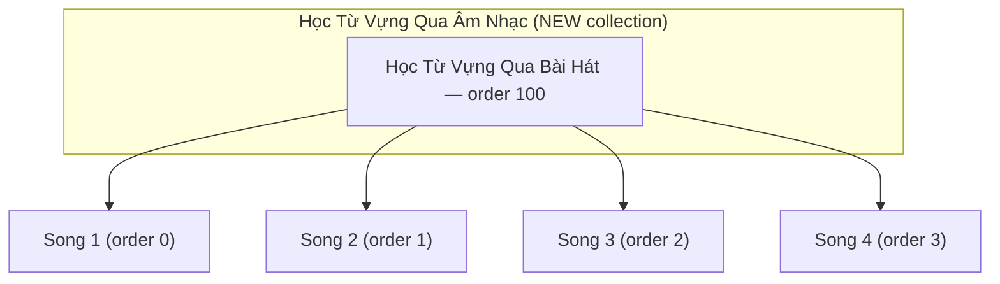
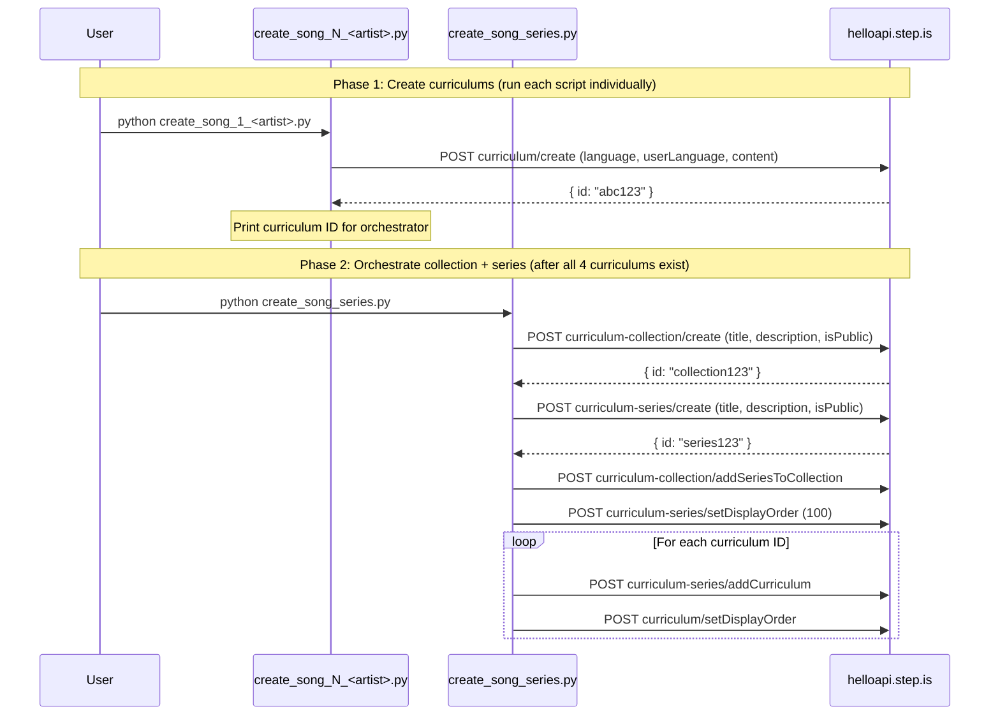

# Design Document: Song-Based Vocab Series

## Overview

This feature creates a brand new collection "Học Từ Vựng Qua Âm Nhạc (Learn Vocabulary Through Music)" and populates it with a single series "Học Từ Vựng Qua Bài Hát (Learn Vocabulary Through Songs)" containing 4 curriculums. Each curriculum is built around a different evergreen English song, using verbatim song lyrics as reading passages instead of authored articles. Songs are selected for A2-B1 level lyrics appropriate for pre-intermediate to intermediate Vietnamese learners of English.

The implementation consists of standalone Python scripts that call the helloapi REST API. Unlike the topic-based expansion (which added series to an existing collection), this feature creates a new top-level collection first, then creates the series and curriculums within it. Each curriculum script contains all hand-written learner-facing text. A single orchestrator script handles both collection creation and series setup.

### Key Design Decisions

1. **New collection via API** — The orchestrator calls `curriculum-collection/create` to create the music collection, then `curriculum-series/create` for the series, then wires them together. This is different from the topic-based expansion which only added series to an existing collection (279d6843).
2. **One script per curriculum** — Same pattern as health-wellness and topic-based series. Each script is ~500-800 lines with all hand-written content.
3. **One orchestrator for collection + series** — A single `create_song_series.py` handles collection creation, series creation, adding curriculums, setting display orders, and wiring the series into the collection. This consolidates what would otherwise be two separate scripts.
4. **Song lyrics as reading passages** — Reading activities use verbatim lyrics sourced via web search. Sessions 1-3 use lyric portions containing that session's vocabulary; Sessions 4-5 use the complete lyrics.
5. **youtubeUrl at top level of content JSON** — Each curriculum's content dict includes a `youtubeUrl` field alongside `title`, `description`, `preview`, and `learningSessions`.
6. **No shared content generation** — All learner-facing text is hand-written per curriculum. Only structural helpers (strip_keys, activity schema) are shared.
7. **Session structure matches health-wellness exactly** — Sessions 1-3 have 12 activities (introAudio ×2, viewFlashcards, speakFlashcards, vocabLevel1-3, introAudio, reading, speakReading, readAlong, writingSentence). Session 4 has 4 activities. Session 5 has 5 activities.

## Architecture



### Execution Flow



## Components and Interfaces

### Folder Structure

```
song-based-vocab-series/
├── create_song_1_<artist>.py       # Curriculum script for song 1
├── create_song_2_<artist>.py       # Curriculum script for song 2
├── create_song_3_<artist>.py       # Curriculum script for song 3
├── create_song_4_<artist>.py       # Curriculum script for song 4
└── create_song_series.py           # Orchestrator (collection + series + wiring)
```

After successful creation and verification, all `.py` scripts are deleted, leaving only `README.md`.

### Curriculum Script Interface

Each `create_song_N_<artist>.py` script:

1. Imports `firebase_token.get_firebase_id_token`
2. Defines `STRIP_KEYS` set and `strip()` function inline
3. Defines vocabulary lists: `W1` (6 words), `W2` (6 words), `W3` (6 words), `ALL` (18 words)
4. Defines reading passages from verbatim song lyrics: `LYRICS_1` (portion for session 1), `LYRICS_2` (portion for session 2), `LYRICS_3` (portion for session 3), `FULL_LYRICS` (complete song lyrics)
5. Builds `content` dict with all hand-written text including `youtubeUrl` at top level
6. Runs `validate(content)` to check structural properties before upload
7. Calls `POST curriculum/create` with `language="en"`, `userLanguage="vi"`, `content=json.dumps(content)`
8. Prints the created curriculum ID

### Orchestrator Script Interface

`create_song_series.py`:

1. Takes 4 curriculum IDs as constants (pasted from curriculum script output)
2. Calls `POST curriculum-collection/create` with title "Học Từ Vựng Qua Âm Nhạc (Learn Vocabulary Through Music)", persuasive Vietnamese description, `isPublic: true`
3. Calls `POST curriculum-series/create` with title "Học Từ Vựng Qua Bài Hát (Learn Vocabulary Through Songs)", Vietnamese description (≤255 chars), `isPublic: true`
4. Calls `POST curriculum-collection/addSeriesToCollection` with the new collection ID and new series ID
5. Calls `POST curriculum-series/setDisplayOrder` with display_order 100 (first series in new collection)
6. For each curriculum: calls `POST curriculum-series/addCurriculum` then `POST curriculum/setDisplayOrder` (0, 1, 2, 3)

### API Calls Used

| Endpoint | Purpose | Auth |
|---|---|---|
| `curriculum/create` | Create each curriculum | AuthGuard |
| `curriculum-collection/create` | Create the new music collection | SuperAuthGuard |
| `curriculum-series/create` | Create the song series | SuperAuthGuard |
| `curriculum-collection/addSeriesToCollection` | Add series to collection | SuperAuthGuard |
| `curriculum-series/setDisplayOrder` | Set series order within collection | SuperAuthGuard |
| `curriculum-series/addCurriculum` | Add curriculum to series | SuperAuthGuard |
| `curriculum/setDisplayOrder` | Set curriculum order within series | SuperAuthGuard |

### Authentication

All scripts use the shared `firebase_token.py` helper:
```python
sys.path.insert(0, "/home/ubuntu/nspaceresearch/design-curriculums")
from firebase_token import get_firebase_id_token
UID = "zs5AMpVfqkcfDf8CJ9qrXdH58d73"
token = get_firebase_id_token(UID)
```

Token is refreshed before each API call that requires SuperAuthGuard.

## Data Models

### Curriculum Content Structure (Song-Adapted)

```python
content = {
    "title": "Học Qua Bài Hát: 'Song Title' – Artist Name",
    "description": "Multi-paragraph persuasive copy in Vietnamese (5-beat structure, song-adapted)",
    "preview": {
        "text": "~150 word vivid marketing copy referencing the song and its themes"
    },
    "youtubeUrl": "https://www.youtube.com/watch?v=XXXXXXXXXXX",
    "learningSessions": [
        # Session 1-3: Learning sessions (6 words each, lyrics as reading)
        {
            "title": "Buổi 1: <lyric theme excerpt>",
            "activities": [
                # introAudio (welcome + song context)
                # introAudio (vocab teaching — how each word appears in the lyrics)
                # viewFlashcards, speakFlashcards
                # vocabLevel1, vocabLevel2, vocabLevel3
                # introAudio (grammar/usage notes from lyrics)
                # reading (verbatim lyrics portion), speakReading, readAlong
                # writingSentence (song-themed prompts)
            ]
        },
        # Session 4: Review (all 18 words)
        {
            "title": "Ôn tập",
            "activities": [
                # introAudio (congratulations + recap of song themes)
                # viewFlashcards (ALL words)
                # vocabLevel1, vocabLevel2
            ]
        },
        # Session 5: Full lyrics reading + farewell
        {
            "title": "Đọc toàn bộ lời bài hát",
            "activities": [
                # introAudio (farewell + word review, 400-600 words)
                # reading (FULL lyrics), speakReading, readAlong
                # introAudio (warm farewell)
            ]
        }
    ]
}
```

### Session Activity Sequences (Exact)

| Session | Activity Order | Count |
|---|---|---|
| 1-3 (learning) | introAudio, introAudio, viewFlashcards, speakFlashcards, vocabLevel1, vocabLevel2, vocabLevel3, introAudio, reading, speakReading, readAlong, writingSentence | 12 |
| 4 (review) | introAudio, viewFlashcards, vocabLevel1, vocabLevel2 | 4 |
| 5 (full reading + farewell) | introAudio, reading, speakReading, readAlong, introAudio | 5 |

### Activity Data Shapes

| Activity Type | Data Fields |
|---|---|
| `introAudio` | `{ text: string, audioSpeed: 0.01 }` |
| `viewFlashcards` | `{ vocabList: string[], audioSpeed: -0.1 }` |
| `speakFlashcards` | `{ vocabList: string[], audioSpeed: -0.1 }` |
| `vocabLevel1/2/3` | `{ vocabList: string[], audioSpeed: -0.1 }` |
| `reading` | `{ text: string, audioSpeed: -0.1 }` |
| `speakReading` | `{ text: string, audioSpeed: -0.1 }` |
| `readAlong` | `{ text: string, audioSpeed: -0.1 }` |
| `writingSentence` | `{ vocabList: string[], audioSpeed: 0.01, items: WritingItem[] }` |

### WritingItem Shape

```python
{
    "targetVocab": "word",
    "prompt": "Sử dụng từ 'word' để nói về [specific context related to the song's themes]. Ví dụ: [full example sentence]."
}
```

### Strip Keys Set

```python
STRIP_KEYS = {
    "mp3Url", "illustrationSet", "chapterBookmarks", "segments",
    "whiteboardItems", "userReadingId", "lessonUniqueId",
    "curriculumTags", "taskId", "imageId"
}
```

### Key Differences from Topic-Based Series

| Aspect | Topic-Based | Song-Based |
|---|---|---|
| Collection | Existing (279d6843) | New (created by orchestrator) |
| Reading passages | Authored articles about the topic | Verbatim song lyrics |
| Content JSON | Standard fields | Adds `youtubeUrl` at top level |
| Orchestrator scope | Series creation + wiring to existing collection | Collection creation + series creation + wiring |
| introAudio context | References article and topic concepts | References song title, artist, and lyrical context |
| Writing prompts | Topic-themed contexts | Song-themed contexts (emotions, narrative, themes) |
| Session 1-3 reading | Article portions per session | Lyric portions (verses/chorus) per session |
| Session 4-5 reading | Full article | Full song lyrics |


## Correctness Properties

*A property is a characteristic or behavior that should hold true across all valid executions of a system — essentially, a formal statement about what the system should do. Properties serve as the bridge between human-readable specifications and machine-verifiable correctness guarantees.*

### Property 1: Curriculum structural completeness

*For any* curriculum content dict, it SHALL contain exactly 18 unique vocabulary words divided into 3 groups of 6 (W1, W2, W3), exactly 5 learning sessions, and the activity type sequences SHALL match: sessions 1-3 = [introAudio, introAudio, viewFlashcards, speakFlashcards, vocabLevel1, vocabLevel2, vocabLevel3, introAudio, reading, speakReading, readAlong, writingSentence] (12 activities), session 4 = [introAudio, viewFlashcards, vocabLevel1, vocabLevel2] (4 activities), session 5 = [introAudio, reading, speakReading, readAlong, introAudio] (5 activities).

**Validates: Requirements 4.1, 4.2, 4.3, 4.4, 4.5**

### Property 2: Language parameters at top level

*For any* curriculum creation API call body, the fields `language` (value `"en"`) and `userLanguage` (value `"vi"`) SHALL be present as top-level body parameters alongside `content`.

**Validates: Requirements 4.6, 4.7, 13.1**

### Property 3: No auto-generated keys in content

*For any* curriculum content dict (recursively traversing all nested dicts and lists), none of the strip keys (`mp3Url`, `illustrationSet`, `chapterBookmarks`, `segments`, `whiteboardItems`, `userReadingId`, `lessonUniqueId`, `curriculumTags`, `taskId`, `imageId`) SHALL appear as keys.

**Validates: Requirements 9.1**

### Property 4: All activities and sessions have title and description

*For any* activity in any session of any curriculum, both `title` and `description` fields SHALL exist and be non-empty strings. *For any* session object, the `title` field SHALL exist and be a non-empty string.

**Validates: Requirements 8.1, 8.7**

### Property 5: Activity title format matches activity type

*For any* activity in any curriculum: if `activityType` is `viewFlashcards`, `speakFlashcards`, `vocabLevel1`, `vocabLevel2`, or `vocabLevel3`, the title SHALL start with `"Flashcards:"`; if `activityType` is `reading` or `speakReading`, the title SHALL contain `"Đọc:"`; if `activityType` is `readAlong`, the title SHALL contain `"Nghe:"`; if `activityType` is `writingSentence`, the title SHALL contain `"Viết:"`.

**Validates: Requirements 8.2, 8.3, 8.4, 8.6**

### Property 6: Writing prompts contain target vocab and example

*For any* writingSentence item in any curriculum, the `prompt` field SHALL contain the `targetVocab` word and SHALL contain the Vietnamese example marker `"Ví dụ:"`.

**Validates: Requirements 7.1**

### Property 7: youtubeUrl present and valid format

*For any* curriculum content dict, a `youtubeUrl` field SHALL exist at the top level (alongside `title`, `description`, `preview`, `learningSessions`) and its value SHALL match the pattern `https://www.youtube.com/watch?v=` or `https://youtu.be/`.

**Validates: Requirements 3.4, 15.1**

### Property 8: Vocabulary words appear in full lyrics

*For any* curriculum, every one of the 18 vocabulary words SHALL appear (case-insensitive) in the `FULL_LYRICS` text used for the complete song reading.

**Validates: Requirements 5.1**

### Property 9: Session lyrics are substrings of full lyrics

*For any* curriculum, the reading text used in sessions 1-3 SHALL each be a non-empty substring of the `FULL_LYRICS` text (allowing for minor whitespace normalization).

**Validates: Requirements 3.2**

### Property 10: Curriculum title contains song title and artist

*For any* curriculum, the `title` field in the content dict SHALL contain both the song title and the artist name as substrings, and SHALL NOT contain difficulty level descriptors (e.g., "Upper-Intermediate", "Advanced", "Beginner").

**Validates: Requirements 3.5, 14.1, 14.2**

### Property 11: Farewell introAudio contains all vocabulary words

*For any* curriculum, the farewell introAudio script in session 5 (the last introAudio activity) SHALL contain all 18 vocabulary words as substrings.

**Validates: Requirements 6.5**

### Property 12: Vocabulary flashcard lists match session word groups

*For any* curriculum, the `vocabList` in viewFlashcards/speakFlashcards/vocabLevel activities in session N (1-3) SHALL equal exactly the Nth word group (W1, W2, W3). In session 4 (review), the `vocabList` SHALL equal all 18 words.

**Validates: Requirements 4.1**

### Property 13: Curriculum display orders within series are sequential

*For any* series containing 4 curriculums, the display orders assigned to those curriculums SHALL be the sequential integers 0, 1, 2, 3.

**Validates: Requirements 10.1**

### Property 14: Series description under 255 characters

*For any* series creation call, the `description` field SHALL be a non-empty string with length ≤ 255 characters.

**Validates: Requirements 1.2**

## Error Handling

### API Call Failures

Each script calls `r.raise_for_status()` after every API call. If any call fails:
- The script prints the HTTP status code and response body
- Execution stops immediately (no partial state cleanup)
- The user must manually check what was created and retry or clean up

### Common Failure Modes

| Failure | Cause | Resolution |
|---|---|---|
| 500 on `curriculum/create` | `language`/`userLanguage` missing from top-level body | Ensure both are top-level params, not just inside content |
| 500 on `curriculum-series/create` | Description exceeds 255 chars | Shorten description |
| 500 on `curriculum-collection/create` | Title exceeds 255 chars | Shorten title |
| 401 Unauthorized | Firebase token expired | Script refreshes token before each call |
| 409 or duplicate | Collection/series/curriculum already exists | Check DB, delete duplicate, retry |
| Network timeout | API unreachable | Retry the script |

### Token Refresh Strategy

Firebase ID tokens expire after ~1 hour. For scripts making multiple sequential API calls, the token is refreshed by calling `get_firebase_id_token(UID)` before each API call rather than reusing a single token.

### Idempotency Considerations

- `curriculum/create` is NOT idempotent — running the same script twice creates duplicate curriculums
- `curriculum-collection/create` is NOT idempotent — running twice creates duplicate collections
- `curriculum-series/create` is NOT idempotent — running twice creates duplicate series
- `curriculum-series/addCurriculum` IS idempotent — adding the same curriculum twice has no effect
- `curriculum/setDisplayOrder` IS idempotent — setting the same order twice is safe
- `curriculum-collection/addSeriesToCollection` IS idempotent — adding the same series twice is safe
- If the orchestrator fails partway through, the user should check the DB state before re-running

### Orchestrator Failure Recovery

Since the orchestrator creates both the collection and series, a failure mid-way requires careful recovery:
1. If collection creation succeeds but series creation fails → note the collection ID, fix the issue, re-run with collection creation skipped (or delete the collection and re-run)
2. If series creation succeeds but addSeriesToCollection fails → note both IDs, fix the issue, manually wire them
3. If curriculum addition fails → note which curriculums were added, add the remaining ones manually

## Testing Strategy

Since this project has no test framework or CI pipeline, validation is done through structural verification of the content dicts before they are sent to the API, and post-creation verification via DB queries.

### Pre-Upload Validation (Unit-Test Equivalent)

Each curriculum script includes a `validate(content)` function that checks structural properties before making the API call:

1. Verify 18 unique vocab words across W1 + W2 + W3
2. Verify 5 sessions exist with correct activity type sequences (12, 12, 12, 4, 5)
3. Verify all activities have `title` and `description`
4. Verify no strip keys present in content (recursive check)
5. Verify `youtubeUrl` exists at top level and matches YouTube URL pattern
6. Verify all 18 vocab words appear in FULL_LYRICS (case-insensitive)
7. Verify session 1-3 reading texts are substrings of FULL_LYRICS
8. Verify writingSentence items have `targetVocab` and `prompt` with "Ví dụ:" marker
9. Verify vocabList in flashcard activities matches the correct word group
10. Verify curriculum title contains song title and artist name
11. Verify farewell introAudio (session 5) contains all 18 vocab words
12. Verify activity title format matches activity type (Flashcards:/Đọc:/Nghe:/Viết:)

This function runs locally before any API call is made. If validation fails, the script exits with a clear error message.

### Property-Based Testing

Since there is no test framework in this repo, property-based testing is implemented as inline assertions within the `validate(content)` function. These assertions verify the structural properties (Properties 1-14) against the content dict before upload. Each curriculum script includes the same validation logic (copied inline, since scripts are standalone and deleted after use).

### Post-Creation Verification

After all scripts have run, verify via SQL:

```sql
-- Find the new music collection
SELECT id, title, description, is_public
FROM curriculum_collections
WHERE title LIKE '%Âm Nhạc%';

-- Verify collection has 1 series
SELECT cs.id, cs.title, cs.display_order
FROM curriculum_series cs
JOIN curriculum_collection_series ccs ON ccs.curriculum_series_id = cs.id
WHERE ccs.curriculum_collection_id = '<NEW_COLLECTION_ID>'
ORDER BY cs.display_order;

-- Verify series has 4 curriculums
SELECT c.id, c.content->>'title' as title, c.display_order,
       c.content->>'youtubeUrl' as youtube_url
FROM curriculum c
JOIN curriculum_series_items csi ON csi.curriculum_id = c.id
WHERE csi.curriculum_series_id = '<NEW_SERIES_ID>'
ORDER BY c.display_order;

-- Verify language homogeneity
SELECT * FROM curriculum_series_language_list
WHERE id = '<NEW_SERIES_ID>';

-- Verify all curriculums are private
SELECT c.id, c.content->>'title' as title, c.is_public
FROM curriculum c
JOIN curriculum_series_items csi ON csi.curriculum_id = c.id
WHERE csi.curriculum_series_id = '<NEW_SERIES_ID>';
```

### Validation Checklist Per Curriculum

- [ ] 18 unique vocabulary words (6 + 6 + 6)
- [ ] All 18 words appear in the full song lyrics
- [ ] 5 sessions with correct activity sequences (12, 12, 12, 4, 5)
- [ ] All activities have title and description
- [ ] Activity title format matches type (Flashcards:/Đọc:/Nghe:/Viết:)
- [ ] No strip keys in content
- [ ] `youtubeUrl` present at top level with valid YouTube URL
- [ ] `language="en"` and `userLanguage="vi"` at top level of API call body
- [ ] Curriculum title contains song title and artist name
- [ ] Writing prompts contain target vocab and "Ví dụ:"
- [ ] Farewell introAudio contains all 18 vocabulary words
- [ ] Session 1-3 reading texts are substrings of full lyrics
- [ ] Session 5 reading text is the complete lyrics
- [ ] Display orders set correctly (curriculum: 0-3, series: 100)
- [ ] Series description ≤ 255 characters
- [ ] Collection title ≤ 255 characters
