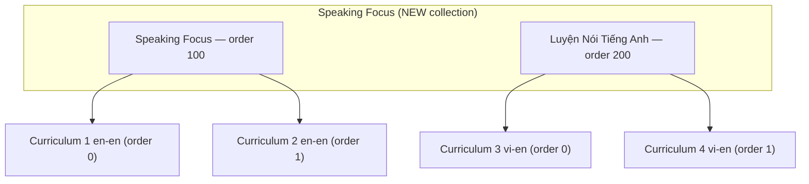
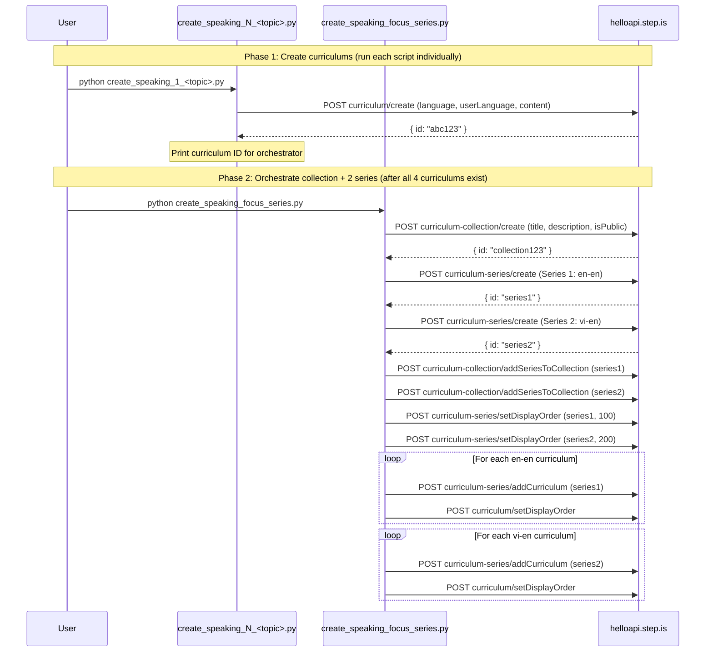

# Design Document: Speaking-Focus Curriculum

## Overview

This feature formalizes the `speaking_focus` curriculum type and creates 4 initial curriculums demonstrating it. Unlike the existing `balanced_skills` type (18 words, 5 sessions, balanced reading + writing + speaking), `speaking_focus` maximizes time spent producing speech — dropping `writingSentence`, `writingParagraph`, `vocabLevel2` (single-language), and `vocabLevel3` in favor of open-ended `speak` activities with escalating prompts. `speakFlashcards` and `speakReading` are retained as pronunciation scaffolding. Vocabulary is reduced to 10 words (2 groups of 5) as scaffolding for speaking, not as the primary learning goal.

The type has two variants:

1. **Single-language (en-en, advanced)** — 4 sessions. 2 `speak` activities per session. Prompts escalate: explain → role-play → summarize → debate → monologue → counter-argument → presentation → impromptu response. No `vocabLevel2`/`vocabLevel3`, no writing activities. All text in English.
2. **Bilingual (vi-en, intermediate)** — 4 sessions. 1 `speak` activity per session in S1-S2, 2 in S3-S4. `vocabLevel2` kept. `speak` prompts are simpler with examples. Prompts in Vietnamese, responses in English.

The implementation consists of standalone Python scripts calling the helloapi REST API. A new collection is created with two series (one per variant, since bilingual and single-language cannot be mixed in the same series). One orchestrator script handles collection creation, both series, and all wiring.

### Key Design Decisions

1. **New collection via API** — The orchestrator creates one collection, then two series within it. Same API pattern as writing-focus, song-based, movie-based, and podcast-based series.
2. **Two series, one collection** — Single-language (en-en) and bilingual (vi-en) curriculums cannot share a series (language homogeneity rule). Series 1: 2 single-language speaking_focus curriculums. Series 2: 2 bilingual speaking_focus curriculums.
3. **One script per curriculum** — Same pattern as all other series. Each script is ~400-600 lines with all hand-written content.
4. **One orchestrator for collection + both series** — A single `create_speaking_focus_series.py` handles collection creation, both series creation, adding curriculums, setting display orders, and wiring both series into the collection.
5. **10 vocab words (2 groups of 5)** — Unlike balanced_skills (18 words, 3 groups of 6). Vocabulary serves speaking, not the other way around.
6. **4 sessions** — S1-S2 are learning sessions (vocab + reading + speaking). S3 is review + extended speaking. S4 is full reading + capstone speaking + farewell.
7. **`speak` activity is the signature activity** — Present in every session. 2 per session (single-language) or 1-2 per session (bilingual). This is what distinguishes speaking_focus from balanced_skills.
8. **No writing activities** — `writingSentence` and `writingParagraph` are dropped entirely. All productive time goes to speaking.
9. **`speakFlashcards` and `speakReading` retained** — These are pronunciation scaffolding, not open-ended production. They complement the `speak` activities.
10. **`vocabLevel2` kept for bilingual only** — Bilingual learners need more recognition scaffolding. Single-language drops both `vocabLevel2` and `vocabLevel3`.
11. **Prompt escalation** — Single-language: explain → role-play → summarize → debate → monologue → counter-argument → present → impromptu. Bilingual: guided sentence → describe with words → describe scenario → answer question → summarize.
12. **`speak` data shape uses audioSpeed -0.3** — Distinct from other activities. No `lessonUniqueId` (auto-generated).
13. **No youtubeUrl** — speaking_focus curriculums use authored reading passages, not media excerpts.
14. **Model texts as reading passages** — S1-S2 reading passages are authored articles that introduce the topic and contain vocabulary in context. S4 reading is a full article combining/extending S1-S2. S3 has no new reading (pure speaking session).

### Initial 4 Curriculums

| # | Variant | Language Pair | Level | Series |
|---|---|---|---|---|
| 1 | Single-language | en-en | Advanced | Series 1: Speaking Focus (English) |
| 2 | Single-language | en-en | Advanced | Series 1: Speaking Focus (English) |
| 3 | Bilingual | vi-en | Intermediate | Series 2: Luyện Nói Tiếng Anh |
| 4 | Bilingual | vi-en | Intermediate | Series 2: Luyện Nói Tiếng Anh |

## Architecture



### Execution Flow



## Components and Interfaces

### Folder Structure

```
speaking-focus-curriculum/
├── create_speaking_1_<topic>.py          # Single-language curriculum 1
├── create_speaking_2_<topic>.py          # Single-language curriculum 2
├── create_speaking_3_<topic>.py          # Bilingual curriculum 1
├── create_speaking_4_<topic>.py          # Bilingual curriculum 2
└── create_speaking_focus_series.py       # Orchestrator (collection + 2 series + wiring)
```

After successful creation and verification, all `.py` scripts are deleted, leaving only `README.md`.

### Curriculum Script Interface

Each `create_speaking_N_<topic>.py` script:

1. Imports `firebase_token.get_firebase_id_token`
2. Defines `STRIP_KEYS` set and `strip()` function inline
3. Defines vocabulary lists: `W1` (5 words), `W2` (5 words), `ALL` (10 words)
4. Defines reading passages: `PASSAGE_1` (S1 passage), `PASSAGE_2` (S2 passage), `FULL_ARTICLE` (S4 combined/extended passage)
5. Builds `content` dict with all hand-written text
6. Runs `validate(content)` to check structural properties before upload
7. Calls `POST curriculum/create` with appropriate `language`/`userLanguage` at top level
8. Prints the created curriculum ID

### Orchestrator Script Interface

`create_speaking_focus_series.py`:

1. Takes 4 curriculum IDs as constants (2 en-en, 2 vi-en)
2. Creates collection with descriptive title and persuasive description, `isPublic: true`
3. Creates Series 1 (en-en) with English title/description, `isPublic: true`
4. Creates Series 2 (vi-en) with Vietnamese title/description, `isPublic: true`
5. Wires both series into the collection
6. Sets display orders: Series 1 = 100, Series 2 = 200
7. Adds curriculums to their respective series with display orders 0, 1

### API Calls Used

| Endpoint | Purpose | Auth |
|---|---|---|
| `curriculum/create` | Create each curriculum | AuthGuard |
| `curriculum-collection/create` | Create the speaking-focus collection | SuperAuthGuard |
| `curriculum-series/create` | Create each series (×2) | SuperAuthGuard |
| `curriculum-collection/addSeriesToCollection` | Add each series to collection (×2) | SuperAuthGuard |
| `curriculum-series/setDisplayOrder` | Set series order within collection (×2) | SuperAuthGuard |
| `curriculum-series/addCurriculum` | Add curriculum to series (×4) | SuperAuthGuard |
| `curriculum/setDisplayOrder` | Set curriculum order within series (×4) | SuperAuthGuard |

### Authentication

All scripts use the shared `firebase_token.py` helper:
```python
sys.path.insert(0, "/home/ubuntu/nspaceresearch/design-curriculums")
from firebase_token import get_firebase_id_token
UID = "zs5AMpVfqkcfDf8CJ9qrXdH58d73"
token = get_firebase_id_token(UID)
```

Token is refreshed before each API call that requires SuperAuthGuard.

## Data Models

### Curriculum Content Structure — Single-Language Variant (en-en)

```python
content = {
    "title": "Speaking Focus: <Topic Title>",
    "description": "Multi-paragraph persuasive copy in English (5-beat structure, speaking-focused)",
    "preview": {
        "text": "~150 word vivid marketing copy about the speaking journey and topic"
    },
    "learningSessions": [
        # Session 1: Vocab + Speak (8 activities)
        {
            "title": "Session 1: Vocabulary + Speaking",
            "activities": [
                # introAudio (teach 5 words with pronunciation emphasis)
                # viewFlashcards (W1)
                # speakFlashcards (W1)
                # vocabLevel1 (W1)
                # reading (PASSAGE_1 — context for speaking)
                # speakReading (PASSAGE_1)
                # speak (open-ended: explain concept using new words)
                # speak (role-play: conversational scenario)
            ]
        },
        # Session 2: Vocab + Speak (8 activities)
        {
            "title": "Session 2: New Vocabulary + Debate",
            "activities": [
                # introAudio (teach 5 more words, recap S1)
                # viewFlashcards (W2)
                # speakFlashcards (W2)
                # vocabLevel1 (W2)
                # reading (PASSAGE_2)
                # speakReading (PASSAGE_2)
                # speak (summarize both passages orally)
                # speak (debate: argue for/against a position)
            ]
        },
        # Session 3: Review + Extended Speaking (6 activities)
        {
            "title": "Session 3: Review + Extended Speaking",
            "activities": [
                # introAudio (review all 10 words)
                # viewFlashcards (ALL 10 words)
                # speakFlashcards (ALL 10 words)
                # vocabLevel1 (ALL)
                # speak (2-minute monologue on the topic)
                # speak (respond to a counter-argument)
            ]
        },
        # Session 4: Full Reading + Speaking Capstone (7 activities)
        {
            "title": "Session 4: Capstone Speaking",
            "activities": [
                # introAudio (recap journey)
                # reading (FULL_ARTICLE)
                # speakReading (FULL_ARTICLE)
                # readAlong (FULL_ARTICLE)
                # speak (present a 2-minute summary of the article)
                # speak (impromptu response to a follow-up question)
                # introAudio (farewell, 400-600 words)
            ]
        }
    ]
}
```

### Session Activity Sequences — Single-Language Variant (Exact)

| Session | Activity Order | Count |
|---|---|---|
| S1 (vocab + speak) | introAudio, viewFlashcards, speakFlashcards, vocabLevel1, reading, speakReading, speak, speak | 8 |
| S2 (new vocab + debate) | introAudio, viewFlashcards, speakFlashcards, vocabLevel1, reading, speakReading, speak, speak | 8 |
| S3 (review + extended speaking) | introAudio, viewFlashcards, speakFlashcards, vocabLevel1, speak, speak | 6 |
| S4 (capstone + farewell) | introAudio, reading, speakReading, readAlong, speak, speak, introAudio | 7 |

### Curriculum Content Structure — Bilingual Variant (vi-en)

```python
content = {
    "title": "Luyện Nói: <Tên Chủ Đề>",
    "description": "Multi-paragraph persuasive copy in Vietnamese (5-beat structure, speaking-focused)",
    "preview": {
        "text": "~150 word vivid marketing copy in Vietnamese about the speaking journey"
    },
    "learningSessions": [
        # Session 1: Vocab + Guided Speaking (11 activities)
        {
            "title": "Buổi 1: Từ vựng + Luyện nói",
            "activities": [
                # introAudio (welcome)
                # introAudio (bilingual vocab teaching with pronunciation — 5 words)
                # viewFlashcards (W1)
                # speakFlashcards (W1)
                # vocabLevel1 (W1)
                # vocabLevel2 (W1)
                # introAudio (reading intro)
                # reading (PASSAGE_1)
                # speakReading (PASSAGE_1)
                # readAlong (PASSAGE_1)
                # speak (guided: say a sentence using a word, with example)
            ]
        },
        # Session 2: Vocab + More Speaking (11 activities)
        {
            "title": "Buổi 2: Từ vựng mới + Luyện nói",
            "activities": [
                # introAudio (welcome)
                # introAudio (bilingual vocab teaching — 5 new words)
                # viewFlashcards (W2)
                # speakFlashcards (W2)
                # vocabLevel1 (W2)
                # vocabLevel2 (W2)
                # introAudio (reading intro)
                # reading (PASSAGE_2)
                # speakReading (PASSAGE_2)
                # readAlong (PASSAGE_2)
                # speak (slightly less scaffolded: describe topic using 2-3 words)
            ]
        },
        # Session 3: Review + Speaking Practice (8 activities)
        {
            "title": "Buổi 3: Ôn tập + Luyện nói",
            "activities": [
                # introAudio (welcome)
                # introAudio (review all vocab)
                # viewFlashcards (ALL 10 words)
                # speakFlashcards (ALL 10 words)
                # vocabLevel1 (ALL)
                # vocabLevel2 (ALL)
                # speak (describe a picture/scenario using vocab)
                # speak (answer a question about the topic)
            ]
        },
        # Session 4: Full Reading + Speaking (6 activities)
        {
            "title": "Buổi 4: Đọc + Nói tổng hợp",
            "activities": [
                # introAudio (welcome)
                # reading (FULL_ARTICLE)
                # speakReading (FULL_ARTICLE)
                # readAlong (FULL_ARTICLE)
                # speak (summarize what you read in 3-4 sentences)
                # introAudio (farewell)
            ]
        }
    ]
}
```

### Session Activity Sequences — Bilingual Variant (Exact)

| Session | Activity Order | Count |
|---|---|---|
| S1 (vocab + guided speaking) | introAudio, introAudio, viewFlashcards, speakFlashcards, vocabLevel1, vocabLevel2, introAudio, reading, speakReading, readAlong, speak | 11 |
| S2 (new vocab + more speaking) | introAudio, introAudio, viewFlashcards, speakFlashcards, vocabLevel1, vocabLevel2, introAudio, reading, speakReading, readAlong, speak | 11 |
| S3 (review + speaking practice) | introAudio, introAudio, viewFlashcards, speakFlashcards, vocabLevel1, vocabLevel2, speak, speak | 8 |
| S4 (full reading + speaking) | introAudio, reading, speakReading, readAlong, speak, introAudio | 6 |

### Activity Data Shapes

| Activity Type | Data Fields |
|---|---|
| `introAudio` | `{ text: string, audioSpeed: 0.01 }` |
| `viewFlashcards` | `{ vocabList: string[], audioSpeed: -0.1 }` |
| `speakFlashcards` | `{ vocabList: string[], audioSpeed: -0.1 }` |
| `vocabLevel1` | `{ vocabList: string[], audioSpeed: -0.1 }` |
| `vocabLevel2` | `{ vocabList: string[], audioSpeed: -0.1 }` (bilingual only) |
| `reading` | `{ text: string, audioSpeed: -0.1 }` |
| `speakReading` | `{ text: string, audioSpeed: -0.1 }` |
| `readAlong` | `{ text: string, audioSpeed: -0.1 }` |
| `speak` | `{ text: string, audioSpeed: -0.3 }` |

### Speak Activity Prompt Examples

Single-language S1 (explain + role-play):
```python
# speak 1: explain
{
    "activityType": "speak",
    "title": "Speak: Explain the concept",
    "description": "Explain the concept of [topic] using at least 3 new words.",
    "data": {
        "text": "Explain the concept of [topic] using at least 3 of your new words. Try to speak for about 1 minute.",
        "audioSpeed": -0.3
    }
}
# speak 2: role-play
{
    "activityType": "speak",
    "title": "Speak: Role-play discussion",
    "description": "Role-play explaining this to a colleague who disagrees.",
    "data": {
        "text": "You're explaining this to a colleague who disagrees with the main argument. Present your case and address their concerns. Speak for about 1 minute.",
        "audioSpeed": -0.3
    }
}
```

Bilingual S1 (guided):
```python
{
    "activityType": "speak",
    "title": "Nói: Luyện nói với từ vựng mới",
    "description": "Nói một câu sử dụng từ vựng mới.",
    "data": {
        "text": "Hãy nói một câu tiếng Anh sử dụng từ '[word]'. Ví dụ: '[example sentence in English]'. Bây giờ đến lượt bạn!",
        "audioSpeed": -0.3
    }
}
```

### Strip Keys Set

```python
STRIP_KEYS = {
    "mp3Url", "illustrationSet", "chapterBookmarks", "segments",
    "whiteboardItems", "userReadingId", "lessonUniqueId",
    "curriculumTags", "taskId", "imageId"
}
```

### Key Differences from Balanced_Skills and Writing_Focus

| Aspect | Balanced_Skills | Writing_Focus | Speaking_Focus (Single-Lang) | Speaking_Focus (Bilingual) |
|---|---|---|---|---|
| Sessions | 5 | 4 | 4 | 4 |
| Vocab words | 18 (3×6) | 10 (2×5) | 10 (2×5) | 10 (2×5) |
| speakFlashcards | Yes | No | Yes | Yes |
| speakReading | Yes | No | Yes | Yes |
| vocabLevel2 | Yes | Yes | No | Yes |
| vocabLevel3 | Yes | No | No | No |
| writingSentence | Yes | Yes | No | No |
| writingParagraph | No | Yes | No | No |
| speak (open-ended) | No | No | 2 per session | 1-2 per session |
| Signature activity | N/A | writingParagraph | speak | speak |
| S3 purpose | Learning session 3 | Review + analytical essay | Review + extended speaking | Review + speaking practice |
| S4 purpose | Review | Capstone writing | Capstone speaking | Full reading + speaking |
| Prompt escalation | Flat | sentence → analytical → argumentative | explain → debate → monologue → presentation | guided → describe → scenario → summarize |
| readAlong | Yes | Yes | S4 only (single-lang) | S1, S2, S4 |

## Correctness Properties

*A property is a characteristic or behavior that should hold true across all valid executions of a system — essentially, a formal statement about what the system should do. Properties serve as the bridge between human-readable specifications and machine-verifiable correctness guarantees.*

### Property 1: Structural completeness — single-language variant

*For any* single-language speaking_focus curriculum content dict, it SHALL contain exactly 10 unique vocabulary words divided into 2 groups of 5 (W1, W2), exactly 4 learning sessions, and the activity type sequences SHALL match: S1 = [introAudio, viewFlashcards, speakFlashcards, vocabLevel1, reading, speakReading, speak, speak] (8 activities), S2 = [introAudio, viewFlashcards, speakFlashcards, vocabLevel1, reading, speakReading, speak, speak] (8 activities), S3 = [introAudio, viewFlashcards, speakFlashcards, vocabLevel1, speak, speak] (6 activities), S4 = [introAudio, reading, speakReading, readAlong, speak, speak, introAudio] (7 activities).

**Validates: Requirements 1.1, 1.2, 1.3, 1.4, 1.5, 1.6, 3.1, 3.2, 3.3, 3.6, 7.1, 7.2, 7.3, 7.4**

### Property 2: Structural completeness — bilingual variant

*For any* bilingual speaking_focus curriculum content dict, it SHALL contain exactly 10 unique vocabulary words divided into 2 groups of 5 (W1, W2), exactly 4 learning sessions, and the activity type sequences SHALL match: S1 = [introAudio, introAudio, viewFlashcards, speakFlashcards, vocabLevel1, vocabLevel2, introAudio, reading, speakReading, readAlong, speak] (11 activities), S2 = [introAudio, introAudio, viewFlashcards, speakFlashcards, vocabLevel1, vocabLevel2, introAudio, reading, speakReading, readAlong, speak] (11 activities), S3 = [introAudio, introAudio, viewFlashcards, speakFlashcards, vocabLevel1, vocabLevel2, speak, speak] (8 activities), S4 = [introAudio, reading, speakReading, readAlong, speak, introAudio] (6 activities).

**Validates: Requirements 2.1, 2.2, 2.3, 2.4, 2.5, 2.6, 3.1, 3.2, 3.4, 3.5, 3.6, 7.5, 7.6**

### Property 3: No writing activities in any session

*For any* speaking_focus curriculum content dict, no session SHALL contain an activity with `activityType` equal to `writingSentence` or `writingParagraph`.

**Validates: Requirements 3.1, 3.2**

### Property 4: No vocabLevel3 in any session

*For any* speaking_focus curriculum content dict, no session SHALL contain an activity with `activityType` equal to `vocabLevel3`.

**Validates: Requirements 3.3, 3.4**

### Property 5: No vocabLevel2 in single-language variant

*For any* single-language speaking_focus curriculum content dict, no session SHALL contain an activity with `activityType` equal to `vocabLevel2`.

**Validates: Requirements 3.3, 8.4**

### Property 6: speak activity data shape

*For any* `speak` activity in any curriculum, the `data` field SHALL contain a `text` field (non-empty string) and an `audioSpeed` field with value `-0.3`, and SHALL NOT contain a `lessonUniqueId` field.

**Validates: Requirements 6.1, 6.2, 6.3**

### Property 7: No auto-generated keys in content

*For any* curriculum content dict (recursively traversing all nested dicts and lists), none of the strip keys (`mp3Url`, `illustrationSet`, `chapterBookmarks`, `segments`, `whiteboardItems`, `userReadingId`, `lessonUniqueId`, `curriculumTags`, `taskId`, `imageId`) SHALL appear as keys.

**Validates: Requirements 11.1**

### Property 8: All activities and sessions have title and description

*For any* activity in any session of any curriculum, both `title` and `description` fields SHALL exist and be non-empty strings. *For any* session object, the `title` field SHALL exist and be a non-empty string.

**Validates: Requirements 10.1, 10.8**

### Property 9: Activity title format matches activity type and variant

*For any* activity in a single-language curriculum: if `activityType` is `viewFlashcards`, `speakFlashcards`, or `vocabLevel1`, the title SHALL start with `"Flashcards:"`; if `activityType` is `reading` or `speakReading`, the title SHALL contain `"Read:"`; if `activityType` is `readAlong`, the title SHALL contain `"Listen:"`; if `activityType` is `speak`, the title SHALL contain `"Speak:"`. *For any* activity in a bilingual curriculum: the same activity types SHALL use `"Flashcards:"`, `"Đọc:"`, `"Nghe:"`, and `"Nói:"` respectively, with `vocabLevel2` also using `"Flashcards:"`.

**Validates: Requirements 10.2, 10.3, 10.4, 10.5, 10.7**

### Property 10: Language parameters at top level

*For any* single-language curriculum creation API call body, the fields `language` (value `"en"`) and `userLanguage` (value `"en"`) SHALL be present as top-level body parameters alongside `content`. *For any* bilingual curriculum creation API call body, the fields `language` (value `"en"`) and `userLanguage` (value `"vi"`) SHALL be present as top-level body parameters alongside `content`.

**Validates: Requirements 16.1, 16.2, 16.3**

### Property 11: Vocabulary words appear in reading passages

*For any* curriculum, every one of the 10 vocabulary words SHALL appear (case-insensitive) in at least one of the reading passage texts (PASSAGE_1, PASSAGE_2, or FULL_ARTICLE).

**Validates: Requirements 8.6**

### Property 12: Farewell introAudio contains all vocabulary words

*For any* curriculum, the farewell introAudio script (the last introAudio activity in S4) SHALL contain all 10 vocabulary words as substrings.

**Validates: Requirements 18.5**

### Property 13: Vocabulary flashcard lists match session word groups

*For any* curriculum, the `vocabList` in viewFlashcards/speakFlashcards/vocabLevel activities in S1 SHALL equal exactly W1 (5 words), in S2 SHALL equal exactly W2 (5 words), and in S3 SHALL equal ALL (10 words).

**Validates: Requirements 8.2, 8.3**

### Property 14: Curriculum title has no difficulty level descriptors

*For any* curriculum, the `title` field in the content dict SHALL NOT contain difficulty level descriptors (e.g., "Upper-Intermediate", "Advanced", "Beginner", "Intermediate").

**Validates: Requirements 16.5**

### Property 15: Series descriptions under 255 characters

*For any* series creation call, the `description` field SHALL be a non-empty string with length ≤ 255 characters.

**Validates: Requirements 12.2, 12.3**

### Property 16: Curriculum display orders within series are sequential

*For any* series containing 2 curriculums, the display orders assigned to those curriculums SHALL be the sequential integers 0, 1.

**Validates: Requirements 13.1**

### Property 17: S1-S2 introAudio contains session vocabulary words

*For any* curriculum, the first introAudio in S1 SHALL contain all 5 W1 vocabulary words as substrings, and the first introAudio in S2 SHALL contain all 5 W2 vocabulary words as substrings.

**Validates: Requirements 18.1, 18.2**

### Property 18: speak activity count per session matches variant

*For any* single-language curriculum, every session SHALL contain exactly 2 `speak` activities. *For any* bilingual curriculum, S1 and S2 SHALL each contain exactly 1 `speak` activity, and S3 SHALL contain exactly 2 `speak` activities, and S4 SHALL contain exactly 1 `speak` activity.

**Validates: Requirements 3.5**

## Error Handling

### API Call Failures

Each script calls `r.raise_for_status()` after every API call. If any call fails:
- The script prints the HTTP status code and response body
- Execution stops immediately (no partial state cleanup)
- The user must manually check what was created and retry or clean up

### Common Failure Modes

| Failure | Cause | Resolution |
|---|---|---|
| 500 on `curriculum/create` | `language`/`userLanguage` missing from top-level body | Ensure both are top-level params, not just inside content |
| 500 on `curriculum-series/create` | Description exceeds 255 chars | Shorten description |
| 500 on `curriculum-collection/create` | Title exceeds 255 chars | Shorten title |
| 401 Unauthorized | Firebase token expired | Script refreshes token before each call |
| 409 or duplicate | Collection/series/curriculum already exists | Check DB, delete duplicate, retry |
| Network timeout | API unreachable | Retry the script |
| Language homogeneity violation | Mixing en-en and vi-en in same series | Use separate series (enforced by design) |

### Token Refresh Strategy

Firebase ID tokens expire after ~1 hour. For scripts making multiple sequential API calls, the token is refreshed by calling `get_firebase_id_token(UID)` before each API call rather than reusing a single token.

### Idempotency Considerations

- `curriculum/create` is NOT idempotent — running the same script twice creates duplicate curriculums
- `curriculum-collection/create` is NOT idempotent — running twice creates duplicate collections
- `curriculum-series/create` is NOT idempotent — running twice creates duplicate series
- `curriculum-series/addCurriculum` IS idempotent — adding the same curriculum twice has no effect
- `curriculum/setDisplayOrder` IS idempotent — setting the same order twice is safe
- `curriculum-collection/addSeriesToCollection` IS idempotent — adding the same series twice is safe
- If the orchestrator fails partway through, the user should check the DB state before re-running

### Orchestrator Failure Recovery

Since the orchestrator creates one collection and two series, a failure mid-way requires careful recovery:
1. If collection creation succeeds but series creation fails → note the collection ID, fix the issue, re-run with collection creation skipped (or delete the collection and re-run)
2. If Series 1 creation succeeds but Series 2 fails → note Series 1 ID, fix the issue, create Series 2 manually
3. If series creation succeeds but addSeriesToCollection fails → note both IDs, fix the issue, manually wire them
4. If curriculum addition fails → note which curriculums were added, add the remaining ones manually

## Testing Strategy

Since this project has no test framework or CI pipeline, validation is done through structural verification of the content dicts before they are sent to the API, and post-creation verification via DB queries.

### Pre-Upload Validation (Unit-Test Equivalent)

Each curriculum script includes a `validate(content, variant)` function that checks structural properties before making the API call. The `variant` parameter is either `"single-language"` or `"bilingual"` and determines which activity sequences and title formats to check.

**Single-language variant checks:**
1. Verify 10 unique vocab words across W1 (5) + W2 (5)
2. Verify 4 sessions with correct activity type sequences (8, 8, 6, 7)
3. Verify no `writingSentence`, `writingParagraph`, `vocabLevel2`, or `vocabLevel3` in any session
4. Verify `speak` activities: 2 per session (S1-S4)
5. Verify `speak` data shape: `text` (non-empty), `audioSpeed` = -0.3, no `lessonUniqueId`
6. Verify S3 has no `reading` activity (pure speaking session)
7. Verify all activities have `title` and `description`
8. Verify activity title format: `Flashcards:`, `Read:`, `Listen:`, `Speak:`
9. Verify no strip keys present in content (recursive check)
10. Verify all 10 vocab words appear in reading passages (case-insensitive)
11. Verify farewell introAudio (S4 last activity) contains all 10 vocab words
12. Verify S1 introAudio contains all W1 words, S2 introAudio contains all W2 words
13. Verify curriculum title has no difficulty level descriptors
14. Verify vocabList in flashcard activities: S1=W1, S2=W2, S3=ALL

**Bilingual variant checks:**
1-2 same as single-language (with bilingual activity sequences: 11, 11, 8, 6)
3. Verify no `writingSentence`, `writingParagraph`, or `vocabLevel3` in any session (vocabLevel2 IS allowed)
4. Verify `speak` activities: 1 in S1, 1 in S2, 2 in S3, 1 in S4
5-6, 9-14 same as single-language
7. Verify activity title format: `Flashcards:`, `Đọc:`, `Nghe:`, `Nói:`

This function runs locally before any API call is made. If validation fails, the script exits with a clear error message.

### Property-Based Testing

Since there is no test framework in this repo, property-based testing is implemented as inline assertions within the `validate(content, variant)` function. These assertions verify the structural properties (Properties 1-18) against the content dict before upload. Each curriculum script includes the same validation logic (copied inline, since scripts are standalone and deleted after use).

### Post-Creation Verification

After all scripts have run, verify via SQL:

```sql
-- Find the new speaking-focus collection
SELECT id, title, description, is_public
FROM curriculum_collections
WHERE title LIKE '%Speaking Focus%';

-- Verify collection has 2 series
SELECT cs.id, cs.title, cs.display_order
FROM curriculum_series cs
JOIN curriculum_collection_series ccs ON ccs.curriculum_series_id = cs.id
WHERE ccs.curriculum_collection_id = '<NEW_COLLECTION_ID>'
ORDER BY cs.display_order;

-- Verify Series 1 (en-en) has 2 curriculums
SELECT c.id, c.content->>'title' as title, c.display_order,
       c.language, c.user_language
FROM curriculum c
JOIN curriculum_series_items csi ON csi.curriculum_id = c.id
WHERE csi.curriculum_series_id = '<SERIES_1_ID>'
ORDER BY c.display_order;

-- Verify Series 2 (vi-en) has 2 curriculums
SELECT c.id, c.content->>'title' as title, c.display_order,
       c.language, c.user_language
FROM curriculum c
JOIN curriculum_series_items csi ON csi.curriculum_id = c.id
WHERE csi.curriculum_series_id = '<SERIES_2_ID>'
ORDER BY c.display_order;

-- Verify language homogeneity for both series
SELECT * FROM curriculum_series_language_list
WHERE id IN ('<SERIES_1_ID>', '<SERIES_2_ID>');

-- Verify all curriculums are private
SELECT c.id, c.content->>'title' as title, c.is_public
FROM curriculum c
JOIN curriculum_series_items csi ON csi.curriculum_id = c.id
WHERE csi.curriculum_series_id IN ('<SERIES_1_ID>', '<SERIES_2_ID>');

-- Verify no level gap violations
SELECT * FROM curriculum_series_level_gap
WHERE id IN ('<SERIES_1_ID>', '<SERIES_2_ID>');
```

### Validation Checklist Per Curriculum

**Both variants:**
- [ ] 10 unique vocabulary words (5 + 5)
- [ ] All 10 words appear in reading passages
- [ ] No `writingSentence` or `writingParagraph` in any session
- [ ] No `vocabLevel3` in any session
- [ ] `speak` data shape: `text` (non-empty), `audioSpeed` = -0.3, no `lessonUniqueId`
- [ ] All activities have title and description
- [ ] No strip keys in content
- [ ] `language` and `userLanguage` at top level of API call body
- [ ] Curriculum title has no difficulty level descriptors
- [ ] Farewell introAudio contains all 10 vocabulary words
- [ ] S1 introAudio contains W1 words, S2 introAudio contains W2 words
- [ ] Flashcard vocabLists: S1=W1, S2=W2, S3=ALL
- [ ] Display orders set correctly (curriculum: 0-1 per series, series: 100/200)
- [ ] Series descriptions ≤ 255 characters

**Single-language specific:**
- [ ] 4 sessions with activity sequences (8, 8, 6, 7)
- [ ] No `vocabLevel2` in any session
- [ ] 2 `speak` activities per session (S1-S4)
- [ ] S3 has no reading activity
- [ ] Activity titles use English prefixes (Read:/Listen:/Speak:)
- [ ] `language="en"`, `userLanguage="en"`

**Bilingual specific:**
- [ ] 4 sessions with activity sequences (11, 11, 8, 6)
- [ ] `vocabLevel2` present in S1, S2, S3
- [ ] 1 `speak` in S1, 1 in S2, 2 in S3, 1 in S4
- [ ] S3 has no reading activity
- [ ] Activity titles use Vietnamese prefixes (Đọc:/Nghe:/Nói:)
- [ ] `language="en"`, `userLanguage="vi"`
