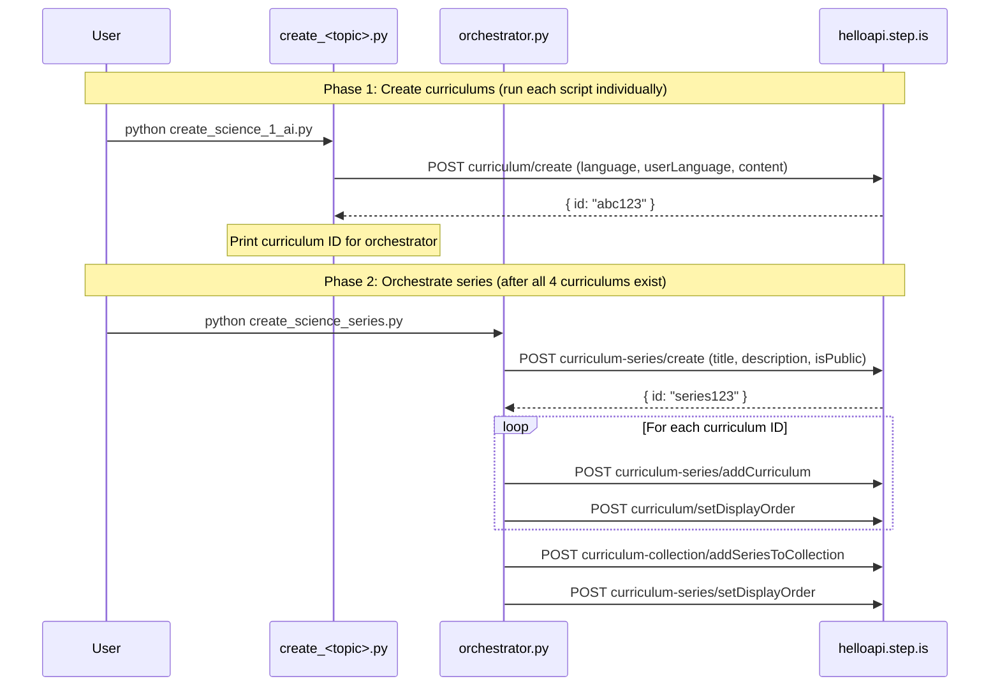

# Design Document: Topic-Based Vocab Series Expansion

## Overview

This feature expands the "Học Từ Vựng Theo Chủ Đề" collection (279d6843) with 4 new thematic series, adding 16 total curriculums (4 per series). Each curriculum follows the established 18-word / 5-session structure used by the existing Health & Wellness series.

The implementation consists of standalone Python scripts that call the helloapi REST API to create curriculums, organize them into series, and attach them to the collection. Each curriculum script contains all hand-written learner-facing text (no templates). Each series has an orchestrator script for series-level setup.

### Key Design Decisions

1. **One script per curriculum** — Keeps files manageable (~500-800 lines each) and content self-contained. Matches the pattern established by `health-wellness-series/create_exercise.py` and `test-prep/create_gre_1_altruism.py`.
2. **One orchestrator per series** — Handles series creation, adding curriculums, setting display orders, and adding the series to the collection. Matches `test-prep/toeic_create_series.py`.
3. **No shared content generation** — All learner-facing text is hand-written per curriculum. Only structural helpers (strip_keys, activity schema) are shared.
4. **Sequential display_order** — New series get display_order 300, 400, 500, 600 (after existing 100, 200). Curriculums within each series get 0, 1, 2, 3.

## Architecture

```mermaid
graph TD
    subgraph Collection["Học Từ Vựng Theo Chủ Đề (279d6843)"]
        S1["Tâm Lý & Phát Triển Bản Thân (6k2ij0ut) — order 100"]
        S2["Sức Khỏe & Lối Sống (e24f29c4) — order 200"]
        S3["Khoa Học & Công Nghệ — order 300"]
        S4["Kinh Tế & Tài Chính Cá Nhân — order 400"]
        S5["Môi Trường & Phát Triển Bền Vững — order 500"]
        S6["Văn Hóa & Xã Hội — order 600"]
    end

    S3 --> C1["AI & Machine Learning (order 0)"]
    S3 --> C2["Space Exploration (order 1)"]
    S3 --> C3["Genetic Engineering & CRISPR (order 2)"]
    S3 --> C4["Quantum Computing (order 3)"]

    S4 --> C5["Behavioral Economics (order 0)"]
    S4 --> C6["Investing Fundamentals (order 1)"]
    S4 --> C7["Inflation & Monetary Policy (order 2)"]
    S4 --> C8["Gig Economy (order 3)"]

    S5 --> C9["Climate Change (order 0)"]
    S5 --> C10["Ocean Conservation (order 1)"]
    S5 --> C11["Renewable Energy (order 2)"]
    S5 --> C12["Sustainable Agriculture (order 3)"]

    S6 --> C13["Social Media Psychology (order 0)"]
    S6 --> C14["Cultural Intelligence (order 1)"]
    S6 --> C15["Urbanization (order 2)"]
    S6 --> C16["Future of Work (order 3)"]
```



### Execution Flow per Series



## Components and Interfaces

### Folder Structure

```
science-technology-series/
├── create_science_1_ai.py
├── create_science_2_space.py
├── create_science_3_genetics.py
├── create_science_4_quantum.py
└── create_science_series.py          # orchestrator

economics-finance-series/
├── create_econ_1_behavioral.py
├── create_econ_2_investing.py
├── create_econ_3_inflation.py
├── create_econ_4_gig.py
└── create_econ_series.py

environment-sustainability-series/
├── create_env_1_climate.py
├── create_env_2_ocean.py
├── create_env_3_energy.py
├── create_env_4_agriculture.py
└── create_env_series.py

culture-society-series/
├── create_culture_1_social_media.py
├── create_culture_2_cultural_intel.py
├── create_culture_3_urbanization.py
├── create_culture_4_future_work.py
└── create_culture_series.py
```

### Curriculum Script Interface

Each `create_<topic>.py` script:

1. Imports `firebase_token.get_firebase_id_token`
2. Defines `STRIP_KEYS` set and `strip()` function inline
3. Defines vocabulary lists: `W1` (6 words), `W2` (6 words), `W3` (6 words), `ALL` (18 words)
4. Defines reading passages: `R1`, `R2`, `R3`, `FULL`
5. Builds `content` dict with all hand-written text (title, description, preview, 5 sessions with activities)
6. Calls `POST curriculum/create` with `language="en"`, `userLanguage="vi"`, `content=json.dumps(content)`
7. Prints the created curriculum ID

### Orchestrator Script Interface

Each `create_<series>_series.py` script:

1. Takes 4 curriculum IDs as constants (pasted from curriculum script output)
2. Calls `POST curriculum-series/create` with bilingual title, Vietnamese description, `isPublic=True`
3. Calls `POST curriculum-series/addCurriculum` for each curriculum
4. Calls `POST curriculum/setDisplayOrder` for each curriculum (0, 1, 2, 3)
5. Calls `POST curriculum-collection/addSeriesToCollection` with collection ID `279d6843`
6. Calls `POST curriculum-series/setDisplayOrder` with the series display order (300/400/500/600)

### API Calls Used

| Endpoint | Purpose | Auth |
|---|---|---|
| `curriculum/create` | Create each curriculum | AuthGuard |
| `curriculum-series/create` | Create each series | SuperAuthGuard |
| `curriculum-series/addCurriculum` | Add curriculum to series | SuperAuthGuard |
| `curriculum/setDisplayOrder` | Set curriculum order within series | SuperAuthGuard |
| `curriculum-collection/addSeriesToCollection` | Add series to collection | SuperAuthGuard |
| `curriculum-series/setDisplayOrder` | Set series order within collection | SuperAuthGuard |

### Authentication

All scripts use the shared `firebase_token.py` helper:
```python
sys.path.insert(0, "/home/ubuntu/nspaceresearch/design-curriculums")
from firebase_token import get_firebase_id_token
UID = "zs5AMpVfqkcfDf8CJ9qrXdH58d73"
token = get_firebase_id_token(UID)
```

Token is refreshed before each API call that requires SuperAuthGuard (tokens expire).

## Data Models

### Curriculum Content Structure

```python
content = {
    "title": "Vietnamese Title – English Subtitle",
    "description": "Multi-paragraph persuasive copy in Vietnamese (5-beat structure)",
    "preview": {
        "text": "~150 word vivid marketing copy in Vietnamese"
    },
    "learningSessions": [
        # Session 1-3: Learning sessions (6 words each)
        {
            "title": "Buổi 1: <topic>",
            "activities": [
                # introAudio x3 (welcome, vocab teaching, grammar notes)
                # viewFlashcards, speakFlashcards
                # vocabLevel1, vocabLevel2, vocabLevel3
                # reading, speakReading, readAlong
                # writingSentence
            ]
        },
        # Session 4: Review (all 18 words)
        {
            "title": "Ôn tập",
            "activities": [
                # introAudio (congratulations + recap)
                # viewFlashcards, speakFlashcards (ALL words)
                # vocabLevel1, vocabLevel2, vocabLevel3 (ALL words)
                # reading (FULL text), speakReading, readAlong
                # writingSentence (selected words)
            ]
        },
        # Session 5: Full reading + farewell
        {
            "title": "Đọc toàn bộ",
            "activities": [
                # introAudio (farewell + word review)
                # reading (FULL text), speakReading, readAlong
            ]
        }
    ]
}
```

### Activity Data Shapes

| Activity Type | Data Fields |
|---|---|
| `introAudio` | `{ text: string, audioSpeed: 0.01 }` |
| `viewFlashcards` | `{ vocabList: string[], audioSpeed: -0.1 }` |
| `speakFlashcards` | `{ vocabList: string[], audioSpeed: -0.1 }` |
| `vocabLevel1/2/3` | `{ vocabList: string[], audioSpeed: -0.1 }` |
| `reading` | `{ text: string, audioSpeed: -0.1 }` |
| `speakReading` | `{ text: string, audioSpeed: -0.1 }` |
| `readAlong` | `{ text: string, audioSpeed: -0.1 }` |
| `writingSentence` | `{ vocabList: string[], audioSpeed: 0.01, items: WritingItem[] }` |

### WritingItem Shape

```python
{
    "targetVocab": "word",
    "prompt": "Sử dụng từ 'word' để nói về [specific context]. Ví dụ: [full example sentence]."
}
```

### Series Display Order Mapping

| Series | display_order |
|---|---|
| Tâm Lý & Phát Triển Bản Thân (existing) | 100 |
| Sức Khỏe & Lối Sống (existing) | 200 |
| Khoa Học & Công Nghệ (new) | 300 |
| Kinh Tế & Tài Chính Cá Nhân (new) | 400 |
| Môi Trường & Phát Triển Bền Vững (new) | 500 |
| Văn Hóa & Xã Hội (new) | 600 |

### Strip Keys Set

```python
STRIP_KEYS = {
    "mp3Url", "illustrationSet", "chapterBookmarks", "segments",
    "whiteboardItems", "userReadingId", "lessonUniqueId",
    "curriculumTags", "taskId", "imageId"
}
```


## Correctness Properties

*A property is a characteristic or behavior that should hold true across all valid executions of a system — essentially, a formal statement about what the system should do. Properties serve as the bridge between human-readable specifications and machine-verifiable correctness guarantees.*

### Property 1: Curriculum structural completeness

*For any* curriculum content dict, it SHALL contain exactly 18 unique vocabulary words divided into 3 groups of 6 (W1, W2, W3), exactly 5 learning sessions, and sessions 1-3 SHALL have activities in the exact order: introAudio, introAudio, introAudio, viewFlashcards, speakFlashcards, vocabLevel1, vocabLevel2, vocabLevel3, reading, speakReading, readAlong, writingSentence.

**Validates: Requirements 2.1, 2.2, 2.3**

### Property 2: Language parameters at top level

*For any* curriculum creation API call body, the fields `language` (value `"en"`) and `userLanguage` (value `"vi"`) SHALL be present as top-level body parameters alongside `content`.

**Validates: Requirements 2.4, 2.5, 10.1**

### Property 3: No auto-generated keys in content

*For any* curriculum content dict (recursively traversing all nested dicts and lists), none of the strip keys (`mp3Url`, `illustrationSet`, `chapterBookmarks`, `segments`, `whiteboardItems`, `userReadingId`, `lessonUniqueId`, `curriculumTags`, `taskId`, `imageId`) SHALL appear as keys.

**Validates: Requirements 6.1**

### Property 4: All activities and sessions have title and description

*For any* activity in any session of any curriculum, both `title` and `description` fields SHALL exist and be non-empty strings. *For any* session object, the `title` field SHALL exist and be a non-empty string.

**Validates: Requirements 5.1, 5.7**

### Property 5: Activity title format matches activity type

*For any* activity in any curriculum: if `activityType` is `viewFlashcards`, `speakFlashcards`, `vocabLevel1`, `vocabLevel2`, or `vocabLevel3`, the title SHALL start with `"Flashcards:"` or contain a flashcard-related Vietnamese label; if `activityType` is `reading` or `speakReading`, the title SHALL contain `"Đọc:"` or a reading-related label; if `activityType` is `readAlong`, the title SHALL contain `"Nghe:"`; if `activityType` is `writingSentence`, the title SHALL contain `"Viết:"`.

**Validates: Requirements 5.2, 5.3, 5.4, 5.6**

### Property 6: Writing prompts contain target vocab and example

*For any* writingSentence item in any curriculum, the `prompt` field SHALL contain the `targetVocab` word and SHALL contain the Vietnamese example marker `"Ví dụ:"`.

**Validates: Requirements 4.1**

### Property 7: introAudio scripts reference session vocabulary

*For any* curriculum, the teaching introAudio scripts in sessions 1-3 (the second introAudio activity, which teaches vocabulary) SHALL contain every vocabulary word from that session's word list. The farewell introAudio in session 5 SHALL contain all 18 vocabulary words.

**Validates: Requirements 3.3, 3.5**

### Property 8: Series display orders are after existing series

*For any* new series created in this expansion, its `display_order` value SHALL be greater than 200 (the highest existing series order).

**Validates: Requirements 1.3, 7.2**

### Property 9: Curriculum display orders within series are sequential

*For any* series containing 4 curriculums, the display orders assigned to those curriculums SHALL be the sequential integers 0, 1, 2, 3.

**Validates: Requirements 7.1**

### Property 10: Series description under 255 characters

*For any* series creation call, the `description` field SHALL be a non-empty string with length ≤ 255 characters (the PostgreSQL varchar limit).

**Validates: Requirements 1.1, 11.2, 12.2, 13.2, 14.2**

### Property 11: Vocabulary flashcard lists match session word groups

*For any* curriculum, the `vocabList` in viewFlashcards/speakFlashcards/vocabLevel activities in session N (1-3) SHALL equal exactly the Nth word group (W1, W2, W3). In session 4 (review), the `vocabList` SHALL equal all 18 words.

**Validates: Requirements 2.1**

## Error Handling

### API Call Failures

Each script calls `r.raise_for_status()` after every API call. If any call fails:
- The script prints the HTTP status code and response body
- Execution stops immediately (no partial state cleanup)
- The user must manually check what was created and retry or clean up

### Common Failure Modes

| Failure | Cause | Resolution |
|---|---|---|
| 500 on `curriculum/create` | `language`/`userLanguage` missing from top-level body | Ensure both are top-level params, not just inside content |
| 500 on `curriculum-series/create` | Description exceeds 255 chars | Shorten description |
| 401 Unauthorized | Firebase token expired | Script refreshes token before each call |
| 409 or duplicate | Series/curriculum already exists | Check DB, delete duplicate, retry |
| Network timeout | API unreachable | Retry the script |

### Token Refresh Strategy

Firebase ID tokens expire after ~1 hour. For scripts making multiple sequential API calls, the token is refreshed by calling `get_firebase_id_token(UID)` before each API call rather than reusing a single token.

### Idempotency Considerations

- `curriculum/create` is NOT idempotent — running the same script twice creates duplicate curriculums
- `curriculum-series/addCurriculum` IS idempotent — adding the same curriculum twice has no effect
- `curriculum/setDisplayOrder` IS idempotent — setting the same order twice is safe
- If a script fails partway through, the user should check the DB state before re-running

## Testing Strategy

Since this project has no test framework or CI pipeline, validation is done through structural verification of the content dicts before they are sent to the API, and post-creation verification via DB queries.

### Pre-Upload Validation (Unit-Test Equivalent)

Each curriculum script should include a `validate(content)` function that checks structural properties before making the API call:

1. Verify 18 unique vocab words across W1 + W2 + W3
2. Verify 5 sessions exist
3. Verify activity order in sessions 1-3 matches the required sequence
4. Verify all activities have `title` and `description`
5. Verify no strip keys present in content
6. Verify writingSentence items have `targetVocab` and `prompt` with example marker
7. Verify vocabList in flashcard activities matches the correct word group

This function runs locally before any API call is made. If validation fails, the script exits with a clear error message.

### Property-Based Testing

Since there is no test framework in this repo, property-based testing would be implemented as a standalone validation script using the `hypothesis` library (Python PBT library). However, given the nature of this project (hand-written content scripts that are deleted after use), the practical approach is:

- Each curriculum script includes inline assertions that verify the structural properties (Properties 1-11) against the content dict before upload
- These assertions act as property checks on the specific content instance
- The validation function is shared across all 16 curriculum scripts via copy (not import, since scripts are standalone and deleted after use)

### Post-Creation Verification

After all scripts have run, verify via SQL:

```sql
-- Verify collection has 6 series
SELECT cs.id, cs.title, cs.display_order
FROM curriculum_series cs
JOIN curriculum_collection_series ccs ON ccs.curriculum_series_id = cs.id
WHERE ccs.curriculum_collection_id = '279d6843'
ORDER BY cs.display_order;

-- Verify each series has 4 curriculums
SELECT cs.title, COUNT(csi.curriculum_id) as curriculum_count
FROM curriculum_series cs
JOIN curriculum_series_items csi ON csi.curriculum_series_id = cs.id
JOIN curriculum_collection_series ccs ON ccs.curriculum_series_id = cs.id
WHERE ccs.curriculum_collection_id = '279d6843'
GROUP BY cs.id, cs.title
ORDER BY cs.display_order;

-- Verify curriculum display orders within each series
SELECT cs.title as series, c.content->>'title' as curriculum, c.display_order
FROM curriculum c
JOIN curriculum_series_items csi ON csi.curriculum_id = c.id
JOIN curriculum_series cs ON cs.id = csi.curriculum_series_id
JOIN curriculum_collection_series ccs ON ccs.curriculum_series_id = cs.id
WHERE ccs.curriculum_collection_id = '279d6843'
ORDER BY cs.display_order, c.display_order;

-- Verify language homogeneity
SELECT * FROM curriculum_series_language_list
WHERE id IN (SELECT curriculum_series_id FROM curriculum_collection_series WHERE curriculum_collection_id = '279d6843');
```

### Validation Checklist Per Curriculum

- [ ] 18 unique vocabulary words (6 + 6 + 6)
- [ ] 5 sessions with correct structure
- [ ] Activity order matches required sequence in sessions 1-3
- [ ] All activities have title and description
- [ ] No strip keys in content
- [ ] language="en" and userLanguage="vi" at top level
- [ ] Series description ≤ 255 characters
- [ ] Writing prompts contain target vocab and "Ví dụ:"
- [ ] introAudio scripts reference all session vocab words
- [ ] Display orders set correctly (curriculum: 0-3, series: 300-600)
