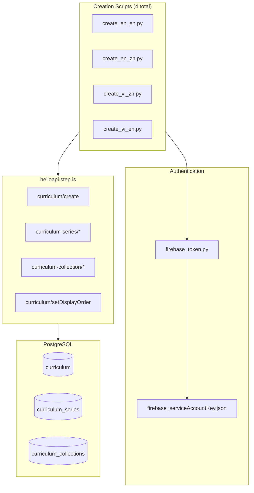
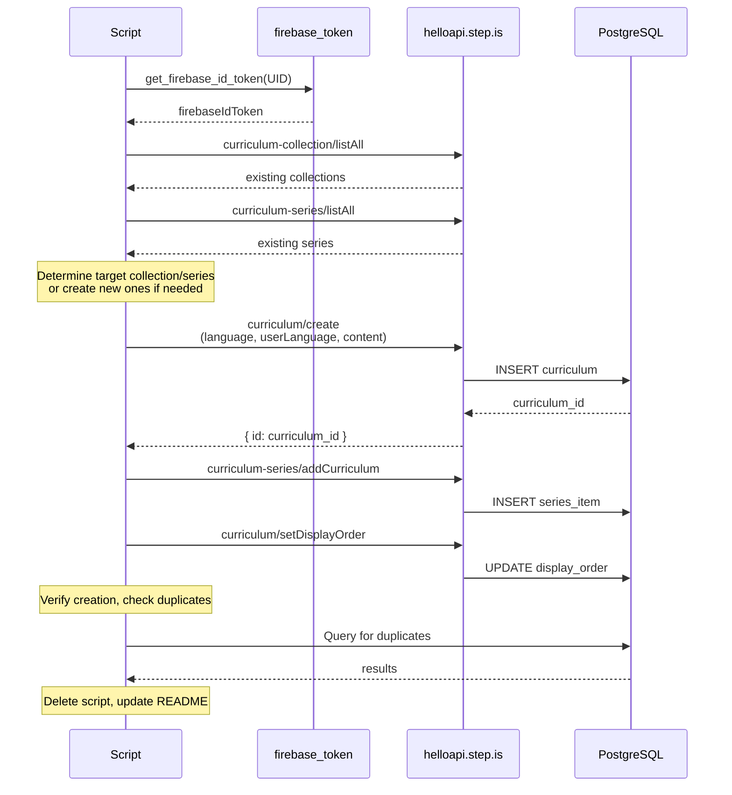

# Design Document: Uncomfortable Growth Curriculum

## Overview

This design specifies the creation of 4 mini `balanced_skills` curriculums built around the theme "Get comfortable being uncomfortable is the essence of language learning." Each curriculum targets a different language pair and delivers a compact gateway experience that introduces learners to the mindset of embracing discomfort as the engine of language learning.

The 4 curriculums are:
1. **en-en** — English speaker learning advanced English vocabulary (5 words, 2 sessions)
2. **en-zh** — English speaker learning Chinese (6 words, 2 sessions)
3. **vi-zh** — Vietnamese speaker learning Chinese (6 words, 2 sessions)
4. **vi-en** — Vietnamese speaker learning English (6 words, 2 sessions)

Each curriculum is a standalone Python script with all text content hand-written (no templates). After successful creation and verification, scripts are deleted, leaving only a README with recreation context.

## Architecture

### System Context



### Script Execution Flow



## Components and Interfaces

### Component 1: Creation Script (one per curriculum)

Each curriculum has its own Python script containing:
- All hand-written text content (no templates)
- Curriculum JSON structure
- API interaction logic
- Verification and duplicate checking

**Interface:**
```python
# Script structure
import sys
import json
import requests

sys.path.insert(0, "/home/ubuntu/nspaceresearch/design-curriculums")
from firebase_token import get_firebase_id_token

UID = "zs5AMpVfqkcfDf8CJ9qrXdH58d73"
API_BASE = "https://helloapi.step.is"

def strip_keys(obj):
    """Remove auto-generated platform keys from content"""
    STRIP_KEYS = ["mp3Url", "illustrationSet", "chapterBookmarks", "segments", 
                  "whiteboardItems", "userReadingId", "lessonUniqueId", 
                  "curriculumTags", "taskId", "imageId"]
    # recursive implementation
    ...

def create_curriculum():
    token = get_firebase_id_token(UID)
    content = build_content()  # Returns hand-written curriculum dict
    
    response = requests.post(f"{API_BASE}/curriculum/create", json={
        "firebaseIdToken": token,
        "language": "...",      # Target language (en, zh)
        "userLanguage": "...",  # User's native language (en, vi)
        "content": json.dumps(content)
    })
    return response.json()["id"]

def add_to_series(curriculum_id, series_id):
    token = get_firebase_id_token(UID)
    requests.post(f"{API_BASE}/curriculum-series/addCurriculum", json={
        "firebaseIdToken": token,
        "curriculumSeriesId": series_id,
        "curriculumId": curriculum_id
    })

def set_display_order(curriculum_id, order):
    token = get_firebase_id_token(UID)
    requests.post(f"{API_BASE}/curriculum/setDisplayOrder", json={
        "firebaseIdToken": token,
        "id": curriculum_id,
        "displayOrder": order
    })
```

### Component 2: Curriculum Content Structure

**Top-level curriculum JSON:**
```python
{
    "title": str,           # Curriculum title in user language
    "description": str,     # Persuasive copy (5-beat structure)
    "preview": {
        "text": str         # ~150 words marketing copy
    },
    "sessions": [...]       # Array of session objects
}
```

**Session object:**
```python
{
    "title": str,           # Session title (e.g., "Session 1", "Phần 1")
    "activities": [...]     # Array of activity objects
}
```

### Component 3: Activity Types

Each activity requires `title`, `description`, and `practiceMinutes` fields.

| Activity Type | practiceMinutes | Title Format | Description |
|---------------|-----------------|--------------|-------------|
| `introAudio` | 3 | Descriptive label | Brief summary |
| `viewFlashcards` | 6 | "Flashcards: <topic>" | Word list |
| `speakFlashcards` | 6 | "Flashcards: <topic>" | Word list |
| `vocabLevel1` | 10 | "Flashcards: <topic>" | Word list |
| `vocabLevel2` | 10 | "Flashcards: <topic>" | Word list |
| `reading` | 5 | "Read: <topic>" / "Đọc: <topic>" | First ~80 chars |
| `speakReading` | 5 | "Read: <topic>" / "Đọc: <topic>" | First ~80 chars |
| `readAlong` | 3 | "Listen: <topic>" / "Nghe: <topic>" | Brief description |
| `writingSentence` | 10 | "Write: <topic>" / "Viết: <topic>" | Task summary |
| `writingParagraph` | 10 | "Write: <topic>" / "Viết: <topic>" | Task summary |

### Component 4: API Endpoints Used

| Endpoint | Purpose | Auth Level |
|----------|---------|------------|
| `curriculum/create` | Create new curriculum | AuthGuard |
| `curriculum/setDisplayOrder` | Set sort position | SuperAuth |
| `curriculum-collection/listAll` | Find existing collections | AuthGuard |
| `curriculum-series/listAll` | Find existing series | SuperAuth |
| `curriculum-series/create` | Create new series if needed | SuperAuth |
| `curriculum-series/addCurriculum` | Add curriculum to series | SuperAuth |
| `curriculum-collection/addSeriesToCollection` | Add series to collection | SuperAuth |

## Data Models

### Mini Balanced Skills Curriculum — Single Language (en-en)

**Specifications:**
- 5 vocabulary words in 1 group
- 2 sessions (activity counts: S1=8, S2=6)
- `language: "en"`, `userLanguage: "en"`

**Session 1 Activities (8 total):**
```python
[
    {"type": "introAudio", ...},      # Welcome + teach all 5 words
    {"type": "viewFlashcards", ...},  # 5 words
    {"type": "speakFlashcards", ...}, # 5 words
    {"type": "vocabLevel1", ...},     # 5 words
    {"type": "reading", ...},         # Passage about discomfort as growth
    {"type": "speakReading", ...},
    {"type": "readAlong", ...},
    {"type": "writingSentence", ...}  # 5 items using all 5 words
]
```

**Session 2 Activities (6 total):**
```python
[
    {"type": "introAudio", ...},       # Review all 5 words + set up full article
    {"type": "reading", ...},          # Full article
    {"type": "speakReading", ...},
    {"type": "readAlong", ...},
    {"type": "writingParagraph", ...}, # Capstone using all vocab
    {"type": "introAudio", ...}        # Farewell with fresh examples
]
```

### Mini Balanced Skills Curriculum — Bilingual (en-zh, vi-zh, vi-en)

**Specifications:**
- 6 vocabulary words in 1 group
- 2 sessions (activity counts: S1=9, S2=5)
- Language settings vary by curriculum

**Session 1 Activities (9 total):**
```python
[
    {"type": "introAudio", ...},      # Welcome + teach all 6 words
    {"type": "viewFlashcards", ...},  # 6 words
    {"type": "speakFlashcards", ...}, # 6 words
    {"type": "vocabLevel1", ...},     # 6 words
    {"type": "vocabLevel2", ...},     # 6 words
    {"type": "reading", ...},         # Passage in target language
    {"type": "speakReading", ...},
    {"type": "readAlong", ...},
    {"type": "writingSentence", ...}  # 6 items using all 6 words
]
```

**Session 2 Activities (5 total):**
```python
[
    {"type": "introAudio", ...},  # Review all 6 words + set up full reading
    {"type": "reading", ...},     # Full article in target language
    {"type": "speakReading", ...},
    {"type": "readAlong", ...},
    {"type": "introAudio", ...}   # Farewell with fresh examples
]
```

### Activity Data Structures

**introAudio Activity:**
```python
{
    "type": "introAudio",
    "title": "Introduction" | "Giới thiệu",
    "description": "Brief summary of what this intro covers",
    "practiceMinutes": 3,
    "text": "Full script (400-600 words for mini)..."
}
```

**viewFlashcards / speakFlashcards Activity:**
```python
{
    "type": "viewFlashcards",  # or "speakFlashcards"
    "title": "Flashcards: Uncomfortable Growth",
    "description": "Learn 5 words: word1, word2, word3, word4, word5",
    "practiceMinutes": 6,
    "words": [
        {
            "word": "resilience",
            "partOfSpeech": "noun",
            "definition": "The capacity to recover quickly from difficulties",
            "exampleSentence": "Her resilience helped her bounce back from failure."
        },
        # ... more words
    ]
}
```

**vocabLevel1 / vocabLevel2 Activity:**
```python
{
    "type": "vocabLevel1",  # or "vocabLevel2"
    "title": "Flashcards: Uncomfortable Growth",
    "description": "Practice 5 words: word1, word2, word3, word4, word5",
    "practiceMinutes": 10,
    "words": [...]  # Same structure as flashcards
}
```

**reading / speakReading Activity:**
```python
{
    "type": "reading",  # or "speakReading"
    "title": "Read: The Science of Discomfort",
    "description": "Every meaningful skill you've ever acquired began with...",
    "practiceMinutes": 5,
    "text": "Full reading passage...",
    "words": [...]  # Vocabulary words for highlighting
}
```

**readAlong Activity:**
```python
{
    "type": "readAlong",
    "title": "Listen: The Science of Discomfort",
    "description": "Listen to the passage and follow along",
    "practiceMinutes": 3,
    "text": "Same text as reading activity"
}
```

**writingSentence Activity:**
```python
{
    "type": "writingSentence",
    "title": "Write: Using New Vocabulary",
    "description": "Practice using vocabulary in sentences",
    "practiceMinutes": 10,
    "items": [
        {
            "word": "resilience",
            "prompt": "Use 'resilience' in a sentence about overcoming a learning challenge. Example: Building resilience means viewing each mistake as a stepping stone rather than a stumbling block."
        },
        # ... more items
    ]
}
```

**writingParagraph Activity (en-en S2 only):**
```python
{
    "type": "writingParagraph",
    "title": "Write: Reflection on Growth",
    "description": "Compose a paragraph using all vocabulary words",
    "practiceMinutes": 10,
    "prompt": "Write a paragraph reflecting on a time when discomfort led to growth in your learning journey. Use all 5 vocabulary words: resilience, neuroplasticity, cognitive, threshold, perseverance.",
    "vocabList": ["resilience", "neuroplasticity", "cognitive", "threshold", "perseverance"]
}
```

### Language Configuration by Curriculum

| Curriculum | language | userLanguage | User-facing text | Reading passages |
|------------|----------|--------------|------------------|------------------|
| en-en | en | en | English | English |
| en-zh | zh | en | English | Chinese |
| vi-zh | zh | vi | Vietnamese | Chinese |
| vi-en | en | vi | Vietnamese | English |

### Vocabulary Selection Guidelines

Each curriculum selects vocabulary native to its target language that best serves the theme:

**en-en (5 words):** Advanced English vocabulary about cognitive psychology, neuroplasticity, and growth mindset. Examples: resilience, neuroplasticity, cognitive, threshold, perseverance.

**en-zh (6 words):** Chinese vocabulary about perseverance, self-cultivation, and Chinese philosophical tradition. Examples: 坚持 (jiānchí), 突破 (tūpò), 成长 (chéngzhǎng), 挑战 (tiǎozhàn), 适应 (shìyìng), 毅力 (yìlì).

**vi-zh (6 words):** Chinese vocabulary about resilience, emotional regulation, and the journey of learning. Examples: 努力 (nǔlì), 克服 (kèfú), 进步 (jìnbù), 耐心 (nàixīn), 勇气 (yǒngqì), 坚强 (jiānqiáng).

**vi-en (6 words):** English vocabulary about stepping outside the comfort zone, embracing failure, and the science of learning. Examples: discomfort, growth, challenge, adapt, persist, breakthrough.

### Collection and Series Placement

Each curriculum is placed in the appropriate feature collection for its language pair. The script queries the database at runtime to find existing collections/series or creates new ones.

**Placement logic:**
1. Query `curriculum-collection/listAll` to find collections by language pair
2. Query `curriculum-series/listAll` to find series within target collection
3. If no appropriate series exists, create one with title "Uncomfortable Growth" (in user language)
4. Add curriculum to series
5. Set display order based on existing curriculums in series

**Series naming by language:**
- en-en: "Uncomfortable Growth"
- en-zh: "Uncomfortable Growth"
- vi-zh: "Tăng Trưởng Qua Khó Khăn"
- vi-en: "Tăng Trưởng Qua Khó Khăn"


## Correctness Properties

*A property is a characteristic or behavior that should hold true across all valid executions of a system—essentially, a formal statement about what the system should do. Properties serve as the bridge between human-readable specifications and machine-verifiable correctness guarantees.*

### Property 1: Vocabulary Count Matches Variant Specification

*For any* mini balanced_skills curriculum, the vocabulary word count SHALL equal 5 for single-language variants (en-en) and 6 for bilingual variants (en-zh, vi-zh, vi-en).

**Validates: Requirements 1.1, 2.1, 3.1, 4.1**

### Property 2: Session and Activity Counts Match Variant Specification

*For any* mini balanced_skills curriculum, the session count SHALL be exactly 2, with activity counts matching the variant specification: single-language (S1=8, S2=6) or bilingual (S1=9, S2=5).

**Validates: Requirements 1.2, 2.2, 3.2, 4.2**

### Property 3: Activity Order Matches Variant Specification

*For any* mini balanced_skills curriculum, the activity types in each session SHALL appear in the exact order specified for its variant:
- Single-language S1: introAudio, viewFlashcards, speakFlashcards, vocabLevel1, reading, speakReading, readAlong, writingSentence
- Single-language S2: introAudio, reading, speakReading, readAlong, writingParagraph, introAudio
- Bilingual S1: introAudio, viewFlashcards, speakFlashcards, vocabLevel1, vocabLevel2, reading, speakReading, readAlong, writingSentence
- Bilingual S2: introAudio, reading, speakReading, readAlong, introAudio

**Validates: Requirements 1.3, 1.4, 2.3, 2.4, 3.3, 3.4, 4.3, 4.4**

### Property 4: Language Configuration Matches Language Pair

*For any* curriculum, the `language` and `userLanguage` fields in the API request SHALL match the expected values for its language pair:
- en-en: language="en", userLanguage="en"
- en-zh: language="zh", userLanguage="en"
- vi-zh: language="zh", userLanguage="vi"
- vi-en: language="en", userLanguage="vi"

**Validates: Requirements 1.5, 2.5, 3.5, 4.5**

### Property 5: Activity Titles Follow Format Conventions

*For any* activity in a curriculum, the title SHALL follow the format convention for its activity type and user language:
- viewFlashcards/speakFlashcards/vocabLevel1/vocabLevel2: "Flashcards: <topic>"
- reading/speakReading: "Read: <topic>" (en) or "Đọc: <topic>" (vi)
- readAlong: "Listen: <topic>" (en) or "Nghe: <topic>" (vi)
- writingSentence/writingParagraph: "Write: <topic>" (en) or "Viết: <topic>" (vi)

**Validates: Requirements 8.2, 8.3, 8.4, 8.6**

### Property 6: IntroAudio Scripts Have Appropriate Word Counts

*For any* introAudio activity, the script word count SHALL fall within the expected range:
- Teaching introAudio (S1): 400-600 words
- Farewell introAudio (S2 final): 300-500 words

**Validates: Requirements 7.3, 7.4**

### Property 7: All Required Metadata Fields Are Present

*For any* curriculum, all activities SHALL have `title`, `description`, and `practiceMinutes` fields, all sessions SHALL have a `title` field, and `practiceMinutes` values SHALL match the standard defaults for each activity type.

**Validates: Requirements 8.1, 8.7, 8.8**

### Property 8: No Auto-Generated Keys in New Curriculum Content

*For any* newly created curriculum, the content SHALL NOT contain any of the auto-generated platform keys: `mp3Url`, `illustrationSet`, `chapterBookmarks`, `segments`, `whiteboardItems`, `userReadingId`, `lessonUniqueId`, `curriculumTags`, `taskId`, `imageId`.

**Validates: Requirements 9.1**

### Property 9: Series Language Homogeneity

*For any* series containing one of the uncomfortable growth curriculums, all curriculums in that series SHALL have the same `language` and `user_language` values.

**Validates: Requirements 10.4**

### Property 10: Curriculum Created as Private

*For any* newly created curriculum, the `is_public` field SHALL be `false`.

**Validates: Requirements 11.1**

### Property 11: WritingSentence Items Have Required Fields

*For any* writingSentence activity, each item SHALL have a `word` field, a `prompt` field with context-specific instructions, and the prompt SHALL include an example sentence.

**Validates: Requirements 14.1**

### Property 12: WritingParagraph Has Required Fields

*For any* writingParagraph activity (en-en S2 only), the activity SHALL have a `prompt` field with a clear composition task and a `vocabList` field containing all vocabulary words.

**Validates: Requirements 14.4**

### Property 13: Title Does Not Contain Difficulty Level Descriptors

*For any* curriculum, the title SHALL NOT contain difficulty level descriptors such as "Beginner", "Intermediate", "Advanced", or their equivalents in other languages.

**Validates: Requirements 17.5**

## Error Handling

### API Error Handling

| Error Scenario | Handling Strategy |
|----------------|-------------------|
| Firebase token expired | Regenerate token via `get_firebase_id_token()` and retry |
| `curriculum/create` returns 500 | Check that `language` and `userLanguage` are top-level body params (common gotcha) |
| `curriculum-series/addCurriculum` fails | Verify series exists, verify curriculum was created successfully |
| Network timeout | Retry with exponential backoff (max 3 attempts) |
| Duplicate curriculum detected | Delete extras, keep earliest-created one |

### Validation Errors

| Validation Error | Handling Strategy |
|------------------|-------------------|
| Activity missing required fields | Script should fail fast with clear error message |
| Word count mismatch | Script should fail fast before API call |
| Activity order mismatch | Script should fail fast before API call |
| Strip-keys found in content | Script should fail fast before API call |

### Script Error Handling Pattern

```python
def create_curriculum():
    try:
        # Validate content before API call
        validate_content(content)
        
        # Create curriculum
        response = requests.post(...)
        response.raise_for_status()
        
        curriculum_id = response.json()["id"]
        
        # Verify creation
        verify_curriculum(curriculum_id)
        
        # Check for duplicates
        check_and_remove_duplicates(title, language)
        
        return curriculum_id
        
    except requests.exceptions.HTTPError as e:
        print(f"API error: {e.response.status_code} - {e.response.text}")
        raise
    except ValidationError as e:
        print(f"Validation error: {e}")
        raise
```

## Testing Strategy

### Dual Testing Approach

This feature requires both unit tests and property-based tests:

- **Unit tests**: Verify specific examples, edge cases, and error conditions
- **Property tests**: Verify universal properties across all valid inputs

### Property-Based Testing Configuration

- **Library**: `hypothesis` (Python property-based testing library)
- **Minimum iterations**: 100 per property test
- **Tag format**: `# Feature: uncomfortable-growth-curriculum, Property {number}: {property_text}`

### Property Test Implementation

Each correctness property maps to a single property-based test:

```python
from hypothesis import given, strategies as st, settings

# Feature: uncomfortable-growth-curriculum, Property 1: Vocabulary count matches variant
@given(variant=st.sampled_from(["single-language", "bilingual"]))
@settings(max_examples=100)
def test_vocabulary_count_matches_variant(variant):
    curriculum = generate_curriculum(variant)
    expected_count = 5 if variant == "single-language" else 6
    assert len(get_vocabulary_words(curriculum)) == expected_count

# Feature: uncomfortable-growth-curriculum, Property 2: Session and activity counts
@given(variant=st.sampled_from(["single-language", "bilingual"]))
@settings(max_examples=100)
def test_session_and_activity_counts(variant):
    curriculum = generate_curriculum(variant)
    assert len(curriculum["sessions"]) == 2
    if variant == "single-language":
        assert len(curriculum["sessions"][0]["activities"]) == 8
        assert len(curriculum["sessions"][1]["activities"]) == 6
    else:
        assert len(curriculum["sessions"][0]["activities"]) == 9
        assert len(curriculum["sessions"][1]["activities"]) == 5

# Feature: uncomfortable-growth-curriculum, Property 7: Required metadata fields
@given(curriculum=curriculum_strategy())
@settings(max_examples=100)
def test_required_metadata_fields(curriculum):
    for session in curriculum["sessions"]:
        assert "title" in session
        for activity in session["activities"]:
            assert "title" in activity
            assert "description" in activity
            assert "practiceMinutes" in activity
            assert isinstance(activity["practiceMinutes"], int)

# Feature: uncomfortable-growth-curriculum, Property 8: No auto-generated keys
@given(curriculum=curriculum_strategy())
@settings(max_examples=100)
def test_no_auto_generated_keys(curriculum):
    STRIP_KEYS = ["mp3Url", "illustrationSet", "chapterBookmarks", "segments",
                  "whiteboardItems", "userReadingId", "lessonUniqueId",
                  "curriculumTags", "taskId", "imageId"]
    
    def check_no_strip_keys(obj):
        if isinstance(obj, dict):
            for key in STRIP_KEYS:
                assert key not in obj
            for value in obj.values():
                check_no_strip_keys(value)
        elif isinstance(obj, list):
            for item in obj:
                check_no_strip_keys(item)
    
    check_no_strip_keys(curriculum)
```

### Unit Test Coverage

Unit tests should cover:

1. **Specific examples**: One test per curriculum type (en-en, en-zh, vi-zh, vi-en)
2. **Edge cases**: Empty strings, missing fields, malformed JSON
3. **Error conditions**: API failures, validation failures, duplicate detection
4. **Integration points**: Firebase auth, API calls, series/collection management

### Test File Organization

```
uncomfortable-growth-curriculum/
├── tests/
│   ├── test_properties.py      # Property-based tests
│   ├── test_curriculum_en_en.py
│   ├── test_curriculum_en_zh.py
│   ├── test_curriculum_vi_zh.py
│   ├── test_curriculum_vi_en.py
│   └── test_validation.py      # Validation and error handling tests
```

### Validation Functions

```python
def validate_content(content, variant, language_pair):
    """Validate curriculum content before API call."""
    errors = []
    
    # Property 1: Vocabulary count
    words = get_vocabulary_words(content)
    expected_count = 5 if variant == "single-language" else 6
    if len(words) != expected_count:
        errors.append(f"Expected {expected_count} words, got {len(words)}")
    
    # Property 2: Session and activity counts
    if len(content["sessions"]) != 2:
        errors.append(f"Expected 2 sessions, got {len(content['sessions'])}")
    
    # Property 7: Required fields
    for i, session in enumerate(content["sessions"]):
        if "title" not in session:
            errors.append(f"Session {i} missing title")
        for j, activity in enumerate(session["activities"]):
            for field in ["title", "description", "practiceMinutes"]:
                if field not in activity:
                    errors.append(f"Session {i} Activity {j} missing {field}")
    
    # Property 8: No strip-keys
    strip_keys_found = find_strip_keys(content)
    if strip_keys_found:
        errors.append(f"Found auto-generated keys: {strip_keys_found}")
    
    if errors:
        raise ValidationError("\n".join(errors))
```
