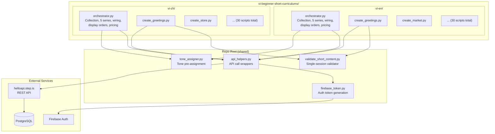
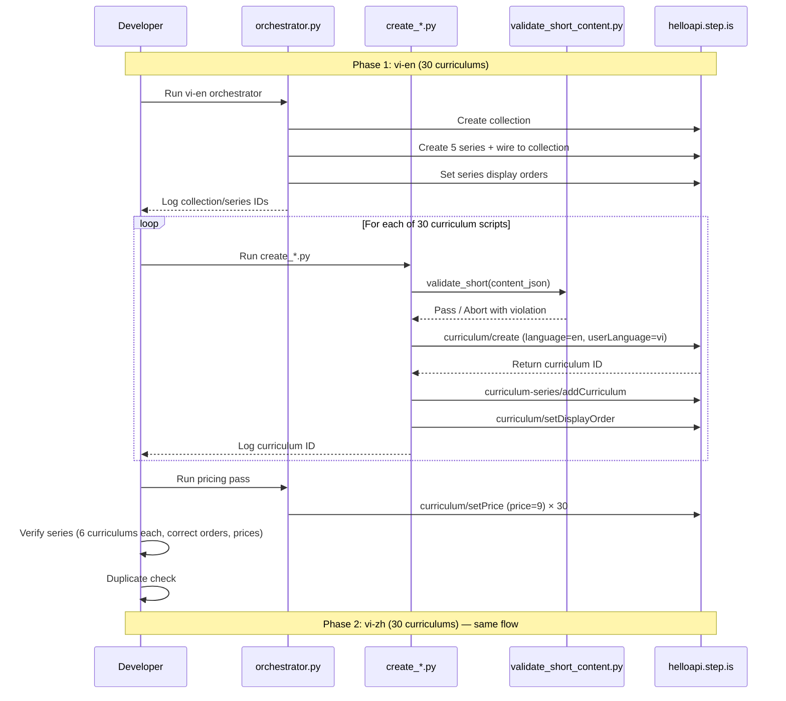

# Design Document: Vi Beginner Short Curriculums

## Overview

This design covers the creation of 60 short, beginner-level, single-session curriculums: 30 for vi-en (Vietnamese learners studying English) and 30 for vi-zh (Vietnamese learners studying Chinese). Each curriculum is a self-contained ~15-30 minute learning experience with 3-5 vocabulary words, a single learning session, and a price of 9 credits.

The system reuses the existing architecture pattern: one Python script per curriculum with hand-crafted content, one orchestrator per language pair for infrastructure (collections, series, wiring, display orders, pricing), and validation before upload. All scripts authenticate via `firebase_token.py` with UID `zs5AMpVfqkcfDf8CJ9qrXdH58d73`.

### Key Design Decisions

1. **Reuse repo-root `api_helpers.py`**: The existing shared API helper at the repo root already wraps all needed endpoints (`create_curriculum`, `add_to_series`, `set_display_order`, `create_collection`, `create_series`, etc.). Scripts import it via `sys.path` manipulation. No need to duplicate.

2. **Reuse repo-root `tone_assigner.py`**: The existing tone assigner supports configurable `num_collections`, `series_per_collection`, and `curriculums_per_series`. For this spec: 1 collection × 5 series × 6 curriculums per language pair. The function `assign_tones_for_language_pair(1, 5, 6)` produces the needed assignments.

3. **New `validate_short_content.py` at repo root**: The existing `validate_content.py` enforces 5 sessions and 18 vocab words — both wrong for the short format. A new validator adapted for single-session, 3-5 word curriculums is needed. It shares most logic (top-level checks, activity checks, strip-key checks, flashcard consistency) but replaces session count and vocab distribution checks.

4. **4 activity-sequence templates**: Each `Skill_Focus_Target` has a fixed activity order. The template is enforced by the validator and documented in each script. No template code generates text — only the activity structure (types, order) is templated.

5. **Pricing via orchestrator**: The orchestrator calls `curriculum/setPrice` with `price: 9` for each curriculum after creation, rather than embedding pricing in individual scripts. This keeps pricing centralized and easy to verify.

6. **No `vocabLevel3` anywhere; `vocabLevel1`/`vocabLevel2` only in `balanced_skills`**: Reduces cognitive load for beginners. The validator enforces this constraint.

7. **Writing activities are heavily scaffolded**: `writingSentence` prompts include full example sentences with substitution patterns. `writingParagraph` is a guided 2-3 sentence fill-in task, not free composition. This is a beginner-specific adaptation.

## Architecture



### Execution Flow



## Components and Interfaces

### 1. Orchestrator Script (`orchestrator.py`, one per language pair)

Responsibilities:
- Create 1 collection via `curriculum-collection/create` with Vietnamese title and informative description
- Create 5 series via `curriculum-series/create` with Vietnamese titles and descriptions (≤255 chars, tone-assigned)
- Wire series to collection via `curriculum-collection/addSeriesToCollection`
- Set series display orders (1-5) via `curriculum-series/setDisplayOrder`
- After all curriculums are created: call `curriculum/setPrice` with `price: 9` for each
- Pre-compute and log tone assignments using `tone_assigner.assign_tones_for_language_pair(1, 5, 6)`
- Output all IDs to stdout

```python
# Uses: api_helpers.py, tone_assigner.py
# No arguments — configuration is inline
# Outputs: collection ID, 5 series IDs, tone assignment table
```

### 2. Curriculum Creation Script (`create_*.py`, 60 total)

One per curriculum. Responsibilities:
- Define hand-crafted curriculum content JSON (title, description, preview, 1 session with activities)
- Call `validate_short(content)` before upload
- Upload via `api_helpers.create_curriculum(content, language, user_language)`
- Add to series via `api_helpers.add_to_series(series_id, curriculum_id)`
- Set display order via `api_helpers.set_display_order(curriculum_id, order)`
- Log curriculum ID and title

```python
# Uses: validate_short_content.py, api_helpers.py
# Inline: series_id, display_order, all hand-crafted text content
```

### 3. Short Content Validator (`validate_short_content.py`, repo root)

Adapted from `validate_content.py` for the single-session, 3-5 word format.

```python
def validate_short(content: dict) -> None:
    """
    Validates short curriculum content JSON. Raises ValueError on failure.

    Checks:
    - Top-level structure (title, description, preview.text, contentTypeTags)
    - Exactly 1 learning session with title and activities
    - Activity structure (activityType, title, description, data)
    - Activity-type-specific data rules (vocabList, writingSentence, writingParagraph)
    - viewFlashcards/speakFlashcards vocabList consistency
    - No strip-keys anywhere in JSON tree
    - Between 3 and 5 unique vocabulary words total
    - No vocabLevel3 activities
    - vocabList contains lowercase strings, field name is vocabList (not words)
    """
```

Shared logic reused from `validate_content.py` (imported or copied):
- `_check_strip_keys()` — identical
- `_validate_top_level()` — identical
- `_validate_activity()` — identical
- `_validate_activity_data()` — identical
- `_validate_vocab_list()` — identical
- `_validate_writing_sentence()` — identical
- `_validate_writing_paragraph()` — identical
- `_validate_flashcard_consistency()` — identical

New/modified logic:
- `_validate_sessions_short()` — exactly 1 session (not 5)
- `_validate_vocabulary_distribution_short()` — 3-5 unique words (not 18 with 6-per-session)
- `_validate_no_vocab_level3()` — rejects vocabLevel3 activities

### 4. Existing Shared Modules (no changes)

- **`api_helpers.py`** (repo root): All needed API wrappers already exist. The `set_price` function is not yet present — it needs to be added.
- **`tone_assigner.py`** (repo root): `assign_tones_for_language_pair(1, 5, 6)` produces the correct structure for 1 collection, 5 series, 6 curriculums per series.
- **`firebase_token.py`** (repo root): Auth token generation, unchanged.

### 5. `set_price` Addition to `api_helpers.py`

The existing `api_helpers.py` lacks a `set_price` function. Add:

```python
def set_price(curriculum_id: str, price: int) -> None:
    """Set curriculum price."""
    token = get_token()
    res = requests.post(
        f"{API_BASE}/curriculum/setPrice",
        json={
            "firebaseIdToken": token,
            "id": curriculum_id,
            "price": price,
        },
        timeout=TIMEOUT,
    )
    res.raise_for_status()
    logger.info("Set price %d on curriculum %s", price, curriculum_id)
```

## Data Models

### Short Curriculum Content JSON Structure

```json
{
  "title": "Chào hỏi và giới thiệu",
  "contentTypeTags": [],
  "description": "Multi-paragraph persuasive copy with ALL-CAPS headline...",
  "preview": {
    "text": "~100-120 word expanded persuasive copy..."
  },
  "learningSessions": [
    {
      "title": "Bài học",
      "activities": [
        { "activityType": "introAudio", "title": "...", "description": "...", "data": { "text": "..." } },
        { "activityType": "viewFlashcards", "title": "...", "description": "...", "data": { "vocabList": ["hello", "goodbye", "name"] } },
        ...
      ]
    }
  ]
}
```

### Activity Templates by Skill Focus Target

| Template | Activity Sequence | Notes |
|----------|------------------|-------|
| `speaking_focus` | introAudio → viewFlashcards → speakFlashcards → reading → speakReading → readAlong → introAudio(farewell) | Heavy on speak activities |
| `writing_lover` | introAudio → viewFlashcards → reading → readAlong → writingSentence → writingParagraph → introAudio(farewell) | Scaffolded writing tasks |
| `reader` | introAudio → viewFlashcards → speakFlashcards → reading → readAlong → introAudio(farewell) | Longer reading passage |
| `balanced_skills` | introAudio → viewFlashcards → speakFlashcards → vocabLevel1 → vocabLevel2 → reading → speakReading → readAlong → writingSentence → introAudio(farewell) | Covers all skill areas |

### Skill Focus Distribution (per language pair, 30 curriculums)

| Skill Focus | Count | Distribution across 5 series (6 each) |
|-------------|-------|---------------------------------------|
| speaking_focus | 8 | ~1-2 per series |
| writing_lover | 8 | ~1-2 per series |
| reader | 7 | ~1-2 per series |
| balanced_skills | 7 | ~1-2 per series |

Constraint: no two adjacent curriculums within a series share the same skill focus target.

### Collection/Series Hierarchy (per language pair)

```
Collection: "Tiếng Anh cơ bản — Bài học ngắn" (vi-en) / "Tiếng Trung cơ bản — Bài học ngắn" (vi-zh)
├── Series 1: Everyday Life (6 curriculums)
├── Series 2: Family and Relationships (6 curriculums)
├── Series 3: School and Work (6 curriculums)
├── Series 4: Food and Health (6 curriculums)
└── Series 5: Travel and Places (6 curriculums)
```

### Language Pair Configuration

| Pair | userLanguage | language | Curriculums | Collections | Series |
|------|-------------|----------|-------------|-------------|--------|
| vi-en | vi | en | 30 | 1 | 5 |
| vi-zh | vi | zh | 30 | 1 | 5 |
| **Total** | | | **60** | **2** | **10** |

### Directory Structure

```
vi-beginner-short-curriculums/
├── vi-en/
│   ├── orchestrator.py
│   ├── create_greetings.py
│   ├── create_market.py
│   ├── create_ordering_food.py
│   ├── ... (30 scripts total)
│   └── README.md
└── vi-zh/
    ├── orchestrator.py
    ├── create_greetings.py
    ├── create_store.py
    ├── create_restaurant.py
    ├── ... (30 scripts total)
    └── README.md
```

### API Call Sequence per Curriculum

```python
import sys
sys.path.insert(0, "/home/ubuntu/nspaceresearch/design-curriculums")
from validate_short_content import validate_short
from api_helpers import create_curriculum, add_to_series, set_display_order

# 1. Validate
validate_short(content)

# 2. Create
curriculum_id = create_curriculum(content, language="en", user_language="vi")

# 3. Add to series
add_to_series(series_id, curriculum_id)

# 4. Set display order
set_display_order(curriculum_id, order=1)

# Price is set by orchestrator after all curriculums are created
```


## Correctness Properties

*A property is a characteristic or behavior that should hold true across all valid executions of a system — essentially, a formal statement about what the system should do. Properties serve as the bridge between human-readable specifications and machine-verifiable correctness guarantees.*

The testable logic in this project is the `validate_short_content.py` module — a pure function that checks curriculum JSON structure before upload. The tone assignment logic is already tested by the existing `tone_assigner.py` property tests from the multilingual-curriculum-expansion spec and does not need new properties here.

Many requirements (content quality, persuasive copy, language register, topic coverage, documentation, execution workflow) describe hand-written content and process — these are not amenable to automated property testing and are covered by manual review and integration checks.

### Property 1: Top-level structure validation

*For any* curriculum content JSON, the validator SHALL accept it only if it has non-null, non-empty `title`, `description`, `preview.text` fields and a `contentTypeTags` field at the top level. Content missing any of these fields SHALL be rejected with a specific violation message.

**Validates: Requirements 1.5, 13.1**

### Property 2: Single session invariant

*For any* curriculum content JSON, the validator SHALL accept it only if `learningSessions` is an array of exactly 1 element, where the session has a non-empty `title` string and a non-empty `activities` array.

**Validates: Requirements 1.1, 13.2**

### Property 3: Vocabulary count invariant

*For any* curriculum content JSON, the validator SHALL accept it only if the total unique vocabulary words across all vocab activities in the single session is between 3 and 5 (inclusive).

**Validates: Requirements 1.2, 13.9**

### Property 4: Activity structure completeness

*For any* activity in any curriculum content JSON, the validator SHALL accept it only if the activity has `activityType` (not `type`), `title`, `description`, and `data` fields, with `activityType` being one of the valid values (`introAudio`, `viewFlashcards`, `speakFlashcards`, `vocabLevel1`, `vocabLevel2`, `reading`, `speakReading`, `readAlong`, `writingSentence`, `writingParagraph`), and all content fields inside `data`.

**Validates: Requirements 12.1, 12.2, 12.5, 13.3, 13.4**

### Property 5: VocabList format enforcement

*For any* viewFlashcards, speakFlashcards, vocabLevel1, or vocabLevel2 activity, the validator SHALL accept it only if `data.vocabList` is a non-empty array of lowercase strings. The field name must be `vocabList` (never `words`). Any uppercase characters, non-string elements, or use of `words` as the field name SHALL be rejected.

**Validates: Requirements 12.3, 13.5**

### Property 6: Flashcard vocabList consistency

*For any* session containing both a viewFlashcards and a speakFlashcards activity, the validator SHALL accept it only if both activities have identical `vocabList` arrays (same elements in the same order).

**Validates: Requirements 12.4, 13.6**

### Property 7: Writing activity structure

*For any* writingSentence activity, the validator SHALL accept it only if `data.vocabList` is present, `data.items` is a non-empty array, and each item has non-empty `prompt` and `targetVocab` strings. *For any* writingParagraph activity, the validator SHALL accept it only if `data.vocabList` is present, `data.instructions` is a non-empty string, and `data.prompts` is an array of strings with length ≥ 2.

**Validates: Requirements 12.6, 12.7, 13.7**

### Property 8: Strip keys exclusion

*For any* curriculum content JSON, the validator SHALL reject it if any of the auto-generated strip keys (`mp3Url`, `illustrationSet`, `chapterBookmarks`, `segments`, `whiteboardItems`, `userReadingId`, `lessonUniqueId`, `curriculumTags`, `taskId`, `imageId`) appear anywhere in the JSON tree at any depth.

**Validates: Requirements 1.6, 13.8**

### Property 9: No vocabLevel3 activities

*For any* curriculum content JSON, the validator SHALL reject it if any activity has `activityType` of `vocabLevel3`. This constraint reduces cognitive load for beginners.

**Validates: Requirements 11.5**

### Property 10: Validator rejects invalid content with specific message

*For any* curriculum content JSON that violates any structural rule, the validator SHALL raise a `ValueError` (not silently pass) and the error message SHALL be a non-empty string identifying the specific violation.

**Validates: Requirements 13.10**

## Error Handling

### API Call Failures

- If `curriculum/create` fails, the script logs the error with curriculum title and series context, then continues to the next curriculum (per Requirement 14.8)
- If `curriculum-series/addCurriculum` or `curriculum/setDisplayOrder` fails after successful creation, the script logs the curriculum ID and the failed operation for manual recovery
- Network timeouts: scripts use `requests` with a 30-second timeout; failures are logged and the script moves on

### Validation Failures

- `validate_short_content.py` raises `ValueError` with a specific violation message
- Each curriculum script wraps validate + upload in try/except that catches `ValueError` and prints the violation without uploading
- Validation runs before any API call — no partial uploads from invalid content

### Pricing Failures

- The orchestrator's pricing pass logs any `setPrice` failures with the curriculum ID
- Failed pricing can be retried independently since it's a separate API call

### Duplicate Handling

- After completing each language pair, a duplicate check query runs for each curriculum title
- If duplicates found: keep earliest (by `created_at`), remove extras from series first, then delete the curriculum
- Duplicate check SQL is documented in each README

### Recovery Strategy

- Each curriculum script is idempotent in intent — re-running creates a duplicate to resolve
- The orchestrator is NOT idempotent — collections and series should only be created once
- All IDs are logged to stdout and documented in README for manual recovery

## Testing Strategy

### Property-Based Tests (Short Content Validator)

The `validate_short_content.py` module is a pure function with clear input/output behavior — ideal for property-based testing. Use `hypothesis` (Python PBT library) to generate random short curriculum content JSON and verify the validator's behavior.

- **Library**: `hypothesis` for Python
- **Minimum iterations**: 100 per property
- **Tag format**: `# Feature: vi-beginner-short-curriculums, Property N: <property_text>`
- Properties 1-10 test the validator against generated curriculum JSON with various structural mutations
- Each property test generates valid base content (single session, 3-5 words), then introduces specific mutations to verify the validator catches them

### Tone Assignment Tests

Tone assignment constraints (adjacency, distribution cap, palette validity) are already tested by the existing `tests/test_tone_assigner.py` property tests from the multilingual-curriculum-expansion spec. The `tone_assigner.assign_tones_for_language_pair(1, 5, 6)` call uses the same module with different parameters — no new tone tests needed.

### Unit Tests (Example-Based)

- Verify each of the 4 activity templates produces the correct activity type sequence
- Verify `speaking_focus` template: introAudio → viewFlashcards → speakFlashcards → reading → speakReading → readAlong → introAudio
- Verify `writing_lover` template: introAudio → viewFlashcards → reading → readAlong → writingSentence → writingParagraph → introAudio
- Verify `reader` template: introAudio → viewFlashcards → speakFlashcards → reading → readAlong → introAudio
- Verify `balanced_skills` template: introAudio → viewFlashcards → speakFlashcards → vocabLevel1 → vocabLevel2 → reading → speakReading → readAlong → writingSentence → introAudio
- Verify `reader`, `speaking_focus`, `writing_lover` templates do NOT include vocabLevel1/vocabLevel2
- Verify `balanced_skills` template does NOT include vocabLevel3
- Verify `api_helpers.set_price` sends correct params
- Verify no `setPublic` calls in any script

### Integration Tests (Post-Execution Verification)

Run after each language pair phase completes:

- Count query: verify exactly 30 curriculums per language pair
- Language homogeneity: all curriculums in a series share the same `language` and `userLanguage`
- Display order completeness: all curriculums have explicit display orders set
- Price verification: all 60 curriculums have `price = 9`
- Vocabulary uniqueness: no two curriculums within the same series share vocabulary words
- Duplicate check: query for duplicate titles per UID
- Series structure: each series has exactly 6 curriculums
- Skill focus distribution: 8 speaking_focus, 8 writing_lover, 7 reader, 7 balanced_skills per language pair

### Manual Review

Requirements not amenable to automated testing (persuasive copy quality, introAudio script quality, beginner-level calibration, language register, writing scaffolding quality) require manual review of a sample of curriculums per language pair before proceeding.
