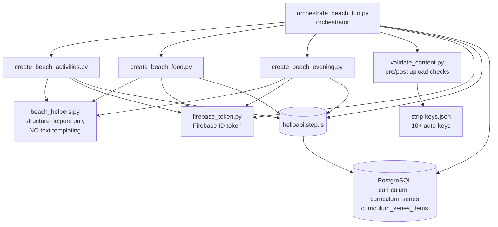
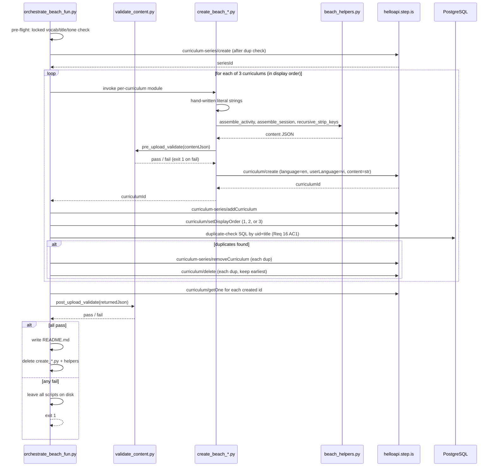
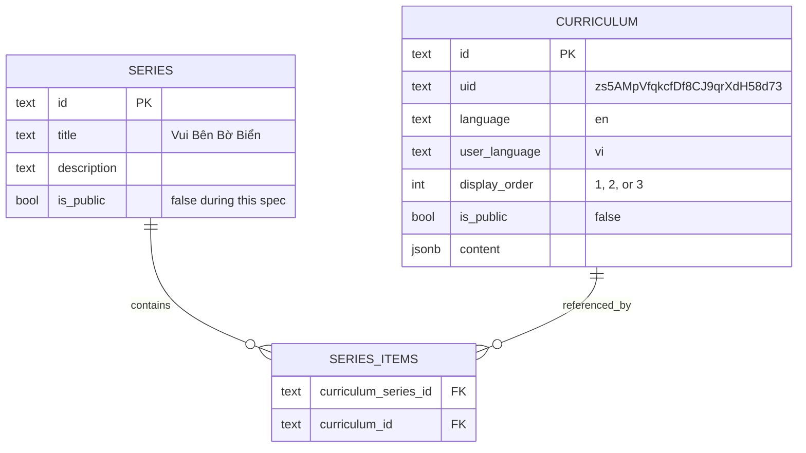

# Design Document — vi-en-beach-fun-curriculums

## Overview

This design specifies the architecture, locked content decisions, and validation
strategy for creating 3 new vi-en preintermediate curriculums on the
"having fun on the beach" theme, organised into a single Vietnamese-titled
series. The 3 curriculums are:

| # | Display Order | Vietnamese Title | English Sub-topic |
|---|---|---|---|
| 1 | 1 | Vui Chơi & Thể Thao Bãi Biển | Beach Activities & Sports |
| 2 | 2 | Ăn Uống & Thư Giãn Bên Biển | Beach Food & Relaxation |
| 3 | 3 | Hoàng Hôn & Lửa Trại Bên Biển | Sunset & Evening Beach Fun |

Each curriculum is created by **one standalone Python script per curriculum**
plus **one orchestrator script**, mirroring the proven customer-psychology
pattern (`vi-en-customer-psychology-curriculums`, series `zf2y1xqc`). All
learner-facing text is hand-written as literal Python string constants — no
f-strings, no `.format()`, no shared text builders (Requirement 12 AC3,
Requirement 13 AC1).

Pattern reused: 4-session speaking-focus curriculum, identical to
`yMq70CXQiBV27WEu` (salmon-cooking) and the 5 customer-psychology curriculums.

### Goals

- Produce 3 cohesive, individually-crafted curriculums covering one beach day
  (active morning → afternoon food/rest → sunset/evening)
- Lock all globally-constrained decisions in this design before any script is
  written (Requirement 3 AC7-8, Requirement 14 AC7)
- Validate every content JSON twice — pre-upload and post-upload — against the
  content-corruption rules (Requirement 15)
- Detect and resolve accidental duplicates after creation (Requirement 16)
- Leave only a `README.md` on disk after successful creation (Requirement 12 AC5-7)

### Non-Goals

- Beach safety / lifeguard / marine-biology content (excluded by spec intro)
- Audio rendering, illustration generation, public-flag toggling
- Adding the new series to any collection
- Upper-intermediate or advanced variants

## Architecture

### Component Layout



### Script Files (Requirement 12 AC1-2)

| File | Role | Calls |
|---|---|---|
| `create_beach_activities.py` | Builds curriculum-1 content JSON, calls `curriculum/create` | `curriculum/create` |
| `create_beach_food.py` | Builds curriculum-2 content JSON, calls `curriculum/create` | `curriculum/create` |
| `create_beach_evening.py` | Builds curriculum-3 content JSON, calls `curriculum/create` | `curriculum/create` |
| `orchestrate_beach_fun.py` | Series creation, addCurriculum, setDisplayOrder, post-upload validation, duplicate check, README write | `curriculum-series/create`, `curriculum-series/addCurriculum`, `curriculum/setDisplayOrder`, `curriculum/getOne`, `curriculum/delete`, `curriculum-series/removeCurriculum` |
| `beach_helpers.py` | **Non-text** structure helpers (assemble activity dict, attach `data`, recursive strip-keys, validation harness). MUST NOT format any learner-facing text. (Requirement 12 AC4) | — |
| `validate_content.py` | Pre-upload + post-upload validation runner (Requirement 15) | — |

### File / Folder Layout

```
design-curriculums/
├── .kiro/specs/vi-en-beach-fun-curriculums/
│   ├── requirements.md
│   ├── design.md           ← this file
│   ├── tasks.md
│   └── .config.kiro
│
├── vi-en-beach-fun-curriculums/      ← created during run; only README remains after success
│   ├── README.md                     ← persistent; populated post-creation (Req 12 AC5)
│   ├── create_beach_activities.py    ← deleted after DB verification (Req 12 AC7)
│   ├── create_beach_food.py          ← deleted after DB verification
│   ├── create_beach_evening.py       ← deleted after DB verification
│   ├── orchestrate_beach_fun.py      ← deleted after DB verification
│   ├── beach_helpers.py              ← deleted after DB verification
│   └── validate_content.py           ← deleted after DB verification
│
├── firebase_token.py                 ← repo-root helper (already exists)
├── firebase_serviceAccountKey.json   ← repo-root credentials (already exists)
└── strip-keys.json                   ← repo-root list (already exists)
```

If the database verification fails, **all scripts remain on disk**
(Requirement 12 AC8).

### Data Flow



### LOCKED Decisions (must not change after design approval)

These are locked in this design as required by Requirement 3 AC7,
Requirement 12 AC1, Requirement 14 AC7. Any deviation in scripts is a
validation failure.

#### Vocabulary Lists (LOCKED — Requirement 3 AC1-3, 6, 7)

**Curriculum 1 — Vui Chơi & Thể Thao Bãi Biển** (15 words, source pool = AC1)

| Group | Words (5) | Session theme |
|---|---|---|
| W1 | `splash`, `wave`, `swim`, `paddle`, `float` | Wading & shallow-water play |
| W2 | `surf`, `board`, `snorkel`, `goggles`, `fin` | Water sports with gear |
| W3 | `dive`, `sandcastle`, `frisbee`, `volleyball`, `kite` | Dives & sand games |

**Curriculum 2 — Ăn Uống & Thư Giãn Bên Biển** (15 words, source pool = AC2)

| Group | Words (5) | Session theme |
|---|---|---|
| W1 | `picnic`, `basket`, `towel`, `sandals`, `sunscreen` | Setting up the beach picnic |
| W2 | `grill`, `snack`, `coconut`, `smoothie`, `umbrella` | Snacks & drinks under shade |
| W3 | `lounge`, `tan`, `doze`, `breeze`, `hammock` | Slow afternoon relaxing |

**Curriculum 3 — Hoàng Hôn & Lửa Trại Bên Biển** (15 words, source pool = AC3)

| Group | Words (5) | Session theme |
|---|---|---|
| W1 | `sunset`, `twilight`, `shore`, `tide`, `glow` | Watching the sunset |
| W2 | `bonfire`, `firelight`, `marshmallow`, `blanket`, `gather` | Bonfire warmth |
| W3 | `stargaze`, `lantern`, `guitar`, `laughter`, `drift` | Stargazing & evening sounds |

Total: **45 distinct lowercase ASCII English words** across the 3 curriculums.
Zero overlap (verified by union check, Requirement 3 AC6, Requirement 14 AC3).

#### Curriculum Titles (LOCKED — Requirement 4)

| # | Vietnamese Title | Word Count | English Gloss |
|---|---|---|---|
| 1 | Vui Chơi & Thể Thao Bãi Biển | 5 | Fun & Sports at the Beach |
| 2 | Ăn Uống & Thư Giãn Bên Biển | 6 | Eating & Relaxing by the Sea |
| 3 | Hoàng Hôn & Lửa Trại Bên Biển | 6 | Sunset & Bonfire by the Sea |

All titles satisfy Requirement 4 AC1-3 (3–8 words, Vietnamese with diacritics,
Title Case for content words), AC4 (no level/series/skill/audience tokens),
AC6 (case-insensitive uniqueness), AC7 (do not repeat the series title; each
contains a distinct content word — `Vui Chơi` / `Ăn Uống` / `Hoàng Hôn`).

#### Series Title (LOCKED)

> **Vui Bên Bờ Biển** (4 words, 16 chars — within 1–100 chars per Requirement 10 AC1)

#### Description Tone Assignments (LOCKED — Requirement 5 AC3, Requirement 14 AC5)

| # | Curriculum | Headline Tone (from Tone_Palette) | Adjacent Distinctness |
|---|---|---|---|
| 1 | Beach Activities | `vivid_scenario` | — |
| 2 | Beach Food | `empathetic_observation` | ≠ #1 ✅ |
| 3 | Beach Evening | `metaphor_led` | ≠ #2 ✅ |

Each tone is used by exactly 1 curriculum (≤ 30% per tone, since 1/3 ≈ 33% ≤
the per-curriculum cap of 1, satisfying both Requirement 5 AC3 and the
steering rule "no single tone may exceed 30% of a batch" interpreted as
"at most one curriculum per tone in a 3-curriculum batch").

#### Series Description Tone (LOCKED — Requirement 5 AC7, Requirement 10 AC1)

> Tone: **`bold_declaration`** — different from curriculum-1's
> `vivid_scenario` headline tone (Requirement 5 AC7 satisfied).
> Vietnamese, 40–255 chars.

#### Farewell Tone Assignments (LOCKED — Requirement 6 AC5, Requirement 14 AC6)

3 of the 5 Farewell_Palette registers, each used exactly once:

| # | Curriculum | Farewell Register | Why |
|---|---|---|---|
| 1 | Beach Activities | `team_building_energy` | Group play, friends-on-the-sand mood |
| 2 | Beach Food | `practical_momentum` | Slow afternoon → "use these tomorrow" energy |
| 3 | Beach Evening | `quiet_awe` | Sunset / stars / firelight wonder |

Unused: `introspective_guide`, `warm_accountability`.

#### Display Order (LOCKED — Requirement 10 AC3, Requirement 14 AC1)

Beach_Activities=1 → Beach_Food=2 → Beach_Evening=3 (morning → afternoon →
evening progression across one beach day).

## Components and Interfaces

### `firebase_token.get_firebase_id_token(uid: str) -> str`

Existing repo-root helper. Returns Firebase ID token used as
`firebaseIdToken` body parameter on every authenticated call. Hard-failure if
the call raises or returns empty (Requirement 11 AC2-3).

UID hardcoded across all scripts: `zs5AMpVfqkcfDf8CJ9qrXdH58d73`
(Requirement 11 AC2, AC6).

### `beach_helpers.py` — non-text structure-only helpers

> **Constraint (Requirement 12 AC4, Requirement 13 AC1):** these helpers
> assemble dicts from already-written literal strings. They MUST NOT take
> learner-facing prose as a template, MUST NOT call `.format()`,
> `string.Template`, f-strings, or any substitution mechanism on prose.

```
make_intro_audio(title: str, description: str, text: str) -> dict
    # all three args are literal strings written in the per-curriculum script
make_view_flashcards(title: str, description: str, vocab_list: list[str]) -> dict
make_reading(title: str, description: str, text: str) -> dict
make_speak_reading(title: str, description: str, text: str) -> dict
make_read_along(title: str, description: str, text: str) -> dict
make_session(title: str, activities: list[dict]) -> dict
recursive_strip_keys(content: Any, strip_keys: set[str]) -> Any
    # post-order recursive removal; idempotent
recursive_find_keys(content: Any, keys: set[str]) -> list[str]
    # returns dotted paths of any matches; used for re-verify after strip
post_to_api(endpoint: str, body: dict) -> dict
    # injects firebaseIdToken; raises on non-2xx with endpoint+status+body
```

The `make_*` helpers do nothing more than place the already-written string
into the schema-compliant key path:

```python
def make_intro_audio(title, description, text):
    return {
        "activityType": "introAudio",
        "title": title,
        "description": description,
        "data": {"text": text},
    }
```

### `validate_content.py` — pre-upload and post-upload validators

```
pre_upload_validate(content: dict, curriculum_label: str) -> None
    # raises ValidationError on first failure with a single stderr message:
    #   "[<curriculum_label>] Req 15.<N> failed at <field-path>"
    # caller exits 1

post_upload_validate(content: dict, curriculum_id: str) -> bool
    # returns True/False; caller aggregates per-curriculum pass/fail to stdout
```

Both run the full check set (Requirement 15 AC1-7). The post-upload variant
is invoked against the JSON returned by `curriculum/getOne`, so generated
keys (`mp3Url`, etc.) are *expected* in the post-upload payload and are not
treated as failures during the post-upload run — the post-upload check
verifies only the structure preserved from creation, not strip-keys absence.

> **Clarification on Strip_Keys post-upload behaviour:** Strip_Keys absence
> (Requirement 15 AC6) is a *pre-upload* invariant. After upload the platform
> may legitimately add `mp3Url`, `lessonUniqueId`, `taskId`, `imageId` etc.
> Therefore the post-upload validator skips check AC6.

### `orchestrate_beach_fun.py` — entry point

API call sequence (Requirement 12 AC2, Requirement 11):

```
1.  Load locked design constants (vocab, titles, tones, display orders) from
    a top-of-file module-level dict — these are the truth source.
2.  duplicate_check_series(title="Vui Bên Bờ Biển")  [Req 16 AC7]
        → if exists, reuse seriesId; skip create
        → else POST curriculum-series/create
3.  for curriculum_label in ["activities", "food", "evening"]:
        a. import the per-curriculum module
        b. content = module.build_content()             [literal text]
        c. content = recursive_strip_keys(content, STRIP_KEYS)  [Req 9 AC3]
        d. assert recursive_find_keys(content, STRIP_KEYS) == []  [Req 9 AC4-5]
        e. pre_upload_validate(content, curriculum_label)        [Req 15 AC1-7]
        f. POST curriculum/create with body:
             {firebaseIdToken, language="en", userLanguage="vi",
              content=json.dumps(content)}              [Req 11 AC1]
            → curriculumId
        g. duplicate_check_curriculum(title)            [Req 16 AC1]
            → if >1 row: keep earliest, remove from series and delete others
        h. POST curriculum-series/addCurriculum
        i. POST curriculum/setDisplayOrder (1, 2, or 3) [Req 10 AC3]
4.  post_upload_validate via curriculum/getOne for each id  [Req 15 AC10]
5.  if all pass:
        write README.md
        delete create_*.py + helpers
    else:
        leave scripts on disk; print failures; exit 1
```

Halting on any non-2xx response halts subsequent dependent calls
(Requirement 11 AC7). Failure between curriculum/create and addCurriculum
is acceptable — the curriculum stays orphaned and is detected next run by
duplicate check; cleanup is manual if required.

## Data Models

### Top-Level Curriculum Content JSON (Requirement 8)

```jsonc
{
  "title": "<Vietnamese, 1–255 chars>",                  // Req 8.1
  "description": "<Vietnamese, ≥200 chars, ≥3 paragraphs, opens ALL-CAPS Vietnamese headline 3–12 words>", // Req 5.2, Req 8.2
  "preview": {
    "text": "<Vietnamese, 120–250 words, opens with vivid hook naming a beach setting element, names all 15 vocab words verbatim, references all 4 sessions in order>" // Req 5.4, Req 8.3
  },
  "learningSessions": [ /* exactly 4 session objects */ ], // Req 8.4
  "contentTypeTags": [],                                 // Req 8.5  (empty per Req 8.5 / steering allows [])
  "lengthTags": ["medium"],                              // Req 8.6
  "skillFocusTags": ["speaking_focus"],                  // Req 8.7
  "difficultyTags": [
    "preintermediate",
    "vocab_preintermediate",
    "reading_preintermediate"
  ]                                                      // Req 8.8 — exact order, casing
}
```

> Note: `skillFocusTags` and `difficultyTags` appear in `strip-keys.json` as
> they are auto-generated for many curriculums, but the requirements
> (Req 8.7, Req 8.8) specify them as inputs. We follow the requirements: we
> emit these fields explicitly and do **not** treat them as strip-keys for
> this spec. The `recursive_strip_keys` helper uses an explicit allow-list of
> truly-generated keys: `mp3Url`, `illustrationSet`, `chapterBookmarks`,
> `segments`, `whiteboardItems`, `userReadingId`, `lessonUniqueId`,
> `curriculumTags`, `taskId`, `imageId`, `practiceMinutes`, `practiceTime`
> (i.e. strip-keys.json minus the explicit-emit set). This is consistent
> with the customer-psychology pattern that produced the same shape.

### `learningSessions[i]` (Requirement 1)

```jsonc
{
  "title": "Phần 1" | "Phần 2" | "Phần 3" | "Ôn tập",       // Req 7.6
  "activities": [ /* exactly 5 activities, ordered */ ]      // Req 1.5–1.8
}
```

For `i ∈ {0,1,2}`: activities ordered

```
introAudio → viewFlashcards(W_{i+1}) → reading → readAlong → speakReading
```

For `i = 3` (review): activities ordered

```
introAudio(farewell) → viewFlashcards(W1∪W2∪W3) → reading(combined) → readAlong → speakReading
```

### Activity Schemas (Requirement 7, Requirement 15 AC3-5)

#### `introAudio`

```jsonc
{
  "activityType": "introAudio",                  // not "type" (Req 7.7)
  "title": "<1–100 chars; e.g. 'Giới thiệu từ vựng', 'Lời tạm biệt'>", // Req 7.5
  "description": "<10–300 chars summary>",
  "data": { "text": "<Vietnamese script, 1–5000 chars>" }   // Req 7.11
}
```

For sessions 1–3 the script teaches the 5 W-group words with parts of speech,
Vietnamese definitions (8–40 words each), one English example per word
(6–20 words), and pronunciation guidance (Requirement 6 AC1). For session 4
the script is a 400–600-word farewell containing all four required elements
(Requirement 6 AC4) and the session-specific farewell register from the
locked palette assignment.

#### `viewFlashcards`

```jsonc
{
  "activityType": "viewFlashcards",
  "title": "Flashcards: <topic, 1–180 chars>",                    // Req 7.2
  "description": "Học N từ: word1, word2, ...",                   // Req 7.2
  "data": {
    "vocabList": ["lowercase", "ascii", "only", "..."]             // Req 7.9, Req 3.5, Req 15.5
  }
}
```

`description` is computed once at script-write time from the literal
`vocabList` of that activity (the helper joins with `", "`). This is **not**
learner-facing prose generation — it is a structural concatenation of the
vocab list itself, allowed under Requirement 12 AC4 (helpers may "assemble
activity dicts from already-written text").

#### `reading` and `speakReading`

```jsonc
{
  "activityType": "reading" | "speakReading",
  "title": "Đọc: <topic, 1–180 chars>",                            // Req 7.3
  "description": "<first 80 chars of data.text ± 5>",
  "data": { "text": "<English, 1–10000 chars>" }                   // Req 7.10
}
```

The reading passage and speakReading passage **share the same `data.text`**
within a session (single hand-written passage is reused at the dict
assembly step — this is structural reuse of an already-written literal
string, not text generation).

Sessions 1–3: 2–4 sentences, 6–20 words each (Req 2.1).
Session 4: 6–12 sentences, 6–20 words each, combines the 3 prior narrative
threads (Req 2.7).
All reading passages: first-person only, begin with `I ` or `My `, no quoted
dialogue, no distressing scenarios (Req 2.2, 2.8, 2.9).

#### `readAlong`

```jsonc
{
  "activityType": "readAlong",
  "title": "Nghe: <topic, 1–180 chars>",                           // Req 7.4
  "description": "Nghe đoạn văn vừa đọc và theo dõi.",             // Req 7.4 — exact string
  "data": { "text": "<same passage as reading>" }
}
```

### Per-Curriculum Title-Topic Pairs

To satisfy the "<topic>" portion of activity titles, each curriculum
hand-writes 4 short Vietnamese topic phrases (one per session). Each phrase
is a literal string in the per-curriculum script, not a template.

Example for Beach Activities (illustrative; final wording locked when scripts
are written):

| Session | Topic phrase (Vietnamese) | Used in |
|---|---|---|
| 1 | Vui đùa với sóng | Flashcards: ..., Đọc: ..., Nghe: ... |
| 2 | Lặn biển và lướt sóng | … |
| 3 | Trò chơi trên cát | … |
| 4 | Ôn tập một ngày vui | … |

### Top-Level Curriculum Mapping to Series



