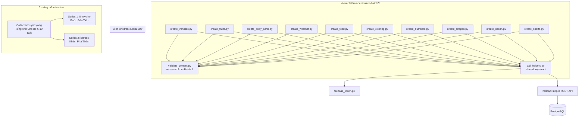
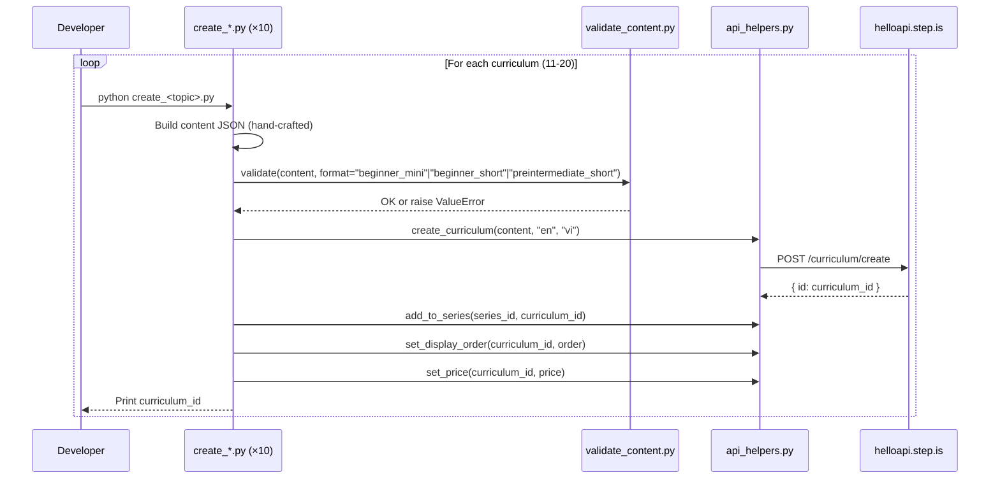

# Design Document: Vietnamese-English Children's Curriculum — Batch 2

## Overview

This design covers the creation of 10 MORE English-learning curriculums for Vietnamese children aged 6-10 (Batch 2), expanding the existing collection "Tiếng Anh Cho Bé 6-10 Tuổi". The system consists of:

- **10 standalone Python scripts** — one per curriculum, each containing hand-crafted child-friendly content
- **Existing content validator** — reuses `vi-en-children-curriculum/validate_content.py` (must be recreated from Batch 1 spec since it was deleted after Batch 1 execution)
- **Shared API helpers** — reuses the existing root-level `api_helpers.py` module for all REST API calls

No orchestrator is needed — Batch 2 adds curriculums to the existing collection (ID: `uyw1ywsg`) and series (Series 1: `8ncwoino`, Series 2: `l8l9bexl`).

The language pair is `userLanguage="vi"` (Vietnamese speakers), `language="en"` (learning English). All marketing text (titles, descriptions, previews) is in Vietnamese, targeting parents. All learner-facing content uses a warm, playful, bilingual tone appropriate for children aged 6-10.

### Key Design Decisions

1. **No orchestrator** — Batch 1 already created the collection and 2 series. Batch 2 scripts directly reference the existing series IDs.

2. **Recreate children-specific validator** — The `vi-en-children-curriculum/validate_content.py` was deleted after Batch 1 execution (per cleanup task). It must be recreated identically for Batch 2 to import. The validator supports three formats: `beginner_mini`, `beginner_short`, `preintermediate_short`.

3. **Display orders continue from Batch 1** — Series 1 currently has display orders 1-6, so Batch 2 starts at 7. Series 2 currently has display orders 1-4, so Batch 2 starts at 5.

4. **Zero vocabulary overlap** — All 10 Batch 2 curriculums use completely different words from Batch 1's 120+ words and from each other.

5. **Tone adjacency with Batch 1** — The first Batch 2 curriculum in each series must avoid the tone of the last Batch 1 curriculum in that series.

## Architecture



### Execution Flow



## Components and Interfaces

### 1. validate_content.py (Recreated)

Children-specific content validator supporting three curriculum formats. Recreated in `vi-en-children-curriculum/` from the Batch 1 design specification.

**Interface:**
```python
def validate(content: dict, format: str) -> None:
    """
    Validates curriculum content JSON for children's curriculums.
    
    Args:
        content: The curriculum content dict
        format: One of "beginner_mini", "beginner_short", "preintermediate_short"
    
    Raises:
        ValueError with specific violation message on any failure.
    """
```

**Format configurations:**

| Format | Sessions | Vocab Words | Forbidden Activities |
|--------|----------|-------------|---------------------|
| `beginner_mini` | 1 | 3-5 | writingParagraph, vocabLevel3, vocabLevel1, vocabLevel2 |
| `beginner_short` | 4 | 8-10 | writingParagraph, vocabLevel3 |
| `preintermediate_short` | 4 | 10-12 | writingParagraph, vocabLevel3 |

**Validation checks:**
1. Top-level structure: `title`, `description`, `preview.text`, `contentTypeTags: []`, `learningSessions`
2. Session count matches format
3. Each session has `title` and non-empty `activities` array
4. Each activity has `activityType` (not `type`), `title`, `description`, `data` object
5. Valid `activityType` values (from allowed set, excluding forbidden per format)
6. `vocabList` is array of lowercase strings, field name is `vocabList` (not `words`)
7. `viewFlashcards`/`speakFlashcards` in same session have identical `vocabList`
8. `writingSentence` has `data.vocabList`, `data.items` with `prompt` and `targetVocab`
9. No strip-keys anywhere in JSON tree
10. Total unique vocab count within expected range for format
11. No `writingParagraph` or `vocabLevel3` in any children's curriculum

### 2. Individual Curriculum Scripts (create_*.py × 10)

Each script is standalone and contains all hand-crafted content for one curriculum.

**Common interface pattern:**
```python
# create_<topic>.py
import sys
import json
import logging

sys.path.insert(0, "/home/ubuntu/nspaceresearch/design-curriculums")
sys.path.insert(0, "/home/ubuntu/nspaceresearch/design-curriculums/vi-en-children-curriculum")
from api_helpers import (
    create_curriculum, add_to_series, set_display_order, set_price
)
from validate_content import validate

SERIES_ID = "<8ncwoino|l8l9bexl>"
DISPLAY_ORDER = <N>
PRICE = <9|19|49>

def build_content() -> dict:
    """Build the curriculum content dict with all hand-crafted text."""
    return {
        "title": "...",
        "description": "...",
        "preview": {"text": "..."},
        "contentTypeTags": [],
        "learningSessions": [...]
    }

def main():
    content = build_content()
    validate(content, format="beginner_mini"|"beginner_short"|"preintermediate_short")
    curriculum_id = create_curriculum(content, "en", "vi")
    add_to_series(SERIES_ID, curriculum_id)
    set_display_order(curriculum_id, DISPLAY_ORDER)
    set_price(curriculum_id, PRICE)
    print(f"✅ Created: {curriculum_id}")

if __name__ == "__main__":
    main()
```

**Key constraint:** All text content (introAudio scripts, reading passages, descriptions, previews, writing prompts) is hand-written per curriculum. No template functions or string interpolation for learner-facing text.

### 3. Tone Assignment Table

**Adjacency constraints from Batch 1:**
- Series 1 last item (#6 "Một Ngày Ở Trường"): desc tone = `bold_declaration`, farewell tone = `warm_accountability`
- Series 2 last item (#4 "Lễ Hội Và Mùa"): desc tone = `surprising_fact`, farewell tone = `team_building_energy`

Therefore:
- Batch 2 Series 1 first item (order 7) must NOT use `bold_declaration` / `warm_accountability`
- Batch 2 Series 2 first item (order 5) must NOT use `surprising_fact` / `team_building_energy`

| # | Curriculum | Series | Order | Format | Desc Tone | Farewell Tone |
|---|-----------|--------|-------|--------|-----------|---------------|
| 11 | Xe Cộ Quanh Em | Bước Đầu Tiên | 7 | beginner_mini | vivid_scenario | quiet_awe |
| 12 | Trái Cây Ngon Lành | Bước Đầu Tiên | 8 | beginner_mini | provocative_question | practical_momentum |
| 13 | Cơ Thể Của Em | Bước Đầu Tiên | 9 | beginner_mini | empathetic_observation | introspective_guide |
| 14 | Thời Tiết Hôm Nay | Bước Đầu Tiên | 10 | beginner_short | surprising_fact | warm_accountability |
| 15 | Bữa Ăn Vui Vẻ | Bước Đầu Tiên | 11 | beginner_short | metaphor_led | team_building_energy |
| 16 | Tủ Quần Áo | Bước Đầu Tiên | 12 | beginner_short | bold_declaration | quiet_awe |
| 17 | Đếm Và Khám Phá | Khám Phá Thêm | 5 | preintermediate_short | empathetic_observation | practical_momentum |
| 18 | Hình Dạng Kỳ Thú | Khám Phá Thêm | 6 | preintermediate_short | provocative_question | warm_accountability |
| 19 | Đại Dương Xanh | Khám Phá Thêm | 7 | preintermediate_short | vivid_scenario | introspective_guide |
| 20 | Thể Thao Sôi Động | Khám Phá Thêm | 8 | preintermediate_short | bold_declaration | team_building_energy |

**Tone distribution verification (10 Batch 2 curriculums):**
- Description tones: vivid_scenario ×2, provocative_question ×2, empathetic_observation ×2, surprising_fact ×1, metaphor_led ×1, bold_declaration ×2 — max 20%, all ≤30% ✓
- No adjacent description tone duplicates within Series 1 (vivid→provocative→empathetic→surprising→metaphor→bold) ✓
- No adjacent description tone duplicates within Series 2 (empathetic→provocative→vivid→bold) ✓
- Farewell tones: quiet_awe ×2, practical_momentum ×2, introspective_guide ×2, warm_accountability ×2, team_building_energy ×2 — evenly distributed ✓
- No adjacent farewell duplicates within Series 1 (quiet_awe→practical→introspective→warm→team→quiet_awe) ✓
- No adjacent farewell duplicates within Series 2 (practical→warm→introspective→team) ✓

**Adjacency with Batch 1 verified:**
- Series 1: Batch 1 last = bold_declaration/warm_accountability → Batch 2 first = vivid_scenario/quiet_awe ✓
- Series 2: Batch 1 last = surprising_fact/team_building_energy → Batch 2 first = empathetic_observation/practical_momentum ✓

### 4. Activity Templates

#### Beginner Mini (1 session, 3-5 words, price 9)

```
Session 1:
  1. introAudio — welcome + teach all words with playful context (200-350 words)
  2. viewFlashcards — all words
  3. speakFlashcards — all words
  4. reading — short passage (40-60 words)
  5. speakReading
  6. readAlong
  7. introAudio — farewell with vocab review and praise (200-400 words)
```

#### Beginner Short (4 sessions, 8-10 words in 2 groups, price 19)

```
Session 1 (Group 1):
  1. introAudio — welcome + teach group 1 words
  2. viewFlashcards (group 1)
  3. speakFlashcards (group 1)
  4. vocabLevel1 (group 1)
  5. reading — passage using group 1 words (60-80 words)
  6. readAlong
  7. introAudio — session wrap-up

Session 2 (Group 2):
  1. introAudio — recap group 1 + teach group 2 words
  2. viewFlashcards (group 2)
  3. speakFlashcards (group 2)
  4. vocabLevel1 (group 2)
  5. reading — passage using group 2 words (60-80 words)
  6. readAlong
  7. introAudio — session wrap-up

Session 3 (Review):
  1. introAudio — review intro
  2. viewFlashcards (all words)
  3. speakFlashcards (all words)
  4. vocabLevel1 (all words)
  5. vocabLevel2 (all words)
  6. writingSentence (3-4 items)
  7. introAudio — review wrap-up

Session 4 (Final):
  1. introAudio — final reading intro
  2. reading — combined passage (100-120 words)
  3. speakReading
  4. readAlong
  5. writingSentence (2-3 items)
  6. introAudio — farewell with full vocab review and celebration
```

#### Preintermediate Short (4 sessions, 10-12 words in 2-3 groups, price 49)

```
Session 1 (Group 1):
  1. introAudio — welcome + teach group 1 words
  2. viewFlashcards (group 1)
  3. speakFlashcards (group 1)
  4. vocabLevel1 (group 1)
  5. vocabLevel2 (group 1)
  6. reading — passage using group 1 words (80-100 words)
  7. speakReading
  8. readAlong
  9. introAudio — session wrap-up

Session 2 (Group 2):
  1. introAudio — recap group 1 + teach group 2 words
  2. viewFlashcards (group 2)
  3. speakFlashcards (group 2)
  4. vocabLevel1 (group 2)
  5. vocabLevel2 (group 2)
  6. reading — passage using group 2 words (80-100 words)
  7. speakReading
  8. readAlong
  9. introAudio — session wrap-up

Session 3 (Review):
  1. introAudio — review intro
  2. viewFlashcards (all words)
  3. speakFlashcards (all words)
  4. vocabLevel1 (all words)
  5. vocabLevel2 (all words)
  6. writingSentence (4-5 items)
  7. introAudio — review wrap-up

Session 4 (Final):
  1. introAudio — final reading intro
  2. reading — combined passage (150-180 words)
  3. speakReading
  4. readAlong
  5. writingSentence (3-4 items)
  6. introAudio — farewell with full vocab review and celebration
```

## Data Models

### Curriculum Content JSON Structure

```json
{
  "title": "Xe Cộ Quanh Em",
  "description": "Multi-paragraph Vietnamese persuasive copy for parents...",
  "preview": {
    "text": "Vietnamese preview text (~100-150 words)..."
  },
  "contentTypeTags": [],
  "learningSessions": [
    {
      "title": "Phần 1",
      "activities": [
        {
          "activityType": "introAudio",
          "title": "Chào mừng bé đến với Xe Cộ Quanh Em",
          "description": "Giới thiệu bài học về phương tiện giao thông",
          "data": {
            "text": "Xin chào các bé! Hôm nay chúng ta sẽ..."
          }
        },
        {
          "activityType": "viewFlashcards",
          "title": "Flashcards: Phương tiện",
          "description": "Học 5 từ: bus, truck, train, boat, plane",
          "data": {
            "vocabList": ["bus", "truck", "train", "boat", "plane"]
          }
        }
      ]
    }
  ]
}
```

### writingSentence Item Structure (for short/preintermediate)

```json
{
  "activityType": "writingSentence",
  "title": "Viết: Thời tiết",
  "description": "Viết câu tiếng Anh về thời tiết",
  "data": {
    "vocabList": ["sunny", "rainy", "windy", "hot", "cold"],
    "items": [
      {
        "prompt": "Viết một câu tiếng Anh dùng từ 'sunny'. Ví dụ: It is sunny today. Bé hãy thay 'today' bằng một từ khác nhé!",
        "targetVocab": "sunny"
      },
      {
        "prompt": "Viết một câu tiếng Anh dùng từ 'rainy'. Ví dụ: It is rainy outside. Bé hãy thay 'outside' bằng một từ khác nhé!",
        "targetVocab": "rainy"
      }
    ]
  }
}
```

### API Call Parameters

| API Endpoint | Key Parameters |
|---|---|
| `curriculum/create` | `firebaseIdToken`, `language: "en"`, `userLanguage: "vi"`, `content: JSON.stringify(content)` |
| `curriculum-series/addCurriculum` | `firebaseIdToken`, `curriculumSeriesId`, `curriculumId` |
| `curriculum/setDisplayOrder` | `firebaseIdToken`, `id`, `displayOrder` |
| `curriculum/setPrice` | `firebaseIdToken`, `id`, `price` |

### Vocabulary Lists (Batch 2)

| # | Curriculum | Words | Count |
|---|---|---|---|
| 11 | Xe Cộ Quanh Em | bus, truck, train, boat, plane | 5 |
| 12 | Trái Cây Ngon Lành | apple, banana, grape, mango, watermelon | 5 |
| 13 | Cơ Thể Của Em | hand, foot, eye, ear, nose | 5 |
| 14 | Thời Tiết Hôm Nay | sunny, rainy, windy, hot, cold, snow, storm, foggy, warm, cool | 10 |
| 15 | Bữa Ăn Vui Vẻ | rice, soup, egg, milk, bread, chicken, noodle, cake, cookie, juice | 10 |
| 16 | Tủ Quần Áo | shirt, pants, dress, shoes, hat, socks, jacket, skirt, scarf, gloves | 10 |
| 17 | Đếm Và Khám Phá | count, number, add, minus, equal, double, half, pair, dozen, zero, hundred, thousand | 12 |
| 18 | Hình Dạng Kỳ Thú | circle, square, triangle, rectangle, star, diamond, oval, cube, sphere, straight, corner, pattern | 12 |
| 19 | Đại Dương Xanh | whale, dolphin, shark, octopus, turtle, crab, jellyfish, seahorse, coral, wave, shell, seaweed | 12 |
| 20 | Thể Thao Sôi Động | soccer, swim, basketball, tennis, dance, stretch, throw, catch, goal, score, practice, champion | 12 |

**Overlap verification:** Zero overlap with Batch 1 vocabulary (checked against all 120+ Batch 1 words). Zero overlap between Batch 2 curriculums.

## Correctness Properties

Property-based testing is **NOT applicable** for Batch 2. The content validator (`vi-en-children-curriculum/validate_content.py`) was already comprehensively property-tested during Batch 1 with 8 Hypothesis properties covering:
- Valid content passes validation
- Forbidden activities rejected per format
- Strip keys rejected anywhere in JSON tree
- Activities missing required fields rejected
- Invalid activityType values rejected
- vocabList format enforced
- Flashcard vocabList consistency
- writingSentence structure enforced

Batch 2 reuses this validator without modification. No new pure functions or logic are introduced — the scripts are content-only (hand-crafted text) with integration calls to the existing API.

**Why PBT does not apply:**
- The 10 creation scripts are side-effect-only operations (API calls with hand-crafted content)
- The validator is already tested and unchanged
- Remaining verification is integration-level (SQL queries to confirm correct state in DB)

## Error Handling

### Validator Errors

Each curriculum script calls `validate()` before any API call. If validation fails, the script aborts with the error message — no partial upload occurs.

### API Call Errors

Each curriculum script follows this error handling pattern:

1. **Validation failure** → Script aborts immediately, prints the violation. No API calls made.
2. **`curriculum/create` failure** → Script logs the error with curriculum title and exits.
3. **`add_to_series` failure** → Curriculum exists but is orphaned. Script logs the error. Developer must manually add to series or delete the curriculum.
4. **`set_display_order` failure** → Curriculum exists in series but without explicit order. Script logs the error. Developer must manually set order.
5. **`set_price` failure** → Curriculum exists with default price. Script logs the error. Developer must manually set price.

### Duplicate Handling

After each curriculum creation, the script logs the curriculum ID. If a script is accidentally run twice, the developer runs the duplicate check query:

```sql
SELECT id, content->>'title' as title, created_at FROM curriculum
WHERE content->>'title' = '<title>'
AND uid = 'zs5AMpVfqkcfDf8CJ9qrXdH58d73'
AND uid NOT LIKE '%_deleted'
ORDER BY created_at;
```

Keep the earliest, delete extras (remove from series first, then delete curriculum).

## Testing Strategy

### No New Property-Based Tests

The existing validator property tests from Batch 1 cover all structural validation. Batch 2 does not introduce new testable logic.

### Integration Verification (Post-Execution)

After all 10 scripts run, verify via SQL queries:

```sql
-- Count all Batch 2 children's curriculums (expect 10)
SELECT COUNT(*) FROM curriculum
WHERE id IN (<list of 10 Batch 2 IDs>);

-- Verify language pair
SELECT id, content->>'title' as title, language, user_language
FROM curriculum WHERE id IN (<list of 10 Batch 2 IDs>);

-- Verify prices (9 for mini, 19 for short, 49 for preintermediate)
SELECT id, content->>'title' as title, price
FROM curriculum WHERE id IN (<list of 10 Batch 2 IDs>)
ORDER BY price, display_order;

-- Verify series membership and display orders (Series 1: orders 7-12, Series 2: orders 5-8)
SELECT cs.id as series_id, cs.title as series_title,
       c.id as curriculum_id, c.content->>'title' as curriculum_title,
       c.display_order, c.price
FROM curriculum_series cs
JOIN curriculum_series_items csi ON cs.id = csi.curriculum_series_id
JOIN curriculum c ON csi.curriculum_id = c.id
WHERE cs.id IN ('8ncwoino', 'l8l9bexl')
ORDER BY cs.id, c.display_order;

-- Verify no duplicates
SELECT content->>'title' as title, COUNT(*)
FROM curriculum
WHERE uid = 'zs5AMpVfqkcfDf8CJ9qrXdH58d73'
AND content->>'title' IN (<list of 10 Batch 2 titles>)
AND uid NOT LIKE '%_deleted'
GROUP BY content->>'title'
HAVING COUNT(*) > 1;
```

### Vocabulary Overlap Check

Before execution, verify in each script that:
1. No word appears in Batch 1 vocabulary (120+ words)
2. No word appears in another Batch 2 curriculum

### Smoke Tests

- Verify each script file exists in `vi-en-children-curriculum-batch2/`
- Verify no script calls `setPublic`
- Verify validator file exists at `vi-en-children-curriculum/validate_content.py`
