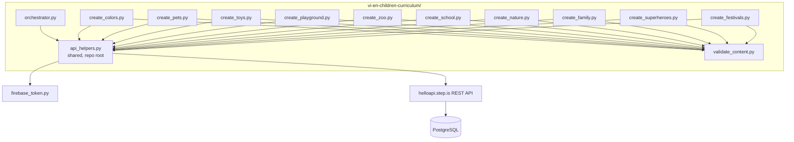
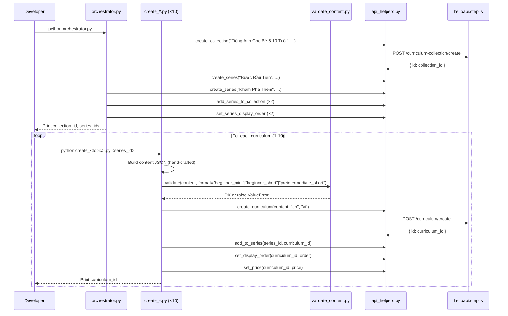

# Design Document: Vietnamese-English Children's Curriculum

## Overview

This design covers the creation of 10 English-learning curriculums for Vietnamese children aged 6-10, organized into 1 collection and 2 series. The system consists of:

- **10 standalone Python scripts** — one per curriculum, each containing hand-crafted child-friendly content
- **1 orchestrator script** — creates the collection, 2 series, wires them together, sets display orders and prices
- **1 content validator module** — validates curriculum JSON against corruption rules before upload
- **Shared API helpers** — reuses the existing `api_helpers.py` module for all REST API calls

The language pair is `userLanguage="vi"` (Vietnamese speakers), `language="en"` (learning English). All marketing text (titles, descriptions, previews) is in Vietnamese, targeting parents. All learner-facing content uses a warm, playful, bilingual tone appropriate for children aged 6-10.

### Key Design Decisions

1. **Reuse existing `api_helpers.py`** rather than creating a new one — the module already wraps all needed API endpoints with Firebase auth, error handling, and logging.

2. **Children-specific validator** — the existing `en-de/validate_content.py` is tailored for adult curriculums (expects exactly 4 or 5 sessions, exactly 6 words per learning session, requires `writingParagraph` for standard level). Children's curriculums have different session counts (1 or 4), different vocab counts (3-5, 8-10, or 10-12), and explicitly forbid `writingParagraph` and `vocabLevel3`. A new `validate_content.py` is needed in `vi-en-children-curriculum/`.

3. **No tone_assigner module** — with only 10 curriculums across 2 series, tone assignments are small enough to hard-code directly in each script and the orchestrator. The en-de project needed a tone assigner for 149 curriculums; here manual assignment with variety checks is simpler and more transparent.

4. **Three curriculum format templates** — beginner mini (1 session), beginner short (4 sessions), and preintermediate short (4 sessions) each have distinct activity sequences. The validator supports all three via a `format` parameter.

## Architecture



### Execution Flow



## Components and Interfaces

### 1. orchestrator.py

Creates the collection and 2 series, wires them together, sets display orders.

**Inputs:** None (all data hard-coded — collection/series titles, descriptions, tone assignments)

**Outputs:** Prints collection ID, series IDs, tone assignments for curriculum scripts

**API calls:**
- `curriculum-collection/create` — 1 call
- `curriculum-series/create` — 2 calls
- `curriculum-collection/addSeriesToCollection` — 2 calls
- `curriculum-series/setDisplayOrder` — 2 calls

**Tone assignments (hard-coded in orchestrator):**

| Entity | Tone |
|--------|------|
| Series 1: "Bước Đầu Tiên" | `bold_declaration` |
| Series 2: "Khám Phá Thêm" | `vivid_scenario` |

Curriculum description tones (no adjacent duplicates, no tone >30%):

| # | Curriculum | Series | Desc Tone | Farewell Tone |
|---|-----------|--------|-----------|---------------|
| 1 | Thế Giới Màu Sắc | Bước Đầu Tiên | provocative_question | warm_accountability |
| 2 | Bạn Thú Cưng | Bước Đầu Tiên | vivid_scenario | quiet_awe |
| 3 | Đồ Chơi Của Em | Bước Đầu Tiên | empathetic_observation | practical_momentum |
| 4 | Sân Chơi Vui Nhộn | Bước Đầu Tiên | surprising_fact | introspective_guide |
| 5 | Vườn Thú Kỳ Diệu | Bước Đầu Tiên | metaphor_led | team_building_energy |
| 6 | Một Ngày Ở Trường | Bước Đầu Tiên | bold_declaration | warm_accountability |
| 7 | Khám Phá Thiên Nhiên | Khám Phá Thêm | empathetic_observation | quiet_awe |
| 8 | Gia Đình Vui Vẻ | Khám Phá Thêm | provocative_question | practical_momentum |
| 9 | Siêu Anh Hùng Nhí | Khám Phá Thêm | bold_declaration | introspective_guide |
| 10 | Lễ Hội Và Mùa | Khám Phá Thêm | surprising_fact | team_building_energy |

**Tone distribution check:**
- Description tones across 10 curriculums: provocative_question ×2, vivid_scenario ×1, empathetic_observation ×2, surprising_fact ×2, metaphor_led ×1, bold_declaration ×2 — max 20%, all ≤30% ✓
- No adjacent duplicates within either series ✓
- Farewell tones: warm_accountability ×2, quiet_awe ×2, practical_momentum ×2, introspective_guide ×2, team_building_energy ×2 — evenly distributed ✓
- No adjacent farewell duplicates within either series ✓

### 2. validate_content.py

Children-specific content validator supporting three curriculum formats.

**Interface:**
```python
def validate(content: dict, format: str) -> None:
    """
    Validates curriculum content JSON for children's curriculums.
    
    Args:
        content: The curriculum content dict
        format: One of "beginner_mini", "beginner_short", "preintermediate_short"
    
    Raises:
        ValueError with specific violation message on any failure.
    """
```

**Format configurations:**

| Format | Sessions | Vocab Words | Forbidden Activities |
|--------|----------|-------------|---------------------|
| `beginner_mini` | 1 | 3-5 | writingParagraph, vocabLevel3, vocabLevel1, vocabLevel2 |
| `beginner_short` | 4 | 8-10 | writingParagraph, vocabLevel3 |
| `preintermediate_short` | 4 | 10-12 | writingParagraph, vocabLevel3 |

**Validation checks:**
1. Top-level structure: `title`, `description`, `preview.text`, `contentTypeTags: []`, `learningSessions`
2. Session count matches format
3. Each session has `title` and non-empty `activities` array
4. Each activity has `activityType` (not `type`), `title`, `description`, `data` object
5. Valid `activityType` values (from allowed set, excluding forbidden per format)
6. `vocabList` is array of lowercase strings, field name is `vocabList` (not `words`)
7. `viewFlashcards`/`speakFlashcards` in same session have identical `vocabList`
8. `writingSentence` has `data.vocabList`, `data.items` with `prompt` and `targetVocab`
9. No strip-keys anywhere in JSON tree
10. Total unique vocab count within expected range for format
11. No `writingParagraph` or `vocabLevel3` in any children's curriculum

### 3. Individual Curriculum Scripts (create_*.py × 10)

Each script is standalone and contains all hand-crafted content for one curriculum.

**Common interface pattern:**
```python
# create_<topic>.py
import sys
import json
import logging

sys.path.insert(0, "/home/ubuntu/nspaceresearch/design-curriculums")
sys.path.insert(0, "/home/ubuntu/nspaceresearch/design-curriculums/vi-en-children-curriculum")
from api_helpers import (
    create_curriculum, add_to_series, set_display_order, set_price
)
from validate_content import validate

SERIES_ID = "<series_id>"  # Filled after orchestrator runs
DISPLAY_ORDER = <N>
PRICE = <9|19|49>

def build_content() -> dict:
    """Build the curriculum content dict with all hand-crafted text."""
    return {
        "title": "...",
        "description": "...",
        "preview": {"text": "..."},
        "contentTypeTags": [],
        "learningSessions": [...]
    }

def main():
    content = build_content()
    validate(content, format="beginner_mini"|"beginner_short"|"preintermediate_short")
    curriculum_id = create_curriculum(content, "en", "vi")
    add_to_series(SERIES_ID, curriculum_id)
    set_display_order(curriculum_id, DISPLAY_ORDER)
    set_price(curriculum_id, PRICE)
    print(f"✅ Created: {curriculum_id}")

if __name__ == "__main__":
    main()
```

**Key constraint:** All text content (introAudio scripts, reading passages, descriptions, previews, writing prompts) is hand-written per curriculum. No template functions or string interpolation for learner-facing text. The `build_content()` function returns a fully literal dict.

### 4. Activity Templates

#### Beginner Mini (1 session, 3-5 words, price 9)

```
Session 1:
  1. introAudio — welcome + teach all words with playful context (200-350 words)
  2. viewFlashcards — all words
  3. speakFlashcards — all words
  4. reading — short passage (40-60 words)
  5. speakReading
  6. readAlong
  7. introAudio — farewell with vocab review and praise (200-400 words)
```

#### Beginner Short (4 sessions, 8-10 words in 2 groups, price 19)

```
Session 1 (Group 1):
  1. introAudio — welcome + teach group 1 words
  2. viewFlashcards (group 1)
  3. speakFlashcards (group 1)
  4. vocabLevel1 (group 1)
  5. reading — passage using group 1 words (60-80 words)
  6. readAlong
  7. introAudio — session wrap-up

Session 2 (Group 2):
  1. introAudio — recap group 1 + teach group 2 words
  2. viewFlashcards (group 2)
  3. speakFlashcards (group 2)
  4. vocabLevel1 (group 2)
  5. reading — passage using group 2 words (60-80 words)
  6. readAlong
  7. introAudio — session wrap-up

Session 3 (Review):
  1. introAudio — review intro
  2. viewFlashcards (all words)
  3. speakFlashcards (all words)
  4. vocabLevel1 (all words)
  5. vocabLevel2 (all words)
  6. writingSentence (3-4 items)
  7. introAudio — review wrap-up

Session 4 (Final):
  1. introAudio — final reading intro
  2. reading — combined passage (100-120 words)
  3. speakReading
  4. readAlong
  5. writingSentence (2-3 items)
  6. introAudio — farewell with full vocab review and celebration
```

#### Preintermediate Short (4 sessions, 10-12 words in 2-3 groups, price 49)

```
Session 1 (Group 1):
  1. introAudio — welcome + teach group 1 words
  2. viewFlashcards (group 1)
  3. speakFlashcards (group 1)
  4. vocabLevel1 (group 1)
  5. vocabLevel2 (group 1)
  6. reading — passage using group 1 words (80-100 words)
  7. speakReading
  8. readAlong
  9. introAudio — session wrap-up

Session 2 (Group 2):
  1. introAudio — recap group 1 + teach group 2 words
  2. viewFlashcards (group 2)
  3. speakFlashcards (group 2)
  4. vocabLevel1 (group 2)
  5. vocabLevel2 (group 2)
  6. reading — passage using group 2 words (80-100 words)
  7. speakReading
  8. readAlong
  9. introAudio — session wrap-up

Session 3 (Review):
  1. introAudio — review intro
  2. viewFlashcards (all words)
  3. speakFlashcards (all words)
  4. vocabLevel1 (all words)
  5. vocabLevel2 (all words)
  6. writingSentence (4-5 items)
  7. introAudio — review wrap-up

Session 4 (Final):
  1. introAudio — final reading intro
  2. reading — combined passage (150-180 words)
  3. speakReading
  4. readAlong
  5. writingSentence (3-4 items)
  6. introAudio — farewell with full vocab review and celebration
```

## Data Models

### Curriculum Content JSON Structure

```json
{
  "title": "Thế Giới Màu Sắc",
  "description": "Multi-paragraph Vietnamese persuasive copy for parents...",
  "preview": {
    "text": "Vietnamese preview text (~100-150 words)..."
  },
  "contentTypeTags": [],
  "learningSessions": [
    {
      "title": "Phần 1",
      "activities": [
        {
          "activityType": "introAudio",
          "title": "Chào mừng bé đến với Thế Giới Màu Sắc",
          "description": "Giới thiệu bài học về màu sắc",
          "data": {
            "text": "Xin chào các bé! Hôm nay chúng ta sẽ..."
          }
        },
        {
          "activityType": "viewFlashcards",
          "title": "Flashcards: Màu sắc",
          "description": "Học 5 từ: red, blue, green, yellow, orange",
          "data": {
            "vocabList": ["red", "blue", "green", "yellow", "orange"]
          }
        },
        {
          "activityType": "speakFlashcards",
          "title": "Flashcards: Màu sắc",
          "description": "Học 5 từ: red, blue, green, yellow, orange",
          "data": {
            "vocabList": ["red", "blue", "green", "yellow", "orange"]
          }
        },
        {
          "activityType": "reading",
          "title": "Đọc: Màu sắc quanh em",
          "description": "The sky is blue. The sun is yellow...",
          "data": {
            "text": "The sky is blue. The sun is yellow. The grass is green...",
            "vocabList": ["red", "blue", "green", "yellow", "orange"]
          }
        },
        {
          "activityType": "speakReading",
          "title": "Đọc: Màu sắc quanh em",
          "description": "The sky is blue. The sun is yellow...",
          "data": {
            "text": "The sky is blue. The sun is yellow. The grass is green..."
          }
        },
        {
          "activityType": "readAlong",
          "title": "Nghe: Màu sắc quanh em",
          "description": "Nghe đoạn văn vừa đọc và theo dõi.",
          "data": {
            "text": "The sky is blue. The sun is yellow. The grass is green..."
          }
        },
        {
          "activityType": "introAudio",
          "title": "Tạm biệt và ôn tập",
          "description": "Ôn lại từ vựng và khen ngợi bé",
          "data": {
            "text": "Các bé ơi, hôm nay chúng ta đã học được..."
          }
        }
      ]
    }
  ]
}
```

### writingSentence Item Structure (for short/preintermediate)

```json
{
  "activityType": "writingSentence",
  "title": "Viết: Sân chơi",
  "description": "Viết câu tiếng Anh về sân chơi",
  "data": {
    "vocabList": ["swing", "slide", "climb", "jump", "run"],
    "items": [
      {
        "prompt": "Viết một câu tiếng Anh dùng từ 'swing'. Ví dụ: I like to swing at the park. Bé hãy thay 'park' bằng một nơi khác nhé!",
        "targetVocab": "swing"
      },
      {
        "prompt": "Viết một câu tiếng Anh dùng từ 'slide'. Ví dụ: The slide is very tall. Bé hãy thay 'tall' bằng một từ khác nhé!",
        "targetVocab": "slide"
      }
    ]
  }
}
```

### API Call Parameters

| API Endpoint | Key Parameters |
|---|---|
| `curriculum/create` | `firebaseIdToken`, `language: "en"`, `userLanguage: "vi"`, `content: JSON.stringify(content)` |
| `curriculum-series/addCurriculum` | `firebaseIdToken`, `curriculumSeriesId`, `curriculumId` |
| `curriculum/setDisplayOrder` | `firebaseIdToken`, `id`, `displayOrder` |
| `curriculum/setPrice` | `firebaseIdToken`, `id`, `price` |
| `curriculum-collection/create` | `firebaseIdToken`, `title`, `description` |
| `curriculum-series/create` | `firebaseIdToken`, `title`, `description` |
| `curriculum-collection/addSeriesToCollection` | `firebaseIdToken`, `curriculumCollectionId`, `curriculumSeriesId` |
| `curriculum-series/setDisplayOrder` | `firebaseIdToken`, `id`, `displayOrder` |


## Correctness Properties

*A property is a characteristic or behavior that should hold true across all valid executions of a system — essentially, a formal statement about what the system should do. Properties serve as the bridge between human-readable specifications and machine-verifiable correctness guarantees.*

The content validator (`validate_content.py`) is the primary component amenable to property-based testing. It is a pure function: takes a content dict and format string, returns None or raises ValueError. The input space is large (arbitrary JSON structures), and universal properties hold across all valid/invalid inputs.

The curriculum creation scripts, orchestrator, and API interactions are integration-level concerns tested via database verification queries after execution.

### Property 1: Valid content passes validation

*For any* well-formed curriculum content dict that matches its declared format (correct session count, vocab count within range, all required fields present, no forbidden activities, no strip keys), calling `validate(content, format)` SHALL return without raising an exception.

**Validates: Requirements 1.3, 1.4, 1.5, 10.1, 10.2, 10.3, 10.4**

### Property 2: Forbidden activities are rejected per format

*For any* children's curriculum content and any format, if a `writingParagraph` or `vocabLevel3` activity is injected into any session, `validate()` SHALL raise a ValueError. Additionally, for `beginner_mini` format, if a `vocabLevel1` or `vocabLevel2` activity is injected, `validate()` SHALL raise a ValueError.

**Validates: Requirements 3.4, 3.5, 3.6, 10.9**

### Property 3: Strip keys are rejected anywhere in the JSON tree

*For any* curriculum content dict and any strip key (mp3Url, illustrationSet, chapterBookmarks, segments, whiteboardItems, userReadingId, lessonUniqueId, curriculumTags, taskId, imageId), if that key is injected at any depth in the JSON tree, `validate()` SHALL raise a ValueError mentioning the strip key.

**Validates: Requirements 1.7, 10.8**

### Property 4: Activities missing required fields are rejected

*For any* activity in any curriculum content, if any of the required fields (`activityType`, `title`, `description`, `data`) is missing or if `data` is not a dict, `validate()` SHALL raise a ValueError identifying the missing field.

**Validates: Requirements 9.1, 9.5, 10.3**

### Property 5: Invalid activityType values are rejected

*For any* activity with an `activityType` value not in the valid set (introAudio, viewFlashcards, speakFlashcards, vocabLevel1, vocabLevel2, reading, speakReading, readAlong, writingSentence), `validate()` SHALL raise a ValueError.

**Validates: Requirements 9.2, 10.4**

### Property 6: vocabList format is enforced

*For any* vocab activity (viewFlashcards, speakFlashcards, vocabLevel1, vocabLevel2), if `data.vocabList` contains non-lowercase strings, is not an array, is empty, or uses the field name `words` instead of `vocabList`, `validate()` SHALL raise a ValueError.

**Validates: Requirements 9.3, 10.5**

### Property 7: Flashcard vocabList consistency within sessions

*For any* session containing both `viewFlashcards` and `speakFlashcards` activities, if their `data.vocabList` arrays differ, `validate()` SHALL raise a ValueError.

**Validates: Requirements 9.4, 10.6**

### Property 8: writingSentence structure is enforced

*For any* `writingSentence` activity, if `data.vocabList` is missing, `data.items` is missing or empty, or any item lacks a non-empty `prompt` or `targetVocab`, `validate()` SHALL raise a ValueError.

**Validates: Requirements 9.6, 10.7**

## Error Handling

### Validator Errors

The `validate_content.py` module raises `ValueError` with a specific message identifying:
- The exact rule violated
- The location in the JSON tree (e.g., "Session 2, Activity 3")
- The expected vs. actual value

Each curriculum script calls `validate()` before any API call. If validation fails, the script aborts with the error message — no partial upload occurs.

### API Call Errors

Each curriculum script follows this error handling pattern:

1. **Validation failure** → Script aborts immediately, prints the violation. No API calls made.
2. **`curriculum/create` failure** → Script logs the error with curriculum title and exits. The curriculum is not partially created.
3. **`add_to_series` failure** → Curriculum exists but is orphaned. Script logs the error. Developer must manually add to series or delete the curriculum.
4. **`set_display_order` failure** → Curriculum exists in series but without explicit order. Script logs the error. Developer must manually set order.
5. **`set_price` failure** → Curriculum exists with default price. Script logs the error. Developer must manually set price.

The orchestrator follows the same pattern:
1. **`create_collection` failure** → Abort. Nothing created.
2. **`create_series` failure** → Log error, continue with remaining series. Developer must manually create the failed series.
3. **`add_series_to_collection` failure** → Series exists but is orphaned. Log error, continue.
4. **`set_display_order` failure** → Log error, continue. Developer must manually set order.

### Duplicate Handling

After each curriculum creation, the script should log the curriculum ID. The README documents all IDs. If a script is accidentally run twice, the developer runs the duplicate check query:

```sql
SELECT id, title, created_at FROM curriculum
WHERE title = '<title>' AND uid = 'zs5AMpVfqkcfDf8CJ9qrXdH58d73'
ORDER BY created_at;
```

Keep the earliest, delete extras (remove from series first, then delete curriculum).

## Testing Strategy

### Property-Based Tests (validate_content.py)

**Library:** [Hypothesis](https://hypothesis.readthedocs.io/) (Python PBT library)

**Configuration:** Minimum 100 iterations per property test.

**Tag format:** Each test is tagged with a comment: `# Feature: vi-en-children-curriculum, Property N: <property_text>`

The 8 correctness properties above are implemented as Hypothesis property tests in a `test_validate_content.py` file. Each property test generates random curriculum content structures using Hypothesis strategies and verifies the validator's behavior.

**Generator strategies needed:**
- `valid_curriculum(format)` — generates a structurally valid curriculum content dict for the given format
- `random_activity(activity_type)` — generates a valid activity of the given type
- `random_vocab_list(n)` — generates a list of n random lowercase English words
- `random_strip_key()` — picks a random strip key from the set
- `random_json_path()` — picks a random location in a content dict to inject a key

### Example-Based Tests

- Verify no vocabulary overlap across the 10 curriculum scripts (Req 2.3)
- Verify tone assignment table has no adjacent duplicates within each series (Req 5.5)
- Verify no tone exceeds 30% of 10 descriptions (Req 5.6)
- Verify correct activity sequence templates for each format (Req 4.1, 4.2, 4.3)
- Verify writingSentence items have Vietnamese prompt text and targetVocab (Req 3.3)

### Integration Verification (Post-Execution)

After all scripts run, verify via SQL queries:

```sql
-- Count all children's curriculums
SELECT COUNT(*) FROM curriculum
WHERE uid = 'zs5AMpVfqkcfDf8CJ9qrXdH58d73'
AND id IN (<list of 10 IDs>);

-- Verify language pair
SELECT id, content->>'title', language, user_language
FROM curriculum WHERE id IN (<list of 10 IDs>);

-- Verify prices
SELECT c.id, c.content->>'title', c.price
FROM curriculum c WHERE c.id IN (<list of 10 IDs>);

-- Verify series membership and display orders
SELECT cs.id as series_id, cs.title as series_title,
       c.id as curriculum_id, c.content->>'title' as curriculum_title,
       c.display_order
FROM curriculum_series cs
JOIN curriculum_series_curriculums csc ON cs.id = csc.curriculum_series_id
JOIN curriculum c ON csc.curriculum_id = c.id
WHERE cs.id IN (<series_1_id>, <series_2_id>)
ORDER BY cs.display_order, c.display_order;

-- Verify no duplicates
SELECT content->>'title', COUNT(*)
FROM curriculum
WHERE uid = 'zs5AMpVfqkcfDf8CJ9qrXdH58d73'
AND content->>'title' IN (<list of 10 titles>)
GROUP BY content->>'title'
HAVING COUNT(*) > 1;
```

### Smoke Tests

- Verify each script file exists in `vi-en-children-curriculum/`
- Verify no script calls `setPublic` (Req 12.1)
- Verify orchestrator creates exactly 1 collection and 2 series
