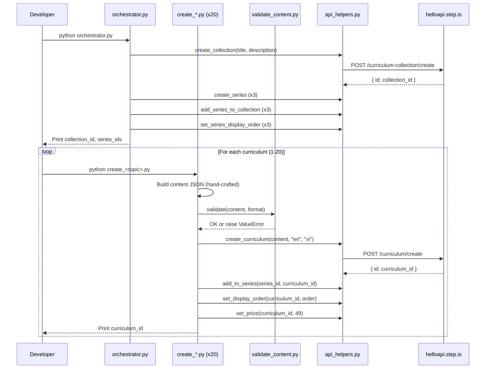

# Design Document: Vietnamese-English Christianity Curriculums

## Overview

This design covers the creation of 20 English-learning curriculums for Vietnamese speakers on Christianity topics. The system consists of:

- **20 standalone Python scripts** — one per curriculum, each containing hand-crafted content
- **1 orchestrator script** — creates the collection, 3 series, wires them together, sets display orders and prices
- **1 content validator module** — validates curriculum JSON against corruption rules before upload
- **Shared API helpers** — reuses the existing root-level `api_helpers.py` module for all REST API calls

The language pair is `userLanguage="vi"` (Vietnamese speakers), `language="en"` (learning English). All marketing text (titles, descriptions, previews) is in Vietnamese. All reading passages are in English. introAudio scripts are bilingual (Vietnamese explanations for English vocabulary). Difficulty levels span preintermediate (~10 curriculums) and intermediate (~10 curriculums), all with 4 sessions each, priced at 49 credits.

### Key Design Decisions

1. **Reuse existing `api_helpers.py`** — the root-level module already wraps all needed API endpoints (create_curriculum, create_collection, create_series, add_to_series, add_series_to_collection, set_display_order, set_series_display_order, set_price) with Firebase auth, error handling, and logging.

2. **Christianity-specific validator** — a new `vi-en-christianity-curriculum/validate_content.py` validates the specific structural rules for this batch: exactly 4 sessions, activity sequences matching the declared skill focus format (story-reading, speaking, balanced), contentTypeTags correctness, and all standard corruption checks.

3. **Three skill focus formats** — each format has a distinct activity sequence template. The validator accepts a `format` parameter ("story_reading", "speaking", "balanced") and checks the activity sequence matches.

4. **Tone assignments pre-planned** — with 20 curriculums across 3 series, all description tones and farewell tones are pre-planned in the design to satisfy adjacency and distribution constraints. Hard-coded directly in each script.

5. **No template content** — every piece of learner-facing text (introAudio, reading passages, descriptions, previews, writing prompts) is individually crafted per curriculum. Scripts may share structural helpers but all text is hand-written.

6. **Private by default** — no script calls `setPublic`. Curriculums need content generation (audio, illustrations) before being exposed to learners.

## Architecture

```mermaid
graph TD
    subgraph "vi-en-christianity-curriculum/"
        ORCH[orchestrator.py] --> API
        VAL[validate_content.py]
        
        C1[create_cau_chuyen_sang_the.py] --> VAL
        C1 --> API
        C2[create_hanh_trinh_cua_moi_se.py] --> VAL
        C2 --> API
        C3[create_dem_thanh_giang_sinh.py] --> VAL
        C3 --> API
        C4[create_con_duong_thap_gia.py] --> VAL
        C4 --> API
        C5[create_nhung_du_ngon_cua_chua.py] --> VAL
        C5 --> API
        C6[create_thanh_phaolo_tren_duong.py] --> VAL
        C6 --> API
        C7[create_cac_vi_thanh_tu_dao.py] --> VAL
        C7 --> API
        C8[create_tai_nha_tho.py] --> VAL
        C8 --> API
        C9[create_cau_nguyen_moi_ngay.py] --> VAL
        C9 --> API
        C10[create_noi_ve_duc_tin.py] --> VAL
        C10 --> API
        C11[create_doi_thoai_lien_ton.py] --> VAL
        C11 --> API
        C12[create_chia_se_chung_tu.py] --> VAL
        C12 --> API
        C13[create_phuc_vu_cong_dong.py] --> VAL
        C13 --> API
        C14[create_mua_phuc_sinh.py] --> VAL
        C14 --> API
        C15[create_thanh_ca_va_tho_phuong.py] --> VAL
        C15 --> API
        C16[create_giang_sinh_o_viet_nam.py] --> VAL
        C16 --> API
        C17[create_bi_tich_va_nghi_le.py] --> VAL
        C17 --> API
        C18[create_duc_tin_va_doi_song.py] --> VAL
        C18 --> API
        C19[create_lich_su_giao_hoi.py] --> VAL
        C19 --> API
        C20[create_triet_hoc_kito_giao.py] --> VAL
        C20 --> API
    end

    API[api_helpers.py<br/>shared, repo root]
    API --> FB[firebase_token.py]
    API --> REST[helloapi.step.is REST API]
    REST --> DB[(PostgreSQL)]
```



### Execution Flow



## Components and Interfaces

### 1. orchestrator.py

Creates the collection and 3 series, wires them together, sets display orders.

**Inputs:** None (all data hard-coded — collection/series titles, descriptions, tone assignments)

**Outputs:** Prints collection ID, 3 series IDs

**API calls:**
- `curriculum-collection/create` — 1 call
- `curriculum-series/create` — 3 calls
- `curriculum-collection/addSeriesToCollection` — 3 calls
- `curriculum-series/setDisplayOrder` — 3 calls

**Collection:**
- Title: "Kitô Giáo & Đức Tin" (Vietnamese)
- Description: Neutral informative Vietnamese description about the collection containing English-learning curriculums on Christianity, Bible stories, church life, prayer, and faith for Vietnamese speakers.

**Series tone assignments (hard-coded in orchestrator):**

| Entity | Tone |
|--------|------|
| Series 1: "Đọc Truyện Kinh Thánh" (Story-Reading, 7 curriculums) | `vivid_scenario` |
| Series 2: "Luyện Nói Về Đức Tin" (Speaking, 6 curriculums) | `empathetic_observation` |
| Series 3: "Kỹ Năng Toàn Diện" (Balanced, 7 curriculums) | `bold_declaration` |

### 2. validate_content.py

Content validator supporting three curriculum skill focus formats.

**Interface:**
```python
def validate(content: dict, format: str) -> None:
    """
    Validates curriculum content JSON for Christianity curriculums.
    
    Args:
        content: The curriculum content dict
        format: One of "story_reading", "speaking", "balanced"
    
    Raises:
        ValueError with specific violation message on any failure.
    """
```

**Format configurations:**

| Format | Sessions | contentTypeTags | Vocab Words |
|--------|----------|-----------------|-------------|
| `story_reading` | 4 | `["story"]` | 10-12 |
| `speaking` | 4 | `[]` | 10-12 |
| `balanced` | 4 | `[]` | 10-12 |

**Validation checks:**
1. Top-level structure: `title`, `description`, `preview.text`, `contentTypeTags`, `learningSessions`
2. Session count = 4
3. Each session has `title` and non-empty `activities` array
4. Each activity has `activityType` (not `type`), `title`, `description`, `data` object
5. Valid `activityType` values (introAudio, viewFlashcards, speakFlashcards, vocabLevel1, vocabLevel2, reading, speakReading, readAlong, writingSentence, writingParagraph)
6. `vocabList` is array of lowercase strings, field name is `vocabList` (not `words`)
7. `viewFlashcards`/`speakFlashcards` in same session have identical `vocabList`
8. `writingSentence` has `data.vocabList`, `data.items` with `prompt` and `targetVocab`
9. `writingParagraph` has `data.vocabList`, `data.instructions`, `data.prompts` (length >= 2)
10. No strip-keys anywhere in JSON tree
11. `contentTypeTags` matches format (`["story"]` for story_reading, `[]` for speaking/balanced)
12. Activity sequence matches the declared format template
13. Writing activities (writingSentence, writingParagraph) only appear in sessions 3 and 4

### 3. Individual Curriculum Scripts (create_*.py x 20)

Each script is standalone and contains all hand-crafted content for one curriculum.

**Common interface pattern:**
```python
# create_<topic>.py
import sys
import json
import logging

sys.path.insert(0, "/home/ubuntu/nspaceresearch/design-curriculums")
sys.path.insert(0, "/home/ubuntu/nspaceresearch/design-curriculums/vi-en-christianity-curriculum")
from api_helpers import (
    create_curriculum, add_to_series, set_display_order, set_price
)
from validate_content import validate

SERIES_ID = "<series_id>"  # From orchestrator output
DISPLAY_ORDER = <N>
PRICE = 49

def build_content() -> dict:
    """Build the curriculum content dict with all hand-crafted text."""
    return {
        "title": "...",  # Vietnamese
        "description": "...",  # Vietnamese persuasive copy
        "preview": {"text": "..."},  # Vietnamese ~150 words
        "contentTypeTags": ["story"],  # or [] for speaking/balanced
        "learningSessions": [...]
    }

def main():
    content = build_content()
    validate(content, format="story_reading")  # or "speaking" / "balanced"
    curriculum_id = create_curriculum(content, "en", "vi")
    add_to_series(SERIES_ID, curriculum_id)
    set_display_order(curriculum_id, DISPLAY_ORDER)
    set_price(curriculum_id, PRICE)
    print(f"Created: {curriculum_id}")

if __name__ == "__main__":
    main()
```

### 4. Tone Assignment Table

Pre-planned to satisfy all adjacency and distribution constraints.

**Curriculum description tones and farewell tones:**

| # | Curriculum | Series | Order | Level | Desc Tone | Farewell Tone |
|---|-----------|--------|-------|-------|-----------|---------------|
| 1 | Câu Chuyện Sáng Thế | Đọc Truyện Kinh Thánh | 1 | preintermediate | provocative_question | introspective_guide |
| 2 | Hành Trình Của Môi-se | Đọc Truyện Kinh Thánh | 2 | preintermediate | vivid_scenario | warm_accountability |
| 3 | Đêm Thánh Giáng Sinh | Đọc Truyện Kinh Thánh | 3 | preintermediate | empathetic_observation | quiet_awe |
| 4 | Con Đường Thập Giá | Đọc Truyện Kinh Thánh | 4 | intermediate | bold_declaration | team_building_energy |
| 5 | Những Dụ Ngôn Của Chúa | Đọc Truyện Kinh Thánh | 5 | intermediate | surprising_fact | practical_momentum |
| 6 | Thánh Phaolô Trên Đường Đa-mát | Đọc Truyện Kinh Thánh | 6 | intermediate | metaphor_led | introspective_guide |
| 7 | Các Vị Thánh Tử Đạo Việt Nam | Đọc Truyện Kinh Thánh | 7 | intermediate | provocative_question | warm_accountability |
| 8 | Tại Nhà Thờ | Luyện Nói Về Đức Tin | 1 | preintermediate | bold_declaration | quiet_awe |
| 9 | Cầu Nguyện Mỗi Ngày | Luyện Nói Về Đức Tin | 2 | preintermediate | vivid_scenario | team_building_energy |
| 10 | Nói Về Đức Tin | Luyện Nói Về Đức Tin | 3 | preintermediate | surprising_fact | practical_momentum |
| 11 | Đối Thoại Liên Tôn | Luyện Nói Về Đức Tin | 4 | intermediate | empathetic_observation | introspective_guide |
| 12 | Chia Sẻ Chứng Từ | Luyện Nói Về Đức Tin | 5 | intermediate | metaphor_led | warm_accountability |
| 13 | Phục Vụ Cộng Đồng | Luyện Nói Về Đức Tin | 6 | intermediate | provocative_question | quiet_awe |
| 14 | Mùa Phục Sinh | Kỹ Năng Toàn Diện | 1 | preintermediate | bold_declaration | team_building_energy |
| 15 | Thánh Ca Và Thờ Phượng | Kỹ Năng Toàn Diện | 2 | preintermediate | empathetic_observation | practical_momentum |
| 16 | Giáng Sinh Ở Việt Nam | Kỹ Năng Toàn Diện | 3 | preintermediate | vivid_scenario | introspective_guide |
| 17 | Bí Tích Và Nghi Lễ | Kỹ Năng Toàn Diện | 4 | preintermediate | surprising_fact | warm_accountability |
| 18 | Đức Tin Và Đời Sống | Kỹ Năng Toàn Diện | 5 | intermediate | metaphor_led | quiet_awe |
| 19 | Lịch Sử Giáo Hội | Kỹ Năng Toàn Diện | 6 | intermediate | provocative_question | team_building_energy |
| 20 | Triết Học Kitô Giáo | Kỹ Năng Toàn Diện | 7 | intermediate | bold_declaration | practical_momentum |

**Tone distribution verification (20 curriculums):**
- provocative_question: 4 (20%)
- bold_declaration: 4 (20%)
- vivid_scenario: 3 (15%)
- empathetic_observation: 3 (15%)
- surprising_fact: 3 (15%)
- metaphor_led: 3 (15%)
- Max = 4/20 = 20%, all well under 30% cap (max 6 allowed)

**No adjacent description tone duplicates:**
- Series 1: provocative -> vivid -> empathetic -> bold -> surprising -> metaphor -> provocative (all adjacent pairs different)
- Series 2: bold -> vivid -> surprising -> empathetic -> metaphor -> provocative (all adjacent pairs different)
- Series 3: bold -> empathetic -> vivid -> surprising -> metaphor -> provocative -> bold (all adjacent pairs different)

**Farewell tone distribution (20 curriculums):**
- introspective_guide: 4 (20%)
- warm_accountability: 4 (20%)
- team_building_energy: 4 (20%)
- quiet_awe: 4 (20%)
- practical_momentum: 4 (20%)
- Evenly distributed (4 each, within 3-5 range)

**No adjacent farewell tone duplicates:**
- Series 1: introspective -> warm -> quiet -> team -> practical -> introspective -> warm (all adjacent pairs different)
- Series 2: quiet -> team -> practical -> introspective -> warm -> quiet (all adjacent pairs different)
- Series 3: team -> practical -> introspective -> warm -> quiet -> team -> practical (all adjacent pairs different)

### 5. Activity Templates

#### Story-Reading Format (contentTypeTags: ["story"])

```
Session 1 (Group 1, ~5-6 words):
  1. introAudio — welcome + teach words group 1 (500-800 words, bilingual)
  2. viewFlashcards (group 1)
  3. speakFlashcards (group 1)
  4. reading — narrative passage 150-200 words using group 1 words
  5. speakReading
  6. readAlong
  7. introAudio — session wrap-up

Session 2 (Group 2, ~5-6 words):
  1. introAudio — recap group 1 + teach group 2 (500-800 words, bilingual)
  2. viewFlashcards (group 2)
  3. speakFlashcards (group 2)
  4. reading — narrative passage 150-200 words using group 2 words
  5. speakReading
  6. readAlong
  7. introAudio — session wrap-up

Session 3 (Review):
  1. introAudio — review intro
  2. viewFlashcards (all words)
  3. speakFlashcards (all words)
  4. vocabLevel1 (all words)
  5. reading — story continuation 200-250 words using all words
  6. speakReading
  7. readAlong
  8. introAudio — review wrap-up

Session 4 (Final):
  1. introAudio — final reading intro
  2. reading — story conclusion 250-300 words using all words
  3. speakReading
  4. readAlong
  5. writingSentence (3-4 items reflecting on the story)
  6. introAudio — farewell with vocab review (400-600 words)
```

#### Speaking Format (contentTypeTags: [])

```
Session 1 (Group 1, ~5-6 words):
  1. introAudio — welcome + teach words group 1 (500-800 words, bilingual)
  2. viewFlashcards (group 1)
  3. speakFlashcards (group 1)
  4. vocabLevel1 (group 1)
  5. speakFlashcards (group 1 — second round)
  6. reading — short passage 80-100 words
  7. speakReading
  8. introAudio — session wrap-up

Session 2 (Group 2, ~5-6 words):
  1. introAudio — recap group 1 + teach group 2 (500-800 words, bilingual)
  2. viewFlashcards (group 2)
  3. speakFlashcards (group 2)
  4. vocabLevel1 (group 2)
  5. speakFlashcards (group 2 — second round)
  6. reading — short passage 80-100 words
  7. speakReading
  8. introAudio — session wrap-up

Session 3 (Review):
  1. introAudio — review intro
  2. speakFlashcards (all words)
  3. vocabLevel1 (all words)
  4. vocabLevel2 (all words)
  5. speakFlashcards (all words — second round)
  6. reading — passage 100-120 words
  7. speakReading
  8. introAudio — review wrap-up

Session 4 (Final):
  1. introAudio — final session intro
  2. speakFlashcards (all words)
  3. vocabLevel2 (all words)
  4. reading — passage 120-150 words
  5. speakReading
  6. readAlong
  7. writingSentence (2-3 items)
  8. introAudio — farewell with vocab review (400-600 words)
```

#### Balanced Format (contentTypeTags: [])

```
Session 1 (Group 1, ~5-6 words):
  1. introAudio — welcome + teach words group 1 (500-800 words, bilingual)
  2. viewFlashcards (group 1)
  3. speakFlashcards (group 1)
  4. vocabLevel1 (group 1)
  5. reading — passage 120-150 words
  6. speakReading
  7. readAlong
  8. introAudio — session wrap-up

Session 2 (Group 2, ~5-6 words):
  1. introAudio — recap group 1 + teach group 2 (500-800 words, bilingual)
  2. viewFlashcards (group 2)
  3. speakFlashcards (group 2)
  4. vocabLevel1 (group 2)
  5. reading — passage 120-150 words
  6. speakReading
  7. readAlong
  8. introAudio — session wrap-up

Session 3 (Review):
  1. introAudio — review intro
  2. viewFlashcards (all words)
  3. speakFlashcards (all words)
  4. vocabLevel1 (all words)
  5. vocabLevel2 (all words)
  6. reading — passage 150-180 words
  7. speakReading
  8. readAlong
  9. writingSentence (4-5 items)
  10. introAudio — review wrap-up

Session 4 (Final):
  1. introAudio — final reading intro
  2. reading — full passage 200-250 words using all words
  3. speakReading
  4. readAlong
  5. writingSentence (3-4 items)
  6. writingParagraph (1 prompt)
  7. introAudio — farewell with vocab review (400-600 words)
```

## Data Models

### Curriculum Content JSON Structure

```json
{
  "title": "Câu Chuyện Sáng Thế",
  "description": "BẠN CÓ BAO GIỜ TỰ HỎI VÌ SAO CON NGƯỜI LUÔN KHAO KHÁT THIÊN ĐƯỜNG?\n\nTừ khu vườn Eden đến...",
  "preview": {
    "text": "Hãy tưởng tượng bạn đang lật mở những trang đầu tiên của Kinh Thánh..."
  },
  "contentTypeTags": ["story"],
  "learningSessions": [
    {
      "title": "Phần 1",
      "activities": [
        {
          "activityType": "introAudio",
          "title": "Chào mừng đến với Câu Chuyện Sáng Thế",
          "description": "Giới thiệu bài học và từ vựng phần 1",
          "data": {
            "text": "Xin chào bạn! Hôm nay chúng ta sẽ cùng nhau khám phá câu chuyện sáng thế — câu chuyện về sự khởi đầu của vạn vật theo Kinh Thánh — qua tiếng Anh nhé...\n\nTừ đầu tiên là 'creation' — /kriˈeɪʃən/ — nghĩa là sự sáng tạo, sự tạo dựng. Ví dụ: The creation of the world is described in the Book of Genesis..."
          }
        },
        {
          "activityType": "viewFlashcards",
          "title": "Flashcards: Câu chuyện sáng thế (phần 1)",
          "description": "Học 5 từ: creation, paradise, forbidden, temptation, innocence",
          "data": {
            "vocabList": ["creation", "paradise", "forbidden", "temptation", "innocence"]
          }
        },
        {
          "activityType": "speakFlashcards",
          "title": "Flashcards: Câu chuyện sáng thế (phần 1)",
          "description": "Học 5 từ: creation, paradise, forbidden, temptation, innocence",
          "data": {
            "vocabList": ["creation", "paradise", "forbidden", "temptation", "innocence"]
          }
        },
        {
          "activityType": "reading",
          "title": "Đọc: Khu vườn Eden",
          "description": "In the beginning, God created the heavens and the earth. He made light and darkness...",
          "data": {
            "text": "In the beginning, God created the heavens and the earth. He made light and darkness, the sky and the seas, and all living creatures. Then God created a beautiful paradise called the Garden of Eden...",
            "vocabList": ["creation", "paradise", "forbidden", "temptation", "innocence"]
          }
        },
        {
          "activityType": "speakReading",
          "title": "Đọc: Khu vườn Eden",
          "description": "In the beginning, God created the heavens and the earth. He made light and darkness...",
          "data": {
            "text": "In the beginning, God created the heavens and the earth. He made light and darkness, the sky and the seas, and all living creatures. Then God created a beautiful paradise called the Garden of Eden..."
          }
        },
        {
          "activityType": "readAlong",
          "title": "Nghe: Khu vườn Eden",
          "description": "Nghe đoạn văn vừa đọc và theo dõi.",
          "data": {
            "text": "In the beginning, God created the heavens and the earth. He made light and darkness, the sky and the seas, and all living creatures. Then God created a beautiful paradise called the Garden of Eden..."
          }
        },
        {
          "activityType": "introAudio",
          "title": "Kết thúc phần 1",
          "description": "Tóm tắt và kết thúc phần học",
          "data": {
            "text": "Tuyệt vời! Bạn vừa hoàn thành phần 1 của bài học..."
          }
        }
      ]
    }
  ]
}
```

### writingSentence Item Structure

```json
{
  "activityType": "writingSentence",
  "title": "Viết: Suy ngẫm về câu chuyện sáng thế",
  "description": "Viết câu tiếng Anh về câu chuyện sáng tạo",
  "data": {
    "vocabList": ["creation", "paradise", "forbidden", "temptation", "innocence", "serpent", "disobedience", "banish", "garden", "blessing"],
    "items": [
      {
        "prompt": "Dùng từ 'creation' để viết một câu về sự khởi đầu của vạn vật. Ví dụ: The creation of the universe reveals the power and wisdom of God.",
        "targetVocab": "creation"
      },
      {
        "prompt": "Dùng từ 'temptation' để viết một câu về thử thách trong đời sống đức tin. Ví dụ: Resisting temptation requires both faith and self-discipline.",
        "targetVocab": "temptation"
      },
      {
        "prompt": "Dùng từ 'blessing' để viết một câu về ơn phước trong cuộc sống. Ví dụ: Many people count their blessings each morning as a form of gratitude.",
        "targetVocab": "blessing"
      }
    ]
  }
}
```

### writingParagraph Structure

```json
{
  "activityType": "writingParagraph",
  "title": "Viết: Đức tin và đời sống hiện đại",
  "description": "Viết đoạn văn tiếng Anh về đức tin trong cuộc sống",
  "data": {
    "vocabList": ["integrity", "discernment", "conscience", "virtue", "temptation", "perseverance", "humility", "gratitude", "discipline", "accountability", "purpose", "vocation"],
    "instructions": "Viết 3-5 câu tiếng Anh về cách đức tin Kitô giáo giúp bạn đưa ra quyết định đạo đức trong cuộc sống hàng ngày. Sử dụng ít nhất 3-4 từ vựng đã học trong bài.",
    "prompts": [
      "Explain how integrity and discernment help Christians navigate ethical decisions in the workplace. Use vocabulary from this session to describe specific situations.",
      "Describe how perseverance and humility can help someone maintain their faith during difficult times. Connect these Christian virtues to practical challenges in modern life."
    ]
  }
}
```

### API Call Parameters

| API Endpoint | Key Parameters |
|---|---|
| `curriculum/create` | `firebaseIdToken`, `language: "en"`, `userLanguage: "vi"`, `content: JSON.stringify(content)` |
| `curriculum-series/addCurriculum` | `firebaseIdToken`, `curriculumSeriesId`, `curriculumId` |
| `curriculum/setDisplayOrder` | `firebaseIdToken`, `id`, `displayOrder` |
| `curriculum/setPrice` | `firebaseIdToken`, `id`, `price: 49` |
| `curriculum-collection/create` | `firebaseIdToken`, `title`, `description` |
| `curriculum-series/create` | `firebaseIdToken`, `title`, `description` |
| `curriculum-collection/addSeriesToCollection` | `firebaseIdToken`, `curriculumCollectionId`, `curriculumSeriesId` |
| `curriculum-series/setDisplayOrder` | `firebaseIdToken`, `id`, `displayOrder` |

### Vocabulary Lists (All 20 Curriculums)

| # | Curriculum | vocabList | Count |
|---|---|---|---|
| 1 | Câu Chuyện Sáng Thế | creation, paradise, forbidden, temptation, innocence, serpent, disobedience, banish, garden, blessing | 10 |
| 2 | Hành Trình Của Môi-se | exodus, pharaoh, plague, commandment, wilderness, covenant, deliver, miracle, tablet, prophet | 10 |
| 3 | Đêm Thánh Giáng Sinh | manger, shepherd, angel, star, humble, journey, inn, swaddling, proclaim, adore | 10 |
| 4 | Con Đường Thập Giá | crucifixion, resurrection, sacrifice, betrayal, redemption, tomb, ascension, atonement, crown, eternal | 10 |
| 5 | Những Dụ Ngôn Của Chúa | parable, prodigal, compassion, sow, harvest, repentance, mercy, neighbor, forgive, steward, vineyard, inheritance | 12 |
| 6 | Thánh Phaolô Trên Đường Đa-mát | conversion, missionary, epistle, persecution, apostle, revelation, preach, congregation, testimony, gentile, shipwreck, imprisonment | 12 |
| 7 | Các Vị Thánh Tử Đạo Việt Nam | martyr, persevere, tribunal, decree, steadfast, witness, diocese, catechist, proclaim, endure, venerate, canonize | 12 |
| 8 | Tại Nhà Thờ | congregation, sermon, hymn, pew, altar, choir, worship, kneel, communion, blessing | 10 |
| 9 | Cầu Nguyện Mỗi Ngày | prayer, gratitude, petition, intercede, meditate, devotion, rosary, intention, praise, thanksgiving | 10 |
| 10 | Nói Về Đức Tin | faith, believe, grace, soul, salvation, eternal, scripture, gospel, trust, hope | 10 |
| 11 | Đối Thoại Liên Tôn | dialogue, doctrine, denomination, ecumenical, theology, interfaith, tradition, sacrament, liturgy, orthodox, evangelical, charismatic | 12 |
| 12 | Chia Sẻ Chứng Từ | testimony, transform, encounter, surrender, renewal, conviction, calling, breakthrough, deliverance, restoration, reconcile, profound | 12 |
| 13 | Phục Vụ Cộng Đồng | volunteer, outreach, compassion, donate, shelter, orphanage, mission, advocate, dignity, empower, stewardship, generosity | 12 |
| 14 | Mùa Phục Sinh | resurrection, lent, fasting, palm, vigil, rejoice, tomb, risen, celebrate, renewal | 10 |
| 15 | Thánh Ca Và Thờ Phượng | hymn, melody, chorus, praise, worship, harmony, lyric, uplift, sacred, joyful | 10 |
| 16 | Giáng Sinh Ở Việt Nam | nativity, carol, ornament, festive, midnight, lantern, tradition, gather, exchange, goodwill | 10 |
| 17 | Bí Tích Và Nghi Lễ | baptism, confirmation, eucharist, confession, anoint, matrimony, ordination, sacred, ceremony, vow | 10 |
| 18 | Đức Tin Và Đời Sống | integrity, discernment, conscience, virtue, temptation, perseverance, humility, gratitude, discipline, accountability, purpose, vocation | 12 |
| 19 | Lịch Sử Giáo Hội | reformation, council, missionary, cathedral, monastery, crusade, schism, papal, diocese, ecumenical, renaissance, enlightenment | 12 |
| 20 | Triết Học Kitô Giáo | theodicy, providence, omniscient, benevolent, freewill, transcendence, incarnation, trinity, revelation, redemption, existential, contemplation | 12 |

**Overlap check:** Words appearing in multiple curriculums:
- "resurrection" in #4 and #14 (2 curriculums)
- "eternal" in #4 and #10 (2 curriculums)
- "proclaim" in #3 and #7 (2 curriculums)
- "blessing" in #1 and #8 (2 curriculums)
- "hymn" in #8 and #15 (2 curriculums)
- "worship" in #8 and #15 (2 curriculums)
- "congregation" in #6 and #8 (2 curriculums)
- "testimony" in #6 and #12 (2 curriculums)
- "compassion" in #5 and #13 (2 curriculums)
- "tomb" in #4 and #14 (2 curriculums)
- "renewal" in #12 and #14 (2 curriculums)
- "sacred" in #15 and #17 (2 curriculums)
- "temptation" in #1 and #18 (2 curriculums)
- "gratitude" in #9 and #18 (2 curriculums)
- "missionary" in #6 and #19 (2 curriculums)
- "diocese" in #7 and #19 (2 curriculums)
- "ecumenical" in #11 and #19 (2 curriculums)
- "revelation" in #6 and #20 (2 curriculums)
- "redemption" in #4 and #20 (2 curriculums)
- "praise" in #9 and #15 (2 curriculums)
- "perseverance" in #18 and — unique (only #18)
- "persevere" in #7 — different word from "perseverance"

Per Requirement 2.3, no more than 2 shared words between any two curriculums. Maximum overlap between any pair:
- #4 and #14 share "resurrection" and "tomb" = 2 words
- #8 and #15 share "hymn" and "worship" = 2 words
- #6 and #19 share "missionary" — only 1 word (congregation is #6 and #8, not #19)

All pairs satisfy the constraint (max 2 shared words).

## Correctness Properties

*A property is a characteristic or behavior that should hold true across all valid executions of a system — essentially, a formal statement about what the system should do. Properties serve as the bridge between human-readable specifications and machine-verifiable correctness guarantees.*

The content validator (`validate_content.py`) is the primary component amenable to property-based testing. It is a pure function: takes a content dict and format string, returns None or raises ValueError. The input space is large (arbitrary JSON structures), and universal properties hold across all valid/invalid inputs.

The curriculum creation scripts, orchestrator, and API interactions are integration-level concerns tested via database verification queries after execution.

### Property 1: Valid content passes validation

*For any* well-formed curriculum content dict that matches its declared format (correct session count of 4, activity sequence matching the format template, all required fields present, vocabList arrays valid, contentTypeTags correct for format, no strip keys), calling `validate(content, format)` SHALL return without raising an exception.

**Validates: Requirements 1.4, 1.5, 3.1, 3.2, 3.3, 3.4, 9.1, 10.1, 10.2**

### Property 2: contentTypeTags validation per format

*For any* curriculum content dict, if the format is "story_reading" and contentTypeTags is not `["story"]`, OR if the format is "speaking"/"balanced" and contentTypeTags is not `[]`, then `validate()` SHALL raise a ValueError.

**Validates: Requirements 1.4, 1.5, 10.10**

### Property 3: Strip keys rejected anywhere in JSON tree

*For any* curriculum content dict and any strip key (mp3Url, illustrationSet, chapterBookmarks, segments, whiteboardItems, userReadingId, lessonUniqueId, curriculumTags, taskId, imageId), if that key is injected at any depth in the JSON tree, `validate()` SHALL raise a ValueError mentioning the strip key.

**Validates: Requirements 1.6, 10.9**

### Property 4: Activity sequence matches declared format

*For any* curriculum content dict, if the activity type sequence in any session does not match the expected template for the declared format (story_reading, speaking, or balanced), `validate()` SHALL raise a ValueError identifying the session and expected sequence.

**Validates: Requirements 3.1, 3.2, 3.3**

### Property 5: Activity structural requirements enforced

*For any* activity in any curriculum content, if any of the required fields (`activityType`, `title`, `description`, `data`) is missing, if `data` is not a dict, or if `activityType` is not in the valid set (introAudio, viewFlashcards, speakFlashcards, vocabLevel1, vocabLevel2, reading, speakReading, readAlong, writingSentence, writingParagraph), `validate()` SHALL raise a ValueError.

**Validates: Requirements 9.1, 9.2, 10.3, 10.4**

### Property 6: vocabList format enforced

*For any* vocab activity (viewFlashcards, speakFlashcards, vocabLevel1, vocabLevel2), if `data.vocabList` contains non-lowercase strings, is not an array, is empty, or uses the field name `words` instead of `vocabList`, `validate()` SHALL raise a ValueError.

**Validates: Requirements 9.3, 10.5**

### Property 7: Flashcard vocabList consistency within sessions

*For any* session containing both `viewFlashcards` and `speakFlashcards` activities, if their `data.vocabList` arrays differ, `validate()` SHALL raise a ValueError.

**Validates: Requirements 9.4, 10.6**

### Property 8: writingSentence structure enforced

*For any* `writingSentence` activity, if `data.vocabList` is missing, `data.items` is missing or empty, or any item lacks a non-empty `prompt` or `targetVocab`, `validate()` SHALL raise a ValueError.

**Validates: Requirements 9.6, 10.7**

### Property 9: writingParagraph structure enforced

*For any* `writingParagraph` activity, if `data.vocabList` is missing, `data.instructions` is missing or empty, or `data.prompts` is missing or has fewer than 2 items, `validate()` SHALL raise a ValueError.

**Validates: Requirements 9.7, 10.8**

### Property 10: Top-level structure enforced

*For any* curriculum content dict, if `title` is missing or empty, `description` is missing or empty, `preview.text` is missing or empty, or `learningSessions` is not an array of exactly 4 sessions each with a non-empty `title` and `activities` array, `validate()` SHALL raise a ValueError.

**Validates: Requirements 10.1, 10.2, 3.4**

### Property 11: Writing activities restricted to sessions 3 and 4

*For any* curriculum content dict, if a `writingSentence` or `writingParagraph` activity appears in session 1 or session 2, `validate()` SHALL raise a ValueError.

**Validates: Requirements 16.4**

## Error Handling

### Validator Errors

The `validate_content.py` module raises `ValueError` with a specific message identifying:
- The exact rule violated
- The location in the JSON tree (e.g., "Session 2, Activity 3")
- The expected vs. actual value

Each curriculum script calls `validate()` before any API call. If validation fails, the script aborts with the error message — no partial upload occurs.

### API Call Errors

Each curriculum script follows this error handling pattern:

1. **Validation failure** — Script aborts immediately, prints the violation. No API calls made.
2. **`curriculum/create` failure** — Script logs the error with curriculum title and exits.
3. **`add_to_series` failure** — Curriculum exists but is orphaned. Script logs the error. Developer must manually add to series or delete the curriculum.
4. **`set_display_order` failure** — Curriculum exists in series but without explicit order. Script logs the error. Developer must manually set order.
5. **`set_price` failure** — Curriculum exists with default price. Script logs the error. Developer must manually set price.

The orchestrator follows the same pattern:
1. **`create_collection` failure** — Abort. Nothing created.
2. **`create_series` failure** — Log error, continue with remaining series. Developer must manually create the failed series.
3. **`add_series_to_collection` failure** — Series exists but is orphaned. Log error, continue.
4. **`set_series_display_order` failure** — Log error, continue. Developer must manually set order.

### Duplicate Handling

After each curriculum creation, the script logs the curriculum ID. If a script is accidentally run twice, the developer runs the duplicate check query:

```sql
SELECT id, content->>'title' as title, created_at FROM curriculum
WHERE content->>'title' = '<title>'
AND uid = 'zs5AMpVfqkcfDf8CJ9qrXdH58d73'
AND uid NOT LIKE '%_deleted'
ORDER BY created_at;
```

Keep the earliest, delete extras (remove from series first, then delete curriculum).

## Testing Strategy

### Property-Based Tests (validate_content.py)

**Library:** [Hypothesis](https://hypothesis.readthedocs.io/) (Python PBT library)

**Configuration:** Minimum 100 iterations per property test.

**Tag format:** Each test is tagged with a comment: `# Feature: vi-en-christianity-curriculum, Property N: <property_text>`

The 11 correctness properties above are implemented as Hypothesis property tests in a `test_validate_content.py` file. Each property test generates random curriculum content structures using Hypothesis strategies and verifies the validator's behavior.

**Generator strategies needed:**
- `valid_curriculum(format)` — generates a structurally valid curriculum content dict for the given format (story_reading, speaking, balanced), with correct activity sequences, valid vocabLists, and proper contentTypeTags
- `random_activity(activity_type)` — generates a valid activity of the given type with all required fields
- `random_vocab_list(n)` — generates a list of n random lowercase English strings
- `random_strip_key()` — picks a random strip key from the set of 10 forbidden keys
- `random_json_path()` — picks a random location in a content dict to inject a key
- `random_format()` — picks one of "story_reading", "speaking", "balanced"

### Example-Based Tests

- Verify no vocabulary overlap exceeds 2 words between any pair of the 20 curriculums (Req 2.3)
- Verify tone assignment table has no adjacent duplicates within each series (Req 5.5)
- Verify no description tone exceeds 30% of 20 descriptions (Req 5.6)
- Verify farewell tone distribution is 3-5 per register (Req 6.8)
- Verify no adjacent farewell tone duplicates within each series (Req 6.7)
- Verify all 3 series use different description tones (Req 8.7)
- Verify correct activity sequence templates for each format (Req 3.1, 3.2, 3.3)
- Verify no script calls `setPublic` (Req 12.1)
- Verify no title contains difficulty level indicators (Req 13.3)

### Integration Verification (Post-Execution)

After all 20 scripts run, verify via SQL queries:

```sql
-- Count all vi-en Christianity curriculums (expect 20)
SELECT COUNT(*) FROM curriculum
WHERE id IN (<list of 20 IDs>);

-- Verify language pair
SELECT id, content->>'title' as title, language, user_language
FROM curriculum WHERE id IN (<list of 20 IDs>);

-- Verify all prices are 49
SELECT id, content->>'title' as title, price
FROM curriculum WHERE id IN (<list of 20 IDs>)
AND price != 49;

-- Verify series membership and display orders
SELECT cs.id as series_id, cs.title as series_title,
       c.id as curriculum_id, c.content->>'title' as curriculum_title,
       c.display_order, c.price
FROM curriculum_series cs
JOIN curriculum_series_items csi ON cs.id = csi.curriculum_series_id
JOIN curriculum c ON csi.curriculum_id = c.id
WHERE cs.id IN (<series_1_id>, <series_2_id>, <series_3_id>)
ORDER BY cs.display_order, c.display_order;

-- Verify contentTypeTags for story-reading curriculums
SELECT id, content->>'title' as title, content->'contentTypeTags' as tags
FROM curriculum WHERE id IN (<story_reading_ids>);

-- Verify no duplicates
SELECT content->>'title' as title, COUNT(*)
FROM curriculum
WHERE uid = 'zs5AMpVfqkcfDf8CJ9qrXdH58d73'
AND content->>'title' IN (<list of 20 titles>)
AND uid NOT LIKE '%_deleted'
GROUP BY content->>'title'
HAVING COUNT(*) > 1;

-- Verify collection-series wiring
SELECT cc.id as collection_id, cc.title as collection_title,
       cs.id as series_id, cs.title as series_title, cs.display_order
FROM curriculum_collections cc
JOIN curriculum_collection_series ccs ON cc.id = ccs.curriculum_collection_id
JOIN curriculum_series cs ON ccs.curriculum_series_id = cs.id
WHERE cc.id = '<collection_id>'
ORDER BY cs.display_order;
```

### Smoke Tests

- Verify each of the 20 script files exists in `vi-en-christianity-curriculum/`
- Verify orchestrator.py exists in `vi-en-christianity-curriculum/`
- Verify validate_content.py exists in `vi-en-christianity-curriculum/`
- Verify no script contains `setPublic` calls
- Verify orchestrator creates exactly 1 collection and 3 series