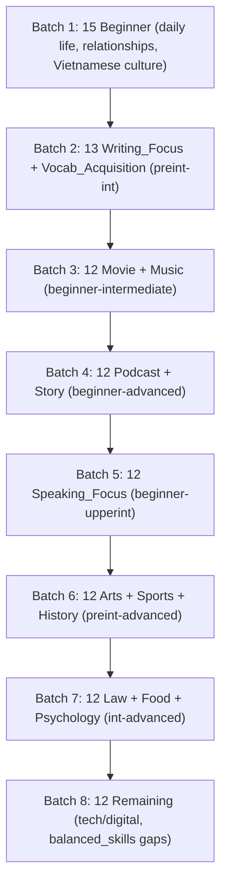
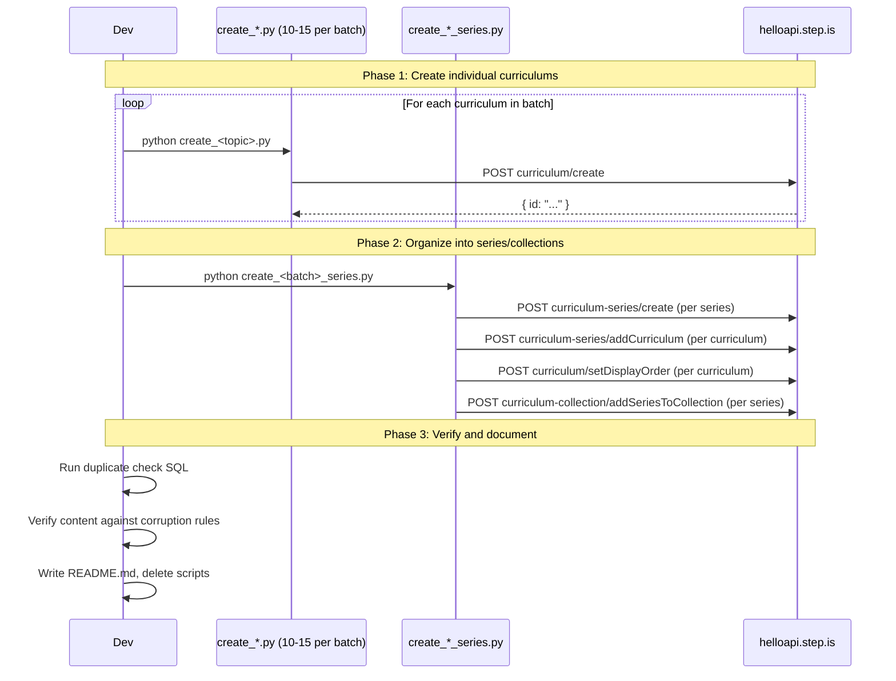

# Design Document: Vi-En Curriculum Expansion (100 Curriculums)

## Overview

This feature expands the vi-en curriculum catalog from 153 to 253 by creating 100 new curriculums that fill identified gaps in difficulty level, skill focus type, content type, and topic coverage. The current catalog is heavily skewed: beginner has only 7 curriculums, `writing_focus` is completely absent, `vocab_acquisition` has 1, `speaking_focus` has 11, and topic coverage clusters around science/tech, economics, and health.

The 100 new curriculums are distributed across 5 difficulty levels, 5 skill focus types, 5 content types, and 10+ new topic areas. They are organized into ~25 series within new and existing collections, implemented as standalone Python scripts calling the helloapi REST API, and executed in 8 batches of 10-15 curriculums each.

### Key Design Decisions

1. **Beginner gets the largest share (25)**: The most severe gap — 7 out of 153 — demands the heaviest investment. Beginner curriculums use a simplified 4-session, 12-word structure.
2. **writing_focus gets 15 curriculums**: Introducing a completely missing type across 4 difficulty levels (beginner through upperintermediate).
3. **All 100 are vi-en bilingual or single-language per level rules**: Beginner/preintermediate/intermediate = bilingual (Vietnamese UI, English passages). Upperintermediate = bilingual or single-language. Advanced = English-only.
4. **10 new topic areas**: Daily life, relationships, arts, sports, history, law, food, psychology, tech/digital life, Vietnamese culture in English — all underrepresented or missing.
5. **Content types spread across levels**: Movie, music, podcast, and story each get 8+ curriculums, with podcast and story filling specific level gaps (beginner/preintermediate podcasts, upperintermediate/advanced stories).
6. **Series of 3-5 curriculums**: Each series stays within a 1-level difficulty gap and has homogeneous language settings.
7. **8 implementation batches**: Prioritized by gap severity — beginner first, then missing skill types, then content types, then remaining topic diversity.
8. **No templates for learner-facing text**: Every description, introAudio, reading passage, and writing prompt is hand-written per curriculum. Shared helpers only for activity structure/schema.

## Architecture

### Batch Execution Flow



### Per-Batch Workflow



### Folder Organization

```
vi-en-curriculum-expansion/
├── batch-01-beginner/
│   ├── create_daily_life_1_shopping.py
│   ├── create_daily_life_2_cooking.py
│   ├── ... (15 curriculum scripts)
│   ├── create_batch_01_series.py          # orchestrator
│   └── README.md                          # persists after cleanup
├── batch-02-writing-vocab/
│   ├── ... (13 curriculum scripts)
│   ├── create_batch_02_series.py
│   └── README.md
├── ... (batches 03-08)
└── README.md                              # master README with full distribution summary
```

## Components and Interfaces

### 1. Curriculum Creation Scripts (100 total)

Each script follows the established pattern:

```python
import sys, json, requests
sys.path.insert(0, "/home/ubuntu/nspaceresearch/design-curriculums")
from firebase_token import get_firebase_id_token

UID = "zs5AMpVfqkcfDf8CJ9qrXdH58d73"
API_BASE = "https://helloapi.step.is"

# All learner-facing text is hand-written below — no templates
content = {
    "title": "...",
    "contentTypeTags": [],
    "description": "...",
    "preview": {"text": "..."},
    "learningSessions": [...]
}

def validate(content):
    """Structural checks against CONTENT_CORRUPTION_RULES.md"""
    # ... (see Verification section)

validate(content)
token = get_firebase_id_token(UID)
res = requests.post(f"{API_BASE}/curriculum/create", json={
    "firebaseIdToken": token,
    "language": "en",
    "userLanguage": "vi",
    "content": json.dumps(content)
})
res.raise_for_status()
curriculum_id = res.json()["id"]
print(f"Created: {curriculum_id}")

# Duplicate check
token = get_firebase_id_token(UID)
# ... SQL duplicate check logic
```

### 2. Batch Orchestrator Scripts (8 total)

Each batch has one orchestrator that:
1. Creates new series via `curriculum-series/create`
2. Adds curriculums to series via `curriculum-series/addCurriculum`
3. Sets display orders via `curriculum/setDisplayOrder` and `curriculum-series/setDisplayOrder`
4. Adds series to collections (new or existing) via `curriculum-collection/addSeriesToCollection`
5. Optionally creates new collections via `curriculum-collection/create`

### 3. Shared Validation Helper

A `validate_curriculum.py` helper (used by all scripts, NOT for learner-facing text) that checks:
- Activity schema compliance (activityType not type, vocabList not words, data inside data)
- Session structure matches the expected pattern for the curriculum's skill focus type
- viewFlashcards/speakFlashcards vocabList match within each session
- No strip keys present
- Title and description on all activities and sessions
- contentTypeTags present at top level

```python
# validate_curriculum.py — structural validation only, no content generation
def validate_balanced_skills_beginner(content): ...
def validate_balanced_skills_standard(content): ...
def validate_writing_focus_bilingual(content): ...
def validate_speaking_focus_bilingual(content): ...
def validate_vocab_acquisition(content): ...
def validate_reader(content): ...
def validate_no_strip_keys(content): ...
def validate_activity_schema(activity): ...
```

## Data Models

### Distribution Matrix: 100 Curriculums

#### By Difficulty Level

| Level | Count | Skill Focus Breakdown |
|-------|-------|-----------------------|
| Beginner | 25 | 12 balanced_skills, 4 writing_focus, 3 speaking_focus, 3 vocab_acquisition, 3 reader |
| Preintermediate | 20 | 8 balanced_skills, 4 writing_focus, 3 speaking_focus, 3 vocab_acquisition, 2 reader |
| Intermediate | 20 | 9 balanced_skills, 4 writing_focus, 3 speaking_focus, 2 vocab_acquisition, 2 reader |
| Upperintermediate | 18 | 9 balanced_skills, 2 writing_focus, 2 speaking_focus, 2 vocab_acquisition, 3 reader |
| Advanced | 17 | 13 balanced_skills, 1 writing_focus, 1 speaking_focus, 2 vocab_acquisition, 0 reader |
| **Total** | **100** | **51 balanced, 15 writing, 12 speaking, 12 vocab, 10 reader** |

#### By Content Type

| Content Type | Count | Level Distribution |
|--------------|-------|--------------------|
| `[]` (general/topic) | 68 | 17 beg, 14 preint, 14 int, 12 upperint, 11 adv |
| `["movie"]` | 8 | 2 beg, 2 preint, 2 int, 1 upperint, 1 adv |
| `["music"]` | 8 | 2 beg, 2 preint, 2 int, 1 upperint, 1 adv |
| `["podcast"]` | 8 | 2 beg, 2 preint, 2 int, 1 upperint, 1 adv |
| `["story"]` | 8 | 2 beg, 1 preint, 1 int, 2 upperint, 2 adv |
| **Total** | **100** | |

#### By Topic Area (New Topics)

| Topic Area | Count | Levels |
|------------|-------|--------|
| Daily life & practical English | 10 | beg ×4, preint ×3, int ×3 |
| Relationships & social skills | 8 | beg ×3, preint ×2, int ×2, upperint ×1 |
| Arts & creativity | 8 | preint ×2, int ×3, upperint ×2, adv ×1 |
| Sports & fitness | 7 | beg ×2, preint ×2, int ×1, upperint ×1, adv ×1 |
| History & civilization | 7 | preint ×1, int ×2, upperint ×2, adv ×2 |
| Law & justice | 6 | int ×2, upperint ×2, adv ×2 |
| Food & gastronomy | 8 | beg ×3, preint ×2, int ×2, upperint ×1 |
| Psychology & emotions | 8 | beg ×2, preint ×2, int ×2, upperint ×1, adv ×1 |
| Technology & digital life | 7 | preint ×1, int ×2, upperint ×2, adv ×2 |
| Vietnamese culture in English | 10 | beg ×4, preint ×2, int ×2, upperint ×1, adv ×1 |
| Media-based (movie/music/podcast/story topics) | 21 | distributed across levels per content type table |
| **Total** | **100** | |

### Complete 100-Curriculum Assignment


#### Batch 1: Beginner Foundation (15 curriculums)

| # | Title | Level | Skill Focus | Content Type | Topic Area |
|---|-------|-------|-------------|--------------|------------|
| 1 | Shopping & Bargaining | beginner | balanced_skills | [] | Daily life |
| 2 | Cooking at Home | beginner | balanced_skills | [] | Daily life |
| 3 | Finding an Apartment | beginner | balanced_skills | [] | Daily life |
| 4 | Taking the Bus | beginner | balanced_skills | [] | Daily life |
| 5 | Making Friends | beginner | balanced_skills | [] | Relationships |
| 6 | Family Dinners | beginner | balanced_skills | [] | Relationships |
| 7 | Saying Sorry | beginner | balanced_skills | [] | Relationships |
| 8 | Tết Nguyên Đán | beginner | balanced_skills | [] | Vietnamese culture |
| 9 | Vietnamese Street Food | beginner | balanced_skills | [] | Vietnamese culture |
| 10 | Áo Dài — The National Dress | beginner | balanced_skills | [] | Vietnamese culture |
| 11 | Phở — A Bowl of History | beginner | balanced_skills | [] | Vietnamese culture |
| 12 | My First English Diary | beginner | writing_focus | [] | Daily life |
| 13 | Talking About My Day | beginner | speaking_focus | [] | Daily life |
| 14 | Food Words Around Me | beginner | vocab_acquisition | [] | Food |
| 15 | The Little Red Bicycle | beginner | reader | ["story"] | Daily life |

#### Batch 2: Writing_Focus & Vocab_Acquisition (13 curriculums)

| # | Title | Level | Skill Focus | Content Type | Topic Area |
|---|-------|-------|-------------|--------------|------------|
| 16 | Writing About Feelings | beginner | writing_focus | [] | Psychology |
| 17 | My Favorite Place | beginner | writing_focus | [] | Vietnamese culture |
| 18 | Describing People | beginner | writing_focus | [] | Relationships |
| 19 | Email to a Friend | preintermediate | writing_focus | [] | Relationships |
| 20 | Restaurant Reviews | preintermediate | writing_focus | [] | Food |
| 21 | Travel Blog Post | preintermediate | writing_focus | [] | Daily life |
| 22 | Opinion Essay: Social Media | intermediate | writing_focus | [] | Tech/digital life |
| 23 | Persuasive Letter: Environment | intermediate | writing_focus | [] | Arts |
| 24 | Film Review Writing | intermediate | writing_focus | ["movie"] | Arts |
| 25 | Argument Essay: Education | upperintermediate | writing_focus | [] | Psychology |
| 26 | Critical Analysis: News | upperintermediate | writing_focus | [] | Tech/digital life |
| 27 | Academic Writing: Research | advanced | writing_focus | [] | History |
| 28 | Emotion Words | beginner | vocab_acquisition | [] | Psychology |

#### Batch 3: Movie & Music Content (12 curriculums)

| # | Title | Level | Skill Focus | Content Type | Topic Area |
|---|-------|-------|-------------|--------------|------------|
| 29 | Inside Out 2 | beginner | balanced_skills | ["movie"] | Psychology |
| 30 | Coco | beginner | balanced_skills | ["movie"] | Vietnamese culture |
| 31 | The Pursuit of Happyness | preintermediate | balanced_skills | ["movie"] | Relationships |
| 32 | Ratatouille | preintermediate | balanced_skills | ["movie"] | Food |
| 33 | The Social Network | intermediate | balanced_skills | ["movie"] | Tech/digital life |
| 34 | 12 Angry Men | intermediate | balanced_skills | ["movie"] | Law |
| 35 | Inception | upperintermediate | balanced_skills | ["movie"] | Psychology |
| 36 | Count on Me — Bruno Mars | beginner | balanced_skills | ["music"] | Relationships |
| 37 | Happy — Pharrell Williams | beginner | balanced_skills | ["music"] | Psychology |
| 38 | Viva La Vida — Coldplay | preintermediate | balanced_skills | ["music"] | History |
| 39 | Imagine — John Lennon | preintermediate | balanced_skills | ["music"] | Law |
| 40 | Bohemian Rhapsody — Queen | intermediate | balanced_skills | ["music"] | Arts |

#### Batch 4: Podcast & Story Content (12 curriculums)

| # | Title | Level | Skill Focus | Content Type | Topic Area |
|---|-------|-------|-------------|--------------|------------|
| 41 | Easy English: Morning Routines | beginner | balanced_skills | ["podcast"] | Daily life |
| 42 | Easy English: At the Market | beginner | balanced_skills | ["podcast"] | Food |
| 43 | TED-Ed: Why We Sleep | preintermediate | balanced_skills | ["podcast"] | Psychology |
| 44 | TED-Ed: The History of Chocolate | preintermediate | balanced_skills | ["podcast"] | Food |
| 45 | Freakonomics: Hidden Side of Sports | intermediate | balanced_skills | ["podcast"] | Sports |
| 46 | Radiolab: Colors | intermediate | balanced_skills | ["podcast"] | Arts |
| 47 | 99% Invisible: Design of Cities | upperintermediate | balanced_skills | ["podcast"] | Arts |
| 48 | The Lost Kite | beginner | reader | ["story"] | Daily life |
| 49 | The Market Thief | preintermediate | reader | ["story"] | Daily life |
| 50 | The Photographer's Eye | intermediate | reader | ["story"] | Arts |
| 51 | The Last Samurai's Garden | upperintermediate | reader | ["story"] | History |
| 52 | The Interpreter | advanced | reader | ["story"] | Law |

#### Batch 5: Speaking_Focus (12 curriculums)

| # | Title | Level | Skill Focus | Content Type | Topic Area |
|---|-------|-------|-------------|--------------|------------|
| 53 | Ordering Food | beginner | speaking_focus | [] | Food |
| 54 | Asking for Directions | beginner | speaking_focus | [] | Daily life |
| 55 | Introducing Yourself | preintermediate | speaking_focus | [] | Relationships |
| 56 | Describing Your Hometown | preintermediate | speaking_focus | [] | Vietnamese culture |
| 57 | Giving Opinions | preintermediate | speaking_focus | [] | Psychology |
| 58 | Telling a Story | intermediate | speaking_focus | [] | Arts |
| 59 | Debating Sports Rules | intermediate | speaking_focus | [] | Sports |
| 60 | Job Interview Practice | intermediate | speaking_focus | [] | Daily life |
| 61 | Presenting an Idea | upperintermediate | speaking_focus | [] | Tech/digital life |
| 62 | Negotiating a Deal | upperintermediate | speaking_focus | [] | Daily life |
| 63 | Defending a Position | advanced | speaking_focus | [] | Law |
| 64 | Impromptu Speech | advanced | speaking_focus | ["podcast"] | History |

#### Batch 6: Arts, Sports, History (12 curriculums)

| # | Title | Level | Skill Focus | Content Type | Topic Area |
|---|-------|-------|-------------|--------------|------------|
| 65 | Street Art Revolution | preintermediate | balanced_skills | [] | Arts |
| 66 | Fashion Through the Decades | intermediate | balanced_skills | [] | Arts |
| 67 | Architecture That Changed Cities | upperintermediate | balanced_skills | [] | Arts |
| 68 | Football Legends | beginner | vocab_acquisition | [] | Sports |
| 69 | Olympic History | preintermediate | balanced_skills | [] | Sports |
| 70 | Extreme Sports | intermediate | vocab_acquisition | [] | Sports |
| 71 | Team Dynamics in Sports | upperintermediate | balanced_skills | [] | Sports |
| 72 | Ancient Egypt | preintermediate | vocab_acquisition | [] | History |
| 73 | The Silk Road | intermediate | balanced_skills | [] | History |
| 74 | World War II Turning Points | upperintermediate | balanced_skills | [] | History |
| 75 | Revolutions That Shaped the World | advanced | balanced_skills | [] | History |
| 76 | Photography Basics | preintermediate | vocab_acquisition | [] | Arts |

#### Batch 7: Law, Food, Psychology (12 curriculums)

| # | Title | Level | Skill Focus | Content Type | Topic Area |
|---|-------|-------|-------------|--------------|------------|
| 77 | Courtroom English | intermediate | balanced_skills | [] | Law |
| 78 | Human Rights | upperintermediate | balanced_skills | [] | Law |
| 79 | Ethics in Everyday Life | advanced | balanced_skills | [] | Law |
| 80 | Crime & Punishment | advanced | balanced_skills | [] | Law |
| 81 | World Cuisines | preintermediate | balanced_skills | [] | Food |
| 82 | Food Science | intermediate | balanced_skills | [] | Food |
| 83 | Restaurant Culture | beginner | vocab_acquisition | [] | Food |
| 84 | Emotional Intelligence | preintermediate | balanced_skills | [] | Psychology |
| 85 | Cognitive Biases | intermediate | balanced_skills | [] | Psychology |
| 86 | Stress Management | upperintermediate | balanced_skills | [] | Psychology |
| 87 | Motivation Science | advanced | balanced_skills | [] | Psychology |
| 88 | Food Sustainability | upperintermediate | vocab_acquisition | [] | Food |

#### Batch 8: Remaining Gaps (12 curriculums)

| # | Title | Level | Skill Focus | Content Type | Topic Area |
|---|-------|-------|-------------|--------------|------------|
| 89 | Social Media Impact | preintermediate | balanced_skills | [] | Tech/digital life |
| 90 | Cybersecurity Basics | intermediate | balanced_skills | [] | Tech/digital life |
| 91 | Digital Privacy | upperintermediate | balanced_skills | [] | Tech/digital life |
| 92 | AI Ethics | advanced | balanced_skills | [] | Tech/digital life |
| 93 | Vietnamese Festivals | preintermediate | balanced_skills | [] | Vietnamese culture |
| 94 | Vietnamese History in English | intermediate | balanced_skills | [] | Vietnamese culture |
| 95 | Banking & Money | beginner | balanced_skills | [] | Daily life |
| 96 | Conflict Resolution | intermediate | vocab_acquisition | [] | Relationships |
| 97 | Broken Strings — James Morrison | intermediate | balanced_skills | ["music"] | Relationships |
| 98 | Lose Yourself — Eminem | upperintermediate | balanced_skills | ["music"] | Sports |
| 99 | The Shawshank Redemption | advanced | balanced_skills | ["movie"] | Law |
| 100 | The Garden of Small Things | upperintermediate | reader | ["story"] | Food |

### Distribution Verification

| Dimension | Target | Actual |
|-----------|--------|--------|
| Beginner | ≥20 | 25 |
| Preintermediate | ≥20 | 20 |
| Intermediate | ≥20 | 20 |
| Upperintermediate | ≥15 | 18 |
| Advanced | ≥15 | 17 |
| writing_focus | ≥15 | 15 |
| vocab_acquisition | ≥12 | 12 |
| speaking_focus | ≥12 | 12 |
| reader | ≥10 | 10 |
| balanced_skills | remainder | 51 |
| movie | ≥8 | 8 |
| music | ≥8 | 8 |
| podcast | ≥8 | 8 |
| story | ≥8 | 8 |
| Each new topic ≥3 | ≥3 each | ✓ (see topic table) |
| Each skill focus across ≥3 levels | ≥3 | ✓ |


### Series & Collection Organization Plan

#### New Collections

| Collection | Description | Series Count |
|------------|-------------|--------------|
| Cuộc Sống Hàng Ngày (Daily Life & Practical English) | Từ vựng tiếng Anh cho các tình huống thường ngày: mua sắm, nấu ăn, nhà ở, giao thông, ngân hàng. | 3 series |
| Quan Hệ & Kỹ Năng Xã Hội (Relationships & Social Skills) | Từ vựng tiếng Anh về tình bạn, gia đình, giải quyết xung đột, và giao tiếp xã hội. | 2 series |
| Nghệ Thuật & Sáng Tạo (Arts & Creativity) | Từ vựng tiếng Anh về hội họa, nhiếp ảnh, thiết kế, kiến trúc, và thời trang. | 2 series |
| Thể Thao & Sức Khỏe (Sports & Fitness) | Từ vựng tiếng Anh về các môn thể thao, lịch sử Olympic, thể thao mạo hiểm, và tinh thần đồng đội. | 2 series |
| Lịch Sử & Văn Minh (History & Civilization) | Từ vựng tiếng Anh về các nền văn minh cổ đại, chiến tranh thế giới, cách mạng, và nhân vật lịch sử. | 2 series |
| Luật Pháp & Công Lý (Law & Justice) | Từ vựng tiếng Anh về hệ thống pháp luật, nhân quyền, đạo đức, và tội phạm. | 2 series |
| Ẩm Thực & Văn Hóa Ăn Uống (Food & Gastronomy) | Từ vựng tiếng Anh về ẩm thực thế giới, khoa học thực phẩm, văn hóa nhà hàng, và bền vững thực phẩm. | 2 series |
| Tâm Lý & Cảm Xúc (Psychology & Emotions) | Từ vựng tiếng Anh về trí tuệ cảm xúc, thiên kiến nhận thức, động lực, và quản lý stress. | 2 series |
| Công Nghệ & Đời Sống Số (Technology & Digital Life) | Từ vựng tiếng Anh về mạng xã hội, an ninh mạng, quyền riêng tư số, và đạo đức AI. | 2 series |
| Văn Hóa Việt Nam Bằng Tiếng Anh (Vietnamese Culture in English) | Từ vựng tiếng Anh để giới thiệu lễ hội, ẩm thực, lịch sử, và truyền thống Việt Nam cho bạn bè quốc tế. | 3 series |

#### Series Within Collections (example mapping)

Each series contains 3-5 curriculums within a 1-level difficulty gap:

| Collection | Series | Curriculums | Levels |
|------------|--------|-------------|--------|
| Daily Life | Bước Đầu Tiên (First Steps) | #1, #2, #3, #4, #95 | beginner |
| Daily Life | Kỹ Năng Thực Tế (Practical Skills) | #21, #49, #60 | preint-int |
| Daily Life | Podcast: Cuộc Sống Hàng Ngày | #41, #42 | beginner |
| Relationships | Kết Nối (Connections) | #5, #6, #7 | beginner |
| Relationships | Giao Tiếp Sâu (Deeper Communication) | #19, #55, #96 | preint-int |
| Arts | Sáng Tạo (Creative Expression) | #65, #66, #76 | preint-int |
| Arts | Nghệ Thuật Nâng Cao (Advanced Arts) | #46, #50, #67 | int-upperint |
| Sports | Thể Thao Cơ Bản (Sports Basics) | #68, #69 | beg-preint |
| Sports | Thể Thao Chuyên Sâu (Sports Deep Dive) | #45, #59, #70, #71 | int-upperint |
| History | Lịch Sử Thế Giới (World History) | #38, #72, #73 | preint-int |
| History | Lịch Sử Nâng Cao (Advanced History) | #51, #74, #75 | upperint-adv |
| Law | Luật & Đạo Đức (Law & Ethics) | #34, #77, #78 | int-upperint |
| Law | Công Lý (Justice) | #52, #79, #80, #99 | adv |
| Food | Ẩm Thực Cơ Bản (Food Basics) | #14, #53, #83 | beginner |
| Food | Ẩm Thực Thế Giới (World Cuisine) | #32, #44, #81, #82 | preint-int |
| Food | Ẩm Thực Bền Vững (Sustainable Food) | #88, #100 | upperint |
| Psychology | Cảm Xúc (Emotions) | #16, #28, #37 | beginner |
| Psychology | Tâm Lý Học (Psychology) | #43, #57, #84, #85 | preint-int |
| Psychology | Tâm Lý Nâng Cao (Advanced Psychology) | #35, #86, #87 | upperint-adv |
| Tech/Digital | Thế Giới Số (Digital World) | #22, #89, #90 | preint-int |
| Tech/Digital | Công Nghệ Nâng Cao (Advanced Tech) | #26, #61, #91, #92 | upperint-adv |
| Vietnamese Culture | Việt Nam Qua Tiếng Anh — Cơ Bản | #8, #9, #10, #11, #30 | beginner |
| Vietnamese Culture | Việt Nam Qua Tiếng Anh — Nâng Cao | #17, #56, #93, #94 | preint-int |
| Writing Focus | Luyện Viết — Cơ Bản (Writing Basics) | #12, #16, #17, #18 | beginner |
| Writing Focus | Luyện Viết — Trung Cấp (Writing Intermediate) | #19, #20, #21, #22, #23, #24 | preint-int |
| Writing Focus | Luyện Viết — Nâng Cao (Writing Advanced) | #25, #26, #27 | upperint-adv |
| Speaking Focus | Luyện Nói — Cơ Bản (Speaking Basics) | #13, #53, #54 | beginner |
| Speaking Focus | Luyện Nói — Trung Cấp (Speaking Intermediate) | #55, #56, #57, #58, #59, #60 | preint-int |
| Speaking Focus | Luyện Nói — Nâng Cao (Speaking Advanced) | #61, #62, #63, #64 | upperint-adv |
| Movie | Phim Ảnh — Cơ Bản (Movies Basics) | #29, #30, #31, #32 | beg-preint |
| Movie | Phim Ảnh — Nâng Cao (Movies Advanced) | #33, #34, #35, #99 | int-adv |
| Music | Âm Nhạc — Cơ Bản (Music Basics) | #36, #37, #38, #39 | beg-preint |
| Music | Âm Nhạc — Nâng Cao (Music Advanced) | #40, #97, #98 | int-upperint |
| Podcast | Podcast — Cơ Bản (Podcast Basics) | #41, #42, #43, #44 | beg-preint |
| Podcast | Podcast — Nâng Cao (Podcast Advanced) | #45, #46, #47, #64 | int-upperint |
| Story/Reader | Truyện Ngắn — Cơ Bản (Short Stories Basics) | #15, #48, #49 | beg-preint |
| Story/Reader | Truyện Ngắn — Nâng Cao (Short Stories Advanced) | #50, #51, #52, #100 | int-adv |

Note: Some curriculums appear in skill-focus series AND topic-based series. The final series assignment will be determined during implementation — each curriculum belongs to exactly one series. The table above shows the primary series assignment. Curriculums with dual relevance (e.g., #53 is both speaking_focus and food) will be placed in the series that best serves discoverability.

### Activity Sequence Templates by Curriculum Type

#### 1. Balanced_Skills — Beginner (12 words, 4 sessions)

| Session | Title | Activities | Word Group |
|---------|-------|-----------|------------|
| S1 | Phần 1 | introAudio (welcome+vocab), viewFlashcards, speakFlashcards, vocabLevel1, vocabLevel2, reading, speakReading, readAlong, writingSentence | W1 (6 words) |
| S2 | Phần 2 | introAudio (recap+vocab), viewFlashcards, speakFlashcards, vocabLevel1, vocabLevel2, reading, speakReading, readAlong, writingSentence | W2 (6 words) |
| S3 | Ôn tập | introAudio (review), viewFlashcards, speakFlashcards, vocabLevel1, vocabLevel2, writingSentence | ALL (12 words) |
| S4 | Đọc toàn bài | introAudio (intro), reading, speakReading, readAlong, introAudio (farewell) | ALL |

Constraints per Req 5:
- 12 words total (2 groups of 6), NOT 18
- No writingParagraph (too advanced)
- No vocabLevel3 (reduce cognitive load)
- Reading: simple sentences (<15 words avg), present tense, high-frequency vocab
- introAudio: fully bilingual with Vietnamese explanations
- writingSentence: heavy scaffolding (Vietnamese instructions, complete English example, clear pattern)

#### 2. Balanced_Skills — Preintermediate/Intermediate (18 words, 5 sessions)

| Session | Title | Activities | Word Group |
|---------|-------|-----------|------------|
| S1 | Phần 1 | introAudio (welcome), introAudio (vocab), viewFlashcards, speakFlashcards, vocabLevel1, vocabLevel2, introAudio (grammar), reading, speakReading, readAlong, writingSentence | W1 (6 words) |
| S2 | Phần 2 | introAudio (recap+welcome), introAudio (vocab), viewFlashcards, speakFlashcards, vocabLevel1, vocabLevel2, introAudio (grammar), reading, speakReading, readAlong, writingSentence | W2 (6 words) |
| S3 | Phần 3 | introAudio (recap+welcome), introAudio (vocab), viewFlashcards, speakFlashcards, vocabLevel1, vocabLevel2, introAudio (grammar), reading, speakReading, readAlong, writingSentence | W3 (6 words) |
| S4 | Ôn tập | introAudio (review), viewFlashcards, speakFlashcards, vocabLevel1, vocabLevel2, writingSentence | ALL (18 words) |
| S5 | Đọc toàn bài | introAudio (intro), reading, speakReading, readAlong, writingParagraph, introAudio (farewell) | ALL |

This is the standard structure matching Req 6 and the existing catalog pattern.

#### 3. Balanced_Skills — Upperintermediate/Advanced (18 words, 5 sessions)

Same session structure as preintermediate/intermediate, with these differences per Req 7:
- Upperintermediate: bilingual or single-language content
- Advanced: English-only content for all user-facing text
- writingParagraph prompts require analytical or argumentative responses
- Reading passages use complex sentences, academic vocabulary, domain-specific terminology
- introAudio may be English-only (advanced) or bilingual (upperintermediate)

#### 4. Writing_Focus — Bilingual (10 words, 4 sessions)

| Session | Title | Activities | Word Group |
|---------|-------|-----------|------------|
| S1 | Buổi 1 | introAudio (welcome), introAudio (vocab), viewFlashcards, vocabLevel1, vocabLevel2, introAudio (reading), reading, readAlong, writingSentence | W1 (5 words) |
| S2 | Buổi 2 | introAudio (welcome), introAudio (vocab), viewFlashcards, vocabLevel1, vocabLevel2, introAudio (reading), reading, readAlong, writingSentence | W2 (5 words) |
| S3 | Buổi 3 | introAudio (welcome), introAudio (review), viewFlashcards, vocabLevel1, vocabLevel2, writingSentence, writingParagraph | ALL (10 words) |
| S4 | Buổi 4 | introAudio (welcome), reading, readAlong, writingParagraph, introAudio (farewell) | ALL |

Per Req 8: No speakFlashcards, speakReading, or vocabLevel3. writingParagraph in S3-S4 (bilingual). writingSentence in S1-S3. Vietnamese prompts with English examples.

For beginner writing_focus: same structure but with heavier scaffolding per Req 5 constraints (no writingParagraph, simpler prompts). Beginner writing_focus uses 10 words across 4 sessions but replaces writingParagraph with additional writingSentence with maximum scaffolding.

#### 5. Speaking_Focus — Bilingual (18 words, 5 sessions)

| Session | Title | Activities | Word Group |
|---------|-------|-----------|------------|
| S1 | Buổi 1 | introAudio (welcome), introAudio (vocab+pronunciation), viewFlashcards, speakFlashcards, vocabLevel1, vocabLevel2, introAudio (reading), reading, speakReading, readAlong, writingSentence | W1 (6 words) |
| S2 | Buổi 2 | introAudio (recap+welcome), introAudio (vocab+pronunciation), viewFlashcards, speakFlashcards, vocabLevel1, vocabLevel2, introAudio (reading), reading, speakReading, readAlong, writingSentence | W2 (6 words) |
| S3 | Buổi 3 | introAudio (recap+welcome), introAudio (vocab+pronunciation), viewFlashcards, speakFlashcards, vocabLevel1, vocabLevel2, introAudio (reading), reading, speakReading, readAlong, writingSentence | W3 (6 words) |
| S4 | Ôn tập | introAudio (review), viewFlashcards, speakFlashcards, vocabLevel1, vocabLevel2 | ALL (18 words) |
| S5 | Đọc toàn bài | introAudio (intro), reading, speakReading, readAlong, writingSentence, introAudio (farewell) | ALL |

Per Req 9: 18 words (3 groups of 6). speakFlashcards and speakReading in every learning session. Additional pronunciation-focused introAudio. No writingParagraph. writingSentence only in final session as light reinforcement. introAudio segments explain common pronunciation challenges for Vietnamese speakers (e.g., final consonants, th/s distinction, r/l, word stress).

#### 6. Vocab_Acquisition (24 words, 6 sessions)

| Session | Title | Activities | Word Group |
|---------|-------|-----------|------------|
| S1 | Phần 1 | introAudio (welcome+vocab), viewFlashcards, speakFlashcards, vocabLevel1, vocabLevel2, vocabLevel3, reading (short), speakReading | W1 (6 words) |
| S2 | Phần 2 | introAudio (recap+vocab), viewFlashcards, speakFlashcards, vocabLevel1, vocabLevel2, vocabLevel3, reading (short), speakReading | W2 (6 words) |
| S3 | Phần 3 | introAudio (recap+vocab), viewFlashcards, speakFlashcards, vocabLevel1, vocabLevel2, vocabLevel3, reading (short), speakReading | W3 (6 words) |
| S4 | Phần 4 | introAudio (recap+vocab), viewFlashcards, speakFlashcards, vocabLevel1, vocabLevel2, vocabLevel3, reading (short), speakReading | W4 (6 words) |
| S5 | Ôn tập | introAudio (review), viewFlashcards, speakFlashcards, vocabLevel1, vocabLevel2, vocabLevel3 | ALL (24 words) |
| S6 | Đọc toàn bài | introAudio (intro), reading, speakReading, readAlong, introAudio (farewell) | ALL |

Per Req 10: 24 words (4 groups of 6). 6 sessions. Intensive drill with vocabLevel1-3 in every learning session. Shorter reading passages focused on using all 6 session words in context. No writingParagraph (focus on recognition/recall).

#### 7. Reader (12-18 words, 4-5 sessions)

| Session | Title | Activities | Word Group |
|---------|-------|-----------|------------|
| S1 | Chương 1 | introAudio (welcome), viewFlashcards, vocabLevel1, reading (long), readAlong, speakReading | W1 (6 words) |
| S2 | Chương 2 | introAudio (recap), viewFlashcards, vocabLevel1, reading (long), readAlong, speakReading | W2 (6 words) |
| S3 | Ôn tập | introAudio (review), viewFlashcards, vocabLevel1, vocabLevel2 | ALL |
| S4 | Toàn bộ câu chuyện | introAudio (intro), reading (full, ≥500 words), readAlong, speakReading, introAudio (farewell) | ALL |

Per Req 11: 12-18 familiar refresher words. Content mostly comprehensible at target level. Longer reading passages. readAlong in every session. Story-based readers tell a cohesive narrative across sessions. Vocabulary words are words the learner has likely encountered before.

### Tone Assignment Strategy

For each series of 3-5 curriculums, tones are pre-assigned to ensure:
- No two adjacent curriculums use the same description tone
- No tone exceeds 30% within a series
- All 6 tones are used across the full 100-curriculum batch

Farewell tones are similarly pre-assigned per series:
- 5 farewell tones rotated: introspective guide, warm accountability, team-building energy, quiet awe, practical momentum
- No two adjacent curriculums in a series use the same farewell tone

Tone assignments will be documented in each batch's orchestrator script comments and README.


## Correctness Properties

*A property is a characteristic or behavior that should hold true across all valid executions of a system — essentially, a formal statement about what the system should do. Properties serve as the bridge between human-readable specifications and machine-verifiable correctness guarantees.*

### Property 1: Vocabulary count and grouping matches curriculum type and level

*For any* curriculum content dict, the total unique vocabulary word count and group structure SHALL match its skill focus type and difficulty level:
- balanced_skills + beginner: 12 words in 2 groups of 6
- balanced_skills + preintermediate/intermediate/upperintermediate/advanced: 18 words in 3 groups of 6
- writing_focus (all levels): 10 words in 2 groups of 5
- speaking_focus (all levels): 18 words in 3 groups of 6
- vocab_acquisition (all levels): 24 words in 4 groups of 6
- reader (all levels): 12-18 words

**Validates: Requirements 5.1, 6.1, 7.1, 8.1, 9.1, 10.1, 11.2**

### Property 2: Session count matches curriculum type and level

*For any* curriculum content dict, the number of learning sessions SHALL match its type:
- balanced_skills + beginner: 4 sessions
- balanced_skills + preintermediate/intermediate/upperintermediate/advanced: 5 sessions
- writing_focus (all levels): 4 sessions
- speaking_focus (all levels): 5 sessions
- vocab_acquisition (all levels): 6 sessions
- reader (all levels): 4 sessions

**Validates: Requirements 5.2, 6.2, 8.2, 10.2**

### Property 3: Activity sequence matches type template

*For any* curriculum content dict, the ordered list of `activityType` values in each session SHALL match the template for its skill focus type and difficulty level (as defined in the Activity Sequence Templates section). This includes:
- Correct activity types in correct order per session
- speakFlashcards and speakReading present in every learning session for speaking_focus (Req 9.2)
- writingSentence only in final session for speaking_focus (Req 9.5)
- writingParagraph in S3-S4 for bilingual writing_focus (Req 8.4)
- writingSentence in S1-S3 for bilingual writing_focus (Req 8.5)
- vocabLevel1-3 in every learning session for vocab_acquisition (Req 10.3)
- readAlong in every session for reader (Req 11.4)

**Validates: Requirements 6.3, 6.4, 6.5, 8.4, 8.5, 9.2, 9.5, 10.3, 11.4**

### Property 4: Forbidden activity types are absent

*For any* curriculum content dict, activity types that are forbidden for its skill focus type and level SHALL NOT appear in any session:
- beginner (all types): no writingParagraph, no vocabLevel3
- writing_focus: no speakFlashcards, no speakReading, no vocabLevel3
- speaking_focus: no writingParagraph
- vocab_acquisition: no writingParagraph

**Validates: Requirements 5.6, 5.7, 8.3, 9.4, 10.5**

### Property 5: Activity schema compliance

*For any* activity in any session of any curriculum:
- `activityType` field SHALL exist and be one of the valid enum values (not `type`)
- `title` field SHALL exist and be a non-empty string
- `description` field SHALL exist and be a non-empty string
- `data` field SHALL exist and be an object
- Content fields (text, vocabList, items, etc.) SHALL be inside `data`, not inline on the activity
- For vocab activities (viewFlashcards, speakFlashcards, vocabLevel1-3): `data.vocabList` SHALL be a non-empty array of lowercase strings (never `words`)
- For viewFlashcards and speakFlashcards in the same session: `data.vocabList` SHALL be identical
- For writingSentence: `data.items` SHALL be a non-empty array, each item with `targetVocab` (non-empty string) and `prompt` (non-empty string)
- For writingParagraph: `data.vocabList` (array of strings), `data.instructions` (non-empty string), `data.prompts` (array of ≥2 strings)
- No strip keys (mp3Url, illustrationSet, chapterBookmarks, segments, whiteboardItems, userReadingId, lessonUniqueId, curriculumTags, taskId, imageId) SHALL appear anywhere in the content dict

**Validates: Requirements 14.1, 14.3, 15.1, 15.2, 15.3, 15.4, 15.5, 15.6, 19.4**

### Property 6: contentTypeTags present and valid

*For any* curriculum content dict, the `contentTypeTags` field SHALL exist at the top level and SHALL be one of: `[]`, `["movie"]`, `["music"]`, `["podcast"]`, or `["story"]`.

**Validates: Requirements 15.7**

### Property 7: No vocabulary overlap within series

*For any* two curriculums assigned to the same series, the intersection of their complete vocabulary word lists SHALL be less than 20% of the smaller list's size.

**Validates: Requirements 4.4**

### Property 8: Beginner reading passage sentence length

*For any* beginner-level curriculum, the average sentence length in reading passages (computed by splitting on sentence-ending punctuation) SHALL be under 15 words.

**Validates: Requirements 5.3**

### Property 9: Reader final reading passage length

*For any* reader curriculum, the reading passage in the final session SHALL contain at least 500 words.

**Validates: Requirements 11.3**

### Property 10: Series constraints — difficulty gap and language homogeneity

*For any* series, all curriculums within it SHALL:
- Have difficulty levels within a maximum 1-level gap (e.g., beginner + preintermediate OK, beginner + intermediate NOT OK)
- Have identical `language` and `userLanguage` values

*For any* series creation call, the `description` field SHALL be ≤ 255 characters.

**Validates: Requirements 16.2, 16.4, 16.5**

### Property 11: Language parameters at top level of API call

*For any* curriculum creation API call body, the fields `language` (value `"en"`) and `userLanguage` (value `"vi"` for bilingual, `"en"` for advanced single-language) SHALL be present as top-level body parameters alongside `content` and `firebaseIdToken`.

**Validates: Requirements 18.3**

### Property 12: Bilingual writing prompts contain Vietnamese

*For any* bilingual curriculum (beginner, preintermediate, or intermediate) with writingSentence activities, the `prompt` field of each item SHALL contain Vietnamese characters. *For any* beginner writingSentence item, the prompt SHALL also contain an English example sentence.

**Validates: Requirements 5.5, 8.6, 14.2**

## Error Handling

### API Call Failures

Each script calls `res.raise_for_status()` after every API call. If any call fails:
- The script prints the HTTP status code and response body
- Execution stops immediately
- The user checks what was created and retries or cleans up

### Common Failure Modes

| Failure | Cause | Resolution |
|---|---|---|
| 500 on `curriculum/create` | `language`/`userLanguage` missing from top-level body | Ensure both are top-level params |
| 500 on `curriculum-series/create` | Description exceeds 255 chars | Shorten description |
| 401 Unauthorized | Firebase token expired | Script refreshes token before each call |
| Duplicate curriculum | Script run twice | Run duplicate check SQL, keep earliest, delete extras |
| Network timeout | API unreachable | Retry the script |

### Token Refresh Strategy

Firebase ID tokens expire after ~1 hour. Each script generates a fresh token via `get_firebase_id_token(UID)` before each API call.

### Idempotency

- `curriculum/create` is NOT idempotent — running twice creates duplicates
- `curriculum-series/addCurriculum` IS idempotent
- `curriculum/setDisplayOrder` IS idempotent
- `curriculum-collection/addSeriesToCollection` IS idempotent

### Batch Failure Recovery

Each batch is independently verifiable. If a batch fails partway:
1. Check which curriculums were created via DB query
2. Re-run only the failed scripts
3. Re-run the orchestrator (idempotent operations are safe to repeat)
4. Verify the batch before proceeding to the next

### Duplicate Detection

After each curriculum creation:
```sql
SELECT id, title, created_at FROM curriculum
WHERE title = '<title>' AND uid = 'zs5AMpVfqkcfDf8CJ9qrXdH58d73'
ORDER BY created_at;
```
Keep earliest, delete extras. Remove duplicate series entries before deleting curriculum.

## Testing Strategy

Property-based testing is not applicable to this feature. The work consists of:
- Hand-written content (Vietnamese marketing copy, English reading passages, vocabulary lists)
- API calls to create/organize resources
- One-time script execution with post-creation verification

There are no pure functions, parsers, serializers, or algorithmic transformations that would benefit from PBT. The "properties" defined above are structural validation checks implemented as a `validate()` function in each script, not as a PBT test suite.

### Pre-Upload Validation (validate function)

Each curriculum script includes a `validate(content, curriculum_type, level)` function that checks all structural properties before making the API call:

1. **Word count and grouping** (Property 1): Correct number of unique vocab words in correct group sizes
2. **Session count** (Property 2): Correct number of sessions for the type
3. **Activity sequence** (Property 3): Activity types in correct order per session
4. **Forbidden activities** (Property 4): No forbidden activity types present
5. **Activity schema** (Property 5): All activities have required fields, correct data shapes, no strip keys
6. **contentTypeTags** (Property 6): Present and valid at top level
7. **Sentence length** (Property 8): Beginner reading passages average <15 words per sentence
8. **Reader passage length** (Property 9): Final reading ≥500 words for reader type
9. **Vietnamese in prompts** (Property 12): Bilingual writingSentence prompts contain Vietnamese

The validate function raises an exception with a descriptive message if any check fails, preventing the API call.

### Post-Creation Verification

After each batch:

1. **Duplicate check**: Run duplicate detection SQL for each curriculum title
2. **Content corruption check**: Fetch each curriculum via `curriculum/getOne` and verify against CONTENT_CORRUPTION_RULES.md
3. **Series membership**: Verify all curriculums are in their assigned series via DB query
4. **Display orders**: Verify sequential display orders within each series
5. **Collection membership**: Verify all series are in their assigned collections
6. **Distribution verification**: Count curriculums by level, skill focus, content type, and topic to confirm the distribution matrix is met

### Content Quality Review (Manual)

- Persuasive copy follows 5-beat structure per CURRICULUM_QUALITY_STANDARDS.md
- Tone variety: no adjacent duplicates, no tone >30% within a series
- introAudio scripts are individually crafted, not templated
- Reading passages are appropriate for the difficulty level
- Vocabulary words are appropriate for the topic and level
- No vocabulary duplication within a series (Property 7)

### Batch Verification Checklist

For each batch of 10-15 curriculums:
- [ ] All scripts run successfully (curriculum IDs printed)
- [ ] Orchestrator runs successfully (series/collection IDs printed)
- [ ] Duplicate check passes for all curriculums
- [ ] Content corruption check passes for all curriculums
- [ ] Display orders are sequential within each series
- [ ] Series are in correct collections
- [ ] README.md written with all IDs and SQL queries
- [ ] All scripts deleted
- [ ] Distribution counts updated in master README
