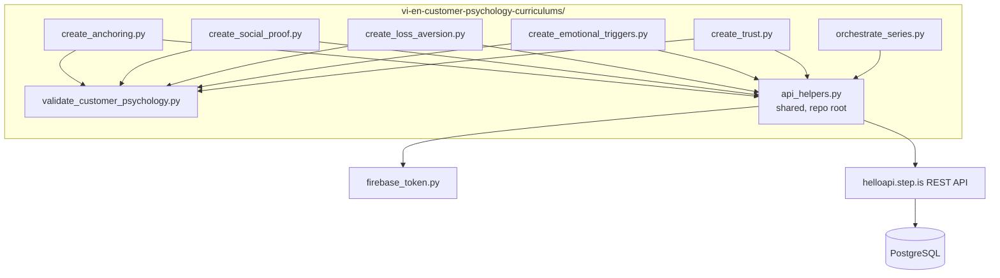
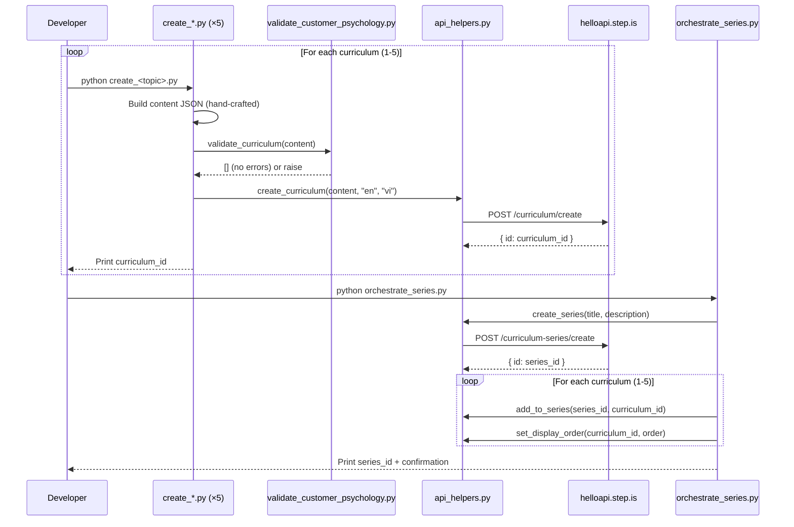

# Design Document: Vietnamese-English Customer Psychology Curriculums

## Overview

This design covers the creation of 5 English-learning curriculums for Vietnamese speakers at the preintermediate-to-intermediate level, focused on **customer psychology for sales and service**. The system follows the same 4-session speaking-focus pattern as the salmon-cooking curriculum (ID `yMq70CXQiBV27WEu`) with 15 vocabulary words per curriculum.

The system consists of:

- **5 standalone Python scripts** — one per curriculum, each containing hand-crafted content about a specific customer psychology principle
- **1 validation script** — checks all structural properties before upload
- **1 orchestrator script** — creates the series, adds curriculums, sets display orders
- **Shared API helpers** — reuses the existing root-level `api_helpers.py` module

The language pair is `userLanguage="vi"` (Vietnamese speakers), `language="en"` (learning English). All marketing text (titles, descriptions, previews) is in Vietnamese. Reading passages are first-person English narratives about applying psychology principles in real business situations.

### Key Design Decisions

1. **New series "Tâm Lý Khách Hàng"**: These curriculums cover customer psychology for sales/service — a distinct topic requiring its own series for clean discoverability.

2. **5 curriculums covering a logical progression**: Anchoring (foundational perception) → Social Proof (crowd behavior) → Loss Aversion (emotional drivers) → Emotional Triggers (narrative persuasion) → Trust (relationship-building). This moves from basic cognitive effects to complex relationship dynamics.

3. **Speaking-focus activity pattern only**: Same minimal pattern as established series — `introAudio → viewFlashcards → reading → readAlong → speakReading`. No `speakFlashcards`, `vocabLevel*`, `writingSentence`, or `writingParagraph`.

4. **Reuse `api_helpers.py`**: The shared module already has `create_curriculum`, `create_series`, `add_to_series`, `set_display_order` — no custom API code needed.

5. **Dedicated validation script**: A `validate_customer_psychology.py` that checks all structural properties specific to the speaking-focus pattern with 15 vocab words across 4 sessions.

6. **Vietnamese business context throughout**: All introAudio examples reference realistic Vietnamese business scenarios (shop owners, salespeople, service providers) — not abstract academic psychology.

## Architecture



### Execution Flow



## Components and Interfaces

### Component 1: Curriculum Creation Scripts (5 scripts)

Each script (`create_anchoring.py`, `create_social_proof.py`, `create_loss_aversion.py`, `create_emotional_triggers.py`, `create_trust.py`) is a standalone Python file that:

- Imports `api_helpers` from the repo root via `sys.path` manipulation
- Imports `validate_curriculum` from the local validation script
- Defines `W1`, `W2`, `W3` word groups (5 words each) and `ALL_WORDS`
- Builds the full `content` JSON dict with all hand-written text
- Runs validation before upload
- Calls `create_curriculum(content, "en", "vi")`
- Prints the created curriculum ID

**Script interface pattern:**
```python
import sys
import json
import logging

sys.path.insert(0, "/home/ubuntu/nspaceresearch/design-curriculums")
from api_helpers import create_curriculum
sys.path.insert(0, "/home/ubuntu/nspaceresearch/design-curriculums/vi-en-customer-psychology-curriculums")
from validate_customer_psychology import validate_curriculum

def build_content() -> dict:
    """Build the curriculum content dict with all hand-crafted text."""
    return { ... }

def main():
    content = build_content()
    errors = validate_curriculum(content)
    if errors:
        for e in errors:
            print(f"❌ {e}")
        sys.exit(1)
    curriculum_id = create_curriculum(content, "en", "vi")
    print(f"✅ Created: {curriculum_id}")

if __name__ == "__main__":
    main()
```

### Component 2: Orchestrator Script (`orchestrate_series.py`)

Handles series-level operations after all 5 curriculums are created:

```python
import sys
sys.path.insert(0, "/home/ubuntu/nspaceresearch/design-curriculums")
from api_helpers import create_series, add_to_series, set_display_order

SERIES_TITLE = "Tâm Lý Khách Hàng"
SERIES_DESCRIPTION = "..."  # ≤255 chars, one of the 6 tones

# Curriculum IDs (filled in after creation)
ANCHORING_ID = "<filled after create_anchoring.py>"
SOCIAL_PROOF_ID = "<filled after create_social_proof.py>"
LOSS_AVERSION_ID = "<filled after create_loss_aversion.py>"
EMOTIONAL_TRIGGERS_ID = "<filled after create_emotional_triggers.py>"
TRUST_ID = "<filled after create_trust.py>"

def main():
    series_id = create_series(SERIES_TITLE, SERIES_DESCRIPTION)
    print(f"Series created: {series_id}")

    curricula = [
        (ANCHORING_ID, 1),
        (SOCIAL_PROOF_ID, 2),
        (LOSS_AVERSION_ID, 3),
        (EMOTIONAL_TRIGGERS_ID, 4),
        (TRUST_ID, 5),
    ]
    for cid, order in curricula:
        add_to_series(series_id, cid)
        set_display_order(cid, order)

    print(f"✅ Series '{SERIES_TITLE}' assembled with 5 curriculums")

if __name__ == "__main__":
    main()
```

### Component 3: Validation Script (`validate_customer_psychology.py`)

A reusable validation function that checks curriculum content JSON against all structural requirements:

```python
def validate_curriculum(content: dict) -> list[str]:
    """
    Validate curriculum content for the speaking-focus pattern.
    Returns list of validation errors. Empty list = valid.
    """
```

**Validation checks implemented:**
1. Top-level structure: `title`, `description`, `preview.text`, `contentTypeTags: []`, `lengthTags`, `skillFocusTags`, `difficultyTags`, `learningSessions` (4 elements)
2. Session count = 4, each with non-empty `title` and `activities` array
3. Activity order per session: `introAudio → viewFlashcards → reading → readAlong → speakReading`
4. Vocab distribution: sessions 1–3 have 5 words each, session 4 has 15 words
5. All vocabList entries are lowercase strings, field name is `vocabList` (not `words`)
6. Every activity has `activityType` (not `type`), `title`, `description`, `data` object
7. `reading`, `speakReading`, `readAlong`, `introAudio` have non-empty `data.text`
8. Title format conventions: "Flashcards:", "Đọc:", "Nghe:"
9. readAlong description = "Nghe đoạn văn vừa đọc và theo dõi."
10. No strip-keys anywhere in JSON tree
11. Reading passages in sessions 1–3: 2–4 sentences, contain all 5 vocab words
12. Session 4 reading: 6–12 sentences, contains all 15 vocab words
13. introAudio scripts contain all vocab words for that session
14. Valid activityType values only

### Interface: helloapi REST API

All endpoints are POST to `https://helloapi.step.is`. Authentication via `firebaseIdToken` in JSON body.

| Endpoint | Purpose | Key Params |
|---|---|---|
| `curriculum/create` | Create curriculum | `language: "en"`, `userLanguage: "vi"`, `content` (JSON string) |
| `curriculum-series/create` | Create series | `title`, `description` |
| `curriculum-series/addCurriculum` | Add to series | `curriculumSeriesId`, `curriculumId` |
| `curriculum/setDisplayOrder` | Set position | `id`, `displayOrder` |

## Data Models

### Curriculum Content JSON Structure

```json
{
  "title": "Ấn Tượng Đầu & Hiệu Ứng Neo",
  "description": "ALL-CAPS HEADLINE...\n\nParagraph 2...\n\nParagraph 3...\n\nParagraph 4...\n\nParagraph 5...",
  "preview": {
    "text": "~150 word Vietnamese preview naming all 15 vocab words..."
  },
  "contentTypeTags": [],
  "lengthTags": ["medium"],
  "skillFocusTags": ["speaking_focus"],
  "difficultyTags": ["preintermediate", "vocab_intermediate", "reading_preintermediate"],
  "learningSessions": [
    {
      "title": "Phần 1",
      "activities": [
        {
          "activityType": "introAudio",
          "title": "Giới thiệu từ vựng phần 1",
          "description": "Học 5 từ về ấn tượng đầu và hiệu ứng neo",
          "data": {
            "text": "Vietnamese teaching script (~500-800 words)..."
          }
        },
        {
          "activityType": "viewFlashcards",
          "title": "Flashcards: Ấn tượng đầu tiên",
          "description": "Học 5 từ: anchor, perception, reference, premium, contrast",
          "data": {
            "vocabList": ["anchor", "perception", "reference", "premium", "contrast"]
          }
        },
        {
          "activityType": "reading",
          "title": "Đọc: Định giá sản phẩm",
          "description": "I always set a premium reference price first. My customers...",
          "data": {
            "text": "I always set a premium reference price first. My customers see the contrast between the anchor price and the actual price, and their perception shifts immediately."
          }
        },
        {
          "activityType": "readAlong",
          "title": "Nghe: Định giá sản phẩm",
          "description": "Nghe đoạn văn vừa đọc và theo dõi.",
          "data": {
            "text": "I always set a premium reference price first. My customers see the contrast between the anchor price and the actual price, and their perception shifts immediately."
          }
        },
        {
          "activityType": "speakReading",
          "title": "Đọc: Định giá sản phẩm",
          "description": "I always set a premium reference price first. My customers...",
          "data": {
            "text": "I always set a premium reference price first. My customers see the contrast between the anchor price and the actual price, and their perception shifts immediately."
          }
        }
      ]
    },
    {
      "title": "Phần 2",
      "activities": ["... same pattern with W2 words ..."]
    },
    {
      "title": "Phần 3",
      "activities": ["... same pattern with W3 words ..."]
    },
    {
      "title": "Ôn tập",
      "activities": [
        {
          "activityType": "introAudio",
          "title": "Ôn tập từ vựng",
          "description": "Ôn lại 15 từ về tâm lý khách hàng",
          "data": {
            "text": "Farewell script (400-600 words) reviewing all 15 words..."
          }
        },
        {
          "activityType": "viewFlashcards",
          "title": "Flashcards: Tất cả từ vựng",
          "description": "Học 15 từ: anchor, perception, reference, ...",
          "data": {
            "vocabList": ["... all 15 words ..."]
          }
        },
        {
          "activityType": "reading",
          "title": "Đọc: Chiến lược bán hàng",
          "description": "First ~80 chars of the combined passage...",
          "data": {
            "text": "Combined 6-12 sentence passage using all 15 words..."
          }
        },
        {
          "activityType": "readAlong",
          "title": "Nghe: Chiến lược bán hàng",
          "description": "Nghe đoạn văn vừa đọc và theo dõi.",
          "data": {
            "text": "Same combined passage..."
          }
        },
        {
          "activityType": "speakReading",
          "title": "Đọc: Chiến lược bán hàng",
          "description": "First ~80 chars of the combined passage...",
          "data": {
            "text": "Same combined passage..."
          }
        }
      ]
    }
  ]
}
```

### Session Activity Pattern

| Session | Activities | Vocab Count |
|---|---|---|
| Phần 1 | introAudio → viewFlashcards(5) → reading → readAlong → speakReading | 5 (W1) |
| Phần 2 | introAudio → viewFlashcards(5) → reading → readAlong → speakReading | 5 (W2) |
| Phần 3 | introAudio → viewFlashcards(5) → reading → readAlong → speakReading | 5 (W3) |
| Ôn tập | introAudio → viewFlashcards(15) → reading → readAlong → speakReading | 15 (ALL) |

### Curriculum Topics, Tones, and Vocabulary

| # | Display Order | Title | Topic | Desc Tone | Farewell Tone |
|---|---|---|---|---|---|
| 1 | 1 | Ấn Tượng Đầu & Hiệu Ứng Neo | First impressions & anchoring effect | provocative_question | introspective_guide |
| 2 | 2 | Bằng Chứng Xã Hội & Tâm Lý Bầy Đàn | Social proof & herd mentality | bold_declaration | warm_accountability |
| 3 | 3 | Sợ Mất & Tâm Lý Khẩn Cấp | Loss aversion & urgency | vivid_scenario | team_building_energy |
| 4 | 4 | Cảm Xúc & Nghệ Thuật Kể Chuyện | Emotional triggers & storytelling | empathetic_observation | quiet_awe |
| 5 | 5 | Xây Dựng Niềm Tin & Có Qua Có Lại | Trust & reciprocity | surprising_fact | practical_momentum |

**Tone rationale:**
- Anchoring uses `provocative_question` — opens by asking why customers always buy the second-cheapest option, hitting a curiosity gap about pricing psychology.
- Social Proof uses `bold_declaration` — opens with a confident assertion about how 90% of customers check reviews before buying.
- Loss Aversion uses `vivid_scenario` — opens with "imagine your customer is about to leave without buying" to create urgency.
- Emotional Triggers uses `empathetic_observation` — opens by naming the struggle of connecting emotionally with customers in English.
- Trust uses `surprising_fact` — opens with a counterintuitive fact about how giving away value first increases revenue.

**Farewell tone rationale:**
- Each curriculum uses a unique farewell register from the 5-tone palette, ensuring variety across the series.

### Vocabulary Allocation (75 unique words across 5 curriculums)

**Curriculum 1 — Ấn Tượng Đầu & Hiệu Ứng Neo (First Impressions & Anchoring):**
- W1: anchor, perception, reference, premium, contrast
- W2: bias, initial, frame, benchmark, expectation
- W3: impression, positioning, threshold, baseline, cognitive

**Curriculum 2 — Bằng Chứng Xã Hội & Tâm Lý Bầy Đàn (Social Proof & Herd Mentality):**
- W1: testimonial, endorsement, consensus, conform, influence
- W2: popularity, bandwagon, credibility, peer, validation
- W3: trend, follower, mainstream, viral, recommendation

**Curriculum 3 — Sợ Mất & Tâm Lý Khẩn Cấp (Loss Aversion & Urgency):**
- W1: scarcity, deadline, urgency, exclusive, limited
- W2: hesitation, regret, countdown, shortage, expire
- W3: forfeit, opportunity, irreversible, procrastinate, incentive

**Curriculum 4 — Cảm Xúc & Nghệ Thuật Kể Chuyện (Emotional Triggers & Storytelling):**
- W1: narrative, empathy, compelling, resonate, aspiration
- W2: nostalgia, curiosity, vulnerable, authentic, relatable
- W3: inspire, evoke, tension, climax, transformation

**Curriculum 5 — Xây Dựng Niềm Tin & Có Qua Có Lại (Trust & Reciprocity):**
- W1: transparency, reciprocity, loyalty, guarantee, integrity
- W2: rapport, generosity, commitment, consistency, reputation
- W3: goodwill, reliable, trustworthy, accountability, credibility

**Vocabulary selection rationale:**
- All words are practical English terms that Vietnamese business owners/salespeople encounter in business reading but need practice producing in speech
- Words are at preintermediate-to-intermediate level — familiar from reading but not yet active vocabulary
- Each curriculum's 15 words are tightly themed around its specific psychology principle
- Zero overlap between the 5 curriculums (75 unique words total)
- Words are chosen for their applicability in real sales/service conversations

### Series Metadata

| Field | Value |
|---|---|
| Title | Tâm Lý Khách Hàng |
| Description | (≤255 chars, `metaphor_led` tone) — e.g., "Tâm lý khách hàng là chiếc chìa khóa vàng — hiểu được nó, bạn mở được mọi cánh cửa bán hàng. 5 khóa học giúp bạn nói tiếng Anh về neo giá, bằng chứng xã hội, sự khan hiếm, cảm xúc và niềm tin." |
| Language | en (inferred from member curriculums) |
| User Language | vi (inferred from member curriculums) |
| isPublic | false (until content generation complete) |

### API Call Sequence

1. `python create_anchoring.py` → creates curriculum, prints ID
2. `python create_social_proof.py` → creates curriculum, prints ID
3. `python create_loss_aversion.py` → creates curriculum, prints ID
4. `python create_emotional_triggers.py` → creates curriculum, prints ID
5. `python create_trust.py` → creates curriculum, prints ID
6. Fill IDs into `orchestrate_series.py`
7. `python orchestrate_series.py` → creates series, adds all 5 curriculums, sets display orders
8. Run duplicate check queries
9. Verify via SQL
10. Create README.md, delete all `.py` scripts


## Correctness Properties

*A property is a characteristic or behavior that should hold true across all valid executions of a system — essentially, a formal statement about what the system should do. Properties serve as the bridge between human-readable specifications and machine-verifiable correctness guarantees.*

The validation script (`validate_customer_psychology.py`) implements these properties as deterministic checks against the curriculum content JSON. Since the content is hand-written JSON (not generated from random inputs), these properties are validated as structural assertions run once per curriculum before upload — not as randomized property-based tests. The input space is finite (5 curriculums), so exhaustive checking is more appropriate than PBT.

### Property 1: Session structure invariant

*For any* curriculum, it SHALL have exactly 4 sessions. Sessions 1–3 SHALL each contain activities in the exact order: `introAudio`, `viewFlashcards`, `reading`, `readAlong`, `speakReading`. Session 4 SHALL follow the same activity order with `viewFlashcards` containing all 15 words.

**Validates: Requirements 1.1–1.5, 1.7–1.10, 14.2**

### Property 2: Vocabulary distribution

*For any* curriculum, sessions 1–3 SHALL each have exactly 5 vocabulary words in their `viewFlashcards` activity, and session 4's `viewFlashcards` SHALL contain all 15 words (the union of sessions 1–3). All 15 words SHALL be unique within the curriculum.

**Validates: Requirements 1.6, 3.7**

### Property 3: Reading passage constraints

*For any* reading passage in sessions 1–3, it SHALL be 2–4 sentences, use first-person perspective ("I" or "My"), and contain all 5 vocabulary words for that session. *For any* session 4 reading passage, it SHALL be 6–12 sentences and contain all 15 vocabulary words.

**Validates: Requirements 2.1, 2.2, 2.8, 2.9, 2.10**

### Property 4: Vocabulary format

*For any* `vocabList` in any activity across all curriculums, every entry SHALL be a lowercase string. The field name SHALL be `vocabList` (never `words`).

**Validates: Requirements 3.7, 7.9**

### Property 5: Cross-curriculum vocabulary uniqueness

*For any* pair of curriculums in the series, their vocabulary word sets SHALL be disjoint — no word appears in more than one curriculum. The 5 curriculums SHALL have exactly 75 unique words total.

**Validates: Requirements 3.8, 14.3**

### Property 6: Activity schema compliance

*For any* activity in any session, it SHALL have `activityType` (never `type`), `title` (non-empty string), `description` (non-empty string), and a `data` object. `viewFlashcards` SHALL use `vocabList` (never `words`). `reading`, `speakReading`, `readAlong`, and `introAudio` SHALL have `data.text` as a non-empty string.

**Validates: Requirements 7.1, 7.7, 7.8, 7.9, 7.10, 7.11, 15.3**

### Property 7: Activity title format conventions

*For any* `viewFlashcards` activity, its title SHALL start with "Flashcards:". *For any* `reading` or `speakReading` activity, its title SHALL start with "Đọc:". *For any* `readAlong` activity, its title SHALL start with "Nghe:" and its description SHALL be exactly "Nghe đoạn văn vừa đọc và theo dõi." *For any* session, it SHALL have a non-empty `title`.

**Validates: Requirements 7.2, 7.3, 7.4, 7.6**

### Property 8: Top-level content structure

*For any* curriculum content JSON, it SHALL have a non-empty `title`, non-empty `description`, a `preview` object with non-empty `text`, `contentTypeTags` equal to `[]`, `lengthTags` equal to `["medium"]`, `skillFocusTags` equal to `["speaking_focus"]`, `difficultyTags` equal to `["preintermediate", "vocab_intermediate", "reading_preintermediate"]`, and `learningSessions` with exactly 4 elements.

**Validates: Requirements 8.1–8.8, 15.1, 15.2**

### Property 9: Strip-keys compliance

*For any* curriculum content JSON, none of the following keys SHALL appear anywhere in the structure: `mp3Url`, `illustrationSet`, `chapterBookmarks`, `segments`, `whiteboardItems`, `userReadingId`, `lessonUniqueId`, `curriculumTags`, `taskId`, `imageId`.

**Validates: Requirements 9.1, 15.6**

### Property 10: introAudio vocabulary coverage

*For any* introAudio in sessions 1–3, the script text SHALL contain all 5 vocabulary words for that session. *For any* session 4 introAudio (review/farewell), the script text SHALL contain all 15 vocabulary words.

**Validates: Requirements 6.1, 6.2**

### Property 11: Valid activity types

*For any* activity in any session, the `activityType` value SHALL be one of: `introAudio`, `viewFlashcards`, `reading`, `speakReading`, `readAlong`.

**Validates: Requirements 15.4**

## Error Handling

### Validation Failures

The validation script runs against each curriculum's content JSON before upload. If any property fails, the script prints the specific violation(s) and exits — no upload occurs until all properties pass.

```python
errors = validate_curriculum(content)
if errors:
    for e in errors:
        print(f"❌ {e}")
    sys.exit(1)
```

### API Call Failures

- Each creation script wraps the API call via `api_helpers.create_curriculum()` which raises on HTTP errors
- If `curriculum/create` fails, the script exits with the error — no partial state to clean up
- The orchestrator checks each step's response before proceeding to the next
- If `curriculum-series/addCurriculum` fails, the curriculum still exists but isn't in the series — logged for manual resolution
- If `curriculum/setDisplayOrder` fails, the curriculum is in the series but without explicit order — logged for manual resolution

### Duplicate Prevention

After creation, run duplicate check:
```sql
SELECT id, content->>'title' as title, created_at
FROM curriculum
WHERE content->>'title' IN (
  'Ấn Tượng Đầu & Hiệu Ứng Neo',
  'Bằng Chứng Xã Hội & Tâm Lý Bầy Đàn',
  'Sợ Mất & Tâm Lý Khẩn Cấp',
  'Cảm Xúc & Nghệ Thuật Kể Chuyện',
  'Xây Dựng Niềm Tin & Có Qua Có Lại'
)
  AND uid = 'zs5AMpVfqkcfDf8CJ9qrXdH58d73'
  AND uid NOT LIKE '%_deleted'
ORDER BY content->>'title', created_at;
```
Keep earliest, delete extras. Remove from series before deleting curriculum.

## Testing Strategy

### Validation Script (Primary)

Since this is hand-written content uploaded via API (not a software library with random inputs), property-based testing with randomized inputs is not applicable. Instead, a deterministic validation script checks all 11 correctness properties against each curriculum's content JSON.

**Why PBT does not apply:**
- The 5 creation scripts are side-effect-only operations (API calls with hand-crafted content)
- The input space is finite (exactly 5 curriculums) — exhaustive checking is trivial
- No pure functions with variable input are introduced
- Remaining verification is integration-level (SQL queries to confirm correct state in DB)

### Validation Checks Implemented

The script implements all properties as assertions:
- Session count = 4 and activity order per session (Property 1)
- Vocab distribution: 5/5/5/15 (Property 2)
- Reading passage sentence count, first-person check, vocab presence (Property 3)
- Vocab format: all lowercase strings, field name `vocabList` (Property 4)
- Cross-curriculum vocab uniqueness (Property 5) — checked by passing all 5 vocab sets
- Activity schema: activityType, title, description, data object (Property 6)
- Title format conventions (Property 7)
- Top-level structure: title, description, preview, tags (Property 8)
- Strip-keys absence (Property 9)
- introAudio vocab coverage (Property 10)
- Valid activityType values (Property 11)

### Integration Verification (Post-Execution)

After all 5 scripts run and orchestrator completes:

```sql
-- Verify all 5 curriculums in the series
SELECT csi.curriculum_id, c.content->>'title' as title, c.display_order, c.is_public
FROM curriculum_series_items csi
JOIN curriculum c ON c.id = csi.curriculum_id
WHERE csi.curriculum_series_id = '<series_id>'
ORDER BY c.display_order;

-- Verify language pair
SELECT id, content->>'title' as title, language, user_language
FROM curriculum WHERE id IN ('<anchoring_id>', '<social_proof_id>', '<loss_aversion_id>', '<emotional_triggers_id>', '<trust_id>');

-- Verify no duplicates
SELECT content->>'title' as title, count(*)
FROM curriculum
WHERE uid = 'zs5AMpVfqkcfDf8CJ9qrXdH58d73'
  AND content->>'title' IN (
    'Ấn Tượng Đầu & Hiệu Ứng Neo',
    'Bằng Chứng Xã Hội & Tâm Lý Bầy Đàn',
    'Sợ Mất & Tâm Lý Khẩn Cấp',
    'Cảm Xúc & Nghệ Thuật Kể Chuyện',
    'Xây Dựng Niềm Tin & Có Qua Có Lại'
  )
  AND uid NOT LIKE '%_deleted'
GROUP BY content->>'title'
HAVING count(*) > 1;

-- Verify is_public = false
SELECT id, content->>'title' as title, is_public
FROM curriculum WHERE id IN ('<anchoring_id>', '<social_proof_id>', '<loss_aversion_id>', '<emotional_triggers_id>', '<trust_id>');
```

### Post-Creation Cleanup Checklist

1. ✅ All 5 curriculums exist in DB with correct content
2. ✅ All 5 are in the series with display orders 1–5
3. ✅ No duplicate curriculums
4. ✅ All curriculums are `is_public: false`
5. ✅ Series description is under 255 characters
6. ✅ No vocabulary overlap between the 5 curriculums (75 unique words)
7. ✅ README.md created with full documentation
8. ✅ All `.py` scripts deleted from the folder
