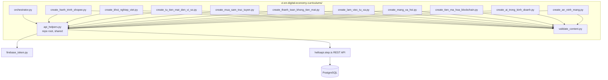

# Design Document: Vietnamese-English Digital Economy Curriculums

## Overview

This design covers the creation of 10 English-learning curriculums for Vietnamese-speaking adults on the topic of the Digital Economy (Kinh Tế Số). The system consists of:

- **10 standalone Python scripts** — one per curriculum, each containing all hand-crafted Vietnamese marketing copy, English reading passages, bilingual introAudio scripts, and writing prompts for that subtopic
- **1 orchestrator script** — creates the collection, the 3 series, wires them together, and sets series display orders
- **1 content validator module** — validates curriculum JSON against the Content Corruption Detection Rules and the format-specific structural rules of this spec before upload
- **Shared root-level API helpers** — reuses `api_helpers.py` at the repo root for all REST API calls (Firebase auth, error handling, logging)

The language pair is `userLanguage="vi"` (Vietnamese speakers) and `language="en"` (learning English). All marketing text (titles, descriptions, previews) is in Vietnamese. Reading passages are in English. introAudio scripts are bilingual (Vietnamese explanations of English vocabulary). Difficulty levels: 5 preintermediate + 5 intermediate, all 4 sessions, all priced at 49 credits, all created private.

The 10 curriculums split across 3 skill-focus formats:

| Format | Count | contentTypeTags | Reading style |
|---|---|---|---|
| Story-Reading (`story_reading`) | 3 | `["story"]` | Narrative passages 150-250 words, one continuous story across 4 sessions |
| Speaking (`speaking`) | 3 | `[]` | Short conversational/instructional passages 80-150 words |
| Balanced (`balanced`) | 4 | `[]` | Expository passages 100-200 words |

### Key Design Decisions

1. **Reuse root-level `api_helpers.py`** — already wraps every endpoint needed (`create_curriculum`, `add_to_series`, `set_display_order`, `set_price`, `create_collection`, `create_series`, `add_series_to_collection`, `set_series_display_order`) with Firebase auth and logging. No new helper module is needed.

2. **Format-aware validator** — a new `vi-en-digital-economy-curriculums/validate_content.py` exposes a `validate(content, fmt)` function where `fmt` is one of `"story_reading"`, `"speaking"`, `"balanced"`. The validator enforces all CONTENT_CORRUPTION_RULES.md rules plus this spec's structural rules (exactly 4 sessions, 5 unique words per session, 20 unique words per curriculum, activity-sequence templates per format, contentTypeTags per format, and average-sentence-length bounds for reading passages by level).

3. **Shared activity-sequence templates** — every script imports a small dictionary of expected activity-type sequences from the validator module. The validator owns the canonical templates so a script and its validation cannot drift.

4. **Tone assignments pre-planned in design** — with 10 curriculums spread across 3 series and 5 levels, all description-tone, farewell-register, and series-tone choices are computed up front in this document and hard-coded into each script. This gives a single source of truth for adjacency/distribution constraints.

5. **No content templating** — the activity-structure scaffolding (types, order, data schema) lives in shared helpers, but every introAudio script, reading passage, description, preview, and writing prompt is hand-written for its specific subtopic. No f-string templates assemble the learner-facing text.

6. **Private by default** — no script calls `setPublic`. All 10 curriculums stay private until content generation (audio, illustrations) completes.

7. **Single shared collection** — the 10 curriculums share one Vietnamese-titled collection that wraps the 3 skill-focus series. The collection itself has no `displayOrder` set per workspace rules.

8. **No financial advice** — crypto and AI subtopics are presented as educational/contextual content only. The validator does not attempt to detect this; it is enforced by hand-written content review.

## Architecture



### Execution Flow

```mermaid
sequenceDiagram
    participant Dev as Developer
    participant Orch as orchestrator.py
    participant Script as create_*.py (x10)
    participant Val as validate_content.py
    participant API as api_helpers.py
    participant Server as helloapi.step.is

    Dev->>Orch: python orchestrator.py
    Orch->>API: create_collection("Học Tiếng Anh Qua Kinh Tế Số", ...)
    API->>Server: POST /curriculum-collection/create
    Server-->>API: { id: collection_id }
    Orch->>API: create_series x3 (story-reading, speaking, balanced)
    Orch->>API: add_series_to_collection x3
    Orch->>API: set_series_display_order x3
    Orch-->>Dev: Print collection_id, series_ids

    loop For each curriculum (1-10) in spec order
        Dev->>Script: python create_<topic>.py
        Script->>Script: build_content() — hand-crafted JSON
        Script->>Val: validate(content, fmt)
        Val-->>Script: OK or raise ValueError
        Script->>API: create_curriculum(content, "en", "vi")
        API->>Server: POST /curriculum/create
        Server-->>API: { id: curriculum_id }
        Script->>API: add_to_series(series_id, curriculum_id)
        Script->>API: set_display_order(curriculum_id, order)
        Script->>API: set_price(curriculum_id, 49)
        Script-->>Dev: Print curriculum_id
    end
```



Phased execution per Requirement 16: orchestrator → 3 story-reading scripts → 3 speaking scripts → 4 balanced scripts. Each phase ends with a verification checkpoint.

## Components and Interfaces

### 1. orchestrator.py

Creates the collection and the 3 series, wires them together, and sets series display orders. Idempotent in spirit but not in code — it is run exactly once per environment.

**Inputs:** None (all titles, descriptions, and tone assignments hard-coded)

**Outputs:** Prints collection ID and the 3 series IDs to stdout for the developer to paste into the per-curriculum scripts.

**API calls:**
- `curriculum-collection/create` — 1 call
- `curriculum-series/create` — 3 calls
- `curriculum-collection/addSeriesToCollection` — 3 calls
- `curriculum-series/setDisplayOrder` — 3 calls

**Collection:**
- Title: `"Học Tiếng Anh Qua Kinh Tế Số"` (Learn English through the Digital Economy)
- Description: short Vietnamese category summary describing the digital-economy theme and the 10 curriculums spanning preintermediate-to-intermediate. Neutral informative voice, not persuasive copy. No `displayOrder` set on the collection (per workspace rules and Req 13.10).

**Series:**

| # | Series Title | Skill Focus | # Curriculums | Series description tone | Levels |
|---|---|---|---|---|---|
| 1 | Câu Chuyện Kinh Tế Số | Story-reading | 3 | `vivid_scenario` | 1 preinter + 2 inter |
| 2 | Nói Chuyện Kinh Tế Số | Speaking | 3 | `empathetic_observation` | 3 preinter |
| 3 | Khám Phá Kinh Tế Số | Balanced skills | 4 | `bold_declaration` | 1 preinter + 3 inter |

All 3 series use different palette tones (Req 13.7). Each series description is ≤255 chars persuasive hook.

Series display orders within the collection: Series 1 = 1, Series 2 = 2, Series 3 = 3.

### 2. validate_content.py

Format-aware content validator. Single public function:

```python
def validate(content: dict, fmt: str) -> None:
    """
    Validate curriculum content for the vi-en Digital Economy spec.

    Args:
        content: The full curriculum content dict (top-level title, description,
                 preview, contentTypeTags, learningSessions).
        fmt: One of "story_reading", "speaking", "balanced".

    Raises:
        ValueError with a specific message identifying the rule, the JSON path
        (e.g., "learningSessions[1].activities[3].data.vocabList"), and the
        expected vs actual value.
    """
```

**Constants exposed by the module:**

```python
STRIP_KEYS = {
    "mp3Url", "illustrationSet", "chapterBookmarks", "segments",
    "whiteboardItems", "userReadingId", "lessonUniqueId",
    "curriculumTags", "taskId", "imageId",
    # Also defensive — present in strip-keys.json:
    "practiceMinutes", "practiceTime", "difficultyTags", "skillFocusTags",
}

VALID_ACTIVITY_TYPES = {
    "introAudio", "viewFlashcards", "speakFlashcards",
    "vocabLevel1", "vocabLevel2", "vocabLevel3",
    "reading", "speakReading", "readAlong",
    "writingSentence", "writingParagraph",
}

ACTIVITY_TEMPLATES = {
    "story_reading": [
        # Session 1
        ["introAudio", "viewFlashcards", "speakFlashcards",
         "reading", "speakReading", "readAlong", "introAudio"],
        # Session 2
        ["introAudio", "viewFlashcards", "speakFlashcards",
         "reading", "speakReading", "readAlong", "introAudio"],
        # Session 3
        ["introAudio", "viewFlashcards", "speakFlashcards", "vocabLevel1",
         "reading", "speakReading", "readAlong", "introAudio"],
        # Session 4 (Final)
        ["introAudio", "viewFlashcards", "speakFlashcards", "vocabLevel1",
         "reading", "speakReading", "readAlong", "writingSentence",
         "introAudio"],
    ],
    "speaking": [
        # Session 1
        ["introAudio", "viewFlashcards", "speakFlashcards", "vocabLevel1",
         "speakFlashcards", "reading", "speakReading", "introAudio"],
        # Session 2
        ["introAudio", "viewFlashcards", "speakFlashcards", "vocabLevel1",
         "speakFlashcards", "reading", "speakReading", "introAudio"],
        # Session 3
        ["introAudio", "viewFlashcards", "speakFlashcards", "vocabLevel1",
         "speakFlashcards", "reading", "speakReading", "introAudio"],
        # Session 4 (Final)
        ["introAudio", "viewFlashcards", "speakFlashcards", "vocabLevel1",
         "vocabLevel2", "speakFlashcards", "reading", "speakReading",
         "readAlong", "writingSentence", "introAudio"],
    ],
    "balanced": [
        # Session 1
        ["introAudio", "viewFlashcards", "speakFlashcards", "vocabLevel1",
         "reading", "speakReading", "readAlong", "introAudio"],
        # Session 2
        ["introAudio", "viewFlashcards", "speakFlashcards", "vocabLevel1",
         "reading", "speakReading", "readAlong", "introAudio"],
        # Session 3
        ["introAudio", "viewFlashcards", "speakFlashcards", "vocabLevel1",
         "reading", "speakReading", "readAlong", "writingSentence",
         "introAudio"],
        # Session 4 (Final)
        ["introAudio", "viewFlashcards", "speakFlashcards", "vocabLevel1",
         "vocabLevel2", "reading", "speakReading", "readAlong",
         "writingSentence", "writingParagraph", "introAudio"],
    ],
}

CONTENT_TYPE_TAGS = {
    "story_reading": ["story"],
    "speaking": [],
    "balanced": [],
}
```

**Validation checks (in execution order):**

| # | Rule | Source |
|---|---|---|
| 1 | `content` is a dict | corruption rules §1 |
| 2 | `title` is a non-empty string | Req 10.1 |
| 3 | `description` is a non-empty string | Req 10.1 |
| 4 | `preview` is a dict and `preview.text` is a non-empty string | Req 10.1 |
| 5 | `contentTypeTags == CONTENT_TYPE_TAGS[fmt]` | Reqs 1.5, 1.6, 10.12 |
| 6 | `learningSessions` is a list with exactly 4 elements | Reqs 3.4, 10.2 |
| 7 | Each session has a non-empty `title` and a non-empty `activities` list | Reqs 9.9, 10.2 |
| 8 | Activity sequence in each session matches `ACTIVITY_TEMPLATES[fmt][i]` | Reqs 3.1-3.3, 3.7-3.8 |
| 9 | Each activity has `activityType`, `title`, `description`, `data` (dict); no `type` field; activityType in `VALID_ACTIVITY_TYPES` | Reqs 9.1, 9.2, 10.3, 10.4, corruption rules §3 |
| 10 | Activity `title` and `description` follow the per-type conventions in Req 9.8 | Req 9.8 |
| 11 | `vocabList` is an array of lowercased strings (1-64 chars each, 1-20 items); never named `words` | Reqs 9.3, 10.5 |
| 12 | viewFlashcards / speakFlashcards / vocabLevel1 in the same session share an identical `data.vocabList` | Reqs 9.4, 10.6 |
| 13 | The `data.vocabList` taught in each of the 4 sessions (the Session_Vocab_Group) has exactly 5 unique words | Reqs 5.1, 10.7 |
| 14 | The union of the 4 Session_Vocab_Groups has exactly 20 unique words | Reqs 5.1, 10.8 |
| 15 | `reading` / `speakReading` / `readAlong` activities have `data.text` non-empty | corruption rules §4 |
| 16 | `writingSentence` has `data.vocabList`, `data.items` (non-empty), each item has non-empty `prompt` and `targetVocab` (and `targetVocab` ∈ `data.vocabList`) | Reqs 9.6, 10.9 |
| 17 | `writingParagraph` has `data.vocabList`, `data.instructions` non-empty, `data.prompts` length ≥ 2 of non-empty strings | Reqs 9.7, 10.10 |
| 18 | No `STRIP_KEYS` key appears anywhere in the JSON tree (recursive scan over dicts and lists) | Reqs 1.7, 10.11, corruption rules §6 |
| 19 | The introAudio scripts in session 4 (the farewell, the last `introAudio`) are between 400 and 600 words; the welcome introAudio in session 1 is 500-800 words; mid-session wrap-ups are 200-400 words (best-effort word count check based on whitespace tokens) | Reqs 8.1, 8.3, 8.4 |
| 20 | The reading passage average sentence length across all `reading` and `speakReading` activities is within bounds: 10-14 words/sentence for preintermediate, 12-18 words/sentence for intermediate (level argument optional, default `None` means the check is skipped — script callers pass the curriculum level explicitly) | Req 2.4 |

The validator signature is therefore actually `validate(content: dict, fmt: str, level: str | None = None)` where `level` is `"preintermediate"` or `"intermediate"`. Scripts always pass `level`.

The validator is a **pure function**: no I/O, no global state. It either returns `None` or raises `ValueError`. This makes it the natural target for property-based testing.

### 3. Per-curriculum scripts (10 scripts)

Each `create_<topic>.py` is standalone and contains every piece of hand-crafted text for one curriculum. Common shape:

```python
# create_<topic>.py
import sys
import logging

sys.path.insert(0, "/home/ubuntu/nspaceresearch/design-curriculums")
sys.path.insert(0, "/home/ubuntu/nspaceresearch/design-curriculums/vi-en-digital-economy-curriculums")
from api_helpers import create_curriculum, add_to_series, set_display_order, set_price
from validate_content import validate

logging.basicConfig(level=logging.INFO, format="%(asctime)s %(levelname)s %(name)s: %(message)s")

# Identifiers from orchestrator output
SERIES_ID = "<series_id_from_orchestrator>"
DISPLAY_ORDER = <N>          # 1-based within the series
PRICE = 49
LEVEL = "preintermediate"    # or "intermediate"
FMT = "story_reading"        # or "speaking" or "balanced"

VOCAB_GROUPS = [
    ["...", "...", "...", "...", "..."],   # Session 1, 5 words
    ["...", "...", "...", "...", "..."],   # Session 2, 5 words
    ["...", "...", "...", "...", "..."],   # Session 3, 5 words
    ["...", "...", "...", "...", "..."],   # Session 4, 5 words
]

def build_content() -> dict:
    """Build the full curriculum content dict — every learner-facing string is hand-written here."""
    return {
        "title": "...",                       # 2-8 words, ≤50 chars, Vietnamese
        "description": "...",                 # Persuasive copy with assigned tone
        "preview": {"text": "..."},           # ~150 words, Vietnamese
        "contentTypeTags": [...],             # ["story"] or []
        "learningSessions": [
            {"title": "...", "activities": [...]},   # Session 1
            {"title": "...", "activities": [...]},   # Session 2
            {"title": "...", "activities": [...]},   # Session 3
            {"title": "...", "activities": [...]},   # Session 4 (final)
        ],
    }

def main():
    content = build_content()
    validate(content, fmt=FMT, level=LEVEL)
    curriculum_id = create_curriculum(content, "en", "vi")
    add_to_series(SERIES_ID, curriculum_id)
    set_display_order(curriculum_id, DISPLAY_ORDER)
    set_price(curriculum_id, PRICE)
    print(f"Created: {curriculum_id}")

if __name__ == "__main__":
    main()
```

Activity-construction may use small structural helpers within each script (e.g., a local `def flashcards(topic, vocab) -> dict` returning the activity dict with the conventional title/description/data). The helpers may not generate any learner-facing text content — only the structural envelope.

### 4. Curriculum specifications (per Requirement 2 with vocab plan)

Each curriculum is fully specified below. Vocabulary lists are organized into 4 Session_Vocab_Groups (5 words each), with the reading passage theme for each session and tone assignments.

#### Curriculum 1 — "Hành Trình Của Shopee"

- **Series:** 1 (Story-Reading) — display order 1
- **Level:** preintermediate
- **contentTypeTags:** `["story"]`
- **Subtopic:** e-commerce and Vietnamese online shopping habits
- **Description tone:** `provocative_question`
- **Farewell register:** `introspective_guide`
- **Narrative arc:** Mai, a small shop owner in Hanoi who sells fabric, opens her first Shopee store. Across 4 sessions she learns the platform, takes her first orders, navigates returns and reviews, and watches her business grow.

| Session | Theme | Vocab Group (5 words) | Reading length |
|---|---|---|---|
| 1 | Discovering the platform | platform, shopper, browse, listing, cart | 150-200 words |
| 2 | Mai's first orders | checkout, seller, customer, inventory, growth | 150-200 words |
| 3 | Operating an online shop | marketplace, store, supplier, online, shipping | 150-200 words |
| 4 (final) | Mai reflects on her journey | profit, expansion, packaging, transform, journey | 200-250 words |

**Full vocabList (20):** platform, shopper, browse, listing, cart, checkout, seller, customer, inventory, growth, marketplace, store, supplier, online, shipping, profit, expansion, packaging, transform, journey

#### Curriculum 2 — "Câu Chuyện Khởi Nghiệp Việt"

- **Series:** 1 (Story-Reading) — display order 2
- **Level:** intermediate
- **contentTypeTags:** `["story"]`
- **Subtopic:** Vietnamese tech founders and the startup journey
- **Description tone:** `vivid_scenario`
- **Farewell register:** `warm_accountability`
- **Narrative arc:** Composite founder narrative inspired by VNG, Tiki, MoMo, and VinFast. Sessions follow the founder Tuấn from co-founder ideation, to pivot, to scale and unicorn moment.

| Session | Theme | Vocab Group | Reading length |
|---|---|---|---|
| 1 | Birth of an idea | founder, venture, capital, funding, pivot | 150-200 words |
| 2 | Building the company | scale, valuation, milestone, ambition, perseverance | 150-200 words |
| 3 | Mentors and the ecosystem | mentor, ecosystem, innovation, breakthrough, prototype | 150-200 words |
| 4 (final) | Becoming a unicorn | investor, equity, traction, unicorn, vision | 200-250 words |

**Full vocabList (20):** founder, venture, capital, funding, pivot, scale, valuation, milestone, ambition, perseverance, mentor, ecosystem, innovation, breakthrough, prototype, investor, equity, traction, unicorn, vision

#### Curriculum 3 — "Từ Tiền Mặt Đến Ví Số"

- **Series:** 1 (Story-Reading) — display order 3
- **Level:** intermediate
- **contentTypeTags:** `["story"]`
- **Subtopic:** Vietnam's cashless transition and fintech adoption
- **Description tone:** `metaphor_led`
- **Farewell register:** `practical_momentum`
- **Narrative arc:** Bà Hoa, a phở vendor on Hàng Buồm Street, slowly adopts MoMo and VNPay. Across 4 sessions, the story tracks one neighborhood's shift from cash to digital wallets through her eyes.

| Session | Theme | Vocab Group | Reading length |
|---|---|---|---|
| 1 | The cash era | cashless, wallet, transfer, scan, balance | 150-200 words |
| 2 | First digital transactions | transaction, fintech, adoption, convenience, trust | 150-200 words |
| 3 | Trust and regulation | regulation, banking, deposit, withdrawal, generation | 150-200 words |
| 4 (final) | A new normal | instant, secure, ledger, settlement, peer | 200-250 words |

**Full vocabList (20):** cashless, wallet, transfer, scan, balance, transaction, fintech, adoption, convenience, trust, regulation, banking, deposit, withdrawal, generation, instant, secure, ledger, settlement, peer

(Note: `peer` is the single-word lowercased form of `peer-to-peer` per Req 5.6.)

#### Curriculum 4 — "Mua Sắm Trực Tuyến"

- **Series:** 2 (Speaking) — display order 1
- **Level:** preintermediate
- **contentTypeTags:** `[]`
- **Subtopic:** e-commerce conversation (Shopee, Lazada, Tiki)
- **Description tone:** `bold_declaration`
- **Farewell register:** `team_building_energy`
- **Format:** speaking — short conversational/instructional passages of dialogues and how-to explanations.

| Session | Theme | Vocab Group | Reading length |
|---|---|---|---|
| 1 | Placing an order on Shopee | order, item, deliver, package, address | 80-110 words |
| 2 | Reviews and ratings | review, rating, discount, voucher, coupon | 80-110 words |
| 3 | Payment, tracking and confirmation | shipping, payment, confirm, cancel, track | 100-130 words |
| 4 (final) | Returns and customer service dialogue | arrive, damaged, satisfied, refund, return | 120-150 words |

**Full vocabList (20):** order, item, deliver, package, address, review, rating, discount, voucher, coupon, shipping, payment, confirm, cancel, track, arrive, damaged, satisfied, refund, return

#### Curriculum 5 — "Thanh Toán Không Tiền Mặt"

- **Series:** 2 (Speaking) — display order 2
- **Level:** preintermediate
- **contentTypeTags:** `[]`
- **Subtopic:** digital payments conversation (MoMo, VNPay, ZaloPay, QR codes)
- **Description tone:** `empathetic_observation`
- **Farewell register:** `practical_momentum`
- **Format:** speaking

| Session | Theme | Vocab Group | Reading length |
|---|---|---|---|
| 1 | Setting up a digital wallet | account, fee, charge, code, link | 80-110 words |
| 2 | Sending and receiving money | send, receive, receipt, history, statement | 80-110 words |
| 3 | Topping up and recharging | amount, recharge, confirm, success, error | 100-130 words |
| 4 (final) | QR codes and security | qr, password, pin, mobile, verify | 120-150 words |

**Full vocabList (20):** account, fee, charge, code, link, send, receive, receipt, history, statement, amount, recharge, confirm, success, error, qr, password, pin, mobile, verify

(Note: `qr` is the lowercased single-word form referring to QR codes; vocabList strings are lowercase per Req 9.3.)

#### Curriculum 6 — "Làm Việc Từ Xa"

- **Series:** 2 (Speaking) — display order 3
- **Level:** preintermediate
- **contentTypeTags:** `[]`
- **Subtopic:** remote work, video meetings, digital collaboration
- **Description tone:** `surprising_fact`
- **Farewell register:** `warm_accountability`
- **Format:** speaking

| Session | Theme | Vocab Group | Reading length |
|---|---|---|---|
| 1 | Joining a video meeting | remote, meeting, video, microphone, mute | 80-110 words |
| 2 | Collaborating on a project | share, screen, schedule, deadline, project | 80-110 words |
| 3 | Talking with the team | task, team, manager, colleague, message | 100-130 words |
| 4 (final) | Hybrid workdays | reply, available, focus, break, hybrid | 120-150 words |

**Full vocabList (20):** remote, meeting, video, microphone, mute, share, screen, schedule, deadline, project, task, team, manager, colleague, message, reply, available, focus, break, hybrid

#### Curriculum 7 — "Mạng Xã Hội Và Tiếp Thị Số"

- **Series:** 3 (Balanced) — display order 1
- **Level:** preintermediate
- **contentTypeTags:** `[]`
- **Subtopic:** social media and digital marketing in the Vietnamese context (TikTok, Facebook, Instagram, YouTube)
- **Description tone:** `provocative_question`
- **Farewell register:** `quiet_awe`
- **Format:** balanced — expository passages with all skill activities

| Session | Theme | Vocab Group | Reading length |
|---|---|---|---|
| 1 | The basics of social media | post, like, follow, comment, content | 100-130 words |
| 2 | What makes content viral | viral, audience, brand, campaign, influencer | 100-130 words |
| 3 | Reaching the right people | engagement, reach, target, click, banner | 100-130 words |
| 4 (final) | Trends and analytics in Vietnam | promote, channel, trend, hashtag, analytics | 150-200 words |

**Full vocabList (20):** post, like, follow, comment, content, viral, audience, brand, campaign, influencer, engagement, reach, target, click, banner, promote, channel, trend, hashtag, analytics

#### Curriculum 8 — "Tiền Mã Hoá Và Blockchain"

- **Series:** 3 (Balanced) — display order 2
- **Level:** intermediate
- **contentTypeTags:** `[]`
- **Subtopic:** cryptocurrency and blockchain — educational/contextual only, no investment advice
- **Description tone:** `bold_declaration`
- **Farewell register:** `practical_momentum`
- **Format:** balanced

| Session | Theme | Vocab Group | Reading length |
|---|---|---|---|
| 1 | What blockchain is | cryptocurrency, blockchain, decentralized, token, mining | 100-130 words |
| 2 | Exchanges and smart contracts | exchange, address, contract, smart, protocol | 100-130 words |
| 3 | Risks and oversight | volatile, speculative, custody, validate, consensus | 100-130 words |
| 4 (final) | The bigger network picture | network, hash, encryption, immutable, distributed | 150-200 words |

**Full vocabList (20):** cryptocurrency, blockchain, decentralized, token, mining, exchange, address, contract, smart, protocol, volatile, speculative, custody, validate, consensus, network, hash, encryption, immutable, distributed

#### Curriculum 9 — "Trí Tuệ Nhân Tạo Trong Kinh Doanh"

- **Series:** 3 (Balanced) — display order 3
- **Level:** intermediate
- **contentTypeTags:** `[]`
- **Subtopic:** AI and automation in business operations and customer service
- **Description tone:** `metaphor_led`
- **Farewell register:** `introspective_guide`
- **Format:** balanced

| Session | Theme | Vocab Group | Reading length |
|---|---|---|---|
| 1 | Foundations of AI | artificial, intelligence, automate, algorithm, model | 100-130 words |
| 2 | Training and chatbots | predict, dataset, training, chatbot, recommendation | 100-130 words |
| 3 | AI inside the business | efficiency, productivity, machine, learning, generate | 100-130 words |
| 4 (final) | From insight to deployment | analyze, insight, decision, augment, deploy | 150-200 words |

**Full vocabList (20):** artificial, intelligence, automate, algorithm, model, predict, dataset, training, chatbot, recommendation, efficiency, productivity, machine, learning, generate, analyze, insight, decision, augment, deploy

#### Curriculum 10 — "An Ninh Mạng Và Quyền Riêng Tư"

- **Series:** 3 (Balanced) — display order 4
- **Level:** intermediate
- **contentTypeTags:** `[]`
- **Subtopic:** cybersecurity and data privacy fundamentals
- **Description tone:** `vivid_scenario`
- **Farewell register:** `team_building_energy`
- **Format:** balanced

| Session | Theme | Vocab Group | Reading length |
|---|---|---|---|
| 1 | The basics of cybersecurity | cyber, security, password, encryption, privacy | 100-130 words |
| 2 | Common attacks | breach, hacker, phishing, malware, firewall | 100-130 words |
| 3 | Protecting yourself | authentication, vulnerable, protect, identity, leak | 100-130 words |
| 4 (final) | Privacy in the digital economy | scam, fraud, sensitive, consent, threat | 150-200 words |

**Full vocabList (20):** cyber, security, password, encryption, privacy, breach, hacker, phishing, malware, firewall, authentication, vulnerable, protect, identity, leak, scam, fraud, sensitive, consent, threat

### 5. Tone assignment tables

#### 5.1 Description tone assignments (Req 6.4-6.6)

| # | Curriculum | Series | Order | Description tone |
|---|---|---|---|---|
| 1 | Hành Trình Của Shopee | 1 | 1 | provocative_question |
| 2 | Câu Chuyện Khởi Nghiệp Việt | 1 | 2 | vivid_scenario |
| 3 | Từ Tiền Mặt Đến Ví Số | 1 | 3 | metaphor_led |
| 4 | Mua Sắm Trực Tuyến | 2 | 1 | bold_declaration |
| 5 | Thanh Toán Không Tiền Mặt | 2 | 2 | empathetic_observation |
| 6 | Làm Việc Từ Xa | 2 | 3 | surprising_fact |
| 7 | Mạng Xã Hội Và Tiếp Thị Số | 3 | 1 | provocative_question |
| 8 | Tiền Mã Hoá Và Blockchain | 3 | 2 | bold_declaration |
| 9 | Trí Tuệ Nhân Tạo Trong Kinh Doanh | 3 | 3 | metaphor_led |
| 10 | An Ninh Mạng Và Quyền Riêng Tư | 3 | 4 | vivid_scenario |

**Distribution check:**

| Tone | Count | % of 10 |
|---|---|---|
| provocative_question | 2 | 20% |
| vivid_scenario | 2 | 20% |
| metaphor_led | 2 | 20% |
| bold_declaration | 2 | 20% |
| empathetic_observation | 1 | 10% |
| surprising_fact | 1 | 10% |

Max = 20% ≤ 30% (Req 6.6 ✓). Adjacency within each series:

- Series 1 (1, 2, 3): provocative → vivid → metaphor → all distinct adjacent pairs ✓
- Series 2 (4, 5, 6): bold → empathetic → surprising → all distinct adjacent pairs ✓
- Series 3 (7, 8, 9, 10): provocative → bold → metaphor → vivid → all distinct adjacent pairs ✓

#### 5.2 Farewell register assignments (Req 8.7-8.9)

| # | Curriculum | Series | Order | Farewell register |
|---|---|---|---|---|
| 1 | Hành Trình Của Shopee | 1 | 1 | introspective_guide |
| 2 | Câu Chuyện Khởi Nghiệp Việt | 1 | 2 | warm_accountability |
| 3 | Từ Tiền Mặt Đến Ví Số | 1 | 3 | practical_momentum |
| 4 | Mua Sắm Trực Tuyến | 2 | 1 | team_building_energy |
| 5 | Thanh Toán Không Tiền Mặt | 2 | 2 | practical_momentum |
| 6 | Làm Việc Từ Xa | 2 | 3 | warm_accountability |
| 7 | Mạng Xã Hội Và Tiếp Thị Số | 3 | 1 | quiet_awe |
| 8 | Tiền Mã Hoá Và Blockchain | 3 | 2 | practical_momentum |
| 9 | Trí Tuệ Nhân Tạo Trong Kinh Doanh | 3 | 3 | introspective_guide |
| 10 | An Ninh Mạng Và Quyền Riêng Tư | 3 | 4 | team_building_energy |

**Distribution check:**

| Register | Count |
|---|---|
| introspective_guide | 2 |
| warm_accountability | 2 |
| team_building_energy | 2 |
| quiet_awe | 1 |
| practical_momentum | 3 |

All registers used 1-3 times (Req 8.9 ✓). Adjacency within each series:

- Series 1: introspective → warm → practical → all distinct ✓
- Series 2: team → practical → warm → all distinct ✓
- Series 3: quiet_awe → practical → introspective → team → all distinct ✓

#### 5.3 Series description tones (Req 13.7)

| Series | Tone |
|---|---|
| 1 — Câu Chuyện Kinh Tế Số | vivid_scenario |
| 2 — Nói Chuyện Kinh Tế Số | empathetic_observation |
| 3 — Khám Phá Kinh Tế Số | bold_declaration |

All 3 distinct ✓.

### 6. Vocabulary distinctness audit (Req 2.3)

Pairwise overlap of vocabLists across all 10 curriculums (lowercased exact-match counts). All other pairs not listed below have 0 shared words.

| Pair | Shared words | Count |
|---|---|---|
| C1 ∩ C4 | shipping | 1 |
| C4 ∩ C5 | confirm | 1 |
| C4 ∩ C8 | address | 1 |
| C5 ∩ C10 | password | 1 |
| C8 ∩ C10 | encryption | 1 |

Maximum pairwise overlap = 1 ≤ 2 (Req 2.3a ✓). Each repeated word appears in exactly 2 of the 10 curriculums; the full list of repeated words is `{shipping, confirm, address, password, encryption}`. No vocabulary word appears in more than 2 curriculums (Req 2.3b ✓).

### 7. Activity titling conventions (Req 9.8)

The validator enforces these conventions verbatim. The session topic strings used in activity titles are short Vietnamese phrases for each session — for example:

- C1 Session 1: `<topic>` = `"Hành trình Mai mở Shopee"`
- C1 Session 4: `<topic>` = `"Mai và tương lai"`
- C8 Session 1: `<topic>` = `"Khái niệm Blockchain"`

So the viewFlashcards activity in C1 Session 1 has:
- `title`: `"Flashcards: Hành trình Mai mở Shopee"`
- `description`: `"Học 5 từ: platform, shopper, browse, listing, cart"`

The reading activity in the same session has:
- `title`: `"Đọc: Hành trình Mai mở Shopee"`
- `description`: `<first 80 characters of the reading text>`

### 8. Cultural-context plan (Req 2.5)

Every curriculum reaches the floor of 3 explicit Vietnamese platform/brand mentions plus 2 daily-life situations through deliberate planning, not after-the-fact insertion. Concrete plan per curriculum:

| # | Brands/platforms (≥3) | Daily-life situations (≥2) |
|---|---|---|
| 1 | Shopee, Lazada, Tiki | shop owner in Hanoi, students browsing on phones |
| 2 | VNG, Tiki, MoMo, VinFast | Ho Chi Minh City coworking spaces, late-night coding sessions |
| 3 | MoMo, VNPay, ZaloPay | street vendor in Hà Nội, families sending tiền lì xì |
| 4 | Shopee, Lazada, Tiki | university student ordering, parents in Đà Nẵng buying gifts |
| 5 | MoMo, VNPay, ZaloPay | morning coffee at a quán cà phê, paying for grocery delivery |
| 6 | Grab, FPT, VNG | freelancers in cafes, hybrid offices in District 1 |
| 7 | TikTok (used by Vietnamese creators), Shopee, MoMo, VinFast | Vietnamese influencers, weekend markets |
| 8 | VNG, FPT, Tiki | Vietnamese fintech learners, university students |
| 9 | Grab, Shopee, FPT, VNG | customer service chat in HCMC, productivity apps |
| 10 | MoMo, VNPay, FPT | parents protecting accounts, students avoiding scams |

## Data Models

### Curriculum content JSON structure

The complete shape uploaded via `curriculum/create`. Top-level fields and the structure of each session are identical across all 10 curriculums; only the activity counts, content text, and vocabLists vary by format and subtopic.

```json
{
  "title": "Hành Trình Của Shopee",
  "description": "TẠI SAO BÀ MAI BÁN VẢI Ở HÀ NỘI LẠI MỞ SHOPEE TRONG MỘT ĐÊM?\n\nMỗi ngày, hàng triệu người Việt mở Shopee...\n\n[Persuasive copy with provocative_question tone, multi-paragraph 5-beat structure]",
  "preview": {
    "text": "Hãy tưởng tượng bạn đang đứng sau quầy vải nhỏ giữa phố Hàng Đào... [~150 words Vietnamese]"
  },
  "contentTypeTags": ["story"],
  "learningSessions": [
    {
      "title": "Phần 1: Hành trình Mai mở Shopee",
      "activities": [
        {
          "activityType": "introAudio",
          "title": "Giới thiệu bài học",
          "description": "Chào mừng và giới thiệu 5 từ vựng phần 1",
          "data": {
            "text": "Xin chào bạn! Hôm nay chúng ta sẽ cùng theo chân chị Mai... [500-800 words bilingual]"
          }
        },
        {
          "activityType": "viewFlashcards",
          "title": "Flashcards: Hành trình Mai mở Shopee",
          "description": "Học 5 từ: platform, shopper, browse, listing, cart",
          "data": {
            "vocabList": ["platform", "shopper", "browse", "listing", "cart"]
          }
        },
        {
          "activityType": "speakFlashcards",
          "title": "Flashcards: Hành trình Mai mở Shopee",
          "description": "Học 5 từ: platform, shopper, browse, listing, cart",
          "data": {
            "vocabList": ["platform", "shopper", "browse", "listing", "cart"]
          }
        },
        {
          "activityType": "reading",
          "title": "Đọc: Hành trình Mai mở Shopee",
          "description": "Mai owns a small fabric shop in old Hanoi. Every morning she opens the wooden ...",
          "data": {
            "text": "Mai owns a small fabric shop in old Hanoi. Every morning she opens the wooden shutters and arranges her bolts of silk. Lately, fewer shoppers walk past. Her daughter says, \"Mom, you should browse Shopee — it is a platform where everyone in Vietnam sells things now.\" That night, Mai creates her first listing and adds the silk to her cart of items to sell...",
            "vocabList": ["platform", "shopper", "browse", "listing", "cart"]
          }
        },
        {
          "activityType": "speakReading",
          "title": "Đọc: Hành trình Mai mở Shopee",
          "description": "Mai owns a small fabric shop in old Hanoi. Every morning she opens the wooden ...",
          "data": {
            "text": "Mai owns a small fabric shop in old Hanoi..."
          }
        },
        {
          "activityType": "readAlong",
          "title": "Nghe: Hành trình Mai mở Shopee",
          "description": "Nghe đoạn văn vừa đọc và theo dõi.",
          "data": {
            "text": "Mai owns a small fabric shop in old Hanoi..."
          }
        },
        {
          "activityType": "introAudio",
          "title": "Tổng kết phần 1",
          "description": "Tóm tắt phần 1 và bắc cầu sang phần 2",
          "data": {
            "text": "Tuyệt vời! Bạn vừa cùng chị Mai bước những bước đầu tiên... [200-400 words bilingual]"
          }
        }
      ]
    },
    { "title": "Phần 2: ...", "activities": [/* session 2 activities */] },
    { "title": "Phần 3: ...", "activities": [/* session 3 activities */] },
    {
      "title": "Phần 4: Mai và tương lai",
      "activities": [
        /* introAudio (recap), viewFlashcards, speakFlashcards, vocabLevel1 (all 20 words),
           reading (200-250 words conclusion), speakReading, readAlong,
           writingSentence (3-4 items),
           introAudio (farewell, 400-600 words, introspective_guide register) */
      ]
    }
  ]
}
```

### writingSentence item structure

```json
{
  "activityType": "writingSentence",
  "title": "Viết: Hành trình của Mai",
  "description": "Viết câu tiếng Anh suy ngẫm về hành trình của chị Mai",
  "data": {
    "vocabList": ["platform", "shopper", "browse", "listing", "cart", "checkout", "seller", "customer", "inventory", "growth", "marketplace", "store", "supplier", "online", "shipping", "profit", "expansion", "packaging", "transform", "journey"],
    "items": [
      {
        "prompt": "Dùng từ 'platform' để viết một câu mô tả vai trò của Shopee trong cuộc sống Mai. Ví dụ: For Mai, Shopee became a platform that connected her small fabric shop in Hanoi to shoppers across Vietnam.",
        "targetVocab": "platform"
      },
      {
        "prompt": "Dùng từ 'transform' để viết một câu về cách bán hàng online thay đổi công việc kinh doanh của bạn hoặc của Mai. Ví dụ: Selling online began to transform Mai's daily routine — she no longer waited for shoppers to walk past her shop.",
        "targetVocab": "transform"
      },
      {
        "prompt": "Dùng từ 'journey' để viết một câu về hành trình từ chợ truyền thống đến marketplace số. Ví dụ: Mai's journey from a quiet fabric shop to a busy online seller mirrors thousands of small businesses across Vietnam.",
        "targetVocab": "journey"
      }
    ]
  }
}
```

### writingParagraph structure (Curriculum 10 Session 4 example)

```json
{
  "activityType": "writingParagraph",
  "title": "Viết: An ninh mạng và đời sống",
  "description": "Viết một đoạn văn ngắn liên hệ an ninh mạng với cuộc sống số của bạn",
  "data": {
    "vocabList": ["cyber", "security", "password", "encryption", "privacy", "breach", "hacker", "phishing", "malware", "firewall", "authentication", "vulnerable", "protect", "identity", "leak", "scam", "fraud", "sensitive", "consent", "threat"],
    "instructions": "Viết 4-6 câu tiếng Anh mô tả những bước cụ thể bạn (hoặc gia đình bạn) làm để bảo vệ mình khỏi gian lận trực tuyến trong nền kinh tế số tại Việt Nam. Sử dụng ít nhất 4 từ vựng từ bài học.",
    "prompts": [
      "Describe the most common cyber threats Vietnamese mobile-banking users face today and explain how strong authentication and a careful approach to phishing messages can protect their identity.",
      "Imagine a friend just clicked a suspicious link from a fake MoMo notification. Use vocabulary from this curriculum to walk them through what a possible breach looks like and what they should do next."
    ]
  }
}
```

### API call parameters

| Endpoint | Body parameters used |
|---|---|
| `curriculum/create` | `firebaseIdToken`, `language: "en"`, `userLanguage: "vi"`, `content: json.dumps(content)` |
| `curriculum-series/addCurriculum` | `firebaseIdToken`, `curriculumSeriesId`, `curriculumId` |
| `curriculum/setDisplayOrder` | `firebaseIdToken`, `id`, `displayOrder` (1-based within series) |
| `curriculum/setPrice` | `firebaseIdToken`, `id`, `price: 49` |
| `curriculum-collection/create` | `firebaseIdToken`, `title`, `description` |
| `curriculum-series/create` | `firebaseIdToken`, `title`, `description` |
| `curriculum-collection/addSeriesToCollection` | `firebaseIdToken`, `curriculumCollectionId`, `curriculumSeriesId` |
| `curriculum-series/setDisplayOrder` | `firebaseIdToken`, `id`, `displayOrder` |

`curriculum/setPublic` is **never** called by any script in this spec (Reqs 1.9, 12.1).

### File structure

```
vi-en-digital-economy-curriculums/
├── orchestrator.py
├── validate_content.py
├── test_validate_content.py
├── create_hanh_trinh_shopee.py                 # Curriculum 1
├── create_khoi_nghiep_viet.py                  # Curriculum 2
├── create_tu_tien_mat_den_vi_so.py             # Curriculum 3
├── create_mua_sam_truc_tuyen.py                # Curriculum 4
├── create_thanh_toan_khong_tien_mat.py         # Curriculum 5
├── create_lam_viec_tu_xa.py                    # Curriculum 6
├── create_mang_xa_hoi.py                       # Curriculum 7
├── create_tien_ma_hoa_blockchain.py            # Curriculum 8
├── create_ai_trong_kinh_doanh.py               # Curriculum 9
├── create_an_ninh_mang.py                      # Curriculum 10
└── README.md                                   # written after verification
```

After verification (per Req 15.2), the 10 `create_*.py` scripts and `orchestrator.py` are deleted; only `README.md`, `validate_content.py`, and `test_validate_content.py` remain.


## Correctness Properties

*A property is a characteristic or behavior that should hold true across all valid executions of a system — essentially, a formal statement about what the system should do. Properties serve as the bridge between human-readable specifications and machine-verifiable correctness guarantees.*

The `validate_content.py` module is the primary component amenable to property-based testing in this spec. It is a pure function: it takes a content dict, a format string, and an optional level string, and either returns `None` or raises `ValueError`. The input space is large (arbitrary nested JSON structures), and universal properties hold across every (valid, invalid) input.

The orchestrator script, the per-curriculum scripts, and the API interactions are integration-level concerns and are tested via post-execution database verification queries instead of property-based tests. Hand-written content quality (narrative continuity, persuasive copy resonance, level-appropriate vocabulary semantics) is reviewed manually because it has no testable formal property.

### Property 1: Valid content passes validation

*For any* well-formed curriculum content dict that has non-empty `title`, `description`, and `preview.text`; exactly 4 sessions each with a non-empty `title` and an activity sequence matching `ACTIVITY_TEMPLATES[fmt][i]`; every activity having `activityType ∈ VALID_ACTIVITY_TYPES`, non-empty `title`/`description`, and a `data` object with content fields inside it; vocabList fields containing only lowercase strings; matching vocabLists across viewFlashcards / speakFlashcards / vocabLevel1 within a session; writingSentence and writingParagraph shapes complete; `contentTypeTags` matching the format; reading-passage average sentence lengths within the level bounds; introAudio word counts within the role-specific ranges; and no STRIP_KEYS anywhere in the tree, calling `validate(content, fmt, level)` SHALL return without raising.

**Validates: Requirements 1.4, 1.5, 1.6, 3.1, 3.2, 3.3, 3.4, 5.1, 9.1, 9.2, 9.3, 9.4, 9.5, 9.6, 9.7, 9.8, 9.9, 10.1-10.13**

### Property 2: contentTypeTags must match the declared format

*For any* curriculum content dict and format `fmt`, if `contentTypeTags` is not equal to `CONTENT_TYPE_TAGS[fmt]` (i.e. `["story"]` for `story_reading`, `[]` for `speaking` and `balanced`), `validate()` SHALL raise a `ValueError` mentioning `contentTypeTags` and the format.

**Validates: Requirements 1.5, 1.6, 10.12**

### Property 3: Strip keys are rejected anywhere in the JSON tree

*For any* otherwise-valid curriculum content dict, any `STRIP_KEYS` element (`mp3Url`, `illustrationSet`, `chapterBookmarks`, `segments`, `whiteboardItems`, `userReadingId`, `lessonUniqueId`, `curriculumTags`, `taskId`, `imageId`, `practiceMinutes`, `practiceTime`, `difficultyTags`, `skillFocusTags`), and any reachable JSON path under the content dict, if that strip key is injected at that path, `validate()` SHALL raise a `ValueError` naming the offending strip key.

**Validates: Requirements 1.7, 10.11**

### Property 4: Activity sequence must match the format template

*For any* curriculum content dict and format `fmt`, if any session's activity-type sequence (the list of `activityType` values in order) does not equal `ACTIVITY_TEMPLATES[fmt][session_index]`, `validate()` SHALL raise a `ValueError` identifying the session index, the expected sequence, and the actual sequence.

**Validates: Requirements 3.1, 3.2, 3.3, 3.7, 3.8, 10.2**

### Property 5: Curriculum must have exactly 4 sessions, each well-shaped

*For any* curriculum content dict where `learningSessions` is missing, not a list, has a length other than 4, or contains a session with an empty/missing `title`, an empty/missing `activities` list, or a session title outside 5-150 characters, or two sessions sharing the same title within the curriculum, `validate()` SHALL raise a `ValueError`.

**Validates: Requirements 3.4, 9.9, 10.2**

### Property 6: Session_Vocab_Group structure (5 per session, 20 unique total)

*For any* curriculum content dict, if the `data.vocabList` taught in any single session (the Session_Vocab_Group, defined as the vocabList shared by `viewFlashcards`, `speakFlashcards`, and `vocabLevel1` of that session) does not contain exactly 5 unique strings, OR if the union of the 4 Session_Vocab_Groups does not contain exactly 20 unique strings (i.e. there is a duplicate word across sessions or the wrong total count), `validate()` SHALL raise a `ValueError`.

**Validates: Requirements 3.5, 5.1, 10.7, 10.8**

### Property 7: Activity structural shape

*For any* activity in any session, if it is missing `activityType`, `title`, `description`, or `data`; if `data` is not a dict; if it uses a `type` field instead of `activityType`; if its `activityType` is not in `VALID_ACTIVITY_TYPES`; or if any platform content field (e.g. `text`, `vocabList`, `items`, `instructions`, `prompts`) is placed inline on the activity object instead of inside `data`, `validate()` SHALL raise a `ValueError`.

**Validates: Requirements 9.1, 9.2, 9.5, 10.3, 10.4**

### Property 8: vocabList format

*For any* activity that carries a `vocabList` (`viewFlashcards`, `speakFlashcards`, `vocabLevel1`, `vocabLevel2`, `vocabLevel3`, `reading`, `writingSentence`, `writingParagraph`), if `data.vocabList` is missing, not a list, empty, longer than 20 entries, contains non-string items, contains strings outside the 1-64 character bound, contains any string that is not lowercase, or if the field is named `words` instead of `vocabList`, `validate()` SHALL raise a `ValueError`.

**Validates: Requirements 5.5, 9.3, 10.5**

### Property 9: Flashcard / vocabLevel vocabList consistency within a session

*For any* session containing more than one of `viewFlashcards`, `speakFlashcards`, and `vocabLevel1` activities, if their `data.vocabList` arrays differ in elements or order, `validate()` SHALL raise a `ValueError` identifying the session and the differing pair.

**Validates: Requirements 9.4, 10.6**

### Property 10: writingSentence shape

*For any* `writingSentence` activity, if `data.vocabList` is missing or empty, `data.items` is missing or empty or longer than 10, any item lacks a non-empty `prompt` (1-500 chars) or non-empty `targetVocab` (1-64 chars), or any item's `targetVocab` is not present in that activity's `data.vocabList`, `validate()` SHALL raise a `ValueError`.

**Validates: Requirements 9.6, 10.9**

### Property 11: writingParagraph shape

*For any* `writingParagraph` activity, if `data.vocabList` is missing, `data.instructions` is missing or empty or longer than 1000 chars, or `data.prompts` is missing or has fewer than 2 non-empty string entries (each 1-500 chars) or more than 10, `validate()` SHALL raise a `ValueError`.

**Validates: Requirements 9.7, 10.10**

### Property 12: Reading passage average sentence length matches level

*For any* curriculum content dict with `level="preintermediate"`, if the average sentence length across all `reading` and `speakReading` activity texts (computed as total whitespace-tokens divided by total sentence-terminator count over the union of those passages) is below 10 or above 14, `validate()` SHALL raise a `ValueError`. *For any* curriculum with `level="intermediate"`, the same property holds with bounds 12-18.

**Validates: Requirement 2.4**

### Property 13: introAudio word counts match script role

*For any* curriculum content dict, if the welcome introAudio (the first `introAudio` of session 1) has a whitespace-token count outside 500-800, OR any session-wrap-up or session-recap introAudio (the last `introAudio` of sessions 1-3 and the first `introAudio` of sessions 2-3) has a whitespace-token count outside 200-400, OR the farewell introAudio (the last `introAudio` of session 4) has a whitespace-token count outside 400-600, `validate()` SHALL raise a `ValueError` identifying the activity and the role.

**Validates: Requirements 8.1, 8.3, 8.4**

### Property 14: Activity title/description conventions

*For any* activity, if its `title` and `description` do not follow the per-activityType conventions defined in Req 9.8 (e.g. a `viewFlashcards` activity whose title does not start with `"Flashcards: "`, or a `reading` activity whose description does not equal the first 80 characters of `data.text`, or an introAudio whose title is outside 5-60 characters), `validate()` SHALL raise a `ValueError`.

**Validates: Requirement 9.8**

### Property 15: Top-level structural fields

*For any* curriculum content dict where `title`, `description`, or `preview.text` is missing, not a string, or empty, `validate()` SHALL raise a `ValueError` identifying which field is missing or empty.

**Validates: Requirements 10.1, 10.13**

## Error Handling

### Validator errors

`validate()` raises `ValueError` with a single descriptive message that contains:

- The exact rule violated (e.g. "vocabList must be lowercase", "session 2 activity sequence mismatch")
- The JSON path of the offending value (e.g. `learningSessions[1].activities[3].data.vocabList[2]`)
- The expected vs actual value where applicable

The per-curriculum scripts call `validate()` before any API call. If validation fails, the script aborts with the unhandled `ValueError` traceback. No partial upload occurs and no DB state is changed.

### API errors

`api_helpers.create_curriculum`, `add_to_series`, `set_display_order`, and `set_price` already log on failure and re-raise. Per-curriculum scripts handle errors as follows:

| Failure point | Effect | Recovery |
|---|---|---|
| `validate()` raises | No API call made | Fix content; re-run script |
| `create_curriculum` fails | No curriculum exists | Re-run script |
| `add_to_series` fails | Curriculum exists but is orphaned (not in series) | Manually call `add_to_series` with the curriculum ID, or delete the curriculum and re-run |
| `set_display_order` fails | Curriculum exists in series with default order | Manually set the order via API |
| `set_price` fails | Curriculum exists at default price | Per Req 11.3, retry up to 3 times within the script with at least 1s between attempts; then log and continue. Final verification (Req 11.4) re-attempts after the full batch. |

### Orchestrator errors

| Failure point | Effect | Recovery |
|---|---|---|
| `create_collection` fails | Nothing created | Re-run orchestrator |
| `create_series` fails | Earlier series may exist; no series-collection wiring | Manually create the failed series and add to collection |
| `add_series_to_collection` fails | Series exists but is not wired to the collection | Manually wire it |
| `set_series_display_order` fails | Series exists, display order at default | Manually set the order |

### Duplicate handling

After each curriculum is created, the script logs the curriculum ID. If a script is accidentally run twice, the developer runs:

```sql
SELECT id, content->>'title' AS title, created_at
FROM curriculum
WHERE content->>'title' = '<title>'
  AND uid = 'zs5AMpVfqkcfDf8CJ9qrXdH58d73'
  AND uid NOT LIKE '%_deleted'
ORDER BY created_at;
```

The earliest is kept; extras are removed from the series first via `curriculum-series/removeCurriculum`, then deleted via `curriculum/delete`.

## Testing Strategy

### Property-based tests (validate_content.py)

**Library:** [Hypothesis](https://hypothesis.readthedocs.io/) — Python's de-facto property-based testing library, already used in this repo (the `.hypothesis/` cache directory exists at the repo root).

**Configuration:** Each property test runs at minimum 100 examples (`@settings(max_examples=100)`).

**Tag format:** Each property test in `vi-en-digital-economy-curriculums/test_validate_content.py` is annotated with a comment matching the design property: `# Feature: vi-en-digital-economy-curriculums, Property N: <property text>`.

**Generator strategies:**

| Strategy | Generates |
|---|---|
| `valid_curriculum(fmt, level)` | A structurally valid content dict for the given format and level — correct activity sequences, valid vocabLists with 5 unique words per session and 20 unique words total, matching contentTypeTags, well-shaped writingSentence/writingParagraph activities, reading-passage texts with controlled average sentence length, introAudio texts with controlled word counts, no strip keys. |
| `random_activity(activity_type)` | A valid activity object of the given type with all required fields. |
| `random_vocab_list(n)` | A list of `n` unique random lowercased ASCII strings of length 3-12. |
| `random_strip_key()` | A random element of `STRIP_KEYS`. |
| `random_json_path()` | A random reachable path inside a content dict (used to inject violations). |
| `random_format()` | One of `"story_reading"`, `"speaking"`, `"balanced"`. |
| `random_level()` | One of `"preintermediate"`, `"intermediate"`. |
| `controlled_passage(target_avg_sentence_length, n_sentences)` | A fake English passage with controlled average sentence length, used to test Property 12. |
| `controlled_intro_audio(word_count)` | A fake bilingual-shaped introAudio text of a specific whitespace-token count, used to test Property 13. |

**Test structure:** One Hypothesis test per property in the Correctness Properties section, totaling 15 property tests. Each test composes the appropriate generators, applies any required mutation (e.g. inject a strip key for Property 3, swap a vocabList for Property 9), then asserts the validator's pass/raise behavior.

### Example-based tests (design-time table validation)

These run as pure-Python unit tests in `test_validate_content.py` (or a small companion `test_design_tables.py`) and require no API:

- Vocabulary distinctness (Reqs 2.3a, 2.3b): For all pairs of the 10 designed vocabLists, assert pairwise overlap ≤ 2; build a `Counter` over all 200 words and assert max count ≤ 2.
- Description tone distribution (Reqs 6.5, 6.6): For each series's tone list (in display order), assert no adjacent equality; build a `Counter` over all 10 tones and assert max count ≤ 3.
- Farewell register distribution (Reqs 8.8, 8.9): Same shape — adjacency within each series, distribution count in [1, 3] for each register.
- Series description tones (Req 13.7): Assert all 3 series tones are distinct.
- Curriculum titles (Reqs 7.1, 7.3, 7.5): For each title, assert 2-8 words and ≤50 chars; assert no forbidden substrings (`"sơ cấp"`, `"sơ trung cấp"`, `"trung cấp"`, `"cao trung cấp"`, `"nâng cao"`, `"A1"`-`"C2"`, English level words); assert `len(set(titles)) == 10`.
- Subtopic-noun coverage (Req 7.4, partial): For each title, assert at least one of the curriculum's vocabList English words OR a known Vietnamese subtopic noun (`"shopee"`, `"khởi nghiệp"`, `"ví số"`, `"trực tuyến"`, `"không tiền mặt"`, `"từ xa"`, `"mạng xã hội"`, `"blockchain"`, `"trí tuệ nhân tạo"`, `"an ninh mạng"`) appears in the title (case-insensitive).
- Smoke build (Req 1.1): For each script, import its `build_content` function, call it, then assert `validate(content, FMT, LEVEL)` returns without error.
- Vietnamese platform-mention floor (Reqs 2.5, 4.5): For each curriculum, concatenate all reading + introAudio text and assert ≥3 mentions among `{Shopee, Lazada, Tiki, MoMo, VNPay, ZaloPay, Grab, Be, VNG, VinFast, FPT}` (case-insensitive substring match).

### Integration verification (post-execution SQL checks)

After all 10 scripts and the orchestrator have run successfully, the developer runs the following queries via MCP postgres or a psql session. The README captures these for future reference.

```sql
-- 1. Count and core attributes (expect 10 rows)
SELECT id, content->>'title' AS title, language, user_language, price,
       content->'contentTypeTags' AS tags
FROM curriculum
WHERE id IN (<list of 10 curriculum IDs>)
  AND uid NOT LIKE '%_deleted';

-- 2. Verify language pair (expect all language='en', user_language='vi')
SELECT id, content->>'title' AS title
FROM curriculum
WHERE id IN (<list of 10 IDs>)
  AND (language != 'en' OR user_language != 'vi');

-- 3. Verify all prices are 49 (expect 0 rows)
SELECT id, content->>'title' AS title, price
FROM curriculum
WHERE id IN (<list of 10 IDs>)
  AND price != 49;

-- 4. Verify contentTypeTags by format
--    Story-reading IDs: should all have ["story"]
SELECT id, content->>'title' AS title, content->'contentTypeTags' AS tags
FROM curriculum
WHERE id IN (<C1, C2, C3 IDs>)
  AND content->'contentTypeTags' != '["story"]'::jsonb;
--    Speaking + Balanced IDs: should all have []
SELECT id, content->>'title' AS title, content->'contentTypeTags' AS tags
FROM curriculum
WHERE id IN (<C4...C10 IDs>)
  AND content->'contentTypeTags' != '[]'::jsonb;

-- 5. Verify session count == 4 for every curriculum
SELECT id, content->>'title' AS title,
       jsonb_array_length(content->'learningSessions') AS sessions
FROM curriculum
WHERE id IN (<list of 10 IDs>)
  AND jsonb_array_length(content->'learningSessions') != 4;

-- 6. Verify series membership, display orders
SELECT cs.id AS series_id, cs.title AS series_title,
       c.id AS curriculum_id, c.content->>'title' AS curriculum_title,
       c.display_order
FROM curriculum_series cs
JOIN curriculum_series_items csi ON cs.id = csi.curriculum_series_id
JOIN curriculum c ON csi.curriculum_id = c.id
WHERE cs.id IN (<series_1_id>, <series_2_id>, <series_3_id>)
ORDER BY cs.display_order, c.display_order;

-- 7. Verify collection-series wiring
SELECT cc.id AS collection_id, cc.title AS collection_title,
       cs.id AS series_id, cs.title AS series_title, cs.display_order
FROM curriculum_collections cc
JOIN curriculum_collection_series ccs ON cc.id = ccs.curriculum_collection_id
JOIN curriculum_series cs ON ccs.curriculum_series_id = cs.id
WHERE cc.id = '<collection_id>'
ORDER BY cs.display_order;

-- 8. Privacy check (expect 0 public rows)
SELECT id, content->>'title' AS title, is_public
FROM curriculum
WHERE id IN (<list of 10 IDs>)
  AND is_public = TRUE;

-- 9. Duplicate-title check (expect 0 rows with COUNT > 1)
SELECT content->>'title' AS title, COUNT(*) AS dup
FROM curriculum
WHERE uid = 'zs5AMpVfqkcfDf8CJ9qrXdH58d73'
  AND uid NOT LIKE '%_deleted'
  AND content->>'title' IN (<list of 10 titles>)
GROUP BY content->>'title'
HAVING COUNT(*) > 1;

-- 10. Strip-keys probe (defensive — expect FALSE for every row)
SELECT id, content->>'title' AS title,
       (content::text ILIKE '%mp3Url%' OR content::text ILIKE '%illustrationSet%'
        OR content::text ILIKE '%chapterBookmarks%' OR content::text ILIKE '%segments%'
        OR content::text ILIKE '%whiteboardItems%' OR content::text ILIKE '%userReadingId%'
        OR content::text ILIKE '%lessonUniqueId%' OR content::text ILIKE '%curriculumTags%'
        OR content::text ILIKE '%taskId%' OR content::text ILIKE '%imageId%'
       ) AS has_strip_key
FROM curriculum
WHERE id IN (<list of 10 IDs>);
```

### Smoke checks (filesystem and code)

Run before deletion (Req 15.2) and as part of the final checkpoint:

- All 10 `create_*.py` scripts exist in `vi-en-digital-economy-curriculums/`
- `orchestrator.py`, `validate_content.py`, and `test_validate_content.py` exist in the directory
- `grep -R "setPublic" vi-en-digital-economy-curriculums/` produces zero matches (Reqs 1.9, 12.1)
- `grep -R "displayOrder.*collection" vi-en-digital-economy-curriculums/orchestrator.py` shows no `set_collection_display_order` call (Req 13.10)
- `grep -R "UID *= *\"zs5AMpVfqkcfDf8CJ9qrXdH58d73\"" vi-en-digital-economy-curriculums/` is unnecessary because all scripts import from `api_helpers.py` which already pins the UID (Req 14.4)

### Manual content review checklist

Items not amenable to automated checking, reviewed by hand before/after execution:

- [ ] Each story-reading curriculum tells one continuous narrative across 4 sessions (Req 4.7)
- [ ] Each speaking-curriculum reading is conversational/instructional (Req 4.2)
- [ ] Each balanced-curriculum reading is expository (Req 4.3)
- [ ] Crypto/AI passages are educational, never investment advice (Req 4.6)
- [ ] introAudio scripts are bilingual (Vietnamese explanations + English vocabulary) (Req 8.5)
- [ ] Each curriculum's description follows the persuasive copy 5-beat structure with the assigned tone (Reqs 6.1, 6.4)
- [ ] Each curriculum's farewell uses the assigned register and reviews 5-6 vocab words (Req 8.4)
- [ ] Vocabulary words are level-appropriate (preintermediate = common/concrete; intermediate = more specialized) (Req 5.3)
- [ ] No template-generated text — every introAudio, reading passage, and writing prompt is hand-written for its specific subtopic (Reqs 8.6, 14.6)
- [ ] Each title is in Vietnamese with brand exceptions only (Req 7.2)
