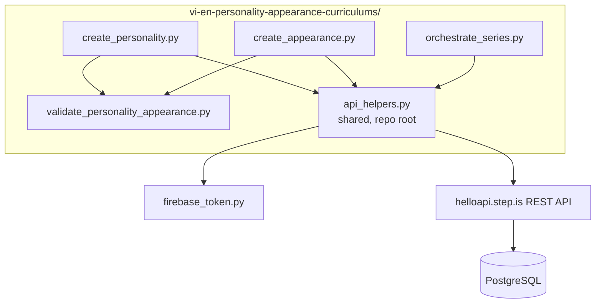
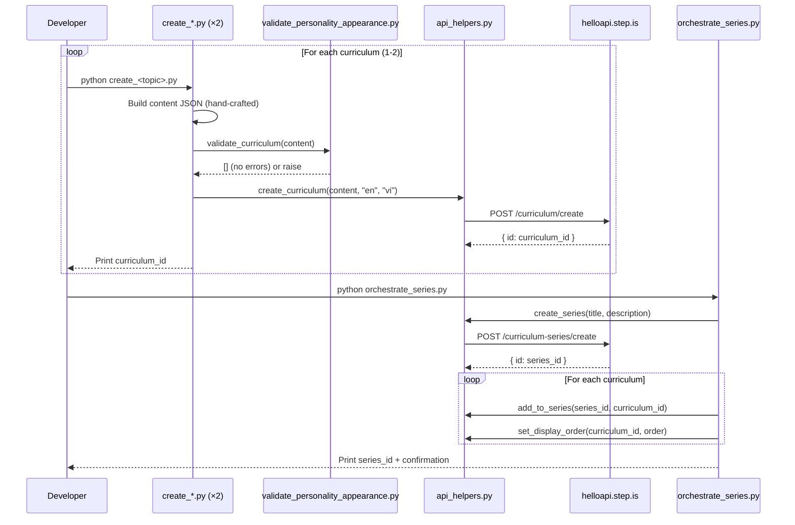

# Design Document: Vietnamese-English Personality & Appearance Curriculums

## Overview

This design covers the creation of 2 English-learning curriculums for Vietnamese speakers at the preintermediate level, following the same 4-session speaking-focus pattern as the nail-professional-speaking-curriculum series (series ID `mdntfeac`). The system consists of:

- **2 standalone Python scripts** — one per curriculum, each containing hand-crafted content about describing people
- **1 validation script** — checks all structural properties before upload
- **1 orchestrator script** — creates the series, adds curriculums, sets display orders
- **Shared API helpers** — reuses the existing root-level `api_helpers.py` module

The language pair is `userLanguage="vi"` (Vietnamese speakers), `language="en"` (learning English). All marketing text (titles, descriptions, previews) is in Vietnamese. Reading passages are first-person English mini-speeches describing people the learner knows.

Unlike the nail-professional series (which targets nail technicians speaking to customers), these curriculums target general Vietnamese English learners describing friends, family, and colleagues in everyday conversation.

### Key Design Decisions

1. **New series (separate from nail-professional `mdntfeac`)**: These curriculums cover general daily-life topics, not professional nail salon interactions. A separate series keeps discoverability clean and allows independent organization.

2. **2 curriculums covering complementary aspects of describing people**: Personality (abstract traits) → Appearance (concrete physical features). This progression moves from the more conversational/abstract to the more visual/concrete.

3. **Speaking-focus activity pattern only**: Same minimal pattern as nail series — `introAudio → viewFlashcards → reading → readAlong → speakReading`. No `speakFlashcards`, `vocabLevel*`, `writingSentence`, or `writingParagraph`.

4. **Reuse `api_helpers.py`**: The shared module already has `create_curriculum`, `create_series`, `add_to_series`, `set_display_order` — no need for custom API code.

5. **Dedicated validation script**: A `validate_personality_appearance.py` that checks all structural properties specific to the speaking-focus pattern with 15 vocab words across 4 sessions.

## Architecture



### Execution Flow



## Components and Interfaces

### Component 1: Curriculum Creation Scripts (2 scripts)

Each script (`create_personality.py`, `create_appearance.py`) is a standalone Python file that:

- Imports `api_helpers` from the repo root via `sys.path` manipulation
- Imports `validate_curriculum` from the local validation script
- Defines `W1`, `W2`, `W3` word groups (5 words each) and `ALL_WORDS`
- Builds the full `content` JSON dict with all hand-written text
- Runs validation before upload
- Calls `create_curriculum(content, "en", "vi")`
- Prints the created curriculum ID

**Script interface pattern:**
```python
import sys
import json
import logging

sys.path.insert(0, "/home/ubuntu/nspaceresearch/design-curriculums")
from api_helpers import create_curriculum
sys.path.insert(0, "/home/ubuntu/nspaceresearch/design-curriculums/vi-en-personality-appearance-curriculums")
from validate_personality_appearance import validate_curriculum

def build_content() -> dict:
    """Build the curriculum content dict with all hand-crafted text."""
    return { ... }

def main():
    content = build_content()
    errors = validate_curriculum(content)
    if errors:
        for e in errors:
            print(f"❌ {e}")
        sys.exit(1)
    curriculum_id = create_curriculum(content, "en", "vi")
    print(f"✅ Created: {curriculum_id}")

if __name__ == "__main__":
    main()
```

### Component 2: Orchestrator Script (`orchestrate_series.py`)

Handles series-level operations after both curriculums are created:

```python
import sys
sys.path.insert(0, "/home/ubuntu/nspaceresearch/design-curriculums")
from api_helpers import create_series, add_to_series, set_display_order

# Series metadata
SERIES_TITLE = "Miêu Tả Người Quen"
SERIES_DESCRIPTION = "..."  # ≤255 chars, one of the 6 tones

# Curriculum IDs (filled in after creation)
PERSONALITY_ID = "<filled after create_personality.py>"
APPEARANCE_ID = "<filled after create_appearance.py>"

def main():
    series_id = create_series(SERIES_TITLE, SERIES_DESCRIPTION)
    print(f"Series created: {series_id}")

    add_to_series(series_id, PERSONALITY_ID)
    set_display_order(PERSONALITY_ID, 1)

    add_to_series(series_id, APPEARANCE_ID)
    set_display_order(APPEARANCE_ID, 2)

    print(f"✅ Series '{SERIES_TITLE}' assembled with 2 curriculums")

if __name__ == "__main__":
    main()
```

### Component 3: Validation Script (`validate_personality_appearance.py`)

A reusable validation function that checks curriculum content JSON against all structural requirements for the speaking-focus pattern:

```python
def validate_curriculum(content: dict) -> list[str]:
    """
    Validate curriculum content for the speaking-focus pattern.
    Returns list of validation errors. Empty list = valid.
    """
```

**Validation checks implemented:**
1. Top-level structure: `title`, `description`, `preview.text`, `contentTypeTags: []`, `lengthTags`, `skillFocusTags`, `difficultyTags`, `learningSessions` (4 elements)
2. Session count = 4, each with non-empty `title` and `activities` array
3. Activity order per session: `introAudio → viewFlashcards → reading → readAlong → speakReading`
4. Vocab distribution: sessions 1–3 have 5 words each, session 4 has 15 words
5. All vocabList entries are lowercase strings, field name is `vocabList` (not `words`)
6. Every activity has `activityType` (not `type`), `title`, `description`, `data` object
7. `reading`, `speakReading`, `readAlong`, `introAudio` have non-empty `data.text`
8. Title format conventions: "Flashcards:", "Đọc:", "Nghe:"
9. readAlong description = "Nghe đoạn văn vừa đọc và theo dõi."
10. No strip-keys anywhere in JSON tree
11. Reading passages in sessions 1–3: 2–4 sentences, contain all 5 vocab words
12. Session 4 reading: 6–12 sentences, contains all 15 vocab words
13. introAudio scripts contain all vocab words for that session

### Interface: helloapi REST API

All endpoints are POST to `https://helloapi.step.is`. Authentication via `firebaseIdToken` in JSON body.

| Endpoint | Purpose | Key Params |
|---|---|---|
| `curriculum/create` | Create curriculum | `language: "en"`, `userLanguage: "vi"`, `content` (JSON string) |
| `curriculum-series/create` | Create series | `title`, `description` |
| `curriculum-series/addCurriculum` | Add to series | `curriculumSeriesId`, `curriculumId` |
| `curriculum/setDisplayOrder` | Set position | `id`, `displayOrder` |

## Data Models

### Curriculum Content JSON Structure

```json
{
  "title": "Miêu Tả Tính Cách",
  "description": "ALL-CAPS HEADLINE...\n\nParagraph 2...\n\nParagraph 3...\n\nParagraph 4...\n\nParagraph 5...",
  "preview": {
    "text": "~150 word Vietnamese preview naming all 15 vocab words..."
  },
  "contentTypeTags": [],
  "lengthTags": ["short"],
  "skillFocusTags": ["balanced_skills"],
  "difficultyTags": ["beginner", "vocab_preintermediate", "reading_preintermediate"],
  "learningSessions": [
    {
      "title": "Phần 1",
      "activities": [
        {
          "activityType": "introAudio",
          "title": "Giới thiệu từ vựng phần 1",
          "description": "Học 5 từ miêu tả tính cách",
          "data": {
            "text": "Vietnamese teaching script (~500-800 words)..."
          }
        },
        {
          "activityType": "viewFlashcards",
          "title": "Flashcards: Tính cách cơ bản",
          "description": "Học 5 từ: outgoing, shy, generous, patient, stubborn",
          "data": {
            "vocabList": ["outgoing", "shy", "generous", "patient", "stubborn"]
          }
        },
        {
          "activityType": "reading",
          "title": "Đọc: Miêu tả bạn thân",
          "description": "My best friend is very outgoing. She always smiles and...",
          "data": {
            "text": "My best friend is very outgoing. She always smiles and talks to everyone. She is generous with her time and patient when I need help. Sometimes she can be stubborn about her opinions, but she is never shy about saying sorry."
          }
        },
        {
          "activityType": "readAlong",
          "title": "Nghe: Miêu tả bạn thân",
          "description": "Nghe đoạn văn vừa đọc và theo dõi.",
          "data": {
            "text": "My best friend is very outgoing. She always smiles and talks to everyone. She is generous with her time and patient when I need help. Sometimes she can be stubborn about her opinions, but she is never shy about saying sorry."
          }
        },
        {
          "activityType": "speakReading",
          "title": "Đọc: Miêu tả bạn thân",
          "description": "My best friend is very outgoing. She always smiles and...",
          "data": {
            "text": "My best friend is very outgoing. She always smiles and talks to everyone. She is generous with her time and patient when I need help. Sometimes she can be stubborn about her opinions, but she is never shy about saying sorry."
          }
        }
      ]
    },
    {
      "title": "Phần 2",
      "activities": ["... same pattern with W2 words ..."]
    },
    {
      "title": "Phần 3",
      "activities": ["... same pattern with W3 words ..."]
    },
    {
      "title": "Ôn tập",
      "activities": [
        {
          "activityType": "introAudio",
          "title": "Ôn tập từ vựng",
          "description": "Ôn lại 15 từ miêu tả tính cách",
          "data": {
            "text": "Farewell script (400-600 words) reviewing all 15 words..."
          }
        },
        {
          "activityType": "viewFlashcards",
          "title": "Flashcards: Tất cả từ vựng",
          "description": "Học 15 từ: outgoing, shy, generous, ...",
          "data": {
            "vocabList": ["... all 15 words ..."]
          }
        },
        {
          "activityType": "reading",
          "title": "Đọc: Những người quanh tôi",
          "description": "First ~80 chars of the combined passage...",
          "data": {
            "text": "Combined 6-12 sentence passage using all 15 words..."
          }
        },
        {
          "activityType": "readAlong",
          "title": "Nghe: Những người quanh tôi",
          "description": "Nghe đoạn văn vừa đọc và theo dõi.",
          "data": {
            "text": "Same combined passage..."
          }
        },
        {
          "activityType": "speakReading",
          "title": "Đọc: Những người quanh tôi",
          "description": "First ~80 chars of the combined passage...",
          "data": {
            "text": "Same combined passage..."
          }
        }
      ]
    }
  ]
}
```

### Session Activity Pattern

| Session | Activities | Vocab Count |
|---|---|---|
| Phần 1 | introAudio → viewFlashcards(5) → reading → readAlong → speakReading | 5 (W1) |
| Phần 2 | introAudio → viewFlashcards(5) → reading → readAlong → speakReading | 5 (W2) |
| Phần 3 | introAudio → viewFlashcards(5) → reading → readAlong → speakReading | 5 (W3) |
| Ôn tập | introAudio → viewFlashcards(15) → reading → readAlong → speakReading | 15 (ALL) |

### Curriculum Topics, Tones, and Vocabulary

| # | Display Order | Title | Topic | Desc Tone | Farewell Tone |
|---|---|---|---|---|---|
| 1 | 1 | Miêu Tả Tính Cách | Describing personality traits of people you know | empathetic_observation | introspective_guide |
| 2 | 2 | Miêu Tả Ngoại Hình | Describing physical appearance of people you know | vivid_scenario | warm_accountability |

**Tone rationale:**
- Personality curriculum uses `empathetic_observation` — opens by naming the learner's struggle to express what they feel about people's character in English. Farewell uses `introspective_guide` — reflective, asks the learner to think about the people in their life.
- Appearance curriculum uses `vivid_scenario` — opens with "imagine describing your friend to someone who's never met them." Farewell uses `warm_accountability` — challenges the learner to practice describing people they see every day.

### Vocabulary Allocation (30 unique words across 2 curriculums)

**Curriculum 1 — Miêu Tả Tính Cách (Describing Personalities):**
- W1: outgoing, shy, generous, patient, stubborn
- W2: honest, cheerful, calm, confident, creative
- W3: reliable, thoughtful, ambitious, easygoing, sensitive

**Curriculum 2 — Miêu Tả Ngoại Hình (Describing Appearances):**
- W1: tall, slim, curly, straight, freckles
- W2: muscular, pale, tan, beard, bald
- W3: chubby, elegant, wrinkles, dimples, broad

**Vocabulary selection rationale:**
- All words are practical English adjectives/nouns that Vietnamese learners at preintermediate level have likely encountered in reading but need practice producing in speech
- Personality words cover positive traits (generous, cheerful, reliable), neutral traits (calm, easygoing, sensitive), and mildly negative traits (shy, stubborn) — reflecting how people actually describe others
- Appearance words cover body type (tall, slim, chubby, muscular, broad), hair (curly, straight, bald), skin (pale, tan, freckles, wrinkles, dimples), facial hair (beard), and overall impression (elegant)
- Zero overlap between the two curriculums
- Zero overlap with the nail-professional series vocabulary (verified against all 90 nail series words)

### Series Metadata

| Field | Value |
|---|---|
| Title | Miêu Tả Người Quen |
| Description | (≤255 chars, `surprising_fact` tone) — e.g., "Bạn gặp hàng chục người mỗi ngày — nhưng bao nhiêu lần bạn thực sự miêu tả được họ bằng tiếng Anh? Hai khóa học này giúp bạn nói về tính cách và ngoại hình một cách tự nhiên." |
| Language | en (inferred from member curriculums) |
| User Language | vi (inferred from member curriculums) |
| isPublic | false (until content generation complete) |

### API Call Sequence

1. `python create_personality.py` → creates curriculum, prints ID
2. `python create_appearance.py` → creates curriculum, prints ID
3. Fill IDs into `orchestrate_series.py`
4. `python orchestrate_series.py` → creates series, adds both curriculums, sets display orders
5. Run duplicate check queries
6. Verify via SQL
7. Create README.md, delete all `.py` scripts

## Correctness Properties

*A property is a characteristic or behavior that should hold true across all valid executions of a system — essentially, a formal statement about what the system should do. Properties serve as the bridge between human-readable specifications and machine-verifiable correctness guarantees.*

The validation script (`validate_personality_appearance.py`) implements these properties as deterministic checks against the curriculum content JSON. Since the content is hand-written JSON (not generated from random inputs), these properties are validated as structural assertions run once per curriculum before upload — not as randomized property-based tests. The input space is finite (2 curriculums), so exhaustive checking is more appropriate than PBT.

### Property 1: Session structure invariant

*For any* curriculum, it SHALL have exactly 4 sessions. Sessions 1–3 SHALL each contain activities in the exact order: `introAudio`, `viewFlashcards`, `reading`, `readAlong`, `speakReading`. Session 4 SHALL follow the same activity order with `viewFlashcards` containing all 15 words.

**Validates: Requirements 1.1, 1.2, 1.4, 1.5, 1.6, 1.7, 14.2**

### Property 2: Vocabulary distribution

*For any* curriculum, sessions 1–3 SHALL each have exactly 5 vocabulary words in their `viewFlashcards` activity, and session 4's `viewFlashcards` SHALL contain all 15 words (the union of sessions 1–3). All 15 words SHALL be unique within the curriculum.

**Validates: Requirements 1.3, 1.7**

### Property 3: Reading passage constraints

*For any* reading passage in sessions 1–3, it SHALL be 2–4 sentences, use first-person perspective ("I" or "My"), and contain all 5 vocabulary words for that session. *For any* session 4 reading passage, it SHALL be 6–12 sentences and contain all 15 vocabulary words.

**Validates: Requirements 2.1, 2.2, 2.5, 2.6, 2.7**

### Property 4: Vocabulary format

*For any* `vocabList` in any activity across all curriculums, every entry SHALL be a lowercase string. The field name SHALL be `vocabList` (never `words`).

**Validates: Requirements 3.4, 7.9**

### Property 5: Cross-curriculum vocabulary uniqueness

*For any* pair of curriculums, their vocabulary word sets SHALL be disjoint — no word appears in more than one curriculum.

**Validates: Requirements 3.5, 14.3**

### Property 6: Activity schema compliance

*For any* activity in any session, it SHALL have `activityType` (never `type`), `title` (non-empty string), `description` (non-empty string), and a `data` object. `viewFlashcards` SHALL use `vocabList` (never `words`). `reading`, `speakReading`, `readAlong`, and `introAudio` SHALL have `data.text` as a non-empty string.

**Validates: Requirements 7.1, 7.7, 7.8, 7.9, 7.10, 7.11, 15.3**

### Property 7: Activity title format conventions

*For any* `viewFlashcards` activity, its title SHALL start with "Flashcards:". *For any* `reading` or `speakReading` activity, its title SHALL start with "Đọc:". *For any* `readAlong` activity, its title SHALL start with "Nghe:" and its description SHALL be exactly "Nghe đoạn văn vừa đọc và theo dõi." *For any* session, it SHALL have a non-empty `title`.

**Validates: Requirements 7.2, 7.3, 7.4, 7.6**

### Property 8: Top-level content structure

*For any* curriculum content JSON, it SHALL have a non-empty `title`, non-empty `description`, a `preview` object with non-empty `text`, `contentTypeTags` equal to `[]`, `lengthTags` equal to `["short"]`, `skillFocusTags` equal to `["balanced_skills"]`, `difficultyTags` equal to `["beginner", "vocab_preintermediate", "reading_preintermediate"]`, and `learningSessions` with exactly 4 elements.

**Validates: Requirements 8.1, 8.2, 8.3, 8.4, 8.5, 8.6, 8.7, 8.8, 15.1, 15.2**

### Property 9: Strip-keys compliance

*For any* curriculum content JSON, none of the following keys SHALL appear anywhere in the structure: `mp3Url`, `illustrationSet`, `chapterBookmarks`, `segments`, `whiteboardItems`, `userReadingId`, `lessonUniqueId`, `curriculumTags`, `taskId`, `imageId`.

**Validates: Requirements 9.1, 15.6**

### Property 10: introAudio vocabulary coverage

*For any* introAudio in sessions 1–3, the script text SHALL contain all 5 vocabulary words for that session. *For any* session 4 introAudio (review/farewell), the script text SHALL contain all 15 vocabulary words.

**Validates: Requirements 6.1, 6.2**

### Property 11: Valid activity types

*For any* activity in any session, the `activityType` value SHALL be one of: `introAudio`, `viewFlashcards`, `reading`, `speakReading`, `readAlong`.

**Validates: Requirements 15.4**

## Error Handling

### Validation Failures

The validation script runs against each curriculum's content JSON before upload. If any property fails, the script prints the specific violation(s) and exits — no upload occurs until all properties pass.

```python
errors = validate_curriculum(content)
if errors:
    for e in errors:
        print(f"❌ {e}")
    sys.exit(1)
```

### API Call Failures

- Each creation script wraps the API call via `api_helpers.create_curriculum()` which raises on HTTP errors
- If `curriculum/create` fails, the script exits with the error — no partial state to clean up
- The orchestrator checks each step's response before proceeding to the next
- If `curriculum-series/addCurriculum` fails, the curriculum still exists but isn't in the series — logged for manual resolution
- If `curriculum/setDisplayOrder` fails, the curriculum is in the series but without explicit order — logged for manual resolution

### Duplicate Prevention

After creation, run duplicate check:
```sql
SELECT id, content->>'title' as title, created_at
FROM curriculum
WHERE content->>'title' IN ('Miêu Tả Tính Cách', 'Miêu Tả Ngoại Hình')
  AND uid = 'zs5AMpVfqkcfDf8CJ9qrXdH58d73'
  AND uid NOT LIKE '%_deleted'
ORDER BY content->>'title', created_at;
```
Keep earliest, delete extras. Remove from series before deleting curriculum.

## Testing Strategy

### Validation Script (Primary)

Since this is hand-written content uploaded via API (not a software library with random inputs), property-based testing with randomized inputs is not applicable. Instead, a deterministic validation script checks all 11 correctness properties against each curriculum's content JSON.

**Why PBT does not apply:**
- The 2 creation scripts are side-effect-only operations (API calls with hand-crafted content)
- The input space is finite (exactly 2 curriculums) — exhaustive checking is trivial
- No pure functions with variable input are introduced
- Remaining verification is integration-level (SQL queries to confirm correct state in DB)

### Validation Checks Implemented

The script implements all properties as assertions:
- Session count = 4 and activity order per session (Property 1)
- Vocab distribution: 5/5/5/15 (Property 2)
- Reading passage sentence count, first-person check, vocab presence (Property 3)
- Vocab format: all lowercase strings, field name `vocabList` (Property 4)
- Cross-curriculum vocab uniqueness (Property 5) — checked by passing both vocab sets
- Activity schema: activityType, title, description, data object (Property 6)
- Title format conventions (Property 7)
- Top-level structure: title, description, preview, tags (Property 8)
- Strip-keys absence (Property 9)
- introAudio vocab coverage (Property 10)
- Valid activityType values (Property 11)

### Integration Verification (Post-Execution)

After both scripts run and orchestrator completes:

```sql
-- Verify both curriculums in the series
SELECT csi.curriculum_id, c.content->>'title' as title, c.display_order, c.is_public
FROM curriculum_series_items csi
JOIN curriculum c ON c.id = csi.curriculum_id
WHERE csi.curriculum_series_id = '<series_id>'
ORDER BY c.display_order;

-- Verify language pair
SELECT id, content->>'title' as title, language, user_language
FROM curriculum WHERE id IN ('<personality_id>', '<appearance_id>');

-- Verify no duplicates
SELECT content->>'title' as title, count(*)
FROM curriculum
WHERE uid = 'zs5AMpVfqkcfDf8CJ9qrXdH58d73'
  AND content->>'title' IN ('Miêu Tả Tính Cách', 'Miêu Tả Ngoại Hình')
  AND uid NOT LIKE '%_deleted'
GROUP BY content->>'title'
HAVING count(*) > 1;

-- Verify is_public = false
SELECT id, content->>'title' as title, is_public
FROM curriculum WHERE id IN ('<personality_id>', '<appearance_id>');
```

### Post-Creation Cleanup Checklist

1. ✅ Both curriculums exist in DB with correct content
2. ✅ Both are in the series with display orders 1 and 2
3. ✅ No duplicate curriculums
4. ✅ Both curriculums are `is_public: false`
5. ✅ Series description is under 255 characters
6. ✅ No vocabulary overlap between the 2 curriculums
7. ✅ README.md created with full documentation
8. ✅ All `.py` scripts deleted from the folder
