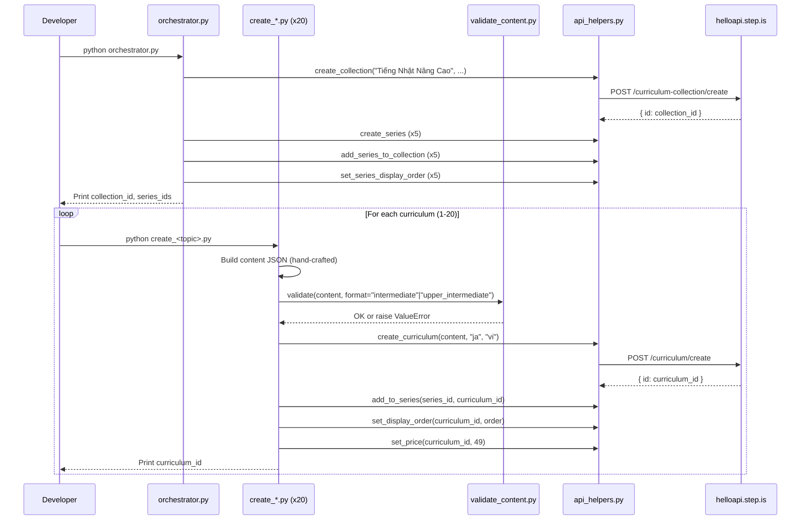

# Design Document: Vietnamese-Japanese Intermediate/Upper-Intermediate Curriculums

## Overview

This design covers the creation of 20 Japanese-learning curriculums for Vietnamese-speaking adults at intermediate and upper-intermediate levels, organized into 1 collection and 5 series of 4 curriculums each. The system consists of:

- **20 standalone Python scripts** — one per curriculum, each containing hand-crafted intermediate/upper-intermediate Japanese content
- **1 orchestrator script** — creates the collection, 5 series, wires them together, sets display orders
- **1 content validator module** — validates curriculum JSON against intermediate/upper-intermediate-specific rules before upload
- **Shared API helpers** — reuses the existing root-level `api_helpers.py` module for all REST API calls

The language pair is `userLanguage="vi"` (Vietnamese speakers), `language="ja"` (learning Japanese). All marketing text (titles, descriptions, previews) is in Vietnamese. Learner-facing content is bilingual: Vietnamese explanations with Japanese vocabulary including kanji with selective furigana (only for N2+ kanji).

### Key Design Decisions

1. **Reuse existing root-level `api_helpers.py`** — already wraps all needed API endpoints (create_curriculum, add_to_series, set_display_order, set_price, create_collection, create_series, add_series_to_collection, set_series_display_order) with Firebase auth, error handling, and logging.

2. **Single validator supporting both formats** — a new `validate_content.py` in `vi-ja-intermediate-curriculums/` supporting `intermediate` and `upper_intermediate` formats. Both formats require exactly 5 sessions, 18 vocab words (3 groups of 6), vocabLevel3 in Session 4 only, and writingParagraph in Session 5 only. The only difference is reading passage length validation (intermediate: 250-400 chars per session, 600-900 final; upper-intermediate: 350-500 chars per session, 800-1200 final). No lowercase enforcement for vocabList since Japanese uses hiragana/katakana/kanji which don't have letter case.

3. **No tone_assigner module** — tone assignments are hard-coded in each script and documented in the orchestrator. Manual assignment with variety checks is simpler and more transparent for 20 curriculums across 5 series.

4. **Both formats share the same activity structure** — both intermediate and upper-intermediate have vocabLevel3 in Session 4 and writingParagraph in Session 5. The difference is content complexity (passage length, analytical depth of writing prompts, furigana density).

5. **Scripts directory**: `vi-ja-intermediate-curriculums/`

6. **Reading passage length** — intermediate: 250-400 chars per session passage, 600-900 chars for final reading. Upper-intermediate: 350-500 chars per session passage, 800-1200 chars for final reading.

7. **Kanji with selective furigana** — at this level, N3 kanji are used freely without furigana. Furigana is provided only for N2+ kanji that learners may not yet know.

## Architecture

```mermaid
graph TD
    subgraph "vi-ja-intermediate-curriculums/"
        ORCH[orchestrator.py] --> API[api_helpers.py<br/>shared, repo root]
        VAL[validate_content.py]

        C1[create_business_negotiation.py] --> VAL
        C1 --> API
        C2[create_media_advertising.py] --> VAL
        C2 --> API
        C3[create_personal_finance.py] --> VAL
        C3 --> API
        C4[create_modern_marriage.py] --> VAL
        C4 --> API
        C5[create_self_development.py] --> VAL
        C5 --> API
        C6[create_manga_anime.py] --> VAL
        C6 --> API
        C7[create_mental_health.py] --> VAL
        C7 --> API
        C8[create_real_estate.py] --> VAL
        C8 --> API
        C9[create_world_cuisine.py] --> VAL
        C9 --> API
        C10[create_transportation_urban.py] --> VAL
        C10 --> API
        C11[create_japanese_philosophy.py] --> VAL
        C11 --> API
        C12[create_politics_society.py] --> VAL
        C12 --> API
        C13[create_science_discovery.py] --> VAL
        C13 --> API
        C14[create_japanese_literature.py] --> VAL
        C14 --> API
        C15[create_entrepreneurship.py] --> VAL
        C15 --> API
        C16[create_nature_ecology.py] --> VAL
        C16 --> API
        C17[create_crime_justice.py] --> VAL
        C17 --> API
        C18[create_ai_future.py] --> VAL
        C18 --> API
        C19[create_entertainment_tv.py] --> VAL
        C19 --> API
        C20[create_diplomacy.py] --> VAL
        C20 --> API
    end

    API --> FB[firebase_token.py]
    API --> REST[helloapi.step.is REST API]
    REST --> DB[(PostgreSQL)]
```



### Execution Flow



## Components and Interfaces

### 1. orchestrator.py

Creates the collection and 5 series, wires them together, sets display orders.

**Inputs:** None (all data hard-coded — collection/series titles, descriptions, tone assignments)

**Outputs:** Prints collection ID, series IDs, tone assignments for curriculum scripts

**API calls:**
- `curriculum-collection/create` — 1 call
- `curriculum-series/create` — 5 calls
- `curriculum-collection/addSeriesToCollection` — 5 calls
- `curriculum-series/setDisplayOrder` — 5 calls

**Series tone assignments (all 5 different):**

| Series | Title | Tone |
|--------|-------|------|
| Series 1 | "Kinh Doanh Và Tài Chính" | `bold_declaration` |
| Series 2 | "Truyền Thông Và Giải Trí" | `vivid_scenario` |
| Series 3 | "Xã Hội Và Con Người" | `empathetic_observation` |
| Series 4 | "Khoa Học Và Tương Lai" | `surprising_fact` |
| Series 5 | "Văn Hóa Và Tư Tưởng" | `provocative_question` |

**Curriculum tone assignments (no adjacent duplicates within each series, no tone >30%):**

| # | Curriculum | Series | Level | Desc Tone | Farewell Tone |
|---|-----------|--------|-------|-----------|---------------|
| 1 | Đàm Phán Kinh Doanh | Kinh Doanh Và Tài Chính | intermediate | provocative_question | warm_accountability |
| 3 | Tài Chính Cá Nhân | Kinh Doanh Và Tài Chính | intermediate | vivid_scenario | quiet_awe |
| 8 | Bất Động Sản Và Đầu Tư | Kinh Doanh Và Tài Chính | intermediate | empathetic_observation | practical_momentum |
| 15 | Khởi Nghiệp Tại Nhật | Kinh Doanh Và Tài Chính | upper_intermediate | bold_declaration | introspective_guide |
| 2 | Truyền Thông Và Quảng Cáo | Truyền Thông Và Giải Trí | intermediate | surprising_fact | team_building_energy |
| 6 | Văn Hóa Manga Và Anime | Truyền Thông Và Giải Trí | intermediate | metaphor_led | warm_accountability |
| 9 | Ẩm Thực Thế Giới Tại Nhật | Truyền Thông Và Giải Trí | intermediate | bold_declaration | quiet_awe |
| 19 | Giải Trí Và Truyền Hình | Truyền Thông Và Giải Trí | upper_intermediate | vivid_scenario | practical_momentum |
| 4 | Hôn Nhân Và Gia Đình Hiện Đại | Xã Hội Và Con Người | intermediate | empathetic_observation | introspective_guide |
| 5 | Phát Triển Bản Thân | Xã Hội Và Con Người | intermediate | provocative_question | team_building_energy |
| 7 | Y Học Và Sức Khỏe Tinh Thần | Xã Hội Và Con Người | intermediate | bold_declaration | warm_accountability |
| 12 | Chính Trị Và Xã Hội Nhật Bản | Xã Hội Và Con Người | upper_intermediate | surprising_fact | quiet_awe |
| 10 | Giao Thông Và Đô Thị | Khoa Học Và Tương Lai | intermediate | metaphor_led | practical_momentum |
| 13 | Khoa Học Và Khám Phá | Khoa Học Và Tương Lai | upper_intermediate | provocative_question | introspective_guide |
| 16 | Thiên Nhiên Và Sinh Thái | Khoa Học Và Tương Lai | upper_intermediate | vivid_scenario | team_building_energy |
| 18 | Trí Tuệ Nhân Tạo Và Tương Lai | Khoa Học Và Tương Lai | upper_intermediate | surprising_fact | warm_accountability |
| 11 | Triết Học Sống Của Người Nhật | Văn Hóa Và Tư Tưởng | upper_intermediate | metaphor_led | quiet_awe |
| 14 | Văn Học Nhật Bản | Văn Hóa Và Tư Tưởng | upper_intermediate | empathetic_observation | practical_momentum |
| 17 | Tội Phạm Và Công Lý | Văn Hóa Và Tư Tưởng | upper_intermediate | bold_declaration | introspective_guide |
| 20 | Ngoại Giao Và Quan Hệ Quốc Tế | Văn Hóa Và Tư Tưởng | upper_intermediate | surprising_fact | team_building_energy |

**Tone distribution check:**
- Description tones across 20 curriculums: provocative_question x3, bold_declaration x4, vivid_scenario x3, empathetic_observation x3, surprising_fact x4, metaphor_led x3 — max 20%, all <=30% ✓
- No adjacent duplicates within any of the 5 series ✓
- Farewell tones across 20 curriculums: warm_accountability x4, quiet_awe x4, practical_momentum x4, introspective_guide x4, team_building_energy x4 — evenly distributed (20% each) ✓
- No adjacent farewell duplicates within any series ✓

### 2. validate_content.py

Content validator supporting intermediate and upper-intermediate curriculum formats.

**Interface:**
```python
def validate(content: dict, format: str) -> None:
    """
    Validates curriculum content JSON for vi-ja intermediate/upper-intermediate curriculums.

    Args:
        content: The curriculum content dict
        format: One of "intermediate" or "upper_intermediate"

    Raises:
        ValueError with specific violation message on any failure.
    """
```

**Format configurations:**

| Format | Sessions | Vocab Words | Groups | Required Activities |
|--------|----------|-------------|--------|---------------------|
| `intermediate` | 5 | 18 (3x6) | 3 | vocabLevel3 in S4 only, writingParagraph in S5 only |
| `upper_intermediate` | 5 | 18 (3x6) | 3 | vocabLevel3 in S4 only, writingParagraph in S5 only |

**Validation checks:**
1. Top-level structure: `title`, `description`, `preview.text`, `contentTypeTags: []`, `learningSessions`
2. Session count = exactly 5
3. Each session has `title` and non-empty `activities` array
4. Each activity has `activityType` (not `type`), `title`, `description`, `data` object
5. Valid `activityType` values
6. `vocabList` is array of strings, field name is `vocabList` (not `words`) — NO lowercase enforcement (Japanese)
7. `viewFlashcards`/`speakFlashcards` in same session have identical `vocabList`
8. `writingSentence` has `data.vocabList`, `data.items` with `prompt` and `targetVocab`
9. `writingParagraph` has `data.vocabList`, `data.instructions`, `data.prompts` (array with >=2 items)
10. No strip-keys anywhere in JSON tree
11. Total unique vocab count = 18 across all sessions
12. `vocabLevel3` appears ONLY in Session 4
13. `writingParagraph` appears ONLY in Session 5
14. `vocabLevel3` IS PRESENT in Session 4 (required, not just allowed)
15. `writingParagraph` IS PRESENT in Session 5 (required, not just allowed)

### 3. Individual Curriculum Scripts (create_*.py x 20)

Each script is standalone and contains all hand-crafted content for one curriculum.

**Common interface pattern:**
```python
# create_<topic>.py
import sys
import json
import logging

sys.path.insert(0, "/home/ubuntu/nspaceresearch/design-curriculums")
sys.path.insert(0, "/home/ubuntu/nspaceresearch/design-curriculums/vi-ja-intermediate-curriculums")
from api_helpers import (
    create_curriculum, add_to_series, set_display_order, set_price
)
from validate_content import validate

SERIES_ID = "<series_id>"  # Filled after orchestrator runs
DISPLAY_ORDER = <N>
PRICE = 49

def build_content() -> dict:
    """Build the curriculum content dict with all hand-crafted text."""
    return {
        "title": "...",
        "description": "...",
        "preview": {"text": "..."},
        "contentTypeTags": [],
        "learningSessions": [...]
    }

def main():
    content = build_content()
    validate(content, format="intermediate")  # or "upper_intermediate"
    curriculum_id = create_curriculum(content, "ja", "vi")
    add_to_series(SERIES_ID, curriculum_id)
    set_display_order(curriculum_id, DISPLAY_ORDER)
    set_price(curriculum_id, PRICE)
    print(f"Created: {curriculum_id}")

if __name__ == "__main__":
    main()
```

**Key constraints:**
- All text content (introAudio scripts, reading passages, descriptions, previews, writing prompts) is hand-written per curriculum
- No template functions or string interpolation for learner-facing text
- The `build_content()` function returns a fully literal dict
- Japanese vocabulary includes kanji with selective furigana (N2+ only) in introAudio scripts
- Vietnamese marketing text for descriptions/previews addressing adult learner aspirations
- Reading passages use N3 kanji freely (no furigana), N2+ kanji with furigana

### 4. Activity Templates

#### Intermediate (5 sessions, 18 words in 3 groups of 6, price 49)

```
Session 1 (Learning, "Phần 1"):
  1. introAudio — welcome + topic intro (600-900 words Vietnamese)
  2. introAudio — teach words group 1 with kanji, selective furigana (N2+ only), Vietnamese meaning, example sentences
  3. viewFlashcards (group 1, 6 words)
  4. speakFlashcards (group 1, 6 words)
  5. vocabLevel1 (group 1)
  6. vocabLevel2 (group 1)
  7. introAudio — grammar/usage notes
  8. reading — passage using group 1 words (250-400 chars, N3 kanji freely, N2+ with furigana)
  9. speakReading
  10. readAlong
  11. writingSentence (3 items using group 1 words)

Session 2 (Learning, "Phần 2"):
  1. introAudio — recap group 1 + intro
  2. introAudio — teach words group 2
  3. viewFlashcards (group 2, 6 words)
  4. speakFlashcards (group 2, 6 words)
  5. vocabLevel1 (group 2)
  6. vocabLevel2 (group 2)
  7. introAudio — grammar/usage notes
  8. reading — passage using group 2 words (250-400 chars)
  9. speakReading
  10. readAlong
  11. writingSentence (3 items using group 2 words)

Session 3 (Learning, "Phần 3"):
  1. introAudio — recap groups 1-2 + intro
  2. introAudio — teach words group 3
  3. viewFlashcards (group 3, 6 words)
  4. speakFlashcards (group 3, 6 words)
  5. vocabLevel1 (group 3)
  6. vocabLevel2 (group 3)
  7. introAudio — grammar/usage notes
  8. reading — passage using group 3 words (250-400 chars)
  9. speakReading
  10. readAlong
  11. writingSentence (3 items using group 3 words)

Session 4 (Review, "Ôn tập"):
  1. introAudio — review intro
  2. viewFlashcards (all 18 words)
  3. speakFlashcards (all 18 words)
  4. vocabLevel1 (all 18 words)
  5. vocabLevel2 (all 18 words)
  6. vocabLevel3 (all 18 words)
  7. writingSentence (4-5 items mixing all groups)

Session 5 (Final Reading, "Đọc tổng hợp"):
  1. introAudio — full reading intro
  2. reading — full article using all 18 words (600-900 chars)
  3. speakReading
  4. readAlong
  5. writingParagraph (using 6+ vocabulary words)
  6. introAudio — farewell with vocab review (400-600 words)
```

#### Upper-Intermediate (5 sessions, 18 words in 3 groups of 6, price 49)

```
Session 1 (Learning, "Phần 1"):
  1. introAudio — welcome + topic intro (600-900 words Vietnamese)
  2. introAudio — teach words group 1 with kanji, minimal furigana, Vietnamese meaning, example sentences
  3. viewFlashcards (group 1, 6 words)
  4. speakFlashcards (group 1, 6 words)
  5. vocabLevel1 (group 1)
  6. vocabLevel2 (group 1)
  7. introAudio — grammar/usage notes
  8. reading — passage using group 1 words (350-500 chars, N3-N2 kanji freely, rare kanji with furigana)
  9. speakReading
  10. readAlong
  11. writingSentence (3 items using group 1 words)

Session 2 (Learning, "Phần 2"):
  1. introAudio — recap group 1 + intro
  2. introAudio — teach words group 2
  3. viewFlashcards (group 2, 6 words)
  4. speakFlashcards (group 2, 6 words)
  5. vocabLevel1 (group 2)
  6. vocabLevel2 (group 2)
  7. introAudio — grammar/usage notes
  8. reading — passage using group 2 words (350-500 chars)
  9. speakReading
  10. readAlong
  11. writingSentence (3 items using group 2 words)

Session 3 (Learning, "Phần 3"):
  1. introAudio — recap groups 1-2 + intro
  2. introAudio — teach words group 3
  3. viewFlashcards (group 3, 6 words)
  4. speakFlashcards (group 3, 6 words)
  5. vocabLevel1 (group 3)
  6. vocabLevel2 (group 3)
  7. introAudio — grammar/usage notes
  8. reading — passage using group 3 words (350-500 chars)
  9. speakReading
  10. readAlong
  11. writingSentence (3 items using group 3 words)

Session 4 (Review, "Ôn tập"):
  1. introAudio — review intro
  2. viewFlashcards (all 18 words)
  3. speakFlashcards (all 18 words)
  4. vocabLevel1 (all 18 words)
  5. vocabLevel2 (all 18 words)
  6. vocabLevel3 (all 18 words)
  7. writingSentence (4-5 items mixing all groups)

Session 5 (Final Reading, "Đọc tổng hợp"):
  1. introAudio — full reading intro
  2. reading — full article using all 18 words (800-1200 chars)
  3. speakReading
  4. readAlong
  5. writingParagraph (using 6+ vocabulary words, analytical/argumentative)
  6. introAudio — farewell with vocab review (400-600 words)
```

## Data Models

### Curriculum Content JSON Structure (Intermediate Example)

```json
{
  "title": "Đàm Phán Kinh Doanh",
  "description": "Multi-paragraph Vietnamese persuasive copy about business negotiation...",
  "preview": {
    "text": "Vietnamese preview text (~150 words) with vocabulary listing..."
  },
  "contentTypeTags": [],
  "learningSessions": [
    {
      "title": "Phần 1",
      "activities": [
        {
          "activityType": "introAudio",
          "title": "Chào mừng bạn đến với bài học Đàm Phán",
          "description": "Giới thiệu chủ đề đàm phán kinh doanh tại Nhật",
          "data": {
            "text": "Xin chào bạn! Hôm nay chúng ta sẽ học về chủ đề đàm phán kinh doanh tại Nhật Bản..."
          }
        },
        {
          "activityType": "introAudio",
          "title": "Giới thiệu từ vựng nhóm 1",
          "description": "Học 6 từ vựng về đàm phán kinh doanh",
          "data": {
            "text": "Từ đầu tiên là 交渉 (こうしょう) - có nghĩa là đàm phán, thương lượng..."
          }
        },
        {
          "activityType": "viewFlashcards",
          "title": "Flashcards: Đàm phán kinh doanh",
          "description": "Học 6 từ: 交渉, 提案, 妥協, 条件, 合意, 利益",
          "data": {
            "vocabList": ["交渉", "提案", "妥協", "条件", "合意", "利益"]
          }
        },
        {
          "activityType": "speakFlashcards",
          "title": "Flashcards: Đàm phán kinh doanh",
          "description": "Học 6 từ: 交渉, 提案, 妥協, 条件, 合意, 利益",
          "data": {
            "vocabList": ["交渉", "提案", "妥協", "条件", "合意", "利益"]
          }
        },
        {
          "activityType": "vocabLevel1",
          "title": "Flashcards: Đàm phán kinh doanh",
          "description": "Học 6 từ: 交渉, 提案, 妥協, 条件, 合意, 利益",
          "data": {
            "vocabList": ["交渉", "提案", "妥協", "条件", "合意", "利益"]
          }
        },
        {
          "activityType": "vocabLevel2",
          "title": "Flashcards: Đàm phán kinh doanh",
          "description": "Học 6 từ: 交渉, 提案, 妥協, 条件, 合意, 利益",
          "data": {
            "vocabList": ["交渉", "提案", "妥協", "条件", "合意", "利益"]
          }
        },
        {
          "activityType": "introAudio",
          "title": "Ngữ pháp và cách dùng",
          "description": "Giải thích cách sử dụng từ vựng trong ngữ cảnh kinh doanh",
          "data": {
            "text": "Bây giờ chúng ta sẽ tìm hiểu cách sử dụng những từ này trong cuộc đàm phán thực tế..."
          }
        },
        {
          "activityType": "reading",
          "title": "Đọc: Đàm phán kinh doanh",
          "description": "田中部長は取引先との交渉に向けて、新しい提案を準備している...",
          "data": {
            "text": "田中部長は取引先との交渉に向けて、新しい提案を準備している。今回の条件は厳しいが、双方にとって利益のある妥協点を見つけなければならない。合意に至るまでには、まだ何度かの商談が必要だろう。",
            "vocabList": ["交渉", "提案", "妥協", "条件", "合意", "利益"]
          }
        },
        {
          "activityType": "speakReading",
          "title": "Đọc: Đàm phán kinh doanh",
          "description": "田中部長は取引先との交渉に向けて、新しい提案を準備している...",
          "data": {
            "text": "田中部長は取引先との交渉に向けて、新しい提案を準備している。今回の条件は厳しいが、双方にとって利益のある妥協点を見つけなければならない。合意に至るまでには、まだ何度かの商談が必要だろう。"
          }
        },
        {
          "activityType": "readAlong",
          "title": "Nghe: Đàm phán kinh doanh",
          "description": "Nghe đoạn văn vừa đọc và theo dõi.",
          "data": {
            "text": "田中部長は取引先との交渉に向けて、新しい提案を準備している。今回の条件は厳しいが、双方にとって利益のある妥協点を見つけなければならない。合意に至るまでには、まだ何度かの商談が必要だろう。"
          }
        },
        {
          "activityType": "writingSentence",
          "title": "Viết: Đàm phán kinh doanh",
          "description": "Viết câu tiếng Nhật về đàm phán kinh doanh",
          "data": {
            "vocabList": ["交渉", "提案", "妥協"],
            "items": [
              {
                "prompt": "Viết một câu tiếng Nhật dùng từ '交渉' (こうしょう - đàm phán). Ví dụ: 来週、取引先と交渉する予定です。(Tuần sau tôi có kế hoạch đàm phán với đối tác.) Hãy thay '取引先' bằng '新しいクライアント' (khách hàng mới) nhé!",
                "targetVocab": "交渉"
              },
              {
                "prompt": "Viết một câu tiếng Nhật dùng từ '提案' (ていあん - đề xuất). Ví dụ: 部長に新しい提案を出しました。(Tôi đã đưa ra đề xuất mới cho trưởng phòng.) Hãy thay '部長に' bằng '会議で' (trong cuộc họp) nhé!",
                "targetVocab": "提案"
              },
              {
                "prompt": "Viết một câu tiếng Nhật dùng từ '妥協' (だきょう - thỏa hiệp). Ví dụ: 両社は妥協点を見つけることができた。(Hai công ty đã tìm được điểm thỏa hiệp.) Hãy thay '両社' bằng '私たち' (chúng tôi) nhé!",
                "targetVocab": "妥協"
              }
            ]
          }
        }
      ]
    }
  ]
}
```

### writingParagraph Structure (Session 5, Both Formats)

```json
{
  "activityType": "writingParagraph",
  "title": "Viết đoạn: Đàm phán kinh doanh",
  "description": "Viết đoạn văn tiếng Nhật phân tích chiến lược đàm phán",
  "data": {
    "vocabList": ["交渉", "提案", "妥協", "条件", "合意", "戦略"],
    "instructions": "Hãy viết 4-6 câu tiếng Nhật phân tích một tình huống đàm phán kinh doanh. Sử dụng ít nhất 6 từ vựng đã học trong bài. Bạn có thể viết về chiến lược đàm phán (戦略), cách đưa ra đề xuất (提案), tìm điểm thỏa hiệp (妥協), hoặc đạt được thỏa thuận (合意).",
    "prompts": [
      "Khi đàm phán với đối tác Nhật, bạn cần chuẩn bị những gì? Tại sao chiến lược quan trọng?",
      "Làm thế nào để tìm được điểm thỏa hiệp khi hai bên có điều kiện khác nhau?",
      "Theo bạn, yếu tố nào quan trọng nhất để đạt được thỏa thuận thành công?"
    ]
  }
}
```

### vocabLevel3 Structure (Session 4, Both Formats)

```json
{
  "activityType": "vocabLevel3",
  "title": "Flashcards: Đàm phán kinh doanh",
  "description": "Ôn tập 18 từ: 交渉, 提案, 妥協, 条件, 合意, 利益, 競合, 戦略, 見積もり, 契約書, 納期, 取引先, 値下げ, 決裁, 商談, 譲歩, 双方, 成約",
  "data": {
    "vocabList": ["交渉", "提案", "妥協", "条件", "合意", "利益", "競合", "戦略", "見積もり", "契約書", "納期", "取引先", "値下げ", "決裁", "商談", "譲歩", "双方", "成約"]
  }
}
```

### API Call Parameters

| API Endpoint | Key Parameters |
|---|---|
| `curriculum/create` | `firebaseIdToken`, `language: "ja"`, `userLanguage: "vi"`, `content: JSON.stringify(content)` |
| `curriculum-series/addCurriculum` | `firebaseIdToken`, `curriculumSeriesId`, `curriculumId` |
| `curriculum/setDisplayOrder` | `firebaseIdToken`, `id`, `displayOrder` |
| `curriculum/setPrice` | `firebaseIdToken`, `id`, `price: 49` |
| `curriculum-collection/create` | `firebaseIdToken`, `title`, `description` |
| `curriculum-series/create` | `firebaseIdToken`, `title`, `description` |
| `curriculum-collection/addSeriesToCollection` | `firebaseIdToken`, `curriculumCollectionId`, `curriculumSeriesId` |
| `curriculum-series/setDisplayOrder` | `firebaseIdToken`, `id`, `displayOrder` |

## Correctness Properties

*A property is a characteristic or behavior that should hold true across all valid executions of a system — essentially, a formal statement about what the system should do. Properties serve as the bridge between human-readable specifications and machine-verifiable correctness guarantees.*

The content validator (`validate_content.py`) is the primary component amenable to property-based testing. It is a pure function: takes a content dict and format string, returns None or raises ValueError. The input space is large (arbitrary JSON structures), and universal properties hold across all valid/invalid inputs.

The curriculum creation scripts, orchestrator, and API interactions are integration-level concerns tested via database verification queries after execution.

### Property 1: Valid content passes validation

*For any* well-formed curriculum content dict that matches its declared format (exactly 5 sessions, 18 total vocab words in 3 groups of 6, all required fields present, vocabLevel3 in Session 4, writingParagraph in Session 5, no strip keys, vocabList as arrays of strings, matching viewFlashcards/speakFlashcards vocabLists), calling `validate(content, format)` SHALL return without raising an exception.

**Validates: Requirements 1.3, 1.4, 1.5, 1.8, 1.9, 1.10, 1.11, 11.1, 11.2, 11.3, 11.4**

### Property 2: Strip keys are rejected anywhere in the JSON tree

*For any* curriculum content dict and any strip key (mp3Url, illustrationSet, chapterBookmarks, segments, whiteboardItems, userReadingId, lessonUniqueId, curriculumTags, taskId, imageId), if that key is injected at any depth in the JSON tree, `validate()` SHALL raise a ValueError mentioning the strip key.

**Validates: Requirements 1.6, 11.9**

### Property 3: Activity placement is enforced

*For any* curriculum content, if `vocabLevel3` appears in any session other than Session 4, or if `writingParagraph` appears in any session other than Session 5, `validate()` SHALL raise a ValueError identifying the misplaced activity. Conversely, if `vocabLevel3` is missing from Session 4 or `writingParagraph` is missing from Session 5, validation SHALL also raise a ValueError.

**Validates: Requirements 1.8, 1.9, 1.10, 1.11, 4.2, 4.3, 5.2, 5.3, 11.10**

### Property 4: Activities missing required fields are rejected

*For any* activity in any curriculum content, if any of the required fields (`activityType`, `title`, `description`, `data`) is missing or if `data` is not a dict, `validate()` SHALL raise a ValueError identifying the missing field and its location.

**Validates: Requirements 10.1, 10.5, 11.3**

### Property 5: Invalid activityType values are rejected

*For any* activity with an `activityType` value not in the valid set (introAudio, viewFlashcards, speakFlashcards, vocabLevel1, vocabLevel2, vocabLevel3, reading, speakReading, readAlong, writingSentence, writingParagraph), `validate()` SHALL raise a ValueError.

**Validates: Requirements 10.2, 11.4**

### Property 6: vocabList format is enforced

*For any* vocab activity (viewFlashcards, speakFlashcards, vocabLevel1, vocabLevel2, vocabLevel3), if `data.vocabList` is not an array, is empty, contains non-string elements, or uses the field name `words` instead of `vocabList`, `validate()` SHALL raise a ValueError. Note: lowercase is NOT enforced for Japanese vocabulary.

**Validates: Requirements 10.3, 11.5**

### Property 7: Flashcard vocabList consistency within sessions

*For any* session containing both `viewFlashcards` and `speakFlashcards` activities, if their `data.vocabList` arrays differ, `validate()` SHALL raise a ValueError.

**Validates: Requirements 10.4, 11.6**

### Property 8: Writing activity structure is enforced

*For any* `writingSentence` activity, if `data.vocabList` is missing, `data.items` is missing or empty, or any item lacks a non-empty `prompt` or `targetVocab`, `validate()` SHALL raise a ValueError. *For any* `writingParagraph` activity, if `data.vocabList` is missing, `data.instructions` is missing or empty, or `data.prompts` is missing or has fewer than 2 items, `validate()` SHALL raise a ValueError.

**Validates: Requirements 10.6, 10.7, 11.7, 11.8**

## Error Handling

### Validator Errors

The `validate_content.py` module raises `ValueError` with a specific message identifying:
- The exact rule violated
- The location in the JSON tree (e.g., "Session 2, Activity 3")
- The expected vs. actual value
- The format being validated against

Each curriculum script calls `validate()` before any API call. If validation fails, the script aborts with the error message — no partial upload occurs.

### API Call Errors

Each curriculum script follows this error handling pattern:

1. **Validation failure** — Script aborts immediately, prints the violation. No API calls made.
2. **`curriculum/create` failure** — Script logs the error with curriculum title and exits. The curriculum is not partially created.
3. **`add_to_series` failure** — Curriculum exists but is orphaned. Script logs the error. Developer must manually add to series or delete the curriculum.
4. **`set_display_order` failure** — Curriculum exists in series but without explicit order. Script logs the error. Developer must manually set order.
5. **`set_price` failure** — Curriculum exists with default price. Script logs the error. Developer must manually set price.

The orchestrator follows the same pattern:
1. **`create_collection` failure** — Abort. Nothing created.
2. **`create_series` failure** — Log error, continue with remaining series. Developer must manually create the failed series.
3. **`add_series_to_collection` failure** — Series exists but is orphaned. Log error, continue.
4. **`set_display_order` failure** — Log error, continue. Developer must manually set order.

### Duplicate Handling

After each curriculum creation, the script logs the curriculum ID. The README documents all IDs. If a script is accidentally run twice, the developer runs the duplicate check query:

```sql
SELECT id, content->>'title', created_at FROM curriculum
WHERE content->>'title' = '<title>' AND uid = 'zs5AMpVfqkcfDf8CJ9qrXdH58d73'
AND uid NOT LIKE '%_deleted'
ORDER BY created_at;
```

Keep the earliest, delete extras (remove from series first, then delete curriculum).

## Testing Strategy

### Property-Based Tests (validate_content.py)

**Library:** [Hypothesis](https://hypothesis.readthedocs.io/) (Python PBT library)

**Configuration:** Minimum 100 iterations per property test.

**Tag format:** Each test is tagged with a comment: `# Feature: vi-ja-intermediate-curriculums, Property N: <property_text>`

The 8 correctness properties above are implemented as Hypothesis property tests in a `test_validate.py` file within `vi-ja-intermediate-curriculums/`. Each property test generates random curriculum content structures using Hypothesis strategies and verifies the validator's behavior.

**Generator strategies needed:**
- `valid_curriculum(format)` — generates a structurally valid curriculum content dict for the given format (`intermediate` or `upper_intermediate`), with 5 sessions, 18 Japanese vocab words in 3 groups of 6, vocabLevel3 in Session 4, writingParagraph in Session 5
- `random_activity(activity_type)` — generates a valid activity of the given type with all required fields
- `random_vocab_list(n)` — generates a list of n random Japanese strings (hiragana, katakana, and kanji characters)
- `random_strip_key()` — picks a random strip key from the set of 10 forbidden keys
- `random_json_path()` — picks a random location in a content dict to inject a key
- `valid_writing_sentence()` — generates a valid writingSentence activity with vocabList, items, prompt, targetVocab
- `valid_writing_paragraph()` — generates a valid writingParagraph activity with vocabList, instructions, prompts (>=2)

**Key generator notes:**
- The `random_vocab_list` strategy generates strings from hiragana (U+3040-U+309F), katakana (U+30A0-U+30FF), and CJK Unified Ideographs (U+4E00-U+9FFF) Unicode ranges
- Both `valid_curriculum("intermediate")` and `valid_curriculum("upper_intermediate")` must include vocabLevel3 in Session 4 and writingParagraph in Session 5
- The generators produce structurally valid content; text quality is not tested by PBT

### Example-Based Tests

- Verify no vocabulary overlap across the 20 curriculum scripts (Req 2.3)
- Verify no vocabulary overlap with the 20 beginner or 20 preintermediate vi-ja curriculums (Req 2.4)
- Verify tone assignment table has no adjacent duplicates within each series (Req 6.6)
- Verify no tone exceeds 30% of 20 descriptions (max 6 uses per tone) (Req 6.7)
- Verify correct activity sequence templates for each format (Req 4.1, 5.1)
- Verify writingSentence items have Vietnamese prompt text with furigana and targetVocab (Req 3.4)
- Verify writingParagraph has instructions and >=2 prompts (Req 3.5)
- Verify intermediate reading passages are 250-400 chars per session (Req 3.2)
- Verify upper-intermediate reading passages are 350-500 chars per session (Req 3.3)
- Verify farewell tone assignments have no adjacent duplicates within each series (Req 7.8)

### Integration Verification (Post-Execution)

After all scripts run, verify via SQL queries:

```sql
-- Count all 20 vi-ja intermediate/upper-intermediate curriculums
SELECT COUNT(*) FROM curriculum
WHERE id IN (<list of 20 IDs>);

-- Verify language pair
SELECT id, content->>'title' as title, language, user_language
FROM curriculum WHERE id IN (<list of 20 IDs>);

-- Verify all prices are 49
SELECT c.id, c.content->>'title' as title, c.price
FROM curriculum c WHERE c.id IN (<list of 20 IDs>)
ORDER BY c.display_order;

-- Verify series membership and display orders
SELECT cs.id as series_id, cs.title as series_title,
       c.id as curriculum_id, c.content->>'title' as curriculum_title,
       c.display_order, c.price
FROM curriculum_series cs
JOIN curriculum_series_items csi ON cs.id = csi.curriculum_series_id
JOIN curriculum c ON csi.curriculum_id = c.id
WHERE cs.id IN (<series_1_id>, <series_2_id>, <series_3_id>, <series_4_id>, <series_5_id>)
ORDER BY cs.display_order, c.display_order;

-- Verify no duplicates
SELECT content->>'title' as title, COUNT(*)
FROM curriculum
WHERE uid = 'zs5AMpVfqkcfDf8CJ9qrXdH58d73'
AND content->>'title' IN (<list of 20 titles>)
AND uid NOT LIKE '%_deleted'
GROUP BY content->>'title'
HAVING COUNT(*) > 1;

-- Verify collection -> series wiring
SELECT cc.id as collection_id, cc.title as collection_title,
       cs.id as series_id, cs.title as series_title
FROM curriculum_collections cc
JOIN curriculum_collection_series ccs ON cc.id = ccs.curriculum_collection_id
JOIN curriculum_series cs ON ccs.curriculum_series_id = cs.id
WHERE cc.title = 'Tiếng Nhật Nâng Cao';
```

### Smoke Tests

- Verify each script file exists in `vi-ja-intermediate-curriculums/`
- Verify no script calls `setPublic` (Req 13.1)
- Verify orchestrator creates exactly 1 collection and 5 series
- Verify all 20 scripts set price to 49
