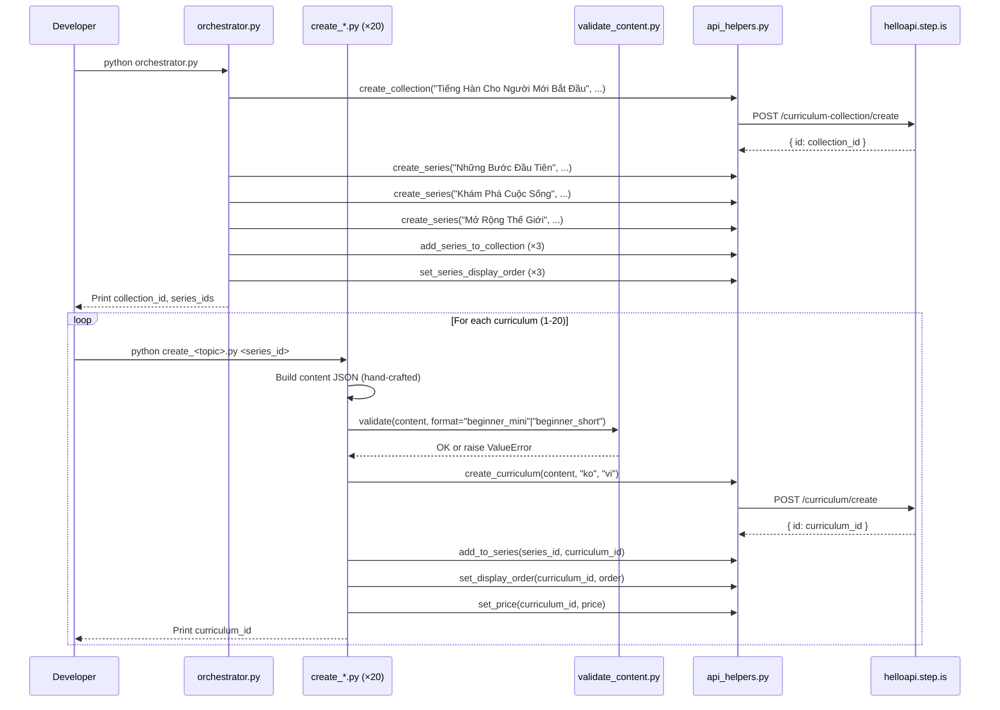

# Design Document: Vietnamese-Korean Beginner Curriculums

## Overview

This design covers the creation of 20 Korean-learning curriculums for Vietnamese-speaking adults at the beginner level, organized into 1 collection and 3 series. The system consists of:

- **20 standalone Python scripts** — one per curriculum, each containing hand-crafted beginner Korean content
- **1 orchestrator script** — creates the collection, 3 series, wires them together, sets display orders
- **1 content validator module** — validates curriculum JSON against beginner-specific rules before upload
- **Shared API helpers** — reuses the existing root-level `api_helpers.py` module for all REST API calls

The language pair is `userLanguage="vi"` (Vietnamese speakers), `language="ko"` (learning Korean). All marketing text (titles, descriptions, previews) is in Vietnamese. All learner-facing content is bilingual: Vietnamese explanations with Korean vocabulary in Hangul and Revised Romanization pronunciation guidance.

### Key Design Decisions

1. **Reuse existing root-level `api_helpers.py`** — the module already wraps all needed API endpoints (create_curriculum, add_to_series, set_display_order, set_price, create_collection, create_series, add_series_to_collection, set_series_display_order) with Firebase auth, error handling, and logging.

2. **Beginner-specific validator** — a new `validate_content.py` in `vi-ko-beginner-curriculums/` supporting `beginner_mini` and `beginner_short` formats. Key difference from the children's validator: **no lowercase enforcement for vocabList** since Korean Hangul has no case distinction. Different vocab count ranges (3-5 for mini, 8-10 for short). Same strip-key and structural checks.

3. **No tone_assigner module** — with 20 curriculums across 3 series, tone assignments are hard-coded in each script and documented in the orchestrator. Manual assignment with variety checks is simpler and more transparent than a programmatic assigner.

4. **Two curriculum format templates** — `beginner_mini` (1 session, 3-5 words, price 9) and `beginner_short` (4 sessions, 8-10 words, price 19). Both are beginner level with identical forbidden activities (writingParagraph, vocabLevel3 always; vocabLevel1/vocabLevel2 additionally for mini).

5. **Scripts directory**: `vi-ko-beginner-curriculums/`

6. **Reading passage length in characters** — Korean text is measured in characters rather than words: 40-60 characters for mini passages, 60-80 per session for short, 100-140 combined for the final session reading.

## Architecture

```mermaid
graph TD
    subgraph "vi-ko-beginner-curriculums/"
        ORCH[orchestrator.py] --> API[api_helpers.py<br/>shared, repo root]
        VAL[validate_content.py]
        
        C1[create_greetings.py] --> VAL
        C1 --> API
        C2[create_numbers.py] --> VAL
        C2 --> API
        C3[create_family.py] --> VAL
        C3 --> API
        C4[create_colors.py] --> VAL
        C4 --> API
        C5[create_weather.py] --> VAL
        C5 --> API
        C6[create_drinks.py] --> VAL
        C6 --> API
        C7[create_days.py] --> VAL
        C7 --> API
        C8[create_emotions.py] --> VAL
        C8 --> API
        C9[create_food.py] --> VAL
        C9 --> API
        C10[create_shopping.py] --> VAL
        C10 --> API
        C11[create_transport.py] --> VAL
        C11 --> API
        C12[create_hotel.py] --> VAL
        C12 --> API
        C13[create_office.py] --> VAL
        C13 --> API
        C14[create_seasons.py] --> VAL
        C14 --> API
        C15[create_hobbies.py] --> VAL
        C15 --> API
        C16[create_health.py] --> VAL
        C16 --> API
        C17[create_housing.py] --> VAL
        C17 --> API
        C18[create_culture.py] --> VAL
        C18 --> API
        C19[create_technology.py] --> VAL
        C19 --> API
        C20[create_sports.py] --> VAL
        C20 --> API
    end

    API --> FB[firebase_token.py]
    API --> REST[helloapi.step.is REST API]
    REST --> DB[(PostgreSQL)]
```



### Execution Flow



## Components and Interfaces

### 1. orchestrator.py

Creates the collection and 3 series, wires them together, sets display orders.

**Inputs:** None (all data hard-coded — collection/series titles, descriptions, tone assignments)

**Outputs:** Prints collection ID, series IDs, tone assignments for curriculum scripts

**API calls:**
- `curriculum-collection/create` — 1 call
- `curriculum-series/create` — 3 calls
- `curriculum-collection/addSeriesToCollection` — 3 calls
- `curriculum-series/setDisplayOrder` — 3 calls

**Series tone assignments (all different):**

| Entity | Tone |
|--------|------|
| Series 1: "Những Bước Đầu Tiên" | `bold_declaration` |
| Series 2: "Khám Phá Cuộc Sống" | `empathetic_observation` |
| Series 3: "Mở Rộng Thế Giới" | `vivid_scenario` |

**Curriculum tone assignments (no adjacent duplicates within each series, no tone >30%):**

| # | Curriculum | Series | Desc Tone | Farewell Tone |
|---|-----------|--------|-----------|---------------|
| 1 | Chào Hỏi Cơ Bản | Những Bước Đầu Tiên | provocative_question | warm_accountability |
| 2 | Đếm Số Tiếng Hàn | Những Bước Đầu Tiên | vivid_scenario | quiet_awe |
| 3 | Gia Đình Thân Yêu | Những Bước Đầu Tiên | empathetic_observation | practical_momentum |
| 4 | Màu Sắc Quanh Ta | Những Bước Đầu Tiên | surprising_fact | introspective_guide |
| 5 | Thời Tiết Hôm Nay | Những Bước Đầu Tiên | bold_declaration | team_building_energy |
| 6 | Đồ Uống Yêu Thích | Những Bước Đầu Tiên | metaphor_led | warm_accountability |
| 7 | Ngày Trong Tuần | Những Bước Đầu Tiên | provocative_question | quiet_awe |
| 8 | Cảm Xúc Mỗi Ngày | Những Bước Đầu Tiên | empathetic_observation | practical_momentum |
| 9 | Ẩm Thực Hàn Quốc | Khám Phá Cuộc Sống | bold_declaration | introspective_guide |
| 10 | Mua Sắm Ở Hàn Quốc | Khám Phá Cuộc Sống | surprising_fact | team_building_energy |
| 11 | Di Chuyển Ở Hàn Quốc | Khám Phá Cuộc Sống | vivid_scenario | warm_accountability |
| 12 | Khách Sạn Và Lưu Trú | Khám Phá Cuộc Sống | provocative_question | quiet_awe |
| 13 | Văn Phòng Hàn Quốc | Khám Phá Cuộc Sống | metaphor_led | practical_momentum |
| 14 | Bốn Mùa Hàn Quốc | Khám Phá Cuộc Sống | empathetic_observation | introspective_guide |
| 15 | Sở Thích Và Giải Trí | Mở Rộng Thế Giới | surprising_fact | team_building_energy |
| 16 | Sức Khỏe Và Cơ Thể | Mở Rộng Thế Giới | bold_declaration | warm_accountability |
| 17 | Nhà Ở Hàn Quốc | Mở Rộng Thế Giới | vivid_scenario | quiet_awe |
| 18 | Văn Hóa Hàn Quốc | Mở Rộng Thế Giới | provocative_question | practical_momentum |
| 19 | Công Nghệ Đời Thường | Mở Rộng Thế Giới | empathetic_observation | introspective_guide |
| 20 | Thể Thao Và Vận Động | Mở Rộng Thế Giới | metaphor_led | team_building_energy |

**Tone distribution check:**
- Description tones across 20 curriculums: provocative_question ×4, vivid_scenario ×3, empathetic_observation ×4, surprising_fact ×3, bold_declaration ×3, metaphor_led ×3 — max 20%, all ≤30% ✓
- No adjacent duplicates within any of the 3 series ✓
- Farewell tones across 20 curriculums: warm_accountability ×4, quiet_awe ×4, practical_momentum ×4, introspective_guide ×4, team_building_energy ×4 — evenly distributed (20% each) ✓
- No adjacent farewell duplicates within any series ✓

### 2. validate_content.py

Beginner-specific content validator supporting two curriculum formats.

**Interface:**
```python
def validate(content: dict, format: str) -> None:
    """
    Validates curriculum content JSON for vi-ko beginner curriculums.
    
    Args:
        content: The curriculum content dict
        format: One of "beginner_mini" or "beginner_short"
    
    Raises:
        ValueError with specific violation message on any failure.
    """
```

**Format configurations:**

| Format | Sessions | Vocab Words | Forbidden Activities |
|--------|----------|-------------|---------------------|
| `beginner_mini` | 1 | 3-5 | writingParagraph, vocabLevel3, vocabLevel1, vocabLevel2 |
| `beginner_short` | 4 | 8-10 | writingParagraph, vocabLevel3 |

**Validation checks:**
1. Top-level structure: `title`, `description`, `preview.text`, `contentTypeTags: []`, `learningSessions`
2. Session count matches format (1 for mini, 4 for short)
3. Each session has `title` and non-empty `activities` array
4. Each activity has `activityType` (not `type`), `title`, `description`, `data` object
5. Valid `activityType` values (from allowed set, excluding forbidden per format)
6. `vocabList` is array of strings, field name is `vocabList` (not `words`) — **NO lowercase enforcement** (Korean Hangul doesn't have case)
7. `viewFlashcards`/`speakFlashcards` in same session have identical `vocabList`
8. `writingSentence` has `data.vocabList`, `data.items` with `prompt` and `targetVocab`
9. No strip-keys anywhere in JSON tree (mp3Url, illustrationSet, chapterBookmarks, segments, whiteboardItems, userReadingId, lessonUniqueId, curriculumTags, taskId, imageId)
10. Total unique vocab count within expected range for format
11. No `writingParagraph` or `vocabLevel3` in any beginner curriculum

**Key difference from children's validator:** The children's validator (`vi-en-children-curriculum/validate_content.py`) enforces lowercase on vocabList strings because English vocabulary is lowercase. This validator does NOT enforce lowercase because Korean words use Hangul (e.g., "안녕하세요", "감사합니다") which has no case distinction.

### 3. Individual Curriculum Scripts (create_*.py × 20)

Each script is standalone and contains all hand-crafted content for one curriculum.

**Common interface pattern:**
```python
# create_<topic>.py
import sys
import json
import logging

sys.path.insert(0, "/home/ubuntu/nspaceresearch/design-curriculums")
sys.path.insert(0, "/home/ubuntu/nspaceresearch/design-curriculums/vi-ko-beginner-curriculums")
from api_helpers import (
    create_curriculum, add_to_series, set_display_order, set_price
)
from validate_content import validate

SERIES_ID = "<series_id>"  # Filled after orchestrator runs
DISPLAY_ORDER = <N>
PRICE = <9|19>

def build_content() -> dict:
    """Build the curriculum content dict with all hand-crafted text."""
    return {
        "title": "...",
        "description": "...",
        "preview": {"text": "..."},
        "contentTypeTags": [],
        "learningSessions": [...]
    }

def main():
    content = build_content()
    validate(content, format="beginner_mini"|"beginner_short")
    curriculum_id = create_curriculum(content, "ko", "vi")
    add_to_series(SERIES_ID, curriculum_id)
    set_display_order(curriculum_id, DISPLAY_ORDER)
    set_price(curriculum_id, PRICE)
    print(f"✅ Created: {curriculum_id}")

if __name__ == "__main__":
    main()
```

**Key constraints:**
- All text content (introAudio scripts, reading passages, descriptions, previews, writing prompts) is hand-written per curriculum
- No template functions or string interpolation for learner-facing text
- The `build_content()` function returns a fully literal dict
- Korean vocabulary in Hangul with Revised Romanization pronunciation in introAudio scripts
- Vietnamese marketing text for descriptions/previews addressing adult learner aspirations (Korean companies in Vietnam, K-drama/K-pop culture, travel to Korea)

### 4. Activity Templates

#### Beginner Mini (1 session, 3-5 words, price 9)

```
Session 1:
  1. introAudio — welcome + teach all words with Revised Romanization, Vietnamese meaning, cultural context (200-350 words)
  2. viewFlashcards — all words
  3. speakFlashcards — all words
  4. reading — short Korean passage in Hangul (40-60 characters)
  5. speakReading
  6. readAlong
  7. introAudio — farewell with vocab review and encouragement (200-400 words)
```

#### Beginner Short (4 sessions, 8-10 words in 2 groups, price 19)

```
Session 1 (Group 1, "Phần 1"):
  1. introAudio — welcome + teach group 1 words with Revised Romanization and Vietnamese meaning
  2. viewFlashcards (group 1)
  3. speakFlashcards (group 1)
  4. vocabLevel1 (group 1)
  5. reading — passage using group 1 words (60-80 characters)
  6. readAlong
  7. introAudio — session wrap-up

Session 2 (Group 2, "Phần 2"):
  1. introAudio — recap group 1 + teach group 2 words
  2. viewFlashcards (group 2)
  3. speakFlashcards (group 2)
  4. vocabLevel1 (group 2)
  5. reading — passage using group 2 words (60-80 characters)
  6. readAlong
  7. introAudio — session wrap-up

Session 3 (Review, "Ôn tập"):
  1. introAudio — review intro
  2. viewFlashcards (all words)
  3. speakFlashcards (all words)
  4. vocabLevel1 (all words)
  5. vocabLevel2 (all words)
  6. writingSentence (3-4 items)
  7. introAudio — review wrap-up

Session 4 (Final, "Đọc tổng hợp"):
  1. introAudio — final reading intro
  2. reading — combined passage (100-140 characters)
  3. speakReading
  4. readAlong
  5. writingSentence (2-3 items)
  6. introAudio — farewell with full vocab review and celebration
```

## Data Models

### Curriculum Content JSON Structure (Mini Example)

```json
{
  "title": "Chào Hỏi Cơ Bản",
  "description": "Multi-paragraph Vietnamese persuasive copy...",
  "preview": {
    "text": "Vietnamese preview text (~100-150 words)..."
  },
  "contentTypeTags": [],
  "learningSessions": [
    {
      "title": "Phần 1",
      "activities": [
        {
          "activityType": "introAudio",
          "title": "Chào mừng bạn đến với bài học Chào Hỏi",
          "description": "Giới thiệu 5 câu chào hỏi cơ bản trong tiếng Hàn",
          "data": {
            "text": "Xin chào bạn! Hôm nay chúng ta sẽ học 5 câu chào hỏi cơ bản nhất trong tiếng Hàn. Từ đầu tiên là 안녕하세요 (annyeonghaseyo) — nghĩa là xin chào..."
          }
        },
        {
          "activityType": "viewFlashcards",
          "title": "Flashcards: Chào hỏi",
          "description": "Học 5 từ: 안녕하세요, 감사합니다, 죄송합니다, 안녕히 가세요, 네",
          "data": {
            "vocabList": ["안녕하세요", "감사합니다", "죄송합니다", "안녕히 가세요", "네"]
          }
        },
        {
          "activityType": "speakFlashcards",
          "title": "Flashcards: Chào hỏi",
          "description": "Học 5 từ: 안녕하세요, 감사합니다, 죄송합니다, 안녕히 가세요, 네",
          "data": {
            "vocabList": ["안녕하세요", "감사합니다", "죄송합니다", "안녕히 가세요", "네"]
          }
        },
        {
          "activityType": "reading",
          "title": "Đọc: Chào hỏi hàng ngày",
          "description": "안녕하세요. 감사합니다. 죄송합니다. 네, 안녕히 가세요.",
          "data": {
            "text": "안녕하세요. 오늘 날씨가 좋아요. 감사합니다. 죄송합니다, 길을 물어봐도 돼요? 네, 괜찮아요. 안녕히 가세요, 내일 또 만나요.",
            "vocabList": ["안녕하세요", "감사합니다", "죄송합니다", "안녕히 가세요", "네"]
          }
        },
        {
          "activityType": "speakReading",
          "title": "Đọc: Chào hỏi hàng ngày",
          "description": "안녕하세요. 감사합니다. 죄송합니다. 네, 안녕히 가세요.",
          "data": {
            "text": "안녕하세요. 오늘 날씨가 좋아요. 감사합니다. 죄송합니다, 길을 물어봐도 돼요? 네, 괜찮아요. 안녕히 가세요, 내일 또 만나요."
          }
        },
        {
          "activityType": "readAlong",
          "title": "Nghe: Chào hỏi hàng ngày",
          "description": "Nghe đoạn văn vừa đọc và theo dõi.",
          "data": {
            "text": "안녕하세요. 오늘 날씨가 좋아요. 감사합니다. 죄송합니다, 길을 물어봐도 돼요? 네, 괜찮아요. 안녕히 가세요, 내일 또 만나요."
          }
        },
        {
          "activityType": "introAudio",
          "title": "Tạm biệt và ôn tập",
          "description": "Ôn lại từ vựng và khích lệ học viên",
          "data": {
            "text": "Tuyệt vời! Bạn vừa học xong 5 câu chào hỏi cơ bản nhất trong tiếng Hàn..."
          }
        }
      ]
    }
  ]
}
```

### writingSentence Item Structure (for short format)

```json
{
  "activityType": "writingSentence",
  "title": "Viết: Ẩm thực",
  "description": "Viết câu tiếng Hàn về ẩm thực",
  "data": {
    "vocabList": ["밥", "김치", "고기", "야채", "계란"],
    "items": [
      {
        "prompt": "Viết một câu tiếng Hàn dùng từ '밥' (bap - cơm). Ví dụ: 밥을 먹어요. (Bap-eul meogeoyo - Tôi ăn cơm.) Hãy thay '밥' bằng '김치' (gimchi - kim chi) nhé!",
        "targetVocab": "밥"
      },
      {
        "prompt": "Viết một câu tiếng Hàn dùng từ '고기' (gogi - thịt). Ví dụ: 고기가 맛있어요. (Gogi-ga masisseoyo - Thịt ngon.) Hãy thay '고기' bằng '야채' (yachae - rau) nhé!",
        "targetVocab": "고기"
      }
    ]
  }
}
```

### Korean-Specific Content Notes

- **Hangul only** — no Hanja (Chinese characters) for beginners
- **Revised Romanization** — official romanization system (e.g., 안녕하세요 = annyeonghaseyo), used in introAudio scripts for pronunciation guidance
- **Vietnamese phonetic approximations** — where helpful, explain Korean sounds using Vietnamese phonetics (e.g., ㅓ sounds like Vietnamese "ơ", ㅡ sounds like Vietnamese "ư")
- **Polite speech level (해요체)** — all reading passages and example sentences use informal polite form, appropriate for beginners in daily situations
- **Korean cultural context** — vocabulary tied to K-drama, K-pop, Korean companies in Vietnam (Samsung, LG, Hyundai, Lotte), Korean food culture, and Korean workplace customs

### API Call Parameters

| API Endpoint | Key Parameters |
|---|---|
| `curriculum/create` | `firebaseIdToken`, `language: "ko"`, `userLanguage: "vi"`, `content: JSON.stringify(content)` |
| `curriculum-series/addCurriculum` | `firebaseIdToken`, `curriculumSeriesId`, `curriculumId` |
| `curriculum/setDisplayOrder` | `firebaseIdToken`, `id`, `displayOrder` |
| `curriculum/setPrice` | `firebaseIdToken`, `id`, `price` |
| `curriculum-collection/create` | `firebaseIdToken`, `title`, `description` |
| `curriculum-series/create` | `firebaseIdToken`, `title`, `description` |
| `curriculum-collection/addSeriesToCollection` | `firebaseIdToken`, `curriculumCollectionId`, `curriculumSeriesId` |
| `curriculum-series/setDisplayOrder` | `firebaseIdToken`, `id`, `displayOrder` |


## Correctness Properties

*A property is a characteristic or behavior that should hold true across all valid executions of a system — essentially, a formal statement about what the system should do. Properties serve as the bridge between human-readable specifications and machine-verifiable correctness guarantees.*

The content validator (`validate_content.py`) is the primary component amenable to property-based testing. It is a pure function: takes a content dict and format string, returns None or raises ValueError. The input space is large (arbitrary JSON structures), and universal properties hold across all valid/invalid inputs.

The curriculum creation scripts, orchestrator, and API interactions are integration-level concerns tested via database verification queries after execution.

**Key difference from vi-ja validator properties:** Property 6 (vocabList format) does NOT enforce lowercase because Korean Hangul characters have no case distinction. The field must still be an array of strings using the name `vocabList` (not `words`), and must not be empty.

### Property 1: Valid content passes validation

*For any* well-formed curriculum content dict that matches its declared format (correct session count, vocab count within range, all required fields present, no forbidden activities, no strip keys, vocabList as arrays of strings), calling `validate(content, format)` SHALL return without raising an exception.

**Validates: Requirements 1.3, 1.4, 1.5, 10.1, 10.2, 10.3, 10.4**

### Property 2: Forbidden activities are rejected per format

*For any* beginner curriculum content and any format, if a `writingParagraph` or `vocabLevel3` activity is injected into any session, `validate()` SHALL raise a ValueError. Additionally, for `beginner_mini` format, if a `vocabLevel1` or `vocabLevel2` activity is injected, `validate()` SHALL raise a ValueError.

**Validates: Requirements 3.4, 3.5, 3.6, 10.9**

### Property 3: Strip keys are rejected anywhere in the JSON tree

*For any* curriculum content dict and any strip key (mp3Url, illustrationSet, chapterBookmarks, segments, whiteboardItems, userReadingId, lessonUniqueId, curriculumTags, taskId, imageId), if that key is injected at any depth in the JSON tree, `validate()` SHALL raise a ValueError mentioning the strip key.

**Validates: Requirements 1.6, 10.8**

### Property 4: Activities missing required fields are rejected

*For any* activity in any curriculum content, if any of the required fields (`activityType`, `title`, `description`, `data`) is missing or if `data` is not a dict, `validate()` SHALL raise a ValueError identifying the missing field.

**Validates: Requirements 9.1, 9.5, 10.3**

### Property 5: Invalid activityType values are rejected

*For any* activity with an `activityType` value not in the valid set (introAudio, viewFlashcards, speakFlashcards, vocabLevel1, vocabLevel2, reading, speakReading, readAlong, writingSentence), `validate()` SHALL raise a ValueError.

**Validates: Requirements 9.2, 10.4**

### Property 6: vocabList format is enforced

*For any* vocab activity (viewFlashcards, speakFlashcards, vocabLevel1, vocabLevel2), if `data.vocabList` is not an array, is empty, contains non-string elements, or uses the field name `words` instead of `vocabList`, `validate()` SHALL raise a ValueError. Note: lowercase is NOT enforced for Korean Hangul vocabulary.

**Validates: Requirements 9.3, 10.5**

### Property 7: Flashcard vocabList consistency within sessions

*For any* session containing both `viewFlashcards` and `speakFlashcards` activities, if their `data.vocabList` arrays differ, `validate()` SHALL raise a ValueError.

**Validates: Requirements 9.4, 10.6**

### Property 8: writingSentence structure is enforced

*For any* `writingSentence` activity, if `data.vocabList` is missing, `data.items` is missing or empty, or any item lacks a non-empty `prompt` or `targetVocab`, `validate()` SHALL raise a ValueError.

**Validates: Requirements 9.6, 10.7**

## Error Handling

### Validator Errors

The `validate_content.py` module raises `ValueError` with a specific message identifying:
- The exact rule violated
- The location in the JSON tree (e.g., "Session 2, Activity 3")
- The expected vs. actual value

Each curriculum script calls `validate()` before any API call. If validation fails, the script aborts with the error message — no partial upload occurs.

### API Call Errors

Each curriculum script follows this error handling pattern:

1. **Validation failure** → Script aborts immediately, prints the violation. No API calls made.
2. **`curriculum/create` failure** → Script logs the error with curriculum title and exits. The curriculum is not partially created.
3. **`add_to_series` failure** → Curriculum exists but is orphaned. Script logs the error. Developer must manually add to series or delete the curriculum.
4. **`set_display_order` failure** → Curriculum exists in series but without explicit order. Script logs the error. Developer must manually set order.
5. **`set_price` failure** → Curriculum exists with default price. Script logs the error. Developer must manually set price.

The orchestrator follows the same pattern:
1. **`create_collection` failure** → Abort. Nothing created.
2. **`create_series` failure** → Log error, continue with remaining series. Developer must manually create the failed series.
3. **`add_series_to_collection` failure** → Series exists but is orphaned. Log error, continue.
4. **`set_display_order` failure** → Log error, continue. Developer must manually set order.

### Duplicate Handling

After each curriculum creation, the script logs the curriculum ID. The README documents all IDs. If a script is accidentally run twice, the developer runs the duplicate check query:

```sql
SELECT id, content->>'title', created_at FROM curriculum
WHERE content->>'title' = '<title>' AND uid = 'zs5AMpVfqkcfDf8CJ9qrXdH58d73'
ORDER BY created_at;
```

Keep the earliest, delete extras (remove from series first, then delete curriculum).

## Testing Strategy

### Property-Based Tests (validate_content.py)

**Library:** [Hypothesis](https://hypothesis.readthedocs.io/) (Python PBT library)

**Configuration:** Minimum 100 iterations per property test.

**Tag format:** Each test is tagged with a comment: `# Feature: vi-ko-beginner-curriculums, Property N: <property_text>`

The 8 correctness properties above are implemented as Hypothesis property tests in a `test_validate.py` file within `vi-ko-beginner-curriculums/`. Each property test generates random curriculum content structures using Hypothesis strategies and verifies the validator's behavior.

**Generator strategies needed:**
- `valid_curriculum(format)` — generates a structurally valid curriculum content dict for the given format, with Korean Hangul strings in vocabList
- `random_activity(activity_type)` — generates a valid activity of the given type
- `random_vocab_list(n)` — generates a list of n random Korean strings (Hangul characters)
- `random_strip_key()` — picks a random strip key from the set
- `random_json_path()` — picks a random location in a content dict to inject a key

**Key generator difference from vi-ja tests:** The `random_vocab_list` strategy generates strings from the Hangul syllables Unicode range (U+AC00-U+D7AF for precomposed Hangul syllables) rather than hiragana/katakana ranges. This reflects real Korean vocabulary which uses precomposed syllable blocks.

### Example-Based Tests

- Verify no vocabulary overlap across the 20 curriculum scripts (Req 2.3)
- Verify tone assignment table has no adjacent duplicates within each series (Req 5.5)
- Verify no tone exceeds 30% of 20 descriptions (max 6 uses per tone) (Req 5.6)
- Verify correct activity sequence templates for each format (Req 4.1, 4.2)
- Verify writingSentence items have Vietnamese prompt text with Revised Romanization and targetVocab (Req 3.3)
- Verify reading passages use Hangul only, no Hanja (Req 2.4)

### Integration Verification (Post-Execution)

After all scripts run, verify via SQL queries:

```sql
-- Count all 20 vi-ko beginner curriculums
SELECT COUNT(*) FROM curriculum
WHERE id IN (<list of 20 IDs>);

-- Verify language pair (all should be language=ko, user_language=vi)
SELECT id, content->>'title' as title, language, user_language
FROM curriculum WHERE id IN (<list of 20 IDs>);

-- Verify prices (9 for mini, 19 for short)
SELECT c.id, c.content->>'title' as title, c.price
FROM curriculum c WHERE c.id IN (<list of 20 IDs>)
ORDER BY c.price, c.display_order;

-- Verify series membership and display orders
SELECT cs.id as series_id, cs.title as series_title,
       c.id as curriculum_id, c.content->>'title' as curriculum_title,
       c.display_order, c.price
FROM curriculum_series cs
JOIN curriculum_series_items csi ON cs.id = csi.curriculum_series_id
JOIN curriculum c ON csi.curriculum_id = c.id
WHERE cs.id IN (<series_1_id>, <series_2_id>, <series_3_id>)
ORDER BY cs.display_order, c.display_order;

-- Verify no duplicates
SELECT content->>'title' as title, COUNT(*)
FROM curriculum
WHERE uid = 'zs5AMpVfqkcfDf8CJ9qrXdH58d73'
AND content->>'title' IN (<list of 20 titles>)
AND uid NOT LIKE '%_deleted'
GROUP BY content->>'title'
HAVING COUNT(*) > 1;

-- Verify collection → series wiring
SELECT cc.id as collection_id, cc.title as collection_title,
       cs.id as series_id, cs.title as series_title
FROM curriculum_collections cc
JOIN curriculum_collection_series ccs ON cc.id = ccs.curriculum_collection_id
JOIN curriculum_series cs ON ccs.curriculum_series_id = cs.id
WHERE cc.title = 'Tiếng Hàn Cho Người Mới Bắt Đầu';
```

### Smoke Tests

- Verify each script file exists in `vi-ko-beginner-curriculums/`
- Verify no script calls `setPublic` (Req 12.1)
- Verify orchestrator creates exactly 1 collection and 3 series