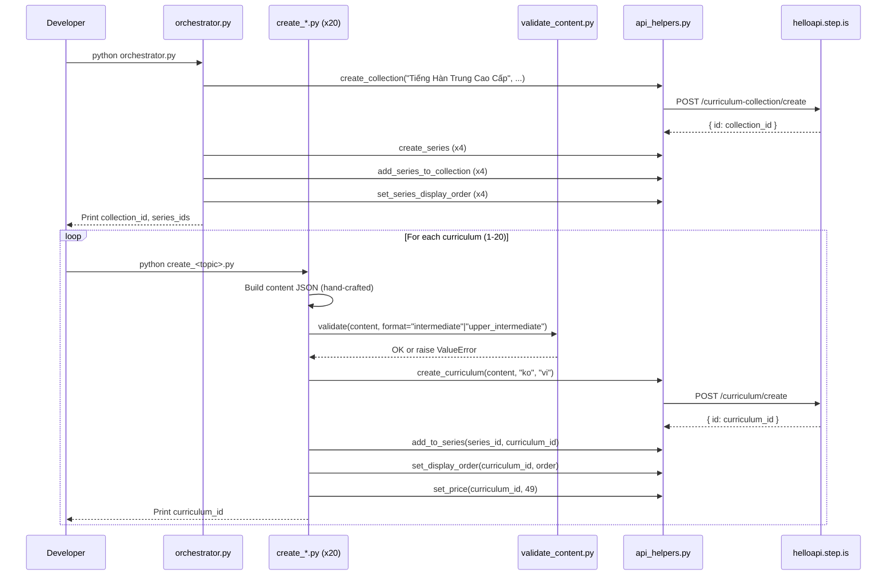

# Design Document: Vietnamese-Korean Intermediate/Upper-Intermediate Curriculums

## Overview

This design covers the creation of 20 Korean-learning curriculums for Vietnamese-speaking adults at intermediate and upper-intermediate levels, organized into 1 collection and 4 series. The system consists of:

- **20 standalone Python scripts** — one per curriculum, each containing hand-crafted intermediate/upper-intermediate Korean content
- **1 orchestrator script** — creates the collection, 4 series, wires them together, sets display orders
- **1 content validator module** — validates curriculum JSON against intermediate/upper-intermediate-specific rules before upload
- **Shared API helpers** — reuses the existing root-level `api_helpers.py` module for all REST API calls

The language pair is `userLanguage="vi"` (Vietnamese speakers), `language="ko"` (learning Korean). All marketing text (titles, descriptions, previews) is in Vietnamese. Learner-facing content is bilingual: Vietnamese explanations with Korean vocabulary in Hangul with Revised Romanization pronunciation guidance.

### Key Design Decisions

1. **Reuse existing root-level `api_helpers.py`** — already wraps all needed API endpoints (create_curriculum, add_to_series, set_display_order, set_price, create_collection, create_series, add_series_to_collection, set_series_display_order) with Firebase auth, error handling, and logging.

2. **Single validator supporting both formats** — a new `validate_content.py` in `vi-ko-intermediate-curriculums/` supporting `intermediate` and `upper_intermediate` formats. Both formats require exactly 5 sessions, 18 vocab words (3 groups of 6), vocabLevel3 in Session 4 only, and writingParagraph in Session 5 only. The only difference is reading passage length (intermediate: 200-350 chars per session, 500-800 final; upper-intermediate: 300-500 chars per session, 600-1000 final). No lowercase enforcement for vocabList since Korean Hangul doesn't have letter case.

3. **No tone_assigner module** — tone assignments are hard-coded in each script and documented in the orchestrator. Manual assignment with variety checks is simpler and more transparent for 20 curriculums across 4 series.

4. **Both formats share the same activity structure** — both intermediate and upper-intermediate have vocabLevel3 in Session 4 and writingParagraph in Session 5. The difference is content complexity (passage length, analytical depth of writing prompts).

5. **Scripts directory**: `vi-ko-intermediate-curriculums/`

6. **4 series (not 5)** — thematic grouping per requirements: Business & Career (3 curriculums), Culture & Society (5 curriculums), Lifestyle & Trends (6 curriculums), Knowledge & Ideas (5 curriculums). Uneven distribution reflects topic clustering.

7. **Revised Romanization** — all Korean vocabulary includes Revised Romanization pronunciation in introAudio scripts (e.g., 전략/jeollyak). This is the official romanization system and helps Vietnamese learners approximate Korean pronunciation.

## Architecture

```mermaid
graph TD
    subgraph "vi-ko-intermediate-curriculums/"
        ORCH[orchestrator.py] --> API[api_helpers.py<br/>shared, repo root]
        VAL[validate_content.py]

        C1[create_business_strategy.py] --> VAL
        C1 --> API
        C2[create_korean_history.py] --> VAL
        C2 --> API
        C3[create_beauty_skincare.py] --> VAL
        C3 --> API
        C4[create_fine_dining.py] --> VAL
        C4 --> API
        C5[create_social_issues.py] --> VAL
        C5 --> API
        C6[create_korean_arts.py] --> VAL
        C6 --> API
        C7[create_education_system.py] --> VAL
        C7 --> API
        C8[create_real_estate.py] --> VAL
        C8 --> API
        C9[create_media_journalism.py] --> VAL
        C9 --> API
        C10[create_philosophy_confucianism.py] --> VAL
        C10 --> API
        C11[create_fashion_design.py] --> VAL
        C11 --> API
        C12[create_startup_ecosystem.py] --> VAL
        C12 --> API
        C13[create_sports_esports.py] --> VAL
        C13 --> API
        C14[create_wedding_traditions.py] --> VAL
        C14 --> API
        C15[create_language_nuances.py] --> VAL
        C15 --> API
        C16[create_healthcare_system.py] --> VAL
        C16 --> API
        C17[create_immigration.py] --> VAL
        C17 --> API
        C18[create_architecture_urban.py] --> VAL
        C18 --> API
        C19[create_korean_literature.py] --> VAL
        C19 --> API
        C20[create_traditional_medicine.py] --> VAL
        C20 --> API
    end

    API --> FB[firebase_token.py]
    API --> REST[helloapi.step.is REST API]
    REST --> DB[(PostgreSQL)]
```



### Execution Flow



## Components and Interfaces

### 1. orchestrator.py

Creates the collection and 4 series, wires them together, sets display orders.

**Inputs:** None (all data hard-coded — collection/series titles, descriptions, tone assignments)

**Outputs:** Prints collection ID, series IDs, tone assignments for curriculum scripts

**API calls:**
- `curriculum-collection/create` — 1 call
- `curriculum-series/create` — 4 calls
- `curriculum-collection/addSeriesToCollection` — 4 calls
- `curriculum-series/setDisplayOrder` — 4 calls

**Series tone assignments (all 4 different):**

| Series | Title | Tone |
|--------|-------|------|
| Series 1 | "Kinh Doanh Và Sự Nghiệp" | `bold_declaration` |
| Series 2 | "Văn Hóa Và Xã Hội" | `empathetic_observation` |
| Series 3 | "Đời Sống Và Xu Hướng" | `vivid_scenario` |
| Series 4 | "Tri Thức Và Tư Tưởng" | `provocative_question` |

**Curriculum tone assignments (no adjacent duplicates within each series, no tone >30%):**

| # | Curriculum | Series | Level | Desc Tone | Farewell Tone |
|---|-----------|--------|-------|-----------|---------------|
| 1 | Đầu Tư Và Chiến Lược Kinh Doanh | Kinh Doanh Và Sự Nghiệp | intermediate | provocative_question | warm_accountability |
| 8 | Bất Động Sản Và Đầu Tư | Kinh Doanh Và Sự Nghiệp | intermediate | vivid_scenario | quiet_awe |
| 12 | Hệ Sinh Thái Startup | Kinh Doanh Và Sự Nghiệp | upper_intermediate | bold_declaration | practical_momentum |
| 2 | Đại Hàn Và Lịch Sử | Văn Hóa Và Xã Hội | intermediate | surprising_fact | introspective_guide |
| 5 | Xã Hội Hàn Quốc Hiện Đại | Văn Hóa Và Xã Hội | intermediate | empathetic_observation | team_building_energy |
| 6 | Nghệ Thuật Hàn Quốc | Văn Hóa Và Xã Hội | intermediate | metaphor_led | warm_accountability |
| 14 | Hôn Nhân Và Truyền Thống | Văn Hóa Và Xã Hội | upper_intermediate | vivid_scenario | quiet_awe |
| 17 | Nhập Cư Và Đa Văn Hóa | Văn Hóa Và Xã Hội | upper_intermediate | provocative_question | practical_momentum |
| 3 | Làm Đẹp Và Skincare | Đời Sống Và Xu Hướng | intermediate | bold_declaration | introspective_guide |
| 4 | Ẩm Thực Cao Cấp | Đời Sống Và Xu Hướng | intermediate | vivid_scenario | team_building_energy |
| 7 | Hệ Thống Giáo Dục | Đời Sống Và Xu Hướng | intermediate | empathetic_observation | warm_accountability |
| 9 | Truyền Thông Và Báo Chí | Đời Sống Và Xu Hướng | intermediate | surprising_fact | quiet_awe |
| 13 | Thể Thao Và Esports | Đời Sống Và Xu Hướng | upper_intermediate | metaphor_led | practical_momentum |
| 16 | Hệ Thống Y Tế | Đời Sống Và Xu Hướng | upper_intermediate | provocative_question | introspective_guide |
| 10 | Triết Học Và Nho Giáo | Tri Thức Và Tư Tưởng | intermediate | metaphor_led | team_building_energy |
| 11 | Thời Trang Và Thiết Kế | Tri Thức Và Tư Tưởng | upper_intermediate | bold_declaration | warm_accountability |
| 15 | Sắc Thái Ngôn Ngữ | Tri Thức Và Tư Tưởng | upper_intermediate | surprising_fact | quiet_awe |
| 18 | Kiến Trúc Và Đô Thị | Tri Thức Và Tư Tưởng | upper_intermediate | vivid_scenario | practical_momentum |
| 19 | Văn Học Hàn Quốc | Tri Thức Và Tư Tưởng | upper_intermediate | empathetic_observation | introspective_guide |
| 20 | Y Học Cổ Truyền | Tri Thức Và Tư Tưởng | upper_intermediate | provocative_question | team_building_energy |

**Tone distribution check:**
- Description tones across 20 curriculums: provocative_question x4, bold_declaration x3, vivid_scenario x3, empathetic_observation x3, surprising_fact x3, metaphor_led x3 — max 20%, all <=30% ✓
- No adjacent duplicates within any of the 4 series ✓
- Farewell tones across 20 curriculums: warm_accountability x4, quiet_awe x4, practical_momentum x4, introspective_guide x4, team_building_energy x4 — evenly distributed (20% each) ✓
- No adjacent farewell duplicates within any series ✓


### 2. validate_content.py

Content validator supporting intermediate and upper-intermediate curriculum formats.

**Interface:**
```python
def validate(content: dict, format: str) -> None:
    """
    Validates curriculum content JSON for vi-ko intermediate/upper-intermediate curriculums.

    Args:
        content: The curriculum content dict
        format: One of "intermediate" or "upper_intermediate"

    Raises:
        ValueError with specific violation message on any failure.
    """
```

**Format configurations:**

| Format | Sessions | Vocab Words | Groups | Required Activities |
|--------|----------|-------------|--------|---------------------|
| `intermediate` | 5 | 18 (3x6) | 3 | vocabLevel3 in S4 only, writingParagraph in S5 only |
| `upper_intermediate` | 5 | 18 (3x6) | 3 | vocabLevel3 in S4 only, writingParagraph in S5 only |

**Validation checks:**
1. Top-level structure: `title`, `description`, `preview.text`, `contentTypeTags: []`, `learningSessions`
2. Session count = exactly 5
3. Each session has `title` and non-empty `activities` array
4. Each activity has `activityType` (not `type`), `title`, `description`, `data` object
5. Valid `activityType` values
6. `vocabList` is array of strings, field name is `vocabList` (not `words`) — NO lowercase enforcement (Korean Hangul has no case)
7. `viewFlashcards`/`speakFlashcards` in same session have identical `vocabList`
8. `writingSentence` has `data.vocabList`, `data.items` with `prompt` and `targetVocab`
9. `writingParagraph` has `data.vocabList`, `data.instructions`, `data.prompts` (array with >=2 items)
10. No strip-keys anywhere in JSON tree
11. Total unique vocab count = 18 across all sessions
12. `vocabLevel3` appears ONLY in Session 4
13. `writingParagraph` appears ONLY in Session 5
14. `vocabLevel3` IS PRESENT in Session 4 (required, not just allowed)
15. `writingParagraph` IS PRESENT in Session 5 (required, not just allowed)

### 3. Individual Curriculum Scripts (create_*.py x 20)

Each script is standalone and contains all hand-crafted content for one curriculum.

**Common interface pattern:**
```python
# create_<topic>.py
import sys
import json
import logging

sys.path.insert(0, "/home/ubuntu/nspaceresearch/design-curriculums")
sys.path.insert(0, "/home/ubuntu/nspaceresearch/design-curriculums/vi-ko-intermediate-curriculums")
from api_helpers import (
    create_curriculum, add_to_series, set_display_order, set_price
)
from validate_content import validate

SERIES_ID = "<series_id>"  # Filled after orchestrator runs
DISPLAY_ORDER = <N>
PRICE = 49

def build_content() -> dict:
    """Build the curriculum content dict with all hand-crafted text."""
    return {
        "title": "...",
        "description": "...",
        "preview": {"text": "..."},
        "contentTypeTags": [],
        "learningSessions": [...]
    }

def main():
    content = build_content()
    validate(content, format="intermediate")  # or "upper_intermediate"
    curriculum_id = create_curriculum(content, "ko", "vi")
    add_to_series(SERIES_ID, curriculum_id)
    set_display_order(curriculum_id, DISPLAY_ORDER)
    set_price(curriculum_id, PRICE)
    print(f"Created: {curriculum_id}")

if __name__ == "__main__":
    main()
```

**Key constraints:**
- All text content (introAudio scripts, reading passages, descriptions, previews, writing prompts) is hand-written per curriculum
- No template functions or string interpolation for learner-facing text
- The `build_content()` function returns a fully literal dict
- Korean vocabulary in Hangul with Revised Romanization in introAudio scripts
- Vietnamese marketing text for descriptions/previews addressing adult learner aspirations
- Reading passages use Korean at TOPIK II level 3-4 for intermediate, TOPIK II level 4-5 for upper-intermediate

### 4. Activity Templates

#### Intermediate (5 sessions, 18 words in 3 groups of 6, price 49)

```
Session 1 (Learning, "Phần 1"):
  1. introAudio — welcome + topic intro (600-900 words Vietnamese)
  2. introAudio — teach words group 1 with Revised Romanization, Vietnamese meaning, example sentences
  3. viewFlashcards (group 1, 6 words)
  4. speakFlashcards (group 1, 6 words)
  5. vocabLevel1 (group 1)
  6. vocabLevel2 (group 1)
  7. introAudio — grammar/usage notes
  8. reading — passage using group 1 words (200-350 chars, Hangul at TOPIK II level 3-4)
  9. speakReading
  10. readAlong
  11. writingSentence (3 items using group 1 words)

Session 2 (Learning, "Phần 2"):
  1. introAudio — recap group 1 + intro
  2. introAudio — teach words group 2
  3. viewFlashcards (group 2, 6 words)
  4. speakFlashcards (group 2, 6 words)
  5. vocabLevel1 (group 2)
  6. vocabLevel2 (group 2)
  7. introAudio — grammar/usage notes
  8. reading — passage using group 2 words (200-350 chars)
  9. speakReading
  10. readAlong
  11. writingSentence (3 items using group 2 words)

Session 3 (Learning, "Phần 3"):
  1. introAudio — recap groups 1-2 + intro
  2. introAudio — teach words group 3
  3. viewFlashcards (group 3, 6 words)
  4. speakFlashcards (group 3, 6 words)
  5. vocabLevel1 (group 3)
  6. vocabLevel2 (group 3)
  7. introAudio — grammar/usage notes
  8. reading — passage using group 3 words (200-350 chars)
  9. speakReading
  10. readAlong
  11. writingSentence (3 items using group 3 words)

Session 4 (Review, "Ôn tập"):
  1. introAudio — review intro
  2. viewFlashcards (all 18 words)
  3. speakFlashcards (all 18 words)
  4. vocabLevel1 (all 18 words)
  5. vocabLevel2 (all 18 words)
  6. vocabLevel3 (all 18 words)
  7. writingSentence (4-5 items mixing all groups)

Session 5 (Final Reading, "Đọc tổng hợp"):
  1. introAudio — full reading intro
  2. reading — full article using all 18 words (500-800 chars)
  3. speakReading
  4. readAlong
  5. writingParagraph (using 6+ vocabulary words)
  6. introAudio — farewell with vocab review (400-600 words)
```

#### Upper-Intermediate (5 sessions, 18 words in 3 groups of 6, price 49)

```
Session 1 (Learning, "Phần 1"):
  1. introAudio — welcome + topic intro (600-900 words Vietnamese)
  2. introAudio — teach words group 1 with Revised Romanization, Vietnamese meaning, example sentences
  3. viewFlashcards (group 1, 6 words)
  4. speakFlashcards (group 1, 6 words)
  5. vocabLevel1 (group 1)
  6. vocabLevel2 (group 1)
  7. introAudio — grammar/usage notes
  8. reading — passage using group 1 words (300-500 chars, Hangul at TOPIK II level 4-5)
  9. speakReading
  10. readAlong
  11. writingSentence (3 items using group 1 words)

Session 2 (Learning, "Phần 2"):
  1. introAudio — recap group 1 + intro
  2. introAudio — teach words group 2
  3. viewFlashcards (group 2, 6 words)
  4. speakFlashcards (group 2, 6 words)
  5. vocabLevel1 (group 2)
  6. vocabLevel2 (group 2)
  7. introAudio — grammar/usage notes
  8. reading — passage using group 2 words (300-500 chars)
  9. speakReading
  10. readAlong
  11. writingSentence (3 items using group 2 words)

Session 3 (Learning, "Phần 3"):
  1. introAudio — recap groups 1-2 + intro
  2. introAudio — teach words group 3
  3. viewFlashcards (group 3, 6 words)
  4. speakFlashcards (group 3, 6 words)
  5. vocabLevel1 (group 3)
  6. vocabLevel2 (group 3)
  7. introAudio — grammar/usage notes
  8. reading — passage using group 3 words (300-500 chars)
  9. speakReading
  10. readAlong
  11. writingSentence (3 items using group 3 words)

Session 4 (Review, "Ôn tập"):
  1. introAudio — review intro
  2. viewFlashcards (all 18 words)
  3. speakFlashcards (all 18 words)
  4. vocabLevel1 (all 18 words)
  5. vocabLevel2 (all 18 words)
  6. vocabLevel3 (all 18 words)
  7. writingSentence (4-5 items mixing all groups)

Session 5 (Final Reading, "Đọc tổng hợp"):
  1. introAudio — full reading intro
  2. reading — full article using all 18 words (600-1000 chars)
  3. speakReading
  4. readAlong
  5. writingParagraph (using 8+ vocabulary words, analytical/argumentative)
  6. introAudio — farewell with vocab review (400-600 words)
```

## Data Models

### Curriculum Content JSON Structure (Intermediate Example)

```json
{
  "title": "Đầu Tư Và Chiến Lược Kinh Doanh",
  "description": "Multi-paragraph Vietnamese persuasive copy about business strategy...",
  "preview": {
    "text": "Vietnamese preview text (~150 words) with vocabulary listing..."
  },
  "contentTypeTags": [],
  "learningSessions": [
    {
      "title": "Phần 1",
      "activities": [
        {
          "activityType": "introAudio",
          "title": "Chào mừng bạn đến với bài học Chiến Lược Kinh Doanh",
          "description": "Giới thiệu chủ đề chiến lược kinh doanh tại Hàn Quốc",
          "data": {
            "text": "Xin chào bạn! Hôm nay chúng ta sẽ học về chủ đề chiến lược kinh doanh tại Hàn Quốc..."
          }
        },
        {
          "activityType": "introAudio",
          "title": "Giới thiệu từ vựng nhóm 1",
          "description": "Học 6 từ vựng về chiến lược kinh doanh",
          "data": {
            "text": "Từ đầu tiên là 전략 (jeollyak) - có nghĩa là chiến lược. Ví dụ: 회사의 성장 전략을 수립해야 합니다. (Chúng ta cần xây dựng chiến lược tăng trưởng của công ty.)..."
          }
        },
        {
          "activityType": "viewFlashcards",
          "title": "Flashcards: Chiến lược kinh doanh",
          "description": "Học 6 từ: 전략, 리더십, 의사결정, 시장점유율, 경쟁력, 혁신",
          "data": {
            "vocabList": ["전략", "리더십", "의사결정", "시장점유율", "경쟁력", "혁신"]
          }
        },
        {
          "activityType": "speakFlashcards",
          "title": "Flashcards: Chiến lược kinh doanh",
          "description": "Học 6 từ: 전략, 리더십, 의사결정, 시장점유율, 경쟁력, 혁신",
          "data": {
            "vocabList": ["전략", "리더십", "의사결정", "시장점유율", "경쟁력", "혁신"]
          }
        },
        {
          "activityType": "vocabLevel1",
          "title": "Flashcards: Chiến lược kinh doanh",
          "description": "Học 6 từ: 전략, 리더십, 의사결정, 시장점유율, 경쟁력, 혁신",
          "data": {
            "vocabList": ["전략", "리더십", "의사결정", "시장점유율", "경쟁력", "혁신"]
          }
        },
        {
          "activityType": "vocabLevel2",
          "title": "Flashcards: Chiến lược kinh doanh",
          "description": "Học 6 từ: 전략, 리더십, 의사결정, 시장점유율, 경쟁력, 혁신",
          "data": {
            "vocabList": ["전략", "리더십", "의사결정", "시장점유율", "경쟁력", "혁신"]
          }
        },
        {
          "activityType": "introAudio",
          "title": "Ngữ pháp và cách dùng",
          "description": "Giải thích cách sử dụng từ vựng trong ngữ cảnh kinh doanh",
          "data": {
            "text": "Bây giờ chúng ta sẽ tìm hiểu cách sử dụng những từ này trong ngữ cảnh kinh doanh Hàn Quốc..."
          }
        },
        {
          "activityType": "reading",
          "title": "Đọc: Chiến lược kinh doanh",
          "description": "김 대표는 회사의 성장 전략을 발표했습니다...",
          "data": {
            "text": "김 대표는 회사의 성장 전략을 발표했습니다. 리더십을 발휘하여 중요한 의사결정을 내렸고, 시장점유율을 높이기 위해 경쟁력 있는 혁신 제품을 출시할 계획입니다.",
            "vocabList": ["전략", "리더십", "의사결정", "시장점유율", "경쟁력", "혁신"]
          }
        },
        {
          "activityType": "speakReading",
          "title": "Đọc: Chiến lược kinh doanh",
          "description": "김 대표는 회사의 성장 전략을 발표했습니다...",
          "data": {
            "text": "김 대표는 회사의 성장 전략을 발표했습니다. 리더십을 발휘하여 중요한 의사결정을 내렸고, 시장점유율을 높이기 위해 경쟁력 있는 혁신 제품을 출시할 계획입니다."
          }
        },
        {
          "activityType": "readAlong",
          "title": "Nghe: Chiến lược kinh doanh",
          "description": "Nghe đoạn văn vừa đọc và theo dõi.",
          "data": {
            "text": "김 대표는 회사의 성장 전략을 발표했습니다. 리더십을 발휘하여 중요한 의사결정을 내렸고, 시장점유율을 높이기 위해 경쟁력 있는 혁신 제품을 출시할 계획입니다."
          }
        },
        {
          "activityType": "writingSentence",
          "title": "Viết: Chiến lược kinh doanh",
          "description": "Viết câu tiếng Hàn về chiến lược kinh doanh",
          "data": {
            "vocabList": ["전략", "리더십", "의사결정"],
            "items": [
              {
                "prompt": "Viết một câu tiếng Hàn dùng từ '전략' (jeollyak - chiến lược). Ví dụ: 새로운 전략을 세워야 합니다. (saeroun jeollyageul sewoya hamnida - Chúng ta cần lập chiến lược mới.) Hãy thay '새로운' bằng '장기적인' (janggijeоgin - dài hạn) nhé!",
                "targetVocab": "전략"
              },
              {
                "prompt": "Viết một câu tiếng Hàn dùng từ '리더십' (rideosip - lãnh đạo). Ví dụ: 그의 리더십이 회사를 성장시켰습니다. (geuui rideosip-i hoesareul seongjangsikyeotseumnida - Khả năng lãnh đạo của anh ấy đã giúp công ty phát triển.) Hãy thay '회사를' bằng '팀을' (timeul - đội nhóm) nhé!",
                "targetVocab": "리더십"
              },
              {
                "prompt": "Viết một câu tiếng Hàn dùng từ '의사결정' (uisa-gyeoljeong - ra quyết định). Ví dụ: 빠른 의사결정이 필요합니다. (ppareun uisa-gyeoljeong-i piryohamnida - Cần ra quyết định nhanh.) Hãy thay '빠른' bằng '신중한' (sinjunghan - thận trọng) nhé!",
                "targetVocab": "의사결정"
              }
            ]
          }
        }
      ]
    }
  ]
}
```

### writingParagraph Structure (Session 5, Both Formats)

```json
{
  "activityType": "writingParagraph",
  "title": "Viết đoạn: Chiến lược kinh doanh",
  "description": "Viết đoạn văn tiếng Hàn phân tích chiến lược kinh doanh",
  "data": {
    "vocabList": ["전략", "리더십", "혁신", "경쟁력", "성장전략", "지속가능경영"],
    "instructions": "Hãy viết 4-6 câu tiếng Hàn phân tích chiến lược kinh doanh của một công ty Hàn Quốc. Sử dụng ít nhất 6 từ vựng đã học trong bài. Bạn có thể viết về chiến lược tăng trưởng (성장전략), khả năng lãnh đạo (리더십), đổi mới sáng tạo (혁신), hoặc phát triển bền vững (지속가능경영).",
    "prompts": [
      "Theo bạn, yếu tố nào quan trọng nhất trong chiến lược kinh doanh của Samsung hoặc Hyundai?",
      "Làm thế nào để một công ty duy trì được sức cạnh tranh trong thị trường toàn cầu?",
      "Bạn nghĩ gì về mối quan hệ giữa đổi mới và phát triển bền vững?"
    ]
  }
}
```

### vocabLevel3 Structure (Session 4, Both Formats)

```json
{
  "activityType": "vocabLevel3",
  "title": "Flashcards: Chiến lược kinh doanh",
  "description": "Ôn tập 18 từ: 전략, 리더십, 의사결정, 시장점유율, 경쟁력, 혁신, 인수합병, 주주, 이사회, 실적, 수익성, 비전, 목표설정, 위기관리, 조직문화, 성장전략, 사업확장, 지속가능경영",
  "data": {
    "vocabList": ["전략", "리더십", "의사결정", "시장점유율", "경쟁력", "혁신", "인수합병", "주주", "이사회", "실적", "수익성", "비전", "목표설정", "위기관리", "조직문화", "성장전략", "사업확장", "지속가능경영"]
  }
}
```

### API Call Parameters

| API Endpoint | Key Parameters |
|---|---|
| `curriculum/create` | `firebaseIdToken`, `language: "ko"`, `userLanguage: "vi"`, `content: JSON.stringify(content)` |
| `curriculum-series/addCurriculum` | `firebaseIdToken`, `curriculumSeriesId`, `curriculumId` |
| `curriculum/setDisplayOrder` | `firebaseIdToken`, `id`, `displayOrder` |
| `curriculum/setPrice` | `firebaseIdToken`, `id`, `price: 49` |
| `curriculum-collection/create` | `firebaseIdToken`, `title`, `description` |
| `curriculum-series/create` | `firebaseIdToken`, `title`, `description` |
| `curriculum-collection/addSeriesToCollection` | `firebaseIdToken`, `curriculumCollectionId`, `curriculumSeriesId` |
| `curriculum-series/setDisplayOrder` | `firebaseIdToken`, `id`, `displayOrder` |

## Correctness Properties

*A property is a characteristic or behavior that should hold true across all valid executions of a system — essentially, a formal statement about what the system should do. Properties serve as the bridge between human-readable specifications and machine-verifiable correctness guarantees.*

The content validator (`validate_content.py`) is the primary component amenable to property-based testing. It is a pure function: takes a content dict and format string, returns None or raises ValueError. The input space is large (arbitrary JSON structures), and universal properties hold across all valid/invalid inputs.

The curriculum creation scripts, orchestrator, and API interactions are integration-level concerns tested via database verification queries after execution.

### Property 1: Valid content passes validation

*For any* well-formed curriculum content dict that matches its declared format (exactly 5 sessions, 18 total vocab words in 3 groups of 6, all required fields present, vocabLevel3 in Session 4, writingParagraph in Session 5, no strip keys, vocabList as arrays of strings, matching viewFlashcards/speakFlashcards vocabLists), calling `validate(content, format)` SHALL return without raising an exception.

**Validates: Requirements 1.3, 1.4, 1.5, 1.8, 1.9, 1.10, 1.11**

### Property 2: Strip keys are rejected anywhere in the JSON tree

*For any* curriculum content dict and any strip key (mp3Url, illustrationSet, chapterBookmarks, segments, whiteboardItems, userReadingId, lessonUniqueId, curriculumTags, taskId, imageId), if that key is injected at any depth in the JSON tree, `validate()` SHALL raise a ValueError mentioning the strip key.

**Validates: Requirements 1.6**

### Property 3: Activity placement is enforced

*For any* curriculum content, if `vocabLevel3` appears in any session other than Session 4, or if `writingParagraph` appears in any session other than Session 5, `validate()` SHALL raise a ValueError identifying the misplaced activity. Conversely, if `vocabLevel3` is missing from Session 4 or `writingParagraph` is missing from Session 5, validation SHALL also raise a ValueError.

**Validates: Requirements 1.8, 1.9, 1.10, 1.11, 4.2, 4.3, 5.2, 5.3**

### Property 4: Activities missing required fields are rejected

*For any* activity in any curriculum content, if any of the required fields (`activityType`, `title`, `description`, `data`) is missing or if `data` is not a dict, `validate()` SHALL raise a ValueError identifying the missing field and its location.

**Validates: Requirements 9.6**

### Property 5: Invalid activityType values are rejected

*For any* activity with an `activityType` value not in the valid set (introAudio, viewFlashcards, speakFlashcards, vocabLevel1, vocabLevel2, vocabLevel3, reading, speakReading, readAlong, writingSentence, writingParagraph), `validate()` SHALL raise a ValueError.

**Validates: Requirements 9.6**

### Property 6: vocabList format is enforced

*For any* vocab activity (viewFlashcards, speakFlashcards, vocabLevel1, vocabLevel2, vocabLevel3), if `data.vocabList` is not an array, is empty, contains non-string elements, or uses the field name `words` instead of `vocabList`, `validate()` SHALL raise a ValueError. Note: lowercase is NOT enforced for Korean vocabulary (Hangul has no case).

**Validates: Requirements 9.6**

### Property 7: Flashcard vocabList consistency within sessions

*For any* session containing both `viewFlashcards` and `speakFlashcards` activities, if their `data.vocabList` arrays differ, `validate()` SHALL raise a ValueError.

**Validates: Requirements 9.6**

### Property 8: Writing activity structure is enforced

*For any* `writingSentence` activity, if `data.vocabList` is missing, `data.items` is missing or empty, or any item lacks a non-empty `prompt` or `targetVocab`, `validate()` SHALL raise a ValueError. *For any* `writingParagraph` activity, if `data.vocabList` is missing, `data.instructions` is missing or empty, or `data.prompts` is missing or has fewer than 2 items, `validate()` SHALL raise a ValueError.

**Validates: Requirements 9.6**

## Error Handling

### Validator Errors

The `validate_content.py` module raises `ValueError` with a specific message identifying:
- The exact rule violated
- The location in the JSON tree (e.g., "Session 2, Activity 3")
- The expected vs. actual value
- The format being validated against

Each curriculum script calls `validate()` before any API call. If validation fails, the script aborts with the error message — no partial upload occurs.

### API Call Errors

Each curriculum script follows this error handling pattern:

1. **Validation failure** — Script aborts immediately, prints the violation. No API calls made.
2. **`curriculum/create` failure** — Script logs the error with curriculum title and exits. The curriculum is not partially created.
3. **`add_to_series` failure** — Curriculum exists but is orphaned. Script logs the error. Developer must manually add to series or delete the curriculum.
4. **`set_display_order` failure** — Curriculum exists in series but without explicit order. Script logs the error. Developer must manually set order.
5. **`set_price` failure** — Curriculum exists with default price. Script logs the error. Developer must manually set price.

The orchestrator follows the same pattern:
1. **`create_collection` failure** — Abort. Nothing created.
2. **`create_series` failure** — Collection exists but series is missing. Log and continue with remaining series.
3. **`add_series_to_collection` failure** — Series exists but not wired. Log for manual fix.
4. **`set_series_display_order` failure** — Series wired but unordered. Log for manual fix.

All errors are logged with enough context to manually complete or roll back the operation.

### Duplicate Prevention

After creating each curriculum, scripts log the curriculum ID. If a script is accidentally run twice, the duplicate check query identifies extras:
```sql
SELECT id, title, created_at FROM curriculum
WHERE title = '<title>' AND uid = 'zs5AMpVfqkcfDf8CJ9qrXdH58d73' ORDER BY created_at;
```

## Testing Strategy

**Property-based tests** (using `hypothesis`):
- Test the `validate_content.py` module with generated inputs
- Minimum 100 iterations per property test
- 8 properties covering all validator rules
- Tag format: `Feature: vi-ko-intermediate-curriculums, Property N: <description>`

**Integration verification** (post-execution database queries):
- Verify 20 curriculums exist with correct language pair
- Verify series membership and display orders
- Verify all prices set to 49
- Verify no `setPublic` calls (all private)
- Run duplicate check for all 20 titles

**Manual content review**:
- Verify Vietnamese marketing copy quality
- Verify Korean reading passage complexity matches level
- Verify introAudio scripts teach each word properly
- Verify tone variety across descriptions and farewells
