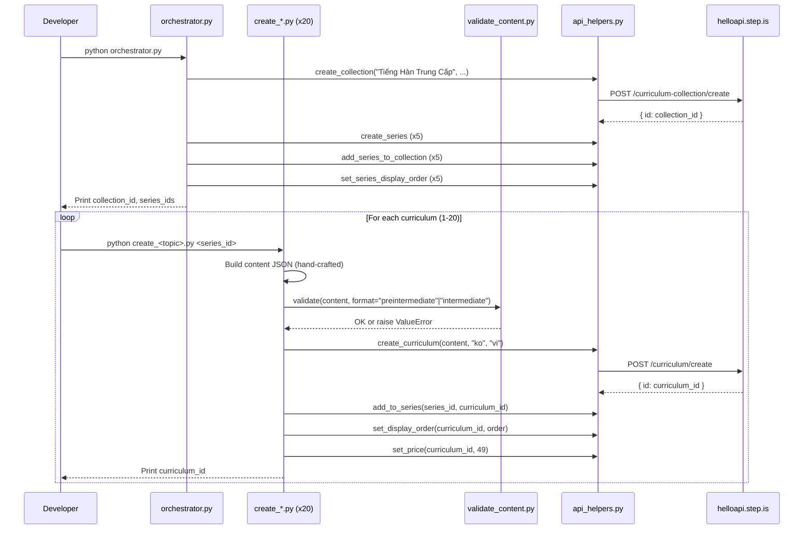

# Design Document: Vietnamese-Korean Preintermediate/Intermediate Curriculums

## Overview

This design covers the creation of 20 Korean-learning curriculums for Vietnamese-speaking adults at preintermediate and intermediate levels, organized into 1 collection and 5 series of 4 curriculums each. The system consists of:

- **20 standalone Python scripts** — one per curriculum, each containing hand-crafted preintermediate/intermediate Korean content
- **1 orchestrator script** — creates the collection, 5 series, wires them together, sets display orders
- **1 content validator module** — validates curriculum JSON against preintermediate/intermediate-specific rules before upload
- **Shared API helpers** — reuses the existing root-level `api_helpers.py` module for all REST API calls

The language pair is `userLanguage="vi"` (Vietnamese speakers), `language="ko"` (learning Korean). All marketing text (titles, descriptions, previews) is in Vietnamese. All learner-facing content is bilingual: Vietnamese explanations with Korean vocabulary in Hangul with Revised Romanization pronunciation guidance.

### Key Design Decisions

1. **Reuse existing root-level `api_helpers.py`** — the module already wraps all needed API endpoints (create_curriculum, add_to_series, set_display_order, set_price, create_collection, create_series, add_series_to_collection, set_series_display_order) with Firebase auth, error handling, and logging.

2. **Preintermediate/Intermediate-specific validator** — a new `validate_content.py` in `vi-ko-preintermediate-curriculums/` supporting `preintermediate` and `intermediate` formats. Key differences from the beginner validator: enforces exactly 5 sessions and 18 vocab words for both formats; preintermediate forbids writingParagraph and vocabLevel3; intermediate requires vocabLevel3 in Session 4 only and writingParagraph in Session 5 only. No lowercase enforcement for vocabList since Korean Hangul doesn't have letter case.

3. **No tone_assigner module** — with 20 curriculums across 5 series, tone assignments are hard-coded in each script and documented in the orchestrator. Manual assignment with variety checks is simpler and more transparent.

4. **Two curriculum format templates** — `preintermediate` (5 sessions, 18 words in 3 groups of 6, no writingParagraph/vocabLevel3, price 49) and `intermediate` (5 sessions, 18 words in 3 groups of 6, vocabLevel3 in review session, writingParagraph in final session, price 49).

5. **Scripts directory**: `vi-ko-preintermediate-curriculums/`

6. **Reading passage length** — preintermediate: 150-250 chars per session passage, 400-600 chars for final reading. Intermediate: 200-350 chars per session passage, 500-800 chars for final reading.

7. **Revised Romanization** — all Korean vocabulary includes Revised Romanization pronunciation in introAudio scripts (e.g., 이력서/iryeokseo). This is the official romanization system and helps Vietnamese learners approximate Korean pronunciation.

## Architecture

```mermaid
graph TD
    subgraph "vi-ko-preintermediate-curriculums/"
        ORCH[orchestrator.py] --> API[api_helpers.py<br/>shared, repo root]
        VAL[validate_content.py]

        C1[create_job_interview.py] --> VAL
        C1 --> API
        C2[create_booking_planning.py] --> VAL
        C2 --> API
        C3[create_street_food.py] --> VAL
        C3 --> API
        C4[create_renting.py] --> VAL
        C4 --> API
        C5[create_medical_visit.py] --> VAL
        C5 --> API
        C6[create_social_relationships.py] --> VAL
        C6 --> API
        C7[create_phone_communication.py] --> VAL
        C7 --> API
        C8[create_online_shopping.py] --> VAL
        C8 --> API
        C9[create_kdrama_entertainment.py] --> VAL
        C9 --> API
        C10[create_kpop_music.py] --> VAL
        C10 --> API
        C11[create_natural_disasters.py] --> VAL
        C11 --> API
        C12[create_banking_finance.py] --> VAL
        C12 --> API
        C13[create_office_culture.py] --> VAL
        C13 --> API
        C14[create_news_events.py] --> VAL
        C14 --> API
        C15[create_education.py] --> VAL
        C15 --> API
        C16[create_psychology_emotions.py] --> VAL
        C16 --> API
        C17[create_rural_tourism.py] --> VAL
        C17 --> API
        C18[create_technology_ai.py] --> VAL
        C18 --> API
        C19[create_law_rules.py] --> VAL
        C19 --> API
        C20[create_environment.py] --> VAL
        C20 --> API
    end

    API --> FB[firebase_token.py]
    API --> REST[helloapi.step.is REST API]
    REST --> DB[(PostgreSQL)]
```




### Execution Flow



## Components and Interfaces

### 1. orchestrator.py

Creates the collection and 5 series, wires them together, sets display orders.

**Inputs:** None (all data hard-coded — collection/series titles, descriptions, tone assignments)

**Outputs:** Prints collection ID, series IDs, tone assignments for curriculum scripts

**API calls:**
- `curriculum-collection/create` — 1 call
- `curriculum-series/create` — 5 calls
- `curriculum-collection/addSeriesToCollection` — 5 calls
- `curriculum-series/setDisplayOrder` — 5 calls

**Series tone assignments (all 5 different):**

| Entity | Tone |
|--------|------|
| Series 1: "Sự Nghiệp Tại Hàn Quốc" | `bold_declaration` |
| Series 2: "Khám Phá Hàn Quốc" | `vivid_scenario` |
| Series 3: "Đời Sống Và Xã Hội" | `empathetic_observation` |
| Series 4: "Văn Hóa Và Giải Trí" | `surprising_fact` |
| Series 5: "Thế Giới Hiện Đại" | `provocative_question` |

**Curriculum tone assignments (no adjacent duplicates within each series, no tone >30%):**

| # | Curriculum | Series | Level | Desc Tone | Farewell Tone |
|---|-----------|--------|-------|-----------|---------------|
| 1 | Phỏng Vấn Xin Việc | Sự Nghiệp Tại Hàn Quốc | preintermediate | provocative_question | warm_accountability |
| 4 | Thuê Nhà Ở Hàn Quốc | Sự Nghiệp Tại Hàn Quốc | preintermediate | vivid_scenario | quiet_awe |
| 7 | Giao Tiếp Qua Điện Thoại | Sự Nghiệp Tại Hàn Quốc | preintermediate | empathetic_observation | practical_momentum |
| 13 | Văn Hóa Công Sở Hàn Quốc | Sự Nghiệp Tại Hàn Quốc | intermediate | bold_declaration | introspective_guide |
| 2 | Đặt Vé Và Lên Kế Hoạch | Khám Phá Hàn Quốc | preintermediate | surprising_fact | team_building_energy |
| 3 | Ẩm Thực Đường Phố Hàn Quốc | Khám Phá Hàn Quốc | preintermediate | metaphor_led | warm_accountability |
| 5 | Khám Bệnh Ở Hàn Quốc | Khám Phá Hàn Quốc | preintermediate | bold_declaration | quiet_awe |
| 17 | Du Lịch Nông Thôn Hàn Quốc | Khám Phá Hàn Quốc | intermediate | vivid_scenario | practical_momentum |
| 6 | Mối Quan Hệ Xã Hội | Đời Sống Và Xã Hội | preintermediate | provocative_question | introspective_guide |
| 8 | Mua Sắm Trực Tuyến | Đời Sống Và Xã Hội | preintermediate | empathetic_observation | team_building_energy |
| 12 | Ngân Hàng Và Tài Chính | Đời Sống Và Xã Hội | preintermediate | bold_declaration | warm_accountability |
| 16 | Tâm Lý Và Cảm Xúc | Đời Sống Và Xã Hội | intermediate | surprising_fact | quiet_awe |
| 9 | K-Drama Và Giải Trí | Văn Hóa Và Giải Trí | preintermediate | metaphor_led | practical_momentum |
| 10 | K-Pop Và Âm Nhạc | Văn Hóa Và Giải Trí | preintermediate | vivid_scenario | introspective_guide |
| 14 | Tin Tức Và Thời Sự | Văn Hóa Và Giải Trí | intermediate | provocative_question | team_building_energy |
| 15 | Giáo Dục Ở Hàn Quốc | Văn Hóa Và Giải Trí | intermediate | empathetic_observation | warm_accountability |
| 11 | Thiên Tai Và An Toàn | Thế Giới Hiện Đại | preintermediate | bold_declaration | quiet_awe |
| 18 | Công Nghệ Và AI | Thế Giới Hiện Đại | intermediate | surprising_fact | practical_momentum |
| 19 | Pháp Luật Và Quy Tắc | Thế Giới Hiện Đại | intermediate | metaphor_led | introspective_guide |
| 20 | Môi Trường Và Phát Triển Bền Vững | Thế Giới Hiện Đại | intermediate | vivid_scenario | team_building_energy |

**Tone distribution check:**
- Description tones across 20 curriculums: provocative_question x3, bold_declaration x4, vivid_scenario x4, empathetic_observation x3, surprising_fact x3, metaphor_led x3 — max 20%, all <=30% ✓
- No adjacent duplicates within any of the 5 series ✓
- Farewell tones across 20 curriculums: warm_accountability x4, quiet_awe x4, practical_momentum x4, introspective_guide x4, team_building_energy x4 — evenly distributed (20% each) ✓
- No adjacent farewell duplicates within any series ✓

### 2. validate_content.py

Preintermediate/Intermediate-specific content validator supporting two curriculum formats.

**Interface:**
```python
def validate(content: dict, format: str) -> None:
    """
    Validates curriculum content JSON for vi-ko preintermediate/intermediate curriculums.

    Args:
        content: The curriculum content dict
        format: One of "preintermediate" or "intermediate"

    Raises:
        ValueError with specific violation message on any failure.
    """
```

**Format configurations:**

| Format | Sessions | Vocab Words | Groups | Forbidden Activities | Required Activities |
|--------|----------|-------------|--------|---------------------|---------------------|
| `preintermediate` | 5 | 18 (3x6) | 3 | writingParagraph, vocabLevel3 | — |
| `intermediate` | 5 | 18 (3x6) | 3 | — | vocabLevel3 in S4 only, writingParagraph in S5 only |

**Validation checks:**
1. Top-level structure: `title`, `description`, `preview.text`, `contentTypeTags: []`, `learningSessions`
2. Session count = exactly 5 for both formats
3. Each session has `title` and non-empty `activities` array
4. Each activity has `activityType` (not `type`), `title`, `description`, `data` object
5. Valid `activityType` values (from allowed set per format)
6. `vocabList` is array of strings, field name is `vocabList` (not `words`) — NO lowercase enforcement (Korean Hangul has no case)
7. `viewFlashcards`/`speakFlashcards` in same session have identical `vocabList`
8. `writingSentence` has `data.vocabList`, `data.items` with `prompt` and `targetVocab`
9. `writingParagraph` (intermediate only) has `data.vocabList`, `data.instructions`, `data.prompts` (array with >=2 items)
10. No strip-keys anywhere in JSON tree (mp3Url, illustrationSet, chapterBookmarks, segments, whiteboardItems, userReadingId, lessonUniqueId, curriculumTags, taskId, imageId)
11. Total unique vocab count = 18 across all sessions
12. **Preintermediate format**: no `writingParagraph` or `vocabLevel3` in ANY session
13. **Intermediate format**: `vocabLevel3` appears ONLY in Session 4; `writingParagraph` appears ONLY in Session 5

### 3. Individual Curriculum Scripts (create_*.py x 20)

Each script is standalone and contains all hand-crafted content for one curriculum.

**Common interface pattern:**
```python
# create_<topic>.py
import sys
import json
import logging

sys.path.insert(0, "/home/ubuntu/nspaceresearch/design-curriculums")
sys.path.insert(0, "/home/ubuntu/nspaceresearch/design-curriculums/vi-ko-preintermediate-curriculums")
from api_helpers import (
    create_curriculum, add_to_series, set_display_order, set_price
)
from validate_content import validate

SERIES_ID = "<series_id>"  # Filled after orchestrator runs
DISPLAY_ORDER = <N>
PRICE = 49

def build_content() -> dict:
    """Build the curriculum content dict with all hand-crafted text."""
    return {
        "title": "...",
        "description": "...",
        "preview": {"text": "..."},
        "contentTypeTags": [],
        "learningSessions": [...]
    }

def main():
    content = build_content()
    validate(content, format="preintermediate")  # or "intermediate"
    curriculum_id = create_curriculum(content, "ko", "vi")
    add_to_series(SERIES_ID, curriculum_id)
    set_display_order(curriculum_id, DISPLAY_ORDER)
    set_price(curriculum_id, PRICE)
    print(f"Created: {curriculum_id}")

if __name__ == "__main__":
    main()
```

**Key constraints:**
- All text content (introAudio scripts, reading passages, descriptions, previews, writing prompts) is hand-written per curriculum
- No template functions or string interpolation for learner-facing text
- The `build_content()` function returns a fully literal dict
- Korean vocabulary in Hangul with Revised Romanization in introAudio scripts
- Vietnamese marketing text for descriptions/previews addressing adult learner aspirations at this level
- Reading passages use Korean at TOPIK I-II level for preintermediate, TOPIK II level for intermediate


### 4. Activity Templates

#### Preintermediate (5 sessions, 18 words in 3 groups of 6, price 49)

```
Session 1 (Learning, "Phần 1"):
  1. introAudio — welcome + topic intro (500-800 words Vietnamese)
  2. introAudio — teach words group 1 with Revised Romanization, Vietnamese meaning, example sentences
  3. viewFlashcards (group 1, 6 words)
  4. speakFlashcards (group 1, 6 words)
  5. vocabLevel1 (group 1)
  6. vocabLevel2 (group 1)
  7. introAudio — grammar/usage notes
  8. reading — passage using group 1 words (150-250 chars, Hangul)
  9. speakReading
  10. readAlong
  11. writingSentence (3 items using group 1 words)

Session 2 (Learning, "Phần 2"):
  1. introAudio — recap group 1 + intro
  2. introAudio — teach words group 2
  3. viewFlashcards (group 2, 6 words)
  4. speakFlashcards (group 2, 6 words)
  5. vocabLevel1 (group 2)
  6. vocabLevel2 (group 2)
  7. introAudio — grammar/usage notes
  8. reading — passage using group 2 words (150-250 chars)
  9. speakReading
  10. readAlong
  11. writingSentence (3 items using group 2 words)

Session 3 (Learning, "Phần 3"):
  1. introAudio — recap groups 1-2 + intro
  2. introAudio — teach words group 3
  3. viewFlashcards (group 3, 6 words)
  4. speakFlashcards (group 3, 6 words)
  5. vocabLevel1 (group 3)
  6. vocabLevel2 (group 3)
  7. introAudio — grammar/usage notes
  8. reading — passage using group 3 words (150-250 chars)
  9. speakReading
  10. readAlong
  11. writingSentence (3 items using group 3 words)

Session 4 (Review, "Ôn tập"):
  1. introAudio — review intro
  2. viewFlashcards (all 18 words)
  3. speakFlashcards (all 18 words)
  4. vocabLevel1 (all 18 words)
  5. vocabLevel2 (all 18 words)
  6. writingSentence (4-5 items mixing all groups)

Session 5 (Final Reading, "Đọc tổng hợp"):
  1. introAudio — full reading intro
  2. reading — full article using all 18 words (400-600 chars)
  3. speakReading
  4. readAlong
  5. introAudio — farewell with vocab review (400-600 words)
```

#### Intermediate (5 sessions, 18 words in 3 groups of 6, price 49)

```
Session 1 (Learning, "Phần 1"):
  1. introAudio — welcome + topic intro (500-800 words Vietnamese)
  2. introAudio — teach words group 1 with Revised Romanization, Vietnamese meaning, example sentences
  3. viewFlashcards (group 1, 6 words)
  4. speakFlashcards (group 1, 6 words)
  5. vocabLevel1 (group 1)
  6. vocabLevel2 (group 1)
  7. introAudio — grammar/usage notes
  8. reading — passage using group 1 words (200-350 chars, Hangul at TOPIK II level)
  9. speakReading
  10. readAlong
  11. writingSentence (3 items using group 1 words)

Session 2 (Learning, "Phần 2"):
  1. introAudio — recap group 1 + intro
  2. introAudio — teach words group 2
  3. viewFlashcards (group 2, 6 words)
  4. speakFlashcards (group 2, 6 words)
  5. vocabLevel1 (group 2)
  6. vocabLevel2 (group 2)
  7. introAudio — grammar/usage notes
  8. reading — passage using group 2 words (200-350 chars)
  9. speakReading
  10. readAlong
  11. writingSentence (3 items using group 2 words)

Session 3 (Learning, "Phần 3"):
  1. introAudio — recap groups 1-2 + intro
  2. introAudio — teach words group 3
  3. viewFlashcards (group 3, 6 words)
  4. speakFlashcards (group 3, 6 words)
  5. vocabLevel1 (group 3)
  6. vocabLevel2 (group 3)
  7. introAudio — grammar/usage notes
  8. reading — passage using group 3 words (200-350 chars)
  9. speakReading
  10. readAlong
  11. writingSentence (3 items using group 3 words)

Session 4 (Review, "Ôn tập"):
  1. introAudio — review intro
  2. viewFlashcards (all 18 words)
  3. speakFlashcards (all 18 words)
  4. vocabLevel1 (all 18 words)
  5. vocabLevel2 (all 18 words)
  6. vocabLevel3 (all 18 words)  <-- INTERMEDIATE ONLY
  7. writingSentence (4-5 items mixing all groups)

Session 5 (Final Reading, "Đọc tổng hợp"):
  1. introAudio — full reading intro
  2. reading — full article using all 18 words (500-800 chars)
  3. speakReading
  4. readAlong
  5. writingParagraph (using 6+ vocabulary words)  <-- INTERMEDIATE ONLY
  6. introAudio — farewell with vocab review (400-600 words)
```

## Data Models

### Curriculum Content JSON Structure (Preintermediate Example)

```json
{
  "title": "Phỏng Vấn Xin Việc",
  "description": "Multi-paragraph Vietnamese persuasive copy about job interviews at Korean companies...",
  "preview": {
    "text": "Vietnamese preview text (~150 words) with vocabulary listing..."
  },
  "contentTypeTags": [],
  "learningSessions": [
    {
      "title": "Phần 1",
      "activities": [
        {
          "activityType": "introAudio",
          "title": "Chào mừng bạn đến với bài học Phỏng Vấn",
          "description": "Giới thiệu chủ đề phỏng vấn xin việc tại Hàn Quốc",
          "data": {
            "text": "Xin chào bạn! Hôm nay chúng ta sẽ học về chủ đề phỏng vấn xin việc tại Hàn Quốc..."
          }
        },
        {
          "activityType": "introAudio",
          "title": "Giới thiệu từ vựng nhóm 1",
          "description": "Học 6 từ vựng về phỏng vấn xin việc",
          "data": {
            "text": "Từ đầu tiên là 이력서 (iryeokseo) - có nghĩa là sơ yếu lý lịch. Ví dụ: 이력서를 제출해 주세요. (Xin hãy nộp sơ yếu lý lịch.)..."
          }
        },
        {
          "activityType": "viewFlashcards",
          "title": "Flashcards: Phỏng vấn xin việc",
          "description": "Học 6 từ: 이력서, 면접, 지원동기, 경력, 연봉, 정규직",
          "data": {
            "vocabList": ["이력서", "면접", "지원동기", "경력", "연봉", "정규직"]
          }
        },
        {
          "activityType": "speakFlashcards",
          "title": "Flashcards: Phỏng vấn xin việc",
          "description": "Học 6 từ: 이력서, 면접, 지원동기, 경력, 연봉, 정규직",
          "data": {
            "vocabList": ["이력서", "면접", "지원동기", "경력", "연봉", "정규직"]
          }
        },
        {
          "activityType": "vocabLevel1",
          "title": "Flashcards: Phỏng vấn xin việc",
          "description": "Học 6 từ: 이력서, 면접, 지원동기, 경력, 연봉, 정규직",
          "data": {
            "vocabList": ["이력서", "면접", "지원동기", "경력", "연봉", "정규직"]
          }
        },
        {
          "activityType": "vocabLevel2",
          "title": "Flashcards: Phỏng vấn xin việc",
          "description": "Học 6 từ: 이력서, 면접, 지원동기, 경력, 연봉, 정규직",
          "data": {
            "vocabList": ["이력서", "면접", "지원동기", "경력", "연봉", "정규직"]
          }
        },
        {
          "activityType": "introAudio",
          "title": "Ngữ pháp và cách dùng",
          "description": "Giải thích cách sử dụng từ vựng trong ngữ cảnh",
          "data": {
            "text": "Bây giờ chúng ta sẽ tìm hiểu cách sử dụng những từ này trong câu. Trong tiếng Hàn, khi nói về phỏng vấn, bạn thường dùng thể 합니다 (formal polite)..."
          }
        },
        {
          "activityType": "reading",
          "title": "Đọc: Phỏng vấn xin việc",
          "description": "민수 씨는 다음 주에 면접이 있습니다. 이력서를 준비하고...",
          "data": {
            "text": "민수 씨는 다음 주에 면접이 있습니다. 이력서를 준비하고 지원동기를 생각하고 있습니다. 경력을 살려서 정규직이 되고 싶습니다. 연봉도 중요하지만 보람 있는 일을 찾고 있습니다.",
            "vocabList": ["이력서", "면접", "지원동기", "경력", "연봉", "정규직"]
          }
        },
        {
          "activityType": "speakReading",
          "title": "Đọc: Phỏng vấn xin việc",
          "description": "민수 씨는 다음 주에 면접이 있습니다. 이력서를 준비하고...",
          "data": {
            "text": "민수 씨는 다음 주에 면접이 있습니다. 이력서를 준비하고 지원동기를 생각하고 있습니다. 경력을 살려서 정규직이 되고 싶습니다. 연봉도 중요하지만 보람 있는 일을 찾고 있습니다."
          }
        },
        {
          "activityType": "readAlong",
          "title": "Nghe: Phỏng vấn xin việc",
          "description": "Nghe đoạn văn vừa đọc và theo dõi.",
          "data": {
            "text": "민수 씨는 다음 주에 면접이 있습니다. 이력서를 준비하고 지원동기를 생각하고 있습니다. 경력을 살려서 정규직이 되고 싶습니다. 연봉도 중요하지만 보람 있는 일을 찾고 있습니다."
          }
        },
        {
          "activityType": "writingSentence",
          "title": "Viết: Phỏng vấn xin việc",
          "description": "Viết câu tiếng Hàn về phỏng vấn xin việc",
          "data": {
            "vocabList": ["이력서", "면접", "지원동기"],
            "items": [
              {
                "prompt": "Viết một câu tiếng Hàn dùng từ '이력서' (iryeokseo - sơ yếu lý lịch). Ví dụ: 이력서를 제출했습니다. (iryeokseoreul jejulhaetseumnida - Tôi đã nộp sơ yếu lý lịch.) Hãy thay '제출했습니다' bằng '수정했습니다' (sujeonghaetseumnida - đã chỉnh sửa) nhé!",
                "targetVocab": "이력서"
              },
              {
                "prompt": "Viết một câu tiếng Hàn dùng từ '면접' (myeonjeop - phỏng vấn). Ví dụ: 내일 면접이 있습니다. (naeil myeonjeopi itseumnida - Ngày mai tôi có phỏng vấn.) Hãy thay '내일' bằng '다음 주' (daeum ju - tuần sau) nhé!",
                "targetVocab": "면접"
              },
              {
                "prompt": "Viết một câu tiếng Hàn dùng từ '지원동기' (jiwondonggi - động cơ ứng tuyển). Ví dụ: 지원동기를 준비하고 있습니다. (jiwondonggireul junbihago itseumnida - Tôi đang chuẩn bị động cơ ứng tuyển.) Hãy thay '준비하고 있습니다' bằng '작성했습니다' (jakseonghaetseumnida - đã viết) nhé!",
                "targetVocab": "지원동기"
              }
            ]
          }
        }
      ]
    }
  ]
}
```

### writingParagraph Structure (Intermediate Only, Session 5)

```json
{
  "activityType": "writingParagraph",
  "title": "Viết đoạn: Văn hóa công sở",
  "description": "Viết đoạn văn tiếng Hàn về văn hóa công sở Hàn Quốc",
  "data": {
    "vocabList": ["존댓말", "보고", "연락", "상담", "회식", "워라밸"],
    "instructions": "Hãy viết 3-5 câu tiếng Hàn mô tả một ngày làm việc điển hình tại công ty Hàn Quốc. Sử dụng ít nhất 4 từ vựng đã học trong bài. Bạn có thể viết về các hoạt động như báo cáo (보고), liên lạc (연락), tham vấn (상담), hoặc tiệc công ty (회식).",
    "prompts": [
      "Bạn thường làm gì đầu tiên khi đến công ty?",
      "Bạn giao tiếp với đồng nghiệp và cấp trên như thế nào?",
      "Sau giờ làm việc, bạn và đồng nghiệp thường làm gì?"
    ]
  }
}
```

### API Call Parameters

| API Endpoint | Key Parameters |
|---|---|
| `curriculum/create` | `firebaseIdToken`, `language: "ko"`, `userLanguage: "vi"`, `content: JSON.stringify(content)` |
| `curriculum-series/addCurriculum` | `firebaseIdToken`, `curriculumSeriesId`, `curriculumId` |
| `curriculum/setDisplayOrder` | `firebaseIdToken`, `id`, `displayOrder` |
| `curriculum/setPrice` | `firebaseIdToken`, `id`, `price: 49` |
| `curriculum-collection/create` | `firebaseIdToken`, `title`, `description` |
| `curriculum-series/create` | `firebaseIdToken`, `title`, `description` |
| `curriculum-collection/addSeriesToCollection` | `firebaseIdToken`, `curriculumCollectionId`, `curriculumSeriesId` |
| `curriculum-series/setDisplayOrder` | `firebaseIdToken`, `id`, `displayOrder` |


## Correctness Properties

*A property is a characteristic or behavior that should hold true across all valid executions of a system — essentially, a formal statement about what the system should do. Properties serve as the bridge between human-readable specifications and machine-verifiable correctness guarantees.*

The content validator (`validate_content.py`) is the primary component amenable to property-based testing. It is a pure function: takes a content dict and format string, returns None or raises ValueError. The input space is large (arbitrary JSON structures), and universal properties hold across all valid/invalid inputs.

The curriculum creation scripts, orchestrator, and API interactions are integration-level concerns tested via database verification queries after execution.

**Key difference from beginner validator properties:** This validator supports two formats (`preintermediate` and `intermediate`) with different rules. The intermediate format has REQUIRED activities (vocabLevel3 in Session 4, writingParagraph in Session 5) in addition to the structural checks. Both formats enforce exactly 5 sessions and 18 vocabulary words.

### Property 1: Valid content passes validation

*For any* well-formed curriculum content dict that matches its declared format (exactly 5 sessions, 18 total vocab words in 3 groups of 6, all required fields present, no forbidden activities for the format, correct placement of format-specific activities, no strip keys, vocabList as arrays of strings), calling `validate(content, format)` SHALL return without raising an exception.

**Validates: Requirements 1.3, 1.4, 1.5, 11.1, 11.2, 11.3, 11.4**

### Property 2: Forbidden activities are rejected for preintermediate format

*For any* preintermediate curriculum content, if a `writingParagraph` or `vocabLevel3` activity is injected into any session, `validate(content, "preintermediate")` SHALL raise a ValueError identifying the forbidden activity.

**Validates: Requirements 1.8, 1.9, 4.2, 11.10**

### Property 3: Intermediate activity placement is enforced

*For any* intermediate curriculum content, if `vocabLevel3` appears in any session other than Session 4, or if `writingParagraph` appears in any session other than Session 5, `validate(content, "intermediate")` SHALL raise a ValueError identifying the misplaced activity. Conversely, if `vocabLevel3` is missing from Session 4 or `writingParagraph` is missing from Session 5, validation SHALL also raise a ValueError.

**Validates: Requirements 1.10, 1.11, 5.2, 5.3, 11.11**

### Property 4: Strip keys are rejected anywhere in the JSON tree

*For any* curriculum content dict and any strip key (mp3Url, illustrationSet, chapterBookmarks, segments, whiteboardItems, userReadingId, lessonUniqueId, curriculumTags, taskId, imageId), if that key is injected at any depth in the JSON tree, `validate()` SHALL raise a ValueError mentioning the strip key.

**Validates: Requirements 1.6, 11.9**

### Property 5: Activities missing required fields are rejected

*For any* activity in any curriculum content, if any of the required fields (`activityType`, `title`, `description`, `data`) is missing or if `data` is not a dict, `validate()` SHALL raise a ValueError identifying the missing field and its location.

**Validates: Requirements 10.1, 10.5, 11.3**

### Property 6: Invalid activityType values are rejected

*For any* activity with an `activityType` value not in the valid set (introAudio, viewFlashcards, speakFlashcards, vocabLevel1, vocabLevel2, vocabLevel3, reading, speakReading, readAlong, writingSentence, writingParagraph), `validate()` SHALL raise a ValueError.

**Validates: Requirements 10.2, 11.4**

### Property 7: vocabList format is enforced

*For any* vocab activity (viewFlashcards, speakFlashcards, vocabLevel1, vocabLevel2, vocabLevel3), if `data.vocabList` is not an array, is empty, contains non-string elements, or uses the field name `words` instead of `vocabList`, `validate()` SHALL raise a ValueError. Note: lowercase is NOT enforced for Korean vocabulary (Hangul has no case).

**Validates: Requirements 10.3, 11.5**

### Property 8: Flashcard vocabList consistency within sessions

*For any* session containing both `viewFlashcards` and `speakFlashcards` activities, if their `data.vocabList` arrays differ, `validate()` SHALL raise a ValueError.

**Validates: Requirements 10.4, 11.6**

### Property 9: Writing activity structure is enforced

*For any* `writingSentence` activity, if `data.vocabList` is missing, `data.items` is missing or empty, or any item lacks a non-empty `prompt` or `targetVocab`, `validate()` SHALL raise a ValueError. *For any* `writingParagraph` activity (intermediate only), if `data.vocabList` is missing, `data.instructions` is missing or empty, or `data.prompts` is missing or has fewer than 2 items, `validate()` SHALL raise a ValueError.

**Validates: Requirements 10.6, 10.7, 11.7, 11.8**

## Error Handling

### Validator Errors

The `validate_content.py` module raises `ValueError` with a specific message identifying:
- The exact rule violated
- The location in the JSON tree (e.g., "Session 2, Activity 3")
- The expected vs. actual value
- The format being validated against

Each curriculum script calls `validate()` before any API call. If validation fails, the script aborts with the error message — no partial upload occurs.

### API Call Errors

Each curriculum script follows this error handling pattern:

1. **Validation failure** — Script aborts immediately, prints the violation. No API calls made.
2. **`curriculum/create` failure** — Script logs the error with curriculum title and exits. The curriculum is not partially created.
3. **`add_to_series` failure** — Curriculum exists but is orphaned. Script logs the error. Developer must manually add to series or delete the curriculum.
4. **`set_display_order` failure** — Curriculum exists in series but without explicit order. Script logs the error. Developer must manually set order.
5. **`set_price` failure** — Curriculum exists with default price. Script logs the error. Developer must manually set price.

The orchestrator follows the same pattern:
1. **`create_collection` failure** — Abort. Nothing created.
2. **`create_series` failure** — Log error, continue with remaining series. Developer must manually create the failed series.
3. **`add_series_to_collection` failure** — Series exists but is orphaned. Log error, continue.
4. **`set_display_order` failure** — Log error, continue. Developer must manually set order.

### Duplicate Handling

After each curriculum creation, the script logs the curriculum ID. The README documents all IDs. If a script is accidentally run twice, the developer runs the duplicate check query:

```sql
SELECT id, content->>'title', created_at FROM curriculum
WHERE content->>'title' = '<title>' AND uid = 'zs5AMpVfqkcfDf8CJ9qrXdH58d73'
AND uid NOT LIKE '%_deleted'
ORDER BY created_at;
```

Keep the earliest, delete extras (remove from series first, then delete curriculum).

## Testing Strategy

### Property-Based Tests (validate_content.py)

**Library:** [Hypothesis](https://hypothesis.readthedocs.io/) (Python PBT library)

**Configuration:** Minimum 100 iterations per property test.

**Tag format:** Each test is tagged with a comment: `# Feature: vi-ko-preintermediate-curriculums, Property N: <property_text>`

The 9 correctness properties above are implemented as Hypothesis property tests in a `test_validate.py` file within `vi-ko-preintermediate-curriculums/`. Each property test generates random curriculum content structures using Hypothesis strategies and verifies the validator's behavior.

**Generator strategies needed:**
- `valid_curriculum(format)` — generates a structurally valid curriculum content dict for the given format (`preintermediate` or `intermediate`), with 5 sessions and 18 Korean vocab words in 3 groups of 6
- `random_activity(activity_type)` — generates a valid activity of the given type with all required fields
- `random_vocab_list(n)` — generates a list of n random Korean strings (Hangul characters from U+AC00-U+D7AF Hangul Syllables block)
- `random_strip_key()` — picks a random strip key from the set of 10 forbidden keys
- `random_json_path()` — picks a random location in a content dict to inject a key
- `valid_writing_sentence()` — generates a valid writingSentence activity with vocabList, items, prompt, targetVocab
- `valid_writing_paragraph()` — generates a valid writingParagraph activity with vocabList, instructions, prompts (>=2)

**Key generator notes:**
- The `random_vocab_list` strategy generates strings from the Hangul Syllables Unicode block (U+AC00-U+D7AF), which covers all precomposed Korean syllables
- The `valid_curriculum("intermediate")` strategy must include vocabLevel3 in Session 4 and writingParagraph in Session 5
- The `valid_curriculum("preintermediate")` strategy must NOT include vocabLevel3 or writingParagraph in any session

### Example-Based Tests

- Verify no vocabulary overlap across the 20 curriculum scripts (Req 2.3)
- Verify no vocabulary overlap with the 20 beginner vi-ko curriculums (Req 2.4)
- Verify tone assignment table has no adjacent duplicates within each series (Req 6.5)
- Verify no tone exceeds 30% of 20 descriptions (max 6 uses per tone) (Req 6.6)
- Verify correct activity sequence templates for each format (Req 4.1, 5.1)
- Verify writingSentence items have Vietnamese prompt text with Revised Romanization and targetVocab (Req 3.4)
- Verify writingParagraph has instructions and >=2 prompts (Req 3.5, intermediate only)
- Verify preintermediate reading passages are 150-250 chars per session (Req 3.2)
- Verify intermediate reading passages are 200-350 chars per session (Req 3.3)

### Integration Verification (Post-Execution)

After all scripts run, verify via SQL queries:

```sql
-- Count all 20 vi-ko preintermediate/intermediate curriculums
SELECT COUNT(*) FROM curriculum
WHERE id IN (<list of 20 IDs>);

-- Verify language pair
SELECT id, content->>'title' as title, language, user_language
FROM curriculum WHERE id IN (<list of 20 IDs>);

-- Verify all prices are 49
SELECT c.id, c.content->>'title' as title, c.price
FROM curriculum c WHERE c.id IN (<list of 20 IDs>)
ORDER BY c.display_order;

-- Verify series membership and display orders
SELECT cs.id as series_id, cs.title as series_title,
       c.id as curriculum_id, c.content->>'title' as curriculum_title,
       c.display_order, c.price
FROM curriculum_series cs
JOIN curriculum_series_items csi ON cs.id = csi.curriculum_series_id
JOIN curriculum c ON csi.curriculum_id = c.id
WHERE cs.id IN (<series_1_id>, <series_2_id>, <series_3_id>, <series_4_id>, <series_5_id>)
ORDER BY cs.display_order, c.display_order;

-- Verify no duplicates
SELECT content->>'title' as title, COUNT(*)
FROM curriculum
WHERE uid = 'zs5AMpVfqkcfDf8CJ9qrXdH58d73'
AND content->>'title' IN (<list of 20 titles>)
AND uid NOT LIKE '%_deleted'
GROUP BY content->>'title'
HAVING COUNT(*) > 1;

-- Verify collection -> series wiring
SELECT cc.id as collection_id, cc.title as collection_title,
       cs.id as series_id, cs.title as series_title
FROM curriculum_collections cc
JOIN curriculum_collection_series ccs ON cc.id = ccs.curriculum_collection_id
JOIN curriculum_series cs ON ccs.curriculum_series_id = cs.id
WHERE cc.title = 'Tiếng Hàn Trung Cấp';

-- Verify level gap within each series (max 1 level gap)
SELECT cs.title as series_title,
       array_agg(DISTINCT c.content->>'difficulty') as levels
FROM curriculum_series cs
JOIN curriculum_series_items csi ON cs.id = csi.curriculum_series_id
JOIN curriculum c ON csi.curriculum_id = c.id
WHERE cs.id IN (<series_1_id>, <series_2_id>, <series_3_id>, <series_4_id>, <series_5_id>)
GROUP BY cs.title;
```

### Smoke Tests

- Verify each script file exists in `vi-ko-preintermediate-curriculums/`
- Verify no script calls `setPublic` (Req 13.1)
- Verify orchestrator creates exactly 1 collection and 5 series
- Verify all 20 scripts set price to 49
