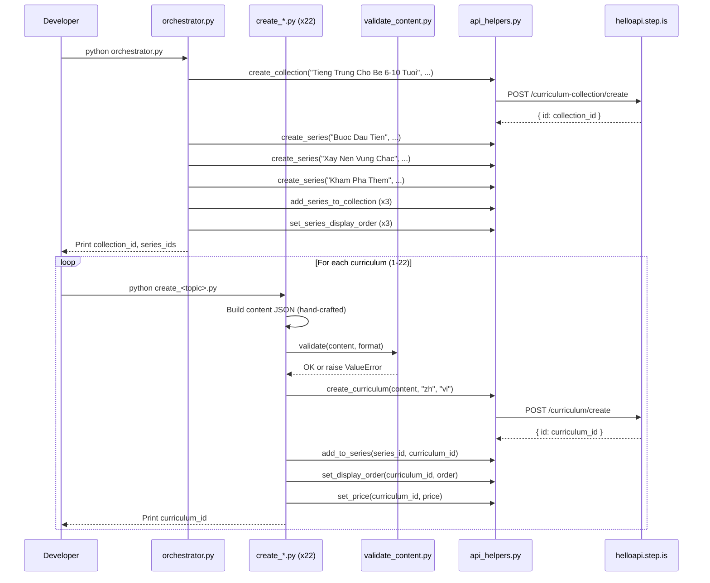

# Design Document: Vietnamese-Chinese Children's Curriculum

## Overview

This design covers the creation of 22 Chinese-learning curriculums for Vietnamese children aged 6-10, organized into 1 NEW collection and 3 series. The system consists of:

- **22 standalone Python scripts** — one per curriculum, each containing hand-crafted child-friendly content
- **1 orchestrator script** — creates the collection, 3 series, wires them together, sets display orders and prices
- **1 content validator module** — validates curriculum JSON against corruption rules before upload
- **Shared API helpers** — reuses the existing root-level `api_helpers.py` module for all REST API calls

The language pair is `userLanguage="vi"` (Vietnamese speakers), `language="zh"` (learning Chinese). All marketing text (titles, descriptions, previews) is in Vietnamese, targeting parents. All learner-facing content uses a warm, playful, encouraging tone appropriate for children aged 6-10, with Chinese words introduced as character + pinyin + Vietnamese meaning.

### Key Design Decisions

1. **Reuse existing `api_helpers.py`** — the root-level module already wraps all needed API endpoints (create_curriculum, create_collection, create_series, add_to_series, add_series_to_collection, set_display_order, set_series_display_order, set_price) with Firebase auth, error handling, and logging.

2. **Children-specific validator** — a new `vi-zh-children-curriculum/validate_content.py` is needed because children's curriculums have different session counts (1 or 4), different vocab counts (3-5, 8-10, or 10-12), and explicitly forbid `writingParagraph` and `vocabLevel3`. The validator supports three formats via a `format` parameter.

3. **Orchestrator needed** — this is the first vi-zh children's batch, so a new collection "Tieng Trung Cho Be 6-10 Tuoi" and 3 series must be created before any curriculums can be added.

4. **Chinese-specific adaptations** — vocabList uses lowercase ASCII pinyin without tone marks (e.g., "ni hao", "xie xie"). Reading passages are in Chinese characters only (no pinyin in reading text). introAudio scripts are primarily Vietnamese with Chinese words introduced as character + pinyin + Vietnamese meaning.

5. **Three curriculum format templates** — beginner mini (1 session, 3-5 words), beginner short (4 sessions, 8-10 words), and preintermediate short (4 sessions, 10-12 words) each have distinct activity sequences.

6. **No tone_assigner module** — with 22 curriculums across 3 series, tone assignments are pre-planned in Requirement 17 and hard-coded directly in each script.

## Architecture

```mermaid
graph TD
    subgraph "vi-zh-children-curriculum/"
        ORCH[orchestrator.py] --> API
        VAL[validate_content.py]
        
        C1[create_colors.py] --> VAL
        C1 --> API
        C2[create_numbers.py] --> VAL
        C2 --> API
        C3[create_family.py] --> VAL
        C3 --> API
        C4[create_fruits.py] --> VAL
        C4 --> API
        C5[create_pets.py] --> VAL
        C5 --> API
        C6[create_greetings.py] --> VAL
        C6 --> API
        C7[create_school.py] --> VAL
        C7 --> API
        C8[create_chinese_food.py] --> VAL
        C8 --> API
        C9[create_playground.py] --> VAL
        C9 --> API
        C10[create_body.py] --> VAL
        C10 --> API
        C11[create_weather.py] --> VAL
        C11 --> API
        C12[create_wardrobe.py] --> VAL
        C12 --> API
        C13[create_vehicles.py] --> VAL
        C13 --> API
        C14[create_animals.py] --> VAL
        C14 --> API
        C15[create_lunar_new_year.py] --> VAL
        C15 --> API
        C16[create_zodiac.py] --> VAL
        C16 --> API
        C17[create_nature.py] --> VAL
        C17 --> API
        C18[create_shopping.py] --> VAL
        C18 --> API
        C19[create_seasons.py] --> VAL
        C19 --> API
        C20[create_daily_routines.py] --> VAL
        C20 --> API
        C21[create_mid_autumn.py] --> VAL
        C21 --> API
        C22[create_characters.py] --> VAL
        C22 --> API
    end

    API[api_helpers.py<br/>shared, repo root]
    API --> FB[firebase_token.py]
    API --> REST[helloapi.step.is REST API]
    REST --> DB[(PostgreSQL)]
```




### Execution Flow



## Components and Interfaces

### 1. orchestrator.py

Creates the collection and 3 series, wires them together, sets display orders.

**Inputs:** None (all data hard-coded — collection/series titles, descriptions, tone assignments)

**Outputs:** Prints collection ID, 3 series IDs

**API calls:**
- `curriculum-collection/create` — 1 call
- `curriculum-series/create` — 3 calls
- `curriculum-collection/addSeriesToCollection` — 3 calls
- `curriculum-series/setDisplayOrder` — 3 calls

**Series tone assignments (hard-coded in orchestrator):**

| Entity | Tone |
|--------|------|
| Series 1: "Buoc Dau Tien" | `bold_declaration` |
| Series 2: "Xay Nen Vung Chac" | `vivid_scenario` |
| Series 3: "Kham Pha Them" | `empathetic_observation` |

### 2. validate_content.py

Children-specific content validator supporting three curriculum formats.

**Interface:**
```python
def validate(content: dict, format: str) -> None:
    """
    Validates curriculum content JSON for children's curriculums.
    
    Args:
        content: The curriculum content dict
        format: One of "beginner_mini", "beginner_short", "preintermediate_short"
    
    Raises:
        ValueError with specific violation message on any failure.
    """
```

**Format configurations:**

| Format | Sessions | Vocab Words | Forbidden Activities |
|--------|----------|-------------|---------------------|
| `beginner_mini` | 1 | 3-5 | writingParagraph, vocabLevel3, vocabLevel1, vocabLevel2 |
| `beginner_short` | 4 | 8-10 | writingParagraph, vocabLevel3 |
| `preintermediate_short` | 4 | 10-12 | writingParagraph, vocabLevel3 |

**Validation checks:**
1. Top-level structure: `title`, `description`, `preview.text`, `contentTypeTags: []`, `learningSessions`
2. Session count matches format
3. Each session has `title` and non-empty `activities` array
4. Each activity has `activityType` (not `type`), `title`, `description`, `data` object
5. Valid `activityType` values (from allowed set, excluding forbidden per format)
6. `vocabList` is array of lowercase strings, field name is `vocabList` (not `words`)
7. `viewFlashcards`/`speakFlashcards` in same session have identical `vocabList`
8. `writingSentence` has `data.vocabList`, `data.items` with `prompt` and `targetVocab`
9. No strip-keys anywhere in JSON tree
10. Total unique vocab count within expected range for format
11. No `writingParagraph` or `vocabLevel3` in any children's curriculum

### 3. Individual Curriculum Scripts (create_*.py x 22)

Each script is standalone and contains all hand-crafted content for one curriculum.

**Common interface pattern:**
```python
# create_<topic>.py
import sys
import json
import logging

sys.path.insert(0, "/home/ubuntu/nspaceresearch/design-curriculums")
sys.path.insert(0, "/home/ubuntu/nspaceresearch/design-curriculums/vi-zh-children-curriculum")
from api_helpers import (
    create_curriculum, add_to_series, set_display_order, set_price
)
from validate_content import validate

SERIES_ID = "<series_id>"  # From orchestrator output
DISPLAY_ORDER = <N>
PRICE = <9|19|49>

def build_content() -> dict:
    """Build the curriculum content dict with all hand-crafted text."""
    return {
        "title": "...",
        "description": "...",
        "preview": {"text": "..."},
        "contentTypeTags": [],
        "learningSessions": [...]
    }

def main():
    content = build_content()
    validate(content, format="beginner_mini"|"beginner_short"|"preintermediate_short")
    curriculum_id = create_curriculum(content, "zh", "vi")
    add_to_series(SERIES_ID, curriculum_id)
    set_display_order(curriculum_id, DISPLAY_ORDER)
    set_price(curriculum_id, PRICE)
    print(f"Created: {curriculum_id}")

if __name__ == "__main__":
    main()
```

**Key constraint:** All text content (introAudio scripts, reading passages, descriptions, previews, writing prompts) is hand-written per curriculum. No template functions or string interpolation for learner-facing text.

### 4. Tone Assignment Table

Pre-planned from Requirement 17. All adjacency and distribution constraints verified.

**Curriculum description tones (no adjacent duplicates within each series, no tone >30% of 22):**

| # | Curriculum | Series | Order | Format | Desc Tone | Farewell Tone |
|---|-----------|--------|-------|--------|-----------|---------------|
| 1 | The Gioi Mau Sac | Buoc Dau Tien | 1 | beginner_mini | provocative_question | introspective_guide |
| 2 | Dem Tu 1 Den 10 | Buoc Dau Tien | 2 | beginner_mini | bold_declaration | warm_accountability |
| 3 | Gia Dinh Yeu Thuong | Buoc Dau Tien | 3 | beginner_mini | vivid_scenario | team_building_energy |
| 4 | Trai Cay Ngon Lanh | Buoc Dau Tien | 4 | beginner_mini | empathetic_observation | quiet_awe |
| 5 | Ban Thu Cung | Buoc Dau Tien | 5 | beginner_mini | surprising_fact | practical_momentum |
| 6 | Chao Hoi Vui Ve | Buoc Dau Tien | 6 | beginner_mini | metaphor_led | introspective_guide |
| 7 | Mot Ngay O Truong | Xay Nen Vung Chac | 1 | beginner_short | bold_declaration | warm_accountability |
| 8 | Do An Trung Hoa | Xay Nen Vung Chac | 2 | beginner_short | vivid_scenario | team_building_energy |
| 9 | San Choi Vui Nhon | Xay Nen Vung Chac | 3 | beginner_short | provocative_question | quiet_awe |
| 10 | Co The Cua Em | Xay Nen Vung Chac | 4 | beginner_short | surprising_fact | practical_momentum |
| 11 | Thoi Tiet Hom Nay | Xay Nen Vung Chac | 5 | beginner_short | empathetic_observation | introspective_guide |
| 12 | Tu Quan Ao | Xay Nen Vung Chac | 6 | beginner_short | metaphor_led | warm_accountability |
| 13 | Xe Co Quanh Em | Xay Nen Vung Chac | 7 | beginner_short | bold_declaration | team_building_energy |
| 14 | Con Vat Dang Yeu | Xay Nen Vung Chac | 8 | beginner_short | vivid_scenario | quiet_awe |
| 15 | Tet Nguyen Dan | Kham Pha Them | 1 | preintermediate_short | surprising_fact | practical_momentum |
| 16 | Muoi Hai Con Giap | Kham Pha Them | 2 | preintermediate_short | metaphor_led | introspective_guide |
| 17 | Kham Pha Thien Nhien | Kham Pha Them | 3 | preintermediate_short | empathetic_observation | warm_accountability |
| 18 | Di Cho Cung Me | Kham Pha Them | 4 | preintermediate_short | provocative_question | team_building_energy |
| 19 | Bon Mua Trong Nam | Kham Pha Them | 5 | preintermediate_short | bold_declaration | quiet_awe |
| 20 | Sinh Hoat Hang Ngay | Kham Pha Them | 6 | preintermediate_short | vivid_scenario | practical_momentum |
| 21 | Le Hoi Trung Thu | Kham Pha Them | 7 | preintermediate_short | surprising_fact | introspective_guide |
| 22 | Net But Dau Tien | Kham Pha Them | 8 | preintermediate_short | metaphor_led | warm_accountability |

**Tone distribution verification (22 curriculums):**
- provocative_question: 3 (14%) 
- bold_declaration: 4 (18%)
- vivid_scenario: 4 (18%)
- empathetic_observation: 3 (14%)
- surprising_fact: 4 (18%)
- metaphor_led: 4 (18%)
- Max = 4/22 = 18%, all well under 30% cap

**No adjacent description tone duplicates:**
- Series 1: provocative -> bold -> vivid -> empathetic -> surprising -> metaphor (all different)
- Series 2: bold -> vivid -> provocative -> surprising -> empathetic -> metaphor -> bold -> vivid (all adjacent pairs different)
- Series 3: surprising -> metaphor -> empathetic -> provocative -> bold -> vivid -> surprising -> metaphor (all adjacent pairs different)

**Farewell tone distribution (22 curriculums):**
- introspective_guide: 5 (23%)
- warm_accountability: 5 (23%)
- team_building_energy: 4 (18%)
- quiet_awe: 4 (18%)
- practical_momentum: 4 (18%)
- Evenly distributed (4-5 each)

**No adjacent farewell tone duplicates:**
- Series 1: introspective -> warm -> team -> quiet -> practical -> introspective (all adjacent pairs different)
- Series 2: warm -> team -> quiet -> practical -> introspective -> warm -> team -> quiet (all adjacent pairs different)
- Series 3: practical -> introspective -> warm -> team -> quiet -> practical -> introspective -> warm (all adjacent pairs different)

### 5. Activity Templates

#### Beginner Mini (1 session, 3-5 words, price 9)

```
Session 1:
  1. introAudio — welcome + teach all words with characters, pinyin, Vietnamese meaning (200-350 words)
  2. viewFlashcards — all words
  3. speakFlashcards — all words
  4. reading — short Chinese passage (30-50 characters, Chinese characters only)
  5. speakReading
  6. readAlong
  7. introAudio — farewell with vocab review and praise (200-400 words)
```

#### Beginner Short (4 sessions, 8-10 words in 2 groups, price 19)

```
Session 1 (Group 1):
  1. introAudio — welcome + teach group 1 words (characters + pinyin + Vietnamese meaning)
  2. viewFlashcards (group 1)
  3. speakFlashcards (group 1)
  4. vocabLevel1 (group 1)
  5. reading — Chinese passage using group 1 words (50-70 characters)
  6. readAlong
  7. introAudio — session wrap-up

Session 2 (Group 2):
  1. introAudio — recap group 1 + teach group 2 words
  2. viewFlashcards (group 2)
  3. speakFlashcards (group 2)
  4. vocabLevel1 (group 2)
  5. reading — Chinese passage using group 2 words (50-70 characters)
  6. readAlong
  7. introAudio — session wrap-up

Session 3 (Review):
  1. introAudio — review intro
  2. viewFlashcards (all words)
  3. speakFlashcards (all words)
  4. vocabLevel1 (all words)
  5. vocabLevel2 (all words)
  6. writingSentence (3-4 items)
  7. introAudio — review wrap-up

Session 4 (Final):
  1. introAudio — final reading intro
  2. reading — combined Chinese passage (80-110 characters)
  3. speakReading
  4. readAlong
  5. writingSentence (2-3 items)
  6. introAudio — farewell with full vocab review and celebration
```

#### Preintermediate Short (4 sessions, 10-12 words in 2-3 groups, price 49)

```
Session 1 (Group 1):
  1. introAudio — welcome + teach group 1 words (characters + pinyin + Vietnamese meaning)
  2. viewFlashcards (group 1)
  3. speakFlashcards (group 1)
  4. vocabLevel1 (group 1)
  5. vocabLevel2 (group 1)
  6. reading — Chinese passage using group 1 words (70-90 characters)
  7. speakReading
  8. readAlong
  9. introAudio — session wrap-up

Session 2 (Group 2):
  1. introAudio — recap group 1 + teach group 2 words
  2. viewFlashcards (group 2)
  3. speakFlashcards (group 2)
  4. vocabLevel1 (group 2)
  5. vocabLevel2 (group 2)
  6. reading — Chinese passage using group 2 words (70-90 characters)
  7. speakReading
  8. readAlong
  9. introAudio — session wrap-up

Session 3 (Review):
  1. introAudio — review intro
  2. viewFlashcards (all words)
  3. speakFlashcards (all words)
  4. vocabLevel1 (all words)
  5. vocabLevel2 (all words)
  6. writingSentence (4-5 items)
  7. introAudio — review wrap-up

Session 4 (Final):
  1. introAudio — final reading intro
  2. reading — combined Chinese passage (120-160 characters)
  3. speakReading
  4. readAlong
  5. writingSentence (3-4 items)
  6. introAudio — farewell with full vocab review and celebration
```

## Data Models

### Curriculum Content JSON Structure

```json
{
  "title": "The Gioi Mau Sac",
  "description": "Multi-paragraph Vietnamese persuasive copy for parents...",
  "preview": {
    "text": "Vietnamese preview text (~100-150 words)..."
  },
  "contentTypeTags": [],
  "learningSessions": [
    {
      "title": "Phan 1",
      "activities": [
        {
          "activityType": "introAudio",
          "title": "Chao mung be den voi The Gioi Mau Sac",
          "description": "Gioi thieu bai hoc ve mau sac bang tieng Trung",
          "data": {
            "text": "Xin chao cac be! Hom nay chung ta se hoc ve mau sac bang tieng Trung ne! Tu dau tien la 红 — doc la 'hong', thanh 2 nhe — nghia la mau do..."
          }
        },
        {
          "activityType": "viewFlashcards",
          "title": "Flashcards: Mau sac",
          "description": "Hoc 5 tu: hong (red), lan (blue), lv (green), huang (yellow), bai (white)",
          "data": {
            "vocabList": ["hong", "lan", "lv", "huang", "bai"]
          }
        },
        {
          "activityType": "speakFlashcards",
          "title": "Flashcards: Mau sac",
          "description": "Hoc 5 tu: hong (red), lan (blue), lv (green), huang (yellow), bai (white)",
          "data": {
            "vocabList": ["hong", "lan", "lv", "huang", "bai"]
          }
        },
        {
          "activityType": "reading",
          "title": "Doc: Mau sac quanh em",
          "description": "Doc doan van tieng Trung ve mau sac",
          "data": {
            "text": "花是红色的。天空是蓝色的。草是绿色的。太阳是黄色的。云是白色的。",
            "vocabList": ["hong", "lan", "lv", "huang", "bai"]
          }
        },
        {
          "activityType": "speakReading",
          "title": "Doc: Mau sac quanh em",
          "description": "Doc doan van tieng Trung ve mau sac",
          "data": {
            "text": "花是红色的。天空是蓝色的。草是绿色的。太阳是黄色的。云是白色的。"
          }
        },
        {
          "activityType": "readAlong",
          "title": "Nghe: Mau sac quanh em",
          "description": "Nghe doan van vua doc va theo doi.",
          "data": {
            "text": "花是红色的。天空是蓝色的。草是绿色的。太阳是黄色的。云是白色的。"
          }
        },
        {
          "activityType": "introAudio",
          "title": "Tam biet va on tap",
          "description": "On lai tu vung va khen ngoi be",
          "data": {
            "text": "Cac be oi, hom nay chung ta da hoc duoc 5 mau sac bang tieng Trung roi ne!..."
          }
        }
      ]
    }
  ]
}
```

### writingSentence Item Structure (for short/preintermediate)

```json
{
  "activityType": "writingSentence",
  "title": "Viet: Truong hoc",
  "description": "Viet cau tieng Trung ve truong hoc",
  "data": {
    "vocabList": ["laoshi", "tongxue", "shu", "bi", "zhuozi"],
    "items": [
      {
        "prompt": "Viet mot cau tieng Trung dung tu '老师' (laoshi). Vi du: 老师好！(Chao thay/co!) — doc la 'laoshi hao'. Be hay thay '好' bang mot tu khac nhe!",
        "targetVocab": "laoshi"
      },
      {
        "prompt": "Viet mot cau tieng Trung dung tu '书' (shu). Vi du: 我有一本书。(Toi co mot quyen sach.) — doc la 'wo you yi ben shu'. Be hay thay '一本' bang mot so khac nhe!",
        "targetVocab": "shu"
      }
    ]
  }
}
```

### API Call Parameters

| API Endpoint | Key Parameters |
|---|---|
| `curriculum/create` | `firebaseIdToken`, `language: "zh"`, `userLanguage: "vi"`, `content: JSON.stringify(content)` |
| `curriculum-series/addCurriculum` | `firebaseIdToken`, `curriculumSeriesId`, `curriculumId` |
| `curriculum/setDisplayOrder` | `firebaseIdToken`, `id`, `displayOrder` |
| `curriculum/setPrice` | `firebaseIdToken`, `id`, `price` |
| `curriculum-collection/create` | `firebaseIdToken`, `title`, `description` |
| `curriculum-series/create` | `firebaseIdToken`, `title`, `description` |
| `curriculum-collection/addSeriesToCollection` | `firebaseIdToken`, `curriculumCollectionId`, `curriculumSeriesId` |
| `curriculum-series/setDisplayOrder` | `firebaseIdToken`, `id`, `displayOrder` |

### Vocabulary Lists (All 22 Curriculums)

| # | Curriculum | vocabList | Count |
|---|---|---|---|
| 1 | The Gioi Mau Sac | hong, lan, lv, huang, bai | 5 |
| 2 | Dem Tu 1 Den 10 | yi, er, san, si, wu | 5 |
| 3 | Gia Dinh Yeu Thuong | mama, baba, gege, jiejie, didi | 5 |
| 4 | Trai Cay Ngon Lanh | pingguo, xiangjiao, xigua, putao, chengzi | 5 |
| 5 | Ban Thu Cung | xiao gou, mao, yu, niao, tuzi | 5 |
| 6 | Chao Hoi Vui Ve | ni hao, xie xie, zai jian, dui bu qi, mei guan xi | 5 |
| 7 | Mot Ngay O Truong | laoshi, tongxue, shu, bi, zhuozi, shang ke, xia ke, zuoye, jiaoshi, shubao | 10 |
| 8 | Do An Trung Hoa | mifan, miantiao, jiaozi, baozi, tang, cha, kuaizi, hao chi, e, bao | 10 |
| 9 | San Choi Vui Nhon | pao, tiao, wan, xiao, chang ge, hua hua, pengyou, kai xin, yi qi, you xi | 10 |
| 10 | Co The Cua Em | tou, shou, jiao, yanjing, erduo, zuiba, bizi, duzi, toufa, yachi | 10 |
| 11 | Thoi Tiet Hom Nay | taiyang, xia yu, gua feng, leng, re, xue, yun, tianqi, nuanhuo, liangkuai | 10 |
| 12 | Tu Quan Ao | yifu, kuzi, qunzi, xiezi, maozi, wazi, waitao, chuan, piaoliang, xin | 10 |
| 13 | Xe Co Quanh Em | qiche, gonggong qiche, huoche, feiji, zixingche, xiao chuan, ditie, kuai, man, zuo | 10 |
| 14 | Con Vat Dang Yeu | daxiang, xiongmao, laohu, changjinglu, qi e, shizi, hema, eyu, daishu, kongque | 10 |
| 15 | Tet Nguyen Dan | chun jie, hong bao, bian pao, deng long, bai nian, tuan yuan, nian ye fan, wu long, fu, chun lian, ya sui qian, fang jia | 12 |
| 16 | Muoi Hai Con Giap | lao shu, niu, hu, tu, long, she, ma, yang, hou, ji, gou, zhu | 12 |
| 17 | Kham Pha Thien Nhien | shan, he, da shu, hua, cao, tiankong, xingxing, yueliang, hai, feng, yezi, zhongzi | 12 |
| 18 | Di Cho Cung Me | mai3, mai4, qian, duo shao qian, gui, pian yi, shui guo, shu cai, chao shi, fu qian, zhao qian, dai zi | 12 |
| 19 | Bon Mua Trong Nam | chun tian, xia tian, qiu tian, dong tian, you yong, hua xue, fang feng zheng, shang hua, luo ye, dui xue ren, shu jia, han jia | 12 |
| 20 | Sinh Hoat Hang Ngay | qi chuang, shua ya, xi lian, chi zao fan, shang xue, hui jia, zuo zuo ye, xi zao, shui jiao, kan shu, kan dian shi, zao shang hao | 12 |
| 21 | Le Hoi Trung Thu | zhong qiu jie, yue bing, shang yue, chang e, yu tu, jia ren, hua deng, cai mi, yuan, si nian, gu shi, kuai le | 12 |
| 22 | Net But Dau Tien | bi hua, heng, shu bi, pie, na, dian, xie zi, han zi, lian xi, ben zi, mao bi, mo | 12 |

**Overlap verification:** Zero overlap between all 22 vocabList arrays (each curriculum uses unique pinyin entries).


## Correctness Properties

*A property is a characteristic or behavior that should hold true across all valid executions of a system — essentially, a formal statement about what the system should do. Properties serve as the bridge between human-readable specifications and machine-verifiable correctness guarantees.*

The content validator (`validate_content.py`) is the primary component amenable to property-based testing. It is a pure function: takes a content dict and format string, returns None or raises ValueError. The input space is large (arbitrary JSON structures), and universal properties hold across all valid/invalid inputs.

The curriculum creation scripts, orchestrator, and API interactions are integration-level concerns tested via database verification queries after execution.

### Property 1: Valid content passes validation

*For any* well-formed curriculum content dict that matches its declared format (correct session count, vocab count within range, all required fields present, no forbidden activities, no strip keys, contentTypeTags: []), calling `validate(content, format)` SHALL return without raising an exception.

**Validates: Requirements 1.3, 1.4, 1.5, 1.6, 10.1, 10.2, 10.3, 10.4**

### Property 2: Forbidden activities are rejected per format

*For any* children's curriculum content and any format, if a `writingParagraph` or `vocabLevel3` activity is injected into any session, `validate()` SHALL raise a ValueError. Additionally, for `beginner_mini` format, if a `vocabLevel1` or `vocabLevel2` activity is injected, `validate()` SHALL raise a ValueError.

**Validates: Requirements 3.4, 3.5, 3.6, 10.9**

### Property 3: Strip keys are rejected anywhere in the JSON tree

*For any* curriculum content dict and any strip key (mp3Url, illustrationSet, chapterBookmarks, segments, whiteboardItems, userReadingId, lessonUniqueId, curriculumTags, taskId, imageId), if that key is injected at any depth in the JSON tree, `validate()` SHALL raise a ValueError mentioning the strip key.

**Validates: Requirements 1.7, 10.8**

### Property 4: Activities missing required fields are rejected

*For any* activity in any curriculum content, if any of the required fields (`activityType`, `title`, `description`, `data`) is missing or if `data` is not a dict, `validate()` SHALL raise a ValueError identifying the missing field.

**Validates: Requirements 9.1, 9.5, 10.3**

### Property 5: Invalid activityType values are rejected

*For any* activity with an `activityType` value not in the valid set (introAudio, viewFlashcards, speakFlashcards, vocabLevel1, vocabLevel2, reading, speakReading, readAlong, writingSentence), `validate()` SHALL raise a ValueError.

**Validates: Requirements 9.2, 10.4**

### Property 6: vocabList format is enforced

*For any* vocab activity (viewFlashcards, speakFlashcards, vocabLevel1, vocabLevel2), if `data.vocabList` contains non-lowercase strings, is not an array, is empty, or uses the field name `words` instead of `vocabList`, `validate()` SHALL raise a ValueError.

**Validates: Requirements 9.3, 10.5**

### Property 7: Flashcard vocabList consistency within sessions

*For any* session containing both `viewFlashcards` and `speakFlashcards` activities, if their `data.vocabList` arrays differ, `validate()` SHALL raise a ValueError.

**Validates: Requirements 9.4, 10.6**

### Property 8: writingSentence structure is enforced

*For any* `writingSentence` activity, if `data.vocabList` is missing, `data.items` is missing or empty, or any item lacks a non-empty `prompt` or `targetVocab`, `validate()` SHALL raise a ValueError.

**Validates: Requirements 9.6, 10.7**

## Error Handling

### Validator Errors

The `validate_content.py` module raises `ValueError` with a specific message identifying:
- The exact rule violated
- The location in the JSON tree (e.g., "Session 2, Activity 3")
- The expected vs. actual value

Each curriculum script calls `validate()` before any API call. If validation fails, the script aborts with the error message — no partial upload occurs.

### API Call Errors

Each curriculum script follows this error handling pattern:

1. **Validation failure** — Script aborts immediately, prints the violation. No API calls made.
2. **`curriculum/create` failure** — Script logs the error with curriculum title and exits.
3. **`add_to_series` failure** — Curriculum exists but is orphaned. Script logs the error. Developer must manually add to series or delete the curriculum.
4. **`set_display_order` failure** — Curriculum exists in series but without explicit order. Script logs the error. Developer must manually set order.
5. **`set_price` failure** — Curriculum exists with default price. Script logs the error. Developer must manually set price.

The orchestrator follows the same pattern:
1. **`create_collection` failure** — Abort. Nothing created.
2. **`create_series` failure** — Log error, continue with remaining series. Developer must manually create the failed series.
3. **`add_series_to_collection` failure** — Series exists but is orphaned. Log error, continue.
4. **`set_series_display_order` failure** — Log error, continue. Developer must manually set order.

### Duplicate Handling

After each curriculum creation, the script logs the curriculum ID. If a script is accidentally run twice, the developer runs the duplicate check query:

```sql
SELECT id, content->>'title' as title, created_at FROM curriculum
WHERE content->>'title' = '<title>'
AND uid = 'zs5AMpVfqkcfDf8CJ9qrXdH58d73'
AND uid NOT LIKE '%_deleted'
ORDER BY created_at;
```

Keep the earliest, delete extras (remove from series first, then delete curriculum).

## Testing Strategy

### Property-Based Tests (validate_content.py)

**Library:** [Hypothesis](https://hypothesis.readthedocs.io/) (Python PBT library)

**Configuration:** Minimum 100 iterations per property test.

**Tag format:** Each test is tagged with a comment: `# Feature: vi-zh-children-curriculum, Property N: <property_text>`

The 8 correctness properties above are implemented as Hypothesis property tests in a `test_validate_content.py` file. Each property test generates random curriculum content structures using Hypothesis strategies and verifies the validator's behavior.

**Generator strategies needed:**
- `valid_curriculum(format)` — generates a structurally valid curriculum content dict for the given format
- `random_activity(activity_type)` — generates a valid activity of the given type
- `random_vocab_list(n)` — generates a list of n random lowercase pinyin-style strings
- `random_strip_key()` — picks a random strip key from the set
- `random_json_path()` — picks a random location in a content dict to inject a key

### Example-Based Tests

- Verify no vocabulary overlap across the 22 curriculum scripts (Req 2.3)
- Verify tone assignment table has no adjacent duplicates within each series (Req 17.3)
- Verify no tone exceeds 30% of 22 descriptions (Req 17.4)
- Verify correct activity sequence templates for each format (Req 4.1, 4.2, 4.3)

### Integration Verification (Post-Execution)

After all scripts run, verify via SQL queries:

```sql
-- Count all vi-zh children's curriculums (expect 22)
SELECT COUNT(*) FROM curriculum
WHERE id IN (<list of 22 IDs>);

-- Verify language pair
SELECT id, content->>'title' as title, language, user_language
FROM curriculum WHERE id IN (<list of 22 IDs>);

-- Verify prices (9 for mini, 19 for short, 49 for preintermediate)
SELECT id, content->>'title' as title, price
FROM curriculum WHERE id IN (<list of 22 IDs>)
ORDER BY price, display_order;

-- Verify series membership and display orders
SELECT cs.id as series_id, cs.title as series_title,
       c.id as curriculum_id, c.content->>'title' as curriculum_title,
       c.display_order, c.price
FROM curriculum_series cs
JOIN curriculum_series_items csi ON cs.id = csi.curriculum_series_id
JOIN curriculum c ON csi.curriculum_id = c.id
WHERE cs.id IN (<series_1_id>, <series_2_id>, <series_3_id>)
ORDER BY cs.display_order, c.display_order;

-- Verify no duplicates
SELECT content->>'title' as title, COUNT(*)
FROM curriculum
WHERE uid = 'zs5AMpVfqkcfDf8CJ9qrXdH58d73'
AND content->>'title' IN (<list of 22 titles>)
AND uid NOT LIKE '%_deleted'
GROUP BY content->>'title'
HAVING COUNT(*) > 1;
```

### Smoke Tests

- Verify each script file exists in `vi-zh-children-curriculum/`
- Verify no script calls `setPublic` (Req 12.1)
- Verify orchestrator creates exactly 1 collection and 3 series
- Verify validator file exists at `vi-zh-children-curriculum/validate_content.py`