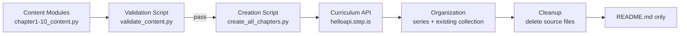

# Design Document: vi-zh Fiction Novel — New Genre (Mystery/Detective)

## Overview

This feature creates a second 10-chapter Chinese fiction novel curriculum series for Vietnamese-Chinese (vi-zh) preintermediate learners. The novel is an original mystery/detective story written in simplified Chinese at HSK2-3 level — entirely different from the existing culinary/slice-of-life novel "味道的记忆 (Ký Ức Hương Vị)" (series `uq7ezeuh`).

The series is added to the **existing** vi-zh Fiction collection "Truyện (小说)" (ID: `7nf5wi1d`). No new collection is created.

The pipeline is:
1. Write an original simplified Chinese mystery novel (10 chapters, HSK2-3 vocabulary)
2. Structure each chapter as a Python content module exporting a curriculum dict
3. Validate all content against correctness properties
4. Upload via a creation script calling the curriculum API
5. Create a new series, add all curriculums, attach to the existing collection, set display orders
6. Delete source materials, retain README

The session structure (viewFlashcards + reading + readAlong only) matches the first vi-zh novel series exactly. Vocabulary words are familiar HSK2-3 refreshers — the focus is immersive reading practice, not new vocabulary acquisition.

## Architecture



### Pipeline Steps

1. **Content authoring**: Each `chapterN_content.py` defines a `get_content()` function returning the full curriculum dict
2. **Validation**: `validate_content.py` imports all 10 modules, runs all correctness checks, reports violations
3. **Upload**: `create_all_chapters.py` imports each module, calls `curriculum/create` for each
4. **Organization**: Same script creates the series, adds curriculums, attaches to existing collection `7nf5wi1d`, sets display orders 1-10
5. **Cleanup**: Source `.py` files are deleted; `README.md` documents how to recover content from DB

### Key Design Decisions

1. **Single creation script**: One `create_all_chapters.py` handles all uploads and series organization (same pattern as the first vi-zh novel). Simpler than per-chapter scripts.

2. **Existing collection reuse**: Unlike the first vi-zh novel which created the "Truyện (小说)" collection, this series adds to it. The script checks at runtime that collection `7nf5wi1d` is accessible before proceeding — no collection creation logic needed.

3. **Descriptive folder name**: The novel folder uses a descriptive name like `vi-zh-mystery-novel` (not generic `vi-zh-novel-2`), clearly indicating language pair and genre.

4. **Separate content modules from creation script**: Each `chapterN_content.py` exports a pure data dict. The creation script handles API calls. This separation enables validation before upload.

5. **No hardcoded IDs**: Curriculum IDs come from API responses. The collection ID `7nf5wi1d` is the only pre-known ID (verified at runtime).

## Components and Interfaces

### Component 1: Content Modules (`chapterN_content.py`, N=1..10)

Each module exports one function:

```python
def get_content() -> dict:
    """Return the complete curriculum dict for chapter N."""
```

The returned dict contains:
- Bilingual title (Vietnamese + Chinese)
- Vietnamese description and preview (~150 words)
- 15 HSK2-3 vocabulary words (Chinese characters in `vocabList` arrays)
- 5 reading passages (~100-150 Chinese characters each)
- 6 learning sessions with correctly ordered activities

### Component 2: Validation Script (`validate_content.py`)

Imports all 10 content modules and checks all correctness properties:

```python
def validate_chapter(content: dict, chapter_num: int) -> list[str]:
    """Returns list of error messages. Empty = valid."""
```

Checks: session count, activity types/order, vocab counts (3 per session, 15 total), reading passage presence/length, session 6 concatenation, readAlong==reading text, strip-keys absence, cross-chapter vocab overlap ≤ 2, bilingual title format, preview word count, audioSpeed values.

### Component 3: Creation Script (`create_all_chapters.py`)

Single script that:
1. Authenticates via `firebase_token.get_firebase_id_token(UID)`
2. Imports and uploads each chapter via `curriculum/create`
3. Creates series via `curriculum-series/create` with bilingual vi-zh title
4. Adds each curriculum to series via `curriculum-series/addCurriculum`
5. Checks that existing collection `7nf5wi1d` is accessible via `curriculum-collection/listAll`
6. Adds series to collection via `curriculum-collection/addSeriesToCollection`
7. Sets display orders 1-10 via `curriculum/setDisplayOrder`

```python
import sys, json, requests
sys.path.insert(0, "/home/ubuntu/nspaceresearch/design-curriculums")
from firebase_token import get_firebase_id_token

UID = "zs5AMpVfqkcfDf8CJ9qrXdH58d73"
API_BASE = "https://helloapi.step.is"
COLLECTION_ID = "7nf5wi1d"  # Existing "Truyện (小说)" collection
```

### Component 4: README (`README.md`)

Post-cleanup documentation containing:
- How content was created
- Series ID, Collection ID (`7nf5wi1d`)
- SQL queries to find curriculums
- Novel summary for recreation context

### Interface: Curriculum API

All calls go to `https://helloapi.step.is/` with `firebaseIdToken` in the request body.

| Endpoint | Purpose |
|---|---|
| `curriculum/create` | Upload a chapter curriculum |
| `curriculum/setDisplayOrder` | Set chapter order within series |
| `curriculum-series/create` | Create the novel series |
| `curriculum-series/addCurriculum` | Add chapter to series |
| `curriculum-collection/listAll` | Verify existing collection is accessible |
| `curriculum-collection/addSeriesToCollection` | Attach series to existing collection |

## Data Models

### Curriculum Content Structure

```json
{
  "title": "[Vietnamese Novel Title] ([Chinese Novel Title]) — Chương 1: [Vi Chapter Title] ([Zh Chapter Title])",
  "description": "Vietnamese description of chapter content and learning objectives",
  "preview": {
    "text": "Vietnamese preview text (~150 words) with vivid hooks..."
  },
  "learningSessions": [
    {
      "title": "Phần 1",
      "activities": [
        {
          "type": "viewFlashcards",
          "title": "Flashcards: [topic]",
          "description": "Học 3 từ: 词1, 词2, 词3",
          "vocabList": ["词1", "词2", "词3"],
          "audioSpeed": -0.2
        },
        {
          "type": "reading",
          "title": "Đọc: [topic]",
          "description": "First ~80 characters of the reading text...",
          "text": "Chinese reading passage (~100-150 chars)...",
          "audioSpeed": -0.2
        },
        {
          "type": "readAlong",
          "title": "Nghe: [topic]",
          "description": "Nghe đoạn văn vừa đọc và theo dõi.",
          "text": "Same Chinese reading passage as above..."
        }
      ]
    }
  ]
}
```

### Session Structure Summary

| Session | Activities | Vocab Count | Reading Content |
|---------|-----------|-------------|-----------------|
| 1-5 | viewFlashcards → reading → readAlong | 3 words each | ~100-150 Chinese chars passage |
| 6 (Ôn tập) | viewFlashcards → readAlong | 15 words (all) | Full chapter (all 5 passages concatenated) |

### API Request Bodies

**Create Curriculum:**
```json
{
  "firebaseIdToken": "<token>",
  "uid": "zs5AMpVfqkcfDf8CJ9qrXdH58d73",
  "language": "zh",
  "userLanguage": "vi",
  "content": "<JSON string of curriculum content>"
}
```

**Create Series:**
```json
{
  "firebaseIdToken": "<token>",
  "title": "Bilingual vi-zh series title",
  "description": "Vietnamese series description",
  "isPublic": true
}
```

**Add Curriculum to Series:**
```json
{
  "firebaseIdToken": "<token>",
  "curriculumSeriesId": "<series_id>",
  "curriculumId": "<curriculum_id>"
}
```

**Add Series to Existing Collection:**
```json
{
  "firebaseIdToken": "<token>",
  "curriculumCollectionId": "7nf5wi1d",
  "curriculumSeriesId": "<series_id>"
}
```

**Set Display Order:**
```json
{
  "firebaseIdToken": "<token>",
  "curriculumId": "<curriculum_id>",
  "displayOrder": 1
}
```

### Strip Keys (must NOT appear in content)

`mp3Url`, `illustrationSet`, `chapterBookmarks`, `segments`, `whiteboardItems`, `userReadingId`, `lessonUniqueId`, `curriculumTags`, `taskId`, `imageId`

### File Layout

```
original-novels/vi-zh-mystery-novel/
├── chapter1_content.py    # Content module for chapter 1
├── chapter2_content.py    # ...
├── ...
├── chapter10_content.py   # Content module for chapter 10
├── validate_content.py    # Validation script
├── create_all_chapters.py # Upload + series organization script
└── README.md              # Kept after cleanup
```


## Correctness Properties

*A property is a characteristic or behavior that should hold true across all valid executions of a system — essentially, a formal statement about what the system should do. Properties serve as the bridge between human-readable specifications and machine-verifiable correctness guarantees.*

### Property 1: Curriculum session structure

*For any* chapter content dict, it must contain exactly 6 learning sessions; sessions 1-5 must each have exactly 3 activities in order [viewFlashcards, reading, readAlong]; session 6 must have exactly 2 activities in order [viewFlashcards, readAlong].

**Validates: Requirements 2.1, 2.2, 2.3**

### Property 2: Activity field presence and audioSpeed

*For any* viewFlashcards activity in any chapter, it must have a `vocabList` array and `audioSpeed` equal to -0.2. *For any* reading activity in any chapter, it must have a non-empty `text` field and `audioSpeed` equal to -0.2. *For any* readAlong activity, it must have a non-empty `text` field.

**Validates: Requirements 2.4, 2.5**

### Property 3: Vocabulary count per chapter and per session

*For any* chapter, the total number of unique vocabulary words across sessions 1-5 must equal exactly 15, and each session's viewFlashcards must contain exactly 3 words.

**Validates: Requirements 1.3, 5.1, 5.3**

### Property 4: ReadAlong-Reading text equality

*For any* chapter and *for any* session 1-5, the readAlong activity's text must be identical to the reading activity's text in the same session.

**Validates: Requirements 2.6**

### Property 5: Session 6 readAlong is full chapter concatenation

*For any* chapter, session 6's readAlong text must equal the concatenation of the reading texts from sessions 1-5 (in order).

**Validates: Requirements 2.7**

### Property 6: Session 6 viewFlashcards is vocab union

*For any* chapter, session 6's viewFlashcards vocabList must contain exactly the union of all vocabList words from sessions 1-5 (all 15 words, no duplicates, no extras).

**Validates: Requirements 2.8**

### Property 7: Cross-chapter vocabulary overlap limit

*For any* pair of chapters, the intersection of their vocabulary lists must have at most 2 words.

**Validates: Requirements 1.6, 5.5**

### Property 8: Reading passage length

*For any* chapter and *for any* session 1-5, the reading passage must be between 80 and 180 Chinese characters (allowing flexibility around the 100-150 target).

**Validates: Requirements 1.9, 6.4**

### Property 9: Vocabulary words appear in reading passages

*For any* chapter and *for any* session 1-5, every word in that session's viewFlashcards vocabList must appear as a substring in the corresponding reading passage text.

**Validates: Requirements 5.4, 6.3**

### Property 10: Title format and no level descriptor

*For any* chapter N, the curriculum title must contain "Chương N:" and must NOT contain any of the strings: "preintermediate", "sơ trung cấp", "初级", "中级", "beginner", "intermediate", "advanced".

**Validates: Requirements 4.1, 4.6**

### Property 11: Preview word count and Vietnamese metadata

*For any* chapter, the preview text must exist and contain between 100 and 200 words (allowing flexibility around the ~150 target). The description must contain Vietnamese characters (diacritics).

**Validates: Requirements 4.2, 4.3**

### Property 12: No strip keys in content

*For any* chapter content dict, recursively searching the entire structure must find zero occurrences of any strip key: mp3Url, illustrationSet, chapterBookmarks, segments, whiteboardItems, userReadingId, lessonUniqueId, curriculumTags, taskId, imageId.

**Validates: Requirements 7.1**

## Error Handling

### Content Validation Errors
- `validate_content.py` collects all errors per chapter and prints a summary. It does NOT stop at the first error — all chapters are validated and all errors reported.
- Format: `FAIL [Chapter N, Session M, Activity type]: description of violation`
- Exit code 1 if any errors found, 0 if all pass.

### API Errors
- Creation script calls `resp.raise_for_status()` after each API call. HTTP errors (401, 403, 500) raise exceptions with status code and response body.
- If a creation script fails mid-way, the curriculum may or may not have been created. The organize step looks up curriculums by title, so re-running is safe.

### Collection Accessibility Check
- `create_all_chapters.py` verifies collection `7nf5wi1d` is accessible via `curriculum-collection/listAll` before adding the series. If the collection is not found, it aborts with a clear error message — it does NOT create a new collection.

### Auth Token Expiry
- Firebase ID tokens expire after 1 hour. The creation script generates a fresh token at startup. If running all 10 uploads sequentially, this should complete well within the token lifetime.

## Testing Strategy

### Validation Script as the Test Suite

Since there is no build system or test framework in this workspace, the validation script (`validate_content.py`) serves as the test suite. It implements all 12 correctness properties as programmatic checks.

### Property-Based Testing Approach

The content modules produce a fixed set of 10 curriculum dicts (not random inputs), so traditional property-based testing with random generation doesn't apply. Instead, the validation script applies each property universally across all 10 chapters — treating the 10 chapters as the input space and verifying every property holds for all of them.

Each check in the validation script is tagged with a comment referencing the design property:

```python
# Feature: vi-zh-fiction-novel-new-genre, Property 1: Curriculum session structure
def check_session_structure(content, chapter_num):
    ...
```

### Dual Testing Approach

- **Property checks** (Properties 1-12): Verified across all 10 chapters by `validate_content.py`
- **Example checks**: Title format regex match for specific chapter numbers, preview text spot checks
- **Edge cases**: Session 6 concatenation with varying passage lengths, vocab overlap at the boundary (exactly 2 shared words)

### Validation Checks Mapped to Properties

| Property | Validation Check |
|---|---|
| P1: Session structure | Count sessions, verify activity types and order |
| P2: Activity fields/audioSpeed | Check vocabList, text, audioSpeed on each activity type |
| P3: Vocab counts | Count words in each viewFlashcards (3 per session, 15 total) |
| P4: readAlong = reading | String equality check per session 1-5 |
| P5: Session 6 full text | Concatenate passages, compare to session 6 readAlong |
| P6: Session 6 vocab union | Set comparison of session 6 vocabList vs union of sessions 1-5 |
| P7: Cross-chapter overlap | Set intersection across all 45 chapter pairs (10 choose 2) |
| P8: Passage length | Count Chinese characters in range [80, 180] |
| P9: Vocab in passages | Substring search for each vocab word in its session's passage |
| P10: Title format | Regex match for "Chương N:" pattern, absence of level strings |
| P11: Preview/description | Word count in [100, 200], Vietnamese character detection |
| P12: No strip-keys | Recursive key scan against strip-keys set |

### Running Validation

```bash
cd original-novels/vi-zh-mystery-novel
python validate_content.py
```

Expected output on success:
```
Validating chapter 1... OK
...
Validating chapter 10... OK
Cross-chapter vocab check... OK
All 12 properties verified across 10 chapters. 0 violations.
```
