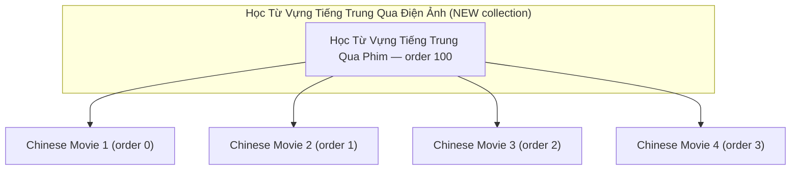
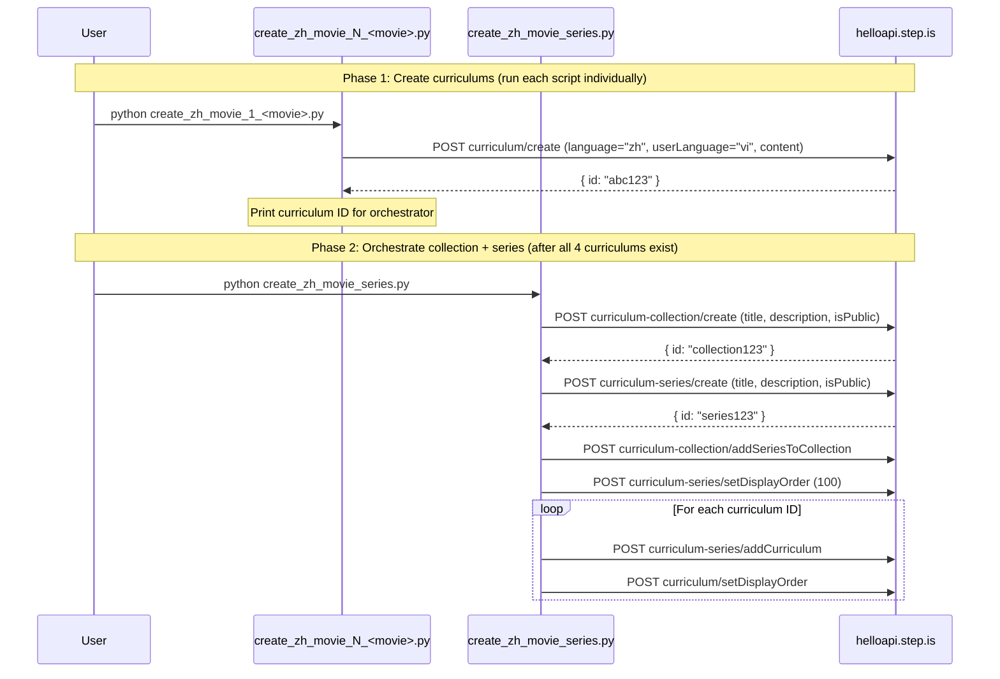

# Design Document: Vi-Zh Movie-Based Vocab Series

## Overview

This feature creates a brand new collection "Học Từ Vựng Tiếng Trung Qua Điện Ảnh (通过电影学中文词汇)" and populates it with a single series "Học Từ Vựng Tiếng Trung Qua Phim (通过电影学中文词汇)" containing 4 curriculums. Each curriculum is built around a different iconic Chinese (Mandarin) movie scene, using verbatim simplified Chinese dialogue or monologue as reading passages. Vocabulary words are Chinese words at HSK2-HSK3 level, drawn from the movie dialogue, appropriate for pre-intermediate to intermediate Vietnamese learners of Chinese.

The implementation consists of standalone Python scripts that call the helloapi REST API. The orchestrator creates a new top-level collection first, then creates the series and curriculums within it. Each curriculum script contains all hand-written learner-facing text. This is the vi-zh counterpart to the existing vi-en movie-based vocab series, following the identical 18-word / 5-session structure but adapted for Chinese movies with pinyin in teaching content and Chinese example sentences in writing prompts.

### Key Design Decisions

1. **New collection via API** — The orchestrator calls `curriculum-collection/create` to create the Chinese cinema collection, then `curriculum-series/create` for the series, then wires them together. This is a separate collection from both the existing English cinema collection and the Chinese music collection because it targets a different content type (movies vs songs) within the vi-zh language pair.
2. **One script per curriculum** — Same pattern as the vi-en movie series and vi-zh song series. Each script is ~500-800 lines with all hand-written content.
3. **One orchestrator for collection + series** — A single `create_zh_movie_series.py` handles collection creation, series creation, adding curriculums, setting display orders, and wiring the series into the collection.
4. **Chinese movie dialogue as reading passages** — Reading activities use verbatim dialogue/monologue in simplified Chinese characters sourced via web search. Sessions 1-3 use dialogue portions containing that session's vocabulary; Sessions 4-5 use the complete dialogue.
5. **youtubeUrl at top level of content JSON** — Each curriculum's content dict includes a `youtubeUrl` field alongside `title`, `description`, `preview`, and `learningSessions`.
6. **Pinyin in teaching content** — introAudio scripts include pinyin when teaching vocabulary words, and writing prompts include pinyin alongside Chinese characters. Same approach as the vi-zh song series.
7. **language="zh", userLanguage="vi"** — All curriculums use `language: "zh"` and `userLanguage: "vi"` as top-level body parameters.
8. **Session structure matches vi-en movie series exactly** — Sessions 1-3 have 12 activities, Session 4 has 4 activities, Session 5 has 5 activities. Same activity type sequences.
9. **No shared content generation** — All learner-facing text is hand-written per curriculum. Only structural helpers (strip_keys, activity schema) are shared.

## Architecture



### Execution Flow



## Components and Interfaces

### Folder Structure

```
vi-zh-movie-vocab-series/
├── create_zh_movie_1_<movie>.py       # Curriculum script for Chinese movie 1
├── create_zh_movie_2_<movie>.py       # Curriculum script for Chinese movie 2
├── create_zh_movie_3_<movie>.py       # Curriculum script for Chinese movie 3
├── create_zh_movie_4_<movie>.py       # Curriculum script for Chinese movie 4
└── create_zh_movie_series.py          # Orchestrator (collection + series + wiring)
```

After successful creation and verification, all `.py` scripts are deleted, leaving only `README.md`.


### Curriculum Script Interface

Each `create_zh_movie_N_<movie>.py` script:

1. Imports `firebase_token.get_firebase_id_token`
2. Defines `STRIP_KEYS` set and `strip()` function inline
3. Defines vocabulary lists: `W1` (6 Chinese words), `W2` (6 Chinese words), `W3` (6 Chinese words), `ALL` (18 Chinese words)
4. Defines reading passages from verbatim Chinese movie dialogue: `DIALOGUE_1` (portion for session 1), `DIALOGUE_2` (portion for session 2), `DIALOGUE_3` (portion for session 3), `FULL_DIALOGUE` (complete scene dialogue/monologue in simplified Chinese)
5. Builds `content` dict with all hand-written text including `youtubeUrl` at top level
6. Runs `validate(content)` to check structural properties before upload
7. Calls `POST curriculum/create` with `language="zh"`, `userLanguage="vi"`, `content=json.dumps(content)`
8. Prints the created curriculum ID

### Orchestrator Script Interface

`create_zh_movie_series.py`:

1. Takes 4 curriculum IDs as constants (pasted from curriculum script output)
2. Calls `POST curriculum-collection/create` with title "Học Từ Vựng Tiếng Trung Qua Điện Ảnh (通过电影学中文词汇)", persuasive Vietnamese description, `isPublic: true`
3. Calls `POST curriculum-series/create` with title "Học Từ Vựng Tiếng Trung Qua Phim (通过电影学中文词汇)", Vietnamese description (≤255 chars), `isPublic: true`
4. Calls `POST curriculum-collection/addSeriesToCollection` with the new collection ID and new series ID
5. Calls `POST curriculum-series/setDisplayOrder` with display_order 100
6. For each curriculum: calls `POST curriculum-series/addCurriculum` then `POST curriculum/setDisplayOrder` (0, 1, 2, 3)

### API Calls Used

| Endpoint | Purpose | Auth |
|---|---|---|
| `curriculum/create` | Create each curriculum | AuthGuard |
| `curriculum-collection/create` | Create the new Chinese cinema collection | SuperAuthGuard |
| `curriculum-series/create` | Create the Chinese movie series | SuperAuthGuard |
| `curriculum-collection/addSeriesToCollection` | Add series to collection | SuperAuthGuard |
| `curriculum-series/setDisplayOrder` | Set series order within collection | SuperAuthGuard |
| `curriculum-series/addCurriculum` | Add curriculum to series | SuperAuthGuard |
| `curriculum/setDisplayOrder` | Set curriculum order within series | SuperAuthGuard |

### Authentication

All scripts use the shared `firebase_token.py` helper:
```python
sys.path.insert(0, "/home/ubuntu/nspaceresearch/design-curriculums")
from firebase_token import get_firebase_id_token
UID = "zs5AMpVfqkcfDf8CJ9qrXdH58d73"
token = get_firebase_id_token(UID)
```

Token is refreshed before each API call that requires SuperAuthGuard.

## Data Models

### Curriculum Content Structure (Chinese Movie-Adapted)

```python
content = {
    "title": "Học Qua Phim: '霸王别姬' – Cảnh đối thoại giữa Điệp Y và Cúc Tiên",
    "description": "Multi-paragraph persuasive copy in Vietnamese (5-beat structure, Chinese movie-adapted)",
    "preview": {
        "text": "~150 word vivid marketing copy referencing the Chinese movie scene and its themes"
    },
    "youtubeUrl": "https://www.youtube.com/watch?v=XXXXXXXXXXX",
    "learningSessions": [
        # Session 1-3: Learning sessions (6 Chinese words each, dialogue as reading)
        {
            "title": "Buổi 1: <dialogue theme excerpt>",
            "activities": [
                # introAudio (welcome + Chinese movie scene context)
                # introAudio (vocab teaching — how each Chinese word appears in the dialogue, with pinyin)
                # viewFlashcards, speakFlashcards
                # vocabLevel1, vocabLevel2, vocabLevel3
                # introAudio (grammar/usage notes from Chinese dialogue)
                # reading (verbatim Chinese dialogue portion), speakReading, readAlong
                # writingSentence (movie-themed prompts with pinyin and Chinese examples)
            ]
        },
        # Session 4: Review (all 18 Chinese words)
        {
            "title": "Ôn tập",
            "activities": [
                # introAudio (congratulations + recap of Chinese movie scene themes)
                # viewFlashcards (ALL words)
                # vocabLevel1, vocabLevel2
            ]
        },
        # Session 5: Full dialogue reading + farewell
        {
            "title": "Đọc toàn bộ lời thoại",
            "activities": [
                # introAudio (farewell + word review with pinyin, 400-600 words)
                # reading (FULL Chinese dialogue), speakReading, readAlong
                # introAudio (warm farewell)
            ]
        }
    ]
}
```

### Session Activity Sequences (Exact)

| Session | Activity Order | Count |
|---|---|---|
| 1-3 (learning) | introAudio, introAudio, viewFlashcards, speakFlashcards, vocabLevel1, vocabLevel2, vocabLevel3, introAudio, reading, speakReading, readAlong, writingSentence | 12 |
| 4 (review) | introAudio, viewFlashcards, vocabLevel1, vocabLevel2 | 4 |
| 5 (full reading + farewell) | introAudio, reading, speakReading, readAlong, introAudio | 5 |

### Activity Data Shapes

| Activity Type | Data Fields |
|---|---|
| `introAudio` | `{ text: string, audioSpeed: 0.01 }` |
| `viewFlashcards` | `{ vocabList: string[], audioSpeed: -0.1 }` |
| `speakFlashcards` | `{ vocabList: string[], audioSpeed: -0.1 }` |
| `vocabLevel1/2/3` | `{ vocabList: string[], audioSpeed: -0.1 }` |
| `reading` | `{ text: string, audioSpeed: -0.1 }` |
| `speakReading` | `{ text: string, audioSpeed: -0.1 }` |
| `readAlong` | `{ text: string, audioSpeed: -0.1 }` |
| `writingSentence` | `{ vocabList: string[], audioSpeed: 0.01, items: WritingItem[] }` |

### WritingItem Shape (Chinese Movie-Adapted)

```python
{
    "targetVocab": "命运",
    "prompt": "Sử dụng từ '命运' (mìngyùn) để nói về [specific context related to the movie scene's themes]. Ví dụ: 每个人都有自己的命运，但我们可以选择如何面对。"
}
```

Note: Writing prompts include pinyin in parentheses after the Chinese word, and example sentences are in Chinese.

### Strip Keys Set

```python
STRIP_KEYS = {
    "mp3Url", "illustrationSet", "chapterBookmarks", "segments",
    "whiteboardItems", "userReadingId", "lessonUniqueId",
    "curriculumTags", "taskId", "imageId"
}
```

### Key Differences from Vi-En Movie Series

| Aspect | Vi-En Movie Series | Vi-Zh Movie Series |
|---|---|---|
| Language params | `language="en"`, `userLanguage="vi"` | `language="zh"`, `userLanguage="vi"` |
| Collection | "Học Từ Vựng Qua Điện Ảnh" | "Học Từ Vựng Tiếng Trung Qua Điện Ảnh (通过电影学中文词汇)" |
| Series | "Học Từ Vựng Qua Phim" | "Học Từ Vựng Tiếng Trung Qua Phim (通过电影学中文词汇)" |
| Movies | Evergreen English-language movies | Well-known Chinese (Mandarin) movies |
| Dialogue | English dialogue | Simplified Chinese dialogue |
| Vocab level | A2-B1 English | HSK2-HSK3 Chinese |
| Script naming | `create_movie_N_<movie>.py` | `create_zh_movie_N_<movie>.py` |
| Orchestrator | `create_movie_series.py` | `create_zh_movie_series.py` |
| Folder | `movie-based-vocab-series/` | `vi-zh-movie-vocab-series/` |
| introAudio vocab teaching | Word + definition + usage | Word + pinyin + definition + usage |
| Writing prompts | English example sentences | Pinyin in parentheses + Chinese example sentences |
| Curriculum titles | "Học Qua Phim: 'Movie Title' – Scene description" | "Học Qua Phim: '中文电影名' – Mô tả cảnh phim" |
| readAlong description | "Nghe lời thoại phim và theo dõi." | "Nghe lời thoại phim và theo dõi." |
| Reading passage vars | DIALOGUE_1, DIALOGUE_2, DIALOGUE_3, FULL_DIALOGUE | DIALOGUE_1, DIALOGUE_2, DIALOGUE_3, FULL_DIALOGUE |
| Session 5 title | "Đọc toàn bộ lời thoại" | "Đọc toàn bộ lời thoại" |

### Key Differences from Vi-Zh Song Series

| Aspect | Vi-Zh Song Series | Vi-Zh Movie Series |
|---|---|---|
| Collection | "Học Từ Vựng Tiếng Trung Qua Âm Nhạc (通过音乐学中文词汇)" | "Học Từ Vựng Tiếng Trung Qua Điện Ảnh (通过电影学中文词汇)" |
| Series | "Học Từ Vựng Tiếng Trung Qua Bài Hát (通过歌曲学中文词汇)" | "Học Từ Vựng Tiếng Trung Qua Phim (通过电影学中文词汇)" |
| Content source | Chinese song lyrics | Chinese movie dialogue/monologue |
| Reading passage vars | LYRICS_1, LYRICS_2, LYRICS_3, FULL_LYRICS | DIALOGUE_1, DIALOGUE_2, DIALOGUE_3, FULL_DIALOGUE |
| Script naming | `create_zh_song_N_<artist>.py` | `create_zh_movie_N_<movie>.py` |
| Orchestrator | `create_zh_song_series.py` | `create_zh_movie_series.py` |
| Folder | `vi-zh-song-vocab-series/` | `vi-zh-movie-vocab-series/` |
| Curriculum titles | "Học Qua Bài Hát: '中文歌名' – 歌手名" | "Học Qua Phim: '中文电影名' – Mô tả cảnh phim" |
| readAlong description | "Nghe bài hát và theo dõi." | "Nghe lời thoại phim và theo dõi." |
| Session 5 title | "Đọc toàn bộ lời bài hát" | "Đọc toàn bộ lời thoại" |
| introAudio context | References song title, artist, lyrical context | References movie title, scene context, dramatic context |
| Writing prompts | Song-themed contexts (emotions, narrative) | Movie scene-themed contexts (drama, characters, themes) |
| Language params | `language="zh"`, `userLanguage="vi"` | `language="zh"`, `userLanguage="vi"` (same) |
| Pinyin in teaching | Yes | Yes (same) |


## Correctness Properties

*A property is a characteristic or behavior that should hold true across all valid executions of a system — essentially, a formal statement about what the system should do. Properties serve as the bridge between human-readable specifications and machine-verifiable correctness guarantees.*

### Property 1: Curriculum structural completeness

*For any* curriculum content dict, it SHALL contain exactly 18 unique vocabulary words divided into 3 groups of 6 (W1, W2, W3), exactly 5 learning sessions, and the activity type sequences SHALL match: sessions 1-3 = [introAudio, introAudio, viewFlashcards, speakFlashcards, vocabLevel1, vocabLevel2, vocabLevel3, introAudio, reading, speakReading, readAlong, writingSentence] (12 activities), session 4 = [introAudio, viewFlashcards, vocabLevel1, vocabLevel2] (4 activities), session 5 = [introAudio, reading, speakReading, readAlong, introAudio] (5 activities).

**Validates: Requirements 4.1, 4.2, 4.3, 4.4, 4.5**

### Property 2: Language parameters are zh/vi

*For any* curriculum creation API call body, the fields `language` (value `"zh"`) and `userLanguage` (value `"vi"`) SHALL be present as top-level body parameters alongside `content`.

**Validates: Requirements 4.6, 4.7, 13.1**

### Property 3: No auto-generated keys in content

*For any* curriculum content dict (recursively traversing all nested dicts and lists), none of the strip keys (`mp3Url`, `illustrationSet`, `chapterBookmarks`, `segments`, `whiteboardItems`, `userReadingId`, `lessonUniqueId`, `curriculumTags`, `taskId`, `imageId`) SHALL appear as keys.

**Validates: Requirements 9.1**

### Property 4: All activities and sessions have title and description

*For any* activity in any session of any curriculum, both `title` and `description` fields SHALL exist and be non-empty strings. *For any* session object, the `title` field SHALL exist and be a non-empty string.

**Validates: Requirements 8.1, 8.7**

### Property 5: Activity title format matches activity type

*For any* activity in any curriculum: if `activityType` is `viewFlashcards`, `speakFlashcards`, `vocabLevel1`, `vocabLevel2`, or `vocabLevel3`, the title SHALL start with `"Flashcards:"`; if `activityType` is `reading` or `speakReading`, the title SHALL contain `"Đọc:"`; if `activityType` is `readAlong`, the title SHALL contain `"Nghe:"`; if `activityType` is `writingSentence`, the title SHALL contain `"Viết:"`.

**Validates: Requirements 8.2, 8.3, 8.4, 8.6**

### Property 6: Writing prompts contain target vocab and example

*For any* writingSentence item in any curriculum, the `prompt` field SHALL contain the `targetVocab` word and SHALL contain the Vietnamese example marker `"Ví dụ:"`.

**Validates: Requirements 7.1**

### Property 7: youtubeUrl present and valid format

*For any* curriculum content dict, a `youtubeUrl` field SHALL exist at the top level (alongside `title`, `description`, `preview`, `learningSessions`) and its value SHALL match the pattern `https://www.youtube.com/watch?v=` or `https://youtu.be/`.

**Validates: Requirements 3.4, 15.1, 15.2**

### Property 8: Vocabulary words appear in Chinese dialogue

*For any* curriculum, every one of the 18 Chinese vocabulary words SHALL appear in the `FULL_DIALOGUE` text (the complete Chinese movie dialogue used for reading activities).

**Validates: Requirements 5.1**

### Property 9: Session dialogue portions are substrings of full dialogue

*For any* curriculum, the reading text used in sessions 1-3 SHALL each be a non-empty substring of the `FULL_DIALOGUE` text (allowing for minor whitespace normalization).

**Validates: Requirements 3.2**

### Property 10: Curriculum title contains Chinese movie title and no difficulty descriptors

*For any* curriculum, the `title` field in the content dict SHALL contain the Chinese movie title (in Chinese characters) as a substring, and SHALL NOT contain difficulty level descriptors (e.g., "HSK3", "Intermediate", "Advanced", "Beginner").

**Validates: Requirements 14.1, 14.2**

### Property 11: Farewell introAudio contains all vocabulary words

*For any* curriculum, the farewell introAudio script in session 5 (the last introAudio activity) SHALL contain all 18 Chinese vocabulary words as substrings.

**Validates: Requirements 6.5**

### Property 12: Vocabulary flashcard lists match session word groups

*For any* curriculum, the `vocabList` in viewFlashcards/speakFlashcards/vocabLevel activities in session N (1-3) SHALL equal exactly the Nth word group (W1, W2, W3). In session 4 (review), the `vocabList` SHALL equal all 18 words.

**Validates: Requirements 4.1**

### Property 13: Curriculum display orders within series are sequential

*For any* series containing 4 curriculums, the display orders assigned to those curriculums SHALL be the sequential integers 0, 1, 2, 3.

**Validates: Requirements 10.1**

### Property 14: Series description under 255 characters

*For any* series creation call, the `description` field SHALL be a non-empty string with length ≤ 255 characters.

**Validates: Requirements 1.2**

## Error Handling

### API Call Failures

Each script calls `r.raise_for_status()` after every API call. If any call fails:
- The script prints the HTTP status code and response body
- Execution stops immediately (no partial state cleanup)
- The user must manually check what was created and retry or clean up

### Common Failure Modes

| Failure | Cause | Resolution |
|---|---|---|
| 500 on `curriculum/create` | `language`/`userLanguage` missing from top-level body | Ensure both are top-level params, not just inside content |
| 500 on `curriculum-series/create` | Description exceeds 255 chars | Shorten description |
| 500 on `curriculum-collection/create` | Title exceeds 255 chars | Shorten title |
| 401 Unauthorized | Firebase token expired | Script refreshes token before each call |
| 409 or duplicate | Collection/series/curriculum already exists | Check DB, delete duplicate, retry |
| Network timeout | API unreachable | Retry the script |

### Token Refresh Strategy

Firebase ID tokens expire after ~1 hour. For scripts making multiple sequential API calls, the token is refreshed by calling `get_firebase_id_token(UID)` before each API call rather than reusing a single token.

### Idempotency Considerations

- `curriculum/create` is NOT idempotent — running the same script twice creates duplicate curriculums
- `curriculum-collection/create` is NOT idempotent — running twice creates duplicate collections
- `curriculum-series/create` is NOT idempotent — running twice creates duplicate series
- `curriculum-series/addCurriculum` IS idempotent — adding the same curriculum twice has no effect
- `curriculum/setDisplayOrder` IS idempotent — setting the same order twice is safe
- `curriculum-collection/addSeriesToCollection` IS idempotent — adding the same series twice is safe
- If the orchestrator fails partway through, the user should check the DB state before re-running

### Orchestrator Failure Recovery

Since the orchestrator creates both the collection and series, a failure mid-way requires careful recovery:
1. If collection creation succeeds but series creation fails → note the collection ID, fix the issue, re-run with collection creation skipped (or delete the collection and re-run)
2. If series creation succeeds but addSeriesToCollection fails → note both IDs, fix the issue, manually wire them
3. If curriculum addition fails → note which curriculums were added, add the remaining ones manually

## Testing Strategy

Since this project has no test framework or CI pipeline, validation is done through structural verification of the content dicts before they are sent to the API, and post-creation verification via DB queries.

### Pre-Upload Validation (Unit-Test Equivalent)

Each curriculum script includes a `validate(content)` function that checks structural properties before making the API call:

1. Verify 18 unique vocab words across W1 + W2 + W3
2. Verify 5 sessions exist with correct activity type sequences (12, 12, 12, 4, 5)
3. Verify all activities have `title` and `description`
4. Verify no strip keys present in content (recursive check)
5. Verify `youtubeUrl` exists at top level and matches YouTube URL pattern
6. Verify all 18 Chinese vocab words appear in FULL_DIALOGUE
7. Verify session 1-3 reading texts are substrings of FULL_DIALOGUE
8. Verify writingSentence items have `targetVocab` and `prompt` with "Ví dụ:" marker
9. Verify vocabList in flashcard activities matches the correct word group
10. Verify curriculum title contains Chinese movie title (in characters)
11. Verify farewell introAudio (session 5) contains all 18 Chinese vocab words
12. Verify activity title format matches activity type (Flashcards:/Đọc:/Nghe:/Viết:)

This function runs locally before any API call is made. If validation fails, the script exits with a clear error message.

### Property-Based Testing

Since there is no test framework in this repo, property-based testing is implemented as inline assertions within the `validate(content)` function. These assertions verify the structural properties (Properties 1-14) against the content dict before upload. Each curriculum script includes the same validation logic (copied inline, since scripts are standalone and deleted after use).

**Feature: vi-zh-movie-vocab-series, Property 1**: Curriculum structural completeness — verified by checking session count, activity type sequences, and vocab word counts.
**Feature: vi-zh-movie-vocab-series, Property 2**: Language parameters — verified by checking the API call body contains `language="zh"` and `userLanguage="vi"`.
**Feature: vi-zh-movie-vocab-series, Property 3**: No strip keys — verified by recursive traversal of content dict.
**Feature: vi-zh-movie-vocab-series, Property 4**: Title/description presence — verified by iterating all activities and sessions.
**Feature: vi-zh-movie-vocab-series, Property 5**: Activity title format — verified by checking title prefixes against activity types.
**Feature: vi-zh-movie-vocab-series, Property 6**: Writing prompt format — verified by checking targetVocab and "Ví dụ:" in each prompt.
**Feature: vi-zh-movie-vocab-series, Property 7**: youtubeUrl format — verified by regex match on the URL.
**Feature: vi-zh-movie-vocab-series, Property 8**: Vocab in dialogue — verified by checking each word appears in FULL_DIALOGUE.
**Feature: vi-zh-movie-vocab-series, Property 9**: Session dialogue substrings — verified by substring check against FULL_DIALOGUE.
**Feature: vi-zh-movie-vocab-series, Property 10**: Title format — verified by checking Chinese characters present, no difficulty descriptors.
**Feature: vi-zh-movie-vocab-series, Property 11**: Farewell word review — verified by checking all 18 words in farewell introAudio text.
**Feature: vi-zh-movie-vocab-series, Property 12**: Flashcard vocab lists — verified by comparing vocabList arrays against W1/W2/W3/ALL.
**Feature: vi-zh-movie-vocab-series, Property 13**: Display orders — verified post-creation via DB query.
**Feature: vi-zh-movie-vocab-series, Property 14**: Series description length — verified by checking len(description) ≤ 255.

### Post-Creation Verification

After all scripts have run, verify via SQL:

```sql
-- Find the new Chinese cinema collection
SELECT id, title, description, is_public
FROM curriculum_collections
WHERE title LIKE '%Tiếng Trung%Điện Ảnh%';

-- Verify collection has 1 series
SELECT cs.id, cs.title, cs.display_order
FROM curriculum_series cs
JOIN curriculum_collection_series ccs ON ccs.curriculum_series_id = cs.id
WHERE ccs.curriculum_collection_id = '<NEW_COLLECTION_ID>'
ORDER BY cs.display_order;

-- Verify series has 4 curriculums
SELECT c.id, c.content->>'title' as title, c.display_order,
       c.content->>'youtubeUrl' as youtube_url
FROM curriculum c
JOIN curriculum_series_items csi ON csi.curriculum_id = c.id
WHERE csi.curriculum_series_id = '<NEW_SERIES_ID>'
ORDER BY c.display_order;

-- Verify language homogeneity (all vi-zh)
SELECT * FROM curriculum_series_language_list
WHERE id = '<NEW_SERIES_ID>';

-- Verify all curriculums are private
SELECT c.id, c.content->>'title' as title, c.is_public
FROM curriculum c
JOIN curriculum_series_items csi ON csi.curriculum_id = c.id
WHERE csi.curriculum_series_id = '<NEW_SERIES_ID>';
```

### Validation Checklist Per Curriculum

- [ ] 18 unique Chinese vocabulary words (6 + 6 + 6)
- [ ] All 18 words appear in the full Chinese movie dialogue
- [ ] 5 sessions with correct activity sequences (12, 12, 12, 4, 5)
- [ ] All activities have title and description
- [ ] Activity title format matches type (Flashcards:/Đọc:/Nghe:/Viết:)
- [ ] No strip keys in content
- [ ] `youtubeUrl` present at top level with valid YouTube URL
- [ ] `language="zh"` and `userLanguage="vi"` at top level of API call body
- [ ] Curriculum title contains Chinese movie title (in characters) and scene identifier
- [ ] Writing prompts contain target vocab with pinyin and "Ví dụ:" with Chinese example
- [ ] Farewell introAudio contains all 18 Chinese vocabulary words
- [ ] Session 1-3 reading texts are substrings of full Chinese dialogue
- [ ] Session 5 reading text is the complete Chinese dialogue
- [ ] Display orders set correctly (curriculum: 0-3, series: 100)
- [ ] Series description ≤ 255 characters
- [ ] Collection title ≤ 255 characters
