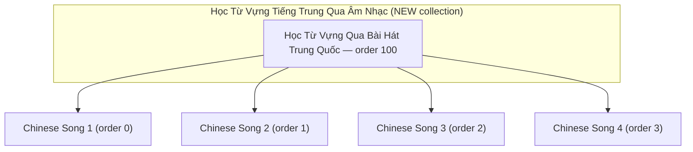
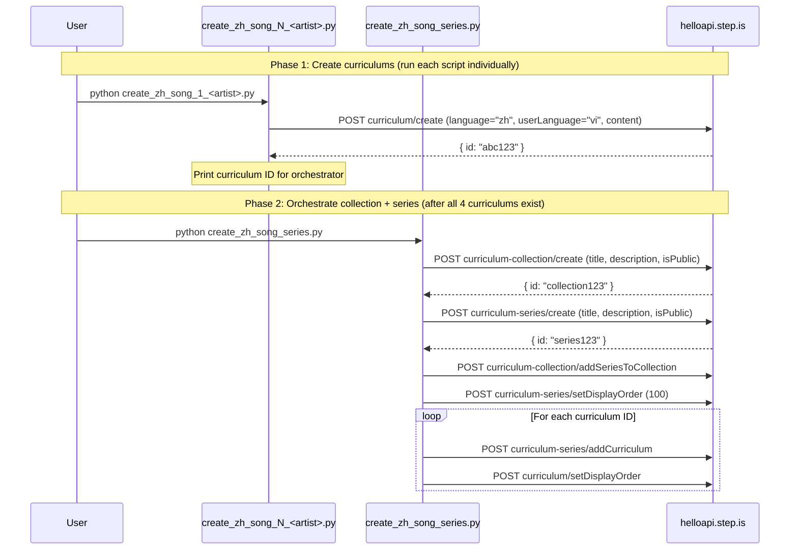

# Design Document: Vi-Zh Song-Based Vocab Series

## Overview

This feature creates a brand new collection "Học Từ Vựng Tiếng Trung Qua Âm Nhạc (通过音乐学中文词汇)" and populates it with a single series "Học Từ Vựng Qua Bài Hát Trung Quốc (通过中文歌曲学词汇)" containing 4 curriculums. Each curriculum is built around a different evergreen Chinese (Mandarin) song, using verbatim Chinese lyrics as reading passages. Songs are selected for HSK 3-4 level lyrics appropriate for pre-intermediate to intermediate Vietnamese learners of Chinese.

The implementation consists of standalone Python scripts that call the helloapi REST API. Each curriculum script contains all hand-written learner-facing text (Vietnamese for instructions/descriptions, simplified Chinese for lyrics/vocab). A single orchestrator script handles collection creation, series creation, and wiring.

### Key Design Decisions

1. **New collection via API** — The orchestrator calls `curriculum-collection/create` to create the vi-zh music collection, then `curriculum-series/create` for the series, then wires them together. This is a separate collection from the vi-en music collection.
2. **One script per curriculum** — Same pattern as the vi-en song series. Each script is ~500-800 lines with all hand-written content.
3. **One orchestrator for collection + series** — A single `create_zh_song_series.py` handles collection creation, series creation, adding curriculums, setting display orders, and wiring the series into the collection.
4. **Chinese song lyrics as reading passages** — Reading activities use verbatim simplified Chinese lyrics sourced via web search. Sessions 1-3 use lyric portions containing that session's vocabulary; Sessions 4-5 use the complete lyrics.
5. **youtubeUrl at top level of content JSON** — Each curriculum's content dict includes a `youtubeUrl` field alongside `title`, `description`, `preview`, and `learningSessions`.
6. **Vietnamese for user-facing text, Chinese for reading content** — All descriptions, previews, introAudio scripts, and writing prompts are in Vietnamese. Reading passages (lyrics) are in simplified Chinese. Vocabulary words are Chinese with Vietnamese definitions.
7. **Session structure matches vi-en song series exactly** — Sessions 1-3 have 12 activities, Session 4 has 4 activities, Session 5 has 5 activities.
8. **language="zh", userLanguage="vi"** — This is the vi-zh language pair, distinct from the vi-en song series.

## Architecture



### Execution Flow



## Components and Interfaces

### Folder Structure

```
vi-zh-song-based-vocab-series/
├── create_zh_song_1_<artist>.py       # Curriculum script for Chinese song 1
├── create_zh_song_2_<artist>.py       # Curriculum script for Chinese song 2
├── create_zh_song_3_<artist>.py       # Curriculum script for Chinese song 3
├── create_zh_song_4_<artist>.py       # Curriculum script for Chinese song 4
└── create_zh_song_series.py           # Orchestrator (collection + series + wiring)
```

After successful creation and verification, all `.py` scripts are deleted, leaving only `README.md`.

### Curriculum Script Interface

Each `create_zh_song_N_<artist>.py` script:

1. Imports `firebase_token.get_firebase_id_token`
2. Defines `STRIP_KEYS` set and `strip()` function inline
3. Defines vocabulary lists: `W1` (6 Chinese words), `W2` (6 Chinese words), `W3` (6 Chinese words), `ALL` (18 Chinese words)
4. Defines reading passages from verbatim Chinese song lyrics: `LYRICS_1` (portion for session 1), `LYRICS_2` (portion for session 2), `LYRICS_3` (portion for session 3), `FULL_LYRICS` (complete song lyrics in simplified Chinese)
5. Builds `content` dict with all hand-written text including `youtubeUrl` at top level
6. Runs `validate(content)` to check structural properties before upload
7. Calls `POST curriculum/create` with `language="zh"`, `userLanguage="vi"`, `content=json.dumps(content)`
8. Prints the created curriculum ID

### Orchestrator Script Interface

`create_zh_song_series.py`:

1. Takes 4 curriculum IDs as constants (pasted from curriculum script output)
2. Calls `POST curriculum-collection/create` with title "Học Từ Vựng Tiếng Trung Qua Âm Nhạc (通过音乐学中文词汇)", persuasive Vietnamese description, `isPublic: true`
3. Calls `POST curriculum-series/create` with title "Học Từ Vựng Qua Bài Hát Trung Quốc (通过中文歌曲学词汇)", Vietnamese description (≤255 chars), `isPublic: true`
4. Calls `POST curriculum-collection/addSeriesToCollection` with the new collection ID and new series ID
5. Calls `POST curriculum-series/setDisplayOrder` with display_order 100 (first series in new collection)
6. For each curriculum: calls `POST curriculum-series/addCurriculum` then `POST curriculum/setDisplayOrder` (0, 1, 2, 3)

### API Calls Used

| Endpoint | Purpose | Auth |
|---|---|---|
| `curriculum/create` | Create each curriculum | AuthGuard |
| `curriculum-collection/create` | Create the new vi-zh music collection | SuperAuthGuard |
| `curriculum-series/create` | Create the Chinese song series | SuperAuthGuard |
| `curriculum-collection/addSeriesToCollection` | Add series to collection | SuperAuthGuard |
| `curriculum-series/setDisplayOrder` | Set series order within collection | SuperAuthGuard |
| `curriculum-series/addCurriculum` | Add curriculum to series | SuperAuthGuard |
| `curriculum/setDisplayOrder` | Set curriculum order within series | SuperAuthGuard |

### Authentication

All scripts use the shared `firebase_token.py` helper:
```python
sys.path.insert(0, "/home/ubuntu/nspaceresearch/design-curriculums")
from firebase_token import get_firebase_id_token
UID = "zs5AMpVfqkcfDf8CJ9qrXdH58d73"
token = get_firebase_id_token(UID)
```

Token is refreshed before each API call that requires SuperAuthGuard.

## Data Models

### Curriculum Content Structure (Chinese Song-Adapted)

```python
content = {
    "title": "Học Qua Bài Hát: '月亮代表我的心' – 邓丽君",
    "description": "Multi-paragraph persuasive copy in Vietnamese (5-beat structure, Chinese song-adapted)",
    "preview": {
        "text": "~150 word vivid marketing copy in Vietnamese referencing the Chinese song and its themes"
    },
    "youtubeUrl": "https://www.youtube.com/watch?v=XXXXXXXXXXX",
    "learningSessions": [
        # Session 1-3: Learning sessions (6 Chinese words each, Chinese lyrics as reading)
        {
            "title": "Buổi 1: <lyric theme in Vietnamese>",
            "activities": [
                # introAudio (welcome + song context, in Vietnamese)
                # introAudio (vocab teaching — how each Chinese word appears in the lyrics, Vietnamese explanations)
                # viewFlashcards, speakFlashcards
                # vocabLevel1, vocabLevel2, vocabLevel3
                # introAudio (grammar/usage notes, Vietnamese)
                # reading (verbatim Chinese lyrics portion), speakReading, readAlong
                # writingSentence (song-themed prompts in Vietnamese, example sentences in Chinese)
            ]
        },
        # Session 4: Review (all 18 words)
        {
            "title": "Ôn tập",
            "activities": [
                # introAudio (congratulations + recap in Vietnamese)
                # viewFlashcards (ALL words)
                # vocabLevel1, vocabLevel2
            ]
        },
        # Session 5: Full lyrics reading + farewell
        {
            "title": "Đọc toàn bộ lời bài hát",
            "activities": [
                # introAudio (farewell + word review in Vietnamese, 400-600 words)
                # reading (FULL Chinese lyrics), speakReading, readAlong
                # introAudio (warm farewell in Vietnamese)
            ]
        }
    ]
}
```

### Session Activity Sequences (Exact)

| Session | Activity Order | Count |
|---|---|---|
| 1-3 (learning) | introAudio, introAudio, viewFlashcards, speakFlashcards, vocabLevel1, vocabLevel2, vocabLevel3, introAudio, reading, speakReading, readAlong, writingSentence | 12 |
| 4 (review) | introAudio, viewFlashcards, vocabLevel1, vocabLevel2 | 4 |
| 5 (full reading + farewell) | introAudio, reading, speakReading, readAlong, introAudio | 5 |

### Activity Data Shapes

| Activity Type | Data Fields |
|---|---|
| `introAudio` | `{ text: string, audioSpeed: 0.01 }` |
| `viewFlashcards` | `{ vocabList: string[], audioSpeed: -0.1 }` |
| `speakFlashcards` | `{ vocabList: string[], audioSpeed: -0.1 }` |
| `vocabLevel1/2/3` | `{ vocabList: string[], audioSpeed: -0.1 }` |
| `reading` | `{ text: string, audioSpeed: -0.1 }` |
| `speakReading` | `{ text: string, audioSpeed: -0.1 }` |
| `readAlong` | `{ text: string, audioSpeed: -0.1 }` |
| `writingSentence` | `{ vocabList: string[], audioSpeed: 0.01, items: WritingItem[] }` |

### WritingItem Shape

```python
{
    "targetVocab": "中文词",
    "prompt": "Sử dụng từ '中文词' để nói về [specific context related to the song's themes]. Ví dụ: [full example sentence in Chinese]."
}
```

### Strip Keys Set

```python
STRIP_KEYS = {
    "mp3Url", "illustrationSet", "chapterBookmarks", "segments",
    "whiteboardItems", "userReadingId", "lessonUniqueId",
    "curriculumTags", "taskId", "imageId"
}
```

### Key Differences from Vi-En Song Series

| Aspect | Vi-En Song Series | Vi-Zh Song Series |
|---|---|---|
| Target language | English (`language: "en"`) | Chinese (`language: "zh"`) |
| User language | Vietnamese (`userLanguage: "vi"`) | Vietnamese (`userLanguage: "vi"`) |
| Collection | Vi-en music collection | New vi-zh music collection |
| Reading passages | English song lyrics | Simplified Chinese song lyrics |
| Vocabulary words | English words | Chinese words/phrases (characters) |
| Song selection | Evergreen English pop/rock | Evergreen Mandopop/Chinese ballads |
| Level reference | A2-B1 CEFR | HSK 3-4 |
| introAudio language | Vietnamese | Vietnamese |
| Writing prompt examples | English sentences | Chinese sentences |
| Folder | `song-based-vocab-series/` | `vi-zh-song-based-vocab-series/` |
| Script naming | `create_song_N_<artist>.py` | `create_zh_song_N_<artist>.py` |

## Correctness Properties

### Property 1: Curriculum structural completeness

*For any* curriculum content dict, it SHALL contain exactly 18 unique Chinese vocabulary words divided into 3 groups of 6 (W1, W2, W3), exactly 5 learning sessions, and the activity type sequences SHALL match: sessions 1-3 = [introAudio, introAudio, viewFlashcards, speakFlashcards, vocabLevel1, vocabLevel2, vocabLevel3, introAudio, reading, speakReading, readAlong, writingSentence] (12 activities), session 4 = [introAudio, viewFlashcards, vocabLevel1, vocabLevel2] (4 activities), session 5 = [introAudio, reading, speakReading, readAlong, introAudio] (5 activities).

**Validates: Requirements 4.1, 4.2, 4.3, 4.4, 4.5**

### Property 2: Language parameters at top level

*For any* curriculum creation API call body, the fields `language` (value `"zh"`) and `userLanguage` (value `"vi"`) SHALL be present as top-level body parameters alongside `content`.

**Validates: Requirements 4.6, 4.7, 13.1**

### Property 3: No auto-generated keys in content

*For any* curriculum content dict (recursively traversing all nested dicts and lists), none of the strip keys (`mp3Url`, `illustrationSet`, `chapterBookmarks`, `segments`, `whiteboardItems`, `userReadingId`, `lessonUniqueId`, `curriculumTags`, `taskId`, `imageId`) SHALL appear as keys.

**Validates: Requirements 9.1**

### Property 4: All activities and sessions have title and description

*For any* activity in any session of any curriculum, both `title` and `description` fields SHALL exist and be non-empty strings. *For any* session object, the `title` field SHALL exist and be a non-empty string.

**Validates: Requirements 8.1, 8.7**

### Property 5: Activity title format matches activity type

*For any* activity in any curriculum: if `activityType` is `viewFlashcards`, `speakFlashcards`, `vocabLevel1`, `vocabLevel2`, or `vocabLevel3`, the title SHALL start with `"Flashcards:"`; if `activityType` is `reading` or `speakReading`, the title SHALL contain `"Đọc:"`; if `activityType` is `readAlong`, the title SHALL contain `"Nghe:"`; if `activityType` is `writingSentence`, the title SHALL contain `"Viết:"`.

**Validates: Requirements 8.2, 8.3, 8.4, 8.6**

### Property 6: Writing prompts contain target vocab and example

*For any* writingSentence item in any curriculum, the `prompt` field SHALL contain the `targetVocab` word and SHALL contain the Vietnamese example marker `"Ví dụ:"`.

**Validates: Requirements 7.1**

### Property 7: youtubeUrl present and valid format

*For any* curriculum content dict, a `youtubeUrl` field SHALL exist at the top level (alongside `title`, `description`, `preview`, `learningSessions`) and its value SHALL match the pattern `https://www.youtube.com/watch?v=` or `https://youtu.be/`.

**Validates: Requirements 3.4, 15.1**

### Property 8: Vocabulary words appear in full lyrics

*For any* curriculum, every one of the 18 Chinese vocabulary words SHALL appear in the `FULL_LYRICS` text used for the complete song reading.

**Validates: Requirements 5.1**

### Property 9: Session lyrics are substrings of full lyrics

*For any* curriculum, the reading text used in sessions 1-3 SHALL each be a non-empty substring of the `FULL_LYRICS` text (allowing for minor whitespace normalization).

**Validates: Requirements 3.2**

### Property 10: Curriculum title contains song title and artist

*For any* curriculum, the `title` field in the content dict SHALL contain both the song title and the artist name as substrings, and SHALL NOT contain difficulty level descriptors (e.g., "Upper-Intermediate", "Advanced", "Beginner").

**Validates: Requirements 3.5, 14.1, 14.2**

### Property 11: Farewell introAudio contains all vocabulary words

*For any* curriculum, the farewell introAudio script in session 5 (the last introAudio activity) SHALL contain all 18 Chinese vocabulary words as substrings.

**Validates: Requirements 6.5**

### Property 12: Vocabulary flashcard lists match session word groups

*For any* curriculum, the `vocabList` in viewFlashcards/speakFlashcards/vocabLevel activities in session N (1-3) SHALL equal exactly the Nth word group (W1, W2, W3). In session 4 (review), the `vocabList` SHALL equal all 18 words.

**Validates: Requirements 4.1**

### Property 13: Curriculum display orders within series are sequential

*For any* series containing 4 curriculums, the display orders assigned to those curriculums SHALL be the sequential integers 0, 1, 2, 3.

**Validates: Requirements 10.1**

### Property 14: Series description under 255 characters

*For any* series creation call, the `description` field SHALL be a non-empty string with length ≤ 255 characters.

**Validates: Requirements 1.2**

## Error Handling

### API Call Failures

Each script calls `r.raise_for_status()` after every API call. If any call fails:
- The script prints the HTTP status code and response body
- Execution stops immediately (no partial state cleanup)
- The user must manually check what was created and retry or clean up

### Common Failure Modes

| Failure | Cause | Resolution |
|---|---|---|
| 500 on `curriculum/create` | `language`/`userLanguage` missing from top-level body | Ensure both are top-level params, not just inside content |
| 500 on `curriculum-series/create` | Description exceeds 255 chars | Shorten description |
| 500 on `curriculum-collection/create` | Title exceeds 255 chars | Shorten title |
| 401 Unauthorized | Firebase token expired | Script refreshes token before each call |
| 409 or duplicate | Collection/series/curriculum already exists | Check DB, delete duplicate, retry |
| Network timeout | API unreachable | Retry the script |

### Token Refresh Strategy

Firebase ID tokens expire after ~1 hour. For scripts making multiple sequential API calls, the token is refreshed by calling `get_firebase_id_token(UID)` before each API call rather than reusing a single token.

### Idempotency Considerations

- `curriculum/create` is NOT idempotent — running the same script twice creates duplicate curriculums
- `curriculum-collection/create` is NOT idempotent — running twice creates duplicate collections
- `curriculum-series/create` is NOT idempotent — running twice creates duplicate series
- `curriculum-series/addCurriculum` IS idempotent — adding the same curriculum twice has no effect
- `curriculum/setDisplayOrder` IS idempotent — setting the same order twice is safe
- `curriculum-collection/addSeriesToCollection` IS idempotent — adding the same series twice is safe
- If the orchestrator fails partway through, the user should check the DB state before re-running

## Testing Strategy

### Pre-Upload Validation (Unit-Test Equivalent)

Each curriculum script includes a `validate(content)` function that checks structural properties before making the API call:

1. Verify 18 unique vocab words across W1 + W2 + W3
2. Verify 5 sessions exist with correct activity type sequences (12, 12, 12, 4, 5)
3. Verify all activities have `title` and `description`
4. Verify no strip keys present in content (recursive check)
5. Verify `youtubeUrl` exists at top level and matches YouTube URL pattern
6. Verify all 18 vocab words appear in FULL_LYRICS
7. Verify session 1-3 reading texts are substrings of FULL_LYRICS
8. Verify writingSentence items have `targetVocab` and `prompt` with "Ví dụ:" marker
9. Verify vocabList in flashcard activities matches the correct word group
10. Verify curriculum title contains song title and artist name
11. Verify farewell introAudio (session 5) contains all 18 vocab words
12. Verify activity title format matches activity type (Flashcards:/Đọc:/Nghe:/Viết:)

### Post-Creation Verification

After all scripts have run, verify via SQL:

```sql
-- Find the new vi-zh music collection
SELECT id, title, description, is_public
FROM curriculum_collections
WHERE title LIKE '%Tiếng Trung%Âm Nhạc%';

-- Verify collection has 1 series
SELECT cs.id, cs.title, cs.display_order
FROM curriculum_series cs
JOIN curriculum_collection_series ccs ON ccs.curriculum_series_id = cs.id
WHERE ccs.curriculum_collection_id = '<NEW_COLLECTION_ID>'
ORDER BY cs.display_order;

-- Verify series has 4 curriculums
SELECT c.id, c.content->>'title' as title, c.display_order,
       c.content->>'youtubeUrl' as youtube_url
FROM curriculum c
JOIN curriculum_series_items csi ON csi.curriculum_id = c.id
WHERE csi.curriculum_series_id = '<NEW_SERIES_ID>'
ORDER BY c.display_order;

-- Verify language homogeneity (should be zh/vi)
SELECT * FROM curriculum_series_language_list
WHERE id = '<NEW_SERIES_ID>';

-- Verify all curriculums are private
SELECT c.id, c.content->>'title' as title, c.is_public
FROM curriculum c
JOIN curriculum_series_items csi ON csi.curriculum_id = c.id
WHERE csi.curriculum_series_id = '<NEW_SERIES_ID>';
```
