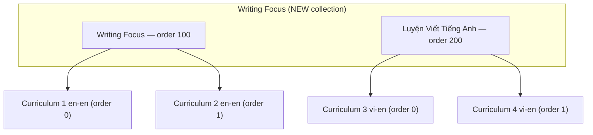
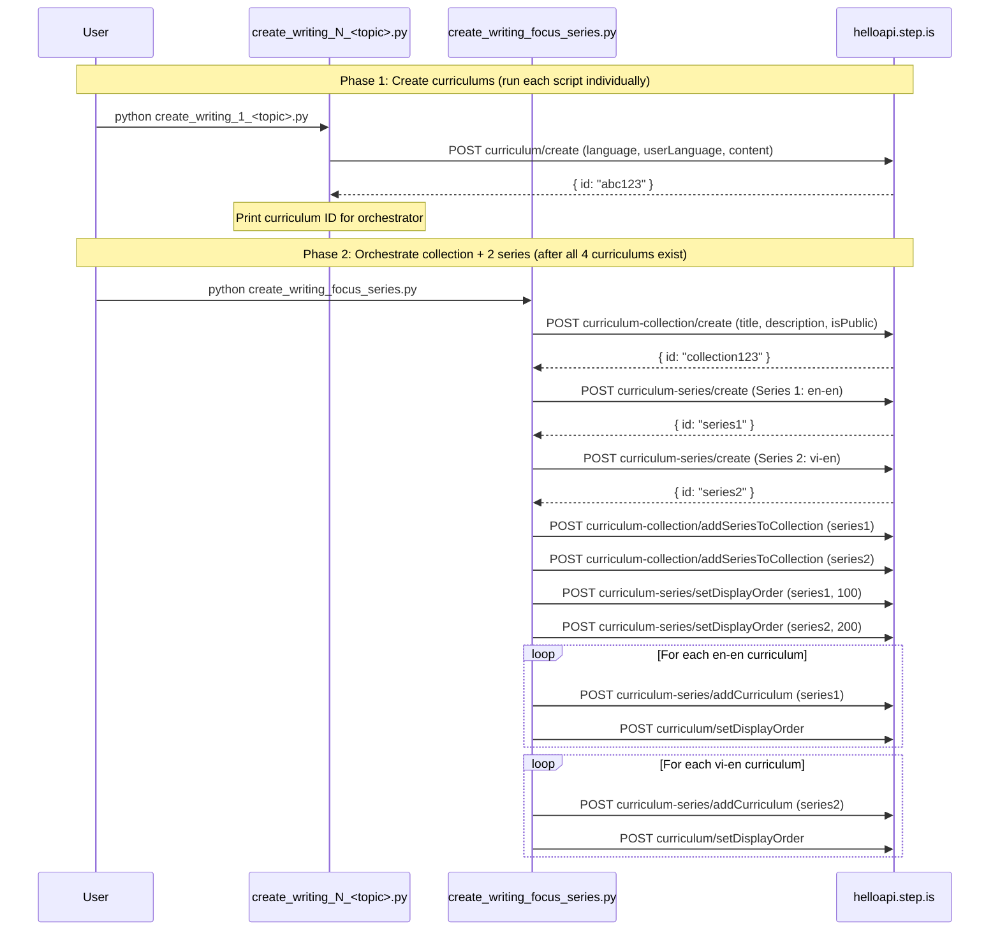

# Design Document: Writing-Focus Curriculum

## Overview

This feature introduces a new curriculum type `writing_focus` and creates 4 initial curriculums demonstrating it. Unlike the existing `balanced_skills` type (18 words, 5 sessions, speaking + reading + writing), `writing_focus` makes writing the centerpiece — dropping `speakFlashcards`, `speakReading`, and `vocabLevel3` in favor of sustained, progressive writing practice via `writingSentence` and `writingParagraph`. Vocabulary is reduced to 10 words (2 groups of 5) as scaffolding for writing, not as the primary learning goal.

The type has two variants:

1. **Single-language (en-en, advanced)** — 4 sessions. `writingParagraph` in every session. Prompts escalate: paragraph response → compare/contrast → analytical essay → argumentative/persuasive capstone. All text in English.
2. **Bilingual (vi-en, intermediate)** — 4 sessions. `writingSentence` dominates S1-S3, `writingParagraph` introduced at S3-S4. Prompts in Vietnamese, responses in English.

The implementation consists of standalone Python scripts calling the helloapi REST API. A new collection is created with two series (one per variant, since bilingual and single-language cannot be mixed in the same series). One orchestrator script handles collection creation, both series, and all wiring.

### Key Design Decisions

1. **New collection via API** — The orchestrator creates one collection, then two series within it. Same API pattern as song-based, movie-based, and podcast-based series.
2. **Two series, one collection** — Single-language (en-en) and bilingual (vi-en) curriculums cannot share a series (language homogeneity rule). Series 1: 2 single-language writing_focus curriculums. Series 2: 2 bilingual writing_focus curriculums.
3. **One script per curriculum** — Same pattern as all other series. Each script is ~400-600 lines with all hand-written content.
4. **One orchestrator for collection + both series** — A single `create_writing_focus_series.py` handles collection creation, both series creation, adding curriculums, setting display orders, and wiring both series into the collection.
5. **10 vocab words (2 groups of 5)** — Unlike balanced_skills (18 words, 3 groups of 6). Vocabulary serves writing, not the other way around.
6. **4 sessions instead of 5** — No dedicated review session or full-reading session. S3 is a pure writing session (single-language) or review+first-paragraph session (bilingual). S4 is the capstone.
7. **No speakFlashcards, speakReading, or vocabLevel3** — These are traded for more writing time. The curriculum type enforces this structurally.
8. **writingParagraph is the signature activity** — Present in every session (single-language) or S3-S4 (bilingual). This is what distinguishes writing_focus from balanced_skills.
9. **Prompt escalation** — Single-language: sentence → paragraph → compare/contrast → analytical → argumentative. Bilingual: sentence (scaffolded) → sentence (less scaffolded) → sentence+paragraph (guided) → paragraph (independent).
10. **No youtubeUrl** — Unlike song/movie/podcast series, writing_focus curriculums use authored model texts, not media excerpts. No `youtubeUrl` field in content.
11. **Model texts as reading passages** — S1-S2 reading passages are authored articles that introduce the topic and contain vocabulary in context. S4 reading is a full article combining/extending S1-S2. S3 has no new reading (pure writing session).

### Initial 4 Curriculums

| # | Variant | Language Pair | Level | Series |
|---|---|---|---|---|
| 1 | Single-language | en-en | Advanced | Series 1: Writing Focus (English) |
| 2 | Single-language | en-en | Advanced | Series 1: Writing Focus (English) |
| 3 | Bilingual | vi-en | Intermediate | Series 2: Luyện Viết Tiếng Anh |
| 4 | Bilingual | vi-en | Intermediate | Series 2: Luyện Viết Tiếng Anh |

## Architecture



### Execution Flow



## Components and Interfaces

### Folder Structure

```
writing-focus-curriculum/
├── create_writing_1_<topic>.py          # Single-language curriculum 1
├── create_writing_2_<topic>.py          # Single-language curriculum 2
├── create_writing_3_<topic>.py          # Bilingual curriculum 1
├── create_writing_4_<topic>.py          # Bilingual curriculum 2
└── create_writing_focus_series.py       # Orchestrator (collection + 2 series + wiring)
```

After successful creation and verification, all `.py` scripts are deleted, leaving only `README.md`.

### Curriculum Script Interface

Each `create_writing_N_<topic>.py` script:

1. Imports `firebase_token.get_firebase_id_token`
2. Defines `STRIP_KEYS` set and `strip()` function inline
3. Defines vocabulary lists: `W1` (5 words), `W2` (5 words), `ALL` (10 words)
4. Defines reading passages: `MODEL_TEXT_1` (S1 passage), `MODEL_TEXT_2` (S2 passage), `FULL_ARTICLE` (S4 combined/extended passage)
5. Builds `content` dict with all hand-written text
6. Runs `validate(content)` to check structural properties before upload
7. Calls `POST curriculum/create` with appropriate `language`/`userLanguage` at top level
8. Prints the created curriculum ID

### Orchestrator Script Interface

`create_writing_focus_series.py`:

1. Takes 4 curriculum IDs as constants (2 en-en, 2 vi-en)
2. Creates collection with descriptive title and persuasive description, `isPublic: true`
3. Creates Series 1 (en-en) with English title/description, `isPublic: true`
4. Creates Series 2 (vi-en) with Vietnamese title/description, `isPublic: true`
5. Wires both series into the collection
6. Sets display orders: Series 1 = 100, Series 2 = 200
7. Adds curriculums to their respective series with display orders 0, 1

### API Calls Used

| Endpoint | Purpose | Auth |
|---|---|---|
| `curriculum/create` | Create each curriculum | AuthGuard |
| `curriculum-collection/create` | Create the writing-focus collection | SuperAuthGuard |
| `curriculum-series/create` | Create each series (×2) | SuperAuthGuard |
| `curriculum-collection/addSeriesToCollection` | Add each series to collection (×2) | SuperAuthGuard |
| `curriculum-series/setDisplayOrder` | Set series order within collection (×2) | SuperAuthGuard |
| `curriculum-series/addCurriculum` | Add curriculum to series (×4) | SuperAuthGuard |
| `curriculum/setDisplayOrder` | Set curriculum order within series (×4) | SuperAuthGuard |

### Authentication

All scripts use the shared `firebase_token.py` helper:
```python
sys.path.insert(0, "/home/ubuntu/nspaceresearch/design-curriculums")
from firebase_token import get_firebase_id_token
UID = "zs5AMpVfqkcfDf8CJ9qrXdH58d73"
token = get_firebase_id_token(UID)
```

Token is refreshed before each API call that requires SuperAuthGuard.

## Data Models

### Curriculum Content Structure — Single-Language Variant (en-en)

```python
content = {
    "title": "Writing Focus: <Topic Title>",
    "description": "Multi-paragraph persuasive copy in English (5-beat structure, writing-focused)",
    "preview": {
        "text": "~150 word vivid marketing copy about the writing journey and topic"
    },
    "learningSessions": [
        # Session 1: Vocab + Model Text + First Writing (8 activities)
        {
            "title": "Session 1: Vocabulary + Model Text",
            "activities": [
                # introAudio (teach 5 words + explain writing task)
                # viewFlashcards (W1)
                # vocabLevel1 (W1), vocabLevel2 (W1)
                # reading (MODEL_TEXT_1)
                # readAlong (MODEL_TEXT_1)
                # writingSentence (5 items using W1)
                # writingParagraph (respond to model text, W1 vocabList)
            ]
        },
        # Session 2: New Vocab + Second Passage + Compare/Contrast (8 activities)
        {
            "title": "Session 2: New Vocabulary + Compare/Contrast",
            "activities": [
                # introAudio (teach 5 more words + recap S1 writing)
                # viewFlashcards (W2)
                # vocabLevel1 (W2), vocabLevel2 (W2)
                # reading (MODEL_TEXT_2)
                # readAlong (MODEL_TEXT_2)
                # writingSentence (5 items using W2)
                # writingParagraph (compare/contrast S1 and S2 passages, W2 vocabList)
            ]
        },
        # Session 3: Review + Analytical Essay (5 activities)
        {
            "title": "Session 3: Review + Analytical Essay",
            "activities": [
                # introAudio (review all 10 words)
                # viewFlashcards (ALL 10 words)
                # vocabLevel1 (ALL), vocabLevel2 (ALL)
                # writingParagraph (analytical essay, ALL vocabList, 6-8 sentences)
            ]
        },
        # Session 4: Full Article + Capstone + Farewell (5 activities)
        {
            "title": "Session 4: Capstone Composition",
            "activities": [
                # introAudio (recap journey)
                # reading (FULL_ARTICLE)
                # readAlong (FULL_ARTICLE)
                # writingParagraph (argumentative/persuasive capstone, ALL vocabList)
                # introAudio (farewell, 400-600 words)
            ]
        }
    ]
}
```

### Session Activity Sequences — Single-Language Variant (Exact)

| Session | Activity Order | Count |
|---|---|---|
| S1 (vocab + model text + writing) | introAudio, viewFlashcards, vocabLevel1, vocabLevel2, reading, readAlong, writingSentence, writingParagraph | 8 |
| S2 (new vocab + compare/contrast) | introAudio, viewFlashcards, vocabLevel1, vocabLevel2, reading, readAlong, writingSentence, writingParagraph | 8 |
| S3 (review + analytical essay) | introAudio, viewFlashcards, vocabLevel1, vocabLevel2, writingParagraph | 5 |
| S4 (capstone + farewell) | introAudio, reading, readAlong, writingParagraph, introAudio | 5 |

### Curriculum Content Structure — Bilingual Variant (vi-en)

```python
content = {
    "title": "Luyện Viết: <Tên Chủ Đề>",
    "description": "Multi-paragraph persuasive copy in Vietnamese (5-beat structure, writing-focused)",
    "preview": {
        "text": "~150 word vivid marketing copy in Vietnamese about the writing journey"
    },
    "learningSessions": [
        # Session 1: Vocab + Model Text + Sentence Writing (9 activities)
        {
            "title": "Buổi 1: Từ vựng + Bài mẫu",
            "activities": [
                # introAudio (welcome)
                # introAudio (bilingual vocab teaching — 5 words)
                # viewFlashcards (W1)
                # vocabLevel1 (W1), vocabLevel2 (W1)
                # introAudio (reading intro)
                # reading (MODEL_TEXT_1)
                # readAlong (MODEL_TEXT_1)
                # writingSentence (5 items, bilingual prompts, full scaffolding)
            ]
        },
        # Session 2: New Vocab + Second Passage + Sentence Writing (9 activities)
        {
            "title": "Buổi 2: Từ vựng mới + Bài mẫu 2",
            "activities": [
                # introAudio (welcome)
                # introAudio (bilingual vocab teaching — 5 new words)
                # viewFlashcards (W2)
                # vocabLevel1 (W2), vocabLevel2 (W2)
                # introAudio (reading intro)
                # reading (MODEL_TEXT_2)
                # readAlong (MODEL_TEXT_2)
                # writingSentence (5 items, slightly less scaffolding)
            ]
        },
        # Session 3: Review + Combined Writing + First Paragraph (7 activities)
        {
            "title": "Buổi 3: Ôn tập + Viết đoạn văn",
            "activities": [
                # introAudio (welcome)
                # introAudio (review all vocab)
                # viewFlashcards (ALL 10 words)
                # vocabLevel1 (ALL), vocabLevel2 (ALL)
                # writingSentence (3 items combining S1+S2 vocab)
                # writingParagraph (guided paragraph, structural guidance in Vietnamese)
            ]
        },
        # Session 4: Full Text + Independent Paragraph + Farewell (5 activities)
        {
            "title": "Buổi 4: Viết tự do",
            "activities": [
                # introAudio (welcome)
                # reading (FULL_ARTICLE)
                # readAlong (FULL_ARTICLE)
                # writingParagraph (less scaffolded, independent writing)
                # introAudio (farewell)
            ]
        }
    ]
}
```

### Session Activity Sequences — Bilingual Variant (Exact)

| Session | Activity Order | Count |
|---|---|---|
| S1 (vocab + model text + sentences) | introAudio, introAudio, viewFlashcards, vocabLevel1, vocabLevel2, introAudio, reading, readAlong, writingSentence | 9 |
| S2 (new vocab + sentences) | introAudio, introAudio, viewFlashcards, vocabLevel1, vocabLevel2, introAudio, reading, readAlong, writingSentence | 9 |
| S3 (review + sentences + paragraph) | introAudio, introAudio, viewFlashcards, vocabLevel1, vocabLevel2, writingSentence, writingParagraph | 7 |
| S4 (full text + paragraph + farewell) | introAudio, reading, readAlong, writingParagraph, introAudio | 5 |

### Activity Data Shapes

| Activity Type | Data Fields |
|---|---|
| `introAudio` | `{ text: string, audioSpeed: 0.01 }` |
| `viewFlashcards` | `{ vocabList: string[], audioSpeed: -0.1 }` |
| `vocabLevel1/2` | `{ vocabList: string[], audioSpeed: -0.1 }` |
| `reading` | `{ text: string, audioSpeed: -0.1 }` |
| `readAlong` | `{ text: string, audioSpeed: -0.1 }` |
| `writingSentence` | `{ vocabList: string[], audioSpeed: 0.01, items: WritingItem[] }` |
| `writingParagraph` | `{ vocabList: string[], audioSpeed: 0.01, prompt: string }` |

### WritingItem Shape (writingSentence)

Single-language:
```python
{
    "targetVocab": "word",
    "prompt": "Use the word 'word' to write about [specific context]. Example: [full example sentence]."
}
```

Bilingual:
```python
{
    "targetVocab": "word",
    "prompt": "Sử dụng từ 'word' để viết về [specific context in Vietnamese]. Ví dụ: [example sentence in English]."
}
```

### writingParagraph Prompt Examples

Single-language S1 (respond to model text):
```python
{
    "vocabList": ["word1", "word2", "word3", "word4", "word5"],
    "audioSpeed": 0.01,
    "prompt": "Write a paragraph (4-6 sentences) responding to the passage you just read. Explain [specific aspect of the topic] using the vocabulary from this session. Consider [specific angle]."
}
```

Single-language S2 (compare/contrast):
```python
{
    "vocabList": ["word6", "word7", "word8", "word9", "word10"],
    "audioSpeed": 0.01,
    "prompt": "Compare and contrast the two passages from Sessions 1 and 2. How do [aspect A] and [aspect B] relate to each other? Use vocabulary from this session in your response (4-6 sentences)."
}
```

Single-language S3 (analytical essay):
```python
{
    "vocabList": ["word1", ..., "word10"],
    "audioSpeed": 0.01,
    "prompt": "Write an analytical essay (6-8 sentences) examining [topic]. Use all 10 vocabulary words. Your essay should [specific rubric: present a thesis, support with evidence from the passages, and draw a conclusion]."
}
```

Single-language S4 (argumentative/persuasive capstone):
```python
{
    "vocabList": ["word1", ..., "word10"],
    "audioSpeed": 0.01,
    "prompt": "Write an argumentative response (6-8 sentences) taking a clear position on [topic question]. Use vocabulary from the curriculum to support your argument. Include a thesis statement, supporting evidence, and a concluding statement."
}
```

Bilingual S3 (guided paragraph):
```python
{
    "vocabList": ["word1", ..., "word10"],
    "audioSpeed": 0.01,
    "prompt": "Viết một đoạn văn ngắn bằng tiếng Anh (4-5 câu) về [topic in Vietnamese]. Gợi ý cấu trúc: Câu 1 — giới thiệu chủ đề. Câu 2-3 — nêu ý chính. Câu 4 — kết luận. Hãy sử dụng ít nhất 3 từ vựng đã học."
}
```

Bilingual S4 (independent paragraph):
```python
{
    "vocabList": ["word1", ..., "word10"],
    "audioSpeed": 0.01,
    "prompt": "Viết một đoạn văn bằng tiếng Anh (4-6 câu) về [topic]. Hãy sử dụng từ vựng đã học để trình bày ý kiến của bạn."
}
```

### Strip Keys Set

```python
STRIP_KEYS = {
    "mp3Url", "illustrationSet", "chapterBookmarks", "segments",
    "whiteboardItems", "userReadingId", "lessonUniqueId",
    "curriculumTags", "taskId", "imageId"
}
```

### Key Differences from Balanced_Skills

| Aspect | Balanced_Skills | Writing_Focus (Single-Language) | Writing_Focus (Bilingual) |
|---|---|---|---|
| Sessions | 5 | 4 | 4 |
| Vocab words | 18 (3 groups of 6) | 10 (2 groups of 5) | 10 (2 groups of 5) |
| speakFlashcards | Yes | No | No |
| speakReading | Yes | No | No |
| vocabLevel3 | Yes | No | No |
| writingParagraph | No | Every session (S1-S4) | S3-S4 only |
| writingSentence | S1-S3 only | S1-S2 only | S1-S3 |
| S3 purpose | Learning session 3 (new vocab) | Pure writing (review + analytical essay) | Review + first paragraph |
| S4 purpose | Review (all vocab) | Capstone (full article + argumentative) | Independent writing + farewell |
| S5 purpose | Full reading + farewell | N/A (no S5) | N/A (no S5) |
| Reading passages | Authored articles | Authored model texts (S1, S2, S4) | Authored model texts (S1, S2, S4) |
| S3 reading | Yes (new passage) | No (pure writing) | No (review + writing) |
| Language pair | vi-en | en-en | vi-en |
| Level | Pre-intermediate to intermediate | Advanced | Intermediate |
| Prompt language | Vietnamese | English | Vietnamese (prompts) + English (responses) |
| youtubeUrl | No | No | No |
| Activity title language | Vietnamese (Đọc:/Nghe:/Viết:) | English (Read:/Listen:/Write:) | Vietnamese (Đọc:/Nghe:/Viết:) |
| Farewell introAudio | S5 (400-600 words) | S4 last activity (400-600 words) | S4 last activity (400-600 words) |
| Prompt escalation | Flat (same complexity) | sentence → paragraph → compare/contrast → analytical → argumentative | sentence (scaffolded) → sentence (less) → sentence+paragraph (guided) → paragraph (independent) |


## Correctness Properties

*A property is a characteristic or behavior that should hold true across all valid executions of a system — essentially, a formal statement about what the system should do. Properties serve as the bridge between human-readable specifications and machine-verifiable correctness guarantees.*

### Property 1: Structural completeness — single-language variant

*For any* single-language writing_focus curriculum content dict, it SHALL contain exactly 10 unique vocabulary words divided into 2 groups of 5 (W1, W2), exactly 4 learning sessions, and the activity type sequences SHALL match: S1 = [introAudio, viewFlashcards, vocabLevel1, vocabLevel2, reading, readAlong, writingSentence, writingParagraph] (8 activities), S2 = [introAudio, viewFlashcards, vocabLevel1, vocabLevel2, reading, readAlong, writingSentence, writingParagraph] (8 activities), S3 = [introAudio, viewFlashcards, vocabLevel1, vocabLevel2, writingParagraph] (5 activities), S4 = [introAudio, reading, readAlong, writingParagraph, introAudio] (5 activities).

**Validates: Requirements 1.1, 1.2, 1.3, 1.4, 1.5, 1.6, 3.1, 3.2, 3.3, 3.4, 6.1, 6.2, 6.3, 6.4**

### Property 2: Structural completeness — bilingual variant

*For any* bilingual writing_focus curriculum content dict, it SHALL contain exactly 10 unique vocabulary words divided into 2 groups of 5 (W1, W2), exactly 4 learning sessions, and the activity type sequences SHALL match: S1 = [introAudio, introAudio, viewFlashcards, vocabLevel1, vocabLevel2, introAudio, reading, readAlong, writingSentence] (9 activities), S2 = [introAudio, introAudio, viewFlashcards, vocabLevel1, vocabLevel2, introAudio, reading, readAlong, writingSentence] (9 activities), S3 = [introAudio, introAudio, viewFlashcards, vocabLevel1, vocabLevel2, writingSentence, writingParagraph] (7 activities), S4 = [introAudio, reading, readAlong, writingParagraph, introAudio] (5 activities).

**Validates: Requirements 2.1, 2.2, 2.3, 2.4, 2.5, 2.6, 3.1, 3.2, 3.3, 3.5, 6.5, 6.6**

### Property 3: No auto-generated keys in content

*For any* curriculum content dict (recursively traversing all nested dicts and lists), none of the strip keys (`mp3Url`, `illustrationSet`, `chapterBookmarks`, `segments`, `whiteboardItems`, `userReadingId`, `lessonUniqueId`, `curriculumTags`, `taskId`, `imageId`) SHALL appear as keys.

**Validates: Requirements 10.1**

### Property 4: All activities and sessions have title and description

*For any* activity in any session of any curriculum, both `title` and `description` fields SHALL exist and be non-empty strings. *For any* session object, the `title` field SHALL exist and be a non-empty string.

**Validates: Requirements 9.1, 9.8**

### Property 5: Activity title format matches activity type and variant

*For any* activity in a single-language curriculum: if `activityType` is `viewFlashcards`, `vocabLevel1`, or `vocabLevel2`, the title SHALL start with `"Flashcards:"`; if `activityType` is `reading`, the title SHALL contain `"Read:"`; if `activityType` is `readAlong`, the title SHALL contain `"Listen:"`; if `activityType` is `writingSentence` or `writingParagraph`, the title SHALL contain `"Write:"`. *For any* activity in a bilingual curriculum: the same activity types SHALL use `"Flashcards:"`, `"Đọc:"`, `"Nghe:"`, and `"Viết:"` respectively.

**Validates: Requirements 9.2, 9.3, 9.4, 9.6, 9.7**

### Property 6: Writing prompt format — writingSentence

*For any* writingSentence item in a single-language curriculum, the `prompt` field SHALL contain the `targetVocab` word and SHALL contain the English example marker `"Example:"`. *For any* writingSentence item in a bilingual curriculum, the `prompt` field SHALL contain the `targetVocab` word and SHALL contain the Vietnamese example marker `"Ví dụ:"`.

**Validates: Requirements 17.1, 17.2, 17.3**

### Property 7: writingParagraph has prompt and vocabList with correct words

*For any* writingParagraph activity in any curriculum, the `prompt` field SHALL exist and be a non-empty string, and the `vocabList` field SHALL exist and be a non-empty list. In a single-language curriculum: S1 writingParagraph vocabList SHALL equal W1, S2 SHALL equal W2, S3 and S4 SHALL equal ALL (10 words). In a bilingual curriculum: S3 and S4 writingParagraph vocabList SHALL equal ALL (10 words).

**Validates: Requirements 17.4, 19.1, 19.2, 19.3, 19.4, 19.5**

### Property 8: writingSentence item counts match session requirements

*For any* single-language curriculum, S1 writingSentence SHALL have exactly 5 items and S2 writingSentence SHALL have exactly 5 items. *For any* bilingual curriculum, S1 writingSentence SHALL have exactly 5 items, S2 writingSentence SHALL have exactly 5 items, and S3 writingSentence SHALL have exactly 3 items.

**Validates: Requirements 4.1, 5.2, 5.3, 5.4**

### Property 9: Language parameters at top level

*For any* single-language curriculum creation API call body, the fields `language` (value `"en"`) and `userLanguage` (value `"en"`) SHALL be present as top-level body parameters alongside `content`. *For any* bilingual curriculum creation API call body, the fields `language` (value `"en"`) and `userLanguage` (value `"vi"`) SHALL be present as top-level body parameters alongside `content`.

**Validates: Requirements 15.1, 15.2, 15.3**

### Property 10: Vocabulary words appear in reading passages

*For any* curriculum, every one of the 10 vocabulary words SHALL appear (case-insensitive) in at least one of the reading passage texts (MODEL_TEXT_1, MODEL_TEXT_2, or FULL_ARTICLE).

**Validates: Requirements 7.5**

### Property 11: Farewell introAudio contains all vocabulary words

*For any* curriculum, the farewell introAudio script (the last introAudio activity in S4) SHALL contain all 10 vocabulary words as substrings.

**Validates: Requirements 20.5**

### Property 12: Vocabulary flashcard lists match session word groups

*For any* curriculum, the `vocabList` in viewFlashcards/vocabLevel activities in S1 SHALL equal exactly W1 (5 words), in S2 SHALL equal exactly W2 (5 words), and in S3 SHALL equal ALL (10 words).

**Validates: Requirements 7.2, 7.3**

### Property 13: Curriculum title has no difficulty level descriptors

*For any* curriculum, the `title` field in the content dict SHALL NOT contain difficulty level descriptors (e.g., "Upper-Intermediate", "Advanced", "Beginner", "Intermediate").

**Validates: Requirements 15.5**

### Property 14: Series descriptions under 255 characters

*For any* series creation call, the `description` field SHALL be a non-empty string with length ≤ 255 characters.

**Validates: Requirements 11.2**

### Property 15: Curriculum display orders within series are sequential

*For any* series containing 2 curriculums, the display orders assigned to those curriculums SHALL be the sequential integers 0, 1.

**Validates: Requirements 12.1**

### Property 16: S1-S2 introAudio contains session vocabulary words

*For any* curriculum, the first introAudio in S1 SHALL contain all 5 W1 vocabulary words as substrings, and the first introAudio in S2 SHALL contain all 5 W2 vocabulary words as substrings.

**Validates: Requirements 20.1, 20.2**

## Error Handling

### API Call Failures

Each script calls `r.raise_for_status()` after every API call. If any call fails:
- The script prints the HTTP status code and response body
- Execution stops immediately (no partial state cleanup)
- The user must manually check what was created and retry or clean up

### Common Failure Modes

| Failure | Cause | Resolution |
|---|---|---|
| 500 on `curriculum/create` | `language`/`userLanguage` missing from top-level body | Ensure both are top-level params, not just inside content |
| 500 on `curriculum-series/create` | Description exceeds 255 chars | Shorten description |
| 500 on `curriculum-collection/create` | Title exceeds 255 chars | Shorten title |
| 401 Unauthorized | Firebase token expired | Script refreshes token before each call |
| 409 or duplicate | Collection/series/curriculum already exists | Check DB, delete duplicate, retry |
| Network timeout | API unreachable | Retry the script |
| Language homogeneity violation | Mixing en-en and vi-en in same series | Use separate series (enforced by design) |

### Token Refresh Strategy

Firebase ID tokens expire after ~1 hour. For scripts making multiple sequential API calls, the token is refreshed by calling `get_firebase_id_token(UID)` before each API call rather than reusing a single token.

### Idempotency Considerations

- `curriculum/create` is NOT idempotent — running the same script twice creates duplicate curriculums
- `curriculum-collection/create` is NOT idempotent — running twice creates duplicate collections
- `curriculum-series/create` is NOT idempotent — running twice creates duplicate series
- `curriculum-series/addCurriculum` IS idempotent — adding the same curriculum twice has no effect
- `curriculum/setDisplayOrder` IS idempotent — setting the same order twice is safe
- `curriculum-collection/addSeriesToCollection` IS idempotent — adding the same series twice is safe
- If the orchestrator fails partway through, the user should check the DB state before re-running

### Orchestrator Failure Recovery

Since the orchestrator creates one collection and two series, a failure mid-way requires careful recovery:
1. If collection creation succeeds but series creation fails → note the collection ID, fix the issue, re-run with collection creation skipped (or delete the collection and re-run)
2. If Series 1 creation succeeds but Series 2 fails → note Series 1 ID, fix the issue, create Series 2 manually
3. If series creation succeeds but addSeriesToCollection fails → note both IDs, fix the issue, manually wire them
4. If curriculum addition fails → note which curriculums were added, add the remaining ones manually

## Testing Strategy

Since this project has no test framework or CI pipeline, validation is done through structural verification of the content dicts before they are sent to the API, and post-creation verification via DB queries.

### Pre-Upload Validation (Unit-Test Equivalent)

Each curriculum script includes a `validate(content, variant)` function that checks structural properties before making the API call. The `variant` parameter is either `"single-language"` or `"bilingual"` and determines which activity sequences and title formats to check.

**Single-language variant checks:**
1. Verify 10 unique vocab words across W1 (5) + W2 (5)
2. Verify 4 sessions with correct activity type sequences (8, 8, 5, 5)
3. Verify no `speakFlashcards`, `speakReading`, or `vocabLevel3` in any session
4. Verify `writingParagraph` present in every session (S1-S4)
5. Verify S3 has no `reading` activity (pure writing session)
6. Verify all activities have `title` and `description`
7. Verify activity title format: `Flashcards:`, `Read:`, `Listen:`, `Write:`
8. Verify no strip keys present in content (recursive check)
9. Verify all 10 vocab words appear in reading passages (case-insensitive)
10. Verify writingSentence items: 5 in S1, 5 in S2, each with `targetVocab` + `prompt` containing `"Example:"`
11. Verify writingParagraph has `prompt` (non-empty) and `vocabList` (S1=W1, S2=W2, S3=ALL, S4=ALL)
12. Verify farewell introAudio (S4 last activity) contains all 10 vocab words
13. Verify S1 introAudio contains all W1 words, S2 introAudio contains all W2 words
14. Verify curriculum title has no difficulty level descriptors
15. Verify vocabList in flashcard activities: S1=W1, S2=W2, S3=ALL

**Bilingual variant checks:**
1-6, 8-9, 12-15 same as single-language (with bilingual activity sequences: 9, 9, 7, 5)
7. Verify activity title format: `Flashcards:`, `Đọc:`, `Nghe:`, `Viết:`
10. Verify writingSentence items: 5 in S1, 5 in S2, 3 in S3, each with `targetVocab` + `prompt` containing `"Ví dụ:"`
11. Verify writingParagraph has `prompt` and `vocabList` (S3=ALL, S4=ALL)

This function runs locally before any API call is made. If validation fails, the script exits with a clear error message.

### Property-Based Testing

Since there is no test framework in this repo, property-based testing is implemented as inline assertions within the `validate(content, variant)` function. These assertions verify the structural properties (Properties 1-16) against the content dict before upload. Each curriculum script includes the same validation logic (copied inline, since scripts are standalone and deleted after use).

Each assertion is tagged with a comment referencing the design property:
```python
# Feature: writing-focus-curriculum, Property 1: Structural completeness — single-language
assert len(sessions) == 4
assert [a["activityType"] for a in sessions[0]["activities"]] == EXPECTED_S1_SEQUENCE
# ...
```

Minimum 100 iterations is not applicable here since validation runs against a single hand-crafted content dict (not generated inputs). The properties are verified as structural assertions.

### Post-Creation Verification

After all scripts have run, verify via SQL:

```sql
-- Find the new writing-focus collection
SELECT id, title, description, is_public
FROM curriculum_collections
WHERE title LIKE '%Writing Focus%';

-- Verify collection has 2 series
SELECT cs.id, cs.title, cs.display_order
FROM curriculum_series cs
JOIN curriculum_collection_series ccs ON ccs.curriculum_series_id = cs.id
WHERE ccs.curriculum_collection_id = '<NEW_COLLECTION_ID>'
ORDER BY cs.display_order;

-- Verify Series 1 (en-en) has 2 curriculums
SELECT c.id, c.content->>'title' as title, c.display_order,
       c.language, c.user_language
FROM curriculum c
JOIN curriculum_series_items csi ON csi.curriculum_id = c.id
WHERE csi.curriculum_series_id = '<SERIES_1_ID>'
ORDER BY c.display_order;

-- Verify Series 2 (vi-en) has 2 curriculums
SELECT c.id, c.content->>'title' as title, c.display_order,
       c.language, c.user_language
FROM curriculum c
JOIN curriculum_series_items csi ON csi.curriculum_id = c.id
WHERE csi.curriculum_series_id = '<SERIES_2_ID>'
ORDER BY c.display_order;

-- Verify language homogeneity for both series
SELECT * FROM curriculum_series_language_list
WHERE id IN ('<SERIES_1_ID>', '<SERIES_2_ID>');

-- Verify all curriculums are private
SELECT c.id, c.content->>'title' as title, c.is_public
FROM curriculum c
JOIN curriculum_series_items csi ON csi.curriculum_id = c.id
WHERE csi.curriculum_series_id IN ('<SERIES_1_ID>', '<SERIES_2_ID>');

-- Verify no level gap violations
SELECT * FROM curriculum_series_level_gap
WHERE id IN ('<SERIES_1_ID>', '<SERIES_2_ID>');
```

### Validation Checklist Per Curriculum

**Both variants:**
- [ ] 10 unique vocabulary words (5 + 5)
- [ ] All 10 words appear in reading passages
- [ ] No `speakFlashcards`, `speakReading`, or `vocabLevel3` in any session
- [ ] All activities have title and description
- [ ] No strip keys in content
- [ ] `language` and `userLanguage` at top level of API call body
- [ ] Curriculum title has no difficulty level descriptors
- [ ] Farewell introAudio contains all 10 vocabulary words
- [ ] S1 introAudio contains W1 words, S2 introAudio contains W2 words
- [ ] Flashcard vocabLists: S1=W1, S2=W2, S3=ALL
- [ ] Display orders set correctly (curriculum: 0-1 per series, series: 100/200)
- [ ] Series descriptions ≤ 255 characters

**Single-language specific:**
- [ ] 4 sessions with activity sequences (8, 8, 5, 5)
- [ ] `writingParagraph` in every session (S1-S4)
- [ ] S3 has no reading activity
- [ ] Activity titles use English prefixes (Read:/Listen:/Write:)
- [ ] writingSentence: 5 items in S1, 5 in S2, prompts contain "Example:"
- [ ] writingParagraph vocabList: S1=W1, S2=W2, S3=ALL, S4=ALL
- [ ] `language="en"`, `userLanguage="en"`

**Bilingual specific:**
- [ ] 4 sessions with activity sequences (9, 9, 7, 5)
- [ ] `writingSentence` in S1-S3, `writingParagraph` in S3-S4
- [ ] S3 has no reading activity
- [ ] Activity titles use Vietnamese prefixes (Đọc:/Nghe:/Viết:)
- [ ] writingSentence: 5 items in S1, 5 in S2, 3 in S3, prompts contain "Ví dụ:"
- [ ] writingParagraph vocabList: S3=ALL, S4=ALL
- [ ] `language="en"`, `userLanguage="vi"`
