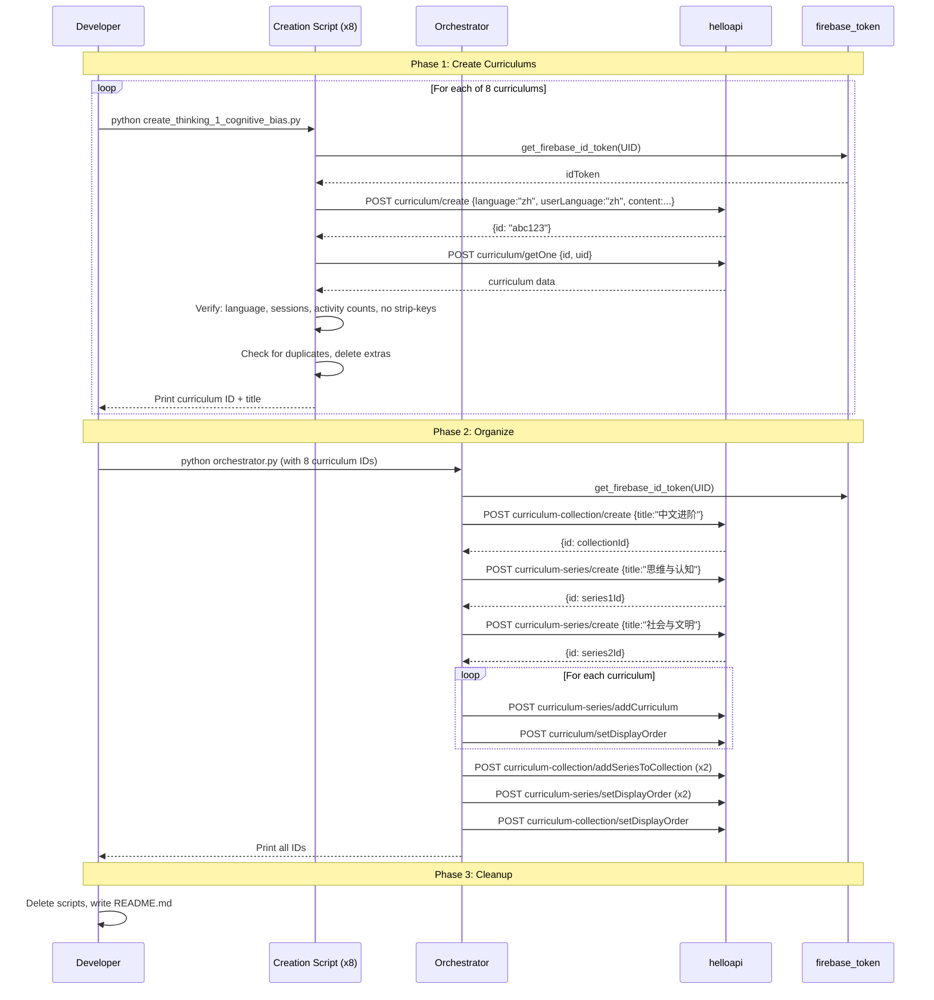

# Design Document: ZH-ZH Curriculum Creation

## Overview

This feature creates the first ZH-ZH (Chinese-for-Chinese-speakers) curriculum content on the platform, mirroring the EN-EN "Power English" model. The deliverable is 8 curriculums organized into 1 collection ("中文进阶") with 2 series of 4 curriculums each, plus the Python scripts to create them via the helloapi REST API.

The core insight: ZH-ZH is structurally identical to EN-EN — same 4-session pattern, same activity types, same 10-word vocabulary split. The only differences are: all text is in simplified Chinese, vocabulary targets advanced Chinese terms (成语, 书面语, domain terminology), and the content is conceived natively in Chinese rather than translated.

Each curriculum follows the proven 4-session pattern:
- Session 1: 11 activities teaching 5 words (W1)
- Session 2: 11 activities teaching 5 words (W2)
- Session 3: 6 activities reviewing all 10 words
- Session 4: 6 activities with full article + farewell

The implementation is a set of 9 Python scripts (8 curriculum creation scripts + 1 orchestrator) that call the helloapi API, verify results, and clean up after themselves.

## Architecture

```mermaid
graph TD
    subgraph Scripts["Python Scripts (zh-zh-advanced-chinese/)"]
        O[orchestrator.py]
        C1[create_thinking_1_cognitive_bias.py]
        C2[create_thinking_2_decision_making.py]
        C3[create_thinking_3_memory.py]
        C4[create_thinking_4_attention.py]
        C5[create_society_1_language_thought.py]
        C6[create_society_2_city_logic.py]
        C7[create_society_3_trust.py]
        C8[create_society_4_algorithm_ethics.py]
    end

    subgraph API["helloapi.step.is"]
        CC[curriculum-collection/*]
        CS[curriculum-series/*]
        CU[curriculum/*]
    end

    subgraph Auth["Authentication"]
        FT[firebase_token.py]
    end

    C1 --> FT
    C2 --> FT
    C3 --> FT
    C4 --> FT
    C5 --> FT
    C6 --> FT
    C7 --> FT
    C8 --> FT
    O --> FT

    C1 --> CU
    C2 --> CU
    C3 --> CU
    C4 --> CU
    C5 --> CU
    C6 --> CU
    C7 --> CU
    C8 --> CU

    O --> CC
    O --> CS
    O --> CU
```



### Execution Flow



### Design Decisions

1. **Separate creation scripts per curriculum** (not a single mega-script): Each curriculum has ~2000+ characters of hand-written Chinese content. Keeping them separate prevents files from becoming unmanageable and allows independent execution/debugging.

2. **Orchestrator runs after all 8 curriculums exist**: The orchestrator takes curriculum IDs as input (hardcoded after Phase 1 completes). This decouples content creation from organizational structure, so a failed curriculum script doesn't affect others.

3. **Inline strip_keys()**: Each creation script defines its own `strip_keys()` function rather than importing from a shared module. This keeps scripts self-contained and matches the existing codebase pattern.

4. **No template functions for Chinese text**: All introAudio scripts, reading passages, descriptions, previews, and writing prompts are hand-written inline. The activity structure (types, order, data schema) uses helper functions, but text content is never generated via string interpolation.

## Components and Interfaces

### Component 1: Curriculum Creation Script (x8)

Each script is a standalone Python file that creates one curriculum.

**Interface:**
```python
# Inputs: None (all content is inline)
# Outputs: Prints curriculum ID and title to stdout
# Side effects: Creates one curriculum via API, verifies it, checks for duplicates

# Internal structure:
def strip_keys(obj: dict) -> dict:
    """Recursively remove auto-generated keys from a dict."""
    ...

def create_curriculum() -> str:
    """Create the curriculum and return its ID."""
    ...

def verify_curriculum(curriculum_id: str) -> None:
    """Fetch and verify the created curriculum."""
    ...

def check_duplicates(title: str) -> None:
    """Find and delete duplicate curriculums with the same title."""
    ...

if __name__ == "__main__":
    curriculum_id = create_curriculum()
    verify_curriculum(curriculum_id)
    check_duplicates(content["title"])
```

**API Calls:**
- `POST /curriculum/create` — create the curriculum
- `POST /curriculum/getOne` — fetch back for verification
- `POST /curriculum/list` — find duplicates by title
- `POST /curriculum/delete` — remove duplicates
- `POST /curriculum-series/removeCurriculum` — remove duplicate from series before deletion

### Component 2: Orchestrator Script

Single script that creates the collection, series, organizes curriculums, and sets display orders.

**Interface:**
```python
# Inputs: 8 curriculum IDs (hardcoded after Phase 1)
# Outputs: Prints collection ID, series IDs, and confirmation
# Side effects: Creates collection + 2 series, adds curriculums to series,
#               adds series to collection, sets all display orders

CURRICULUM_IDS = {
    "thinking_1": "...",  # filled in after creation
    "thinking_2": "...",
    "thinking_3": "...",
    "thinking_4": "...",
    "society_1": "...",
    "society_2": "...",
    "society_3": "...",
    "society_4": "...",
}
```

**API Calls:**
- `POST /curriculum-collection/create` — create "中文进阶" collection
- `POST /curriculum-series/create` (x2) — create both series
- `POST /curriculum-series/addCurriculum` (x8) — add curriculums to series
- `POST /curriculum/setDisplayOrder` (x8) — set curriculum order within series
- `POST /curriculum-collection/addSeriesToCollection` (x2) — add series to collection
- `POST /curriculum-series/setDisplayOrder` (x2) — set series order (100, 200)
- `POST /curriculum-collection/setDisplayOrder` — set collection order

### Component 3: Authentication (existing)

`firebase_token.py` at workspace root — imported via `sys.path` manipulation.

```python
import sys
sys.path.insert(0, "/home/ubuntu/nspaceresearch/design-curriculums")
from firebase_token import get_firebase_id_token

UID = "zs5AMpVfqkcfDf8CJ9qrXdH58d73"
token = get_firebase_id_token(UID)
```

### Component 4: README.md (post-cleanup)

After all scripts are deleted, the README documents:
- Collection ID and title
- Series IDs and titles
- Curriculum IDs, titles, display orders, and vocabulary words
- SQL queries to find everything in the DB
- Creation method description
- Enough context to recreate if needed

## Data Models

### Curriculum Content JSON Structure

```json
{
  "title": "认知偏差的隐形陷阱",
  "description": "为什么你总是...(persuasive copy in Chinese)",
  "preview": {
    "text": "想象一下...(~150 words Chinese preview)"
  },
  "learningSessions": [
    {
      "title": "第一课",
      "activities": [
        {
          "activityType": "introAudio",
          "title": "课程介绍",
          "description": "介绍本课主题和五个核心词汇。",
          "practiceMinutes": 3,
          "data": {
            "text": "欢迎来到...(500-800 chars teaching script)"
          }
        },
        {
          "activityType": "viewFlashcards",
          "title": "词卡：认知偏差",
          "description": "学习5个词：词1、词2、词3、词4、词5",
          "practiceMinutes": 6,
          "data": {
            "vocabList": [
              {
                "word": "锚定效应",
                "definition": "指人们在做决策时...",
                "exampleSentence": "消费者常常受到锚定效应的影响..."
              }
            ],
            "audioSpeed": 1
          }
        },
        {
          "activityType": "speakFlashcards",
          "title": "词卡朗读：认知偏差",
          "description": "学习5个词：词1、词2、词3、词4、词5",
          "practiceMinutes": 6,
          "data": {
            "vocabList": [/* same as viewFlashcards */],
            "audioSpeed": 1
          }
        },
        {
          "activityType": "vocabLevel1",
          "title": "词汇练习一：认知偏差",
          "description": "学习5个词：词1、词2、词3、词4、词5",
          "practiceMinutes": 10,
          "data": {
            "vocabList": [/* same vocab */],
            "audioSpeed": 1
          }
        },
        {
          "activityType": "vocabLevel2",
          "title": "词汇练习二：认知偏差",
          "description": "学习5个词：词1、词2、词3、词4、词5",
          "practiceMinutes": 10,
          "data": {
            "vocabList": [/* same vocab */],
            "audioSpeed": 1
          }
        },
        {
          "activityType": "vocabLevel3",
          "title": "词汇练习三：认知偏差",
          "description": "学习5个词：词1、词2、词3、词4、词5",
          "practiceMinutes": 10,
          "data": {
            "vocabList": [/* same vocab */],
            "audioSpeed": 1
          }
        },
        {
          "activityType": "reading",
          "title": "阅读：认知偏差",
          "description": "当我们自信满满地做出一个决定时...",
          "practiceMinutes": 5,
          "data": {
            "text": "当我们自信满满地做出一个决定时...(excerpt with W1 words)"
          }
        },
        {
          "activityType": "speakReading",
          "title": "朗读：认知偏差",
          "description": "当我们自信满满地做出一个决定时...",
          "practiceMinutes": 5,
          "data": {
            "text": "(same as reading)"
          }
        },
        {
          "activityType": "readAlong",
          "title": "听读：认知偏差",
          "description": "听文章朗读并跟随阅读。",
          "practiceMinutes": 3,
          "data": {
            "text": "(same as reading)"
          }
        },
        {
          "activityType": "writingSentence",
          "title": "造句：认知偏差",
          "description": "用本课词汇造句练习。",
          "practiceMinutes": 10,
          "data": {
            "items": [
              {
                "prompt": "请用「锚定效应」造一个关于消费决策的句子。示例：商家利用锚定效应，先标出高价再打折，让消费者觉得自己占了便宜。",
                "targetVocab": "锚定效应"
              }
            ]
          }
        },
        {
          "activityType": "writingParagraph",
          "title": "写作：认知偏差",
          "description": "运用本课词汇写一段分析性文字。",
          "practiceMinutes": 10,
          "data": {
            "rubric": "使用至少3个本课词汇，逻辑清晰，论述有深度。",
            "prompts": ["请分析日常生活中最常见的认知偏差..."],
            "vocabList": ["锚定效应", "..."],
            "instructions": "请写一段200字左右的分析性文字..."
          }
        }
      ]
    },
    { "title": "第二课", "activities": ["(same 11-activity pattern with W2 words)"] },
    { "title": "复习", "activities": ["(6 activities: introAudio, viewFlashcards, vocabLevel1-3, writingParagraph with all 10 words)"] },
    { "title": "全文阅读", "activities": ["(6 activities: introAudio, reading, speakReading, readAlong, writingParagraph, introAudio farewell)"] }
  ]
}
```

### Activity Pattern Per Session

| Session | # | Activity Types (in order) |
|---|---|---|
| S1 (第一课) | 11 | introAudio, viewFlashcards, speakFlashcards, vocabLevel1, vocabLevel2, vocabLevel3, reading, speakReading, readAlong, writingSentence, writingParagraph |
| S2 (第二课) | 11 | introAudio, viewFlashcards, speakFlashcards, vocabLevel1, vocabLevel2, vocabLevel3, reading, speakReading, readAlong, writingSentence, writingParagraph |
| S3 (复习) | 6 | introAudio, viewFlashcards, vocabLevel1, vocabLevel2, vocabLevel3, writingParagraph |
| S4 (全文阅读) | 6 | introAudio, reading, speakReading, readAlong, writingParagraph, introAudio (farewell) |

### Vocabulary Data Model

Each vocabulary word in `vocabList`:
```json
{
  "word": "锚定效应",
  "definition": "指人们在做决策时，过度依赖最先获得的信息作为参考基准的心理倾向。",
  "exampleSentence": "消费者常常受到锚定效应的影响，看到原价999元打折到499元就觉得很划算。"
}
```

All three fields are in Chinese. No pinyin, no English translations.

### API Request/Response Models

**curriculum/create request:**
```json
{
  "firebaseIdToken": "...",
  "language": "zh",
  "userLanguage": "zh",
  "content": "{\"title\":\"认知偏差的隐形陷阱\",\"description\":\"...\",\"preview\":{\"text\":\"...\"},\"learningSessions\":[...]}"
}
```

**curriculum/create response:**
```json
{
  "id": "abc123def456",
  "title": "认知偏差的隐形陷阱",
  "language": "zh",
  "user_language": "zh",
  ...
}
```

### Strip Keys List

Keys that must never appear in new curriculum content:
`mp3Url`, `illustrationSet`, `chapterBookmarks`, `segments`, `whiteboardItems`, `userReadingId`, `lessonUniqueId`, `curriculumTags`, `taskId`, `imageId`

### Curriculum Inventory

| Series | # | Title | Topic Domain |
|---|---|---|---|
| 思维与认知 | 1 | 认知偏差的隐形陷阱 | Cognitive psychology |
| 思维与认知 | 2 | 决策的艺术与科学 | Decision science |
| 思维与认知 | 3 | 记忆的建筑学 | Memory & neuroscience |
| 思维与认知 | 4 | 注意力经济学 | Attention & economics |
| 社会与文明 | 5 | 语言如何塑造思维 | Linguistics & cognition |
| 社会与文明 | 6 | 城市的隐秘逻辑 | Urban studies |
| 社会与文明 | 7 | 信任的崩塌与重建 | Social trust |
| 社会与文明 | 8 | 算法时代的伦理困境 | Tech ethics |


## Correctness Properties

*A property is a characteristic or behavior that should hold true across all valid executions of a system — essentially, a formal statement about what the system should do. Properties serve as the bridge between human-readable specifications and machine-verifiable correctness guarantees.*

### Property 1: Language field correctness

*For any* ZH-ZH curriculum created by the creation scripts, the `language` field must be `"zh"` and the `userLanguage` (or `user_language` in the DB response) field must be `"zh"`.

**Validates: Requirements 2.1, 15.1, 15.2, 19.1**

### Property 2: 4-session structure with correct activity type sequences

*For any* ZH-ZH curriculum, the `learningSessions` array must have exactly 4 elements, and the activity types in each session must match the expected sequence exactly:
- Session 1 (index 0): `[introAudio, viewFlashcards, speakFlashcards, vocabLevel1, vocabLevel2, vocabLevel3, reading, speakReading, readAlong, writingSentence, writingParagraph]` (11 activities)
- Session 2 (index 1): `[introAudio, viewFlashcards, speakFlashcards, vocabLevel1, vocabLevel2, vocabLevel3, reading, speakReading, readAlong, writingSentence, writingParagraph]` (11 activities)
- Session 3 (index 2): `[introAudio, viewFlashcards, vocabLevel1, vocabLevel2, vocabLevel3, writingParagraph]` (6 activities)
- Session 4 (index 3): `[introAudio, reading, speakReading, readAlong, writingParagraph, introAudio]` (6 activities)

**Validates: Requirements 3.2, 3.3, 3.4, 3.5, 3.6, 19.2**

### Property 3: Vocabulary count and split

*For any* ZH-ZH curriculum, the total unique vocabulary words must be exactly 10, with Session 1's `viewFlashcards.data.vocabList` containing exactly 5 words (W1) and Session 2's `viewFlashcards.data.vocabList` containing exactly 5 different words (W2), and the union of W1 and W2 having no overlap.

**Validates: Requirements 3.1, 4.1, 16.3, 17.3**

### Property 4: Vocabulary uniqueness within a series

*For any* two curriculums within the same series, their vocabulary word sets (all 10 words each) must be completely disjoint — no word appears in more than one curriculum within a series. Equivalently, each series of 4 curriculums must have exactly 40 unique vocabulary words.

**Validates: Requirements 4.4, 16.4, 17.4**

### Property 5: Chinese-only learner-facing text

*For any* ZH-ZH curriculum, all learner-facing text fields — title, description, preview.text, all introAudio data.text, all reading data.text, all writingSentence item prompts, all writingParagraph prompts/instructions, all activity titles and descriptions, all session titles, and all vocabList word/definition/exampleSentence fields — must contain Chinese characters and must not contain Latin alphabet characters (English, Vietnamese, pinyin).

**Validates: Requirements 4.6, 5.1, 5.2, 5.3, 5.4, 5.5, 5.6, 5.7, 5.8, 5.9**

### Property 6: IntroAudio scripts contain expected vocabulary words

*For any* ZH-ZH curriculum, the introAudio text in each session must contain the vocabulary words relevant to that session:
- Session 1 introAudio: contains all 5 W1 words
- Session 2 introAudio: contains all 5 W2 words (and references W1 words)
- Session 3 introAudio: contains all 10 words
- Session 4 farewell introAudio (last activity): contains all 10 words

**Validates: Requirements 3.7, 3.8, 3.9, 3.11, 6.3, 6.5**

### Property 7: Reading passage integrity

*For any* ZH-ZH curriculum:
- The full article (Session 4 reading activity `data.text`) must be between 800 and 1200 Chinese characters and must contain all 10 vocabulary words
- Session 1's reading `data.text` must contain all 5 W1 words and must be a substring of the full article
- Session 2's reading `data.text` must contain all 5 W2 words and must be a substring of the full article
- Session 4's reading `data.text` must equal the full article

**Validates: Requirements 7.1, 7.2, 7.3, 7.4, 7.5**

### Property 8: Activity metadata completeness

*For any* activity in any session of any ZH-ZH curriculum:
- The activity must have non-empty `title` and `description` string fields
- The activity must have a `practiceMinutes` integer field matching the expected value for its `activityType` (introAudio: 3, viewFlashcards: 6, speakFlashcards: 6, vocabLevel1: 10, vocabLevel2: 10, vocabLevel3: 10, reading: 5, speakReading: 5, readAlong: 3, writingSentence: 10, writingParagraph: 10)
- Each session must have a non-empty `title` string field

**Validates: Requirements 9.1, 9.2, 9.3, 9.4, 9.5, 9.6, 9.7, 9.8, 9.9**

### Property 9: No auto-generated keys in content

*For any* ZH-ZH curriculum content JSON, recursively scanning all nested objects and arrays must find zero occurrences of any key in the strip-keys list: `mp3Url`, `illustrationSet`, `chapterBookmarks`, `segments`, `whiteboardItems`, `userReadingId`, `lessonUniqueId`, `curriculumTags`, `taskId`, `imageId`.

**Validates: Requirements 10.1, 19.3**

### Property 10: WritingSentence prompt format and vocabulary coverage

*For any* writingSentence activity in Sessions 1 and 2 of any ZH-ZH curriculum, each item in `data.items` must have a `prompt` field containing the `targetVocab` word, and the set of `targetVocab` values across all items must equal the session's vocabulary word set (W1 for Session 1, W2 for Session 2).

**Validates: Requirements 8.1, 8.2**

### Property 11: Session 3 writingParagraph uses both word groups

*For any* ZH-ZH curriculum, the Session 3 writingParagraph activity's `data.vocabList` must contain words from both the W1 group (Session 1 words) and the W2 group (Session 2 words).

**Validates: Requirements 8.4**

### Property 12: Deduplication keeps earliest

*For any* list of curriculum records with the same title and UID, the deduplication logic must retain the record with the earliest `created_at` timestamp and mark all others for deletion.

**Validates: Requirements 20.2**

## Error Handling

### API Errors

Each creation script handles API failures at multiple points:

1. **Authentication failure** (`firebase_token.get_firebase_id_token` raises): Print error and exit. The token exchange can fail if the service account key is invalid or Firebase is down.

2. **curriculum/create failure** (non-200 response): Print the response status and body, then exit. Common causes: malformed content JSON, missing `language`/`userLanguage` top-level params, server error.

3. **curriculum/getOne failure** (verification step): Print warning but don't delete — the curriculum may have been created successfully but the fetch failed. Log the ID for manual verification.

4. **Duplicate deletion failure**: Log the error but continue. Duplicate cleanup is best-effort — a failed deletion doesn't invalidate the primary curriculum.

### Content Validation Errors

The verification step in each creation script checks:
- `language` and `user_language` fields match `"zh"`
- `learningSessions` has exactly 4 elements
- Activity counts per session match `[11, 11, 6, 6]`
- No strip-keys found in content

If any check fails, the script prints a detailed error message identifying which check failed and the actual vs. expected values, but does not auto-delete the curriculum (to allow manual inspection).

### Orchestrator Errors

The orchestrator script handles failures in the organization phase:
- If collection creation fails, exit immediately (nothing else can proceed)
- If series creation fails, exit (curriculums exist but aren't organized — can be re-run)
- If addCurriculum or addSeriesToCollection fails, log the error and continue with remaining items
- If setDisplayOrder fails, log and continue (display order can be set manually later)

The orchestrator is designed to be idempotent where possible — re-running it after a partial failure should not create duplicate collections/series (it checks for existing ones by title first).

## Testing Strategy

Since this project has no test framework or CI pipeline (scripts are run directly with `python`), testing is built into the scripts themselves as verification steps.

### Unit Testing (Built into Scripts)

Each creation script includes inline verification after curriculum creation:

1. **Language verification**: Fetch the created curriculum and assert `language == "zh"` and `user_language == "zh"`
2. **Structure verification**: Assert `len(learningSessions) == 4` and activity counts match `[11, 11, 6, 6]`
3. **Activity type sequence verification**: Assert activity types in each session match the expected ordered list
4. **Strip-keys verification**: Recursively scan content for forbidden keys
5. **Duplicate check**: Query for same-title curriculums and clean up extras

The orchestrator includes:
1. **Collection/series existence check**: Verify created entities are fetchable
2. **Membership verification**: Verify curriculums are in the correct series
3. **Display order verification**: Verify orders are set correctly

### Property-Based Testing

Since there is no test framework in this repo, property-based tests would be implemented as standalone Python verification scripts using the `hypothesis` library if formal PBT were needed. However, given the nature of this project (one-time content creation scripts that are deleted after use), the properties are validated through the inline verification steps described above.

The correctness properties (Properties 1–12) map to specific verification checks in the creation scripts:

| Property | Verification Method |
|---|---|
| P1: Language fields | `verify_curriculum()` checks language/user_language |
| P2: Session structure | `verify_curriculum()` checks session count and activity type sequences |
| P3: Vocab count/split | Content construction ensures 5+5 split; verification counts vocabList lengths |
| P4: Vocab uniqueness | Orchestrator or manual check compares word sets across series |
| P5: Chinese-only text | `verify_curriculum()` scans text fields for Latin characters |
| P6: IntroAudio vocab | `verify_curriculum()` checks vocab words appear in introAudio text |
| P7: Reading integrity | `verify_curriculum()` checks article length, vocab presence, excerpt⊂article |
| P8: Activity metadata | `verify_curriculum()` checks title/description/practiceMinutes on every activity |
| P9: No strip-keys | `verify_curriculum()` recursively scans for forbidden keys |
| P10: WritingSentence coverage | `verify_curriculum()` checks targetVocab matches session vocab |
| P11: S3 writingParagraph scope | `verify_curriculum()` checks vocabList spans both W1 and W2 |
| P12: Dedup keeps earliest | `check_duplicates()` sorts by created_at and keeps first |

Each verification function prints `✓ PASS` or `✗ FAIL` with details for each check, making it easy to spot issues during the one-time creation process.

<!-- Feature: zh-zh-curriculum-creation, Property 1: Language field correctness -->
<!-- Feature: zh-zh-curriculum-creation, Property 2: 4-session structure with correct activity type sequences -->
<!-- Feature: zh-zh-curriculum-creation, Property 3: Vocabulary count and split -->
<!-- Feature: zh-zh-curriculum-creation, Property 4: Vocabulary uniqueness within a series -->
<!-- Feature: zh-zh-curriculum-creation, Property 5: Chinese-only learner-facing text -->
<!-- Feature: zh-zh-curriculum-creation, Property 6: IntroAudio scripts contain expected vocabulary words -->
<!-- Feature: zh-zh-curriculum-creation, Property 7: Reading passage integrity -->
<!-- Feature: zh-zh-curriculum-creation, Property 8: Activity metadata completeness -->
<!-- Feature: zh-zh-curriculum-creation, Property 9: No auto-generated keys in content -->
<!-- Feature: zh-zh-curriculum-creation, Property 10: WritingSentence prompt format and vocabulary coverage -->
<!-- Feature: zh-zh-curriculum-creation, Property 11: Session 3 writingParagraph uses both word groups -->
<!-- Feature: zh-zh-curriculum-creation, Property 12: Deduplication keeps earliest -->
