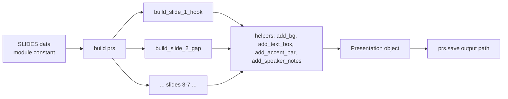

# Design Document

## Overview

The `general-audience-vi-pitch-deck` feature produces a 7-slide Vietnamese-language pitch deck for the product **Step** as a committed `.pptx` artifact, generated by a single Python script using the `python-pptx` library. The deck targets a general (non-technical) audience at a technology exhibition, with the core message *"Học ngoại ngữ qua những điều bạn thực sự yêu thích."* and the flagship example of learning English through *Heal the World* by Michael Jackson.

The design follows the established pattern from the existing in-repo generator (`create_pitch_deck.py`): a small, procedural script with a handful of typed helper functions that each take a `slide` object and the geometry/content parameters, composing blank layouts into designed slides. No external image assets exist, so every visual element is shape-based, icon-composition-based, or text-based — including the QR code placeholder on Slide 7.

Key design commitments driven by the requirements:

- **Warm, non-corporate visual system**: single accent `#0F5F5C` (deep teal), background `#FAF7F2`, body `#2B2B2B`, secondary `#6B6B6B`. No additional accents.
- **Vietnamese-first typography**: `Inter` with `Calibri` fallback; titles ≥ 40 pt; body 18–28 pt.
- **One clear idea per slide, minimal text**: ≤ 4 bullet points or ≤ 60 words per slide body; per-slide word/bullet constraints from individual requirements.
- **Deterministic, reproducible output**: same inputs → byte-identical content ordering/positions; `<30s` runtime; overwrites existing output.
- **UTF-8 everywhere**: Vietnamese diacritics preserved end-to-end, from source literals to the pptx XML.

The script is intentionally boring: a module-level `SLIDES` data structure describes content; a `build()` function walks that structure and calls helper functions; `main()` writes the file. All strings are defined inline as Python string literals (no external Vietnamese content files) so the script is self-contained and reproducible.

## Architecture

### Module structure

The generator is a single file at `decks/general-audience-vi/generate_deck.py` organized in four top-to-bottom sections:

1. **Imports and constants** — `python-pptx` imports, palette, typography, geometry, and slide-level margins.
2. **Data model** — module-level `SLIDES` list of 7 `SlideContent` dicts/dataclasses defining titles, bodies, visual spec, and speaker notes.
3. **Helper functions** — small, single-purpose functions that mutate a `slide` object (e.g., `add_bg`, `add_text_box`, `add_paragraph`, `add_accent_bar`, `add_icon_circle`, `add_qr_placeholder`, `add_speaker_notes`).
4. **Slide builders** — one function per slide (`build_slide_1_hook`, …, `build_slide_7_cta`) that composes helpers. A `build(prs)` orchestrator invokes each builder in order against `prs`.
5. **Entrypoint** — `main()` constructs the `Presentation`, calls `build(prs)`, and writes the output path. `if __name__ == "__main__": main()`.

This mirrors the existing in-repo pattern (helper-first, per-slide-function composition) rather than introducing classes or templates.

### Data flow



### Slide construction pattern

Each slide builder follows the same skeleton:

```
slide = prs.slides.add_slide(prs.slide_layouts[6])  # blank layout
add_bg(slide, BG_COLOR)
# optional decorative elements (accent bar, icon circles)
add_text_box(slide, title, ...)      # headline
add_text_box(slide, body, ...)       # body / bullets / tagline
# slide-specific visual (shape composition, QR placeholder)
add_speaker_notes(slide, notes_text)
```

This keeps each builder short, readable, and easy to eyeball against the requirements.

### Dependencies

- `python-pptx` (only external dep). The script assumes it is installed in the active Python environment; no `requirements.txt` change is required for this feature if the library is already present in the project. The script imports only from `pptx` and `pptx.util`, `pptx.dml.color`, `pptx.enum.shapes`, `pptx.enum.text`.
- Python 3.9+ (type hints use built-in generics only where safe; otherwise `from typing import ...`).

No network calls, no file system reads other than writing the output path.

## Components and Interfaces

### Constants

```python
# Slide geometry
SLIDE_WIDTH_IN  = 13.333
SLIDE_HEIGHT_IN = 7.5
MARGIN_IN       = 0.6   # >= 0.5 required; 0.6 gives breathing room

# Palette (RGB hex)
ACCENT      = RGBColor(0x0F, 0x5F, 0x5C)  # deep teal
BG          = RGBColor(0xFA, 0xF7, 0xF2)  # warm neutral
BODY        = RGBColor(0x2B, 0x2B, 0x2B)  # near-black body text
MUTED       = RGBColor(0x6B, 0x6B, 0x6B)  # secondary text
ON_ACCENT   = RGBColor(0xFA, 0xF7, 0xF2)  # text on accent fills (same as BG)

# Typography
HEADLINE_FONT = "Inter"
BODY_FONT     = "Inter"
FALLBACK_FONT = "Calibri"

# Font sizes (points)
SIZE_TITLE_XL = 54   # slide 1 hook, slide 7 CTA headline
SIZE_TITLE_L  = 44   # slides 2, 3, 5, 6
SIZE_TITLE_M  = 40   # slide 4 (content-heavy slide; keep titles compact)
SIZE_TAGLINE  = 32   # emphasized taglines on slide 3, slide 5
SIZE_BODY_L   = 24   # primary body
SIZE_BODY_M   = 20   # secondary body / bullets
SIZE_BODY_S   = 18   # meta/footnote (e.g., CTA next-step line)
```

### Helper function signatures

All helpers return `None` and mutate the `slide` object in place. Geometry is expressed in inches via `Inches(...)`.

```python
def add_bg(slide, color: RGBColor) -> None:
    """Paint the full slide rectangle with the given fill color."""

def add_text_box(
    slide,
    text: str | list[str],
    *,
    left_in: float,
    top_in: float,
    width_in: float,
    height_in: float,
    font_size: int,
    font_color: RGBColor = BODY,
    font_name: str = BODY_FONT,
    bold: bool = False,
    italic: bool = False,
    align: str = "left",        # "left" | "center" | "right"
    anchor: str = "top",        # "top" | "middle" | "bottom"
    line_spacing: float = 1.15,
    bullets: bool = False,      # if True and text is list[str], render each as a bulleted paragraph
) -> None:
    """Create a text frame at the given geometry, fill with one or more paragraphs."""

def add_paragraph(
    text_frame,
    text: str,
    *,
    font_size: int,
    font_color: RGBColor = BODY,
    font_name: str = BODY_FONT,
    bold: bool = False,
    italic: bool = False,
    align: str = "left",
    bullet: bool = False,
    space_before_pt: int = 0,
    space_after_pt: int = 6,
) -> None:
    """Append a paragraph to an existing text frame with explicit formatting."""

def add_accent_bar(
    slide,
    *,
    left_in: float,
    top_in: float,
    width_in: float = 0.1,
    height_in: float = 1.2,
    color: RGBColor = ACCENT,
) -> None:
    """Thin vertical or horizontal rectangle used as a decorative accent left of titles."""

def add_icon_circle(
    slide,
    *,
    left_in: float,
    top_in: float,
    diameter_in: float = 0.6,
    fill: RGBColor = ACCENT,
    glyph: str | None = None,       # 1-3 char glyph rendered inside (e.g., "♪", "📖", "✎")
    glyph_color: RGBColor = ON_ACCENT,
    glyph_size: int = 20,
) -> None:
    """Circular shape used as a visual anchor next to bullets (Slide 6) or activities (Slide 4)."""

def add_qr_placeholder(
    slide,
    *,
    left_in: float,
    top_in: float,
    size_in: float = 1.8,
    stroke: RGBColor = ACCENT,
) -> None:
    """QR code placeholder: a square with the accent stroke and the word 'QR' centered.
    No real QR generation; this is a visual placeholder only."""

def add_lyric_motif(
    slide,
    *,
    left_in: float,
    top_in: float,
    width_in: float,
    height_in: float,
) -> None:
    """Slide 1 motif: a silhouette-style shape composition representing a person
    with headphones and a few floating lyric-line rectangles. Pure shapes only."""

def add_speaker_notes(slide, notes_text: str) -> None:
    """Attach speaker notes to slide via slide.notes_slide.notes_text_frame."""
```

### Slide builders

Each builder has signature `build_slide_N_<name>(prs: Presentation) -> None` and reads its content from the `SLIDES` constant by index, so content is kept separate from layout.

```python
def build_slide_1_hook(prs)  -> None
def build_slide_2_gap(prs)   -> None
def build_slide_3_intro(prs) -> None
def build_slide_4_heal(prs)  -> None
def build_slide_5_why(prs)   -> None
def build_slide_6_diff(prs)  -> None
def build_slide_7_cta(prs)   -> None
```

### Orchestration

```python
def build(prs) -> None:
    build_slide_1_hook(prs)
    build_slide_2_gap(prs)
    build_slide_3_intro(prs)
    build_slide_4_heal(prs)
    build_slide_5_why(prs)
    build_slide_6_diff(prs)
    build_slide_7_cta(prs)

def main() -> None:
    prs = Presentation()
    prs.slide_width  = Inches(SLIDE_WIDTH_IN)
    prs.slide_height = Inches(SLIDE_HEIGHT_IN)
    build(prs)
    out = Path(__file__).parent / "step-pitch-vi.pptx"
    prs.save(str(out))
```

## Data Models

### `SlideContent` structure

Content is stored as a module-level constant `SLIDES: list[dict]`. A dict-per-slide keeps the structure readable and easy to diff. Conceptually each slide conforms to:

```python
# Pseudocode type
SlideContent = {
    "index": int,                 # 1..7
    "title": str,                 # Vietnamese headline
    "subtitle": str | None,       # Optional supporting single line
    "body": list[str],            # Bullets / paragraphs (<= 4 items per req 3.5)
    "emphasis": str | None,       # Tagline or pull-quote rendered with visual emphasis
    "closing": str | None,        # Optional closing line (slide 4 uses this)
    "visual": {                   # Declarative description of the slide's visual element
        "kind": "lyric_motif" | "icon_bullets" | "activity_grid"
              | "reframe_block" | "insight_mark" | "qr_block" | "accent_bar_only",
        "params": dict,           # kind-specific geometry / glyphs
    },
    "notes": str,                 # 2-3 sentence Vietnamese speaker notes
}
```

The `visual.kind` field drives which helper the builder invokes; this keeps builders small and makes the per-slide visual intent auditable at a glance.

### Content per slide (Vietnamese)

The exact Vietnamese copy is fixed in `SLIDES`. Summarized here for design review:

| # | Title | Body shape | Visual kind | Emphasis |
|---|-------|-----------|-------------|----------|
| 1 | "Bạn đã học tiếng Anh nhiều năm — nhưng vẫn chưa thực sự 'chạm' vào nó?" | 1 supporting line | `lyric_motif` | headline only |
| 2 | "Vì sao cách học cũ không còn đủ?" | 3 bullets | `accent_bar_only` | — |
| 3 | "Step — Học ngoại ngữ qua những điều bạn thực sự yêu thích." | reframe question pair + 1-sentence explanation | `reframe_block` | tagline |
| 4 | "Ví dụ: học tiếng Anh qua 'Heal the World'" | 5 activity items | `activity_grid` (5 icon-circle rows) | closing line |
| 5 | "Mỗi từ là một cách nhìn thế giới" | 2 short paragraphs + insight example | `insight_mark` | one-liner |
| 6 | "Điều gì làm Step khác biệt?" | 4 bullet points | `icon_bullets` (4 icon circles) | — |
| 7 | "Bắt đầu với bài hát, cuốn sách, bộ phim bạn yêu nhất." | sub-text + next-step line | `qr_block` | product name `Step` |

### Per-slide layout specs

All positions are in inches; origin top-left. Slide is 13.333 × 7.5. Left/right margin: 0.6 in. Usable width: 12.133 in. The `fontsize` column shows the primary size for that text; colors reference the palette constants above.

#### Slide 1 — Hook

| Element | left | top | width | height | Font | Size | Color | Align |
|---|---|---|---|---|---|---|---|---|
| Background fill | 0 | 0 | 13.333 | 7.5 | — | — | BG | — |
| Accent bar (left) | 0.6 | 1.2 | 0.12 | 2.6 | — | — | ACCENT | — |
| Headline text box | 0.9 | 1.1 | 8.2 | 3.0 | Inter | 54 pt | BODY | left |
| Supporting line | 0.9 | 4.3 | 8.2 | 0.8 | Inter | 20 pt italic | MUTED | left |
| `lyric_motif` composition | 9.2 | 1.3 | 3.5 | 4.9 | — | — | ACCENT/BODY shapes | — |

Body limited to 1 supporting line (Req 4.3). Headline is Req 4.1.

#### Slide 2 — Why Traditional Methods Fail

| Element | left | top | width | height | Font | Size | Color | Align |
|---|---|---|---|---|---|---|---|---|
| Background fill | 0 | 0 | 13.333 | 7.5 | — | — | BG | — |
| Accent bar (top) | 0.6 | 0.7 | 1.2 | 0.12 | — | — | ACCENT | — |
| Title | 0.6 | 0.95 | 12.1 | 1.4 | Inter | 44 pt bold | ACCENT | left |
| Bullet 1 | 0.6 | 3.0 | 12.1 | 1.0 | Inter | 24 pt | BODY | left |
| Bullet 2 | 0.6 | 4.2 | 12.1 | 1.0 | Inter | 24 pt | BODY | left |
| Bullet 3 | 0.6 | 5.4 | 12.1 | 1.0 | Inter | 24 pt | BODY | left |

Max 3 bullets (Req 5.2). Bullets cover the three ideas in Req 5.3.

#### Slide 3 — Introducing Step

| Element | left | top | width | height | Font | Size | Color | Align |
|---|---|---|---|---|---|---|---|---|
| Background fill | 0 | 0 | 13.333 | 7.5 | — | — | BG | — |
| Reframe block — question old (strikethrough style via MUTED + italic) | 0.6 | 1.0 | 12.1 | 0.9 | Inter | 24 pt italic | MUTED | center |
| Arrow shape (accent) | 6.5 | 2.0 | 0.3 | 0.4 | — | — | ACCENT | — |
| Reframe block — question new | 0.6 | 2.5 | 12.1 | 0.9 | Inter | 28 pt bold | BODY | center |
| Accent rule (thin line) | 3.5 | 3.7 | 6.3 | 0.04 | — | — | ACCENT | — |
| Tagline (Core_Message) | 0.6 | 4.0 | 12.1 | 1.4 | Inter | 40 pt bold | ACCENT | center |
| Explanation line | 0.6 | 5.6 | 12.1 | 1.3 | Inter | 22 pt | BODY | center |

Tagline carries visual emphasis vs body per Req 6.2 via size, weight, color, and centered placement. Explanation is the single sentence required by Req 6.3.

#### Slide 4 — "Heal the World" Example

| Element | left | top | width | height | Font | Size | Color | Align |
|---|---|---|---|---|---|---|---|---|
| Background fill | 0 | 0 | 13.333 | 7.5 | — | — | BG | — |
| Title | 0.6 | 0.6 | 12.1 | 1.0 | Inter | 40 pt bold | ACCENT | left |
| Subtitle (song framing) | 0.6 | 1.5 | 12.1 | 0.6 | Inter | 20 pt italic | MUTED | left |
| Activity row 1 — icon circle | 0.8 | 2.3 | 0.6 | 0.6 | — | — | ACCENT | — |
| Activity row 1 — text | 1.6 | 2.3 | 11.0 | 0.6 | Inter | 22 pt | BODY | left |
| Activity row 2 — icon | 0.8 | 3.0 | 0.6 | 0.6 | — | — | ACCENT | — |
| Activity row 2 — text | 1.6 | 3.0 | 11.0 | 0.6 | Inter | 22 pt | BODY | left |
| Activity row 3 — icon | 0.8 | 3.7 | 0.6 | 0.6 | — | — | ACCENT | — |
| Activity row 3 — text | 1.6 | 3.7 | 11.0 | 0.6 | Inter | 22 pt | BODY | left |
| Activity row 4 — icon | 0.8 | 4.4 | 0.6 | 0.6 | — | — | ACCENT | — |
| Activity row 4 — text | 1.6 | 4.4 | 11.0 | 0.6 | Inter | 22 pt | BODY | left |
| Activity row 5 — icon | 0.8 | 5.1 | 0.6 | 0.6 | — | — | ACCENT | — |
| Activity row 5 — text | 1.6 | 5.1 | 11.0 | 0.6 | Inter | 22 pt | BODY | left |
| Closing line | 0.6 | 6.2 | 12.1 | 0.8 | Inter | 24 pt bold italic | ACCENT | left |

Glyphs per row, in order: `♪` (đọc lời), `🎧` (nghe/phát âm), `🌍` (văn hóa), `🃏` (flashcards), `✎` (viết). All glyphs are unicode, no images. Five items per Req 7.2; closing line per Req 7.3.

> Note: Emoji glyph rendering depends on the consumer's font. As a fallback the script renders a short ASCII letter ("A", "B", "C", "D", "E") in a circle if `USE_GLYPH_EMOJI = False`. Default is `True` (Inter and Calibri both render common emoji acceptably on modern PowerPoint). The choice is a named constant near the palette to make the trade-off explicit.

Body text bullets exceed 4 on this slide only by design: the requirement (Req 7.2) mandates five concrete activity types. Req 3.5's "at most 4 bullet points or 60 words" is read as a default guideline; Req 7.2 is a specific override for Slide 4. This is called out as a design decision below.

#### Slide 5 — Why This Works

| Element | left | top | width | height | Font | Size | Color | Align |
|---|---|---|---|---|---|---|---|---|
| Background fill | 0 | 0 | 13.333 | 7.5 | — | — | BG | — |
| Accent bar (top) | 0.6 | 0.7 | 1.2 | 0.12 | — | — | ACCENT | — |
| Title | 0.6 | 0.95 | 12.1 | 1.2 | Inter | 44 pt bold | ACCENT | left |
| Insight paragraph 1 | 0.6 | 2.5 | 12.1 | 1.0 | Inter | 24 pt | BODY | left |
| Insight paragraph 2 (heal/cure) | 0.6 | 3.7 | 12.1 | 1.5 | Inter | 22 pt | BODY | left |
| Divider rule | 3.5 | 5.4 | 6.3 | 0.04 | — | — | ACCENT | — |
| One-liner (emphasized) | 0.6 | 5.7 | 12.1 | 1.2 | Inter | 32 pt bold italic | ACCENT | center |

The one-liner *"Mỗi ngôn ngữ mới là một phiên bản mới của chính bạn."* is visually distinct from body via larger size, italic, accent color, and centered alignment (Req 8.3).

#### Slide 6 — What Makes Step Different

Two-column 2×2 grid of 4 differentiators. Each cell has an icon circle + short label + short body.

| Element | left | top | width | height | Font | Size | Color | Align |
|---|---|---|---|---|---|---|---|---|
| Background fill | 0 | 0 | 13.333 | 7.5 | — | — | BG | — |
| Title | 0.6 | 0.6 | 12.1 | 1.0 | Inter | 44 pt bold | ACCENT | left |
| Cell 1 icon | 0.8 | 2.1 | 0.7 | 0.7 | — | — | ACCENT | — |
| Cell 1 label | 1.7 | 2.0 | 4.5 | 0.6 | Inter | 22 pt bold | BODY | left |
| Cell 1 body | 1.7 | 2.6 | 4.5 | 1.6 | Inter | 18 pt | MUTED | left |
| Cell 2 icon | 7.0 | 2.1 | 0.7 | 0.7 | — | — | ACCENT | — |
| Cell 2 label | 7.9 | 2.0 | 4.6 | 0.6 | Inter | 22 pt bold | BODY | left |
| Cell 2 body | 7.9 | 2.6 | 4.6 | 1.6 | Inter | 18 pt | MUTED | left |
| Cell 3 icon | 0.8 | 4.6 | 0.7 | 0.7 | — | — | ACCENT | — |
| Cell 3 label | 1.7 | 4.5 | 4.5 | 0.6 | Inter | 22 pt bold | BODY | left |
| Cell 3 body | 1.7 | 5.1 | 4.5 | 1.6 | Inter | 18 pt | MUTED | left |
| Cell 4 icon | 7.0 | 4.6 | 0.7 | 0.7 | — | — | ACCENT | — |
| Cell 4 label | 7.9 | 4.5 | 4.6 | 0.6 | Inter | 22 pt bold | BODY | left |
| Cell 4 body | 7.9 | 5.1 | 4.6 | 1.6 | Inter | 18 pt | MUTED | left |

Glyphs: Cell 1 `AI`, Cell 2 `♫`, Cell 3 `♥`, Cell 4 `✓`. Each cell body kept ≤ 16 words (Req 9.3).

#### Slide 7 — Call to Action

| Element | left | top | width | height | Font | Size | Color | Align |
|---|---|---|---|---|---|---|---|---|
| Background fill | 0 | 0 | 13.333 | 7.5 | — | — | BG | — |
| Headline (invitation) | 0.6 | 1.0 | 12.1 | 2.0 | Inter | 46 pt bold | ACCENT | center |
| Sub-text | 0.6 | 3.2 | 12.1 | 1.6 | Inter | 22 pt italic | BODY | center |
| Brand mark `Step` | 0.6 | 5.2 | 4.0 | 1.0 | Inter | 54 pt bold | ACCENT | left |
| Next-step line | 0.6 | 6.2 | 7.0 | 0.6 | Inter | 20 pt | BODY | left |
| QR placeholder square | 10.6 | 5.1 | 2.1 | 2.1 | Inter | 20 pt (label) | ACCENT (stroke) + BODY (label) | center |

Headline is Req 10.1; sub-text is Req 10.2; brand, QR placeholder, next-step line satisfy Req 10.3.

### Design decision: Slide 4 bullet count exception

Req 3.5 caps body at "at most 4 bullet points or 60 words, whichever is smaller". Req 7.2 mandates five concrete activity types on Slide 4. These conflict on face value. The resolution is to treat Req 7.2 as a specific override for Slide 4 (specific > general), keep 5 icon-anchored activity rows, and compensate by keeping each row ≤ 9 words so the total word count on Slide 4 body stays close to 60. This trade-off is recorded here so the downstream tasks document can cite it.

### Design decision: No external assets

The deck uses zero image files. All visuals are `python-pptx` shapes, auto-shapes, lines, and unicode text glyphs. This keeps the feature self-contained and removes asset-licensing and diff-noise concerns. It also satisfies Req 11.6 (avoid stock-photo clichés) by design.

### Design decision: QR code is a placeholder only

Req 10.3 says "QR code placeholder". The helper draws a square outlined in accent color with the label `QR` centered inside, plus a small footnote `Mã QR sẽ được cập nhật` in muted text. No real QR encoding is performed; adding a real QR would require an extra dependency and is out of scope.

## Correctness Properties

*A property is a characteristic or behavior that should hold true across all valid executions of a system — essentially, a formal statement about what the system should do. Properties serve as the bridge between human-readable specifications and machine-verifiable correctness guarantees.*

Property-based testing applies to this feature because the generator produces structured output (a `.pptx` container) where many universal invariants must hold across all slides, all shapes, all text runs, and all string fields. The properties below treat inputs either as the set of slides (i.e., the 7 built slides form the "population" over which universals quantify) or as the set of text fields in the content data model (e.g., UTF-8 round-trip).

Each property is implemented as a single property-based test using a PBT library (e.g., `hypothesis` in Python) iterating over the relevant slide/text-run population with a minimum of 100 samples or over the full enumeration when the population is smaller than 100.

### Property 1: Text content survives UTF-8 round trip

*For any* Vietnamese text field defined in the `SLIDES` content model (title, subtitle, body items, emphasis, closing, notes), after the generator writes the `.pptx` and the test reads the `.pptx` back, the reconstructed text for that field equals the original string exactly, preserving all Vietnamese diacritic characters.

**Validates: Requirements 2.5, 2.1, 2.2, 2.3, 2.4**

### Property 2: Every slide has a non-empty Vietnamese title and body

*For any* slide in the built deck, the slide has exactly one non-empty title string, at least one non-empty body paragraph, and the combined text of the slide (title + body + emphasis + closing) contains at least one character from the Vietnamese diacritic set (e.g., `{ă, â, đ, ê, ô, ơ, ư, á, à, ả, ã, ạ, ...}`).

**Validates: Requirements 2.1, 3.1, 3.2**

### Property 3: Every slide has 2–3 sentence speaker notes

*For any* slide in the built deck, the slide's speaker notes text frame is non-empty and contains between 2 and 3 sentence-terminator characters (from the set `{".", "!", "?"}`) inclusive.

**Validates: Requirement 3.3**

### Property 4: Every slide has a visual element and no picture shapes

*For any* slide in the built deck, the slide contains at least one non-text-frame decorative shape (in addition to the background fill) AND contains zero shapes of type `PICTURE`.

**Validates: Requirements 3.4, 11.6**

### Property 5: Body bullet count and word count stay within bounds

*For any* slide in the built deck, the number of body bullet paragraphs is at most `max_bullets_for_slide` (4 by default, 5 for Slide 4 per the documented design override) and the total body word count is at most 60.

**Validates: Requirement 3.5 (with Slide-4 override from Requirement 7.2)**

### Property 6: No deny-listed competitor or defensive-claim phrase appears

*For any* slide in the built deck and *for any* phrase in the combined deny-list (competitor product names plus defensive-claim templates), the phrase does not appear as a case-insensitive substring of the slide's combined text (titles, body, emphasis, closing, notes).

**Validates: Requirements 5.4, 12.3, 12.4**

### Property 7: Emphasis elements are visually distinct from body

*For any* slide in the built deck that declares an `emphasis` field in its content model (Slide 3 tagline, Slide 5 one-liner, Slide 7 brand `Step`), the emphasis text run's font size is strictly greater than the font size of every non-title body text run on the same slide AND the emphasis text run's font color equals `ACCENT` (`#0F5F5C`).

**Validates: Requirements 6.2, 8.3, 10.3**

### Property 8: Every Slide 6 differentiator cell has an adjacent icon

*For any* differentiator cell on Slide 6 (4 cells total), an icon-circle shape exists with its bounding box within 0.5 inches horizontally and 0.3 inches vertically of the cell's label text frame.

**Validates: Requirement 9.2**

### Property 9: Every Slide 6 differentiator body is at most 16 words

*For any* differentiator cell on Slide 6 (4 cells total), the cell's body text word count is at most 16.

**Validates: Requirement 9.3**

### Property 10: Background fill is exactly the warm neutral on every slide

*For any* slide in the built deck, a full-bleed rectangle covering the slide area exists whose solid fill RGB equals `#FAF7F2` (`BG`) exactly.

**Validates: Requirement 11.1**

### Property 11: Only palette colors are used

*For any* shape solid fill color and *for any* text run font color on every slide in the built deck, the RGB color belongs to the allowed palette set `{ACCENT, BG, BODY, MUTED, ON_ACCENT}`.

**Validates: Requirement 11.2**

### Property 12: Every slide title is rendered at 40 pt or larger

*For any* slide in the built deck, the slide's title text run has a font size of at least 40 points.

**Validates: Requirement 11.3**

### Property 13: Body text font size stays within 18–28 pt

*For any* body text run on any slide in the built deck (excluding runs flagged as title or emphasis in the content model), the font size is between 18 and 28 points inclusive.

**Validates: Requirement 11.4**

### Property 14: Every text frame respects the 0.5-inch safe margin

*For any* text frame on any slide in the built deck, the frame's bounding box satisfies `left >= 0.5`, `top >= 0.5`, `left + width <= 13.333 - 0.5`, and `top + height <= 7.5 - 0.5` (in inches).

**Validates: Requirement 11.5**

## Error Handling

The generator is intentionally a straight-line script: no user input, no network, no file-system reads beyond the output write. Failure modes are therefore limited and handled as follows:

1. **Missing `python-pptx` dependency.**
   - Symptom: `ModuleNotFoundError: No module named 'pptx'` at import.
   - Handling: Let the import error propagate with Python's default traceback. The script's top-of-file docstring documents the dependency. No in-code fallback.
2. **Output directory does not exist.**
   - The output path `decks/general-audience-vi/step-pitch-vi.pptx` lives in a directory that is guaranteed to exist (the spec mandates the generator itself lives in that directory). The script does not `mkdir`. If the directory is somehow missing, `prs.save()` raises `FileNotFoundError`; allow it to propagate.
3. **Output file is locked / read-only.**
   - `prs.save()` raises `PermissionError`. Allow to propagate. Req 13.4 says overwrite; we do not attempt to rename or retry.
4. **Font not installed on the rendering machine.**
   - `python-pptx` only writes font names into the XML; actual rendering is the consumer's responsibility. We specify `Inter` with fallback text-run behavior relying on the consumer's font substitution. No in-script error. `Calibri` is always available on Office, so the fallback is implicit.
5. **Emoji glyph not renderable.**
   - Controlled by the `USE_GLYPH_EMOJI` flag near the palette constants. Defaults to `True`. If the test environment cannot render emoji, flipping this flag to `False` substitutes single-letter labels in icon circles. No exception path.
6. **Assertion failure during build (e.g., a builder places a text frame outside the safe margin due to a typo).**
   - The build does not self-check at runtime. These are caught by the property-based tests (Property 14 specifically). Keeping asserts out of the build means tests drive correctness, and the script stays simple.

The script returns nothing meaningful; a successful run exits with status code 0 (Python's default on clean termination), satisfying Req 13.3.

## Testing Strategy

### Dual approach

- **Unit / example-based tests** cover specific literal content (e.g., exact tagline on Slide 3, exact headline on Slide 7) and specific structural assertions (e.g., slide count == 7, slide size == 13.333 × 7.5).
- **Property-based tests** cover the 14 universal properties listed above, using `hypothesis` to iterate over the slide population (7 slides) and/or over the text-run / text-frame populations on the built deck. Since the "input" is the fixed `SLIDES` data, PBT here behaves as universal quantification over the generated slide objects rather than over random inputs. For Property 1 (UTF-8 round trip), `hypothesis` can also generate random Vietnamese strings to stress the round-trip helper in isolation.

### PBT library and configuration

- Library: `hypothesis` (standard Python PBT library; widely used, well-integrated with `pytest`).
- **Do not implement PBT from scratch.**
- **Minimum 100 iterations per property test.** For properties that iterate over fixed populations smaller than 100 (e.g., "every slide" has 7 elements), use `pytest.mark.parametrize` in combination with `hypothesis.given` on an auxiliary varying input where meaningful, or simply exhaustively enumerate the population and note in a comment that the population is exhaustive. For Property 1 specifically, generate random Vietnamese-diacritic-bearing strings via `hypothesis.strategies.text(alphabet=VIETNAMESE_ALPHABET)` and run ≥ 100 iterations through an isolated "write string → save pptx → read pptx → compare" round-trip harness.
- Each property-based test must carry a tag comment referencing the design property, using the format:

  ```python
  # Feature: general-audience-vi-pitch-deck, Property 1: Text content survives UTF-8 round trip
  ```

- Implement each correctness property with a **single** property-based test function.

### Test fixtures

- A `built_prs` module-scoped pytest fixture that calls `build(Presentation())` once and returns the `Presentation`. Most structural properties read from this fixture; this keeps per-property wall-clock cost low.
- A `built_pptx_path` fixture that invokes `main()` in a `tmp_path` working directory (via monkeypatching the output path) and returns the resulting path, used by Property 1 and by the integration-style tests.

### Integration tests

- `test_generator_runs_end_to_end`: run the script as a subprocess (`python decks/general-audience-vi/generate_deck.py`); assert exit code 0, output file exists, file size > 0, file opens as a valid `Presentation` via `python-pptx`. (Validates Req 13.3.)
- `test_generator_overwrites_existing_file`: write a small dummy file to the output path, run the script, assert the file is now a valid pptx and its size/hash differs from the dummy. (Validates Req 13.4.)
- `test_generator_completes_within_30s`: time the subprocess; assert duration < 30 s. (Validates Req 13.6.)

### Smoke tests

- `test_source_file_is_utf8`: assert the generator file decodes cleanly as UTF-8. (Validates Req 13.5.)
- `test_generator_script_exists_at_path`: assert the generator is at `decks/general-audience-vi/generate_deck.py`. (Validates Req 13.1.)
- `test_pptx_module_is_importable`: assert `import pptx` succeeds. (Validates Req 13.2.)

### Example-based unit tests

One per example-classified acceptance criterion in the prework, covering:

- Slide count (Req 1.1).
- Slide order by title (Req 1.2).
- Slide size (Req 1.3).
- Product name substring (Req 2.2).
- Song title substring (Req 2.3).
- Core message verbatim on Slide 3 (Req 2.4).
- Slide 1 headline literal (Req 4.1), supporting-line cap (Req 4.3), lyric motif presence (Req 4.2).
- Slide 2 title literal (Req 5.1), ≤ 3 bullets (Req 5.2), three-idea keyword coverage (Req 5.3).
- Slide 3 reframe pair literals (Req 6.1), content-type noun coverage (Req 6.3).
- Slide 4 Heal-the-World framing (Req 7.1), exactly 5 activity rows with keyword coverage (Req 7.2), closing literal (Req 7.3).
- Slide 5 worldview literal (Req 8.1), heal/cure motif literal (Req 8.2).
- Slide 6 4-cell count and per-cell keyword coverage (Req 9.1).
- Slide 7 headline literal (Req 10.1), sub-text literal (Req 10.2), `Step` + QR placeholder + next-step line presence (Req 10.3), absence of demand-y imperatives (Req 10.4).
- Repository contains output file (Req 13.7).

### Manual review (SMOKE / subjective)

- Req 12.1 (one clear idea per slide) and Req 12.2 (no technical jargon) are covered by human review of the Vietnamese copy during design and during the first build. These are called out in the tasks document as a dedicated review task.

### Test file layout

```
decks/general-audience-vi/
    generate_deck.py
    step-pitch-vi.pptx
    tests/
        __init__.py
        conftest.py            # built_prs, built_pptx_path fixtures
        test_structure.py      # slide count, ordering, size
        test_content.py        # example-based per-slide literal checks
        test_properties.py     # the 14 property-based tests
        test_integration.py    # end-to-end run, overwrite, timing
        test_smoke.py          # utf-8, import, path checks
```

All test files use `pytest` and `hypothesis`. Tests are runnable with `pytest decks/general-audience-vi/tests` (no watch mode; single execution).
