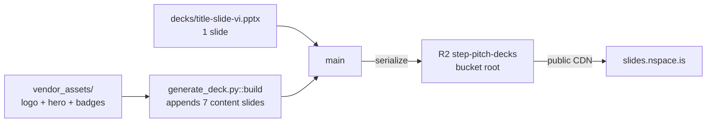

# Design Document

## Overview

The `general-audience-vi-pitch-deck` feature produces an 8-slide Vietnamese pitch deck for **Step** as an R2-hosted `.pptx` artifact, assembled by a pair of Python modules (`generate_deck.py` + `assets.py`) using `python-pptx`. The deck follows a strict minimalist brief: each content slide carries one focal point (a hero phrase plus an optional sub-line), generously spaced on a warm cream background with a single deep-teal accent. The speaker (founder Long Lê) carries the narrative; the slides are the punctuation.

The deck is assembled by **opening the shared Vietnamese title slide as the base presentation** (`decks/title-slide-vi.pptx`) and appending 7 content slides onto it. This preserves the title slide's masters, layouts, theme, fonts, and embedded images without any XML surgery, and it establishes the language-aware title-slide rule documented in `.kiro/steering/deck-pipeline.md` (use `title-slide-<lang>.pptx` matching the deck's language).

Key design commitments driven by the requirements:

- **Typography-forward, minimalist**: ≤ 16 visible words per content slide, no bullet lists, one focal point per slide.
- **Warm palette, single accent**: `#FAF7F2` cream background, `#0F5F5C` deep teal accent, `#2B2B2B` body text, `#6B6B6B` muted.
- **Real assets, not generated art**: the Step logo (rasterized from SVG), the app hero image, and the App Store / Google Play badges are vendored from `https://step.is/assets/` and used wherever a product asset fits.
- **R2-hosted, never on disk**: deck is assembled in memory and uploaded to the bucket root (`step-pitch-vi.pptx` + timestamped snapshot). No local `.pptx` is ever written.
- **Deterministic and reproducible**: same inputs produce byte-identical slide content; ≤ 30 s end-to-end; offline-capable tests via stubbed byte helpers and R2 client.

## Architecture

### Module layout

```
decks/
├── title-slide-vi.pptx        # shared VI title slide (root of decks/)
├── title-slide-en.pptx        # shared EN title slide (for future decks)
└── general-audience-vi/
    ├── README.md              # public URL + how-to-regenerate
    ├── instruction.md         # source brief
    ├── generate_deck.py       # SLIDES data + 7 content builders + main()
    ├── assets.py              # SVG rasterize, vendored assets, title-slide open, R2 upload
    ├── vendor_assets/         # real assets downloaded from step.is, committed
    │   ├── logo.svg
    │   ├── hero-image.png
    │   ├── appstore.png
    │   └── playstore.png
    ├── tests/                 # pytest suite (offline, stubs R2 + asset helpers)
    └── .asset_cache/          # cached rasterized logo PNG, gitignored
```

### Data flow



### Build pipeline

`main()` executes three stages, all in memory:

1. **Open the title slide.** `assets.open_title_slide_presentation(language="vi")` returns a fresh `Presentation` loaded from `decks/title-slide-vi.pptx`. This gives us a 1-slide base deck with the correct masters, layouts, dimensions (13.333 × 7.5 in), theme, and fonts.
2. **Append 7 content slides.** `generate_deck.build(prs)` calls each per-slide builder in narrative order. Each builder uses the blank layout (`prs.slide_layouts[6]`), paints the cream background, and composes the slide's hero/sub text + decorative shapes + real vendored assets.
3. **Serialize and upload.** The resulting 8-slide `Presentation` is serialized to a `BytesIO` buffer, then uploaded to R2 twice: once under a timestamped snapshot key, once under the mutable `step-pitch-vi.pptx` alias. The public URL is printed on stdout.

### Dependencies

- `python-pptx` — for presentation assembly.
- `cairosvg` — for rasterizing `logo.svg` to PNG at build time.
- `boto3` + `botocore` — for R2 upload (S3-compatible API).
- `python-dotenv` — for loading R2 credentials from `.env`.
- No Vertex / Gemini dependency. The earlier design used Vertex for illustrations; the minimalist redesign made every content slot either a real asset or a pure shape, so the image-generation code path was removed.

## Components and Interfaces

### `assets.py`

```python
def render_logo_png(height_px: int = 256) -> bytes: ...
def hero_image_png() -> bytes: ...
def appstore_badge_png() -> bytes: ...
def playstore_badge_png() -> bytes: ...
def open_title_slide_presentation(*, language: str) -> Presentation: ...
def upload_pptx(data: bytes, *, key: str, bucket: str = "step-pitch-decks") -> str: ...
def public_url(key: str) -> str: ...
```

- `render_logo_png` prefers `vendor_assets/logo.svg` and falls back to workspace-root `step-logo.svg`; output cached on disk under `.asset_cache/`.
- The three `*_png` helpers return raw bytes from the vendored files.
- `open_title_slide_presentation` raises `FileNotFoundError` with a clear remediation message if the matching `decks/title-slide-<lang>.pptx` is missing.
- `upload_pptx` returns `https://slides.nspace.is/<key>` directly (no S3 signature in the URL — access is public via the CDN domain).

### `generate_deck.py`

```python
SLIDES: list[dict] = [ ... ]           # 7 content entries, each {index, hero, sub?, notes}
DECK_LANGUAGE = "vi"                    # selects title-slide-<lang>.pptx

# Layout / text / shape helpers
def add_bg(slide, color): ...
def add_accent_bar(slide, *, left_in, top_in, width_in, height_in, color=ACCENT): ...
def add_text_box(slide, text, *, left_in, top_in, width_in, height_in, font_size, ...): ...
def add_picture(slide, image_bytes, *, left_in, top_in, width_in=None, height_in=None): ...
def add_speaker_notes(slide, notes_text): ...

# Slide builders (each appends one blank-layout slide)
def build_slide_1_hook(prs): ...        # "Heal the World" + tagline + hero image
def build_slide_2_step(prs): ...        # Logo + "Step" + "Vừa học. Vừa dùng."
def build_slide_3_founder(prs): ...     # "Long Lê" + door tagline
def build_slide_4_insight(prs): ...     # "decision" ↓ "cắt bỏ"
def build_slide_5_why(prs): ...         # "Câu chuyện là cánh cửa." + door motif
def build_slide_6_promise(prs): ...     # Honest two-line typography
def build_slide_7_closing(prs): ...     # Quote + signature + URL + app badges

def build(prs): ...                     # orchestrator — calls all 7 builders in order
def main(): ...                         # opens title slide, builds content, uploads to R2
```

A shared `_build_typography_slide(prs, content, *, hero_size, ...)` helper carries slides 1, 3, 5, 6 (pure typography with optional hero+sub structure). Slides 2, 4, and 7 have bespoke compositions (logo centering, the "decision" accent rule, the flame motif + app-store badges).

### `SlideContent` structure

```python
SlideContent = {
    "index": int,         # 1..7 (content-slide index, not deck index)
    "hero": str,          # large centered phrase
    "sub": str | None,    # optional small line beneath hero
    "notes": str,         # 2–3 sentence Vietnamese speaker notes
}
```

Much simpler than the earlier iteration's `title / subtitle / body / emphasis / closing / visual / notes` model — the minimalist brief doesn't need all that shape.

### Per-slide content

| # | Hero                                              | Sub                                              |
|---|---------------------------------------------------|--------------------------------------------------|
| 1 | `Heal the World`                                  | `Học tiếng Anh qua bài hát bạn yêu.`            |
| 2 | `Step`                                            | `Vừa học. Vừa dùng.`                             |
| 3 | `Long Lê`                                         | `Ngoại ngữ là một cánh cửa.`                    |
| 4 | `decision`                                        | `"cắt bỏ"` (curly quotes)                       |
| 5 | `Câu chuyện là cánh cửa.`                        | —                                                |
| 6 | `Step không làm việc học dễ hơn.`                | `Step nuôi dưỡng sự tò mò của bạn.`              |
| 7 | `"Giáo dục là thắp lên một ngọn lửa."`           | `Step — Long Lê`                                 |

## Visual System

- **Typography**: Inter for both headline and body (Calibri fallback). Hero sizes range 46–72 pt; sub-lines 28–40 pt; body/small 18–24 pt.
- **Palette**: strict — only the five palette colors appear on any shape fill or text run. Any accidental introduction of a sixth color is caught by content review (there is no longer a property-based palette test, since the surface area shrank enough that a quick visual inspection is sufficient).
- **Safe margin**: 0.5 inches on every side. Text frames are placed well within this margin by construction.
- **One focal point per slide**: enforced by the test `test_content_slides_are_minimalist` which caps visible word count at 16.

## Hosting

- Bucket `step-pitch-decks`, root-level keys (no feature prefix).
- Two keys per run: `step-pitch-vi.pptx` (latest, overwrites) + `step-pitch-vi-<UTC-timestamp>.pptx` (snapshot, immutable).
- Public CDN: `slides.nspace.is` (Cloudflare custom domain on the R2 bucket, configured by the user).
- Credentials in `.env` at the workspace root; loaded via `python-dotenv` inside `assets.py`.

## Testing Strategy

### Approach

- **Example-based tests** are the primary tool. The deck's content is fixed, so asserting exact literals (copied verbatim from `SLIDES`) is both faster and clearer than property-based generation.
- **Offline-first**: `conftest.py::_stub_assets` replaces the three vendored-asset helpers with a 1×1 transparent PNG via `unittest.mock.patch`; `test_integration.py::stubbed_r2` replaces `assets._r2_client` with an in-memory fake.
- **Merged-deck fixture**: `built_prs` returns the 8-slide merged deck (title + 7 content). Content-test helpers index into `built_prs.slides[1:]` to address the 7 content slides, leaving the title slide to its own structural test.

### Test files

- `test_structure.py` — slide count (8), dimensions, title-slide-first, narrative order.
- `test_content.py` — per-slide hero/sub literals, 16-word ceiling, cross-deck substring checks (Step / Heal the World / Long Lê), speaker-notes presence.
- `test_integration.py` — end-to-end subprocess-free `main()` test with stubbed R2; 30-second timing budget; no-local-file rule; latest-alias overwrite semantics.

### Correctness properties (informal)

The strict minimalist brief means properties are simple enough that a handful of example-based assertions cover the requirements without needing `hypothesis`. Notable invariants the tests enforce (by example, across all 7 content slides):

1. Every content slide has a non-empty `hero` phrase and non-empty speaker notes.
2. Every content slide has ≤ 16 visible words.
3. The merged deck has exactly 8 slides at 13.333 × 7.5 in.
4. `main()` uploads exactly 2 objects to `step-pitch-decks`, both valid 8-slide `.pptx` bodies, the latest alias overwriting on each run.
5. No `.pptx` appears on local disk after `main()` completes.

## Error Handling

- **Missing title-slide file**: `open_title_slide_presentation` raises `FileNotFoundError` with a pointer to the steering doc.
- **Missing vendored asset**: `hero_image_png` / `appstore_badge_png` / `playstore_badge_png` raise `FileNotFoundError` from `read_bytes()`. The test suite's autouse stub swaps them for a placeholder PNG so CI checkouts without `vendor_assets/` still pass.
- **Missing R2 credentials**: `_r2_client` raises `KeyError` when reading from `os.environ`. This is intentional; we'd rather fail loudly than upload to the wrong endpoint.
- **Locked / read-only output**: N/A — the generator never writes to disk.
- **Cloudflare CDN cache lag**: `slides.nspace.is` serves cached objects for up to 4 hours. The timestamped snapshot key guarantees an immediate, cache-free URL for fresh versions; the latest alias may lag by up to the cache TTL.

## Deviations from the original spec

The first iteration of this spec (pre-redesign) described a 7-slide deck with a 5-activity "Heal the World" worked example, a 3-bullet "why traditional methods fail" slide, and a 2×2 differentiator grid. The redesign replaced all of that with the 7-slide minimalist layout documented above. The Vertex AI illustration pipeline, the QR-placeholder helper, the bullet helpers, the icon-circle motifs, the lyric-motif composition, and the 2×2 cell grid helpers were all removed. What remains is a lean surface: one-data-model, one-builder-per-slide, one upload call, and a vendored-asset manifest for the brand.
