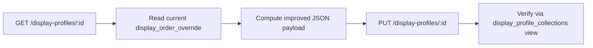

# Design Document: Display Profile Improvements

## Overview

This is a data-only operation — no code changes to the worker or any application logic. The work consists of crafting improved `display_order_override` JSON payloads for all 9 display profiles and applying them via PUT requests to the existing Catalog API.

The goal is to:
1. Add 5 new French collections to relevant profiles
2. Add 4 new kids multi-language collections to profiles 8 and 9
3. Populate profile 6 with curriculum overrides for Fiction/Curious Minds
4. Differentiate flat display_order values (currently all 1200) into audience-specific rankings
5. Tailor series overrides per audience

## Architecture

No architectural changes. The system remains:

```
Catalog API (Cloudflare Worker) → PostgreSQL (display_profile table)
```

The workflow for each profile update:



## Components and Interfaces

### API Interface (existing, no changes)

**Endpoint:** `PUT https://catalogapi.step.is/display-profiles/:id`

**Request Body:**
```json
{
  "display_order_override": {
    "collections": { "<collection_id>": <number>, ... },
    "series": { "<series_id>": <number>, ... },
    "curriculums": { "<curriculum_id>": <number>, ... }
  }
}
```

**Behavior:** PUT replaces the entire `display_order_override` field. The full object (collections + series + curriculums) must be sent every time.

### Verification Query

```sql
SELECT profile_id, collection_id, collection_title, display_order, hidden
FROM display_profile_collections
WHERE profile_id = :id
ORDER BY display_order DESC;
```

## Data Models

### Display Order Tier Structure

All profiles use a consistent tier system for `display_order` values:

| Tier | Range | Purpose |
|------|-------|---------|
| Top Promoted | 2100–2199 | Flagship/hero content for this audience |
| High Promoted | 2000–2099 | Secondary promoted content |
| Upper Mid | 1196–1200 | Strong relevance to audience |
| Mid | 1190–1195 | Moderate relevance |
| Lower Mid | 1180–1189 | Lower relevance but still visible |
| Base Visible | 0–1179 | Visible but not prioritized |
| Lowest Visible | 0 | Minimum visible threshold |
| Hidden | -1 | Explicitly hidden from this profile |
| Default Hidden | -2000 | Collection base default (never overridden to this; use -1) |

**Key rules:**
- `>= 0` → visible in catalog
- `< 0` → hidden from catalog
- Higher number → appears first (descending sort)
- `-1` is the standard "explicitly hidden" value used in overrides

### New French Collections

| ID | Title | Content Focus |
|----|-------|---------------|
| ad49khvn | Academic & Science | Academic/scientific French content |
| uzs1jq8x | Business & Career | Professional/business French content |
| bu0fz4rr | Culture & Society | Cultural and social topics in French |
| vxuvod0y | Daily Life & Travel | Everyday situations and travel French |
| 4ke7s1i7 | Nature & Innovation | Nature and technology topics in French |

### New Kids Multi-Language Collections

| ID | Title | Language |
|----|-------|----------|
| ugnufdje | German Kids | German |
| ls4gufq0 | French Kids (1) | French |
| gjtcifmu | French Kids (2) | French |
| vd22jc0b | Chinese Kids | Chinese |

### Profile Audience Summary

| Profile ID | Audience | Key Priorities |
|------------|----------|----------------|
| 1 | Medical students (university) | Health, science, academic |
| 2 | Economics students (university) | Business, finance, economics |
| 3 | Office Professionals | Professional skills, communication, business |
| 4 | Beginner Friendly | Vocabulary, daily life, accessible topics |
| 5 | Office Professionals (variant) | Professional skills, communication, business |
| 6 | Intermediate - Young students | Fiction, stories, culture, curious minds |
| 7 | Academics | Science, research, philosophy, academic |
| 8 | Children Age 6-10 | Kids content only; adult content hidden |
| 9 | Kids + Beginner Mix | Kids content prioritized, beginner adult content visible |

### French Collection Placement Per Profile

| Profile | Audience Priority | Placement Strategy |
|---------|-------------------|-------------------|
| 1 (Medical) | Academic & Science highest | ad49khvn: 1188, uzs1jq8x: 1185, bu0fz4rr: 1183, vxuvod0y: 1182, 4ke7s1i7: 1186 |
| 2 (Economics) | Business & Career highest | uzs1jq8x: 1188, ad49khvn: 1185, bu0fz4rr: 1183, vxuvod0y: 1182, 4ke7s1i7: 1184 |
| 3 (Office Pro) | Business & Career highest | uzs1jq8x: 1188, bu0fz4rr: 1185, vxuvod0y: 1184, ad49khvn: 1183, 4ke7s1i7: 1182 |
| 4 (Beginner) | Daily Life highest | vxuvod0y: 1188, bu0fz4rr: 1186, uzs1jq8x: 1184, ad49khvn: 1182, 4ke7s1i7: 1183 |
| 5 (Office Pro) | Same as profile 3 | uzs1jq8x: 1188, bu0fz4rr: 1185, vxuvod0y: 1184, ad49khvn: 1183, 4ke7s1i7: 1182 |
| 6 (Young students) | Culture & Nature highest | bu0fz4rr: 1188, 4ke7s1i7: 1186, ad49khvn: 1185, vxuvod0y: 1184, uzs1jq8x: 1183 |
| 7 (Academics) | Academic & Science highest | ad49khvn: 1189, 4ke7s1i7: 1187, bu0fz4rr: 1185, uzs1jq8x: 1184, vxuvod0y: 1183 |
| 8 (Children) | All hidden (adult content) | All set to -1 |
| 9 (Kids + Beginner) | Lower tier visible | vxuvod0y: 1170, bu0fz4rr: 1168, uzs1jq8x: 1166, ad49khvn: 1164, 4ke7s1i7: 1165 |

### Kids Collection Placement

**Profile 8 (Children Age 6-10):**
- Positioned below existing Vietnamese kids collections
- Logical language grouping: French together, then German, then Chinese
- ls4gufq0 (French kids 1): 1185
- gjtcifmu (French kids 2): 1184
- ugnufdje (German kids): 1183
- vd22jc0b (Chinese kids): 1182

**Profile 9 (Kids + Beginner Mix):**
- Positioned between Vietnamese kids collections and general beginner content
- Same language grouping order
- ls4gufq0 (French kids 1): 1192
- gjtcifmu (French kids 2): 1191
- ugnufdje (German kids): 1190
- vd22jc0b (Chinese kids): 1189

### Profile 6 Curriculum Overrides

Profile 6 (Intermediate - Young students) will receive curriculum overrides promoting:
- **Fiction curriculums**: Higher values (1300–1350 range) to surface storytelling content
- **Curious Minds curriculums**: Mid-high values (1250–1300 range) to promote intellectual exploration

Values will be differentiated (not flat) to create meaningful ordering within promoted content.

### Collection Differentiation Strategy (Requirement 4)

For profiles that currently have multiple collections at flat 1200, values will be spread across the 1180–1200 range based on audience relevance:

- **Most relevant** to audience: 1198–1200
- **Moderately relevant**: 1192–1197
- **Less relevant** (but still visible): 1180–1191

This preserves the overall tier structure while creating meaningful per-audience curation.

## Error Handling

Since this is a data-only operation using an existing API:

1. **PUT failure**: If a PUT request returns non-2xx status, log the profile ID and HTTP status code. Do not proceed to the next profile until the failure is investigated.
2. **Verification failure**: After PUT, query `display_profile_collections` view. If the expected collections don't appear with correct display_order values, flag the discrepancy.
3. **Partial update risk**: Since PUT replaces the entire `display_order_override`, always start from the current state (GET first) to avoid accidentally removing existing overrides.

## Testing Strategy

**PBT is not applicable** for this feature. This is a data-only operation — crafting JSON payloads and sending them to an existing API. There is no code logic, no parsers, no data transformations, and no functions to test with varied inputs. The "testing" here is verification of the applied data.

### Verification Approach

1. **Pre-update snapshot**: GET each profile's current `display_order_override` before changes
2. **Post-update verification**: Query `display_profile_collections` view for each profile after PUT
3. **Checks per profile**:
   - All French collections appear with expected visibility (>= 0 for general profiles, -1 for profile 8)
   - Kids collections appear in profiles 8 and 9 with correct ordering
   - No previously-visible collections have been accidentally hidden
   - Collection ordering reflects audience priorities (higher values for more relevant content)
   - Profile 6 curriculum overrides are populated and differentiated
4. **Catalog endpoint check**: GET `/catalog/:profileId` to confirm the resolved view reflects changes
