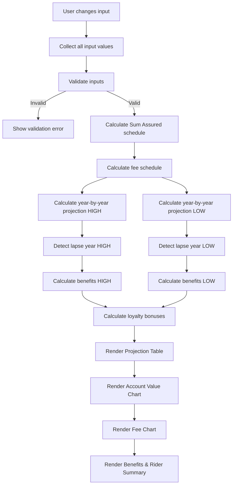

# Design Document: Insurance Payout Simulator

## Overview

The Insurance Payout Simulator is a self-contained, client-side web application that models the financial projections of Manulife Vietnam's "Xanh Tương Lai (Phiên bản phí ổn định)" unit-linked insurance product. The application runs entirely in the browser with no server dependencies, external CDN links, or API calls. It works from the local file system (`file://` protocol).

The user enters personal details (age, gender) and plan parameters (premium, payment duration, investment fund), and the simulator computes year-by-year projections of account value, fees, benefits, and lapse detection under both high and low return scenarios. All UI text is in Vietnamese.

### Key Design Decisions

1. **Single-folder deployment** (`index.html`, `style.css`, `app.js`, `data.js`) — easy to share as a zip file.
2. **No chart libraries** — all charts rendered with HTML5 Canvas or pure CSS to avoid external dependencies.
3. **Reactive recalculation** — every input change triggers a full recalculation pipeline; results update in-place without page reload.
4. **Data separation** — rate tables, fund definitions, and fee schedules live in `data.js`; calculation logic lives in `app.js`. This keeps the code maintainable and the data auditable.

## Architecture

```
┌─────────────────────────────────────────────────────┐
│                    index.html                        │
│  ┌──────────────┐  ┌────────────────────────────┐   │
│  │  Input Panel  │  │       Results Panel         │   │
│  │  (form fields)│  │  ┌──────────────────────┐  │   │
│  │               │  │  │  Projection Table     │  │   │
│  │  • Age        │  │  │  (year-by-year data)  │  │   │
│  │  • Gender     │  │  └──────────────────────┘  │   │
│  │  • Premium    │  │  ┌──────────────────────┐  │   │
│  │  • Duration   │  │  │  Account Value Chart  │  │   │
│  │  • Fund       │  │  │  (Canvas line chart)  │  │   │
│  └──────────────┘  │  └──────────────────────┘  │   │
│                     │  ┌──────────────────────┐  │   │
│                     │  │  Fee Breakdown Chart  │  │   │
│                     │  │  (CSS stacked bars)   │  │   │
│                     │  └──────────────────────┘  │   │
│                     │  ┌──────────────────────┐  │   │
│                     │  │  Benefits & Riders    │  │   │
│                     │  └──────────────────────┘  │   │
│                     └────────────────────────────┘   │
└─────────────────────────────────────────────────────┘
         │                        │
    ┌────┴────┐              ┌────┴────┐
    │ style.css│              │  app.js  │
    │ (layout, │              │ (engine +│
    │  theme)  │              │  UI binds│
    └─────────┘              │  + chart)│
                              └────┬────┘
                                   │
                              ┌────┴────┐
                              │ data.js  │
                              │ (rates,  │
                              │  funds,  │
                              │  fees)   │
                              └─────────┘
```

### Data Flow



### Calculation Pipeline

The engine processes in this order on every input change:

1. **Input collection & validation** — read form values, enforce ranges.
2. **Sum Assured schedule** — base SA + 10%/year increase from year 2–6 (max +50%).
3. **Fee schedule** — compute Initial Fee, Management Fee, Risk Fee per year.
4. **Account Value projection** — for each year, for both high and low return rates:
   - `invested = premium - initial_fee` (only during payment years)
   - `account_value = prev_account_value * (1 + return_rate) + invested - risk_fee - management_fee`
   - Add loyalty bonus at milestone years (10, 15, 20)
5. **Lapse detection** — if account value ≤ 0 or insufficient to cover fees, mark lapse.
6. **Benefits calculation** — Death Benefit = max(Account_Value, Sum_Assured); TPD same up to age 75.
7. **Render** — update DOM table, redraw charts, update benefit summary.

## Components and Interfaces

### File: `data.js`

Exports global constants consumed by `app.js`.

```javascript
// Fund definitions
const FUNDS = [
  { id: 'bao-toan', name: 'Bảo Toàn', highRate: 0.035, lowRate: 0.015 },
  { id: 'tich-luy', name: 'Tích Lũy', highRate: 0.05, lowRate: 0.015 },
  { id: 'on-dinh', name: 'Ổn Định', highRate: 0.06, lowRate: 0.013 },
  { id: 'can-bang', name: 'Cân Bằng', highRate: 0.07, lowRate: 0.013 },
  { id: 'phat-trien', name: 'Phát Triển', highRate: 0.08, lowRate: 0.013 },
  { id: 'tang-truong', name: 'Tăng Trưởng', highRate: 0.09, lowRate: 0.013 },
  { id: 'hung-thinh-2035', name: 'Hưng Thịnh 2035', highRate: 0.07, lowRate: 0.013 },
  { id: 'hung-thinh-2040', name: 'Hưng Thịnh 2040', highRate: 0.07, lowRate: 0.013 },
  { id: 'hung-thinh-2045', name: 'Hưng Thịnh 2045', highRate: 0.07, lowRate: 0.013 },
];

// Initial fee schedule (% of Basic Premium)
const INITIAL_FEE_RATES = {
  1: 0.50, 2: 0.30, 3: 0.20, 4: 0.20, 5: 0.20,
  6: 0.02, 7: 0.02, 8: 0.02, 9: 0.02, 10: 0.02,
  // 11+: 0
};

// Early termination fee (% of Account Value)
const EARLY_TERMINATION_RATES = {
  1: 0.90, 2: 0.90, 3: 0.50, 4: 0.30, 5: 0.20, 6: 0.10,
  // 7+: 0
};

// Management fee config
const MGMT_FEE = {
  baseMonthly: 45000,   // VND/month in 2025
  annualIncrease: 2000,  // VND/year
  maxMonthly: 70000,     // VND/month cap
};

// Risk fee rate table: riskRates[gender][age] = rate per 1000 VND of SA
const RISK_RATES = { /* hardcoded lookup by gender and age */ };

// Loyalty bonus milestones
const LOYALTY_MILESTONES = [10, 15, 20];

// Sum Assured auto-increase
const SA_INCREASE = { startYear: 2, endYear: 6, annualRate: 0.10, maxCumulative: 0.50 };

// Rider definitions
const RIDERS = [
  { name: 'Lá Chắn Xanh', desc: 'Bệnh hiểm nghèo', benefits: '200 triệu (giai đoạn muộn), 50 triệu (giai đoạn sớm), 50 triệu (đặc biệt)' },
  { name: 'Dự Phòng Xanh', desc: 'Nằm viện', benefits: '200.000 VND/ngày' },
  { name: 'Hộ Vệ Xanh', desc: 'Tai nạn', benefits: '250 triệu VND' },
];

// Default input values
const DEFAULTS = {
  age: 30, gender: 'female', basicPremium: 28570000,
  totalPremium: 30000000, paymentYears: 5, fundId: 'can-bang',
};
```

### File: `app.js`

Contains the calculation engine and UI binding logic.

#### Core Functions

| Function | Signature | Description |
|---|---|---|
| `collectInputs()` | `() → InputParams` | Reads form values, returns validated params object |
| `validateInputs(params)` | `(InputParams) → {valid, errors[]}` | Validates ranges and required fields |
| `calcSumAssuredSchedule(baseSA, maxYear)` | `(number, number) → number[]` | Returns SA per year with 10% auto-increase |
| `calcInitialFee(year, basicPremium)` | `(number, number) → number` | Returns initial fee for a given year |
| `calcManagementFee(year)` | `(number) → number` | Returns annual management fee for a given year |
| `calcRiskFee(age, gender, sumAssured)` | `(number, string, number) → number` | Returns annual risk fee from rate table |
| `calcLoyaltyBonus(year, ageAtYear, firstYearPremium)` | `(number, number, number) → number` | Returns bonus amount (0 if not a milestone year) |
| `projectAccountValue(params)` | `(InputParams) → ProjectionResult` | Main engine: returns year-by-year rows for both scenarios |
| `detectLapse(rows)` | `(YearRow[]) → number\|null` | Returns lapse year or null |
| `calcDeathBenefit(accountValue, sumAssured)` | `(number, number) → number` | Returns max of the two |
| `calcTPDBenefit(accountValue, sumAssured, age)` | `(number, number, number) → number\|null` | Returns benefit or null if age > 75 |
| `formatVND(amount)` | `(number) → string` | Formats number as "1.965.078.000 VND" |
| `renderTable(projection)` | `(ProjectionResult) → void` | Updates DOM table |
| `renderAccountChart(projection)` | `(ProjectionResult) → void` | Draws Canvas line chart |
| `renderFeeChart(projection)` | `(ProjectionResult) → void` | Draws CSS stacked bar chart |
| `renderBenefits(projection)` | `(ProjectionResult) → void` | Updates benefits section |
| `recalculate()` | `() → void` | Master function: collect → validate → project → render |

#### Key Data Types

```typescript
// Conceptual types (implemented as plain JS objects)

interface InputParams {
  age: number;          // 18–60
  gender: 'male' | 'female';
  basicPremium: number; // ≥ 20,000,000 VND
  totalPremium: number; // basicPremium + rider premium
  paymentYears: 3 | 5;
  fundId: string;
  highRate: number;     // looked up from fund
  lowRate: number;      // looked up from fund
}

interface YearRow {
  year: number;
  age: number;
  premiumPaid: number;
  initialFee: number;
  amountInvested: number;
  riskFee: number;
  managementFee: number;
  loyaltyBonus: number;
  accountValueHigh: number;
  accountValueLow: number;
  sumAssured: number;
  deathBenefitHigh: number;
  deathBenefitLow: number;
  tpdBenefitHigh: number | null;
  tpdBenefitLow: number | null;
  lapsedHigh: boolean;
  lapsedLow: boolean;
}

interface ProjectionResult {
  rows: YearRow[];
  lapseYearHigh: number | null;
  lapseYearLow: number | null;
  inputParams: InputParams;
}
```

### File: `style.css`

Handles layout, theming, and responsive behavior.

- CSS Grid for main layout: Input Panel (left/top on mobile) + Results Panel (right/bottom on mobile).
- CSS custom properties for Manulife brand colors (green `#00a758`, white, dark gray).
- Media queries at 768px breakpoint for mobile stacking.
- Stacked bar chart implemented with CSS `display: flex` and percentage widths.
- Table with sticky header, horizontal scroll on mobile.
- Color contrast ratios ≥ 4.5:1 for all text.

### File: `index.html`

Semantic HTML5 structure:

- `<header>` — app title and Manulife branding
- `<main>` — two-column grid:
  - `<section id="input-panel">` — form controls
  - `<section id="results-panel">` — projection table, charts, benefits
- `<footer>` — disclaimer text

All labels and text in Vietnamese. Form inputs use `<label>`, `<input>`, `<select>` with proper `for`/`id` associations for accessibility.

## Data Models

### Fund Data Model

| Field | Type | Description |
|---|---|---|
| `id` | string | Kebab-case identifier |
| `name` | string | Vietnamese display name |
| `highRate` | number | High return scenario annual rate (decimal) |
| `lowRate` | number | Low return scenario annual rate (decimal) |

### Fee Schedule Model

| Fee Type | Lookup Key | Value Type |
|---|---|---|
| Initial Fee | contract year → rate | `{ [year: number]: number }` |
| Management Fee | contract year → annual amount | Computed from base + increment, capped |
| Risk Fee | (age, gender, SA) → annual amount | `{ [gender]: { [age]: ratePerThousand } }` |
| Early Termination | contract year → rate | `{ [year: number]: number }` |

### Risk Rate Table

A nested object keyed by gender then age (18–99), with values representing the annual risk fee rate per 1,000 VND of Sum Assured. This table is sourced from Manulife's published rate tables and hardcoded in `data.js`.

Example structure:
```javascript
const RISK_RATES = {
  male: { 18: 1.05, 19: 1.05, 20: 1.06, /* ... */ 99: 85.0 },
  female: { 18: 0.52, 19: 0.52, 20: 0.53, /* ... */ 99: 65.0 },
};
```

### Projection Row Model

Each row in the projection table represents one contract year and contains all computed values for that year (see `YearRow` interface above). The projection runs from year 1 to year 40 or until lapse, whichever comes first.

### Loyalty Bonus Model

| Field | Description |
|---|---|
| Milestone years | 10, 15, 20 |
| Bonus formula | `age_at_milestone / 100 * firstYearBasicPremium` |
| Condition | Policy must be active (not lapsed) at milestone |


## Correctness Properties

*A property is a characteristic or behavior that should hold true across all valid executions of a system — essentially, a formal statement about what the system should do. Properties serve as the bridge between human-readable specifications and machine-verifiable correctness guarantees.*

### Property 1: Age input validation

*For any* integer value, the validation function should accept it if and only if it is between 18 and 60 inclusive.

**Validates: Requirements 1.2**

### Property 2: Premium input validation

*For any* numeric value, the validation function should accept it if and only if it is greater than or equal to 20,000,000.

**Validates: Requirements 1.4**

### Property 3: Sum Assured schedule correctness

*For any* valid base Sum Assured, the generated SA schedule should satisfy: year 1 equals the base SA, years 2–6 each increase by 10% of the base SA (not compounding), and the cumulative increase never exceeds 50% of the base SA. From year 7 onward, SA remains constant at 150% of the base.

**Validates: Requirements 2.1, 2.2**

### Property 4: Initial fee schedule correctness

*For any* contract year and any positive Basic Premium, `calcInitialFee(year, basicPremium)` should return `basicPremium * rate` where rate is 50% for year 1, 30% for year 2, 20% for years 3–5, 2% for years 6–10, and 0% for year 11+.

**Validates: Requirements 3.1**

### Property 5: Management fee formula with cap

*For any* contract year ≥ 1, the annual management fee should equal `min(45000 + (year - 1) * 2000, 70000) * 12`, i.e., the monthly fee starts at 45,000 VND, increases by 2,000 VND per year, is capped at 70,000 VND per month, and is multiplied by 12 for the annual amount.

**Validates: Requirements 3.2**

### Property 6: Early termination fee schedule correctness

*For any* contract year and any positive Account Value, the early termination fee should equal `accountValue * rate` where rate is 90% for years 1–2, 50% for year 3, 30% for year 4, 20% for year 5, 10% for year 6, and 0% for year 7+.

**Validates: Requirements 3.3**

### Property 7: Risk fee calculation

*For any* valid (age, gender, sumAssured) tuple where age is in [18, 99] and gender is 'male' or 'female', the risk fee should equal `RISK_RATES[gender][age] * sumAssured / 1000`.

**Validates: Requirements 3.4**

### Property 8: Account value single-step formula

*For any* known previous account value, return rate, invested amount, risk fee, management fee, and loyalty bonus, the next year's account value should equal `prevAV * (1 + returnRate) + invested - riskFee - managementFee + loyaltyBonus`.

**Validates: Requirements 4.2, 8.3**

### Property 9: Projection runs correct number of years

*For any* valid input parameters, the projection should contain rows from year 1 through either year 40 or the lapse year (whichever is smaller), and no rows beyond that point.

**Validates: Requirements 4.1**

### Property 10: Lapse detection correctness

*For any* sequence of yearly account values, the lapse year should be the first year where the account value is less than or equal to zero or insufficient to cover that year's risk fee plus management fee. If no such year exists within 40 years, lapse year should be null.

**Validates: Requirements 5.1**

### Property 11: Death benefit is max of account value and sum assured

*For any* account value and sum assured (both non-negative), the death benefit should equal `max(accountValue, sumAssured)`.

**Validates: Requirements 6.1**

### Property 12: TPD benefit follows age rule

*For any* account value, sum assured, and age: if age ≤ 75, TPD benefit should equal the death benefit (i.e., `max(accountValue, sumAssured)`); if age > 75, TPD benefit should be null/not applicable.

**Validates: Requirements 6.2, 6.3**

### Property 13: Rider premium equals total minus basic

*For any* total premium and basic premium where total ≥ basic, the rider premium should equal `totalPremium - basicPremium`.

**Validates: Requirements 7.4**

### Property 14: Loyalty bonus formula

*For any* milestone year (10, 15, or 20), customer age at that anniversary, and first-year basic premium, the loyalty bonus should equal `(ageAtMilestone / 100) * firstYearBasicPremium`.

**Validates: Requirements 8.1**

### Property 15: Loyalty bonus forfeited on lapse

*For any* projection where the policy lapses at year L, all loyalty bonus milestones at years > L should yield zero bonus.

**Validates: Requirements 8.2**

### Property 16: VND currency formatting

*For any* non-negative integer, `formatVND(n)` should produce a string that uses dots as thousand separators and ends with " VND". Parsing the digits back (removing dots and " VND") should return the original number.

**Validates: Requirements 9.2**

## Error Handling

### Input Validation Errors

| Error Condition | Handling |
|---|---|
| Age outside 18–60 | Show inline error message below age field in red; do not recalculate |
| Premium below 20,000,000 VND | Show inline error message below premium field; do not recalculate |
| Non-numeric input in age or premium | Prevent non-numeric characters via `input` event filtering; show error if pasted |
| No fund selected | Default to Cân Bằng; this state should not occur with proper defaults |

### Calculation Edge Cases

| Edge Case | Handling |
|---|---|
| Account value goes negative | Clamp to 0; mark year as lapsed; stop projection |
| Risk fee exceeds account value | Mark as lapsed; the account cannot sustain the policy |
| Age reaches 99 | Stop projection at age 99 (contract term limit) |
| Loyalty bonus at lapsed policy | Skip bonus; do not add to account value |
| Management fee hits cap | Apply cap of 70,000 VND/month; do not exceed |

### UI Error States

- Validation errors shown inline below the relevant input field.
- Error messages in Vietnamese (e.g., "Tuổi phải từ 18 đến 60").
- Invalid inputs highlighted with red border.
- Results panel shows a placeholder message when inputs are invalid: "Vui lòng nhập thông tin hợp lệ để xem kết quả mô phỏng."

## Testing Strategy

### Dual Testing Approach

This project uses both unit tests and property-based tests for comprehensive coverage.

**Unit Tests** focus on:
- Specific example calculations with known expected outputs (e.g., the default profile should produce known year-1 values)
- UI rendering checks (correct elements present, correct Vietnamese labels)
- Edge cases: age exactly 18 and 60, premium exactly 20M, year boundaries for fee schedules
- Integration: full recalculation pipeline produces consistent results

**Property-Based Tests** focus on:
- Universal properties that must hold across all valid inputs (Properties 1–16 above)
- Each property test runs a minimum of 100 iterations with randomly generated inputs
- Each test is tagged with a comment referencing the design property

### Property-Based Testing Library

Use **fast-check** (`fc`) for JavaScript property-based testing. Since this is a self-contained app with no build system, tests will be run separately using a Node.js test runner (e.g., `node --test`) with fast-check installed as a dev dependency in a sibling test folder.

### Test File Structure

```
output/insurance-payout-simulator/
  index.html
  style.css
  app.js
  data.js
  tests/
    calculations.test.js   # Unit tests for calculation functions
    properties.test.js     # Property-based tests for Properties 1–16
```

### Property Test Tagging

Each property-based test must include a comment tag:

```javascript
// Feature: insurance-payout-simulator, Property 1: Age input validation
test('age validation accepts 18-60 only', () => {
  fc.assert(fc.property(fc.integer(), (age) => {
    const result = validateAge(age);
    return result === (age >= 18 && age <= 60);
  }), { numRuns: 100 });
});
```

### Test Coverage Goals

| Area | Unit Tests | Property Tests |
|---|---|---|
| Input validation | Default values, boundary values | Properties 1, 2 |
| Sum Assured | Known profile calculation | Property 3 |
| Fee calculations | Year-by-year for default profile | Properties 4, 5, 6, 7 |
| Account value | Full projection for default profile | Properties 8, 9 |
| Lapse detection | Known lapse/no-lapse scenarios | Property 10 |
| Benefits | Known benefit amounts | Properties 11, 12 |
| Rider premium | Default profile rider cost | Property 13 |
| Loyalty bonus | Known milestone calculations | Properties 14, 15 |
| Formatting | Specific number formats | Property 16 |
