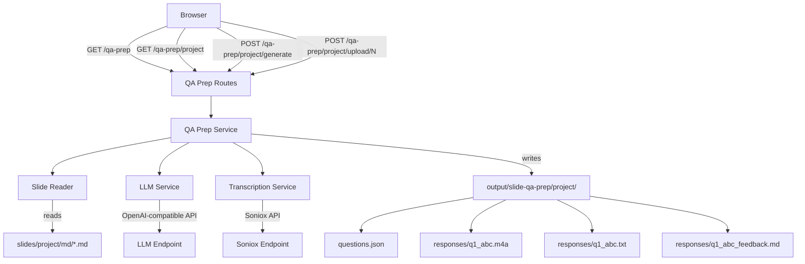

# Design Document: Slide Q&A Prep

## Overview

The Slide Q&A Prep feature adds a Q&A preparation workflow to the existing FastAPI web application. Users select a slide deck project, the system generates interview-style questions from the slide markdown content via the LLM, users upload voice responses per question, the existing Soniox transcription service converts audio to text, and the LLM evaluates each transcribed answer against the original slide content.

The feature follows the existing application patterns: FastAPI router with `Depends(get_current_user)` for auth, Jinja2 templates extending `base.html`, and service modules under `app/services/`. Output files are persisted to `output/slide-qa-prep/<project>/` with a naming convention of `q<number>_<random_3_char>` for response files.

### Key Design Decisions

1. **Reuse existing transcription service** — The `transcribe_meetings.transcribe()` function already handles Soniox API upload, polling, and text extraction. The QA prep service wraps this with the new file naming convention.
2. **Synchronous LLM calls via `asyncio.to_thread`** — Following the pipeline service pattern, blocking HTTP calls to the LLM and Soniox APIs run in thread pool executors to avoid blocking the event loop.
3. **File-based persistence** — Questions stored as JSON, transcripts as `.txt`, feedback as `.md`. No database needed, consistent with the existing app's file-based approach.
4. **Separate router module** — A new `app/routes_qa_prep.py` keeps QA prep routes isolated from the existing `routes.py`, registered in `main.py` via `app.include_router()`.

## Architecture



### Request Flow

1. **Deck selection** (`GET /qa-prep`): List `slides/*/md/` directories, render selection page.
2. **Session page** (`GET /qa-prep/<project>`): Load `questions.json` if exists, scan `responses/` for uploaded files, render session page with progress.
3. **Generate questions** (`POST /qa-prep/<project>/generate`): Aggregate markdown files → LLM call → save `questions.json` → redirect to session page.
4. **Upload response** (`POST /qa-prep/<project>/upload/<question_number>`): Save audio → transcribe → get feedback → redirect to session page.

## Components and Interfaces

### 1. QA Prep Routes (`app/routes_qa_prep.py`)

New FastAPI `APIRouter` registered in `main.py`. Uses the same `get_current_user` dependency from `app/routes.py`.

```python
# Endpoints
GET  /qa-prep                              # Deck selection page
GET  /qa-prep/{project}                    # Session page (questions + responses)
POST /qa-prep/{project}/generate           # Generate/regenerate questions
POST /qa-prep/{project}/upload/{q_number}  # Upload voice response for question N
```

### 2. QA Prep Service (`app/services/qa_prep.py`)

Core business logic module. Pure functions and I/O helpers.

```python
# Slide reading
def list_slide_decks(slides_dir: Path) -> list[str]
    """Return project names that have a md/ subdirectory."""

def read_slide_content(slides_dir: Path, project: str) -> str
    """Aggregate all .md files from slides/<project>/md/ sorted by name."""

# Question generation
def generate_questions(slide_content: str) -> list[str]
    """Call LLM to generate 5-15 interview questions from slide content."""

def save_questions(output_dir: Path, project: str, questions: list[str]) -> Path
    """Persist questions to output/slide-qa-prep/<project>/questions.json."""

def load_questions(output_dir: Path, project: str) -> list[str] | None
    """Load questions from disk, return None if not found."""

# Response handling
def save_response_audio(output_dir: Path, project: str, q_number: int, filename: str, content: bytes) -> tuple[Path, str]
    """Save audio file with q<N>_<random_3_char>.<ext> naming. Returns (path, suffix)."""

def transcribe_response(audio_path: Path) -> str
    """Call existing transcribe_meetings.transcribe(), save .txt alongside audio."""

def generate_feedback(question: str, transcript: str, slide_content: str) -> str
    """Call LLM to evaluate the response. Returns markdown feedback."""

def save_feedback(feedback_path: Path, feedback: str) -> None
    """Persist feedback markdown to disk."""

# Session state
def load_session_state(output_dir: Path, project: str) -> dict
    """Scan output dir to build per-question state: attempts with audio/transcript/feedback status."""
```

### 3. Templates

Two new Jinja2 templates extending `base.html`:

- **`qa_prep_select.html`** — Lists available slide decks as clickable cards. Each card links to `/qa-prep/<project>`.
- **`qa_prep_session.html`** — Shows questions list with progress indicator, per-question upload form, and expandable attempt history (transcript + feedback).

### 4. Docker Compose Changes

Add two volume mappings to the `web` service in `docker-compose.yml`:

```yaml
volumes:
  - ./slides:/app/slides
  - ./output:/app/output
```

### 5. Navigation Integration

Add a "Q&A Prep" link in `base.html` nav bar between "Upload" and the spacer.

## Data Models

### Questions File (`output/slide-qa-prep/<project>/questions.json`)

```json
{
  "project": "var-4th-draft",
  "generated_at": "2025-01-15T10:30:00Z",
  "questions": [
    "What is the current VAR exposure level and how does it compare to the previous quarter?",
    "Explain the key drivers behind the FYP growth trend shown in slide 3."
  ]
}
```

### Response File Naming Convention

All response files live in `output/slide-qa-prep/<project>/responses/`:

| File | Pattern | Example |
|------|---------|---------|
| Audio | `q<N>_<3char>.<ext>` | `q1_a7x.m4a` |
| Transcript | `q<N>_<3char>.txt` | `q1_a7x.txt` |
| Feedback | `q<N>_<3char>_feedback.md` | `q1_a7x_feedback.md` |

The `<3char>` suffix is a random alphanumeric string generated per upload, allowing multiple attempts per question.

### Session State (in-memory, built from file scan)

```python
@dataclass
class ResponseAttempt:
    suffix: str                    # e.g. "a7x"
    audio_file: str                # filename
    transcript: str | None         # text content if .txt exists
    feedback: str | None           # markdown content if _feedback.md exists
    upload_time: float             # file mtime for ordering

@dataclass
class QuestionState:
    number: int
    text: str
    attempts: list[ResponseAttempt]  # ordered by upload_time

@dataclass
class SessionState:
    project: str
    questions: list[QuestionState]
    total_questions: int
    answered_count: int            # questions with >= 1 attempt
    feedback_count: int            # questions with >= 1 feedback
```

### LLM Prompt Templates

**Question Generation Prompt:**
```
You are an interview coach. Given the following slide deck content, generate {n} 
interview-style questions that a presenter might be asked during a Q&A session.
Focus on key data points, strategic decisions, and areas that need justification.
Return ONLY a JSON array of question strings.

Slide content:
{slide_content}
```

**Feedback Prompt:**
```
You are an interview coach evaluating a presenter's response to a Q&A question.

Question: {question}
Presenter's response: {transcript}
Actual slide content: {slide_content}

Evaluate the response for:
1. **Accuracy** — Does the response align with the slide content?
2. **Completeness** — Are key points covered?
3. **Clarity** — Is the answer well-structured and clear?

Provide specific feedback with suggestions for improvement.
```

### Directory Structure (output)

```
output/slide-qa-prep/
└── <project>/
    ├── questions.json
    └── responses/
        ├── q1_a7x.m4a
        ├── q1_a7x.txt
        ├── q1_a7x_feedback.md
        ├── q1_k2m.m4a        # second attempt at question 1
        ├── q1_k2m.txt
        ├── q1_k2m_feedback.md
        ├── q2_p9r.mp3
        ├── q2_p9r.txt
        └── q2_p9r_feedback.md
```


## Correctness Properties

*A property is a characteristic or behavior that should hold true across all valid executions of a system — essentially, a formal statement about what the system should do. Properties serve as the bridge between human-readable specifications and machine-verifiable correctness guarantees.*

### Property 1: Deck listing filters by md/ subdirectory

*For any* directory structure under `slides/`, the `list_slide_decks` function should return exactly those project names whose directory contains a `md/` subdirectory, and no others.

**Validates: Requirements 1.1**

### Property 2: Slide content aggregation includes all files

*For any* set of markdown files in `slides/<project>/md/`, the `read_slide_content` function should return a string that contains the full text content of every `.md` file in that directory, concatenated in sorted filename order.

**Validates: Requirements 1.2**

### Property 3: Question count validation

*For any* JSON array of strings returned by the LLM, the question parser should accept arrays with length in [5, 15] and reject or clamp arrays outside that range.

**Validates: Requirements 2.2**

### Property 4: Question persistence round trip

*For any* valid question set (project name + list of question strings), saving to `questions.json` and then loading from the same path should produce an equivalent question list.

**Validates: Requirements 2.3**

### Property 5: Audio file extension validation

*For any* filename string, the upload validator should accept it if and only if its lowercased extension is in the set {.m4a, .mp3, .mp4, .wav, .flac, .ogg, .aac, .webm, .amr, .aiff, .asf}. All other extensions should be rejected.

**Validates: Requirements 3.3, 3.5**

### Property 6: Response file naming convention

*For any* question number N and valid audio file upload, the saved audio filename should match the regex pattern `q\d+_[a-zA-Z0-9]{3}\.\w+`, and the 3-character suffix should be alphanumeric.

**Validates: Requirements 3.4**

### Property 7: File suffix consistency across audio, transcript, and feedback

*For any* uploaded voice response, the audio file, transcript file, and feedback file should all share the same `q<N>_<suffix>` prefix, where `<suffix>` is the same 3-character string. Specifically: if the audio is `q5_abc.m4a`, the transcript must be `q5_abc.txt` and the feedback must be `q5_abc_feedback.md`.

**Validates: Requirements 4.2, 5.3**

### Property 8: Session state groups attempts by question and orders by time

*For any* set of response files on disk, the `load_session_state` function should group all attempts by question number (extracted from the `q<N>` prefix) and order attempts within each question by file modification time ascending.

**Validates: Requirements 3.6**

### Property 9: Progress count accuracy

*For any* session state, the `answered_count` should equal the number of questions that have at least one response attempt, and `feedback_count` should equal the number of questions that have at least one feedback file.

**Validates: Requirements 6.1**

### Property 10: Append-only uploads

*For any* sequence of voice response uploads to the same question number, all previously saved audio files for that question should still exist on disk after each new upload. The upload operation must not delete or overwrite existing response files.

**Validates: Requirements 6.3**

## Error Handling

| Scenario | Handling |
|----------|----------|
| Empty `md/` directory for selected project | Return error message: "No slide content found for project X" (Req 1.3) |
| LLM question generation fails | Catch exception, flash error with reason, redirect to session page (Req 2.6) |
| Unsupported file extension on upload | Reject with 400, display allowed formats list (Req 3.5) |
| Transcription service fails | Save audio file (already persisted), flash transcription error, allow retry (Req 4.4) |
| LLM feedback call fails | Save transcript (already persisted), flash feedback error, allow retry (Req 5.5) |
| `slides/` directory doesn't exist | Return empty deck list on selection page |
| `output/` directory doesn't exist | Create directories on first write using `mkdir(parents=True, exist_ok=True)` |
| Path traversal in project name | Validate project name contains no `..`, `/`, or `\` characters (reuse existing `validate_folder_name`) |

### Partial Failure Strategy

The upload → transcribe → feedback pipeline processes sequentially. If transcription fails, the audio file is already saved and the user can see it in the attempts list. If feedback fails, both audio and transcript are saved. The UI shows per-attempt status so the user knows exactly where the pipeline stopped.

## Testing Strategy

### Property-Based Testing

Use **Hypothesis** (Python property-based testing library) for all correctness properties.

Each property test runs a minimum of 100 iterations. Tests are tagged with comments referencing the design property:

```python
# Feature: slide-qa-prep, Property 1: Deck listing filters by md/ subdirectory
@given(st.lists(st.tuples(st.text(min_size=1, alphabet=string.ascii_lowercase), st.booleans())))
def test_list_slide_decks_filters_by_md(dir_specs):
    ...
```

Property tests cover:
- **Property 1**: Generate random directory trees, verify filtering
- **Property 2**: Generate random markdown file sets, verify aggregation completeness
- **Property 3**: Generate random-length string arrays, verify count validation
- **Property 4**: Generate random question sets, verify save/load round trip
- **Property 5**: Generate random filenames with random extensions, verify accept/reject
- **Property 6**: Generate random question numbers and extensions, verify naming pattern
- **Property 7**: Run upload flow, verify all three files share the same suffix
- **Property 8**: Generate random response file sets, verify grouping and ordering
- **Property 9**: Generate random session states, verify count derivation
- **Property 10**: Run sequential uploads, verify no files are deleted

### Unit Testing

Unit tests complement property tests for specific examples and edge cases:

- Empty `md/` directory returns error (Req 1.3)
- Auth required on all QA prep routes (Req 1.4)
- Questions loaded from disk when `questions.json` exists (Req 2.4)
- LLM called with correct prompt structure (Req 2.1, 5.1, 5.2)
- Routes return correct status codes (Req 7.1, 7.2)
- Docker compose volume mappings present (Req 8.1, 8.2)
- LLM failure returns user-friendly error (Req 2.6)
- Transcription failure preserves audio file (Req 4.4)

### Test Configuration

- Framework: **pytest** with **hypothesis** plugin
- Minimum iterations per property: **100** (`@settings(max_examples=100)`)
- Test location: `app/services/test_qa_prep.py`
- Each property test tagged: `# Feature: slide-qa-prep, Property {N}: {title}`
