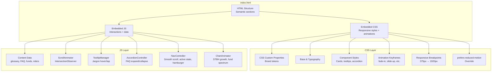

# Design Document: Xanh Tương Lai Explainer Website

## Overview

This design describes a single-page, self-contained explainer website for Manulife Vietnam's "Xanh Tương Lai" (Stable Premium Edition) unit-linked insurance product. The site targets prospective customers and simplifies complex ILP concepts through plain Vietnamese language, interactive visualizations, scroll-triggered animations, and an inline jargon tooltip system.

The deliverable is a static HTML/CSS/JS bundle with zero external dependencies, functional on `file://` protocol, responsive from 375px to 1920px, and fully branded with Manulife Vietnam's identity.

### Key Design Decisions

1. **Single HTML file with embedded CSS/JS**: All styles and scripts are inlined or embedded within `<style>` and `<script>` tags in a single `index.html` file. This maximizes portability — distributors can share one file. SVG icons are inlined directly in the markup.

2. **CSS Custom Properties for theming**: Manulife brand colors, spacing, and typography are defined as CSS custom properties on `:root`, enabling consistent theming and easy future adjustments.

3. **Intersection Observer for animations**: All scroll-triggered animations use the native `IntersectionObserver` API with a single shared observer instance. This avoids scroll-event listeners and provides performant, battery-friendly animation triggers.

4. **Data-driven content sections**: FAQ items, glossary terms, fund data, rider details, and benefit cards are stored as JavaScript object arrays. Rendering functions iterate over these arrays to produce DOM elements. This separates content from presentation and makes updates straightforward.

5. **Progressive enhancement**: Core content is readable without JavaScript. Animations, tooltips, and accordion interactions enhance the experience but are not required for content consumption.

## Architecture

The website follows a simple single-file architecture with clear separation of concerns within the file:



### Page Section Flow

```mermaid
graph LR
    NAV[Navigation Bar] --> HERO[Hero Section]
    HERO --> OVERVIEW[Product Overview]
    OVERVIEW --> BENEFITS[Benefits Section]
    BENEFITS --> RIDERS[Riders Comparison]
    RIDERS --> FUNDS[Fund Section]
    FUNDS --> AUDIENCE[Target Audience]
    AUDIENCE --> FAQ[FAQ Accordion]
    FAQ --> CTA[CTA Section]
    CTA --> FOOTER[Footer + Glossary]
```



## Components and Interfaces

### 1. HTML Sections (Semantic Structure)

Each major content area is a `<section>` with a unique `id` for navigation anchoring:

| Section | Element | ID | Purpose |
|---|---|---|---|
| Navigation | `<nav>` | `main-nav` | Fixed top bar with section links |
| Hero | `<section>` | `hero` | Headline, badges, CTAs |
| Product Overview | `<section>` | `tong-quan` | ILP explanation, flow diagram |
| Benefits | `<section>` | `quyen-loi` | 3 benefit cards + STBH chart |
| Riders | `<section>` | `riders` | 3 rider comparison cards |
| Funds | `<section>` | `quy-dau-tu` | Risk spectrum visualization |
| Target Audience | `<section>` | `ai-nen-chon` | 4 profile cards |
| FAQ | `<section>` | `faq` | Accordion Q&A |
| CTA | `<section>` | `lien-he` | 3 action cards + disclaimer |
| Footer | `<footer>` | `footer` | Branding, glossary link, legal |

### 2. ScrollAnimator

Manages all scroll-triggered animations via a single `IntersectionObserver`.

```
Interface ScrollAnimator:
  - init(): void
    // Creates IntersectionObserver with threshold 0.15
    // Queries all elements with [data-animate] attribute
    // Observes each element
  
  - handleIntersection(entries: IntersectionObserverEntry[]): void
    // For each entry that isIntersecting:
    //   Add CSS class matching data-animate value (e.g., "fade-in", "slide-up")
    //   Unobserve the element (animate once only)
  
  - respectsReducedMotion(): boolean
    // Returns true if prefers-reduced-motion: reduce is active
    // If true, init() adds all animation classes immediately without observer
```

Supported `data-animate` values: `fade-in`, `slide-up`, `slide-in-left`, `slide-in-right`, `scale-up`.

Optional `data-delay` attribute (e.g., `data-delay="200"`) for staggered animations.

### 3. TooltipManager

Handles the jargon tooltip system for highlighted insurance terms.

```
Interface TooltipManager:
  - glossary: Record<string, string>
    // Map of term → plain-language definition (15+ entries)
  
  - init(): void
    // Queries all elements with [data-term] attribute
    // Attaches mouseenter/mouseleave (desktop) and click (mobile) listeners
    // Creates a single reusable tooltip DOM element
  
  - show(triggerElement: HTMLElement): void
    // Reads data-term attribute
    // Looks up definition in glossary
    // Positions tooltip near trigger element
    // Makes tooltip visible (opacity transition)
  
  - hide(): void
    // Hides tooltip element
  
  - positionTooltip(trigger: HTMLElement): void
    // Calculates position relative to trigger
    // Ensures tooltip stays within viewport bounds
```

Tooltip trigger markup: `<span class="jargon" data-term="ILP" tabindex="0" role="button" aria-describedby="tooltip">ILP</span>`

### 4. AccordionController

Manages the FAQ accordion with single-open behavior.

```
Interface AccordionController:
  - init(): void
    // Queries all .accordion-trigger buttons
    // Attaches click and keydown (Enter, Space) listeners
  
  - toggle(triggerButton: HTMLButtonElement): void
    // If currently expanded: collapse it
    // If currently collapsed: collapse any other open item, then expand this one
    // Updates aria-expanded attribute
    // Animates panel height (max-height transition, 300ms)
  
  - collapse(triggerButton: HTMLButtonElement): void
    // Sets aria-expanded="false"
    // Sets panel max-height to 0
  
  - expand(triggerButton: HTMLButtonElement): void
    // Sets aria-expanded="true"
    // Sets panel max-height to scrollHeight
```

Accordion markup uses `<button aria-expanded="false" aria-controls="faq-panel-N">` with corresponding `<div id="faq-panel-N" role="region">`.

### 5. NavController

Manages fixed navigation, smooth scrolling, active section highlighting, and hamburger menu.

```
Interface NavController:
  - init(): void
    // Attaches click listeners to nav links for smooth scroll
    // Creates IntersectionObserver for section tracking
    // Attaches scroll listener for navbar background transition
    // Attaches hamburger toggle listener
  
  - scrollToSection(sectionId: string): void
    // Uses element.scrollIntoView({ behavior: 'smooth' })
    // Or window.scrollTo with duration ~600ms
    // Closes hamburger menu if open
  
  - updateActiveLink(sectionId: string): void
    // Removes active class from all nav links
    // Adds active class to link matching sectionId
  
  - updateNavBackground(): void
    // If scrollY > hero height: add solid background class
    // Else: remove solid background class (transparent)
  
  - toggleHamburger(): void
    // Toggles mobile menu visibility
    // Updates aria-expanded on hamburger button
```

### 6. ChartAnimator

Handles animated visualizations for the STBH growth chart and fund risk spectrum.

```
Interface ChartAnimator:
  - initSTBHChart(): void
    // Renders bar/step chart for STBH growth (years 1-6)
    // Data: Year 1 = 100%, Year 2 = 110%, Year 3 = 121%, etc.
    // Bars start at height 0, animated to target on scroll trigger
  
  - animateSTBHBars(): void
    // Sequentially animates each bar to its target height
    // Uses CSS transitions with staggered delays (200ms between bars)
  
  - initFundSpectrum(): void
    // Renders horizontal gradient bar with fund markers
    // Left = "Thận trọng" (conservative), Right = "Mạo hiểm" (aggressive)
    // Positions 9 fund markers along the spectrum
  
  - animateFundSpectrum(): void
    // Animates gradient bar width from 0 to 100%
    // Fund markers fade in sequentially along the bar
```

STBH growth data:

| Year | STBH Multiplier | Label |
|---|---|---|
| 1 | 1.00x | Năm 1 (100%) |
| 2 | 1.10x | Năm 2 (+10%) |
| 3 | 1.21x | Năm 3 (+21%) |
| 4 | 1.33x | Năm 4 (+33%) |
| 5 | 1.46x | Năm 5 (+46%) |
| 6 | 1.61x | Năm 6 (+61%) |

## Data Models

All data is hardcoded as JavaScript objects/arrays within the `<script>` block.

### Glossary Data

```javascript
// Minimum 15 entries
const GLOSSARY = {
  "ILP": "Bảo hiểm liên kết đơn vị – sản phẩm kết hợp bảo vệ rủi ro và đầu tư qua các quỹ.",
  "STBH": "Số tiền bảo hiểm – mức bảo vệ tối đa ghi trên hợp đồng.",
  "TTTBVV": "Thương tật toàn bộ vĩnh viễn – tình trạng mất hoàn toàn khả năng lao động.",
  "NAV": "Giá trị tài sản ròng – giá trị mỗi đơn vị quỹ tại một thời điểm.",
  "phí rủi ro": "Khoản phí trích từ tài khoản để duy trì quyền lợi bảo vệ.",
  "giá trị tài khoản": "Tổng giá trị các đơn vị quỹ bạn đang sở hữu trong hợp đồng.",
  "quỹ liên kết đơn vị": "Quỹ đầu tư mà phí bảo hiểm được phân bổ vào, giá trị thay đổi theo thị trường.",
  "đáo hạn": "Thời điểm hợp đồng bảo hiểm kết thúc theo thời hạn đã thỏa thuận.",
  "phí ban đầu": "Khoản phí trích từ phí bảo hiểm định kỳ trong những năm đầu hợp đồng.",
  "phí ổn định": "Tổng phí bảo hiểm định kỳ được thiết kế ổn định trong suốt thời gian đóng phí dự kiến.",
  "bảo hiểm liên kết đơn vị": "Sản phẩm bảo hiểm nhân thọ kết hợp bảo vệ và đầu tư qua quỹ liên kết.",
  "giai đoạn cuối": "Giai đoạn bệnh lý nghiêm trọng ở mức độ nặng nhất theo định nghĩa hợp đồng.",
  "giai đoạn sớm": "Giai đoạn bệnh lý nghiêm trọng được phát hiện ở mức độ nhẹ hơn.",
  "trợ cấp nằm viện": "Quyền lợi chi trả theo ngày khi người được bảo hiểm nằm viện.",
  "thương tật nghiêm trọng": "Các chấn thương nghiêm trọng do tai nạn được bảo hiểm chi trả."
};
```

### FAQ Data

```javascript
const FAQ_ITEMS = [
  {
    question: "ILP là gì? Có đảm bảo lãi không?",
    answer: "ILP (bảo hiểm liên kết đơn vị) kết hợp bảo vệ rủi ro và đầu tư. Lợi nhuận KHÔNG được đảm bảo vì phụ thuộc vào kết quả đầu tư của quỹ liên kết đơn vị."
  },
  {
    question: "Vì sao cần xem nhiều kịch bản minh họa?",
    answer: "Mỗi kịch bản phản ánh một mức lợi nhuận giả định khác nhau. Xem nhiều kịch bản giúp bạn hiểu rõ phạm vi kết quả có thể xảy ra."
  },
  {
    question: "Khi nào hợp đồng có thể mất hiệu lực?",
    answer: "Hợp đồng có thể mất hiệu lực khi giá trị tài khoản không đủ để trừ các khoản phí. Điều này có thể xảy ra khi thị trường giảm sâu kéo dài."
  },
  {
    question: "Có thể đổi Quỹ đầu tư không?",
    answer: "Có. Bạn có thể chuyển đổi giữa các quỹ theo quy định của hợp đồng, giúp điều chỉnh chiến lược đầu tư phù hợp với tình hình thị trường."
  },
  {
    question: "Tôi theo dõi NAV ở đâu?",
    answer: "Bạn có thể tra cứu NAV (giá trị tài sản ròng) hàng ngày trên website chính thức của Manulife Việt Nam hoặc qua ứng dụng ManuConnect."
  }
];
```

### Fund Data

```javascript
const FUNDS = [
  // By risk appetite
  { name: "Bảo Toàn", category: "risk", riskLevel: 1, description: "Tập trung vào trái phiếu chính phủ và tiền gửi." },
  { name: "Tích Lũy", category: "risk", riskLevel: 2, description: "Chủ yếu trái phiếu, một phần nhỏ cổ phiếu." },
  { name: "Ổn Định", category: "risk", riskLevel: 3, description: "Cân bằng giữa trái phiếu và cổ phiếu." },
  { name: "Cân Bằng", category: "risk", riskLevel: 4, description: "Phân bổ đều giữa trái phiếu và cổ phiếu." },
  { name: "Phát Triển", category: "risk", riskLevel: 5, description: "Tỷ trọng cổ phiếu cao hơn trái phiếu." },
  { name: "Tăng Trưởng", category: "risk", riskLevel: 6, description: "Tập trung vào cổ phiếu, tiềm năng sinh lời cao." },
  // By retirement target
  { name: "Hưng Thịnh 2035", category: "retirement", riskLevel: 3, description: "Tự động giảm rủi ro khi gần mốc 2035." },
  { name: "Hưng Thịnh 2040", category: "retirement", riskLevel: 4, description: "Tự động giảm rủi ro khi gần mốc 2040." },
  { name: "Hưng Thịnh 2045", category: "retirement", riskLevel: 5, description: "Tự động giảm rủi ro khi gần mốc 2045." }
];
```

### Rider Data

```javascript
const RIDERS = [
  {
    id: "la-chan-xanh",
    name: "Lá Chắn Xanh",
    subtitle: "Bệnh lý nghiêm trọng",
    color: "#00A758",
    highlights: [
      "Giai đoạn cuối: 100% STBH (trẻ em tối đa 1 tỷ, giới tính đặc biệt 125%)",
      "78+ bệnh giai đoạn cuối, 61 bệnh giai đoạn sớm, 4 bệnh đặc biệt"
    ]
  },
  {
    id: "du-phong-xanh",
    name: "Dự Phòng Xanh",
    subtitle: "Trợ cấp nằm viện",
    color: "#006B3F",
    highlights: [
      "ICU / Hồi sức tích cực: 300% STBH / ngày",
      "Khoa thường: 100% STBH / ngày"
    ]
  },
  {
    id: "ho-ve-xanh",
    name: "Hộ Vệ Xanh",
    subtitle: "Tai nạn",
    color: "#2E8B57",
    highlights: [
      "Tử vong tai nạn: 100% STBH",
      "Thương tật nghiêm trọng, bộ phận, tổn thương nội tạng, gãy xương, bỏng"
    ]
  }
];
```

### Benefit Data

```javascript
const BENEFITS = [
  {
    id: "death-tpd",
    title: "Tử vong / TTTBVV",
    icon: "shield",
    description: "Chi trả giá trị cao hơn giữa STBH và giá trị tài khoản cơ bản, cộng giá trị tài khoản đóng thêm."
  },
  {
    id: "stbh-increase",
    title: "Tăng STBH tự động",
    icon: "trending-up",
    description: "STBH tự động tăng 10% mỗi năm từ năm thứ 2 đến năm thứ 6, không cần thẩm định lại sức khỏe."
  },
  {
    id: "maturity",
    title: "Đáo hạn",
    icon: "calendar-check",
    description: "Nhận toàn bộ giá trị tài khoản khi hợp đồng đáo hạn."
  }
];

const STBH_GROWTH = [
  { year: 1, multiplier: 1.00, label: "Năm 1 (100%)" },
  { year: 2, multiplier: 1.10, label: "Năm 2 (+10%)" },
  { year: 3, multiplier: 1.21, label: "Năm 3 (+21%)" },
  { year: 4, multiplier: 1.33, label: "Năm 4 (+33%)" },
  { year: 5, multiplier: 1.46, label: "Năm 5 (+46%)" },
  { year: 6, multiplier: 1.61, label: "Năm 6 (+61%)" }
];
```

### Target Audience Data

```javascript
const AUDIENCE_PROFILES = [
  {
    icon: "family",
    title: "Gia đình muốn bảo vệ & tích lũy trong một hợp đồng"
  },
  {
    icon: "chart",
    title: "Người có định hướng dài hạn, chấp nhận biến động thị trường"
  },
  {
    icon: "child",
    title: "Phụ huynh cần STBH tự động tăng khi con còn nhỏ"
  },
  {
    icon: "plus-circle",
    title: "Người muốn bổ sung riders y tế / bệnh hiểm nghèo / tai nạn"
  }
];
```

## Correctness Properties

*A property is a characteristic or behavior that should hold true across all valid executions of a system — essentially, a formal statement about what the system should do. Properties serve as the bridge between human-readable specifications and machine-verifiable correctness guarantees.*

### Property 1: Jargon terms are highlighted throughout the page

*For any* glossary term that appears in the page content (across all sections including FAQ answers), every occurrence of that term should be wrapped in a highlight element with the jargon styling class and a `data-term` attribute matching the glossary key.

**Validates: Requirements 3.1, 8.5**

### Property 2: Tooltip displays correct definition for any term

*For any* highlighted jargon term on the page, triggering the tooltip (hover on desktop, tap on mobile) should display a tooltip containing the exact plain-language definition from the glossary data for that term.

**Validates: Requirements 3.2**

### Property 3: Glossary section is alphabetically ordered

*For any* two adjacent terms in the rendered glossary section, the first term should be lexicographically less than or equal to the second term (using Vietnamese locale comparison).

**Validates: Requirements 3.3**

### Property 4: Tooltip dismisses on leave/tap-outside

*For any* visible tooltip, when the user moves the cursor away from the trigger element (desktop) or taps outside the tooltip and trigger (mobile), the tooltip should become hidden.

**Validates: Requirements 3.4**

### Property 5: STBH growth calculation is correct

*For any* base STBH amount and year N where 2 ≤ N ≤ 6, the displayed STBH value for year N should equal `base × 1.1^(N-1)`. The chart bar heights should be proportional to these multipliers.

**Validates: Requirements 4.3**

### Property 6: Family member STBH increase is capped correctly

*For any* non-negative integer number of new family members N, the STBH percentage increase should equal `min(N × 5, 25)`.

**Validates: Requirements 4.7**

### Property 7: Each rider has a distinct color

*For any* two different riders in the rider data, their assigned color values should be different.

**Validates: Requirements 5.6**

### Property 8: Funds are ordered by risk level on the spectrum

*For any* two funds displayed on the risk spectrum, if fund A has a lower `riskLevel` than fund B, then fund A's position on the visual spectrum should be to the left of fund B's position.

**Validates: Requirements 6.1**

### Property 9: Funds are grouped into correct categories

*For any* fund in the fund data, it should appear in exactly one category group in the rendered Fund_Section: either "Theo khẩu vị rủi ro" or "Theo mốc hưu trí", matching its `category` field.

**Validates: Requirements 6.2**

### Property 10: Fund hover/tap shows correct description

*For any* fund in the Fund_Comparison, triggering the hover/tap interaction should display a description matching that fund's `description` field from the fund data.

**Validates: Requirements 6.4**

### Property 11: FAQ accordion toggle round-trip

*For any* FAQ item, clicking it when collapsed should expand it (aria-expanded becomes "true"), and clicking it again should collapse it (aria-expanded becomes "false"), returning to the original state.

**Validates: Requirements 8.2, 8.3**

### Property 12: FAQ single-open invariant

*For any* sequence of clicks on FAQ items, at most one FAQ answer panel should be expanded at any given time. Expanding a new item must collapse the previously open item.

**Validates: Requirements 8.4**

### Property 13: All animation types are applied correctly

*For any* element with a `data-animate` attribute whose value is one of the supported types (fade-in, slide-up, slide-in-left, slide-in-right, scale-up), when the element enters the viewport, the corresponding CSS animation class should be added to the element.

**Validates: Requirements 9.2**

### Property 14: Animate-once idempotence

*For any* element with a `data-animate` attribute, once the animation has been triggered, subsequent viewport entries should not re-trigger the animation. The element should retain its visible/animated state. Formally: `animate(animate(element)) === animate(element)`.

**Validates: Requirements 9.3**

### Property 15: Nav link scrolls to correct section

*For any* navigation link in the Navigation_Bar, clicking it should initiate a scroll to the section whose `id` matches the link's `href` anchor fragment.

**Validates: Requirements 10.2**

### Property 16: Active nav link matches visible section

*For any* scroll position on the page, the Navigation_Bar link with the active indicator should correspond to the section currently most visible in the viewport.

**Validates: Requirements 10.3**

### Property 17: CTA cards contain all required fields

*For any* CTA action item in the data, its rendered card should contain an icon element, a title text, and a description text that match the source data.

**Validates: Requirements 11.2**

### Property 18: Color contrast meets WCAG thresholds

*For any* text element on the page, the contrast ratio between its foreground color and background color should be at least 4.5:1 for normal text (< 18pt) and at least 3:1 for large text (≥ 18pt).

**Validates: Requirements 12.3**

### Property 19: All interactive elements are keyboard accessible

*For any* interactive element (buttons, accordion triggers, tooltip triggers, navigation links), the element should be focusable via Tab key and activatable via Enter or Space key.

**Validates: Requirements 12.4**

### Property 20: All interactive elements have ARIA attributes

*For any* interactive element on the page, it should have an appropriate ARIA attribute: `aria-expanded` for accordion triggers, `aria-describedby` or `aria-label` for tooltip triggers, `aria-controls` for elements that control other elements, and `aria-current` or equivalent for active nav links.

**Validates: Requirements 12.5**

### Property 21: No external resource URLs

*For any* `src`, `href`, or `url()` reference in the HTML and CSS, the value should not begin with `http://` or `https://`. All resources must be inline or relative.

**Validates: Requirements 13.1, 13.4**

## Error Handling

Since this is a static website with no backend, error handling focuses on graceful degradation and defensive coding:

### JavaScript Errors
- **Intersection Observer unavailable**: If `IntersectionObserver` is not supported (very old browsers), all animated elements should be made visible immediately by adding animation classes on `DOMContentLoaded`. Use feature detection: `if (!('IntersectionObserver' in window))`.
- **Tooltip positioning overflow**: If a tooltip would render outside the viewport, reposition it to stay within bounds (flip from bottom to top, or shift horizontally).
- **Missing glossary term**: If a `data-term` attribute references a term not in the `GLOSSARY` object, the tooltip should not display (fail silently, no console error thrown to user).

### CSS Fallbacks
- **`prefers-reduced-motion`**: When active, all animation durations are set to `0s` and all animated elements receive their final-state styles immediately.
- **CSS Custom Properties unsupported**: Provide fallback color values in the same declaration: `color: #00A758; color: var(--color-primary, #00A758);`
- **Viewport units**: Use `min()` / `max()` / `clamp()` with px fallbacks for sizing.

### Content Integrity
- All data arrays (GLOSSARY, FAQ_ITEMS, FUNDS, RIDERS, BENEFITS) are hardcoded and validated at build time by tests. No runtime data fetching means no network error states.
- FAQ accordion gracefully handles rapid clicks by checking current state before toggling.

## Testing Strategy

### Dual Testing Approach

This project uses both unit tests and property-based tests for comprehensive coverage:

- **Unit tests**: Verify specific examples, edge cases, static content presence, and integration points
- **Property-based tests**: Verify universal properties across randomly generated inputs

### Property-Based Testing Configuration

- **Library**: [fast-check](https://github.com/dubzzz/fast-check) (JavaScript property-based testing library)
- **Test runner**: Jest or Vitest
- **Minimum iterations**: 100 per property test
- **Each property test must reference its design property with a tag comment**:
  ```
  // Feature: xanh-tuong-lai-explainer, Property N: [property title]
  ```
- **Each correctness property must be implemented by a single property-based test**

### Unit Tests (Examples & Edge Cases)

Unit tests cover concrete checks that don't benefit from randomized input:

1. **Hero section content** (Req 1.1–1.5): Verify headline text, CTA button labels, badge count, disclaimer text exist in DOM
2. **Product overview content** (Req 2.1, 2.3, 2.4): Verify ILP diagram elements, "phí ổn định" paragraph, disclaimer
3. **Glossary minimum count** (Req 3.5): Verify `Object.keys(GLOSSARY).length >= 15`
4. **Benefit cards content** (Req 4.1, 4.2, 4.5, 4.6): Verify 3 cards, death/TPD text, maturity text, funeral advance and thyroid cancer details
5. **Rider cards content** (Req 5.1–5.4): Verify 3 rider cards with correct details for each rider
6. **Fund spectrum labels** (Req 6.3, 6.5): Verify "Thận trọng" and "Mạo hiểm" labels, disclaimer text
7. **Target audience cards** (Req 7.1): Verify 4 profile cards
8. **FAQ minimum count** (Req 8.1): Verify >= 5 FAQ items with correct questions
9. **Reduced motion** (Req 9.4): Verify all elements visible immediately when `prefers-reduced-motion: reduce`
10. **Navigation structure** (Req 10.1, 10.4, 10.5): Verify nav links, background transition, hamburger at < 768px
11. **CTA content** (Req 11.1, 11.4): Verify 3 action cards, full compliance disclaimer text
12. **Semantic HTML** (Req 12.6): Verify presence of `<nav>`, `<main>`, `<section>`, `<button>` elements
13. **Font size** (Req 12.2): Verify body font-size >= 16px
14. **No external dependencies** (Req 13.3): Verify no `fetch()` or `XMLHttpRequest` in source
15. **Brand colors** (Req 14.1–14.3): Verify CSS custom properties, font-family, branding text in nav/footer

### Property-Based Tests

Each property from the Correctness Properties section is implemented as a single `fast-check` test:

| Property | Test Description | Generator Strategy |
|---|---|---|
| P1 | Jargon highlighting | Generate random glossary subsets, inject into content, verify highlighting |
| P2 | Tooltip correct definition | Pick random term from glossary, trigger tooltip, verify definition text |
| P3 | Glossary alphabetical order | Generate random arrays of Vietnamese strings, verify sort function produces correct order |
| P4 | Tooltip dismissal | Pick random visible tooltip, simulate leave/tap-outside, verify hidden |
| P5 | STBH growth calculation | Generate random base amounts and years 2–6, verify `base × 1.1^(N-1)` |
| P6 | Family STBH increase cap | Generate random non-negative integers, verify `min(N×5, 25)` |
| P7 | Distinct rider colors | Generate permutations of rider data, verify all colors unique |
| P8 | Fund risk ordering | Generate random fund arrays with risk levels, verify left-to-right ordering |
| P9 | Fund category grouping | Generate random fund entries with categories, verify correct group placement |
| P10 | Fund hover description | Pick random fund, trigger hover, verify description matches data |
| P11 | FAQ toggle round-trip | Pick random FAQ item, toggle twice, verify returns to original state |
| P12 | FAQ single-open invariant | Generate random click sequences on FAQ items, verify at most 1 open |
| P13 | Animation type application | Generate random elements with random valid data-animate values, verify class added |
| P14 | Animate-once idempotence | Trigger animation on random element twice, verify no re-animation |
| P15 | Nav link target | Pick random nav link, simulate click, verify scroll target matches href |
| P16 | Active nav link | Generate random scroll positions, verify active link matches visible section |
| P17 | CTA card fields | Generate random CTA data objects, render, verify icon/title/description present |
| P18 | Color contrast | Generate random color pairs from the palette, verify contrast ratio ≥ threshold |
| P19 | Keyboard accessibility | Pick random interactive element, verify focusable and activatable |
| P20 | ARIA attributes | Pick random interactive element, verify appropriate ARIA attribute present |
| P21 | No external URLs | Scan all src/href/url() values, verify none start with http(s):// |
